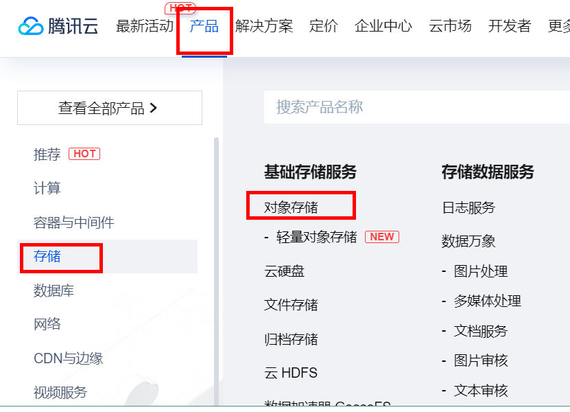
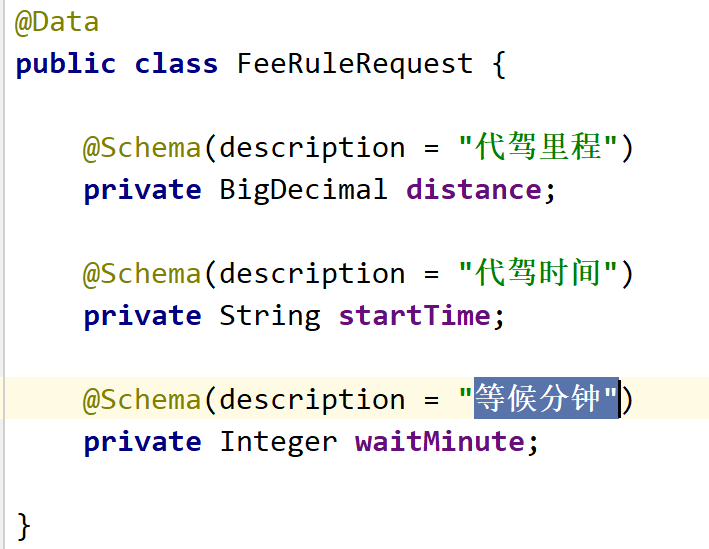
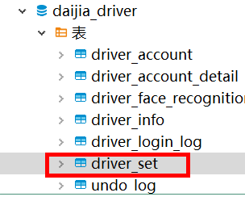
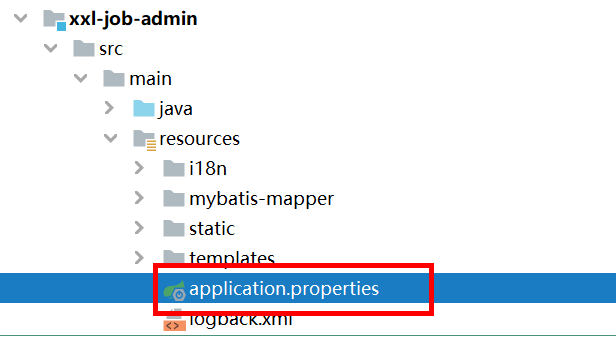
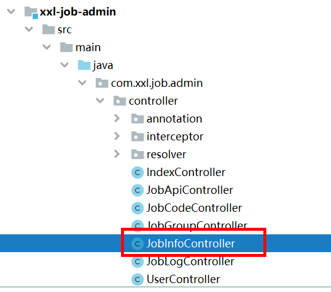
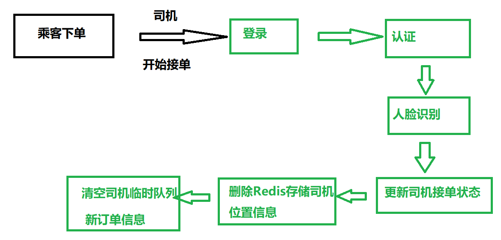
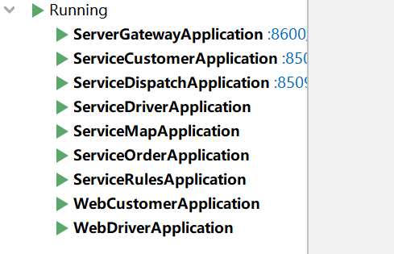

# 项目概述

## 1 背景和功能

* 代驾项目
* 采用微信小程序方式


## 2 技术概述

- **SpringBoot**：简化Spring应用的初始搭建以及开发过程
- **SpringCloud**：基于Spring Boot实现的云原生应用开发工具，SpringCloud使用的技术：（Spring Cloud Gateway、Spring Cloud Task和Spring Cloud Feign等）
- **SpringBoot+SpringCloudAlibaba(Nacos，Sentinel) + OpenFeign + Gateway**
- MyBatis-Plus：持久层框架，也依赖mybatis
- Redis：内存做缓存
- Redisson：基于redis的Java驻内存数据网格 - 框架；操作redis的框架
- MongoDB: 分布式文件存储的数据库
- RabbitMQ：消息中间件；大型分布式项目是标配；分布式事务最终一致性
- Seata：分布式事务
- Drools：规则引擎，计算预估费用、取消费用等等
- GEO：GPS分区定位计算
- ThreadPoolExecutor+CompletableFuture：异步编排，线程池来实现异步操作，提高效率
- XXL-JOB: 分布式定时任务调用中心
- Knife4J/YAPI：Api接口文档工具
- MinIO（私有化对象存储集群）：分布式文件存储 类似于OSS（公有）
- 微信支付：微信支付与微信分账
- MySQL：关系型数据库 {shardingSphere-jdbc 进行读写分离; 分库，分表}
- Lombok: 实体类的中get/set 生成的jar包
- Natapp：内网穿透
- Docker：容器化技术;  生产环境Redis（运维人员）；快速搭建环境Docker run


## 3 技术架构


## 4 业务流程


## 5 导入微服务模块

* 使用idea打开项目
* 修改maven和jdk环境
* 下载依赖


# 搭建环境

## 搭建环境-前端环境

### 1 搭建前端环境概述


### 2 注册微信开发者账号

第一步 搜索 微信公众平台

第二步 点击立即注册，注册开发者账号


第三步 选择注册类型，小程序


第四步 按照页面提示，填写相关信息


第五步 填写注册信息之后，完成注册，进行登录。

* 在微信公众平台首页，使用微信扫描登录


第六步 填写小程序类目

* 代驾


### 3 开通服务与插件

#### 3.1 获取appid和app秘钥


#### 3.2 开通服务


#### 3.3 开通插件


* 在浏览器输入两个地址

https://fuwu.weixin.qq.com/search?tab=3&type=&serviceType=3&page=1&kw=腾讯位置服务地图选点

https://fuwu.weixin.qq.com/search?tab=3&type=&serviceType=3&page=1&kw=微信同声传译


### 4 安装Node.js

* 到官方网站下载Node.js软件

https://nodejs.org/en/download


* 按照提示，一步一步进行操作就可以了


### 5 安装微信开发者工具

* 因为微信小程序，没有上线，在微信开发者工具进行微信小程序功能测试

* 官网下载安装软件


* 按照提示，下一步下一步安装就可以了

* 特别注意：

微信开发者工具需要安装两次，两次安装过程相同的，不同是安装目录不一样


### 6 微信开发者工具运行前端项目

* 使用两个微信开发者工具，分别导入司机端和乘客端前端代码

* 导入过程中，信任和开放端口


## 搭建环境-后端环境

### 1 搭建后端环境概述


### 2 安装软件环境

* **安装MySQL数据库**

第一步 拉取镜像

docker pull mysql:8.0.30

第二步 使用容器启动服务

docker run --name gmalldocker\_mysql --restart=always -v /home/ljaer/mysql:/var/lib/mysql -p 3306:3306 -e MYSQL\_ROOT\_PASSWORD=root -d mysql:8.0.30


* **安装rabbitmq**

**第一步 拉取镜像**

docker pull rabbitmq:3.12.0-management

**第二步 使用容器启动服务**

docker run -d --name=rabbitmq --restart=always -p 5672:5672 -p 15672:15672 rabbitmq:3.12.0-management  

**第三步 安装延迟队列插件** 

1、首先下载rabbitmq_delayed_message_exchange-3.12.0.ez文件上传到RabbitMQ所在服务器，下载地址：https://www.rabbitmq.com/community-plugins.html


2、上传下载延迟队列插件到Linux操作系统中，切换到插件所在目录，

执行 docker cp rabbitmq_delayed_message_exchange-3.12.0.ez rabbitmq :/plugins 命令，将刚插件拷贝到容器内plugins目录下


3、执行 docker exec -it rabbitmq /bin/bash 命令进入到容器内部，并 cd plugins 进入plugins目录

执行 ls -l|grep delay  命令查看插件是否copy成功

在容器内plugins目录下，执行 rabbitmq-plugins enable rabbitmq_delayed_message_exchange  命令启用插件


4、exit命令退出RabbitMQ容器内部，然后执行 docker restart rabbitmq 命令重启RabbitMQ容器


* **安装Redis**


* **安装nacos**


* **安装minio**


### 3 导入数据库

* 到资料里面找到创建数据库和表语句
* 使用工具连接MySQL数据库
* 在工具里面执行创建数据库和表语句


### 4 导入配置文件到Nacos里面

* Nacos组件：注册中心和配置中心
* 打开Nacos控制台，输入地址：ip:8848/nacos

* 两种导入方式

第一种方式：一个一个创建yaml文件，复制文件内容

第二种方式：导入zip压缩包，压缩包名称DEFAULT_GROUP.zip

​                       在Nacos配置中心导入zip压缩包就可以了


### 5 启动项目测试

* **以server-gateway为例，测试项目是否正常启动**

**第一步 修改server-gateway模块配置文件**

bootstrap.properties文件修改实际Nacos地址

```properties
spring.application.name=server-gateway
spring.profiles.active=dev
spring.main.allow-bean-definition-overriding=true
spring.cloud.nacos.discovery.server-addr=192.168.6.129:8848
spring.cloud.nacos.config.server-addr=192.168.6.129:8848
spring.cloud.nacos.config.prefix=${spring.application.name}
spring.cloud.nacos.config.file-extension=yaml
```

**第二步 找到Nacos配置中心对应配置文件yaml，进行修改**

**第三步 启动server-gateway服务进行测试**


* **以service-coupon为例，测试项目是否正常启动**

**第一步 修改service-coupon模块配置文件**

bootstrap.properties文件修改实际Nacos地址

```
spring.application.name=service-coupon
spring.profiles.active=dev
spring.main.allow-bean-definition-overriding=true
spring.cloud.nacos.discovery.server-addr=192.168.6.129:8848
spring.cloud.nacos.config.server-addr=192.168.6.129:8848
spring.cloud.nacos.config.prefix=${spring.application.name}
spring.cloud.nacos.config.file-extension=yaml
spring.cloud.nacos.config.shared-configs[0].data-id=common-account.yaml
```

**第二步 找到Nacos配置中心对应配置文件yaml，进行修改**

```yaml
server:
  port: 8511
mybatis-plus:
  configuration:
    log-impl: org.apache.ibatis.logging.stdout.StdOutImpl # 查看日志
feign:
  sentinel:
    enabled: true
spring:
  main:
    allow-bean-definition-overriding: true #当遇到同样名字的时候，是否允许覆盖注册
  cloud:
    openfeign:
      lazy-attributes-resolution: true #开启懒加载，否则启动报错
      client:
        config:
          default:
            connectTimeout: 30000
            readTimeout: 30000
            loggerLevel: basic
  data:
    redis:
      host: 192.168.6.129
      port: 6379
      database: 0
      timeout: 1800000
      jedis:
        pool:
          max-active: 20 #最大连接数
          max-wait: -1    #最大阻塞等待时间(负数表示没限制)
          max-idle: 5    #最大空闲
          min-idle: 0     #最小空闲
  rabbitmq:
    host: 192.168.6.129
    port: 5672
    username: guest
    password: guest
  datasource:
    type: com.zaxxer.hikari.HikariDataSource
    driver-class-name: com.mysql.jdbc.Driver
    url: jdbc:mysql://192.168.6.129:3306/daijia_coupon?characterEncoding=utf-8&useSSL=false
    username: root
    password: root
    hikari:
      connection-test-query: SELECT 1
      connection-timeout: 60000
      idle-timeout: 500000
      max-lifetime: 540000
      maximum-pool-size: 10
      minimum-idle: 5
      pool-name: GuliHikariPool
  jackson:
    date-format: yyyy-MM-dd HH:mm:ss
    time-zone: GMT+8
seata:
  tx-service-group: daijia_tx_group
  enable-auto-data-source-proxy: false
```

**第三步 启动service-coupon服务进行测试**


# 技术点：Mybatis-Plus

## 1 Mybatis-Plus概述

* 官方网站：baomidou.com
* [MyBatis-Plus (opens new window)](https://github.com/baomidou/mybatis-plus)（简称 MP）是一个 [MyBatis (opens new window)](https://www.mybatis.org/mybatis-3/)的增强工具，在 MyBatis 的基础上只做增强不做改变，为简化开发、提高效率而生。
* 使用Mybatis-Plus，如果实现**单表**操作，不需要编写sql语句，封装方法，使用封装的这些方法方便实现

* 如果复杂查询，或者多表查询，还需要编写sql语句实现


## 2 Mybatis-Plus入门案例


**第一步 创建数据库和表**

* 数据库mybatis_plus
* 表

```sql
CREATE TABLE user
(
    id BIGINT(20) NOT NULL COMMENT '主键ID',
    name VARCHAR(30) NULL DEFAULT NULL COMMENT '姓名',
    age INT(11) NULL DEFAULT NULL COMMENT '年龄',
    email VARCHAR(50) NULL DEFAULT NULL COMMENT '邮箱',
    PRIMARY KEY (id)
);

INSERT INTO user (id, name, age, email) VALUES
(1, 'Jone', 18, 'test1@baomidou.com'),
(2, 'Jack', 20, 'test2@baomidou.com'),
(3, 'Tom', 28, 'test3@baomidou.com'),
(4, 'Sandy', 21, 'test4@baomidou.com'),
(5, 'Billie', 24, 'test5@baomidou.com');
```

**第二步 创建springBoot工程，引入mp相关依赖**

```xml
<?xml version="1.0" encoding="UTF-8"?>
<project xmlns="http://maven.apache.org/POM/4.0.0"
         xmlns:xsi="http://www.w3.org/2001/XMLSchema-instance"
         xsi:schemaLocation="http://maven.apache.org/POM/4.0.0 http://maven.apache.org/xsd/maven-4.0.0.xsd">
    <modelVersion>4.0.0</modelVersion>

    <groupId>com.atguigu</groupId>
    <artifactId>mybatis_plus_demo</artifactId>
    <version>1.0-SNAPSHOT</version>

    <parent>
        <groupId>org.springframework.boot</groupId>
        <artifactId>spring-boot-starter-parent</artifactId>
        <version>3.0.5</version>
        <relativePath/> <!-- lookup parent from repository -->
    </parent>

    <properties>
        <maven.compiler.source>17</maven.compiler.source>
        <maven.compiler.target>17</maven.compiler.target>
    </properties>

    <dependencies>
        <dependency>
            <groupId>org.springframework.boot</groupId>
            <artifactId>spring-boot-starter</artifactId>
        </dependency>

        <dependency>
            <groupId>org.springframework.boot</groupId>
            <artifactId>spring-boot-starter-test</artifactId>
            <scope>test</scope>
        </dependency>

        <!--mybatis-plus-->
        <dependency>
            <groupId>com.baomidou</groupId>
            <artifactId>mybatis-plus-boot-starter</artifactId>
            <version>3.5.3.1</version>
        </dependency>

        <!--mysql-->
        <dependency>
            <groupId>mysql</groupId>
            <artifactId>mysql-connector-java</artifactId>
            <version>8.0.30</version>
        </dependency>

        <!--lombok用来简化实体类-->
        <dependency>
            <groupId>org.projectlombok</groupId>
            <artifactId>lombok</artifactId>
        </dependency>
    </dependencies>

</project>
```

**第三步 创建springBoot配置文件，指定数据库路径**

```properties
#mysql数据库连接
spring.datasource.driver-class-name=com.mysql.cj.jdbc.Driver
spring.datasource.url=jdbc:mysql://localhost:3306/mybatis_plus?serverTimezone=GMT%2B8&useSSL=false
spring.datasource.username=root
spring.datasource.password=root
#mybatis日志
mybatis-plus.configuration.log-impl=org.apache.ibatis.logging.stdout.StdOutImpl
```

**第四步 创建springBoot启动类**

```java
@SpringBootApplication
public class DemoApplication {

    public static void main(String[] args) {
        SpringApplication.run(DemoApplication.class,args);
    }
}
```

**第五步 创建实体类**

```java
@Data
public class User {
    private Long id;
    private String name;
    private Integer age;
    private String email;
}
```

**第六步 创建mapper，继承BaseMapper**

```java
public interface UserMapper extends BaseMapper<User> {
}
```

```java
@SpringBootApplication
@MapperScan("com.atguigu.mapper")
public class DemoApplication {

    public static void main(String[] args) {
        SpringApplication.run(DemoApplication.class,args);
    }
}
```

**测试代码**

```java
@SpringBootTest
public class MpDemo1 {
    
    //注入mapper
    @Autowired
    private UserMapper userMapper;

    //查询所有记录
    @Test
    public void findAll() {
        List<User> list = userMapper.selectList(null);
        list.forEach(user->{
            System.out.println(user.getName());
            System.out.println(user.getAge());
        });
    }
}
```


## 3 Mybatis-Plus的CURD操作

```java
@SpringBootTest
public class MpDemo1 {

    //注入mapper
    @Autowired
    private UserMapper userMapper;

    //1 查询所有记录 selectList
    @Test
    public void findAll() {
        List<User> list = userMapper.selectList(null);
        list.forEach(user->{
            System.out.println(user.getName()+":"+user.getAge());
        });
    }

    //2 添加操作insert
    @Test
    public void addUser() {
        //创建对象，设置值
        User user = new User();
        user.setName("东方不败");
        user.setAge(30);
        user.setEmail("dfbb@atguigu.com");
        //调用方法
        int rows = userMapper.insert(user);
        System.out.println(rows);
        System.out.println(user);
    }

    //3 根据id查询
    @Test
    public void getUserById() {
        User user = userMapper.selectById(1L);
        System.out.println(user);
    }

    //4 修改操作
    @Test
    public void updateUser() {
        //根据id查询
        User user = userMapper.selectById(1L);

        //设置修改值
        user.setName("岳不群");
        user.setAge(50);

        //调用方法完成修改
        int rows = userMapper.updateById(user);
        System.out.println(rows);
    }

    //5 删除操作
    @Test
    public void deleteUser() {
        userMapper.deleteById(2L);
    }

    //6 条件查询
}
```

### 逻辑删除


第一步 表添加逻辑删除标志位字段


第二步 在对应实体类添加逻辑删除标志属性，在属性上面添加注解


第三步 在配置文件指定逻辑删除规则，默认0没有删除，1删除

* 细节问题：查询时候，只会查询到没有删除的数据（mp封装）


### 条件查询

```java
//6 条件查询
//select * from user where name=? and age=?
@Test
public void select1() {
    //封装条件对象
    LambdaQueryWrapper<User> wrapper = new LambdaQueryWrapper<>();
    wrapper.eq(User::getName,"Tom");
    wrapper.eq(User::getAge,28);
    //调用方法
    List<User> list = userMapper.selectList(wrapper);
    list.forEach(user->{
        System.out.println(user.getName()+":"+user.getAge());
    });
}

//select * from user where age>=28
@Test
public void select2() {
    LambdaQueryWrapper<User> wrapper = new LambdaQueryWrapper<>();
    wrapper.ge(User::getAge,28);
    //调用方法
    List<User> list = userMapper.selectList(wrapper);
    list.forEach(user->{
        System.out.println(user.getName()+":"+user.getAge());
    });
}

//select * from user name like ?
@Test
public void select3() {
    LambdaQueryWrapper<User> wrapper = new LambdaQueryWrapper<>();
    wrapper.like(User::getName,"m");
    //调用方法
    List<User> list = userMapper.selectList(wrapper);
    list.forEach(user->{
        System.out.println(user.getName()+":"+user.getAge());
    });
}
```


## 4 Mybatis-Plus主键策略

* mp默认主键策略，生成唯一的值


### 第一个策略：ASSIGN_ID

* 生成唯一的值，包含数字，表对应字段类型bigint或者varchar类型


### 第二个策略：ASSIGN_UUID

* 生成唯一的值，包含数字和字母，表对应字段类型varchar类型


### 第三个策略：AUTO

* 主键自动增长效果，和表字段auto_increment

  

### 第四个策略：INPUT

* 需要手动设置id值


## 5 Mybatis-Plus分页查询

* mp自带分页插件，只需要简单配置，方便实现分页查询操作

第一步 创建配置类，配置分页插件

```java
@Configuration
public class MpConfig {

    //配置分页插件
    /**
     * 分页插件
     */
    @Bean
    public MybatisPlusInterceptor optimisticLockerInnerInterceptor(){
        MybatisPlusInterceptor interceptor = new MybatisPlusInterceptor();
        //向Mybatis过滤器链中添加分页拦截器
        interceptor.addInnerInterceptor(new PaginationInnerInterceptor(DbType.MYSQL));
        return interceptor;
    }

}
```

第二步 调用mapper里面方法进行分页查询

```java
//分页查询
@Test
public void selectPage() {
    //创建page对象，传递分页参数：当前页和每页显示记录数
    Page<User> page = new Page<>(1,3);
    
    //调用mapper里面方法实现分页查询，返回Page对象，Page对象里面包含分页之后所有数据
    IPage<User> pageModel = userMapper.selectPage(page, null);
    List<User> list = pageModel.getRecords();
    list.forEach(user->{
        System.out.println(user.getName()+"::"+user.getAge());
    });
    long total = pageModel.getTotal();
    System.out.println(total);
}
```


# 乘客端登录

## 乘客端登录：需求

* 微信小程序登录
* 如果第一次使用微信登录，完成注册，添加微信信息到用户表里面
* 如何判断是否第一次登录，通过openid进行判断


## 乘客端登录：微信小程序登录流程


## 乘客端登录：微信小程序登录接口

### 1 准备工作

* 项目工程结构


* 引入微信工具包相关依赖

在service-customer里面引入依赖

```xml
<dependencies>
    <dependency>
        <groupId>com.github.binarywang</groupId>
        <artifactId>weixin-java-miniapp</artifactId>
    </dependency>
</dependencies>
```


* 修改Nacos配置中心配置文件

在项目配置文件进行修改bootstrap.properties

```properties
spring.application.name=service-customer
spring.profiles.active=dev
spring.main.allow-bean-definition-overriding=true
spring.cloud.nacos.discovery.server-addr=192.168.6.129:8848
spring.cloud.nacos.config.server-addr=192.168.6.129:8848
spring.cloud.nacos.config.prefix=${spring.application.name}
spring.cloud.nacos.config.file-extension=yaml
spring.cloud.nacos.config.shared-configs[0].data-id=common-account.yaml
```

Nacos配置中心common-account.yaml

```yaml
wx:
  miniapp:
    appId: 你的微信小程序id  # 小程序微信公众平台appId
    secret: 你的微信小程序id秘钥  # 小程序微信公众平台api秘钥
```


* 创建配置类，读取配置文件信息

在service-customer创建包config，创建类，读取配置文件内容

```java
@Component
@Data
@ConfigurationProperties(prefix = "wx.miniapp")
public class WxConfigProperties {
    private String appId;
    private String secret;
}
```


* 创建微信工具包对象

```java
@Component
public class WxConfigOperator {

    @Autowired
    private WxConfigProperties wxConfigProperties;

    @Bean
    public WxMaService wxMaService() {
        //微信小程序id和秘钥
        WxMaDefaultConfigImpl wxMaConfig = new WxMaDefaultConfigImpl();
        wxMaConfig.setAppid(wxConfigProperties.getAppId());
        wxMaConfig.setSecret(wxConfigProperties.getSecret());

        WxMaService service = new WxMaServiceImpl();
        service.setWxMaConfig(wxMaConfig);
        return service;
    }
}
```


### 2 功能具体实现-基础模块


* 在service-customer的CustomerInfoController

```java
@Slf4j
@RestController
@RequestMapping("/customer/info")
@SuppressWarnings({"unchecked", "rawtypes"})
public class CustomerInfoController {

   @Autowired
   private CustomerInfoService customerInfoService;

   //微信小程序登录接口
   @Operation(summary = "小程序授权登录")
   @GetMapping("/login/{code}")
   public Result<Long> login(@PathVariable String code) {
      return Result.ok(customerInfoService.login(code));
   }
}
```


* service实现接口

```java
@Slf4j
@Service
@SuppressWarnings({"unchecked", "rawtypes"})
public class CustomerInfoServiceImpl extends ServiceImpl<CustomerInfoMapper, CustomerInfo> implements CustomerInfoService {

    @Autowired
    private WxMaService wxMaService;
    
    @Autowired
    private CustomerInfoMapper customerInfoMapper;

    @Autowired
    private CustomerLoginLogMapper customerLoginLogMapper;

    //微信小程序登录接口
    @Override
    public Long login(String code) {
        //1 获取code值，使用微信工具包对象，获取微信唯一标识openid
        String openid = null;
        try {
            WxMaJscode2SessionResult sessionInfo =
                    wxMaService.getUserService().getSessionInfo(code);
            openid = sessionInfo.getOpenid();
        } catch (WxErrorException e) {
            throw new RuntimeException(e);
        }

        //2 根据openid查询数据库表，判断是否第一次登录
        //如果openid不存在返回null，如果存在返回一条记录
        //select * from customer_info ci where ci.wx_open_id = ''
        LambdaQueryWrapper<CustomerInfo> wrapper = new LambdaQueryWrapper<>();
        wrapper.eq(CustomerInfo::getWxOpenId,openid);
        CustomerInfo customerInfo = customerInfoMapper.selectOne(wrapper);

        //3 如果第一次登录，添加信息到用户表
        if(customerInfo == null) {
            customerInfo = new CustomerInfo();
            customerInfo.setNickname(String.valueOf(System.currentTimeMillis()));
            customerInfo.setAvatarUrl("https://oss.aliyuncs.com/aliyun_id_photo_bucket/default_handsome.jpg");
            customerInfo.setWxOpenId(openid);
            customerInfoMapper.insert(customerInfo);
        }

        //4 记录登录日志信息
        CustomerLoginLog customerLoginLog = new CustomerLoginLog();
        customerLoginLog.setCustomerId(customerInfo.getId());
        customerLoginLog.setMsg("小程序登录");
        customerLoginLogMapper.insert(customerLoginLog);

        //5 返回用户id
        return customerInfo.getId();
    }
}
```


### 3 功能具体实现-远程调用

* service-customer-client定义接口

```java
@FeignClient(value = "service-customer")
public interface CustomerInfoFeignClient {

    @GetMapping("/customer/info/login/{code}")
    public Result<Long> login(@PathVariable String code);

}
```

* 在web-customer进行远程调用

**controller**

```java
@Slf4j
@Tag(name = "客户API接口管理")
@RestController
@RequestMapping("/customer")
@SuppressWarnings({"unchecked", "rawtypes"})
public class CustomerController {

    @Autowired
    private CustomerService customerInfoService;

    @Operation(summary = "小程序授权登录")
    @GetMapping("/login/{code}")
    public Result<String> wxLogin(@PathVariable String code) {
        return Result.ok(customerInfoService.login(code));
    }
}
```


**service**

```java
@Slf4j
@Service
@SuppressWarnings({"unchecked", "rawtypes"})
public class CustomerServiceImpl implements CustomerService {

    //注入远程调用接口
    @Autowired
    private CustomerInfoFeignClient client;

    @Autowired
    private RedisTemplate redisTemplate;

    @Override
    public String login(String code) {
        //1 拿着code进行远程调用，返回用户id
        Result<Long> loginResult = client.login(code);

        //2 判断如果返回失败了，返回错误提示
        Integer codeResult = loginResult.getCode();
        if(codeResult != 200) {
            throw new GuiguException(ResultCodeEnum.DATA_ERROR);
        }

        //3 获取远程调用返回用户id
        Long customerId = loginResult.getData();

        //4 判断返回用户id是否为空，如果为空，返回错误提示
        if(customerId == null) {
            throw new GuiguException(ResultCodeEnum.DATA_ERROR);
        }

        //5 生成token字符串
        String token = UUID.randomUUID().toString().replaceAll("-","");

        //6 把用户id放到Redis，设置过期时间
        // key:token  value:customerId
        //redisTemplate.opsForValue().set(token,customerId.toString(),30, TimeUnit.MINUTES);
        redisTemplate.opsForValue().set(RedisConstant.USER_LOGIN_KEY_PREFIX+token,
                                     customerId.toString(),
                                     RedisConstant.USER_LOGIN_KEY_TIMEOUT,
                                     TimeUnit.SECONDS);

        //7 返回token
        return token;
    }
}
```


### 4 接口测试

* 运行乘客端微信小程序（微信开发者工具）


* 启动后端服务

-- 启动网关服务

-- 启动service-customer服务

-- 启动web-customer服务


## 乘客端登录：获取登录用户信息接口

### 1 实现流程


### 2 service-customer接口

### controller

```java
@Operation(summary = "获取客户登录信息")
@GetMapping("/getCustomerLoginInfo/{customerId}")
public Result<CustomerLoginVo> getCustomerLoginInfo(@PathVariable Long customerId) {
   CustomerLoginVo customerLoginVo = customerInfoService.getCustomerInfo(customerId);
   return Result.ok(customerLoginVo);
}
```


### service

```java
//获取客户登录信息
@Override
public CustomerLoginVo getCustomerInfo(Long customerId) {
    //1 根据用户id查询用户信息
    CustomerInfo customerInfo = customerInfoMapper.selectById(customerId);

    //2 封装到CustomerLoginVo
    CustomerLoginVo customerLoginVo = new CustomerLoginVo();
    //customerLoginVo.setNickname(customerInfo.getNickname());
    BeanUtils.copyProperties(customerInfo,customerLoginVo);

    //@Schema(description = "是否绑定手机号码")
    //    private Boolean isBindPhone;
    String phone = customerInfo.getPhone();
    boolean isBindPhone = StringUtils.hasText(phone);
    customerLoginVo.setIsBindPhone(isBindPhone);

    //3 CustomerLoginVo返回
    return customerLoginVo;
}
```


### 3 web-customer接口

### controller

```java
    @Operation(summary = "获取客户登录信息")
    @GetMapping("/getCustomerLoginInfo")
    public Result<CustomerLoginVo>
                    getCustomerLoginInfo(@RequestHeader(value = "token") String token) {
        //1 从请求头获取token字符串
//        HttpServletRequest request
//        String token = request.getHeader("token");

        //调用service
        CustomerLoginVo customerLoginVo = customerInfoService.getCustomerLoginInfo(token);

        return Result.ok(customerLoginVo);
    }
```


### service

```java
    @Override
    public CustomerLoginVo getCustomerLoginInfo(String token) {
        //2 根据token查询redis
        //3 查询token在redis里面对应用户id
        String customerId =
                (String)redisTemplate.opsForValue()
                        .get(RedisConstant.USER_LOGIN_KEY_PREFIX + token);

        if(StringUtils.isEmpty(customerId)) {
            throw new GuiguException(ResultCodeEnum.DATA_ERROR);
        }
//        if(!StringUtils.hasText(customerId)) {
//            throw new GuiguException(ResultCodeEnum.DATA_ERROR);
//        }

        //4 根据用户id进行远程调用 得到用户信息
        Result<CustomerLoginVo> customerLoginVoResult =
                customerInfoFeignClient.getCustomerLoginInfo(Long.parseLong(customerId));

        Integer code = customerLoginVoResult.getCode();
        if(code != 200) {
            throw new GuiguException(ResultCodeEnum.DATA_ERROR);
        }

        CustomerLoginVo customerLoginVo = customerLoginVoResult.getData();
        if(customerLoginVo == null) {
            throw new GuiguException(ResultCodeEnum.DATA_ERROR);
        }
        //5 返回用户信息
        return customerLoginVo;
    }
```


# 乘客端登录：登录校验

## 1 分析过程

* **如何判断是否登录状态？**

-- 判断请求头里面是否包含token字符串

-- 根据token查询redis


* **如何实现？**

-- 原始方式：在需要判断登录的controller进行上面判断（token和redis）

-- 如果使用原始方式，功能肯定可以实现的，但是造成有大量重复代码

-- 对这样方式进行优化


* **如何优化？**

-- 使用**自定义注解** + **aop** 进行优化


* **aop基础知识**


* **aop实现流程**


## 2 创建注解

```java
//登录判断
@Target(ElementType.METHOD)
@Retention(RetentionPolicy.RUNTIME)
public @interface GuiguLogin {
    
}
```


## 3 创建切面类

```java
@Component
@Aspect  //切面类
public class GuiguLoginAspect {

    @Autowired
    private RedisTemplate redisTemplate;

    //环绕通知，登录判断
    //切入点表达式：指定对哪些规则的方法进行增强
    @Around("execution(* com.atguigu.daijia.*.controller.*.*(..)) && @annotation(guiguLogin)")
    public Object login(ProceedingJoinPoint proceedingJoinPoint,GuiguLogin guiguLogin)  throws Throwable {

        //1 获取request对象
        RequestAttributes attributes = RequestContextHolder.getRequestAttributes();
        ServletRequestAttributes sra = (ServletRequestAttributes)attributes;
        HttpServletRequest request = sra.getRequest();

        //2 从请求头获取token
        String token = request.getHeader("token");

        //3 判断token是否为空，如果为空，返回登录提示
        if(!StringUtils.hasText(token)) {
            throw new GuiguException(ResultCodeEnum.LOGIN_AUTH);
        }

        //4 token不为空，查询redis
        String customerId = (String)redisTemplate.opsForValue()
                           .get(RedisConstant.USER_LOGIN_KEY_PREFIX+token);

        //5 查询redis对应用户id，把用户id放到ThreadLocal里面
        if(StringUtils.hasText(customerId)) {
            AuthContextHolder.setUserId(Long.parseLong(customerId));
        }

        //6 执行业务方法
        return proceedingJoinPoint.proceed();
    }

}
```


# 乘客端登录：获取微信手机号

## 1 流程


## 2 service-customer

### controller

```java
@Operation(summary = "更新客户微信手机号码")
@PostMapping("/updateWxPhoneNumber")
public Result<Boolean> updateWxPhoneNumber(@RequestBody UpdateWxPhoneForm updateWxPhoneForm) {
   return Result.ok(customerInfoService.updateWxPhoneNumber(updateWxPhoneForm));
}
```


### service

```java
////更新客户微信手机号码
@Override
public Boolean updateWxPhoneNumber(UpdateWxPhoneForm updateWxPhoneForm) {
    //1 根据code值获取微信绑定手机号码
    try {
        WxMaPhoneNumberInfo phoneNoInfo =
                wxMaService.getUserService().getPhoneNoInfo(updateWxPhoneForm.getCode());
        String phoneNumber = phoneNoInfo.getPhoneNumber();
        
        //更新用户信息
        Long customerId = updateWxPhoneForm.getCustomerId();
        CustomerInfo customerInfo = customerInfoMapper.selectById(customerId);
        customerInfo.setPhone(phoneNumber);
        customerInfoMapper.updateById(customerInfo);
        
        return true;
    } catch (WxErrorException e) {
        throw new GuiguException(ResultCodeEnum.DATA_ERROR);
    }
}
```


## 3 web-customer

### controller

```java
@Operation(summary = "更新用户微信手机号")
@GuiguLogin
@PostMapping("/updateWxPhone")
public Result updateWxPhone(@RequestBody UpdateWxPhoneForm updateWxPhoneForm) {
    updateWxPhoneForm.setCustomerId(AuthContextHolder.getUserId());
    return Result.ok(customerInfoService.updateWxPhoneNumber(updateWxPhoneForm));
}
```

### service

```java
//更新用户微信手机号
@Override
public Boolean updateWxPhoneNumber(UpdateWxPhoneForm updateWxPhoneForm) {
    Result<Boolean> booleanResult = customerInfoFeignClient.updateWxPhoneNumber(updateWxPhoneForm);
    return true;
}
```


# 司机端登录与认证


## 司机端微信小程序登录

### 1 准备工作

* 引入微信工具包依赖

```xml
<dependencies>
    <dependency>
        <groupId>com.github.binarywang</groupId>
        <artifactId>weixin-java-miniapp</artifactId>
    </dependency>
</dependencies>
```


* 修改项目配置文件和Nacos里面配置文件内容


* 创建类，读取配置文件内容，微信小程序id和秘钥

-- 因为司机端和乘客端相同的，从乘客端直接复制相关类就可以了

```java
@Component
@Data
@ConfigurationProperties(prefix = "wx.miniapp")
public class WxConfigProperties {
    private String appId;
    private String secret;
}
```


* 创建类，初始化微信工具包相关对象

```java
@Component
public class WxConfigOperator {

    @Autowired
    private WxConfigProperties wxConfigProperties;

    @Bean
    public WxMaService wxMaService() {

        //微信小程序id和秘钥
        WxMaDefaultConfigImpl wxMaConfig = new WxMaDefaultConfigImpl();
        wxMaConfig.setAppid(wxConfigProperties.getAppId());
        wxMaConfig.setSecret(wxConfigProperties.getSecret());

        WxMaService service = new WxMaServiceImpl();
        service.setWxMaConfig(wxMaConfig);
        return service;
    }
}
```


### 2 接口开发


#### service-driver

**DriverInfoController**

```java
@Tag(name = "司机API接口管理")
@RestController
@RequestMapping(value="/driver/info")
@SuppressWarnings({"unchecked", "rawtypes"})
public class DriverInfoController {

    @Autowired
    private DriverInfoService driverInfoService;

    @Operation(summary = "小程序授权登录")
    @GetMapping("/login/{code}")
    public Result<Long> login(@PathVariable String code) {
        return Result.ok(driverInfoService.login(code));
    }

}
```

**service**

```java
@Slf4j
@Service
@SuppressWarnings({"unchecked", "rawtypes"})
public class DriverInfoServiceImpl extends ServiceImpl<DriverInfoMapper, DriverInfo> implements DriverInfoService {

    @Autowired
    private WxMaService wxMaService;

    @Autowired
    private DriverInfoMapper driverInfoMapper;

    @Autowired
    private DriverSetMapper driverSetMapper;

    @Autowired
    private DriverAccountMapper driverAccountMapper;

    @Autowired
    private DriverLoginLogMapper driverLoginLogMapper;
    
    //小程序授权登录
    @Override
    public Long login(String code) {
        try {
            //根据code + 小程序id + 秘钥请求微信接口，返回openid
            WxMaJscode2SessionResult sessionInfo =
                    wxMaService.getUserService().getSessionInfo(code);
            String openid = sessionInfo.getOpenid();

            //根据openid查询是否第一次登录
            LambdaQueryWrapper<DriverInfo> wrapper = new LambdaQueryWrapper<>();
            wrapper.eq(DriverInfo::getWxOpenId,openid);
            DriverInfo driverInfo = driverInfoMapper.selectOne(wrapper);

            if(driverInfo == null) {
                //添加司机基本信息
                driverInfo = new DriverInfo();
                driverInfo.setNickname(String.valueOf(System.currentTimeMillis()));
                driverInfo.setAvatarUrl("https://oss.aliyuncs.com/aliyun_id_photo_bucket/default_handsome.jpg");
                driverInfo.setWxOpenId(openid);
                driverInfoMapper.insert(driverInfo);

                //初始化司机设置
                DriverSet driverSet = new DriverSet();
                driverSet.setDriverId(driverInfo.getId());
                driverSet.setOrderDistance(new BigDecimal(0));//0：无限制
                driverSet.setAcceptDistance(new BigDecimal(SystemConstant.ACCEPT_DISTANCE));//默认接单范围：5公里
                driverSet.setIsAutoAccept(0);//0：否 1：是
                driverSetMapper.insert(driverSet);

                //初始化司机账户信息
                DriverAccount driverAccount = new DriverAccount();
                driverAccount.setDriverId(driverInfo.getId());
                driverAccountMapper.insert(driverAccount);
            }

            //记录司机登录信息
            DriverLoginLog driverLoginLog = new DriverLoginLog();
            driverLoginLog.setDriverId(driverInfo.getId());
            driverLoginLog.setMsg("小程序登录");
            driverLoginLogMapper.insert(driverLoginLog);

            //返回司机id
            return driverInfo.getId();
        } catch (WxErrorException e) {
            throw new GuiguException(ResultCodeEnum.DATA_ERROR);
        }
    }
}
```


#### service-client远程调用定义

```java
@FeignClient(value = "service-driver")
public interface DriverInfoFeignClient {

    /**
     * 小程序授权登录
     * @param code
     * @return
     */
    @GetMapping("/driver/info/login/{code}")
    Result<Long> login(@PathVariable("code") String code);
}
```


#### web-driver

**controller**

```java
@Slf4j
@Tag(name = "司机API接口管理")
@RestController
@RequestMapping(value="/driver")
@SuppressWarnings({"unchecked", "rawtypes"})
public class DriverController {

    @Autowired
    private DriverService driverService;

    @Operation(summary = "小程序授权登录")
    @GetMapping("/login/{code}")
    public Result<String> login(@PathVariable String code) {
        return Result.ok(driverService.login(code));
    }

}
```

**service**

```java
@Slf4j
@Service
@SuppressWarnings({"unchecked", "rawtypes"})
public class DriverServiceImpl implements DriverService {

    @Autowired
    private DriverInfoFeignClient driverInfoFeignClient;

    @Autowired
    private RedisTemplate redisTemplate;

    //登录
    @Override
    public String login(String code) {
        //远程调用，得到司机id
        Result<Long> longResult = driverInfoFeignClient.login(code);
        //TODO 判断
        Long driverId = longResult.getData();

        //token字符串
        String token = UUID.randomUUID().toString().replaceAll("-","");
        //放到redis，设置过期时间
        redisTemplate.opsForValue().set(RedisConstant.USER_LOGIN_KEY_PREFIX + token,
                                             driverId.toString(), 
                                             RedisConstant.USER_LOGIN_KEY_TIMEOUT, 
                                             TimeUnit.SECONDS);
        return token;
    }
}
```


## 获取登录司机信息


### 1 service-driver

**controller**

```java
@Operation(summary = "获取司机登录信息")
@GetMapping("/getDriverLoginInfo/{driverId}")
public Result<DriverLoginVo> getDriverInfo(@PathVariable Long driverId) {
    DriverLoginVo driverLoginVo = driverInfoService.getDriverInfo(driverId);
    return Result.ok(driverLoginVo);
}
```

**service**

```java
//获取司机登录信息
@Override
public DriverLoginVo getDriverInfo(Long driverId) {
    //根据司机id获取司机信息
    DriverInfo driverInfo = driverInfoMapper.selectById(driverId);
    
    //driverInfo -- DriverLoginVo
    DriverLoginVo driverLoginVo = new DriverLoginVo();
    BeanUtils.copyProperties(driverInfo,driverLoginVo);
    
    //是否建档人脸识别
    String faceModelId = driverInfo.getFaceModelId();
    boolean isArchiveFace = StringUtils.hasText(faceModelId);
    driverLoginVo.setIsArchiveFace(isArchiveFace);
    return driverLoginVo;
}
```


### 2 web-driver

```java
@Operation(summary = "获取司机登录信息")
@GuiguLogin
@GetMapping("/getDriverLoginInfo")
public Result<DriverLoginVo> getDriverLoginInfo() {
    //1 获取用户id
    Long driverId = AuthContextHolder.getUserId();
    //2 远程调用获取司机信息
    Result<DriverLoginVo> loginVoResult = driverInfoFeignClient.getDriverLoginInfo(driverId);
    DriverLoginVo driverLoginVo = loginVoResult.getData();
    return Result.ok(driverLoginVo);
}
```


## 司机登录和获取信息测试

* 启动前端微信小程序服务


* 启动后端服务

-- 网关服务：server-gateway

-- 司机基础服务：service-driver

-- 司机对外访问服务：web-driver


## 开通腾讯云对象存储COS

### 1 腾讯云对象存储概述



* 我们项目基于腾讯云对象存储服务COS，存储司机认证相关资料（身份证、驾驶证）

* 要使用腾讯云对象存储服务，首先进行开通，注册腾讯云之后，开通就可以了
* 使用对象存储服务，可以在控制台里面进行操作，也可以使用Java代码进行操作，这些操作，腾讯云官方提供详细文档说明，按照文档就方便进行操作


## 腾讯云对象存储上传接口

* 官方文档地址

https://cloud.tencent.com/document/product/436/10199


### 1 web-driver

#### controller

```java
@Tag(name = "腾讯云cos上传接口管理")
@RestController
@RequestMapping(value="/cos")
@SuppressWarnings({"unchecked", "rawtypes"})
public class CosController {

    @Autowired
    private CosService cosService;

    //文件上传接口
    @Operation(summary = "上传")
    //@GuiguLogin
    @PostMapping("/upload")
    public Result<CosUploadVo> upload(@RequestPart("file") MultipartFile file,
                                      @RequestParam(name = "path",defaultValue = "auth") String path) {
        CosUploadVo cosUploadVo = cosService.uploadFile(file,path);
        return Result.ok(cosUploadVo);
    }
}
```

#### service

```java
@Slf4j
@Service
@SuppressWarnings({"unchecked", "rawtypes"})
public class CosServiceImpl implements CosService {
    
    @Autowired
    private CosFeignClient cosFeignClient;

    //文件上传接口
    @Override
    public CosUploadVo uploadFile(MultipartFile file, String path) {
        //远程调用
        Result<CosUploadVo> cosUploadVoResult = cosFeignClient.upload(file,path);
        CosUploadVo cosUploadVo = cosUploadVoResult.getData();
        return cosUploadVo;
    }
}
```

#### 远程调用接口定义

```java
@FeignClient(value = "service-driver")
public interface CosFeignClient {

    //文件上传
    @PostMapping(value = "/cos/upload", consumes = MediaType.MULTIPART_FORM_DATA_VALUE)
    Result<CosUploadVo> upload(@RequestPart("file") MultipartFile file, @RequestParam("path") String path);
}
```


### 2 service-driver

#### 准备工作

* 引入腾讯云依赖

```xml
<dependency>
     <groupId>com.qcloud</groupId>
     <artifactId>cos_api</artifactId>
</dependency>
```

* 把腾讯云需要值放到配置文件


* 创建类读取配置文件内容

```java
@Data
@Component
@ConfigurationProperties(prefix = "tencent.cloud")
public class TencentCloudProperties {

    private String secretId;
    private String secretKey;
    private String region;
    private String bucketPrivate;
}
```

#### controller

```java
@Slf4j
@Tag(name = "腾讯云cos上传接口管理")
@RestController
@RequestMapping(value="/cos")
@SuppressWarnings({"unchecked", "rawtypes"})
public class CosController {

    @Autowired
    private CosService cosService;
    
    @Operation(summary = "上传")
    @PostMapping("/upload")
    public Result<CosUploadVo> upload(@RequestPart("file") MultipartFile file, 
                                      @RequestParam("path") String path) {
        CosUploadVo cosUploadVo = cosService.upload(file,path);
        return Result.ok(cosUploadVo);
    }

}
```

#### service

```JAVA
@Slf4j
@Service
@SuppressWarnings({"unchecked", "rawtypes"})
public class CosServiceImpl implements CosService {

    @Autowired
    private TencentCloudProperties tencentCloudProperties;

    @Override
    public CosUploadVo upload(MultipartFile file, String path) {
        // 1 初始化用户身份信息（secretId, secretKey）。
        String secretId = tencentCloudProperties.getSecretId();
        String secretKey = tencentCloudProperties.getSecretKey();
        COSCredentials cred = new BasicCOSCredentials(secretId, secretKey);
        // 2 设置 bucket 的地域, COS 地域
        Region region = new Region(tencentCloudProperties.getRegion());
        ClientConfig clientConfig = new ClientConfig(region);
        // 这里建议设置使用 https 协议
        clientConfig.setHttpProtocol(HttpProtocol.https);
        // 3 生成 cos 客户端。
        COSClient cosClient = new COSClient(cred, clientConfig);

        //文件上传
        //元数据信息
        ObjectMetadata meta = new ObjectMetadata();
        meta.setContentLength(file.getSize());
        meta.setContentEncoding("UTF-8");
        meta.setContentType(file.getContentType());

        //向存储桶中保存文件
        String fileType = file.getOriginalFilename().substring(file.getOriginalFilename().lastIndexOf(".")); //文件后缀名
        String uploadPath = "/driver/" + path + "/" + UUID.randomUUID().toString().replaceAll("-", "") + fileType;
        // 01.jpg
        // /driver/auth/0o98754.jpg
        PutObjectRequest putObjectRequest = null;
        try {
            //1 bucket名称
            //2
            putObjectRequest = new PutObjectRequest(tencentCloudProperties.getBucketPrivate(),
                    uploadPath,
                    file.getInputStream(),
                    meta);
        } catch (IOException e) {
            throw new RuntimeException(e);
        }
        putObjectRequest.setStorageClass(StorageClass.Standard);
        PutObjectResult putObjectResult = cosClient.putObject(putObjectRequest); //上传文件
        cosClient.shutdown();

        //返回vo对象
        CosUploadVo cosUploadVo = new CosUploadVo();
        cosUploadVo.setUrl(uploadPath);
        //TODO 图片临时访问url，回显使用
        cosUploadVo.setShowUrl("");
        return cosUploadVo;
    }
}
```


### 3 获取临时签名URL

##### CosService创建方法

```java
//获取临时签名URL
@Override
public String getImageUrl(String path) {
    if(!StringUtils.hasText(path)) return "";
    //获取cosclient对象
    COSClient cosClient = this.getCosClient();
    //GeneratePresignedUrlRequest
    GeneratePresignedUrlRequest request =
            new GeneratePresignedUrlRequest(tencentCloudProperties.getBucketPrivate(),
                     path, HttpMethodName.GET);
    //设置临时URL有效期为15分钟
    Date date = new DateTime().plusMinutes(15).toDate();
    request.setExpiration(date);
    //调用方法获取
    URL url = cosClient.generatePresignedUrl(request);
    cosClient.shutdown();
    return url.toString();
}
```


### 4 上传接口完善


```java
@Override
public CosUploadVo upload(MultipartFile file, String path) {
    //获取cosClient对象
    COSClient cosClient = this.getCosClient();
    //文件上传
    //元数据信息
    ObjectMetadata meta = new ObjectMetadata();
    meta.setContentLength(file.getSize());
    meta.setContentEncoding("UTF-8");
    meta.setContentType(file.getContentType());

    //向存储桶中保存文件
    String fileType = file.getOriginalFilename().substring(file.getOriginalFilename().lastIndexOf(".")); //文件后缀名
    String uploadPath = "/driver/" + path + "/" + UUID.randomUUID().toString().replaceAll("-", "") + fileType;
    // 01.jpg
    // /driver/auth/0o98754.jpg
    PutObjectRequest putObjectRequest = null;
    try {
        //1 bucket名称
        //2
        putObjectRequest = new PutObjectRequest(tencentCloudProperties.getBucketPrivate(),
                uploadPath,
                file.getInputStream(),
                meta);
    } catch (IOException e) {
        throw new RuntimeException(e);
    }
    putObjectRequest.setStorageClass(StorageClass.Standard);
    PutObjectResult putObjectResult = cosClient.putObject(putObjectRequest); //上传文件
    cosClient.shutdown();

    //返回vo对象
    CosUploadVo cosUploadVo = new CosUploadVo();
    cosUploadVo.setUrl(uploadPath);
    //图片临时访问url，回显使用
    String imageUrl = this.getImageUrl(uploadPath);
    cosUploadVo.setShowUrl(imageUrl);
    return cosUploadVo;
}
```


## 腾讯云身份证认证接口

### 1 需求概述

司机注册成功之后，应该引导他去做实名认证，这就需要用到腾讯云身份证识别和云存储功能了

身份证识别API地址：https://cloud.tencent.com/document/product/866/33524


### 2 实现流程分析

文档地址：https://console.cloud.tencent.com/api/explorer?Product=ocr&Version=2018-11-19&Action=IDCardOCR


### 3 service-driver

#### 引入ocr相关依赖

```java
<dependency>
    <groupId>com.tencentcloudapi</groupId>
    <artifactId>tencentcloud-sdk-java</artifactId>
    <version>${tencentcloud.version}</version>
</dependency>
```

#### OcrController

```java
@Tag(name = "腾讯云识别接口管理")
@RestController
@RequestMapping(value="/ocr")
@SuppressWarnings({"unchecked", "rawtypes"})
public class OcrController {
	
    @Autowired
    private OcrService ocrService;

    @Operation(summary = "身份证识别")
    @PostMapping("/idCardOcr")
    public Result<IdCardOcrVo> idCardOcr(@RequestPart("file") MultipartFile file) {
        IdCardOcrVo idCardOcrVo = ocrService.idCardOcr(file);
        return Result.ok(idCardOcrVo);
    }
}
```

#### OcrService

```java
@Slf4j
@Service
@SuppressWarnings({"unchecked", "rawtypes"})
public class OcrServiceImpl implements OcrService {

    @Autowired
    private TencentCloudProperties tencentCloudProperties;
    
    @Autowired
    private CosService cosService;
    //身份证识别
    @Override
    public IdCardOcrVo idCardOcr(MultipartFile file) {
        try{
            //图片转换base64格式字符串
            byte[] base64 = Base64.encodeBase64(file.getBytes());
            String fileBase64 = new String(base64);

            // 实例化一个认证对象，入参需要传入腾讯云账户 SecretId 和 SecretKey，此处还需注意密钥对的保密
            Credential cred = new Credential(tencentCloudProperties.getSecretId(),
                                             tencentCloudProperties.getSecretKey());
            // 实例化一个http选项，可选的，没有特殊需求可以跳过
            HttpProfile httpProfile = new HttpProfile();
            httpProfile.setEndpoint("ocr.tencentcloudapi.com");
            // 实例化一个client选项，可选的，没有特殊需求可以跳过
            ClientProfile clientProfile = new ClientProfile();
            clientProfile.setHttpProfile(httpProfile);
            // 实例化要请求产品的client对象,clientProfile是可选的
            OcrClient client = new OcrClient(cred,tencentCloudProperties.getRegion(), clientProfile);
            // 实例化一个请求对象,每个接口都会对应一个request对象
            IDCardOCRRequest req = new IDCardOCRRequest();
            //设置文件
            req.setImageBase64(fileBase64);

            // 返回的resp是一个IDCardOCRResponse的实例，与请求对象对应
            IDCardOCRResponse resp = client.IDCardOCR(req);
            
            //转换为IdCardOcrVo对象
            IdCardOcrVo idCardOcrVo = new IdCardOcrVo();
            if (StringUtils.hasText(resp.getName())) {
                //身份证正面
                idCardOcrVo.setName(resp.getName());
                idCardOcrVo.setGender("男".equals(resp.getSex()) ? "1" : "2");
                idCardOcrVo.setBirthday(DateTimeFormat.forPattern("yyyy/MM/dd").parseDateTime(resp.getBirth()).toDate());
                idCardOcrVo.setIdcardNo(resp.getIdNum());
                idCardOcrVo.setIdcardAddress(resp.getAddress());

                //上传身份证正面图片到腾讯云cos
                CosUploadVo cosUploadVo = cosService.upload(file, "idCard");
                idCardOcrVo.setIdcardFrontUrl(cosUploadVo.getUrl());
                idCardOcrVo.setIdcardFrontShowUrl(cosUploadVo.getShowUrl());
            } else {
                //身份证反面
                //证件有效期："2010.07.21-2020.07.21"
                String idcardExpireString = resp.getValidDate().split("-")[1];
                idCardOcrVo.setIdcardExpire(DateTimeFormat.forPattern("yyyy.MM.dd").parseDateTime(idcardExpireString).toDate());
                //上传身份证反面图片到腾讯云cos
                CosUploadVo cosUploadVo = cosService.upload(file, "idCard");
                idCardOcrVo.setIdcardBackUrl(cosUploadVo.getUrl());
                idCardOcrVo.setIdcardBackShowUrl(cosUploadVo.getShowUrl());
            }
            return idCardOcrVo;
        } catch (Exception e) {
            throw new GuiguException(ResultCodeEnum.DATA_ERROR);
        }
    }
}
```


#### service-client定义接口

```java
@FeignClient(value = "service-driver")
public interface OcrFeignClient {

    /**
     * 身份证识别
     * @param file
     * @return
     */
    @PostMapping(value = "/ocr/idCardOcr", consumes = MediaType.MULTIPART_FORM_DATA_VALUE)
    Result<IdCardOcrVo> idCardOcr(@RequestPart("file") MultipartFile file);
}
```


### 4 web-driver

```java
@Tag(name = "腾讯云识别接口管理")
@RestController
@RequestMapping(value="/ocr")
@SuppressWarnings({"unchecked", "rawtypes"})
public class OcrController {

    @Autowired
    private OcrService ocrService;
    
    @Operation(summary = "身份证识别")
    @GuiguLogin
    @PostMapping("/idCardOcr")
    public Result<IdCardOcrVo> uploadDriverLicenseOcr(@RequestPart("file") MultipartFile file) {
        return Result.ok(ocrService.idCardOcr(file));
    }
}
```


```java
@Service
@SuppressWarnings({"unchecked", "rawtypes"})
public class OcrServiceImpl implements OcrService {

    @Autowired
    private OcrFeignClient ocrFeignClient;

    //身份证识别
    @Override
    public IdCardOcrVo idCardOcr(MultipartFile file) {
        Result<IdCardOcrVo> ocrVoResult = ocrFeignClient.idCardOcr(file);
        IdCardOcrVo idCardOcrVo = ocrVoResult.getData();
        return idCardOcrVo;
    }
}
```


## 腾讯云驾驶证识别接口

### 1 service-driver

```java
@Operation(summary = "驾驶证识别")
@PostMapping("/driverLicenseOcr")
public Result<DriverLicenseOcrVo> driverLicenseOcr(@RequestPart("file") MultipartFile file) {
    return Result.ok(ocrService.driverLicenseOcr(file));
}
```


```java
    ////驾驶证识别
    @Override
    public DriverLicenseOcrVo driverLicenseOcr(MultipartFile file) {
        try{
            //图片转换base64格式字符串
            byte[] base64 = Base64.encodeBase64(file.getBytes());
            String fileBase64 = new String(base64);
            
            // 实例化一个认证对象，入参需要传入腾讯云账户 SecretId 和 SecretKey，此处还需注意密钥对的保密
            Credential cred = new Credential(tencentCloudProperties.getSecretId(),
                    tencentCloudProperties.getSecretKey());
            // 实例化一个http选项，可选的，没有特殊需求可以跳过
            HttpProfile httpProfile = new HttpProfile();
            httpProfile.setEndpoint("ocr.tencentcloudapi.com");
            // 实例化一个client选项，可选的，没有特殊需求可以跳过
            ClientProfile clientProfile = new ClientProfile();
            clientProfile.setHttpProfile(httpProfile);
            // 实例化要请求产品的client对象,clientProfile是可选的
            OcrClient client = new OcrClient(cred, tencentCloudProperties.getRegion(),
                                                clientProfile);
            // 实例化一个请求对象,每个接口都会对应一个request对象
            DriverLicenseOCRRequest req = new DriverLicenseOCRRequest();
            req.setImageBase64(fileBase64);
            
            // 返回的resp是一个DriverLicenseOCRResponse的实例，与请求对象对应
            DriverLicenseOCRResponse resp = client.DriverLicenseOCR(req);

            //封装到vo对象里面
            DriverLicenseOcrVo driverLicenseOcrVo = new DriverLicenseOcrVo();
            if (StringUtils.hasText(resp.getName())) {
                //驾驶证正面
                //驾驶证名称要与身份证名称一致
                driverLicenseOcrVo.setName(resp.getName());
                driverLicenseOcrVo.setDriverLicenseClazz(resp.getClass_());
                driverLicenseOcrVo.setDriverLicenseNo(resp.getCardCode());
                driverLicenseOcrVo.setDriverLicenseIssueDate(DateTimeFormat.forPattern("yyyy-MM-dd").parseDateTime(resp.getDateOfFirstIssue()).toDate());
                driverLicenseOcrVo.setDriverLicenseExpire(DateTimeFormat.forPattern("yyyy-MM-dd").parseDateTime(resp.getEndDate()).toDate());

                //上传驾驶证反面图片到腾讯云cos
                CosUploadVo cosUploadVo = cosService.upload(file, "driverLicense");
                driverLicenseOcrVo.setDriverLicenseFrontUrl(cosUploadVo.getUrl());
                driverLicenseOcrVo.setDriverLicenseFrontShowUrl(cosUploadVo.getShowUrl());
            } else {
                //驾驶证反面
                //上传驾驶证反面图片到腾讯云cos
                CosUploadVo cosUploadVo =  cosService.upload(file, "driverLicense");
                driverLicenseOcrVo.setDriverLicenseBackUrl(cosUploadVo.getUrl());
                driverLicenseOcrVo.setDriverLicenseBackShowUrl(cosUploadVo.getShowUrl());
            }

            return driverLicenseOcrVo;
        } catch (Exception e) {
            e.printStackTrace();
            throw new GuiguException(ResultCodeEnum.DATA_ERROR);
        }
    }
```


### 2 servic-client接口定义

```java
/**
 * 驾驶证识别
 * @param file
 * @return
 */
@PostMapping(value = "/ocr/driverLicenseOcr", consumes = MediaType.MULTIPART_FORM_DATA_VALUE)
Result<DriverLicenseOcrVo> driverLicenseOcr(@RequestPart("file") MultipartFile file);
```


### 3 web-driver

```java
@Operation(summary = "驾驶证识别")
@GuiguLogin
@PostMapping("/driverLicenseOcr")
public Result<DriverLicenseOcrVo> driverLicenseOcr(@RequestPart("file") MultipartFile file) {
    return Result.ok(ocrService.driverLicenseOcr(file));
}
```

```java
//驾驶证识别
@Override
public DriverLicenseOcrVo driverLicenseOcr(MultipartFile file) {
    Result<DriverLicenseOcrVo> driverLicenseOcrVoResult = ocrFeignClient.driverLicenseOcr(file);
    DriverLicenseOcrVo driverLicenseOcrVo = driverLicenseOcrVoResult.getData();
    return driverLicenseOcrVo;
}
```


## 获取司机的认证信息

* 司机进行操作首先进行登录，登录成功之后，进行认证，跳转到认证页面完成认证
* **查看认证信息**，进入到认证页面时候，回显证件信息


### 1 service-driver

* **controller**

```java
@Operation(summary = "获取司机认证信息")
@GetMapping("/getDriverAuthInfo/{driverId}")
public Result<DriverAuthInfoVo> getDriverAuthInfo(@PathVariable Long driverId) {
    DriverAuthInfoVo driverAuthInfoVo = driverInfoService.getDriverAuthInfo(driverId);
    return Result.ok(driverAuthInfoVo);
}
```

* **service**

```java
//获取司机认证信息
@Override
public DriverAuthInfoVo getDriverAuthInfo(Long driverId) {
    DriverInfo driverInfo = driverInfoMapper.selectById(driverId);
    DriverAuthInfoVo driverAuthInfoVo = new DriverAuthInfoVo();
    BeanUtils.copyProperties(driverInfo,driverAuthInfoVo);
 driverAuthInfoVo.setIdcardBackShowUrl(cosService.getImageUrl(driverAuthInfoVo.getIdcardBackUrl()));
    driverAuthInfoVo.setIdcardFrontShowUrl(cosService.getImageUrl(driverAuthInfoVo.getIdcardFrontUrl()));
    driverAuthInfoVo.setIdcardHandShowUrl(cosService.getImageUrl(driverAuthInfoVo.getIdcardHandUrl()));
    driverAuthInfoVo.setDriverLicenseFrontShowUrl(cosService.getImageUrl(driverAuthInfoVo.getDriverLicenseFrontUrl()));
    driverAuthInfoVo.setDriverLicenseBackShowUrl(cosService.getImageUrl(driverAuthInfoVo.getDriverLicenseBackUrl()));
    driverAuthInfoVo.setDriverLicenseHandShowUrl(cosService.getImageUrl(driverAuthInfoVo.getDriverLicenseHandUrl()));

    return driverAuthInfoVo;
}
```

* **service-client接口定义**

```java
/**
 * 获取司机认证信息
 * @param driverId
 * @return
 */
@GetMapping("/driver/info/getDriverAuthInfo/{driverId}")
Result<DriverAuthInfoVo> getDriverAuthInfo(@PathVariable("driverId") Long driverId);
```


### 2 web-driver

```java
@Operation(summary = "获取司机认证信息")
@GuiguLogin
@GetMapping("/getDriverAuthInfo")
public Result<DriverAuthInfoVo> getDriverAuthInfo() {
    //获取登录用户id，当前是司机id
    Long driverId = AuthContextHolder.getUserId();
    return Result.ok(driverService.getDriverAuthInfo(driverId));
}
```


```java
//司机认证信息
@Override
public DriverAuthInfoVo getDriverAuthInfo(Long driverId) {
    Result<DriverAuthInfoVo> authInfoVoResult = driverInfoFeignClient.getDriverAuthInfo(driverId);
    DriverAuthInfoVo driverAuthInfoVo = authInfoVoResult.getData();
    return driverAuthInfoVo;
}
```


## 修改司机认证信息

### 1 功能分析

**认证状态：**

​	 0:未认证 【刚注册完为未认证状态】

​	1：审核中 【提交了认证信息后变为审核中】

​	2：认证通过 【后台审核通过】

​	-1：认证未通过【后台审核不通过】

* **第一次登录时候，完成用户注册，注册时候，当前认证状态值是0（未认证）**
* **上传认证信息（填写认证资料）之后，进行提交，提交之后，当前认证状态值1（审核中）**
* **司机端提交审核资料之后，后台管理员对提交资料进行审核，审核通过，认证状态值2，审核没有通过，认证状态值-1**


**司机开启接单的条件：**

1、登录

2、认证通过

3、建立了腾讯云人员库人员

4、当日验证了人脸识别


### 2 service-driver

```java
//更新司机认证信息
@Operation(summary = "更新司机认证信息")
@PostMapping("/updateDriverAuthInfo")
public Result<Boolean> updateDriverAuthInfo(@RequestBody UpdateDriverAuthInfoForm updateDriverAuthInfoForm) {
    Boolean isSuccess = driverInfoService.updateDriverAuthInfo(updateDriverAuthInfoForm);
    return Result.ok(isSuccess);
}
```


```java
    //更新司机认证信息
    @Override
    public Boolean updateDriverAuthInfo(UpdateDriverAuthInfoForm updateDriverAuthInfoForm) {
        //获取司机id
        Long driverId = updateDriverAuthInfoForm.getDriverId();

        //修改操作
        DriverInfo driverInfo = new DriverInfo();
        driverInfo.setId(driverId);
        BeanUtils.copyProperties(updateDriverAuthInfoForm,driverInfo);

//        int i = driverInfoMapper.updateById(driverInfo);
        boolean update = this.updateById(driverInfo);
        return update;
    }
```


* service-client接口定义

```java
 /**
     * 更新司机认证信息
     * @param updateDriverAuthInfoForm
     * @return
     */
@PostMapping("/driver/info/updateDriverAuthInfo")
Result<Boolean> UpdateDriverAuthInfo(@RequestBody UpdateDriverAuthInfoForm updateDriverAuthInfoForm);
```


### 3 web-driver

```java
@Operation(summary = "更新司机认证信息")
@GuiguLogin
@PostMapping("/updateDriverAuthInfo")
public Result<Boolean> updateDriverAuthInfo(@RequestBody UpdateDriverAuthInfoForm updateDriverAuthInfoForm) {
    updateDriverAuthInfoForm.setDriverId(AuthContextHolder.getUserId());
    return Result.ok(driverService.updateDriverAuthInfo(updateDriverAuthInfoForm));
}
```


```java
//更新司机认证信息
@Override
public Boolean updateDriverAuthInfo(UpdateDriverAuthInfoForm updateDriverAuthInfoForm) {
    Result<Boolean> booleanResult = driverInfoFeignClient.UpdateDriverAuthInfo(updateDriverAuthInfoForm);
    Boolean data = booleanResult.getData();
    return data;
}
```


## 开通人脸识别

新注册的司机进行人脸信息采集，类似于在公司里面进行人脸录入，每天进行人脸打卡

### 1 腾讯云人脸识别

* **开通人脸识别**


* **创建人员库**


### 2 创建司机人脸模型

#### 准备工作

* 修改配置文件值


* 修改项目配置类

```java
@Data
@Component
@ConfigurationProperties(prefix = "tencent.cloud")
public class TencentCloudProperties {

    private String secretId;
    private String secretKey;
    private String region;
    private String bucketPrivate;

    private String persionGroupId;
}
```


* 根据腾讯云文档，使用java代码创建人脸模型

https://console.cloud.tencent.com/api/explorer?Product=iai&Version=2020-03-03&Action=CreatePerson


#### service-driver

```java
//创建司机人脸模型
@Operation(summary = "创建司机人脸模型")
@PostMapping("/creatDriverFaceModel")
public Result<Boolean> creatDriverFaceModel(@RequestBody DriverFaceModelForm driverFaceModelForm) {
    Boolean isSuccess = driverInfoService.creatDriverFaceModel(driverFaceModelForm);
    return Result.ok(isSuccess);
}
```

```java
//创建司机人脸模型
@Override
public Boolean creatDriverFaceModel(DriverFaceModelForm driverFaceModelForm) {
    //根据司机id获取司机信息
    DriverInfo driverInfo =
            driverInfoMapper.selectById(driverFaceModelForm.getDriverId());
    try{

        // 实例化一个认证对象，入参需要传入腾讯云账户 SecretId 和 SecretKey，此处还需注意密钥对的保密
        // 代码泄露可能会导致 SecretId 和 SecretKey 泄露，并威胁账号下所有资源的安全性。以下代码示例仅供参考，建议采用更安全的方式来使用密钥，请参见：https://cloud.tencent.com/document/product/1278/85305
        // 密钥可前往官网控制台 https://console.cloud.tencent.com/cam/capi 进行获取
        Credential cred = new Credential(tencentCloudProperties.getSecretId(),
                                        tencentCloudProperties.getSecretKey());
        // 实例化一个http选项，可选的，没有特殊需求可以跳过
        HttpProfile httpProfile = new HttpProfile();
        httpProfile.setEndpoint("iai.tencentcloudapi.com");
        // 实例化一个client选项，可选的，没有特殊需求可以跳过
        ClientProfile clientProfile = new ClientProfile();
        clientProfile.setHttpProfile(httpProfile);
        // 实例化要请求产品的client对象,clientProfile是可选的
        IaiClient client = new IaiClient(cred, tencentCloudProperties.getRegion(),
                                                 clientProfile);
        // 实例化一个请求对象,每个接口都会对应一个request对象
        CreatePersonRequest req = new CreatePersonRequest();
        //设置相关值
        req.setGroupId(tencentCloudProperties.getPersionGroupId());
        //基本信息
        req.setPersonId(String.valueOf(driverInfo.getId()));
        req.setGender(Long.parseLong(driverInfo.getGender()));
        req.setQualityControl(4L);
        req.setUniquePersonControl(4L);
        req.setPersonName(driverInfo.getName());
        req.setImage(driverFaceModelForm.getImageBase64());

        // 返回的resp是一个CreatePersonResponse的实例，与请求对象对应
        CreatePersonResponse resp = client.CreatePerson(req);
        // 输出json格式的字符串回包
        System.out.println(AbstractModel.toJsonString(resp));
        String faceId = resp.getFaceId();
        if(StringUtils.hasText(faceId)) {
            driverInfo.setFaceModelId(faceId);
            driverInfoMapper.updateById(driverInfo);
        }
    } catch (TencentCloudSDKException e) {
        e.printStackTrace();
        return false;
    }
    return true;
}
```

* service-client定义接口

```java
/**
 * 创建司机人脸模型
 * @param driverFaceModelForm
 * @return
 */
@PostMapping("/driver/info/creatDriverFaceModel")
Result<Boolean> creatDriverFaceModel(@RequestBody DriverFaceModelForm driverFaceModelForm);
```


#### web-driver

```java
@Operation(summary = "创建司机人脸模型")
@GuiguLogin
@PostMapping("/creatDriverFaceModel")
public Result<Boolean> creatDriverFaceModel(@RequestBody DriverFaceModelForm driverFaceModelForm) {
    driverFaceModelForm.setDriverId(AuthContextHolder.getUserId());
    return Result.ok(driverService.creatDriverFaceModel(driverFaceModelForm));
}
```


```java
//创建司机人脸模型
@Override
public Boolean creatDriverFaceModel(DriverFaceModelForm driverFaceModelForm) {
    Result<Boolean> booleanResult = driverInfoFeignClient.creatDriverFaceModel(driverFaceModelForm);
    return booleanResult.getData();
}
```


### 3 测试

* **准备工作**

准备身份证正反面照片

准备驾驶证正面照片

准备两个手持拍照

人脸识别使用（自己照片）


* **司机认证最终效果：**

最终在司机数据库表更新认证信息（身份证、驾驶证、人脸失败信息等等）


* **启动相关服务**

网关服务

service-driver服务

web-driver服务


* 两个细节

创建人脸识别模型之后，腾讯云返回模型id，获取模型id，更新到数据库表

字段：腾讯云人脸模型id face_model_id


提交完成认证资料之后，后台管理员认证资料审核，根据审核结果修改不同状态值

为了测试，收到修改认证通过 2


## 开通文字识别服务


# 预估订单数据-需求

* 乘客选择代驾起始点与终点，乘客下单前，先做代驾订单数据的预估，预估代驾里程、代驾时间、代驾金额及代驾的最佳驾驶线路


# 预估订单数据-查找乘客当前订单

* 如果乘客有代驾订单正在进行中，这个时候乘客不能再次下单了，只有等当前订单完成之后，才可以下单
* 这个功能因为订单相关，**后续再进行处理**，目前为了后续测试，临时跳过去，假设当前乘客没有订单

* 在web-customer创建接口

```java
@Tag(name = "订单API接口管理")
@RestController
@RequestMapping("/order")
@SuppressWarnings({"unchecked", "rawtypes"})
public class OrderController {

    //TODO 后续完善，目前假设乘客当前没有订单
    @Operation(summary = "查找乘客端当前订单")
    @GuiguLogin
    @GetMapping("/searchCustomerCurrentOrder")
    public Result<CurrentOrderInfoVo> searchCustomerCurrentOrder() {
        CurrentOrderInfoVo currentOrderInfoVo = new CurrentOrderInfoVo();
        currentOrderInfoVo.setIsHasCurrentOrder(false);
        return Result.ok(currentOrderInfoVo);
    }
}
```


# 预估订单数据-预估驾驶线路

## 1 开通腾讯位置服务

* 使用“腾讯位置服务地图选点”插件时，我们要开通“腾讯位置服务”，并且设置授权APP ID，这样才能使用正确使用选点服务。
* 开通腾讯位置服务

第一步 访问腾讯官网 https://lbs.qq.com/

第二步 进行注册，手机号或者微信或者其他方式

第三步 使用注册账号进行登录，找到控制台

第四步 在应用管理 -- 我的应用 ，创建应用


第五步 在创建应用中，添加key


第六步 找到添加key的值


## 2 开发腾讯地图服务接口

* 封装地图服务接口：代驾路线距离，线路规划，时间

* 修改Nacos配置文件，修改腾讯位置服务key


* 在service-map模块中编写接口


* controller

```java
@Tag(name = "地图API接口管理")
@RestController
@RequestMapping("/map")
@SuppressWarnings({"unchecked", "rawtypes"})
public class MapController {
    
    @Autowired
    private MapService mapService;

    @Operation(summary = "计算驾驶线路")
    @PostMapping("/calculateDrivingLine")
    public Result<DrivingLineVo> calculateDrivingLine(@RequestBody CalculateDrivingLineForm 
                                                                  calculateDrivingLineForm) {
        DrivingLineVo drivingLineVo = mapService.calculateDrivingLine(calculateDrivingLineForm);
        return Result.ok(drivingLineVo);
    }
}
```

* service

```java
@Service
@SuppressWarnings({"unchecked", "rawtypes"})
public class MapServiceImpl implements MapService {

    @Autowired
    private RestTemplate restTemplate;

    @Value("tencent.cloud.map")
    private String key;

    //计算驾驶线路
    @Override
    public DrivingLineVo calculateDrivingLine(CalculateDrivingLineForm calculateDrivingLineForm) {
        //请求腾讯提供接口，按照接口要求传递相关参数，返回需要结果
        //使用HttpClient，目前Spring封装调用工具使用RestTemplate
        //定义调用腾讯地址
        String url = "https://apis.map.qq.com/ws/direction/v1/driving/?from={from}&to={to}&key={key}";

        //封装传递参数
        Map<String,String> map = new HashMap();
        //开始位置
        // 经纬度：比如 北纬40 东京116
        map.put("from",calculateDrivingLineForm.getStartPointLatitude()+","+calculateDrivingLineForm.getStartPointLongitude());
        //结束位置
        map.put("to",calculateDrivingLineForm.getEndPointLatitude()+","+calculateDrivingLineForm.getEndPointLongitude());
        //key
        map.put("key",key);

        //使用RestTemplate调用 GET
        JSONObject result = restTemplate.getForObject(url, JSONObject.class, map);
        //处理返回结果
        //判断调用是否成功
        int status = result.getIntValue("status");
        if(status != 0) {//失败
            throw new GuiguException(ResultCodeEnum.MAP_FAIL);
        }

        //获取返回路线信息
        JSONObject route =
                result.getJSONObject("result").getJSONArray("routes").getJSONObject(0);

        //创建vo对象
        DrivingLineVo drivingLineVo = new DrivingLineVo();
        //预估时间
        drivingLineVo.setDuration(route.getBigDecimal("duration"));
        //距离  6.583 == 6.58 / 6.59
        drivingLineVo.setDistance(route.getBigDecimal("distance")
                 .divide(new BigDecimal(1000))
                .setScale(2, RoundingMode.HALF_UP));
        //路线
        drivingLineVo.setPolyline(route.getJSONArray("polyline"));

        return drivingLineVo;
    }
}
```


* 配置类

```java
@Configuration
public class MapConfig {

    @Bean
    public RestTemplate restTemplate() {
        return new RestTemplate();
    }
}
```


* 远程调用定义

```java
@FeignClient(value = "service-map")
public interface MapFeignClient {

    /**
     * 计算驾驶线路
     * @param calculateDrivingLineForm
     * @return
     */
    @PostMapping("/map/calculateDrivingLine")
    Result<DrivingLineVo> calculateDrivingLine(@RequestBody CalculateDrivingLineForm calculateDrivingLineForm);
}
```


# 预估订单数据-预估订单金额

## 1 需求

乘客选择了出发和结束的地点，计算预估金额是多少，根据约定规则进行金额计算。


## 2 费用规则

**代驾费用=里程费 + 等候费 + 远途费**

### 2.1 里程费

里程费=基础里程费+超出起步里程费


### 2.2 等候费


### 2.3 远途费


* 规则虽然是上面这样的，但是实际中，规则可能进行随时调整，比如油价上涨收取燃油附加费，比如大雪天气，费用增加等等

* 对于不经常变化的业务，我们通常是硬编码到程序中。但是经常变化的业务，我们就得把业务流程从代码中剥离出来，我们怎么从程序中剥离出去？这里就需要用到规则引擎了。


## 3 整合规则引擎Drools

* 引入相关依赖

```xml
<dependencies>
    <dependency>
        <groupId>org.drools</groupId>
        <artifactId>drools-core</artifactId>
    </dependency>
    <dependency>
        <groupId>org.drools</groupId>
        <artifactId>drools-compiler</artifactId>
    </dependency>
    <dependency>
        <groupId>org.drools</groupId>
        <artifactId>drools-decisiontables</artifactId>
    </dependency>
    <dependency>
        <groupId>org.drools</groupId>
        <artifactId>drools-mvel</artifactId>
    </dependency>
</dependencies>
```


* 创建Drools配置类

```java
@Configuration
public class DroolsConfig {
    // 制定规则文件的路径
    private static final String RULES_CUSTOMER_RULES_DRL = "rules/FeeRule.drl";

    @Bean
    public KieContainer kieContainer() {
        KieServices kieServices = KieServices.Factory.get();

        KieFileSystem kieFileSystem = kieServices.newKieFileSystem();
        kieFileSystem.write(ResourceFactory.newClassPathResource(RULES_CUSTOMER_RULES_DRL));
        KieBuilder kb = kieServices.newKieBuilder(kieFileSystem);
        kb.buildAll();

        KieModule kieModule = kb.getKieModule();
        KieContainer kieContainer = kieServices.newKieContainer(kieModule.getReleaseId());
        return kieContainer;
    }
}
```


* 创建规则文件


* 测试规则文件

```java
package com.atguigu.daijia

rule "rule_1"

    when
        eval(true)
    then
        System.out.println("规则成功");
end
```


* 测试类

```
@Test
public void test01() {
    // 开启会话
    KieSession kieSession = kieContainer.newKieSession();

    // 触发规则
    kieSession.fireAllRules();
    // 中止会话
    kieSession.dispose();
}
```


## 4 封装费用规则接口

### 4.1 封装输入和输出对象

* 输入对象



* 输出对象


### 4.2 费用规则文件

```java
package  com.atguigu.daijia

import com.atguigu.daijia.model.form.rules.FeeRuleRequest;
import java.math.BigDecimal;
import java.math.RoundingMode;

global com.atguigu.daijia.model.vo.rules.FeeRuleResponse feeRuleResponse;

/**
1.起步价
    00:00:00-06:59:59  19元(含3公里)
    07:00:00-23:59:59  19元(含5公里)
*/
rule "起步价 00:00:00-07:00:00  19元(含3公里)"
    salience 10          //指定优先级，数值越大优先级越高，不指定的情况下由上到下执行
    no-loop true         //防止陷入死循环
    when
        $rule:FeeRuleRequest(startTime >= "00:00:00" && startTime < "07:00:00")
    then
        //基础里程 3公里
        feeRuleResponse.setBaseDistance(new BigDecimal("3.0"));
        //收费19元 础里程费
        feeRuleResponse.setBaseDistanceFee(new BigDecimal("19.0"));
        //超出里程  超出基础里程的里程
        feeRuleResponse.setExceedDistance(new BigDecimal("0.0"));
        feeRuleResponse.setExceedDistancePrice(new BigDecimal("4.0"));
        System.out.println("00:00:00-07:00:00 " + feeRuleResponse.getBaseDistance() + "公里，起步价:" + feeRuleResponse.getBaseDistanceFee() + "元");
end

rule "起步价 07:00:00-23:59:59  19元(含5公里)"
    salience 10          //指定优先级，数值越大优先级越高，不指定的情况下由上到下执行
    no-loop true         //防止陷入死循环
    when
        /*规则条件，到工作内存中查找FeeRuleRequest对象
        里面出来的结果只能是ture或者false
        $rule是绑定变量名，可以任意命名，官方推荐$符号，定义了绑定变量名，可以在then部分操作fact对象*/
        $rule:FeeRuleRequest(startTime >= "07:00:00" && startTime <= "23:59:59")
    then
        feeRuleResponse.setBaseDistance(new BigDecimal("5.0"));
        feeRuleResponse.setBaseDistanceFee(new BigDecimal("19.0"));

        //5公里内里程费为0
        feeRuleResponse.setExceedDistance(new BigDecimal("0.0"));
        feeRuleResponse.setExceedDistancePrice(new BigDecimal("3.0"));
        System.out.println("07:00:00-23:59:59 " + feeRuleResponse.getBaseDistance() + "公里，起步价:" + feeRuleResponse.getBaseDistanceFee() + "元");
end

/**
2.里程费
    超出起步里程后开始计算
    00:00:00-06:59:59   4元/1公里
    07:00:00-23:59:59   3元/1公里
*/
rule "里程费 00:00:00-06:59:59 4元/1公里"
    salience 10          //指定优先级，数值越大优先级越高，不指定的情况下由上到下执行
    no-loop true         //防止陷入死循环
    when
        /*规则条件，到工作内存中查找FeeRuleRequest对象
        里面出来的结果只能是ture或者false
        $rule是绑定变量名，可以任意命名，官方推荐$符号，定义了绑定变量名，可以在then部分操作fact对象*/
        $rule:FeeRuleRequest(startTime >= "00:00:00"
            && startTime <= "06:59:59"
            && distance > 3.0)
    then
        BigDecimal exceedDistance = $rule.getDistance().subtract(new BigDecimal("3.0"));
        feeRuleResponse.setExceedDistance(exceedDistance);
        feeRuleResponse.setExceedDistancePrice(new BigDecimal("4.0"));
        System.out.println("里程费，超出里程:" + feeRuleResponse.getExceedDistance() + "公里，单价：" + feeRuleResponse.getExceedDistancePrice());
end
rule "里程费 07:00:00-23:59:59 3元/1公里"
    salience 10          //指定优先级，数值越大优先级越高，不指定的情况下由上到下执行
    no-loop true         //防止陷入死循环
    when
        /*规则条件，到工作内存中查找FeeRuleRequest对象
        里面出来的结果只能是ture或者false
        $rule是绑定变量名，可以任意命名，官方推荐$符号，定义了绑定变量名，可以在then部分操作fact对象*/
        $rule:FeeRuleRequest(startTime >= "07:00:00"
            && startTime <= "23:59:59"
            && distance > 5.0)
    then
        BigDecimal exceedDistance = $rule.getDistance().subtract(new BigDecimal("5.0"));
        feeRuleResponse.setExceedDistance(exceedDistance);
        feeRuleResponse.setExceedDistancePrice(new BigDecimal("3.0"));
        System.out.println("里程费，超出里程:" + feeRuleResponse.getExceedDistance() + "公里，单价：" + feeRuleResponse.getExceedDistancePrice());
end

/**
3.等候费
    等候10分钟后  1元/1分钟
*/
rule "等候费 等候10分钟后 1元/1分钟"
    salience 10          //指定优先级，数值越大优先级越高，不指定的情况下由上到下执行
    no-loop true         //防止陷入死循环
    when
        /*规则条件，到工作内存中查找FeeRuleRequest对象
        里面出来的结果只能是ture或者false
        $rule是绑定变量名，可以任意命名，官方推荐$符号，定义了绑定变量名，可以在then部分操作fact对象*/
        $rule:FeeRuleRequest(waitMinute > 10)
    then
        Integer exceedWaitMinute = $rule.getWaitMinute() - 10;
        feeRuleResponse.setBaseWaitMinute(10);
        feeRuleResponse.setExceedWaitMinute(exceedWaitMinute);
        feeRuleResponse.setExceedWaitMinutePrice(new BigDecimal("1.0"));
        System.out.println("等候费，超出分钟:" + feeRuleResponse.getExceedWaitMinute() + "分钟，单价：" + feeRuleResponse.getExceedWaitMinutePrice());
end
rule "无等候费"
    salience 10          //指定优先级，数值越大优先级越高，不指定的情况下由上到下执行
    no-loop true         //防止陷入死循环
    when
        /*规则条件，到工作内存中查找FeeRuleRequest对象
        里面出来的结果只能是ture或者false
        $rule是绑定变量名，可以任意命名，官方推荐$符号，定义了绑定变量名，可以在then部分操作fact对象*/
        $rule:FeeRuleRequest(waitMinute <= 10)
    then
        feeRuleResponse.setBaseWaitMinute(10);
        feeRuleResponse.setExceedWaitMinute(0);
        feeRuleResponse.setExceedWaitMinutePrice(new BigDecimal("1.0"));
        System.out.println("等候费：无");
end

/**
4.远途费
    订单行程超出12公里后每公里1元
*/
rule "远途费 订单行程超出12公里后每公里1元"
    salience 10          //指定优先级，数值越大优先级越高，不指定的情况下由上到下执行
    no-loop true         //防止陷入死循环
    when
        /*规则条件，到工作内存中查找FeeRuleRequest对象
        里面出来的结果只能是ture或者false
        $rule是绑定变量名，可以任意命名，官方推荐$符号，定义了绑定变量名，可以在then部分操作fact对象*/
        $rule:FeeRuleRequest(distance > 12.0)
    then
        BigDecimal exceedLongDistance = $rule.getDistance().subtract(new BigDecimal("12.0"));
        feeRuleResponse.setBaseLongDistance(new BigDecimal("12.0"));
        feeRuleResponse.setExceedLongDistance(exceedLongDistance);
        feeRuleResponse.setExceedLongDistancePrice(new BigDecimal("1.0"));
        System.out.println("远途费，超出公里:" + feeRuleResponse.getExceedLongDistance() + "公里，单价：" + feeRuleResponse.getExceedLongDistancePrice());
end
rule "无远途费"
    salience 10          //指定优先级，数值越大优先级越高，不指定的情况下由上到下执行
    no-loop true         //防止陷入死循环
    when
        /*规则条件，到工作内存中查找FeeRuleRequest对象
        里面出来的结果只能是ture或者false
        $rule是绑定变量名，可以任意命名，官方推荐$符号，定义了绑定变量名，可以在then部分操作fact对象*/
        $rule:FeeRuleRequest(distance <= 12.0)
    then
        feeRuleResponse.setBaseLongDistance(new BigDecimal("12.0"));
        feeRuleResponse.setExceedLongDistance(new BigDecimal("0"));
        feeRuleResponse.setExceedLongDistancePrice(new BigDecimal("0"));
        System.out.println("远途费：无");
end

/**
5.计算总金额
    订单总金额 = 基础里程费 + 超出基础里程的费 + 等候费 + 远程费
*/
rule "计算总金额"
    salience 10          //指定优先级，数值越大优先级越高，不指定的情况下由上到下执行
    no-loop true         //防止陷入死循环
    when
        /*规则条件，到工作内存中查找FeeRuleRequest对象
        里面出来的结果只能是ture或者false
        $rule是绑定变量名，可以任意命名，官方推荐$符号，定义了绑定变量名，可以在then部分操作fact对象*/
        $rule:FeeRuleRequest(distance > 0.0)
    then
        //订单总金额 = 基础里程费 + 超出基础里程的费 + 等候费 + 远程费
        BigDecimal distanceFee = feeRuleResponse.getBaseDistanceFee().add(feeRuleResponse.getExceedDistance().multiply(feeRuleResponse.getExceedDistancePrice()));
        BigDecimal waitFee = new BigDecimal(feeRuleResponse.getExceedWaitMinute()).multiply(feeRuleResponse.getExceedWaitMinutePrice());
        BigDecimal longDistanceFee = feeRuleResponse.getExceedLongDistance().multiply(feeRuleResponse.getExceedLongDistancePrice());
        
        BigDecimal totalAmount = distanceFee.add(waitFee).add(longDistanceFee);
        feeRuleResponse.setDistanceFee(distanceFee);
        feeRuleResponse.setWaitFee(waitFee);
        feeRuleResponse.setLongDistanceFee(longDistanceFee);
        feeRuleResponse.setTotalAmount(totalAmount);
        System.out.println("计算总金额:" + feeRuleResponse.getTotalAmount() + "元");
end
```


* 测试类

```java
/*
 *  1 00:00:00-06:59:59  19元(含3公里)   == 超出12公里
 *  2 00:00:00-06:59:59   4元/1公里      == 增加一公里，单价4元
 *  3 等候10分钟后  1元/1分钟             == 超过10分钟，单价1元
 *  4 订单行程超出12公里后每公里1元        == 超出3公里 ，单价 1元
 * 代驾总金额：19 + 12*4 + 10 + 3 = 80
 */
@Test
void test1() {
    FeeRuleRequest feeRuleRequest = new FeeRuleRequest();
    feeRuleRequest.setDistance(new BigDecimal(15.0));
    feeRuleRequest.setStartTime("01:59:59");
    feeRuleRequest.setWaitMinute(20);

    // 开启会话
    KieSession kieSession = kieContainer.newKieSession();

    FeeRuleResponse feeRuleResponse = new FeeRuleResponse();
    kieSession.setGlobal("feeRuleResponse", feeRuleResponse);
    // 设置订单对象
    kieSession.insert(feeRuleRequest);
    // 触发规则
    kieSession.fireAllRules();
    // 中止会话
    kieSession.dispose();
    System.out.println("后："+JSON.toJSONString(feeRuleResponse));
}
```


## 5 预估订单金额接口

### 5.1 FeeRuleController

```java
@RestController
@RequestMapping("/rules/fee")
@SuppressWarnings({"unchecked", "rawtypes"})
public class FeeRuleController {

    @Autowired
    private FeeRuleService feeRuleService;

    @Operation(summary = "计算订单费用")
    @PostMapping("/calculateOrderFee")
    public Result<FeeRuleResponseVo> calculateOrderFee(@RequestBody FeeRuleRequestForm calculateOrderFeeForm) {
        FeeRuleResponseVo feeRuleResponseVo = feeRuleService.calculateOrderFee(calculateOrderFeeForm);
        return Result.ok(feeRuleResponseVo);
    }

}
```


### 5.2 FeeRuleService

```java
//计算订单费用
@Override
public FeeRuleResponseVo calculateOrderFee(FeeRuleRequestForm calculateOrderFeeForm) {
    
    //封装输入对象
    FeeRuleRequest feeRuleRequest = new FeeRuleRequest();
    feeRuleRequest.setDistance(calculateOrderFeeForm.getDistance());
    Date startTime = calculateOrderFeeForm.getStartTime();
    feeRuleRequest.setStartTime(new DateTime(startTime).toString("HH:mm:ss"));
    feeRuleRequest.setWaitMinute(calculateOrderFeeForm.getWaitMinute());
    
    //Drools使用
    KieSession kieSession = kieContainer.newKieSession();
    
    //封装返回对象
    FeeRuleResponse feeRuleResponse = new FeeRuleResponse();
    kieSession.setGlobal("feeRuleResponse",feeRuleResponse);
    
    kieSession.insert(feeRuleRequest);
    kieSession.fireAllRules();
    kieSession.dispose();
    
    //封装数据到FeeRuleResponseVo返回
    FeeRuleResponseVo feeRuleResponseVo = new FeeRuleResponseVo();
    // feeRuleResponse -- feeRuleResponseVo
    BeanUtils.copyProperties(feeRuleResponse,feeRuleResponseVo);
    return feeRuleResponseVo;
}
```

### 5.3 定义远程调用接口

```java
@FeignClient(value = "service-rules")
public interface FeeRuleFeignClient {

    /**
     * 计算订单费用
     * @param calculateOrderFeeForm
     * @return
     */
    @PostMapping("/rules/fee/calculateOrderFee")
    Result<FeeRuleResponseVo> calculateOrderFee(@RequestBody FeeRuleRequestForm calculateOrderFeeForm);
}
```


# 技术点：规则引擎Drools

## 1 规则引擎概述

* 规则引擎核心思想：将应用程序中的业务决策部分分离出来

* 使得业务规则的变更不需要修改项目代码、重启服务器就可以在线上环境立即生效

* 我们项目中使用Drools


## 2 Drools入门案例

### 第一步 创建SpringBoot工程


### 第二步 引入Drools相关依赖

```xml
<properties>
    <java.version>17</java.version>
    <drools.version>8.41.0.Final</drools.version>
</properties>

<dependencies>
    <dependency>
        <groupId>org.springframework.boot</groupId>
        <artifactId>spring-boot-starter</artifactId>
    </dependency>

    <dependency>
        <groupId>org.springframework.boot</groupId>
        <artifactId>spring-boot-starter-test</artifactId>
        <scope>test</scope>
    </dependency>

    <dependency>
        <groupId>org.drools</groupId>
        <artifactId>drools-core</artifactId>
        <version>${drools.version}</version>
    </dependency>
    <dependency>
        <groupId>org.drools</groupId>
        <artifactId>drools-compiler</artifactId>
        <version>${drools.version}</version>
    </dependency>
    <dependency>
        <groupId>org.drools</groupId>
        <artifactId>drools-decisiontables</artifactId>
        <version>${drools.version}</version>
    </dependency>
    <dependency>
        <groupId>org.drools</groupId>
        <artifactId>drools-mvel</artifactId>
        <version>${drools.version}</version>
    </dependency>
</dependencies>
```


### 第三步 创建Drools配置类

```java
/**
 * 规则引擎配置类
 */
@Configuration
public class DroolsConfig {

    private static final KieServices kieServices = KieServices.Factory.get();
    //制定规则文件的路径
    private static final String RULES_CUSTOMER_RULES_DRL = "rules/order.drl";

    @Bean
    public KieContainer kieContainer() {
        //获得Kie容器对象
        KieFileSystem kieFileSystem = kieServices.newKieFileSystem();
        kieFileSystem.write(ResourceFactory.newClassPathResource(RULES_CUSTOMER_RULES_DRL));

        KieBuilder kieBuilder = kieServices.newKieBuilder(kieFileSystem);
        kieBuilder.buildAll();

        KieModule kieModule = kieBuilder.getKieModule();
        KieContainer kieContainer = kieServices.newKieContainer(kieModule.getReleaseId());

        return kieContainer;
    }

}
```


### 第四步 创建实体类

```java
public class Order {

    private double amout;
    private double score;

    public double getAmout() {
        return amout;
    }

    public void setAmout(double amout) {
        this.amout = amout;
    }

    public double getScore() {
        return score;
    }

    public void setScore(double score) {
        this.score = score;
    }
}
```


### 第五步 创建规则文件

```java
//订单积分规则
package com.atguigu.drools.order
import com.atguigu.drools.bean.Order

//规则一：100元以下 不加分
rule "order_rule_1"
    when
        $order:Order(amout < 100)
    then
        $order.setScore(0);
        System.out.println("成功匹配到规则一：100元以下 不加分");
end

//规则二：100元 - 500元 加100分
rule "order_rule_2"
    when
        $order:Order(amout >= 100 && amout < 500)
    then
         $order.setScore(100);
         System.out.println("成功匹配到规则二：100元 - 500元 加100分");
end

//规则三：500元 - 1000元 加500分
rule "order_rule_3"
    when
        $order:Order(amout >= 500 && amout < 1000)
    then
         $order.setScore(500);
         System.out.println("成功匹配到规则三：500元 - 1000元 加500分");
end

//规则四：1000元以上 加1000分
rule "order_rule_4"
    when
        $order:Order(amout >= 1000)
    then
         $order.setScore(1000);
         System.out.println("成功匹配到规则四：1000元以上 加1000分");
end
```


### 第六步 测试

```java
@SpringBootTest
public class DroolsDemosApplicationTests {

    @Autowired
    private KieContainer kieContainer;

    @Test
    public void test(){
        //从Kie容器对象中获取会话对象
        KieSession session = kieContainer.newKieSession();

        //Fact对象，事实对象
        Order order = new Order();
        order.setAmout(300);

        //将Order对象插入到工作内存中
        session.insert(order);

        //激活规则，由Drools框架自动进行规则匹配，如果规则匹配成功，则执行当前规则
        session.fireAllRules();
        //关闭会话
        session.dispose();

        System.out.println("订单金额：" + order.getAmout() +
                "，添加积分：" + order.getScore());
    }
}
```


## 3 规则引擎组成和执行流程

drools规则引擎由以下三部分构成：

- Working Memory（工作内存）
- Rule Base（规则库）
- Inference Engine（推理引擎）

其中Inference Engine（推理引擎）又包括：

- Pattern Matcher（匹配器）     具体匹配哪一个规则，由这个完成
- Agenda(议程)
- Execution Engine（执行引擎）


## 3 Drools基础语法

### 3.1 规则文件组成

* 在使用Drools时非常重要的一个工作就是编写规则文件，通常规则文件的后缀为.drl


### 3.2 规则体语法结构

* 规则体语法结构 开始位置 rule，结束位置 end

* 结构组成：

```java
rule "ruleName"
    attributes
    when
        LHS 
    then
        RHS
end
```

**rule**：关键字，表示规则开始，参数为规则的唯一名称。

**attributes**：规则属性，是rule与when之间的参数，为可选项。

**when**：关键字，后面跟规则的条件部分。

**LHS**(Left Hand Side)：是规则的条件部分的通用名称。它由零个或多个条件元素组成。**如果LHS为空，则它将被视为始终为true的条件元素**。  （左手边）

**then**：关键字，后面跟规则的结果部分。

**RHS**(Right Hand Side)：是规则的后果或行动部分的通用名称。 （右手边）

**end**：关键字，表示一个规则结束。


### 3.3 模式匹配

```java
rule "rule_1"
	when
		$order:Order(amout >100 && amout < 500)
	then
		$order.setScore(100);
		 System.out.println("成功匹配到规则二：100元 - 500元 加100分");
end
```


### 3.4 Drools内置方法

* Drools提供了一些方法可以用来操作工作内存中的数据，**操作完成后规则引擎会重新进行相关规则的匹配，**原来没有匹配成功的规则在我们修改数据完成后有可能就会匹配成功了。

* **修改 update方法**

**update方法的作用是更新工作内存中的数据，并让相关的规则重新匹配。**

参数：

```java
//Fact对象，事实对象
Order order = new Order();
order.setAmout(30);
```

规则：

```java
rule "order_rule_1"
	when
		$order:Order(amout < 100)
	then
		$order.setAmout(150);
		update($order)
		System.out.println("成功匹配到规则一：100元以下 不加分");
end

rule "order_rule_2"
	when
		$order:Order(amout >= 100 && amout < 500)
	then
		$order.setScore(100);
		System.out.println("成功匹配到规则二：100元 - 500元 加100分");
end
```


* **添加 insert方法**

**insert方法的作用是向工作内存中插入数据，并让相关的规则重新匹配**

```java
rule "order_rule_1"
	when
		$order:Order(amout < 100)
	then
		Order order = new Order();
		order.setAmout(150);
		insert(order);
		System.out.println("成功匹配到规则一：100元以下 不加分");
end

rule "order_rule_2"
	when
		$order:Order(amout >= 100 && amout < 500)
	then
		$order.setScore(100);
		System.out.println("成功匹配到规则二：100元 - 500元 加100分");
end
```


* **删除 retract方法**

**retract方法的作用是删除工作内存中的数据，并让相关的规则重新匹配。**

```java
//规则一：100元以下 不加分
rule "order_rule_1"
    when
        $order:Order(amout < 100)
    then
        retract($order)      //retract方法的作用是删除工作内存中的Fact对象，会导致相关规则重新匹配
        System.out.println("成功匹配到规则一：100元以下 不加分");
end
```


## 4 Drools规则属性

### 4.1 salience属性

* salience属性用于指定规则的执行优先级，**取值类型为Integer**。**数值越大越优先执行**
* 没有添加执行优先级，执行由上到下执行

```java
package com.order

rule "rule_1"
    when
        eval(true)
    then
        System.out.println("规则rule_1触发");
end
    
rule "rule_2"
    when
        eval(true)
    then
        System.out.println("规则rule_2触发");
end

rule "rule_3"
    when
        eval(true)
    then
        System.out.println("规则rule_3触发");
end
```


* 添加优先级

```java
package com.order

rule "rule_1"
    salience 9
    when
        eval(true)
    then
        System.out.println("规则rule_1触发");
end

rule "rule_2"
    salience 10
    when
        eval(true)
    then
        System.out.println("规则rule_2触发");
end

rule "rule_3"
    salience 8
    when
        eval(true)
    then
        System.out.println("规则rule_3触发");
end
```


### 4.2 no-loop属性

* **no-loop属性用于防止死循环**

```java
//订单积分规则
package com.order
import com.atguigu.drools.model.Order

//规则一：100元以下 不加分
rule "order_rule_1"
    no-loop true         //防止陷入死循环
    when
        $order:Order(amout < 100)
    then
        $order.setScore(0);
        update($order)
        System.out.println("成功匹配到规则一：100元以下 不加分");
end
```


## 5 Drools高级语法

* global关键字用于在规则文件中**定义全局变量**，它可以让应用程序的对象在规则文件中能够被访问。

* 语法结构为：**global 对象类型 对象名称**

```java
//订单积分规则
package com.order
import com.atguigu.drools.bean.Order1

global com.atguigu.drools.bean.Integral integral;

//规则一：100元以下 不加分
rule "order_rule_1"
    no-loop true         //防止陷入死循环
    when
        $order:Order1(amout < 100)
    then
        integral.setScore(10);
        update($order)
        System.out.println("成功匹配到规则一：100元以下 不加分");
end
```


测试

```java
@SpringBootTest
public class DroolsDemosApplicationTests {

    @Autowired
    private KieContainer kieContainer;

    @Test
    public void test(){
        //从Kie容器对象中获取会话对象
        KieSession session = kieContainer.newKieSession();

        //Fact对象，事实对象
        Order1 order = new Order1();
        order.setAmout(30);

        //全局变量
        Integral integral = new Integral();
        session.setGlobal("integral",integral);

        //将Order对象插入到工作内存中
        session.insert(order);

        //激活规则，由Drools框架自动进行规则匹配，如果规则匹配成功，则执行当前规则
        session.fireAllRules();
        //关闭会话
        session.dispose();

        System.out.println("订单金额：" + order.getAmout() +
                "，添加积分：" + integral.getScore());
    }
}
```


# 预估订单数据接口

## 1 OrderController

* 在web-customer编写接口

```java
@Autowired
private OrderService orderService;

@Operation(summary = "预估订单数据")
@GuiguLogin
@PostMapping("/expectOrder")
public Result<ExpectOrderVo> expectOrder(@RequestBody ExpectOrderForm expectOrderForm) {
    return Result.ok(orderService.expectOrder(expectOrderForm));
}
```


## 2 service

```java
//预估订单数据
@Override
public ExpectOrderVo expectOrder(ExpectOrderForm expectOrderForm) {
    //获取驾驶线路
    CalculateDrivingLineForm calculateDrivingLineForm = new CalculateDrivingLineForm();
    BeanUtils.copyProperties(expectOrderForm,calculateDrivingLineForm);
    Result<DrivingLineVo> drivingLineVoResult = mapFeignClient.calculateDrivingLine(calculateDrivingLineForm);
    DrivingLineVo drivingLineVo = drivingLineVoResult.getData();

    //获取订单费用
    FeeRuleRequestForm calculateOrderFeeForm = new FeeRuleRequestForm();
    calculateOrderFeeForm.setDistance(drivingLineVo.getDistance());
    calculateOrderFeeForm.setStartTime(new Date());
    calculateOrderFeeForm.setWaitMinute(0);
    Result<FeeRuleResponseVo> feeRuleResponseVoResult = feeRuleFeignClient.calculateOrderFee(calculateOrderFeeForm);
    FeeRuleResponseVo feeRuleResponseVo = feeRuleResponseVoResult.getData();

    //封装ExpectOrderVo
    ExpectOrderVo expectOrderVo = new ExpectOrderVo();
    expectOrderVo.setDrivingLineVo(drivingLineVo);
    expectOrderVo.setFeeRuleResponseVo(feeRuleResponseVo);
    return expectOrderVo;
}
```


# 预估订单数据-功能测试

* **获取腾讯位置服务key，修改后端配置文件和前端配置文件中**

后端：Nacos配置中心，common-account.yaml

前端：


* **启动后端服务**


# 乘客下单（一）

## 1 需求


## 2 乘客下单接口

### 2.1 service-order模块

#### OrderInfoController

* 在service-order里面OrderInfoController创建接口

```JAVA
@Tag(name = "订单API接口管理")
@RestController
@RequestMapping(value="/order/info")
@SuppressWarnings({"unchecked", "rawtypes"})
public class OrderInfoController {

    @Autowired
    private OrderInfoService orderInfoService;
    
    @Operation(summary = "保存订单信息")
    @PostMapping("/saveOrderInfo")
    public Result<Long> saveOrderInfo(@RequestBody OrderInfoForm orderInfoForm) {
        return Result.ok(orderInfoService.saveOrderInfo(orderInfoForm));
    }
}
```


#### Service

```java
@Service
@SuppressWarnings({"unchecked", "rawtypes"})
public class OrderInfoServiceImpl extends ServiceImpl<OrderInfoMapper, OrderInfo> implements OrderInfoService {

    @Autowired
    private OrderInfoMapper orderInfoMapper;

    @Autowired
    private OrderStatusLogMapper orderStatusLogMapper;

    //乘客下单
    @Override
    public Long saveOrderInfo(OrderInfoForm orderInfoForm) {
        //order_info添加订单数据
        OrderInfo orderInfo = new OrderInfo();
        BeanUtils.copyProperties(orderInfoForm,orderInfo);
        //订单号
        String orderNo = UUID.randomUUID().toString().replaceAll("-","");
        orderInfo.setOrderNo(orderNo);
        //订单状态
        orderInfo.setStatus(OrderStatus.WAITING_ACCEPT.getStatus());
        orderInfoMapper.insert(orderInfo);

        //记录日志
        this.log(orderInfo.getId(),orderInfo.getStatus());

        return orderInfo.getId();
    }

    public void log(Long orderId, Integer status) {
        OrderStatusLog orderStatusLog = new OrderStatusLog();
        orderStatusLog.setOrderId(orderId);
        orderStatusLog.setOrderStatus(status);
        orderStatusLog.setOperateTime(new Date());
        orderStatusLogMapper.insert(orderStatusLog);
    }
}
```


#### 远程调用定义

```java
@FeignClient(value = "service-order")
public interface OrderInfoFeignClient {

    /**
     * 保存订单信息
     * @param orderInfoForm
     * @return
     */
    @PostMapping("/order/info/saveOrderInfo")
    Result<Long> saveOrderInfo(@RequestBody OrderInfoForm orderInfoForm);
}
```


### 2.2 web-customer

#### controller

```java
@Operation(summary = "乘客下单")
@GuiguLogin
@PostMapping("/submitOrder")
public Result<Long> submitOrder(@RequestBody SubmitOrderForm submitOrderForm) {
    submitOrderForm.setCustomerId(AuthContextHolder.getUserId());
    return Result.ok(orderService.submitOrder(submitOrderForm));
}
```


#### service

```java
//乘客下单
@Override
public Long submitOrder(SubmitOrderForm submitOrderForm) {
    //1 重新计算驾驶线路
    CalculateDrivingLineForm calculateDrivingLineForm = new CalculateDrivingLineForm();
    BeanUtils.copyProperties(submitOrderForm,submitOrderForm);
    Result<DrivingLineVo> drivingLineVoResult = mapFeignClient.calculateDrivingLine(calculateDrivingLineForm);
    DrivingLineVo drivingLineVo = drivingLineVoResult.getData();

    //2 重新订单费用
    FeeRuleRequestForm calculateOrderFeeForm = new FeeRuleRequestForm();
    calculateOrderFeeForm.setDistance(drivingLineVo.getDistance());
    calculateOrderFeeForm.setStartTime(new Date());
    calculateOrderFeeForm.setWaitMinute(0);
    Result<FeeRuleResponseVo> feeRuleResponseVoResult = feeRuleFeignClient.calculateOrderFee(calculateOrderFeeForm);
    FeeRuleResponseVo feeRuleResponseVo = feeRuleResponseVoResult.getData();
    
    //封装数据
    OrderInfoForm orderInfoForm = new OrderInfoForm();
    BeanUtils.copyProperties(submitOrderForm,orderInfoForm);
    orderInfoForm.setExpectDistance(drivingLineVo.getDistance());
    orderInfoForm.setExpectAmount(feeRuleResponseVo.getTotalAmount());
    Result<Long> orderInfoResult = orderInfoFeignClient.saveOrderInfo(orderInfoForm);
    Long orderId = orderInfoResult.getData();
    
    //TODO 查询附近可以接单司机
    
    return orderId;
}
```


## 3 查询订单状态

### 需求

* 乘客下单之后，当前订单状态是1等待接单，如果有司机接单，订单状态变化2 已接单

* 司机同样查询订单状态


### 订单微服务模块接口

* 根据订单id查询订单状态

#### OrderInfoController

```java
@Operation(summary = "根据订单id获取订单状态")
@GetMapping("/getOrderStatus/{orderId}")
public Result<Integer> getOrderStatus(@PathVariable Long orderId) {
    return Result.ok(orderInfoService.getOrderStatus(orderId));
}
```

#### service

```java
//根据订单id获取订单状态
@Override
public Integer getOrderStatus(Long orderId) {
    //sql语句： select status from order_info where id=?
    LambdaQueryWrapper<OrderInfo> wrapper = new LambdaQueryWrapper<>();
    wrapper.eq(OrderInfo::getId,orderId);
    wrapper.select(OrderInfo::getStatus);
    //调用mapper方法
    OrderInfo orderInfo = orderInfoMapper.selectOne(wrapper);
    //订单不存在
    if(orderInfo == null) {
        return OrderStatus.NULL_ORDER.getStatus();
    }
    return orderInfo.getStatus();
}
```

#### 定义远程调用

```java
/**
 * 根据订单id获取订单状态
 * @param orderId
 * @return
 */
@GetMapping("/order/info/getOrderStatus/{orderId}")
Result<Integer> getOrderStatus(@PathVariable("orderId") Long orderId);
```


### 乘客端远程调用

* web-customer模块远程调用

controller

```java
@Operation(summary = "查询订单状态")
@GuiguLogin
@GetMapping("/getOrderStatus/{orderId}")
public Result<Integer> getOrderStatus(@PathVariable Long orderId) {
    return Result.ok(orderService.getOrderStatus(orderId));
}
```

service

```java
//查询订单状态
@Override
public Integer getOrderStatus(Long orderId) {
    Result<Integer> integerResult = orderInfoFeignClient.getOrderStatus(orderId);
    return integerResult.getData();
}
```


### 司机端远程调用

* web-driver模块远程调用

controller

```java
@Tag(name = "订单API接口管理")
@RestController
@RequestMapping("/order")
@SuppressWarnings({"unchecked", "rawtypes"})
public class OrderController {

    @Autowired
    private OrderService orderService;
    
    @Operation(summary = "查询订单状态")
    @GuiguLogin
    @GetMapping("/getOrderStatus/{orderId}")
    public Result<Integer> getOrderStatus(@PathVariable Long orderId) {
        return Result.ok(orderService.getOrderStatus(orderId));
    }
}
```

service

```java
@Service
@SuppressWarnings({"unchecked", "rawtypes"})
public class OrderServiceImpl implements OrderService {

    @Autowired
    private OrderInfoFeignClient orderInfoFeignClient;

    @Override
    public Integer getOrderStatus(Long orderId) {
        return orderInfoFeignClient.getOrderStatus(orderId).getData();
    }
}
```


# 乘客下单（二）

## 1 搜索附近可以接单司机

### 1.1 Redis里面Geo功能

#### GEOADD

* 添加位置信息

```shell
GEOADD zhangsan 116.403963 39.915119 tiananmen 116.417876 39.915411 wangfujing 116.404354 39.904748 qianmen
```


#### GEORADIUS

* 搜索范围以内信息

```shell
GEORADIUS zhagnsan 116.4000 39.9000 1 km WITHDIST
```


### 1.2 实时更新司机的位置信息

* 司机开启接单服务之后，司机端小程序实时把司机当前位置信息上传到Redis里面GEO
* 更新司机位置信息
* 删除司机位置信息


#### 封装位置相关接口


##### controller

```java
@Tag(name = "位置API接口管理")
@RestController
@RequestMapping("/map/location")
@SuppressWarnings({"unchecked", "rawtypes"})
public class LocationController {

    @Autowired
    private LocationService locationService;

    //司机开启接单，更新司机位置信息
    @Operation(summary = "开启接单服务：更新司机经纬度位置")
    @PostMapping("/updateDriverLocation")
    public Result<Boolean> updateDriverLocation(@RequestBody
                                                    UpdateDriverLocationForm updateDriverLocationForm) {
        Boolean flag = locationService.updateDriverLocation(updateDriverLocationForm);
        return Result.ok(flag);
    }

    //司机关闭接单，删除司机位置信息
    @Operation(summary = "关闭接单服务：删除司机经纬度位置")
    @DeleteMapping("/removeDriverLocation/{driverId}")
    public Result<Boolean> removeDriverLocation(@PathVariable Long driverId) {
        return Result.ok(locationService.removeDriverLocation(driverId));
    }
}
```

##### service

```java
@Service
@SuppressWarnings({"unchecked", "rawtypes"})
public class LocationServiceImpl implements LocationService {

    @Autowired
    private RedisTemplate redisTemplate;

    //更新司机位置信息
    @Override
    public Boolean updateDriverLocation(UpdateDriverLocationForm updateDriverLocationForm) {
        //把司机位置信息添加redis里面geo
        Point point = new Point(updateDriverLocationForm.getLongitude().doubleValue(),
                                updateDriverLocationForm.getLatitude().doubleValue());
        //添加到redis里面
        redisTemplate.opsForGeo().add(RedisConstant.DRIVER_GEO_LOCATION,
                                      point,
                                      updateDriverLocationForm.getDriverId().toString());
        return true;
    }

    //删除司机位置信息
    @Override
    public Boolean removeDriverLocation(Long driverId) {
        redisTemplate.opsForGeo().remove(RedisConstant.DRIVER_GEO_LOCATION,driverId.toString());
        return true;
    }
}
```

#### 远程调用定义

```java
@FeignClient(value = "service-map")
public interface LocationFeignClient {

    /**
     * 开启接单服务：更新司机经纬度位置
     * @param updateDriverLocationForm
     * @return
     */
    @PostMapping("/map/location/updateDriverLocation")
    Result<Boolean> updateDriverLocation(@RequestBody UpdateDriverLocationForm updateDriverLocationForm);

    /**
     * 关闭接单服务：删除司机经纬度位置
     * @param driverId
     * @return
     */
    @DeleteMapping("/map/location/removeDriverLocation/{driverId}")
    Result<Boolean> removeDriverLocation(@PathVariable("driverId") Long driverId);
}
```


#### 司机web端


##### controller

```java
@Tag(name = "位置API接口管理")
@RestController
@RequestMapping(value="/location")
@SuppressWarnings({"unchecked", "rawtypes"})
public class LocationController {

    @Autowired
    private LocationService locationService;

    @Operation(summary = "开启接单服务：更新司机经纬度位置")
    @GuiguLogin
    @PostMapping("/updateDriverLocation")
    public Result<Boolean> updateDriverLocation(@RequestBody UpdateDriverLocationForm updateDriverLocationForm) {
        Long driverId = AuthContextHolder.getUserId();//司机id
        updateDriverLocationForm.setDriverId(driverId);
        return Result.ok(locationService.updateDriverLocation(updateDriverLocationForm));
    }

}
```

##### service

```java
@Service
@SuppressWarnings({"unchecked", "rawtypes"})
public class LocationServiceImpl implements LocationService {

    @Autowired
    private LocationFeignClient locationFeignClient;
    
    //更新司机位置
    @Override
    public Boolean updateDriverLocation(UpdateDriverLocationForm updateDriverLocationForm) {
        Result<Boolean> booleanResult = locationFeignClient.updateDriverLocation(updateDriverLocationForm);
        return booleanResult.getData();
    }
}
```


### 1.3 获取司机个性化设置消息

#### daijia_driver数据库里面driver_set表




* driver_id ：司机id
* service_status: 状态值1表示司机开始接单，状态值0表示司机没有接单，只有接单时候才能做后续功能
* order_distance: 可以接代驾里程
* accept_distance: 司机距离乘客开始位置距离


#### 封装查询司机个性化设置消息接口

##### service-driver 

 **DriverInfoController**

* **根据司机id查询司机个性化设置信息**

```
@Operation(summary = "获取司机设置信息")
@GetMapping("/getDriverSet/{driverId}")
public Result<DriverSet> getDriverSet(@PathVariable Long driverId) {
   return Result.ok(driverInfoService.getDriverSet(driverId));
}
```

**service**

```java
//获取司机设置信息
@Override
public DriverSet getDriverSet(Long driverId) {
    LambdaQueryWrapper<DriverSet> wrapper = new LambdaQueryWrapper<>();
    wrapper.eq(DriverSet::getDriverId,driverId);
    DriverSet driverSet = driverSetMapper.selectOne(wrapper);
    return driverSet;
}
```


##### 远程调用定义

```java
@FeignClient(value = "service-driver")
public interface DriverInfoFeignClient {

    /**
     * 获取司机设置信息
     * @param driverId
     * @return
     */
    @GetMapping("/driver/info/getDriverSet/{driverId}")
    Result<DriverSet> getDriverSet(@PathVariable("driverId") Long driverId);
}
```


##### 修改司机web端

```JAVA
//更新司机位置
@Override
public Boolean updateDriverLocation(UpdateDriverLocationForm updateDriverLocationForm) {
    //根据司机id获取司机个性化设置信息
    Long driverId = updateDriverLocationForm.getDriverId();
    Result<DriverSet> driverSetResult = driverInfoFeignClient.getDriverSet(driverId);
    DriverSet driverSet = driverSetResult.getData();

    //判断：如果司机开始接单，更新位置信息
    if(driverSet.getServiceStatus() == 1) {
        Result<Boolean> booleanResult = locationFeignClient.updateDriverLocation(updateDriverLocationForm);
        return booleanResult.getData();
    } else {
        //没有接单
        throw new GuiguException(ResultCodeEnum.NO_START_SERVICE);
    }
}
```


### 1.4 搜索附近适合接单的司机

#### 需求

* 司机端小程序开启接单之后，司机上传当前位置信息到Redis里面GEO。
* 我们搜索附近适合接单的司机，比如搜索附近3公里以内时候接单司机


#### service-map模块LocationController

```java
@Operation(summary = "搜索附近满足条件的司机")
@PostMapping("/searchNearByDriver")
public Result<List<NearByDriverVo>> searchNearByDriver(@RequestBody 
                                                           SearchNearByDriverForm searchNearByDriverForm) {
    return Result.ok(locationService.searchNearByDriver(searchNearByDriverForm));
}
```


#### service

```java
//搜索附近满足条件的司机
@Override
public List<NearByDriverVo> searchNearByDriver(SearchNearByDriverForm searchNearByDriverForm) {
    //搜索经纬度位置5公里以内的司机
    //1 操作redis里面geo
    //创建point，经纬度位置
    Point point = new Point(searchNearByDriverForm.getLongitude().doubleValue(),
            searchNearByDriverForm.getLatitude().doubleValue());

    //定义距离，5公里
    Distance distance = new Distance(SystemConstant.NEARBY_DRIVER_RADIUS,
                           RedisGeoCommands.DistanceUnit.KILOMETERS);

    //创建circle对象，point  distance
    Circle circle = new Circle(point,distance);

    //定义GEO参数，设置返回结果包含内容
    RedisGeoCommands.GeoRadiusCommandArgs args =
            RedisGeoCommands.GeoRadiusCommandArgs.newGeoRadiusArgs()
                    .includeDistance()  //包含距离
                    .includeCoordinates() //包含坐标
                    .sortAscending(); //升序

    GeoResults<RedisGeoCommands.GeoLocation<String>> result =
            redisTemplate.opsForGeo().radius(RedisConstant.DRIVER_GEO_LOCATION, circle, args);

    //2 查询redis最终返回list集合
    List<GeoResult<RedisGeoCommands.GeoLocation<String>>> content = result.getContent();

    //3 对查询list集合进行处理
    // 遍历list集合，得到每个司机信息
    // 根据每个司机个性化设置信息判断
    List<NearByDriverVo> list = new ArrayList<>();
    if(!CollectionUtils.isEmpty(content)) {
        Iterator<GeoResult<RedisGeoCommands.GeoLocation<String>>> iterator = content.iterator();
        while(iterator.hasNext()) {
            GeoResult<RedisGeoCommands.GeoLocation<String>> item = iterator.next();

            //获取司机id
            Long driverId = Long.parseLong(item.getContent().getName());

            //远程调用，根据司机id个性化设置信息
            Result<DriverSet> driverSetResult = driverInfoFeignClient.getDriverSet(driverId);
            DriverSet driverSet = driverSetResult.getData();

            //判断订单里程order_distance
            BigDecimal orderDistance = driverSet.getOrderDistance();
            //orderDistance==0，司机没有限制的
            //如果不等于0 ，比如30，接单30公里代驾订单。
            //接单距离 - 当前单子距离  < 0,不复合条件
            // 30          35
            if(orderDistance.doubleValue() != 0
                    && orderDistance.subtract(searchNearByDriverForm.getMileageDistance()).doubleValue()<0) {
                continue;
            }

            //判断接单里程 accept_distance
            //当前接单距离
            BigDecimal currentDistance =
                    new BigDecimal(item.getDistance().getValue()).setScale(2, RoundingMode.HALF_UP);

            BigDecimal acceptDistance = driverSet.getAcceptDistance();
            if(acceptDistance.doubleValue() !=0
            && acceptDistance.subtract(currentDistance).doubleValue()<0) {
                continue;
            }

            //封装复合条件数据
            NearByDriverVo nearByDriverVo = new NearByDriverVo();
            nearByDriverVo.setDriverId(driverId);
            nearByDriverVo.setDistance(currentDistance);
            list.add(nearByDriverVo);

        }

    }
    return list;
}
```


### 1.5 接口测试

* 启动相关服务

service-map 和 service-driver

* 使用Swagger进行接口测试


## 2 任务调度

### 2.1 需求描述


### 2.2 定时任务调度框架

* 我们项目里面使用分布式任务调度框架：XXL-JOB

* XXL-JOB是一个分布式任务调度平台，其核心设计目标是开发迅速、学习简单、轻量级、易扩展。


### 2.3 XXL-JOB入门案例

#### 第一步  

**下载XXL-JOB示例代码，解压，使用idea打开**


#### 第二步

**创建XXL-JOB使用数据库和相关表**


#### 第三步 

**部署调度中心**

* 修改xxl-job-admin项目里面配置文件




* 启动调度中心

* 通过路径访问：http://localhost:8080/xxl-job-admin

* 默认用户名和密码： admin/123456


#### 第四步 

**部署执行器项目**

* 要做的具体业务（事情）


* 引入相关依赖
* 修改配置文件，把执行器项目在调度中心进行注册


```properties
# web port
server.port=8281

# log config
logging.config=classpath:logback.xml


### 调度中心部署跟地址 [选填]：如调度中心集群部署存在多个地址则用逗号分隔。执行器将会使用该地址进行"执行器心跳注册"和"任务结果回调"；为空则关闭自动注册；
xxl.job.admin.addresses=http://127.0.0.1:8080/xxl-job-admin

### 执行器通讯TOKEN [选填]：非空时启用；
xxl.job.accessToken=

### 执行器AppName [选填]：执行器心跳注册分组依据；为空则关闭自动注册
xxl.job.executor.appname=xxl-job-executor-sample
### 执行器注册 [选填]：优先使用该配置作为注册地址，为空时使用内嵌服务 ”IP:PORT“ 作为注册地址。从而更灵活的支持容器类型执行器动态IP和动态映射端口问题。
xxl.job.executor.address=
### 执行器IP [选填]：默认为空表示自动获取IP，多网卡时可手动设置指定IP，该IP不会绑定Host仅作为通讯实用；地址信息用于 "执行器注册" 和 "调度中心请求并触发任务"；
xxl.job.executor.ip=
### 执行器端口号 [选填]：小于等于0则自动获取；默认端口为9999，单机部署多个执行器时，注意要配置不同执行器端口；
xxl.job.executor.port=9999
### 执行器运行日志文件存储磁盘路径 [选填] ：需要对该路径拥有读写权限；为空则使用默认路径；
xxl.job.executor.logpath=C:\\tingshu
### 执行器日志文件保存天数 [选填] ： 过期日志自动清理, 限制值大于等于3时生效; 否则, 如-1, 关闭自动清理功能；
xxl.job.executor.logretentiondays=30
```


* 创建配置类，获取任务调用过程中需要使用相关参数


* 启动执行器项目


* 注册到调度中心里面


#### 第五步 

**开发执行器项目job方法**


#### 第六步

**创建任务并启动任务**

* 通过图形化界面方式进行操作
* 新增任务


* 启动任务


### 2.4 项目集成XXL-JOB

* **操作service-dispatch模块**


#### 引入依赖

```xml
<dependencies>
    <dependency>
        <groupId>com.xuxueli</groupId>
        <artifactId>xxl-job-core</artifactId>
    </dependency>
</dependencies>
```


#### 执行器配置

* 项目nacos配置中心里面配置进行修改


#### 创建XXL-JOB配置类

```java
package com.atguigu.daijia.dispatch.xxl.config;

import com.xxl.job.core.executor.impl.XxlJobSpringExecutor;
import org.slf4j.Logger;
import org.slf4j.LoggerFactory;
import org.springframework.beans.factory.annotation.Value;
import org.springframework.context.annotation.Bean;
import org.springframework.context.annotation.Configuration;

@Configuration
public class XxlJobConfig {
    private Logger logger = LoggerFactory.getLogger(XxlJobConfig.class);

    @Value("${xxl.job.admin.addresses}")
    private String adminAddresses;

    @Value("${xxl.job.accessToken}")
    private String accessToken;

    @Value("${xxl.job.executor.appname}")
    private String appname;

    @Value("${xxl.job.executor.address}")
    private String address;

    @Value("${xxl.job.executor.ip}")
    private String ip;

    @Value("${xxl.job.executor.port}")
    private int port;

    @Value("${xxl.job.executor.logpath}")
    private String logPath;

    @Value("${xxl.job.executor.logretentiondays}")
    private int logRetentionDays;


    @Bean
    public XxlJobSpringExecutor xxlJobExecutor() {
        logger.info(">>>>>>>>>>> xxl-job config init.");
        XxlJobSpringExecutor xxlJobSpringExecutor = new XxlJobSpringExecutor();
        xxlJobSpringExecutor.setAdminAddresses(adminAddresses);
        xxlJobSpringExecutor.setAppname(appname);
        xxlJobSpringExecutor.setAddress(address);
        xxlJobSpringExecutor.setIp(ip);
        xxlJobSpringExecutor.setPort(port);
        xxlJobSpringExecutor.setAccessToken(accessToken);
        xxlJobSpringExecutor.setLogPath(logPath);
        xxlJobSpringExecutor.setLogRetentionDays(logRetentionDays);

        return xxlJobSpringExecutor;
    }

}
```


#### 编写任务job方法

为了测试

```java
@Component
public class DispatchJobHandler {
    
    @XxlJob("firstJobHandler")
    public void testJobHandler() {
        System.out.println("xxl-job项目集成测试");
    }
}
```


#### 测试

第一步 启动相关服务

* 启动调度中心
* 启动执行器项目服务

第二步 在调度中心创建任务


### 2.5 封装XXL-JOB客户端

* 乘客下单之后，**开启任务调度**，搜索附近满足条件可以接单司机

* 因为任务调度是灵活过程，需要封装相关方法，通过方法实现添加并启动任务


#### 调度中心创建任务方法xxl-job-admin



```java
//自定义任务操作的方法
//添加任务
@RequestMapping("/addJob")
@ResponseBody
@PermissionLimit(limit = false)
public ReturnT<String> addJobInfo(@RequestBody XxlJobInfo jobInfo) {
   return xxlJobService.add(jobInfo);
}

//删除任务
@RequestMapping("/removeJob")
@ResponseBody
@PermissionLimit(limit = false)
public ReturnT<String> removeJob(@RequestBody XxlJobInfo jobInfo) {
   return xxlJobService.remove(jobInfo.getId());
}

//修改任务
@RequestMapping("/updateJob")
@ResponseBody
@PermissionLimit(limit = false)
public ReturnT<String> updateJob(@RequestBody XxlJobInfo jobInfo) {
   return xxlJobService.update(jobInfo);
}

//停止任务
@RequestMapping("/stopJob")
@ResponseBody
@PermissionLimit(limit = false)
public ReturnT<String> pauseJob(@RequestBody XxlJobInfo jobInfo) {
   return xxlJobService.stop(jobInfo.getId());
}

//启动任务
@RequestMapping("/startJob")
@ResponseBody
@PermissionLimit(limit = false)
public ReturnT<String> startJob(@RequestBody XxlJobInfo jobInfo) {
   return xxlJobService.start(jobInfo.getId());
}

//添加并启动任务
@RequestMapping("/addAndStartJob")
@ResponseBody
@PermissionLimit(limit = false)
public ReturnT<String> addAndStartJob(@RequestBody XxlJobInfo jobInfo) {
   ReturnT<String> result = xxlJobService.add(jobInfo);

   String content = result.getContent();
   int id = Integer.parseInt(content);
   xxlJobService.start(id);

   //立即执行一次
   JobTriggerPoolHelper.trigger(id, TriggerTypeEnum.MANUAL, -1, null, jobInfo.getExecutorParam(), "");
   return result;
}
```


#### service-dispatch配置文件添加任务方法

* 到nacos里面找到配置文件 service-dispatch-dev.yaml


#### service-dispatch添加相关配置类

* 创建配置类，读取配置文件里面调用的调度中心任务操作的方法

```java
@Data
@Component
@ConfigurationProperties(prefix = "xxl.job.client")
public class XxlJobClientConfig {

    private Integer jobGroupId;
    private String addUrl;
    private String removeUrl;
    private String startJobUrl;
    private String stopJobUrl;
    private String addAndStartUrl;
}
```


* 创建客户端类，编写调用调度中心里面的方法

```JAVA
package com.atguigu.daijia.dispatch.xxl.client;

import com.alibaba.fastjson.JSONObject;
import com.atguigu.daijia.common.execption.GuiguException;
import com.atguigu.daijia.common.result.ResultCodeEnum;
import com.atguigu.daijia.dispatch.xxl.config.XxlJobClientConfig;
import com.atguigu.daijia.model.entity.dispatch.XxlJobInfo;
import lombok.SneakyThrows;
import lombok.extern.slf4j.Slf4j;
import org.springframework.beans.factory.annotation.Autowired;
import org.springframework.http.HttpEntity;
import org.springframework.http.HttpHeaders;
import org.springframework.http.MediaType;
import org.springframework.http.ResponseEntity;
import org.springframework.stereotype.Component;
import org.springframework.web.client.RestTemplate;

@Slf4j
@Component
public class XxlJobClient {

    @Autowired
    private XxlJobClientConfig xxlJobClientConfig;

    //客户端调用服务端里面的方法
    @Autowired
    private RestTemplate restTemplate;

    @SneakyThrows
    public Long addJob(String executorHandler, String param, String corn, String desc){
        XxlJobInfo xxlJobInfo = new XxlJobInfo();
        xxlJobInfo.setJobGroup(xxlJobClientConfig.getJobGroupId());
        xxlJobInfo.setJobDesc(desc);
        xxlJobInfo.setAuthor("qy");
        xxlJobInfo.setScheduleType("CRON");
        xxlJobInfo.setScheduleConf(corn);
        xxlJobInfo.setGlueType("BEAN");
        xxlJobInfo.setExecutorHandler(executorHandler);
        xxlJobInfo.setExecutorParam(param);
        xxlJobInfo.setExecutorRouteStrategy("FIRST");
        xxlJobInfo.setExecutorBlockStrategy("SERIAL_EXECUTION");
        xxlJobInfo.setMisfireStrategy("FIRE_ONCE_NOW");
        xxlJobInfo.setExecutorTimeout(0);
        xxlJobInfo.setExecutorFailRetryCount(0);

        HttpHeaders headers = new HttpHeaders();
        headers.setContentType(MediaType.APPLICATION_JSON);
        HttpEntity<XxlJobInfo> request = new HttpEntity<>(xxlJobInfo, headers);

        String url = xxlJobClientConfig.getAddUrl();
        ResponseEntity<JSONObject> response =
                restTemplate.postForEntity(url, request, JSONObject.class);

        if(response.getStatusCode().value() == 200 && response.getBody().getIntValue("code") == 200) {
            log.info("增加xxl执行任务成功,返回信息:{}", response.getBody().toJSONString());
            //content为任务id
            return response.getBody().getLong("content");
        }
        log.info("调用xxl增加执行任务失败:{}", response.getBody().toJSONString());
        throw new GuiguException(ResultCodeEnum.DATA_ERROR);
    }

    public Boolean startJob(Long jobId) {
        XxlJobInfo xxlJobInfo = new XxlJobInfo();
        xxlJobInfo.setId(jobId.intValue());

        HttpHeaders headers = new HttpHeaders();
        headers.setContentType(MediaType.APPLICATION_JSON);
        HttpEntity<XxlJobInfo> request = new HttpEntity<>(xxlJobInfo, headers);

        String url = xxlJobClientConfig.getStartJobUrl();
        ResponseEntity<JSONObject> response = restTemplate.postForEntity(url, request, JSONObject.class);
        if(response.getStatusCode().value() == 200 && response.getBody().getIntValue("code") == 200) {
            log.info("启动xxl执行任务成功:{},返回信息:{}", jobId, response.getBody().toJSONString());
            return true;
        }
        log.info("启动xxl执行任务失败:{},返回信息:{}", jobId, response.getBody().toJSONString());
        throw new GuiguException(ResultCodeEnum.DATA_ERROR);
    }

    public Boolean stopJob(Long jobId) {
        XxlJobInfo xxlJobInfo = new XxlJobInfo();
        xxlJobInfo.setId(jobId.intValue());

        HttpHeaders headers = new HttpHeaders();
        headers.setContentType(MediaType.APPLICATION_JSON);
        HttpEntity<XxlJobInfo> request = new HttpEntity<>(xxlJobInfo, headers);

        String url = xxlJobClientConfig.getStopJobUrl();
        ResponseEntity<JSONObject> response = restTemplate.postForEntity(url, request, JSONObject.class);
        if(response.getStatusCode().value() == 200 && response.getBody().getIntValue("code") == 200) {
            log.info("停止xxl执行任务成功:{},返回信息:{}", jobId, response.getBody().toJSONString());
            return true;
        }
        log.info("停止xxl执行任务失败:{},返回信息:{}", jobId, response.getBody().toJSONString());
        throw new GuiguException(ResultCodeEnum.DATA_ERROR);
    }

    public Boolean removeJob(Long jobId) {
        XxlJobInfo xxlJobInfo = new XxlJobInfo();
        xxlJobInfo.setId(jobId.intValue());

        HttpHeaders headers = new HttpHeaders();
        headers.setContentType(MediaType.APPLICATION_JSON);
        HttpEntity<XxlJobInfo> request = new HttpEntity<>(xxlJobInfo, headers);

        String url = xxlJobClientConfig.getRemoveUrl();
        ResponseEntity<JSONObject> response = restTemplate.postForEntity(url, request, JSONObject.class);
        if(response.getStatusCode().value() == 200 && response.getBody().getIntValue("code") == 200) {
            log.info("删除xxl执行任务成功:{},返回信息:{}", jobId, response.getBody().toJSONString());
            return true;
        }
        log.info("删除xxl执行任务失败:{},返回信息:{}", jobId, response.getBody().toJSONString());
        throw new GuiguException(ResultCodeEnum.DATA_ERROR);
    }

    //添加并启动任务
    public Long addAndStart(String executorHandler, String param, String corn, String desc) {
        XxlJobInfo xxlJobInfo = new XxlJobInfo();
        xxlJobInfo.setJobGroup(xxlJobClientConfig.getJobGroupId());
        xxlJobInfo.setJobDesc(desc);
        xxlJobInfo.setAuthor("qy");
        xxlJobInfo.setScheduleType("CRON");
        xxlJobInfo.setScheduleConf(corn);
        xxlJobInfo.setGlueType("BEAN");
        xxlJobInfo.setExecutorHandler(executorHandler);
        xxlJobInfo.setExecutorParam(param);
        xxlJobInfo.setExecutorRouteStrategy("FIRST");
        xxlJobInfo.setExecutorBlockStrategy("SERIAL_EXECUTION");
        xxlJobInfo.setMisfireStrategy("FIRE_ONCE_NOW");
        xxlJobInfo.setExecutorTimeout(0);
        xxlJobInfo.setExecutorFailRetryCount(0);

        HttpHeaders headers = new HttpHeaders();
        headers.setContentType(MediaType.APPLICATION_JSON);
        HttpEntity<XxlJobInfo> request = new HttpEntity<>(xxlJobInfo, headers);

        //获取调度中心请求路径
        String url = xxlJobClientConfig.getAddAndStartUrl();

        //restTemplate
        ResponseEntity<JSONObject> response = restTemplate.postForEntity(url, request, JSONObject.class);
        if(response.getStatusCode().value() == 200 && response.getBody().getIntValue("code") == 200) {
            log.info("增加并开始执行xxl任务成功,返回信息:{}", response.getBody().toJSONString());
            //content为任务id
            return response.getBody().getLong("content");
        }
        log.info("增加并开始执行xxl任务失败:{}", response.getBody().toJSONString());
        throw new GuiguException(ResultCodeEnum.DATA_ERROR);
    }
}
```


#### 启动类配置RestTemplate

```java
@Bean
public RestTemplate restTemplate() {
    return new RestTemplate();
}
```


### 2.6 后续功能流程


### 2.7 创建并启动任务接口

* 在service-dispatch操作

#### controller

```java
@Tag(name = "司机新订单接口管理")
@RestController
@RequestMapping("/dispatch/newOrder")
@SuppressWarnings({"unchecked", "rawtypes"})
public class NewOrderController {

    @Autowired
    private NewOrderService newOrderService;

    //创建并启动任务调度方法
    @Operation(summary = "添加并开始新订单任务调度")
    @PostMapping("/addAndStartTask")
    public Result<Long> addAndStartTask(@RequestBody NewOrderTaskVo newOrderTaskVo) {
        Long id = newOrderService.addAndStartTask(newOrderTaskVo);
        return Result.ok(id);
    }

}
```


#### service

```java
@Service
@SuppressWarnings({"unchecked", "rawtypes"})
public class NewOrderServiceImpl implements NewOrderService {

    @Autowired
    private OrderJobMapper orderJobMapper;

    @Autowired
    private XxlJobClient xxlJobClient;

    //创建并启动任务调度方法
    @Override
    public Long addAndStartTask(NewOrderTaskVo newOrderTaskVo) {
        //1 判断当前订单是否启动任务调度
        //根据订单id查询
        LambdaQueryWrapper<OrderJob> wrapper = new LambdaQueryWrapper<>();
        wrapper.eq(OrderJob::getOrderId,newOrderTaskVo.getOrderId());
        OrderJob orderJob = orderJobMapper.selectOne(wrapper);

        //2 没有启动，进行操作
        if(orderJob == null) {
            //创建并启动任务调度
            //String executorHandler 执行任务job方法
            // String param
            // String corn 执行cron表达式
            // String desc 描述信息
            Long jobId = xxlJobClient.addAndStart("newOrderTaskHandler", "",
                    "0 0/1 * * * ?",
                    "新创建订单任务调度：" + newOrderTaskVo.getOrderId());

            //记录任务调度信息
            orderJob = new OrderJob();
            orderJob.setOrderId(newOrderTaskVo.getOrderId());
            orderJob.setJobId(jobId);
            orderJob.setParameter(JSONObject.toJSONString(newOrderTaskVo));
            orderJobMapper.insert(orderJob);
        }
        return orderJob.getJobId();
    }
}
```


#### 远程调用定义

```java
@FeignClient(value = "service-dispatch")
public interface NewOrderFeignClient {

    /**
     * 添加新订单任务
     * @param newOrderDispatchVo
     * @return
     */
    @PostMapping("/dispatch/newOrder/addAndStartTask")
    Result<Long> addAndStartTask(@RequestBody NewOrderTaskVo newOrderDispatchVo);
}
```


### 2.8 开发具体任务job方法

#### JobHandler

```java
@Component
public class JobHandler {

    @Autowired
    private XxlJobLogMapper xxlJobLogMapper;
    
    @Autowired
    private NewOrderService newOrderService;
    
    @XxlJob("newOrderTaskHandler")
    public void newOrderTaskHandler() {

        //记录任务调度日志
        XxlJobLog xxlJobLog = new XxlJobLog();
        xxlJobLog.setJobId(XxlJobHelper.getJobId());
        long startTime = System.currentTimeMillis();

        try {
            //执行任务：搜索附近代驾司机
            newOrderService.executeTask(XxlJobHelper.getJobId());

            //成功状态
            xxlJobLog.setStatus(1);
        } catch (Exception e) {
            //失败状态
            xxlJobLog.setStatus(0);
            xxlJobLog.setError(e.getMessage());
            e.printStackTrace();
        } finally {
            long times = System.currentTimeMillis()- startTime;
            //TODO 完善long
            xxlJobLog.setTimes((int)times);
            xxlJobLogMapper.insert(xxlJobLog);
        }
    }
}
```

#### service

```java
//执行任务：搜索附近代驾司机
@Override
public void executeTask(long jobId) {
    //1 根据jobid查询数据库，当前任务是否已经创建
    //如果没有创建，不往下执行了
    LambdaQueryWrapper<OrderJob> wrapper = new LambdaQueryWrapper<>();
    wrapper.eq(OrderJob::getJobId,jobId);
    OrderJob orderJob = orderJobMapper.selectOne(wrapper);
    if(orderJob == null) {
        //不往下执行了
        return;
    }

    //2 查询订单状态，如果当前订单接单状态，继续执行。如果当前订单不是接单状态，停止任务调度
    //获取OrderJob里面对象
    String jsonString = orderJob.getParameter();
    NewOrderTaskVo newOrderTaskVo = JSONObject.parseObject(jsonString, NewOrderTaskVo.class);

    //获取orderId
    Long orderId = newOrderTaskVo.getOrderId();
    Integer status = orderInfoFeignClient.getOrderStatus(orderId).getData();
    if(status.intValue() != OrderStatus.WAITING_ACCEPT.getStatus().intValue()) {
        //停止任务调度
        xxlJobClient.stopJob(jobId);
        return;
    }

    //3 远程调用:搜索附近满足条件可以接单司机
    //4 远程调用之后，获取满足可以接单司机集合
    SearchNearByDriverForm searchNearByDriverForm = new SearchNearByDriverForm();
    searchNearByDriverForm.setLongitude(newOrderTaskVo.getStartPointLongitude());
    searchNearByDriverForm.setLatitude(newOrderTaskVo.getStartPointLatitude());
    searchNearByDriverForm.setMileageDistance(newOrderTaskVo.getExpectDistance());
    //远程调用
    List<NearByDriverVo> nearByDriverVoList =
            locationFeignClient.searchNearByDriver(searchNearByDriverForm).getData();

    //5 遍历司机集合，得到每个司机，为每个司机创建临时队列，存储新订单信息
    nearByDriverVoList.forEach(driver -> {
        //使用Redis的set类型
        //根据订单id生成key
        String repeatKey =
                RedisConstant.DRIVER_ORDER_REPEAT_LIST+newOrderTaskVo.getOrderId();
        //记录司机id，防止重复推送
        Boolean isMember = redisTemplate.opsForSet().isMember(repeatKey, driver.getDriverId());
        if(!isMember) {
            //把订单信息推送给满足条件多个司机
            redisTemplate.opsForSet().add(repeatKey,driver.getDriverId());
            //过期时间：15分钟，超过15分钟没有接单自动取消
            redisTemplate.expire(repeatKey,
                    RedisConstant.DRIVER_ORDER_REPEAT_LIST_EXPIRES_TIME,
                    TimeUnit.MINUTES);

            NewOrderDataVo newOrderDataVo = new NewOrderDataVo();
            newOrderDataVo.setOrderId(newOrderTaskVo.getOrderId());
            newOrderDataVo.setStartLocation(newOrderTaskVo.getStartLocation());
            newOrderDataVo.setEndLocation(newOrderTaskVo.getEndLocation());
            newOrderDataVo.setExpectAmount(newOrderTaskVo.getExpectAmount());
            newOrderDataVo.setExpectDistance(newOrderTaskVo.getExpectDistance());
            newOrderDataVo.setExpectTime(newOrderTaskVo.getExpectTime());
            newOrderDataVo.setFavourFee(newOrderTaskVo.getFavourFee());
            newOrderDataVo.setDistance(driver.getDistance());
            newOrderDataVo.setCreateTime(newOrderTaskVo.getCreateTime());
            //新订单保存司机的临时队列，Redis里面List集合
            String key = RedisConstant.DRIVER_ORDER_TEMP_LIST+driver.getDriverId();
            redisTemplate.opsForList().leftPush(key,JSONObject.toJSONString(newOrderDataVo));
            //过期时间：1分钟
            redisTemplate.expire(key,RedisConstant.DRIVER_ORDER_TEMP_LIST_EXPIRES_TIME, TimeUnit.MINUTES);
        }
    });
}
```


### 2.9 乘客下单添加任务调度


```java
// //乘客下单
@Override
public Long submitOrder(SubmitOrderForm submitOrderForm) {
    //1 重新计算驾驶线路
    CalculateDrivingLineForm calculateDrivingLineForm = new CalculateDrivingLineForm();
    BeanUtils.copyProperties(submitOrderForm,submitOrderForm);
    Result<DrivingLineVo> drivingLineVoResult = mapFeignClient.calculateDrivingLine(calculateDrivingLineForm);
    DrivingLineVo drivingLineVo = drivingLineVoResult.getData();

    //2 重新订单费用
    FeeRuleRequestForm calculateOrderFeeForm = new FeeRuleRequestForm();
    calculateOrderFeeForm.setDistance(drivingLineVo.getDistance());
    calculateOrderFeeForm.setStartTime(new Date());
    calculateOrderFeeForm.setWaitMinute(0);
    Result<FeeRuleResponseVo> feeRuleResponseVoResult = feeRuleFeignClient.calculateOrderFee(calculateOrderFeeForm);
    FeeRuleResponseVo feeRuleResponseVo = feeRuleResponseVoResult.getData();

    //封装数据
    OrderInfoForm orderInfoForm = new OrderInfoForm();
    BeanUtils.copyProperties(submitOrderForm,orderInfoForm);
    orderInfoForm.setExpectDistance(drivingLineVo.getDistance());
    orderInfoForm.setExpectAmount(feeRuleResponseVo.getTotalAmount());
    Result<Long> orderInfoResult = orderInfoFeignClient.saveOrderInfo(orderInfoForm);
    Long orderId = orderInfoResult.getData();

    //任务调度：查询附近可以接单司机
    NewOrderTaskVo newOrderDispatchVo = new NewOrderTaskVo();
    newOrderDispatchVo.setOrderId(orderId);
    newOrderDispatchVo.setStartLocation(orderInfoForm.getStartLocation());
    newOrderDispatchVo.setStartPointLongitude(orderInfoForm.getStartPointLongitude());
    newOrderDispatchVo.setStartPointLatitude(orderInfoForm.getStartPointLatitude());
    newOrderDispatchVo.setEndLocation(orderInfoForm.getEndLocation());
    newOrderDispatchVo.setEndPointLongitude(orderInfoForm.getEndPointLongitude());
    newOrderDispatchVo.setEndPointLatitude(orderInfoForm.getEndPointLatitude());
    newOrderDispatchVo.setExpectAmount(orderInfoForm.getExpectAmount());
    newOrderDispatchVo.setExpectDistance(orderInfoForm.getExpectDistance());
    newOrderDispatchVo.setExpectTime(drivingLineVo.getDuration());
    newOrderDispatchVo.setFavourFee(orderInfoForm.getFavourFee());
    newOrderDispatchVo.setCreateTime(new Date());
    //远程调用
    Long jobId = newOrderFeignClient.addAndStartTask(newOrderDispatchVo).getData();
    //返回订单id
    return orderId;
}
```


### 2.10 司机获取最新订单数据

* 在NewOrderController编写

#### 查询最新订单和清空司机队列数据

**controller**

```java
@Operation(summary = "查询司机新订单数据")
@GetMapping("/findNewOrderQueueData/{driverId}")
public Result<List<NewOrderDataVo>> findNewOrderQueueData(@PathVariable Long driverId) {
    return Result.ok(newOrderService.findNewOrderQueueData(driverId));
}

@Operation(summary = "清空新订单队列数据")
@GetMapping("/clearNewOrderQueueData/{driverId}")
public Result<Boolean> clearNewOrderQueueData(@PathVariable Long driverId) {
    return Result.ok(newOrderService.clearNewOrderQueueData(driverId));
}
```

**service**

```java
//获取最新订单
@Override
public List<NewOrderDataVo> findNewOrderQueueData(Long driverId) {
    List<NewOrderDataVo> list = new ArrayList<>();
    String key = RedisConstant.DRIVER_ORDER_TEMP_LIST + driverId;
    Long size = redisTemplate.opsForList().size(key);
    if(size > 0) {
        for (int i = 0; i < size; i++) {
            String content = (String)redisTemplate.opsForList().leftPop(key);
            NewOrderDataVo newOrderDataVo = JSONObject.parseObject(content,NewOrderDataVo.class);
            list.add(newOrderDataVo);
        }
    }
    return list;
}

//清空队列数据
@Override
public Boolean clearNewOrderQueueData(Long driverId) {
    String key = RedisConstant.DRIVER_ORDER_TEMP_LIST + driverId;
    redisTemplate.delete(key);
    return true;
}
```

#### 远程调用定义

```java
/**
 * 查询司机新订单数据
 *
 * @param driverId
 * @return
 */
@GetMapping("/dispatch/newOrder/findNewOrderQueueData/{driverId}")
Result<List<NewOrderDataVo>> findNewOrderQueueData(@PathVariable("driverId") Long driverId);

/**
 * 清空新订单队列数据
 * @param driverId
 * @return
 */
@GetMapping("/dispatch/newOrder/clearNewOrderQueueData/{driverId}")
Result<Boolean> clearNewOrderQueueData(@PathVariable("driverId") Long driverId);
```


#### 司机web端调用

##### OrderController

```java
@Operation(summary = "查询司机新订单数据")
@GuiguLogin
@GetMapping("/findNewOrderQueueData")
public Result<List<NewOrderDataVo>> findNewOrderQueueData() {
    Long driverId = AuthContextHolder.getUserId();
    return Result.ok(orderService.findNewOrderQueueData(driverId));
}
```

##### service

```java
@Override
public List<NewOrderDataVo> findNewOrderQueueData(Long driverId) {
    return newOrderFeignClient.findNewOrderQueueData(driverId).getData();
}
```


# 司机接单

## 1 需求

* 乘客下单之后，新订单信息已经在司机临时队列
* 下面司机可以开始进行接单了

首先，司机登录，认证（身份证、驾驶证、创建人脸模型）

第二，司机进行人脸识别（每天司机接单之前都需要进行人脸识别）

第三，司机开始接单了，更新司机接单状态

第四，当司机开始接单之后，删除司机之前存储到Redis里面位置信息

第五，当司机开始接单之后，清空司机临时队列新订单信息




## 2 查找司机端当前订单

* **后续完善**，目前默认司机当前没有正在执行订单

```java
@Operation(summary = "查找司机端当前订单")
@GuiguLogin
@GetMapping("/searchDriverCurrentOrder")
public Result<CurrentOrderInfoVo> searchDriverCurrentOrder() {
    CurrentOrderInfoVo currentOrderInfoVo = new CurrentOrderInfoVo();
    currentOrderInfoVo.setIsHasCurrentOrder(false);
    return Result.ok(currentOrderInfoVo);
}
```


## 3 判断司机在当日是否人脸识别

### 3.1 分析过程

* 首先，找到数据库表，存储司机当日认证信息数据


* 实现过程：根据司机id和当日日期，两个条件进行查询，根据查询结果判断


### 3.2 service-driver实现

#### 在DriverInfoController

```java
@Operation(summary = "判断司机当日是否进行过人脸识别")
@GetMapping("/isFaceRecognition/{driverId}")
Result<Boolean> isFaceRecognition(@PathVariable("driverId") Long driverId) {
    return Result.ok(driverInfoService.isFaceRecognition(driverId));
}
```

#### 在service

```java
////判断司机当日是否进行过人脸识别
@Override
public Boolean isFaceRecognition(Long driverId) {
    //根据司机id + 当日日期进行查询
    LambdaQueryWrapper<DriverFaceRecognition> wrapper = new LambdaQueryWrapper<>();
    wrapper.eq(DriverFaceRecognition::getDriverId,driverId);
    // 年-月-日 格式
    wrapper.eq(DriverFaceRecognition::getFaceDate,new DateTime().toString("yyyy-MM-dd"));
    //调用mapper方法
    Long count = driverFaceRecognitionMapper.selectCount(wrapper);
    
    return count != 0;
}
```

#### 远程调用定义

```java
/**
 * 判断司机当日是否进行过人脸识别
 * @param driverId
 * @return
 */
@GetMapping("/driver/info/isFaceRecognition/{driverId}")
Result<Boolean> isFaceRecognition(@PathVariable("driverId") Long driverId);
```


### 3.3 web-driver实现

```java
@Operation(summary = "判断司机当日是否进行过人脸识别")
@GuiguLogin
@GetMapping("/isFaceRecognition")
Result<Boolean> isFaceRecognition() {
    Long driverId = AuthContextHolder.getUserId();
    return Result.ok(driverService.isFaceRecognition(driverId));
}
```


```java
@Override
public Boolean isFaceRecognition(Long driverId) {
    return driverInfoFeignClient.isFaceRecognition(driverId).getData();
}
```


## 4 人脸识别接口

* 进行人脸识别，基于腾讯云实现

* 之前创建人脸识别模型，基于之前创建人脸模型完成当前识别功能

* 找到腾讯云文档1：照片比对

https://console.cloud.tencent.com/api/explorer?Product=iai&Version=2020-03-03&Action=VerifyFace

* 找到腾讯云文档2：人脸静态活体检测

https://console.cloud.tencent.com/api/explorer?Product=iai&Version=2020-03-03&Action=DetectLiveFace

### 4.1 service-driver

#### controller

```java
@Operation(summary = "验证司机人脸")
@PostMapping("/verifyDriverFace")
public Result<Boolean> verifyDriverFace(@RequestBody DriverFaceModelForm driverFaceModelForm) {
    return Result.ok(driverInfoService.verifyDriverFace(driverFaceModelForm));
}
```

#### service

```java
//人脸识别
@Override
public Boolean verifyDriverFace(DriverFaceModelForm driverFaceModelForm) {
    //1 照片比对
    try{
        // 实例化一个认证对象，入参需要传入腾讯云账户 SecretId 和 SecretKey，此处还需注意密钥对的保密
        // 代码泄露可能会导致 SecretId 和 SecretKey 泄露，并威胁账号下所有资源的安全性。以下代码示例仅供参考，建议采用更安全的方式来使用密钥，请参见：https://cloud.tencent.com/document/product/1278/85305
        // 密钥可前往官网控制台 https://console.cloud.tencent.com/cam/capi 进行获取
        Credential cred = new Credential(tencentCloudProperties.getSecretId(),
                tencentCloudProperties.getSecretKey());
        // 实例化一个http选项，可选的，没有特殊需求可以跳过
        HttpProfile httpProfile = new HttpProfile();
        httpProfile.setEndpoint("iai.tencentcloudapi.com");
        // 实例化一个client选项，可选的，没有特殊需求可以跳过
        ClientProfile clientProfile = new ClientProfile();
        clientProfile.setHttpProfile(httpProfile);

        // 实例化要请求产品的client对象,clientProfile是可选的
        IaiClient client = new IaiClient(cred,
                                     tencentCloudProperties.getRegion(),
                                     clientProfile);
        // 实例化一个请求对象,每个接口都会对应一个request对象
        VerifyFaceRequest req = new VerifyFaceRequest();
        //设置相关参数
        req.setImage(driverFaceModelForm.getImageBase64());
        req.setPersonId(String.valueOf(driverFaceModelForm.getDriverId()));

        // 返回的resp是一个VerifyFaceResponse的实例，与请求对象对应
        VerifyFaceResponse resp = client.VerifyFace(req);
        // 输出json格式的字符串回包
        System.out.println(AbstractModel.toJsonString(resp));
        if(resp.getIsMatch()) { //照片比对成功
            //2 如果照片比对成功，静态活体检测
            Boolean isSuccess = this.
                    detectLiveFace(driverFaceModelForm.getImageBase64());
            if(isSuccess) {//3 如果静态活体检测通过，添加数据到认证表里面
                DriverFaceRecognition driverFaceRecognition = new DriverFaceRecognition();
                driverFaceRecognition.setDriverId(driverFaceModelForm.getDriverId());
                driverFaceRecognition.setFaceDate(new Date());
                driverFaceRecognitionMapper.insert(driverFaceRecognition);
                return true;
            }
        }
    } catch (TencentCloudSDKException e) {
        System.out.println(e.toString());
    }

    throw new GuiguException(ResultCodeEnum.DATA_ERROR);
}

//人脸静态活体检测
private Boolean detectLiveFace(String imageBase64) {
    try{
        // 实例化一个认证对象，入参需要传入腾讯云账户 SecretId 和 SecretKey，此处还需注意密钥对的保密
        // 代码泄露可能会导致 SecretId 和 SecretKey 泄露，并威胁账号下所有资源的安全性。以下代码示例仅供参考，建议采用更安全的方式来使用密钥，请参见：https://cloud.tencent.com/document/product/1278/85305
        // 密钥可前往官网控制台 https://console.cloud.tencent.com/cam/capi 进行获取
        Credential cred = new Credential(tencentCloudProperties.getSecretId(), 
                tencentCloudProperties.getSecretKey());
        // 实例化一个http选项，可选的，没有特殊需求可以跳过
        HttpProfile httpProfile = new HttpProfile();
        httpProfile.setEndpoint("iai.tencentcloudapi.com");
        // 实例化一个client选项，可选的，没有特殊需求可以跳过
        ClientProfile clientProfile = new ClientProfile();
        clientProfile.setHttpProfile(httpProfile);
        // 实例化要请求产品的client对象,clientProfile是可选的
        IaiClient client = new IaiClient(cred, tencentCloudProperties.getRegion(),
                clientProfile);
        // 实例化一个请求对象,每个接口都会对应一个request对象
        DetectLiveFaceRequest req = new DetectLiveFaceRequest();
        req.setImage(imageBase64);
        // 返回的resp是一个DetectLiveFaceResponse的实例，与请求对象对应
        DetectLiveFaceResponse resp = client.DetectLiveFace(req);
        // 输出json格式的字符串回包
        System.out.println(DetectLiveFaceResponse.toJsonString(resp));
        if(resp.getIsLiveness()) {
            return true;
        }
    } catch (TencentCloudSDKException e) {
        System.out.println(e.toString());
    }
    return false;
}
```

#### 远程调用定义

```java
/**
 * 验证司机人脸
 * @param driverFaceModelForm
 * @return
 */
@PostMapping("/driver/info/verifyDriverFace")
Result<Boolean> verifyDriverFace(@RequestBody DriverFaceModelForm driverFaceModelForm);
```


### 4.2 web-driver

```java
@Operation(summary = "验证司机人脸")
@GuiguLogin
@PostMapping("/verifyDriverFace")
public Result<Boolean> verifyDriverFace(@RequestBody DriverFaceModelForm driverFaceModelForm) {
    driverFaceModelForm.setDriverId(AuthContextHolder.getUserId());
    return Result.ok(driverService.verifyDriverFace(driverFaceModelForm));
}
```


```java
//人脸识别
@Override
public Boolean verifyDriverFace(DriverFaceModelForm driverFaceModelForm) {
    return driverInfoFeignClient.verifyDriverFace(driverFaceModelForm).getData();
}
```


## 5 更新司机接单状态

* 操作数据库表 driver_set

### controller

```java
@Operation(summary = "更新接单状态")
@GetMapping("/updateServiceStatus/{driverId}/{status}")
public Result<Boolean> updateServiceStatus(@PathVariable Long driverId, @PathVariable Integer status) {
    return Result.ok(driverInfoService.updateServiceStatus(driverId, status));
}
```

### service

```java
//更新接单状态
// update driver_set set status=? where driver_id=?
@Override
public Boolean updateServiceStatus(Long driverId, Integer status) {
    LambdaQueryWrapper<DriverSet> wrapper = new LambdaQueryWrapper<>();
    wrapper.eq(DriverSet::getDriverId,driverId);
    DriverSet driverSet = new DriverSet();
    driverSet.setServiceStatus(status);
    driverSetMapper.update(driverSet,wrapper);
    return true;
}
```

### 远程调用定义

```java
/**
 * 更新接单状态
 * @param driverId
 * @param status
 * @return
 */
@GetMapping("/driver/info/updateServiceStatus/{driverId}/{status}")
Result<Boolean> updateServiceStatus(@PathVariable("driverId") Long driverId, @PathVariable("status") Integer status);
```


## 6 开启接单服务web接口

* 在web-driver接口编写

#### DriverController

```
@Operation(summary = "开始接单服务")
@GuiguLogin
@GetMapping("/startService")
public Result<Boolean> startService() {
   Long driverId = AuthContextHolder.getUserId();
   return Result.ok(driverService.startService(driverId));
}
```

#### service

```java
//开始接单服务
@Override
public Boolean startService(Long driverId) {
    //1 判断完成认证
    DriverLoginVo driverLoginVo = driverInfoFeignClient.getDriverLoginInfo(driverId).getData();
    if(driverLoginVo.getAuthStatus()!=2) {
        throw new GuiguException(ResultCodeEnum.AUTH_ERROR);
    }

    //2 判断当日是否人脸识别
    Boolean isFace = driverInfoFeignClient.isFaceRecognition(driverId).getData();
    if(!isFace) {
        throw new GuiguException(ResultCodeEnum.FACE_ERROR);
    }

    //3 更新订单状态 1 开始接单
    driverInfoFeignClient.updateServiceStatus(driverId,1);

    //4 删除redis司机位置信息
    locationFeignClient.removeDriverLocation(driverId);

    //5 清空司机临时队列数据
    newOrderFeignClient.clearNewOrderQueueData(driverId);
    return true;
}
```


## 7 停止接单服务web接口

#### controller

```java
@Operation(summary = "停止接单服务")
@GuiguLogin
@GetMapping("/stopService")
public Result<Boolean> stopService() {
    Long driverId = AuthContextHolder.getUserId();
    return Result.ok(driverService.stopService(driverId));
}
```

#### service

```java
//停止接单服务
@Override
public Boolean stopService(Long driverId) {
    //更新司机的接单状态 0
    driverInfoFeignClient.updateServiceStatus(driverId,0);
    
    //删除司机位置信息
    locationFeignClient.removeDriverLocation(driverId);
    
    //清空司机临时队列
    newOrderFeignClient.clearNewOrderQueueData(driverId);
    return true;
}
```


## 8 测试

* 启动后端服务


* XXL-JOB调度中心服务


* 启动微信小程序（微信开发者工具）

-- 有小问题：因为我们现在有两端，司机端和乘客端，可能造成第二次扫描登录之后，第一次扫描失效，如果发现效果不正确，多扫几次码；每次重新启动服务器之后，扫码登录失效

-- 可以这样测试：准备两台电脑，准备两个微信


# 司机抢单

当前司机已经开启接单服务了，实时轮流司机服务器端临时队列，只要有合适的新订单产生，那么就会轮回获取新订单数据，进行语音播放，如果司机对这个订单感兴趣就可以抢单，大家注意，同一个新订单会放入满足条件的所有司机的临时队列，谁先抢到就是谁的。

## 1 司机抢单接口

### 1.1 订单微服务接口

* 在service-order模块里面创建接口

* controller

```java
@Operation(summary = "司机抢单")
@GetMapping("/robNewOrder/{driverId}/{orderId}")
public Result<Boolean> robNewOrder(@PathVariable Long driverId, @PathVariable Long orderId) {
    return Result.ok(orderInfoService.robNewOrder(driverId, orderId));
}
```

* 在OrderInfoServiceImpl之前保存订单 方法修改

```java
//乘客下单
@Override
public Long saveOrderInfo(OrderInfoForm orderInfoForm) {
    //order_info添加订单数据
    OrderInfo orderInfo = new OrderInfo();
    BeanUtils.copyProperties(orderInfoForm,orderInfo);
    //订单号
    String orderNo = UUID.randomUUID().toString().replaceAll("-","");
    orderInfo.setOrderNo(orderNo);
    //订单状态
    orderInfo.setStatus(OrderStatus.WAITING_ACCEPT.getStatus());
    orderInfoMapper.insert(orderInfo);

    //记录日志
    this.log(orderInfo.getId(),orderInfo.getStatus());

    //向redis添加标识
    //接单标识，标识不存在了说明不在等待接单状态了
    redisTemplate.opsForValue().set(RedisConstant.ORDER_ACCEPT_MARK, 
            "0", RedisConstant.ORDER_ACCEPT_MARK_EXPIRES_TIME, TimeUnit.MINUTES);

    return orderInfo.getId();
}
```

* service

```java
    //司机抢单
    @Override
    public Boolean robNewOrder(Long driverId, Long orderId) {
        //判断订单是否存在，通过Redis，减少数据库压力
        if(!redisTemplate.hasKey(RedisConstant.ORDER_ACCEPT_MARK)) {
            //抢单失败
            throw new GuiguException(ResultCodeEnum.COB_NEW_ORDER_FAIL);
        }

        //司机抢单
        //修改order_info表订单状态值2：已经接单 + 司机id + 司机接单时间
        //修改条件：根据订单id
        LambdaQueryWrapper<OrderInfo> wrapper = new LambdaQueryWrapper<>();
        wrapper.eq(OrderInfo::getId,orderId);
        OrderInfo orderInfo = orderInfoMapper.selectOne(wrapper);
        //设置
        orderInfo.setStatus(OrderStatus.ACCEPTED.getStatus());
        orderInfo.setDriverId(driverId);
        orderInfo.setAcceptTime(new Date());
        //调用方法修改
        int rows = orderInfoMapper.updateById(orderInfo);
        if(rows != 1) {
            //抢单失败
            throw new GuiguException(ResultCodeEnum.COB_NEW_ORDER_FAIL);
        }

        //删除抢单标识
        redisTemplate.delete(RedisConstant.ORDER_ACCEPT_MARK);
        return true;
    }
```

* 远程调用定义

```java
/**
 * 司机抢单
 * @param driverId
 * @param orderId
 * @return
 */
@GetMapping("/order/info/robNewOrder/{driverId}/{orderId}")
Result<Boolean> robNewOrder(@PathVariable("driverId") Long driverId, @PathVariable("orderId") Long orderId);
```


### 1.2 司机web端接口

```java
@Operation(summary = "司机抢单")
@GuiguLogin
@GetMapping("/robNewOrder/{orderId}")
public Result<Boolean> robNewOrder(@PathVariable Long orderId) {
    Long driverId = AuthContextHolder.getUserId();
    return Result.ok(orderService.robNewOrder(driverId, orderId));
}
```


```java
@Override
public Boolean robNewOrder(Long driverId, Long orderId) {
    return orderInfoFeignClient.robNewOrder(driverId,orderId).getData();
}
```


## 2 司机抢单优化方案

* 刚才抢单接口里面，并没有考虑并发的问题，所以，产生问题，类似于电商里面超卖问题

* 超卖问题

* **解决方案**

**第一种 设置数据库事务的隔离级别**，设置为Serializable，效率低下

**第二种 使用乐观锁解决**，通过版本号进行控制


**第三种  加锁解决**，学习过synchronized 及lock锁，本地锁，目前微服务架构，分布式部署方式。

我们使用**分布式锁**方式解决相关问题

**1、基于 Redis 做分布式锁**

基于 REDIS 的 SETNX()、EXPIRE() 方法做分布式锁

（1）、setnx(lockkey, 1) 如果返回 0，则说明占位失败；如果返回 1，则说明占位成功

（2）、expire() 命令对 lockkey 设置超时时间，为的是避免死锁问题。

（3）、执行完[业务代码](https://www.zhihu.com/search?q=%E4%B8%9A%E5%8A%A1%E4%BB%A3%E7%A0%81&search_source=Entity&hybrid_search_source=Entity&hybrid_search_extra=%7B%22sourceType%22%3A%22answer%22%2C%22sourceId%22%3A2958112837%7D)后，可以通过 delete 命令删除 key

**2、基于 REDISSON 做分布式锁**

redisson 是 redis 官方的分布式锁组件。


## 3 基于乐观锁解决司机抢单

### 3.1 基本实现思路

* 基础sql语句，实现抢单

```sql
update order_info set status =2 ,driver_id = ?,accept_time = ? where id=?
```

如果使用上面语句，产生问题：只要订单接单标识没有删除，如果有很多线程请求过来，都会去更新sql语句，造成，最后提交的把之前提交数据覆盖


* 使用乐观锁解决，添加版本号

```sql
# 版本号
update order_info set status =2 ,driver_id = ?,accept_time = ? where id=? and status = 1
```

在where后面添加条件，status=1，相当于添加版本号


### 3.2 代码修改

```java
//司机抢单：乐观锁方案解决并发问题
public Boolean robNewOrder1(Long driverId, Long orderId) {
    //判断订单是否存在，通过Redis，减少数据库压力
    if(!redisTemplate.hasKey(RedisConstant.ORDER_ACCEPT_MARK)) {
        //抢单失败
        throw new GuiguException(ResultCodeEnum.COB_NEW_ORDER_FAIL);
    }

    //司机抢单
    //update order_info set status =2 ,driver_id = ?,accept_time = ?
    // where id=? and status = 1
    LambdaQueryWrapper<OrderInfo> wrapper = new LambdaQueryWrapper<>();
    wrapper.eq(OrderInfo::getId,orderId);
    wrapper.eq(OrderInfo::getStatus,OrderStatus.WAITING_ACCEPT.getStatus());

    //修改值
    OrderInfo orderInfo = new OrderInfo();
    orderInfo.setStatus(OrderStatus.ACCEPTED.getStatus());
    orderInfo.setDriverId(driverId);
    orderInfo.setAcceptTime(new Date());

    //调用方法修改
    int rows = orderInfoMapper.update(orderInfo,wrapper);
    if(rows != 1) {
        //抢单失败
        throw new GuiguException(ResultCodeEnum.COB_NEW_ORDER_FAIL);
    }

    //删除抢单标识
    redisTemplate.delete(RedisConstant.ORDER_ACCEPT_MARK);
    return true;
}
```


## 4 分布式锁解决司机抢单（重点）

### 4.1 本地锁的局限性

* 之前学习过锁机制，synchronized 及lock锁，都是本地锁，只在当前jvm生效
* 举例演示

**在service-order模块里面创建测试Controller**

```java
@Tag(name = "测试接口")
@RestController
@RequestMapping("/order/test")
public class TestController {

    @Autowired
    private TestService testService;

    @GetMapping("testLock")
    public Result testLock() {
        testService.testLock();
        return Result.ok();
    }
}
```

**service**

```java
@Service
public class TestServiceImpl implements TestService{
    
    @Autowired
    private StringRedisTemplate redisTemplate;
    
    @Override
    public synchronized void testLock() {
        //从redis里面获取数据
        String value = redisTemplate.opsForValue().get("num");

        if(StringUtils.isBlank(value)) {
            return;
        }
        
        //把从redis获取数据+1
        int num = Integer.parseInt(value);
        
        //数据+1之后放回到redis里面
        redisTemplate.opsForValue().set("num",String.valueOf(++num));
    }
}
```


**在redis添加初始值，num=0**


* **测试，模拟100请求并发过程**

使用测试工具jmeter实现功能测试


* 上面测试方式，在一个服务器里面进行的测试，单机版服务。**比如部署集群效果，锁还会生效？**

**使用idea部署集群效果**

**第一步 修改nacos配置中心端口配置，端口部分注释掉**


**第二步 项目配置文件中添加端口号 bootstrap.properties**


**第三步 操作idea添加多个端口号**


**第四步 启动集群服务，还需要启动网关服务**

* 网关模块配置文件添加路由规则


* 修改测试工具端口号，是网关端口号


### 4.2 实现分布式锁-Redis

#### 1 setnx+过期时间实现


```java
@Override
public void testLock() {
    //从redis里面获取数据
   //1 获取当前锁  setnx
    Boolean ifAbsent = redisTemplate.opsForValue().setIfAbsent("lock", "lock");

    //2 如果获取到锁，从redis获取数据 数据+1 放回redis里面
    if(ifAbsent) {
        //获取锁成功，执行业务代码
        //1.先从redis中通过key num获取值  key提前手动设置 num 初始值：0
        String value = redisTemplate.opsForValue().get("num");
        //2.如果值为空则非法直接返回即可
        if (StringUtils.isBlank(value)) {
            return;
        }
        //3.对num值进行自增加一
        int num = Integer.parseInt(value);
        redisTemplate.opsForValue().set("num", String.valueOf(++num));

        //3 释放锁
        redisTemplate.delete("lock");
    } else {
        try {
            Thread.sleep(100);
            this.testLock();
        } catch (InterruptedException e) {
            e.printStackTrace();
        }
    }
}
```

* **问题：**
* 如果业务执行过程中心出现异常，导致锁无法释放


* **解决方案：**
* 设置过期时间，到时间之后自动释放锁

```java
//1 获取当前锁  setnx  + 设置过期时间
//        Boolean ifAbsent = redisTemplate.opsForValue().setIfAbsent("lock", "lock");
 Boolean ifAbsent = 
         redisTemplate.opsForValue()
                 .setIfAbsent("lock", "lock",10, TimeUnit.SECONDS);
```


#### 2 UUID防止误删

* 使用setnx+过期时间实现分布式锁，存在问题：删除不是自己的锁，锁误删

**场景：如果业务逻辑的执行时间是7s。执行流程如下**

1. index1业务逻辑没执行完，3秒后锁被自动释放。

2. index2获取到锁，执行业务逻辑，3秒后锁被自动释放。

3. index3获取到锁，执行业务逻辑

   . index1业务逻辑执行完成，开始调用del释放锁，这时释放的是index3的锁，	导致index3的业务只执行1s就被别人释放。

最终等于没锁的情况


```java
//uuid防止误删
@Override
public void testLock() {
    //从redis里面获取数据
    String uuid = UUID.randomUUID().toString();
    //1 获取当前锁  setnx  + 设置过期时间
    //        Boolean ifAbsent = redisTemplate.opsForValue().setIfAbsent("lock", "lock");
    Boolean ifAbsent =
            redisTemplate.opsForValue()
                    .setIfAbsent("lock", uuid,3, TimeUnit.SECONDS);

    //2 如果获取到锁，从redis获取数据 数据+1 放回redis里面
    if(ifAbsent) {
        //获取锁成功，执行业务代码
        //1.先从redis中通过key num获取值  key提前手动设置 num 初始值：0
        String value = redisTemplate.opsForValue().get("num");
        //2.如果值为空则非法直接返回即可
        if (StringUtils.isBlank(value)) {
            return;
        }
        //3.对num值进行自增加一
        int num = Integer.parseInt(value);
        redisTemplate.opsForValue().set("num", String.valueOf(++num));
        //出现异常

        //3 释放锁
        String redisUuid = redisTemplate.opsForValue().get("lock");
        if(uuid.equals(redisUuid)) {
            redisTemplate.delete("lock");
        }
       
    } else {
        try {
            Thread.sleep(100);
            this.testLock();
        } catch (InterruptedException e) {
            e.printStackTrace();
        }
    }
}
```


#### 3 LUA脚本保证原子性

* **通过uuid防止误删，但是还是存在问题，不具备原子性的**


```java
//lua脚本保证原子性
@Override
public void testLock() {
    //从redis里面获取数据
    String uuid = UUID.randomUUID().toString();
    //1 获取当前锁  setnx  + 设置过期时间
    //        Boolean ifAbsent = redisTemplate.opsForValue().setIfAbsent("lock", "lock");
    Boolean ifAbsent =
            redisTemplate.opsForValue()
                    .setIfAbsent("lock", uuid,3, TimeUnit.SECONDS);

    //2 如果获取到锁，从redis获取数据 数据+1 放回redis里面
    if(ifAbsent) {
        //获取锁成功，执行业务代码
        //1.先从redis中通过key num获取值  key提前手动设置 num 初始值：0
        String value = redisTemplate.opsForValue().get("num");
        //2.如果值为空则非法直接返回即可
        if (StringUtils.isBlank(value)) {
            return;
        }
        //3.对num值进行自增加一
        int num = Integer.parseInt(value);
        redisTemplate.opsForValue().set("num", String.valueOf(++num));
        //出现异常

        //3 释放锁 lua脚本实现
        DefaultRedisScript<Long> redisScript = new DefaultRedisScript<>();
        //lua脚本
        String script = "if redis.call(\"get\",KEYS[1]) == ARGV[1]\n" +
                "then\n" +
                "    return redis.call(\"del\",KEYS[1])\n" +
                "else\n" +
                "    return 0\n" +
                "end";
        redisScript.setScriptText(script);
        //设置返回结果
        redisScript.setResultType(Long.class);
        redisTemplate.execute(redisScript, Arrays.asList("lock"),uuid);
        
    } else {
        try {
            Thread.sleep(100);
            this.testLock();
        } catch (InterruptedException e) {
            e.printStackTrace();
        }
    }
}
```


#### 4 总结

1、加锁

```java
// 1. 从Redis中获取锁,set k1 v1 px 20000 nx
String uuid = UUID.randomUUID().toString();
Boolean lock = this.redisTemplate.opsForValue()
      .setIfAbsent("lock", uuid, 2, TimeUnit.SECONDS);
```

 

2、使用lua释放锁

```java
// 2. 释放锁 del
String script = "if redis.call('get', KEYS[1]) == ARGV[1] then return redis.call('del', KEYS[1]) else return 0 end";
// 设置lua脚本返回的数据类型
DefaultRedisScript<Long> redisScript = new DefaultRedisScript<>();
// 设置lua脚本返回类型为Long
redisScript.setResultType(Long.class);
redisScript.setScriptText(script);
redisTemplate.execute(redisScript, Arrays.asList("lock"),uuid);
```

 

3、重试

```java
Thread.sleep(500); 
testLock();
```

 

为了确保分布式锁可用，我们至少要确保锁的实现同时满足以下四个条件：

**第一个：互斥性**，在任何时刻，只有一个客户端能持有锁。

**第二个：不会发生死锁**，即使有一个客户端在获取锁操作时候崩溃了，也能保证其他客户端能获取到锁。

**第三个：解铃还须系铃人**，解锁加锁必须同一个客户端操作。

**第四个：加锁和解锁必须具备原子性**


### 4.3 实现分布式锁-Redisson

#### 1 概述

* Redisson是一个在Redis的基础上实现的Java驻内存数据网格（In-Memory Data Grid）。它不仅提供了一系列的分布式的Java常用对象，还提供了许多分布式服务。
* Redisson的宗旨是：促进使用者对Redis的关注分离（Separation of Concern），从而让使用者能够将精力更集中地放在处理业务逻辑上。


#### 2 准备工作


##### 引入依赖

* 在common里面service-util引入依赖

```xml
<dependency>
    <groupId>org.redisson</groupId>
    <artifactId>redisson</artifactId>
</dependency>
```


##### 创建Redisson配置类

```java
@Data
@Configuration
@ConfigurationProperties(prefix = "spring.data.redis")
public class RedissonConfig {

    private String host;

    private String password;

    private String port;

    private int timeout = 3000;
    private static String ADDRESS_PREFIX = "redis://";

    /**
     * 自动装配
     *
     */
    @Bean
    RedissonClient redissonSingle() {
        Config config = new Config();

        if(!StringUtils.hasText(host)){
            throw new RuntimeException("host is  empty");
        }
        SingleServerConfig serverConfig = config.useSingleServer()
                .setAddress(ADDRESS_PREFIX + this.host + ":" + port)
                .setTimeout(this.timeout);
        if(StringUtils.hasText(this.password)) {
            serverConfig.setPassword(this.password);
        }
        return Redisson.create(config);
    }
}
```


#### 3 代码实现

##### 在业务方法编写加锁和解锁

```java
@Autowired
private RedissonClient redissonClient;

//Redisson实现
@Override
public void testLock()  {
    
    //1 通过redisson创建锁对象
    RLock lock = redissonClient.getLock("lock1");

    //2 尝试获取锁
    //(1) 阻塞一直等待直到获取到，获取锁之后，默认过期时间30s
    lock.lock();
    
    //(2) 获取到锁，锁过期时间10s
   // lock.lock(10,TimeUnit.SECONDS);
    
    //(3) 第一个参数获取锁等待时间
    //    第二个参数获取到锁，锁过期时间
    //        try {
    //            // true
    //            boolean tryLock = lock.tryLock(30, 10, TimeUnit.SECONDS);
    //        } catch (InterruptedException e) {
    //            throw new RuntimeException(e);
    //        }

    //3 编写业务代码
    //1.先从redis中通过key num获取值  key提前手动设置 num 初始值：0
    String value = redisTemplate.opsForValue().get("num");
    //2.如果值为空则非法直接返回即可
    if (StringUtils.isBlank(value)) {
        return;
    }
    //3.对num值进行自增加一
    int num = Integer.parseInt(value);
    redisTemplate.opsForValue().set("num", String.valueOf(++num));
        
    //4 释放锁
    lock.unlock();
}
```


### 4.4 添加Redisson分布式锁到司机抢单

在OrderInfoServiceImpl添加分布式锁

```java
//Redisson分布式锁
//司机抢单
@Override
public Boolean robNewOrder(Long driverId, Long orderId) {
    //判断订单是否存在，通过Redis，减少数据库压力
    if(!redisTemplate.hasKey(RedisConstant.ORDER_ACCEPT_MARK)) {
        //抢单失败
        throw new GuiguException(ResultCodeEnum.COB_NEW_ORDER_FAIL);
    }

    //创建锁
    RLock lock = redissonClient.getLock(RedisConstant.ROB_NEW_ORDER_LOCK + orderId);

    try {
        //获取锁
        boolean flag = lock.tryLock(RedisConstant.ROB_NEW_ORDER_LOCK_WAIT_TIME,RedisConstant.ROB_NEW_ORDER_LOCK_LEASE_TIME, TimeUnit.SECONDS);
        if(flag) {
            if(!redisTemplate.hasKey(RedisConstant.ORDER_ACCEPT_MARK)) {
                //抢单失败
                throw new GuiguException(ResultCodeEnum.COB_NEW_ORDER_FAIL);
            }
            //司机抢单
            //修改order_info表订单状态值2：已经接单 + 司机id + 司机接单时间
            //修改条件：根据订单id
            LambdaQueryWrapper<OrderInfo> wrapper = new LambdaQueryWrapper<>();
            wrapper.eq(OrderInfo::getId,orderId);
            OrderInfo orderInfo = orderInfoMapper.selectOne(wrapper);
            //设置
            orderInfo.setStatus(OrderStatus.ACCEPTED.getStatus());
            orderInfo.setDriverId(driverId);
            orderInfo.setAcceptTime(new Date());
            //调用方法修改
            int rows = orderInfoMapper.updateById(orderInfo);
            if(rows != 1) {
                //抢单失败
                throw new GuiguException(ResultCodeEnum.COB_NEW_ORDER_FAIL);
            }

            //删除抢单标识
            redisTemplate.delete(RedisConstant.ORDER_ACCEPT_MARK);
        }
    }catch (Exception e) {
        //抢单失败
        throw new GuiguException(ResultCodeEnum.COB_NEW_ORDER_FAIL);
    }finally {
        //释放
        if(lock.isLocked()) {
            lock.unlock();
        }
    }
    return true;
}
```


# 订单执行（一）

## 1 加载当前订单

### 1.1 需求

* 无论是司机端，还是乘客端，遇到页面切换，重新登录小程序等，只要回到首页面，查看当前是否有正在执行订单，如果有跳转到当前订单执行页面

* 之前这个接口已经开发，为了测试，临时跳过去，默认没有当前订单的


### 1.2 乘客端查找当前订单

#### 订单微服务接口

```java
@Operation(summary = "乘客端查找当前订单")
@GetMapping("/searchCustomerCurrentOrder/{customerId}")
public Result<CurrentOrderInfoVo> searchCustomerCurrentOrder(@PathVariable Long customerId) {
    return Result.ok(orderInfoService.searchCustomerCurrentOrder(customerId));
}
```


```java
//乘客端查找当前订单
@Override
public CurrentOrderInfoVo searchCustomerCurrentOrder(Long customerId) {
    //封装条件
    //乘客id
    LambdaQueryWrapper<OrderInfo> wrapper = new LambdaQueryWrapper<>();
    wrapper.eq(OrderInfo::getCustomerId,customerId);

    //各种状态
    Integer[] statusArray = {
            OrderStatus.ACCEPTED.getStatus(),
            OrderStatus.DRIVER_ARRIVED.getStatus(),
            OrderStatus.UPDATE_CART_INFO.getStatus(),
            OrderStatus.START_SERVICE.getStatus(),
            OrderStatus.END_SERVICE.getStatus(),
            OrderStatus.UNPAID.getStatus()
    };
    wrapper.in(OrderInfo::getStatus,statusArray);
    
    //获取最新一条记录
    wrapper.orderByDesc(OrderInfo::getId);
    wrapper.last(" limit 1");
    
    //调用方法
    OrderInfo orderInfo = orderInfoMapper.selectOne(wrapper);

    //封装到CurrentOrderInfoVo
    CurrentOrderInfoVo currentOrderInfoVo = new CurrentOrderInfoVo();
    if(orderInfo != null) {
        currentOrderInfoVo.setOrderId(orderInfo.getId());
        currentOrderInfoVo.setStatus(orderInfo.getStatus());
        currentOrderInfoVo.setIsHasCurrentOrder(true);
    } else {
        currentOrderInfoVo.setIsHasCurrentOrder(false);
    }
    return currentOrderInfoVo;
}
```


#### 远程调用定义

```java
/**
 * 乘客端查找当前订单
 * @param customerId
 * @return
 */
@GetMapping("/order/info/searchCustomerCurrentOrder/{customerId}")
Result<CurrentOrderInfoVo> searchCustomerCurrentOrder(@PathVariable("customerId") Long customerId);
```


#### 乘客端web接口

```java
@Operation(summary = "乘客端查找当前订单")
@GuiguLogin
@GetMapping("/searchCustomerCurrentOrder")
public Result<CurrentOrderInfoVo> searchCustomerCurrentOrder() {
    Long customerId = AuthContextHolder.getUserId();
    return Result.ok(orderService.searchCustomerCurrentOrder(customerId));
}
```


```java
//乘客查找当前订单
@Override
public CurrentOrderInfoVo searchCustomerCurrentOrder(Long customerId) {
    return orderInfoFeignClient.searchCustomerCurrentOrder(customerId).getData();
}
```


### 1.3 司机端查找当前订单

#### 订单微服务接口

```java
@Operation(summary = "司机端查找当前订单")
@GetMapping("/searchDriverCurrentOrder/{driverId}")
public Result<CurrentOrderInfoVo> searchDriverCurrentOrder(@PathVariable Long driverId) {
    return Result.ok(orderInfoService.searchDriverCurrentOrder(driverId));
}
```

```java
//司机端查找当前订单
@Override
public CurrentOrderInfoVo searchDriverCurrentOrder(Long driverId) {
    //封装条件
    LambdaQueryWrapper<OrderInfo> wrapper = new LambdaQueryWrapper<>();
    wrapper.eq(OrderInfo::getDriverId,driverId);
    Integer[] statusArray = {
            OrderStatus.ACCEPTED.getStatus(),
            OrderStatus.DRIVER_ARRIVED.getStatus(),
            OrderStatus.UPDATE_CART_INFO.getStatus(),
            OrderStatus.START_SERVICE.getStatus(),
            OrderStatus.END_SERVICE.getStatus()
    };
    wrapper.in(OrderInfo::getStatus,statusArray);
    wrapper.orderByDesc(OrderInfo::getId);
    wrapper.last(" limit 1");
    OrderInfo orderInfo = orderInfoMapper.selectOne(wrapper);
    //封装到vo
    CurrentOrderInfoVo currentOrderInfoVo = new CurrentOrderInfoVo();
    if(null != orderInfo) {
        currentOrderInfoVo.setStatus(orderInfo.getStatus());
        currentOrderInfoVo.setOrderId(orderInfo.getId());
        currentOrderInfoVo.setIsHasCurrentOrder(true);
    } else {
        currentOrderInfoVo.setIsHasCurrentOrder(false);
    }
    return currentOrderInfoVo;
}
```


#### 远程调用定义

```java
/**
 * 司机端查找当前订单
 * @param driverId
 * @return
 */
@GetMapping("/order/info/searchDriverCurrentOrder/{driverId}")
Result<CurrentOrderInfoVo> searchDriverCurrentOrder(@PathVariable("driverId") Long driverId);
```


#### 司机端web接口

```java
@Operation(summary = "司机端查找当前订单")
@GuiguLogin
@GetMapping("/searchDriverCurrentOrder")
public Result<CurrentOrderInfoVo> searchDriverCurrentOrder() {
    Long driverId = AuthContextHolder.getUserId();
    return Result.ok(orderService.searchDriverCurrentOrder(driverId));
}
```

```java
@Override
public CurrentOrderInfoVo searchDriverCurrentOrder(Long driverId) {
    return orderInfoFeignClient.searchDriverCurrentOrder(driverId).getData();
}
```


### 1.4 获取订单信息

#### 订单微服务接口

```java
@Operation(summary = "根据订单id获取订单信息")
@GetMapping("/getOrderInfo/{orderId}")
public Result<OrderInfo> getOrderInfo(@PathVariable Long orderId) {
    return Result.ok(orderInfoService.getById(orderId));
}
```


#### 远程调用定义

```java
/**
 * 根据订单id获取订单信息
 * @param orderId
 * @return
 */
@GetMapping("/order/info/getOrderInfo/{orderId}")
Result<OrderInfo> getOrderInfo(@PathVariable("orderId") Long orderId);
```


#### 乘客端web接口

```java
@Operation(summary = "获取订单信息")
@GuiguLogin
@GetMapping("/getOrderInfo/{orderId}")
public Result<OrderInfoVo> getOrderInfo(@PathVariable Long orderId) {
    Long customerId = AuthContextHolder.getUserId();
    return Result.ok(orderService.getOrderInfo(orderId, customerId));
}
```

```java
@Override
public OrderInfoVo getOrderInfo(Long orderId, Long customerId) {
    OrderInfo orderInfo = orderInfoFeignClient.getOrderInfo(orderId).getData();
    //判断
    if(orderInfo.getCustomerId() != customerId) {
        throw new GuiguException(ResultCodeEnum.ILLEGAL_REQUEST);
    }

    OrderInfoVo orderInfoVo = new OrderInfoVo();
    orderInfoVo.setOrderId(orderId);
    BeanUtils.copyProperties(orderInfo,orderInfoVo);
    return orderInfoVo;
}
```


#### 司机端web接口

```java
@Operation(summary = "获取订单账单详细信息")
@GuiguLogin
@GetMapping("/getOrderInfo/{orderId}")
public Result<OrderInfoVo> getOrderInfo(@PathVariable Long orderId) {
    Long driverId = AuthContextHolder.getUserId();
    return Result.ok(orderService.getOrderInfo(orderId, driverId));
}
```

```java
@Override
public OrderInfoVo getOrderInfo(Long orderId, Long driverId) {
    OrderInfo orderInfo = orderInfoFeignClient.getOrderInfo(orderId).getData();
    if(orderInfo.getDriverId() != driverId) {
        throw new GuiguException(ResultCodeEnum.ILLEGAL_REQUEST);
    }
    OrderInfoVo orderInfoVo = new OrderInfoVo();
    orderInfoVo.setOrderId(orderId);
    BeanUtils.copyProperties(orderInfo,orderInfoVo);
    return orderInfoVo;
}
```


## 2 司乘同显


* 司机抢单成功后要赶往上车点，我们要计算司机赶往上车点的最佳线路，司机端与乘客端都要显示司机乘同显，这样乘客就能实时看见司机的动向。

### 2.1 司机端司乘同显

* 司机所在地址司乘同显开始位置，代驾地址就是司乘同显终点
* **计算司机司乘同显最佳路线**

#### 司机端web接口

```java
@Operation(summary = "计算最佳驾驶线路")
@GuiguLogin
@PostMapping("/calculateDrivingLine")
public Result<DrivingLineVo> calculateDrivingLine(@RequestBody CalculateDrivingLineForm calculateDrivingLineForm) {
    return Result.ok(orderService.calculateDrivingLine(calculateDrivingLineForm));
}
```

```java
//计算最佳驾驶线路
@Override
public DrivingLineVo calculateDrivingLine(CalculateDrivingLineForm calculateDrivingLineForm) {
    return mapFeignClient.calculateDrivingLine(calculateDrivingLineForm).getData();
}
```


### 2.2 更新位置到Redis里面

* 司机要赶往代驾地址，实时更新司机当前最新位置（经纬度）到Redis里面
* 乘客看到司机的动向，司机端更新，乘客端获取

#### 地图微服务接口

```java
@Operation(summary = "司机赶往代驾起始点：更新订单地址到缓存")
@PostMapping("/updateOrderLocationToCache")
public Result<Boolean> updateOrderLocationToCache(@RequestBody UpdateOrderLocationForm updateOrderLocationForm) {
    return Result.ok(locationService.updateOrderLocationToCache(updateOrderLocationForm));
}
```


```java
//司机赶往代驾起始点：更新订单地址到缓存
@Override
public Boolean updateOrderLocationToCache(UpdateOrderLocationForm updateOrderLocationForm) {

    OrderLocationVo orderLocationVo = new OrderLocationVo();
    orderLocationVo.setLongitude(updateOrderLocationForm.getLongitude());
    orderLocationVo.setLatitude(updateOrderLocationForm.getLatitude());
    
    String key = RedisConstant.UPDATE_ORDER_LOCATION + updateOrderLocationForm.getOrderId();
    redisTemplate.opsForValue().set(key,orderLocationVo);
    return true;
}
```


#### 远程调用定义

```java
/**
 * 司机赶往代驾起始点：更新订单地址到缓存
 * @param updateOrderLocationForm
 * @return
 */
@PostMapping("/map/location/updateOrderLocationToCache")
Result<Boolean> updateOrderLocationToCache(@RequestBody UpdateOrderLocationForm updateOrderLocationForm);
```


#### 司机端web接口

```java
@Operation(summary = "司机赶往代驾起始点：更新订单位置到Redis缓存")
@GuiguLogin
@PostMapping("/updateOrderLocationToCache")
public Result updateOrderLocationToCache(@RequestBody UpdateOrderLocationForm updateOrderLocationForm) {
    return Result.ok(locationService.updateOrderLocationToCache(updateOrderLocationForm));
}
```

```java
@Override
public Boolean updateOrderLocationToCache(UpdateOrderLocationForm updateOrderLocationForm) {
    return locationFeignClient.updateOrderLocationToCache(updateOrderLocationForm).getData();
}
```


### 2.3 获取司机基本信息

* 乘客进入司乘同显页面，需要加载司机基本信息，司机姓名，头像等信息

#### 司机微服务接口

```java
@Operation(summary = "获取司机基本信息")
@GetMapping("/getDriverInfo/{driverId}")
public Result<DriverInfoVo> getDriverInfoOrder(@PathVariable Long driverId) {
    return Result.ok(driverInfoService.getDriverInfoOrder(driverId));
}
```


```java
//获取司机基本信息
@Override
public DriverInfoVo getDriverInfoOrder(Long driverId) {
    //司机id获取基本信息
    DriverInfo driverInfo = driverInfoMapper.selectById(driverId);

    //封装DriverInfoVo
    DriverInfoVo driverInfoVo = new DriverInfoVo();
    BeanUtils.copyProperties(driverInfo,driverInfoVo);

    //计算驾龄
    //获取当前年
    int currentYear = new DateTime().getYear();
    //获取驾驶证初次领证日期
    //driver_license_issue_date
    int firstYear = new DateTime(driverInfo.getDriverLicenseIssueDate()).getYear();
    int driverLicenseAge = currentYear - firstYear;
    driverInfoVo.setDriverLicenseAge(driverLicenseAge);
    
    return driverInfoVo;
}
```


#### 远程调用定义

```java
/**
 * 获取司机基本信息
 * @param driverId
 * @return
 */
@GetMapping("/driver/info/getDriverInfo/{driverId}")
Result<DriverInfoVo> getDriverInfo(@PathVariable("driverId") Long driverId);
```


#### 乘客端web接口

```java
@Operation(summary = "根据订单id获取司机基本信息")
@GuiguLogin
@GetMapping("/getDriverInfo/{orderId}")
public Result<DriverInfoVo> getDriverInfo(@PathVariable Long orderId) {
    Long customerId = AuthContextHolder.getUserId();
    return Result.ok(orderService.getDriverInfo(orderId, customerId));
}
```


```java
@Override
public DriverInfoVo getDriverInfo(Long orderId, Long customerId) {
    //根据订单id获取订单信息
    OrderInfo orderInfo = orderInfoFeignClient.getOrderInfo(orderId).getData();
    if(orderInfo.getCustomerId() != customerId) {
        throw new GuiguException(ResultCodeEnum.DATA_ERROR);
    }
    return driverInfoFeignClient.getDriverInfo(orderInfo.getDriverId()).getData();
}
```


### 2.4 乘客端获取司机经纬度位置

#### 地图微服务接口

```java
@Operation(summary = "司机赶往代驾起始点：获取订单经纬度位置")
@GetMapping("/getCacheOrderLocation/{orderId}")
public Result<OrderLocationVo> getCacheOrderLocation(@PathVariable Long orderId) {
    return Result.ok(locationService.getCacheOrderLocation(orderId));
}
```

```java
@Override
public OrderLocationVo getCacheOrderLocation(Long orderId) {
    String key = RedisConstant.UPDATE_ORDER_LOCATION + orderId;
    OrderLocationVo orderLocationVo = (OrderLocationVo)redisTemplate.opsForValue().get(key);
    return orderLocationVo;
}
```


#### 远程调用定义

```java
/**
 * 司机赶往代驾起始点：获取订单经纬度位置
 * @param orderId
 * @return
 */
@GetMapping("/map/location/getCacheOrderLocation/{orderId}")
Result<OrderLocationVo> getCacheOrderLocation(@PathVariable("orderId") Long orderId);
```


#### 乘客端web接口

```java
@Operation(summary = "司机赶往代驾起始点：获取订单经纬度位置")
@GetMapping("/getCacheOrderLocation/{orderId}")
public Result<OrderLocationVo> getCacheOrderLocation(@PathVariable Long orderId) {
    return Result.ok(locationService.getCacheOrderLocation(orderId));
}
```

```java
@Override
public OrderLocationVo getCacheOrderLocation(Long orderId) {
    return locationFeignClient.getCacheOrderLocation(orderId).getData();
}
```


### 2.5 乘客端司乘同显

#### 乘客端web接口

```java
@Operation(summary = "计算最佳驾驶线路")
@GuiguLogin
@PostMapping("/calculateDrivingLine")
public Result<DrivingLineVo> calculateDrivingLine(@RequestBody CalculateDrivingLineForm calculateDrivingLineForm) {
    return Result.ok(orderService.calculateDrivingLine(calculateDrivingLineForm));
}
```

```java
@Override
public DrivingLineVo calculateDrivingLine(CalculateDrivingLineForm calculateDrivingLineForm) {
    return mapFeignClient.calculateDrivingLine(calculateDrivingLineForm).getData();
}
```


## 3 司机到达代驾起始点

* 司机到达代驾起始点之后，更新当前代驾订单数据
* 更新订单状态：司机到达
* 更新订单到达时间

### 订单微服务模块

```java
@Operation(summary = "司机到达起始点")
@GetMapping("/driverArriveStartLocation/{orderId}/{driverId}")
public Result<Boolean> driverArriveStartLocation(@PathVariable Long orderId, @PathVariable Long driverId) {
    return Result.ok(orderInfoService.driverArriveStartLocation(orderId, driverId));
}
```

```java
//司机到达起始点
@Override
public Boolean driverArriveStartLocation(Long orderId, Long driverId) {
    // 更新订单状态和到达时间，条件：orderId + driverId
    LambdaQueryWrapper<OrderInfo> wrapper = new LambdaQueryWrapper<>();
    wrapper.eq(OrderInfo::getId,orderId);
    wrapper.eq(OrderInfo::getDriverId,driverId);

    OrderInfo orderInfo = new OrderInfo();
    orderInfo.setStatus(OrderStatus.DRIVER_ARRIVED.getStatus());
    orderInfo.setArriveTime(new Date());

    int rows = orderInfoMapper.update(orderInfo, wrapper);

    if(rows == 1) {
        return true;
    } else {
        throw new GuiguException(ResultCodeEnum.UPDATE_ERROR);
    }
}
```

### 远程调用定义

```java
/**
 * 司机到达起始点
 * @param orderId
 * @param driverId
 * @return
 */
@GetMapping("/order/info/driverArriveStartLocation/{orderId}/{driverId}")
Result<Boolean> driverArriveStartLocation(@PathVariable("orderId") Long orderId, @PathVariable("driverId") Long driverId);
```


### 司机端web接口

```java
@Operation(summary = "司机到达代驾起始地点")
@GuiguLogin
@GetMapping("/driverArriveStartLocation/{orderId}")
public Result<Boolean> driverArriveStartLocation(@PathVariable Long orderId) {
    Long driverId = AuthContextHolder.getUserId();
    return Result.ok(orderService.driverArriveStartLocation(orderId, driverId));
}
```

```java
//司机到达代驾起始地点
@Override
public Boolean driverArriveStartLocation(Long orderId, Long driverId) {
    return orderInfoFeignClient.driverArriveStartLocation(orderId,driverId).getData();
}
```


## 4 司机更新代驾车辆信息

### 订单微服务接口

```java
@Operation(summary = "更新代驾车辆信息")
@PostMapping("/updateOrderCart")
public Result<Boolean> updateOrderCart(@RequestBody UpdateOrderCartForm updateOrderCartForm) {
    return Result.ok(orderInfoService.updateOrderCart(updateOrderCartForm));
}
```

```JAVA
@Override
public Boolean updateOrderCart(UpdateOrderCartForm updateOrderCartForm) {
    LambdaQueryWrapper<OrderInfo> wrapper = new LambdaQueryWrapper<>();
    wrapper.eq(OrderInfo::getId,updateOrderCartForm.getOrderId());
    wrapper.eq(OrderInfo::getDriverId,updateOrderCartForm.getDriverId());
    
    OrderInfo orderInfo = new OrderInfo();
    BeanUtils.copyProperties(updateOrderCartForm,orderInfo);
    orderInfo.setStatus(OrderStatus.UPDATE_CART_INFO.getStatus());
    
    int rows = orderInfoMapper.update(orderInfo, wrapper);
    if(rows == 1) {
        return true;
    } else {
        throw new GuiguException(ResultCodeEnum.UPDATE_ERROR);
    }
}
```


### 远程调用定义

```JAVA
/**
 * 更新代驾车辆信息
 * @param updateOrderCartForm
 * @return
 */
@PostMapping("/order/info//updateOrderCart")
Result<Boolean> updateOrderCart(@RequestBody UpdateOrderCartForm updateOrderCartForm);
```


### 司机端web接口

```java
@Operation(summary = "更新代驾车辆信息")
@GuiguLogin
@PostMapping("/updateOrderCart")
public Result<Boolean> updateOrderCart(@RequestBody UpdateOrderCartForm updateOrderCartForm) {
    Long driverId = AuthContextHolder.getUserId();
    updateOrderCartForm.setDriverId(driverId);
    return Result.ok(orderService.updateOrderCart(updateOrderCartForm));
}
```

```java
@Override
public Boolean updateOrderCart(UpdateOrderCartForm updateOrderCartForm) {
    return orderInfoFeignClient.updateOrderCart(updateOrderCartForm).getData();
}
```


## 5 功能测试

* 启动后端服务




* 为了效果明确，清除之前数据


* 启动微信开发者工具（乘客端和司机端）


* 目前测试遇到问题：上传问题
* 之前接口返回对象，目前只是需要图片路径，修改接口返回类型是String

```
@Tag(name = "上传管理接口")
@RestController
@RequestMapping("file")
public class FileController {

    @Autowired
    private CosService cosService;

    //文件上传接口
    @Operation(summary = "上传")
    //@GuiguLogin
    @PostMapping("/upload")
    public Result<CosUploadVo> upload(@RequestPart("file") MultipartFile file,
                   @RequestParam(name = "path",defaultValue = "auth") String path) {
        CosUploadVo cosUploadVo = cosService.uploadFile(file,path);
        return Result.ok(cosUploadVo);
    }

}
```


# MongoDB

## 1 MongoDB概述

* MongoDB在2007开发一款分布式文档数据库，由C++编写的

* 和传统的关系型数据库相比，更加简单，结构 key-value结构

* MySQL数据库：数据库-表-记录

  MongoDB      ：数据库-集合-文档（记录）

* 文档类似于JSON对象，结构称为BSON


## 2 安装和启动

* 使用docker方式安装

第一步 拉取镜像

```
docker pull mongo:7.0.0
```

第二步 容器启动

```
docker run -d --restart=always -p 27017:27017 --name mongo -v /opt/mongo/data/db:/data/db mongo:7.0.0
```


* 连接mongo

```
docker exec -it mongo mongosh
```


## 3 命令操作MongoDB（了解）

* 文档操作

```shell
//添加
db.User.insert({name:'lucy',age:20,sex:true})

//查询
db.User.find()
db.User.find({name:'lucy1'})

//修改
db.User.update({age:20}, {$set:{name:100}}) 

//删除
db.User.remove({}) 
```


## 4 SpringBoot整合MongoDB

* **spring-data-mongodb提供两种方式**

**第一种 MongoTemplate**

**第二种 MongoRepository**

### 4.1 准备工作

**第一步 创建项目，引入mongodb依赖**

```xml
<?xml version="1.0" encoding="UTF-8"?>
<project xmlns="http://maven.apache.org/POM/4.0.0"
         xmlns:xsi="http://www.w3.org/2001/XMLSchema-instance"
         xsi:schemaLocation="http://maven.apache.org/POM/4.0.0 http://maven.apache.org/xsd/maven-4.0.0.xsd">
    <modelVersion>4.0.0</modelVersion>

    <parent>
        <groupId>org.springframework.boot</groupId>
        <artifactId>spring-boot-starter-parent</artifactId>
        <version>3.0.5</version>
        <relativePath/> <!-- lookup parent from repository -->
    </parent>

    <groupId>com.atguigu</groupId>
    <artifactId>mongo_demo01</artifactId>
    <version>1.0-SNAPSHOT</version>

    <properties>
        <maven.compiler.source>17</maven.compiler.source>
        <maven.compiler.target>17</maven.compiler.target>
    </properties>

    <dependencies>
        <dependency>
            <groupId>org.springframework.boot</groupId>
            <artifactId>spring-boot-starter-web</artifactId>
        </dependency>

        <!--mongodb-->
        <dependency>
            <groupId>org.springframework.boot</groupId>
            <artifactId>spring-boot-starter-data-mongodb</artifactId>
        </dependency>

        <dependency>
            <groupId>org.projectlombok</groupId>
            <artifactId>lombok</artifactId>
        </dependency>

        <dependency>
            <groupId>org.springframework.boot</groupId>
            <artifactId>spring-boot-starter-test</artifactId>
            <scope>test</scope>
        </dependency>
    </dependencies>

</project>
```


**第二步 创建配置文件**

application.yml

```yaml
spring:
  data:
    mongodb:
      database: daijia
      host: 192.168.2.129
      port: 27017
```


**第三步 创建实体类**

```java
@Data
@Document("user") //指定mongodb中的集合名字
public class User {

    @Id
    private ObjectId id;
    
    private String name;
    private Integer age;
    private String email;
    private Date createDate;
}
```


### 4.2 MongoRepository

* 添加interface继承MongoRepository

```java
public interface UserRepository extends MongoRepository<User, ObjectId> {
}
```

* 编写测试类

```java
@SpringBootTest
public class MongoRepositoryTest {

    @Autowired
    private UserRepository userRepository;

    //添加
    @Test
    public void add() {
        User user = new User();
        user.setName("mary");
        user.setAge(30);
        user.setCreateDate(new Date());
        userRepository.save(user);
    }

    //查询所有
    @Test
    public void findAll() {
        List<User> list = userRepository.findAll();
        System.out.println(list);
    }

    //根据id查询
    @Test
    public void testFindById() {
        Optional<User> optional =
                userRepository.findById(new ObjectId("666a9a85f5294513720647ff"));
        boolean present = optional.isPresent();
        if(present) {
            User user = optional.get();
            System.out.println(user);
        }
    }

    //条件查询 + 排序
    // age = 20
    @Test
    public void testFindCondition() {
        //封装条件
        User user = new User();
        user.setAge(20);
        Example<User> example = Example.of(user);

        Sort sort = Sort.by(Sort.Direction.DESC, "name");

        List<User> list = userRepository.findAll(example, sort);
        System.out.println(list);
    }

    //分页查询
    @Test
    public void testPage() {
        //第一页从0开始的
        PageRequest pageable = PageRequest.of(0,2);

        Page<User> page = userRepository.findAll(pageable);

        List<User> list = page.getContent();
        System.out.println(list);
    }

    //更新
    @Test
    public void testUpdateUser(){
        //注意：先查询，再更新
        Optional<User> optional = userRepository.findById(
                new ObjectId("64eee9dff317c823c62b4faf")
        );
        if(optional.isPresent()){
            User user = optional.get();
            user.setAge(100);
            //user中包含id，就会执行更新
            userRepository.save(user);
            System.out.println(user);
        }
    }

    //删除
    @Test
    public void testDeleteUser(){
        userRepository.deleteById(
                new ObjectId("64eee9dff317c823c62b4faf")
        );
    }
}
```


### 4.3 MongoTemplate

```java
@SpringBootTest
public class MongoTemplateTest {

    @Autowired
    private MongoTemplate mongoTemplate;

    //添加
    @Test
    public void add() {
        User user = new User();
        user.setName("test");
        user.setAge(20);
        user.setCreateDate(new Date());
        mongoTemplate.insert(user);
    }

    //查询所有
    @Test
    public void findAll() {
        List<User> list = mongoTemplate.findAll(User.class);
        list.forEach(user->{
            System.out.println(user);
        });
    }

    //根据id查询
    @Test
    public void testFindId() {
        User user = mongoTemplate.findById("666a9b5e9a3653796627bb3c", User.class);
        System.out.println(user);
    }

    //条件查询
    @Test
    public void testCondition() {
        // where name=? and age=?
        Criteria criteria =
                Criteria.where("name").is("test").and("age").is(20);
        Query query = new Query(criteria);

        List<User> list = mongoTemplate.find(query,User.class);
        System.out.println(list);
    }

    //分页查询
    @Test
    public void testPage() {
        // limit 0,2
        Query query = new Query();
        List<User> list = mongoTemplate.find(query.skip(0).limit(2), User.class);
        list.forEach(user->{
            System.out.println(user);
        });
    }

    //修改和删除
    //修改
    @Test
    public void testUpdateUser() {
        Criteria criteria = Criteria.where("_id").is("64eeeae31711344f35635788");
        Query query = new Query(criteria);
        Update update = new Update();
        update.set("name", "zhangsan");
        update.set("age", 99);
        UpdateResult result = mongoTemplate.upsert(query, update, User.class);//改一条
        //UpdateResult result = mongoTemplate.updateMulti(query, update, User.class);//改多条
        long count = result.getModifiedCount();
        System.out.println(count);
    }

    //删除
    @Test
    public void testRemove() {
        Criteria criteria = Criteria.where("_id").is("64eeeae31711344f35635788");
        Query query = new Query(criteria);
        DeleteResult result = mongoTemplate.remove(query, User.class);
        long count = result.getDeletedCount();
        System.out.println(count);
    }
}
```


# 订单执行（二）

## 1 开始代驾（服务）

* 更新订单状态：开始代驾

### 订单微服务接口

```java
//开始代驾服务
@PostMapping("/startDrive")
public Result<Boolean> startDriver(@RequestBody StartDriveForm startDriveForm) {
    Boolean flag = orderInfoService.startDriver(startDriveForm);
    return Result.ok(flag);
}
```

```JAVA
//开始代驾服务
@Override
public Boolean startDriver(StartDriveForm startDriveForm) {
    //根据订单id  +  司机id  更新订单状态  和 开始代驾时间
    LambdaQueryWrapper<OrderInfo> wrapper = new LambdaQueryWrapper<>();
    wrapper.eq(OrderInfo::getId,startDriveForm.getOrderId());
    wrapper.eq(OrderInfo::getDriverId,startDriveForm.getDriverId());
    
    OrderInfo orderInfo = new OrderInfo();
    orderInfo.setStatus(OrderStatus.START_SERVICE.getStatus());
    orderInfo.setStartServiceTime(new Date());

    int rows = orderInfoMapper.update(orderInfo, wrapper);
    if(rows == 1) {
        return true;
    } else {
        throw new GuiguException(ResultCodeEnum.UPDATE_ERROR);
    }
}
```


### 远程调用定义

```JAVA
/**
 * 开始代驾服务
 * @param startDriveForm
 * @return
 */
@PostMapping("/order/info/startDrive")
Result<Boolean> startDrive(@RequestBody StartDriveForm startDriveForm);
```


### 司机端web接口

```java
@Operation(summary = "开始代驾服务")
@GuiguLogin
@PostMapping("/startDrive")
public Result<Boolean> startDrive(@RequestBody StartDriveForm startDriveForm) {
    Long driverId = AuthContextHolder.getUserId();
    startDriveForm.setDriverId(driverId);
    return Result.ok(orderService.startDrive(startDriveForm));
}
```

```java
@Override
public Boolean startDrive(StartDriveForm startDriveForm) {
    return orderInfoFeignClient.startDrive(startDriveForm).getData();
}
```


## 2 批量保存订单位置信息

* 司机开始代驾之后，司机端会实时收集司机代驾位置，定时批量上传位置到后台服务
* 保存到MongoDB里面

### 地图微服务接口

```java
//批量保存代驾服务订单位置
@PostMapping("/saveOrderServiceLocation")
public Result<Boolean> saveOrderServiceLocation(@RequestBody List<OrderServiceLocationForm> orderLocationServiceFormList) {
    return Result.ok(locationService.saveOrderServiceLocation(orderLocationServiceFormList));
}
```

```java
@Override
public Boolean saveOrderServiceLocation(List<OrderServiceLocationForm> orderLocationServiceFormList) {

    List<OrderServiceLocation> list = new ArrayList<>();
    //OrderServiceLocation
    orderLocationServiceFormList.forEach(orderServiceLocationForm->{
        //orderServiceLocationForm -- OrderServiceLocation
        OrderServiceLocation orderServiceLocation = new OrderServiceLocation();
        BeanUtils.copyProperties(orderServiceLocationForm,orderServiceLocation);
        orderServiceLocation.setId(ObjectId.get().toString());
        orderServiceLocation.setCreateTime(new Date());

        list.add(orderServiceLocation);
        //orderServiceLocationRepository.save(orderServiceLocation);
    });
    //批量添加到MongoDB
    orderServiceLocationRepository.saveAll(list);
    return true;
}
```


### 远程调用定义

```java
/**
 * 开始代驾服务：保存代驾服务订单位置
 * @param orderLocationServiceFormList
 * @return
 */
@PostMapping("/map/location/saveOrderServiceLocation")
Result<Boolean> saveOrderServiceLocation(@RequestBody List<OrderServiceLocationForm> orderLocationServiceFormList);
```


### 司机端web接口

```java
@Operation(summary = "开始代驾服务：保存代驾服务订单位置")
@PostMapping("/saveOrderServiceLocation")
public Result<Boolean> saveOrderServiceLocation(@RequestBody List<OrderServiceLocationForm> orderLocationServiceFormList) {
    return Result.ok(locationService.saveOrderServiceLocation(orderLocationServiceFormList));
}
```

```java
@Override
public Boolean saveOrderServiceLocation(List<OrderServiceLocationForm> orderLocationServiceFormList) {
    return locationFeignClient.saveOrderServiceLocation(orderLocationServiceFormList).getData();
}
```


## 3 获取订单最后一个位置

* 司机开始代驾之后，乘客端获取司机最新动向，就必须获取到司机最后一个位置信息
* 从MongoDB获取

* 在地图微服务创建接口

```java
@Operation(summary = "代驾服务：获取订单服务最后一个位置信息")
@GetMapping("/getOrderServiceLastLocation/{orderId}")
public Result<OrderServiceLastLocationVo> getOrderServiceLastLocation(@PathVariable Long orderId) {
    return Result.ok(locationService.getOrderServiceLastLocation(orderId));
}
```

```java
@Override
public OrderServiceLastLocationVo getOrderServiceLastLocation(Long orderId) {
    //查询MongoDB
    //查询条件 ：orderId
    //根据创建时间降序排列
    //最新一条数据
    Query query = new Query();
    query.addCriteria(Criteria.where("orderId").is(orderId));
    query.with(Sort.by(Sort.Order.desc("createTime")));
    query.limit(1);

    OrderServiceLocation orderServiceLocation = 
            mongoTemplate.findOne(query, OrderServiceLocation.class);
    OrderServiceLastLocationVo orderServiceLastLocationVo = new OrderServiceLastLocationVo();
    BeanUtils.copyProperties(orderServiceLocation,orderServiceLastLocationVo);
    return orderServiceLastLocationVo;
}
```

* 远程调用定义

```java
/**
 * 代驾服务：获取订单服务最后一个位置信息
 * @param orderId
 * @return
 */
@GetMapping("/map/location/getOrderServiceLastLocation/{orderId}")
Result<OrderServiceLastLocationVo> getOrderServiceLastLocation(@PathVariable Long orderId);
```

* 乘客端web接口

```java
@Operation(summary = "代驾服务：获取订单服务最后一个位置信息")
@GuiguLogin
@GetMapping("/getOrderServiceLastLocation/{orderId}")
public Result<OrderServiceLastLocationVo> getOrderServiceLastLocation(@PathVariable Long orderId) {
    return Result.ok(orderService.getOrderServiceLastLocation(orderId));
}
```

```java
@Override
public OrderServiceLastLocationVo getOrderServiceLastLocation(Long orderId) {
    return locationFeignClient.getOrderServiceLastLocation(orderId).getData();
}
```


## 4 Minio上传接口

* 司机代驾过程中，司机端小程序实时采集录音，把录音和对话文本上传到后台服务，把录完监控保存Minio

### 4.1 Minio概述和安装

* MinIO是一个开源的分布式对象存储服务器
* 安装Minio有多种方式

**1 使用docker安装**

```shell
// 创建数据存储目录
mkdir -p ~/minio/data

// 创建minio
docker run \
   -p 9000:9000 \
   -p 9090:9090 \
   --name minio \
   -v ~/minio/data:/data \
   -e "MINIO_ROOT_USER=admin" \
   -e "MINIO_ROOT_PASSWORD=admin123456" \
   -d \
   quay.io/minio/minio server /data --console-address ":9090"
```


**2 安装到windows里面**

* 找到minio安装文件，放到没有中文没有空格目录
* 创建空文件夹，作为数据存储目录

* 在windows使用命令启动Minio服务

-- minio.exe server D:\minio\data


* 访问Minio控制台  ip:9000
* 默认控制台用户名和密码都是 ：minioadmin


* 在minio控制台创建buckets


### 4.2 司机端web接口

#### 1 修改nacos配置文件

* common-account.yaml

```yaml
minio:
  endpointUrl: http://192.168.6.129:9000
  accessKey: minioadmin
  secreKey: minioadmin
  bucketName: daijia
```

#### 2 创建配置类，读取minio值

```java
@Configuration
@ConfigurationProperties(prefix="minio") //读取节点
@Data
public class MinioProperties {

    private String endpointUrl;
    private String accessKey;
    private String secreKey;
    private String bucketName;
}
```

#### 3 FileController

```java
@Operation(summary = "上传")
@PostMapping("/upload")
public Result<String> upload(@RequestPart("file") MultipartFile file) {
    String url = fileService.upload(file);
    return Result.ok(url);
}
```

#### 4 Service

```java
@Override
public String upload(MultipartFile file) {
    try {
        // 创建一个Minio的客户端对象
        MinioClient minioClient = MinioClient.builder()
                .endpoint(minioProperties.getEndpointUrl())
                .credentials(minioProperties.getAccessKey(), minioProperties.getSecreKey())
                .build();

        // 判断桶是否存在
        boolean found = minioClient.bucketExists(BucketExistsArgs.builder().bucket(minioProperties.getBucketName()).build());
        if (!found) {       // 如果不存在，那么此时就创建一个新的桶
            minioClient.makeBucket(MakeBucketArgs.builder().bucket(minioProperties.getBucketName()).build());
        } else {  // 如果存在打印信息
            System.out.println("Bucket 'daijia' already exists.");
        }

        // 设置存储对象名称
        String extFileName = file.getOriginalFilename().substring(file.getOriginalFilename().lastIndexOf("."));
        String fileName = new SimpleDateFormat("yyyyMMdd")
                .format(new Date()) + "/" + UUID.randomUUID().toString().replace("-" , "") + "." + extFileName;

        PutObjectArgs putObjectArgs = PutObjectArgs.builder()
                .bucket(minioProperties.getBucketName())
                .stream(file.getInputStream(), file.getSize(), -1)
                .object(fileName)
                .build();
        minioClient.putObject(putObjectArgs) ;

        return minioProperties.getEndpointUrl() + "/" + minioProperties.getBucketName() + "/" + fileName ;

    } catch (Exception e) {
        throw new GuiguException(ResultCodeEnum.DATA_ERROR);
    }
}
```


## 5 保存订单监控记录数据

* 司机开始代驾之后，整个过程中，记录对话信息，直到代驾结束
* 在前端小程序，同声传译，把录音转换文本，保存文本内容

### 5.1 订单微服务接口

OrderMonitorController

```java
@RestController
@RequestMapping("/order/monitor")
@SuppressWarnings({"unchecked", "rawtypes"})
public class OrderMonitorController {

    @Autowired
    private OrderMonitorService orderMonitorService;

    @Operation(summary = "保存订单监控记录数据")
    @PostMapping("/saveOrderMonitorRecord")
    public Result<Boolean> saveMonitorRecord(@RequestBody OrderMonitorRecord orderMonitorRecord) {
        return Result.ok(orderMonitorService.saveOrderMonitorRecord(orderMonitorRecord));
    }
}
```

service

```java
@Override
public Boolean saveOrderMonitorRecord(OrderMonitorRecord orderMonitorRecord) {
    orderMonitorRecordRepository.save(orderMonitorRecord);
    return true;
}
```


### 5.2 远程调用定义

```java
/**
 * 保存订单监控记录数据
 * @param orderMonitorRecord
 * @return
 */
@PostMapping("/order/monitor/saveOrderMonitorRecord")
Result<Boolean> saveMonitorRecord(@RequestBody OrderMonitorRecord orderMonitorRecord);
```


### 5.3 司机端web接口

```java
@Autowired
private MonitorService monitorService;

@Operation(summary = "上传录音")
@PostMapping("/upload")
public Result<Boolean> upload(@RequestParam("file") MultipartFile file,
                              OrderMonitorForm orderMonitorForm) {

    return Result.ok(monitorService.upload(file, orderMonitorForm));
}
```

```java
@Override
public Boolean upload(MultipartFile file, OrderMonitorForm orderMonitorForm) {
    //上传文件
    String url = fileService.upload(file);

    OrderMonitorRecord orderMonitorRecord = new OrderMonitorRecord();
    orderMonitorRecord.setOrderId(orderMonitorForm.getOrderId());
    orderMonitorRecord.setFileUrl(url);
    orderMonitorRecord.setContent(orderMonitorForm.getContent());
    orderMonitorFeignClient.saveMonitorRecord(orderMonitorRecord);

    return true;
}
```


## 6 订单监控审核

### 6.1 需求描述

* 我们之前功能里面很多地方使用腾讯云COS服务，比如司机认证上传图片，包含身份证、驾驶证等图片。因为上传这些图片，目前无法保证图片是否违规。如果使用人工审核，速度太慢。使用腾讯云数据万象实现自动审核


### 6.2 开通数据万象服务

* 官方网址：https://cloud.tencent.com/product/ci


### 6.3 腾讯云COS图片审核

#### 封装图片审核方法


```java
@Service
public class CiServiceImpl implements CiService {

    @Autowired
    private TencentCloudProperties tencentCloudProperties;

    //图片审核
    @Override
    public Boolean imageAuditing(String path) {

        //1.创建任务请求对象
        ImageAuditingRequest request = new ImageAuditingRequest();
        //2.添加请求参数 参数详情请见 API 接口文档
        //2.1设置请求 bucket
        request.setBucketName(tencentCloudProperties.getBucketPrivate());
        //2.2设置审核策略 不传则为默认策略（预设）
        //request.setBizType("");
        //2.3设置 bucket 中的图片位置
        request.setObjectKey(path);
        //3.调用接口,获取任务响应对象
        COSClient client = this.getCosClient();
        ImageAuditingResponse response = client.imageAuditing(request);
        client.shutdown();
        //用于返回该审核场景的审核结果，返回值：0：正常。1：确认为当前场景的违规内容。2：疑似为当前场景的违规内容。
        if (!response.getPornInfo().getHitFlag().equals("0")
                || !response.getAdsInfo().getHitFlag().equals("0")
                || !response.getTerroristInfo().getHitFlag().equals("0")
                || !response.getPoliticsInfo().getHitFlag().equals("0")
        ) {
            return false;
        }
        return true;
    }

    public COSClient getCosClient() {
        String secretId = tencentCloudProperties.getSecretId();
        String secretKey = tencentCloudProperties.getSecretKey();
        COSCredentials cred = new BasicCOSCredentials(secretId, secretKey);
        // 2 设置 bucket 的地域, COS 地域
        Region region = new Region(tencentCloudProperties.getRegion());
        ClientConfig clientConfig = new ClientConfig(region);
        // 这里建议设置使用 https 协议
        clientConfig.setHttpProtocol(HttpProtocol.https);
        // 3 生成 cos 客户端。
        COSClient cosClient = new COSClient(cred, clientConfig);
        return cosClient;
    }
}
```

#### 腾讯云COS图片增加审核


```JAVA
//图片审核
Boolean imageAuditing = ciService.imageAuditing(uploadPath);
if(!imageAuditing) {
    //删除违规图片
    cosClient.deleteObject(tencentCloudProperties.getBucketPrivate(),uploadPath);
    throw new GuiguException(ResultCodeEnum.IMAGE_AUDITION_FAIL);
}
```


### 6.4 封装文本审核接口

#### 司机微服务接口

在CiController添加

```java
@Tag(name = "腾讯云CI审核接口管理")
@RestController
@RequestMapping(value="/cos")
@SuppressWarnings({"unchecked", "rawtypes"})
public class CiController {

    @Autowired
    private CiService ciService;

    @Operation(summary = "文本审核")
    @PostMapping("/textAuditing")
    public Result<TextAuditingVo> textAuditing(@RequestBody String content) {
        return Result.ok(ciService.textAuditing(content));
    }

}
```

service

```java
@Override
public TextAuditingVo textAuditing(String content) {
    if(!StringUtils.hasText(content)) {
        TextAuditingVo textAuditingVo = new TextAuditingVo();
        textAuditingVo.setResult("0");
        return textAuditingVo;
    }

    COSClient cosClient = this.getCosClient();

    //1.创建任务请求对象
    TextAuditingRequest request = new TextAuditingRequest();
    //2.添加请求参数 参数详情请见 API 接口文档
    request.setBucketName(tencentCloudProperties.getBucketPrivate());
    //2.1.1设置请求内容,文本内容的Base64编码
    byte[] encoder = org.apache.commons.codec.binary.Base64.encodeBase64(content.getBytes());
    String contentBase64 = new String(encoder);
    request.getInput().setContent(contentBase64);
    request.getConf().setDetectType("all");

    //3.调用接口,获取任务响应对象
    TextAuditingResponse response = cosClient.createAuditingTextJobs(request);
    AuditingJobsDetail detail = response.getJobsDetail();
    TextAuditingVo textAuditingVo = new TextAuditingVo();
    if ("Success".equals(detail.getState())) {
        //检测结果: 0（审核正常），1 （判定为违规敏感文件），2（疑似敏感，建议人工复核）。
        String result = detail.getResult();

        //违规关键词
        StringBuffer keywords = new StringBuffer();
        List<SectionInfo> sectionInfoList = detail.getSectionList();
        for (SectionInfo info : sectionInfoList) {

            String pornInfoKeyword = info.getPornInfo().getKeywords();
            String illegalInfoKeyword = info.getIllegalInfo().getKeywords();
            String abuseInfoKeyword = info.getAbuseInfo().getKeywords();

            if (pornInfoKeyword.length() > 0) {
                keywords.append(pornInfoKeyword).append(",");
            }
            if (illegalInfoKeyword.length() > 0) {
                keywords.append(illegalInfoKeyword).append(",");
            }
            if (abuseInfoKeyword.length() > 0) {
                keywords.append(abuseInfoKeyword).append(",");
            }
        }
        textAuditingVo.setResult(result);
        textAuditingVo.setKeywords(keywords.toString());
    }
    return textAuditingVo;
}
```


#### 远程调用定义

```java
/**
 * 文本审核
 * @param content
 * @return
 */
@PostMapping("/ci/textAuditing")
Result<TextAuditingVo> textAuditing(@RequestBody String content);
```


### 6.5 订单监控接口完善


```java
@Override
public Boolean upload(MultipartFile file, OrderMonitorForm orderMonitorForm) {
    //上传文件
    String url = fileService.upload(file);

    OrderMonitorRecord orderMonitorRecord = new OrderMonitorRecord();
    orderMonitorRecord.setOrderId(orderMonitorForm.getOrderId());
    orderMonitorRecord.setFileUrl(url);
    orderMonitorRecord.setContent(orderMonitorForm.getContent());
    //增加文本审核
    TextAuditingVo textAuditingVo = 
            ciFeignClient.textAuditing(orderMonitorForm.getContent()).getData();
    orderMonitorRecord.setResult(textAuditingVo.getResult());
    orderMonitorRecord.setKeywords(textAuditingVo.getKeywords());
    
    orderMonitorFeignClient.saveMonitorRecord(orderMonitorRecord);
    return true;
}
```


# 订单执行（三）

## 1 需求

* 司机到达代驾终点，代驾结束了。
* 结束代驾之后，

-- 获取额外费用（高速费、停车费等）

-- 计算订单实际里程

-- 计算代驾实际费用

-- 系统奖励

-- 分账信息

-- 生成最终账单


## 2 计算订单实际里程

* 在MongoDB保存代驾过程中司机位置信息，把MongoDB存储司机位置信息获取出来，以时间排序，连接成一条线，这条线是实际距离

### 2.1 准备计算距离工具类


### 2.2 地图微服务接口


```java
@Operation(summary = "代驾服务：计算订单实际里程")
@GetMapping("/calculateOrderRealDistance/{orderId}")
public Result<BigDecimal> calculateOrderRealDistance(@PathVariable Long orderId) {
    return Result.ok(locationService.calculateOrderRealDistance(orderId));
}
```

```java
    @Override
    public BigDecimal calculateOrderRealDistance(Long orderId) {
        //1 根据订单id获取代驾订单位置信息，根据创建时间排序（升序）
        //查询MongoDB
        //第一种方式
//        OrderServiceLocation orderServiceLocation = new OrderServiceLocation();
//        orderServiceLocation.setOrderId(orderId);
//        Example<OrderServiceLocation> example = Example.of(orderServiceLocation);
//        Sort sort = Sort.by(Sort.Direction.ASC, "createTime");
//        List<OrderServiceLocation> list = orderServiceLocationRepository.findAll(example, sort);
        //第二种方式
        //MongoRepository只需要 按照规则 在MongoRepository把查询方法创建出来就可以了
        // 总体规则：
        //1 查询方法名称 以 get  |  find  | read开头
        //2 后面查询字段名称，满足驼峰式命名，比如OrderId
        //3 字段查询条件添加关键字，比如Like  OrderBy   Asc
        // 具体编写 ： 根据订单id获取代驾订单位置信息，根据创建时间排序（升序）
        List<OrderServiceLocation> list =
                orderServiceLocationRepository.findByOrderIdOrderByCreateTimeAsc(orderId);

        //2 第一步查询返回订单位置信息list集合
        //把list集合遍历，得到每个位置信息，计算两个位置距离
        //把计算所有距离相加操作
        double realDistance = 0;
        if(!CollectionUtils.isEmpty(list)) {
            for (int i = 0,size = list.size()-1; i < size; i++) {
                OrderServiceLocation location1 = list.get(i);
                OrderServiceLocation location2 = list.get(i + 1);

                //计算位置距离
                double distance = LocationUtil.getDistance(location1.getLatitude().doubleValue(),
                        location1.getLongitude().doubleValue(),
                        location2.getLatitude().doubleValue(),
                        location2.getLongitude().doubleValue());

                realDistance += distance;
            }
        }

        //3 返回最终计算实际距离
        return new BigDecimal(realDistance);
    }
```

### 2.3 远程调用定义

```java
/**
 * 代驾服务：计算订单实际里程
 * @param orderId
 * @return
 */
@GetMapping("/map/location/calculateOrderRealDistance/{orderId}")
Result<BigDecimal> calculateOrderRealDistance(@PathVariable Long orderId);
```


## 3 计算系统奖励


```
系统奖励
    每天完成5单后 每单奖励2元
    每天完成10单后 每单奖励5元
    每天完成20单后 每单奖励10元
```

### 3.1 创建规则文件


### 3.2 添加规则引擎工具类

```java
public class DroolsHelper {

    private static final String RULES_CUSTOMER_RULES_DRL = "rules/FeeRule.drl";

    public static KieSession loadForRule(String drlStr) {
        KieServices kieServices = KieServices.Factory.get();

        KieFileSystem kieFileSystem = kieServices.newKieFileSystem();
        kieFileSystem.write(
                ResourceFactory.newClassPathResource(drlStr));

        KieBuilder kb = kieServices.newKieBuilder(kieFileSystem);
        kb.buildAll();

        KieModule kieModule = kb.getKieModule();
        KieContainer kieContainer = kieServices.newKieContainer(kieModule.getReleaseId());
        return kieContainer.newKieSession();
    }
}
```

### 3.3 编写计算系统奖励接口

```java
@Operation(summary = "计算订单奖励费用")
@PostMapping("/calculateOrderRewardFee")
public Result<RewardRuleResponseVo>
        calculateOrderRewardFee(@RequestBody RewardRuleRequestForm rewardRuleRequestForm) {
    return Result.ok(rewardRuleService.calculateOrderRewardFee(rewardRuleRequestForm));
}
```

```java
@Override
public RewardRuleResponseVo calculateOrderRewardFee(RewardRuleRequestForm rewardRuleRequestForm) {
    //封装传入参数对象
    RewardRuleRequest rewardRuleRequest = new RewardRuleRequest();
    rewardRuleRequest.setOrderNum(rewardRuleRequestForm.getOrderNum());

    //创建规则引擎对象
    KieSession kieSession = DroolsHelper.loadForRule(RULES_CUSTOMER_RULES_DRL);

    //封装返回对象
    RewardRuleResponse rewardRuleResponse = new RewardRuleResponse();
    kieSession.setGlobal("rewardRuleResponse",rewardRuleResponse);

    //设置对象，触发规则
    kieSession.insert(rewardRuleRequest);
    kieSession.fireAllRules();

    //终止会话
    kieSession.dispose();

    //封装RewardRuleResponseVo
    RewardRuleResponseVo rewardRuleResponseVo = new RewardRuleResponseVo();
    rewardRuleResponseVo.setRewardAmount(rewardRuleResponse.getRewardAmount());
    return rewardRuleResponseVo;
}
```

### 3.4 远程调用定义

```java
/**
 * 计算订单奖励费用
 * @param rewardRuleRequestForm
 * @return
 */
@PostMapping("/rules/reward/calculateOrderRewardFee")
Result<RewardRuleResponseVo> calculateOrderRewardFee(@RequestBody RewardRuleRequestForm rewardRuleRequestForm);
```


## 4 根据时间段获取订单数


### 4.1 订单微服务接口

```java
@Operation(summary = "根据时间段获取订单数")
@GetMapping("/getOrderNumByTime/{startTime}/{endTime}")
public Result<Long> getOrderNumByTime(@PathVariable String startTime, @PathVariable String endTime) {
    return Result.ok(orderInfoService.getOrderNumByTime(startTime, endTime));
}
```

```java
@Override
public Long getOrderNumByTime(String startTime, String endTime) {
   // 09 <= time < 10   <= time1  <    11
    LambdaQueryWrapper<OrderInfo> wrapper = new LambdaQueryWrapper<>();
    wrapper.ge(OrderInfo::getStartServiceTime,startTime);
    wrapper.lt(OrderInfo::getStartServiceTime,endTime);
    Long count = orderInfoMapper.selectCount(wrapper);
    return count;
}
```


### 4.2 远程调用定义

```java
/**
 *  根据时间段获取订单数
 * @param startTime
 * @param endTime
 * @return
 */
@GetMapping("/order/info/getOrderNumByTime/{startTime}/{endTime}")
Result<Long> getOrderNumByTime(@PathVariable("startTime") String startTime, @PathVariable("endTime") String endTime);
```


## 5 计算分账信息

* 结束代驾之后，计算分账信息，平台按照一定规则抽成处理，将分账信息记录数据库表

### 5.1 创建规则文件


### 5.2 编写分账接口

```java
@RestController
@RequestMapping("/rules/profitsharing")
@SuppressWarnings({"unchecked", "rawtypes"})
public class ProfitsharingRuleController {

    @Autowired
    private ProfitsharingRuleService profitsharingRuleService;

    @Operation(summary = "计算系统分账费用")
    @PostMapping("/calculateOrderProfitsharingFee")
    public Result<ProfitsharingRuleResponseVo> calculateOrderProfitsharingFee(@RequestBody ProfitsharingRuleRequestForm profitsharingRuleRequestForm) {
        return Result.ok(profitsharingRuleService.calculateOrderProfitsharingFee(profitsharingRuleRequestForm));
    }
}
```

```java
private static final String RULES_CUSTOMER_RULES_DRL = "rules/ProfitsharingRule.drl";

@Override
public ProfitsharingRuleResponseVo calculateOrderProfitsharingFee(ProfitsharingRuleRequestForm profitsharingRuleRequestForm) {
    //传入参数对象封装
    ProfitsharingRuleRequest profitsharingRuleRequest = new ProfitsharingRuleRequest();
    profitsharingRuleRequest.setOrderAmount(profitsharingRuleRequestForm.getOrderAmount());
    profitsharingRuleRequest.setOrderNum(profitsharingRuleRequestForm.getOrderNum());
    
    //创建kieSession
    KieSession kieSession = DroolsHelper.loadForRule(RULES_CUSTOMER_RULES_DRL);
    
    //封装返回对象
    ProfitsharingRuleResponse profitsharingRuleResponse = new ProfitsharingRuleResponse();
    kieSession.setGlobal("profitsharingRuleResponse",profitsharingRuleResponse);
    
    //触发规则，返回vo对象
    kieSession.insert(profitsharingRuleRequest);
    kieSession.fireAllRules();
    kieSession.dispose();

    ProfitsharingRuleResponseVo profitsharingRuleResponseVo = new ProfitsharingRuleResponseVo();
    BeanUtils.copyProperties(profitsharingRuleResponse,profitsharingRuleResponseVo);
    
    return profitsharingRuleResponseVo;
}
```

### 5.3 远程调用定义

```java
/**
 * 计算订单分账数据
 * @param profitsharingRuleRequestForm
 * @return
 */
@PostMapping("/rules/profitsharing/calculateOrderProfitsharingFee")
Result<ProfitsharingRuleResponseVo> calculateOrderProfitsharingFee(@RequestBody ProfitsharingRuleRequestForm profitsharingRuleRequestForm);
```


## 6 结束代驾更新账单

* 更新订单数据：订单状态、订单实际距离、订单实际金额等
* 添加实际账单信息
* 添加分账信息

### 6.1 订单微服务接口


```java
@Operation(summary = "结束代驾服务更新订单账单")
@PostMapping("/endDrive")
public Result<Boolean> endDrive(@RequestBody UpdateOrderBillForm updateOrderBillForm) {
    return Result.ok(orderInfoService.endDrive(updateOrderBillForm));
}
```

```java
@Override
public Boolean endDrive(UpdateOrderBillForm updateOrderBillForm) {
    //1 更新订单信息
    // update order_info set ..... where id=? and driver_id=?
    LambdaQueryWrapper<OrderInfo> wrapper = new LambdaQueryWrapper<>();
    wrapper.eq(OrderInfo::getId,updateOrderBillForm.getOrderId());
    wrapper.eq(OrderInfo::getDriverId,updateOrderBillForm.getDriverId());

    OrderInfo orderInfo = new OrderInfo();
    orderInfo.setStatus(OrderStatus.END_SERVICE.getStatus());
    orderInfo.setRealAmount(updateOrderBillForm.getTotalAmount());
    orderInfo.setFavourFee(updateOrderBillForm.getFavourFee());
    orderInfo.setRealDistance(updateOrderBillForm.getRealDistance());
    orderInfo.setEndServiceTime(new Date());

    int rows = orderInfoMapper.update(orderInfo, wrapper);

    if(rows == 1) {
        //添加账单数据
        OrderBill orderBill = new OrderBill();
        BeanUtils.copyProperties(updateOrderBillForm,orderBill);
        orderBill.setOrderId(updateOrderBillForm.getOrderId());
        orderBill.setPayAmount(updateOrderBillForm.getTotalAmount());
        orderBillMapper.insert(orderBill);

        //添加分账信息
        OrderProfitsharing orderProfitsharing = new OrderProfitsharing();
        BeanUtils.copyProperties(updateOrderBillForm, orderProfitsharing);
        orderProfitsharing.setOrderId(updateOrderBillForm.getOrderId());
        orderProfitsharing.setRuleId(updateOrderBillForm.getProfitsharingRuleId());
        orderProfitsharing.setStatus(1);
        orderProfitsharingMapper.insert(orderProfitsharing);

    } else {
        throw new GuiguException(ResultCodeEnum.UPDATE_ERROR);
    }
    return true;
}
```


### 6.2 远程调用定义

```java
/**
 * 结束代驾服务更新订单账单
 * @param updateOrderBillForm
 * @return
 */
@PostMapping("/order/info/endDrive")
Result<Boolean> endDrive(@RequestBody UpdateOrderBillForm updateOrderBillForm);
```


## 7 结束代驾


### controller

```java
@Operation(summary = "结束代驾服务更新订单账单")
@GuiguLogin
@PostMapping("/endDrive")
public Result<Boolean> endDrive(@RequestBody OrderFeeForm orderFeeForm) {
    Long driverId = AuthContextHolder.getUserId();
    orderFeeForm.setDriverId(driverId);
    return Result.ok(orderService.endDrive(orderFeeForm));
}
```

### service

```java
@Override
public Boolean endDrive(OrderFeeForm orderFeeForm) {
    //1 根据orderId获取订单信息，判断当前订单是否司机接单
    OrderInfo orderInfo = orderInfoFeignClient.getOrderInfo(orderFeeForm.getOrderId()).getData();
    if(orderInfo.getDriverId() != orderFeeForm.getDriverId()) {
        throw new GuiguException(ResultCodeEnum.ILLEGAL_REQUEST);
    }

    //2 计算订单实际里程
    BigDecimal realDistance =
            locationFeignClient.calculateOrderRealDistance(orderFeeForm.getOrderId()).getData();

    //3 计算代驾实际费用
    //远程调用，计算代驾费用
    //封装FeeRuleRequestForm
    FeeRuleRequestForm feeRuleRequestForm = new FeeRuleRequestForm();
    feeRuleRequestForm.setDistance(realDistance);
    feeRuleRequestForm.setStartTime(orderInfo.getStartServiceTime());

    //计算司机到达代驾开始位置时间
    //orderInfo.getArriveTime() - orderInfo.getAcceptTime()
    // 分钟 = 毫秒 / 1000 * 60
    Integer waitMinute =
            Math.abs((int)((orderInfo.getArriveTime().getTime()-orderInfo.getAcceptTime().getTime())/(1000 * 60)));
    feeRuleRequestForm.setWaitMinute(waitMinute);
    //远程调用 代驾费用
    FeeRuleResponseVo feeRuleResponseVo = feeRuleFeignClient.calculateOrderFee(feeRuleRequestForm).getData();
    //实际费用 = 代驾费用 + 其他费用（停车费）
    BigDecimal totalAmount =
            feeRuleResponseVo.getTotalAmount().add(orderFeeForm.getTollFee())
                    .add(orderFeeForm.getParkingFee())
                    .add(orderFeeForm.getOtherFee())
                    .add(orderInfo.getFavourFee());
    feeRuleResponseVo.setTotalAmount(totalAmount);

    //4 计算系统奖励
    String startTime = new DateTime(orderInfo.getStartServiceTime()).toString("yyyy-MM-dd") + " 00:00:00";
    String endTime = new DateTime(orderInfo.getStartServiceTime()).toString("yyyy-MM-dd") + " 24:00:00";
    Long orderNum = orderInfoFeignClient.getOrderNumByTime(startTime, endTime).getData();
    //4.2.封装参数
    RewardRuleRequestForm rewardRuleRequestForm = new RewardRuleRequestForm();
    rewardRuleRequestForm.setStartTime(orderInfo.getStartServiceTime());
    rewardRuleRequestForm.setOrderNum(orderNum);

    RewardRuleResponseVo rewardRuleResponseVo = rewardRuleFeignClient.calculateOrderRewardFee(rewardRuleRequestForm).getData();

    //5 计算分账信息
    ProfitsharingRuleRequestForm profitsharingRuleRequestForm = new ProfitsharingRuleRequestForm();
    profitsharingRuleRequestForm.setOrderAmount(feeRuleResponseVo.getTotalAmount());
    profitsharingRuleRequestForm.setOrderNum(orderNum);

    ProfitsharingRuleResponseVo profitsharingRuleResponseVo = profitsharingRuleFeignClient.calculateOrderProfitsharingFee(profitsharingRuleRequestForm).getData();

    //6 封装实体类，结束代驾更新订单，添加账单和分账信息
    UpdateOrderBillForm updateOrderBillForm = new UpdateOrderBillForm();
    updateOrderBillForm.setOrderId(orderFeeForm.getOrderId());
    updateOrderBillForm.setDriverId(orderFeeForm.getDriverId());
    //路桥费、停车费、其他费用
    updateOrderBillForm.setTollFee(orderFeeForm.getTollFee());
    updateOrderBillForm.setParkingFee(orderFeeForm.getParkingFee());
    updateOrderBillForm.setOtherFee(orderFeeForm.getOtherFee());
    //乘客好处费
    updateOrderBillForm.setFavourFee(orderInfo.getFavourFee());

    //实际里程
    updateOrderBillForm.setRealDistance(realDistance);
    //订单奖励信息
    BeanUtils.copyProperties(rewardRuleResponseVo, updateOrderBillForm);
    //代驾费用信息
    BeanUtils.copyProperties(feeRuleResponseVo, updateOrderBillForm);
    //分账相关信息
    BeanUtils.copyProperties(profitsharingRuleResponseVo, updateOrderBillForm);
    updateOrderBillForm.setProfitsharingRuleId(profitsharingRuleResponseVo.getProfitsharingRuleId());
    orderInfoFeignClient.endDrive(updateOrderBillForm);

    return true;
}
```


## 8 智能判断司机刷单行为

* **司机到达代驾开始位置判断**

-- 通过腾讯地图，获取司机当前位置，当前位置到代驾开始位置距离

-- 如果距离超过1公里，没有到达开始位置


* **司机到达代驾结束位置判断**

-- 通过腾讯地图，获取司机当前位置，当前位置到代驾结束位置距离

-- 如果距离超过2公里，没有到达开始位置


* **判断预估里程和实际里程差别**


```JAVA
//司机到达代驾起始地点
@Override
public Boolean driverArriveStartLocation(Long orderId, Long driverId) {
    //判断
    // orderInfo有代驾开始位置
    OrderInfo orderInfo = orderInfoFeignClient.getOrderInfo(orderId).getData();

    //司机当前位置
    OrderLocationVo orderLocationVo = locationFeignClient.getCacheOrderLocation(orderId).getData();

    //司机当前位置 和 代驾开始位置距离
    double distance = LocationUtil.getDistance(orderInfo.getStartPointLatitude().doubleValue(),
            orderInfo.getStartPointLongitude().doubleValue(),
            orderLocationVo.getLatitude().doubleValue(),
            orderLocationVo.getLongitude().doubleValue());
    if(distance > SystemConstant.DRIVER_START_LOCATION_DISTION) {
        throw new GuiguException(ResultCodeEnum.DRIVER_START_LOCATION_DISTION_ERROR);
    }
    
    return orderInfoFeignClient.driverArriveStartLocation(orderId,driverId).getData();
}
```


```JAVA
//防止刷
OrderServiceLastLocationVo orderServiceLastLocationVo = locationFeignClient.getOrderServiceLastLocation(orderFeeForm.getOrderId()).getData();

//司机当前位置 距离 结束代驾位置 
double distance = LocationUtil.getDistance(orderInfo.getEndPointLatitude().doubleValue(),
        orderInfo.getEndPointLongitude().doubleValue(),
        orderServiceLastLocationVo.getLatitude().doubleValue(),
        orderServiceLastLocationVo.getLongitude().doubleValue());
if(distance > SystemConstant.DRIVER_END_LOCATION_DISTION) {
    throw new GuiguException(ResultCodeEnum.DRIVER_END_LOCATION_DISTION_ERROR);
}
```


# 我的订单和异步编排

## 1 我的订单

* 乘客端或者司机端，都有我的订单，都可以查看用户所有订单，点击某个订单，进入订单详情页面

### 1.1 乘客端我的订单

#### 订单微服务接口


controller

```java
@Operation(summary = "获取乘客订单分页列表")
@GetMapping("/findCustomerOrderPage/{customerId}/{page}/{limit}")
public Result<PageVo> findCustomerOrderPage(@PathVariable Long customerId,
                                            @PathVariable Long page,
                                            @PathVariable Long limit) {
    //创建page对象
    Page<OrderInfo> pageParam = new Page<>(page,limit);
    //调用service方法实现分页条件查询
    PageVo pageVo = orderInfoService.findCustomerOrderPage(pageParam,customerId);
    pageVo.setPage(page);
    pageVo.setLimit(limit);
    return Result.ok(pageVo);
}
```

service

```java
//获取乘客订单分页列表
@Override
public PageVo findCustomerOrderPage(Page<OrderInfo> pageParam, Long customerId) {
    IPage<OrderListVo> pageInfo =  orderInfoMapper.selectCustomerOrderPage(pageParam,customerId);
    return new PageVo<>(pageInfo.getRecords(),pageInfo.getPages(),pageInfo.getTotal());
}
```

mapper

```java
@Mapper
public interface OrderInfoMapper extends BaseMapper<OrderInfo> {

    ////获取乘客订单分页列表
    IPage<OrderListVo> selectCustomerOrderPage(Page<OrderInfo> pageParam, Long customerId);
}
```

xml

```xml
<mapper namespace="com.atguigu.daijia.order.mapper.OrderInfoMapper">

    <!--查询乘客订单分页-->
    <select id="selectCustomerOrderPage" resultType="com.atguigu.daijia.model.vo.order.OrderListVo">
        select
            info.id,
            info.order_no,
            info.start_location,
            info.end_location,
    
            if(info.status &lt; 7, info.expect_amount, bill.pay_amount) as amount,
    
            info.status,
            info.create_time
        from order_info info left join order_bill bill on info.id = bill.order_id
        where info.customer_id = #{customerId}
        and info.is_deleted =0
        order by info.create_time desc
    </select>
</mapper>
```


#### 远程调用定义

```java
/**
 * 获取乘客订单分页列表
 * @param customerId
 * @param page
 * @param limit
 * @return
 */
@GetMapping("/order/info/findCustomerOrderPage/{customerId}/{page}/{limit}")
Result<PageVo> findCustomerOrderPage(@PathVariable("customerId") Long customerId,
                                     @PathVariable("page") Long page,
                                     @PathVariable("limit") Long limit);
```


#### 乘客端web接口

```java
@Operation(summary = "获取乘客订单分页列表")
@GuiguLogin
@GetMapping("findCustomerOrderPage/{page}/{limit}")
public Result<PageVo> findCustomerOrderPage(
        @Parameter(name = "page", description = "当前页码", required = true)
        @PathVariable Long page,

        @Parameter(name = "limit", description = "每页记录数", required = true)
        @PathVariable Long limit) {
    Long customerId = AuthContextHolder.getUserId();
    PageVo pageVo = orderService.findCustomerOrderPage(customerId, page, limit);
    return Result.ok(pageVo);
}
```

```java
@Override
public PageVo findCustomerOrderPage(Long customerId, Long page, Long limit) {
    return orderInfoFeignClient.findCustomerOrderPage(customerId,page,limit).getData();
}
```


### 1.2 司机端我的订单

#### 订单微服务接口

```java
@Operation(summary = "获取司机订单分页列表")
@GetMapping("/findDriverOrderPage/{driverId}/{page}/{limit}")
public Result<PageVo> findDriverOrderPage(
        @Parameter(name = "driverId", description = "司机id", required = true)
        @PathVariable Long driverId,

        @Parameter(name = "page", description = "当前页码", required = true)
        @PathVariable Long page,

        @Parameter(name = "limit", description = "每页记录数", required = true)
        @PathVariable Long limit) {
    Page<OrderInfo> pageParam = new Page<>(page, limit);
    PageVo pageVo = orderInfoService.findDriverOrderPage(pageParam, driverId);
    pageVo.setPage(page);
    pageVo.setLimit(limit);
    return Result.ok(pageVo);
}
```

xml

```xml
<select id="selectDriverOrderPage" resultType="com.atguigu.daijia.model.vo.order.OrderListVo">
    select
        info.id,
        info.order_no,
        info.start_location,
        info.end_location,
        real_amount as pay_amount,
        if(info.status &lt; 7, info.expect_amount, info.real_amount) as amount,

        info.status,
        info.create_time
    from order_info info
    where info.driver_id = #{driverId}
    and info.is_deleted =0
    order by info.create_time desc
</select>
```


#### 远程调用定义

```java
/**
 * 获取司机订单分页列表
 * @param driverId
 * @param page
 * @param limit
 * @return
 */
@GetMapping("/order/info/findDriverOrderPage/{driverId}/{page}/{limit}")
Result<PageVo> findDriverOrderPage(@PathVariable("driverId") Long driverId,
        @PathVariable("page") Long page,
        @PathVariable("limit") Long limit);
```


#### 司机端web接口

```java
@Operation(summary = "获取司机订单分页列表")
@GuiguLogin
@GetMapping("findDriverOrderPage/{page}/{limit}")
public Result<PageVo> findDriverOrderPage(
        @Parameter(name = "page", description = "当前页码", required = true)
        @PathVariable Long page,

        @Parameter(name = "limit", description = "每页记录数", required = true)
        @PathVariable Long limit) {
    Long driverId = AuthContextHolder.getUserId();
    PageVo pageVo = orderService.findDriverOrderPage(driverId, page, limit);
    return Result.ok(pageVo);
}
```

```java
@Override
public PageVo findDriverOrderPage(Long driverId, Long page, Long limit) {
    return orderInfoFeignClient.findDriverOrderPage(driverId,page,limit).getData();
}
```


## 2 异步编排

* 问题：司机结束代驾，有很多远程调用的

-- 获取订单信息    1s

-- 计算实际里程   1s

-- 计算实际费用  1s

-- 计算系统奖励  1s

-- 计算账户分账  1s

......

上面方式，一个一个执行，操作执行效率低下的，这种方式进行优化

可以多线程方式完成这些操作

使用CompletableFuture实现异步编排进行优化

### 2.1 CompletableFuture概述和使用方式

* CompletableFuture是java.util.concurrent包里面类
* 作用：原来使用串行执行的变为并行方式执行，提高代码执行速度
* CompletableFuture提供操作方法，多一个参数，用来传递自定义线程池，如果不进行传递使用默认线程池

```java
public class CompletableFutureTest5 {

    @SneakyThrows
    public static void main(String[] args) {
        //动态获取服务器核数
        int processors = Runtime.getRuntime().availableProcessors();
        ThreadPoolExecutor executor = new ThreadPoolExecutor(
                processors+1, // 核心线程个数 io:2n ,cpu: n+1  n:内核数据
                processors+1,
                0,
                TimeUnit.SECONDS,
                new ArrayBlockingQueue<>(10),
                Executors.defaultThreadFactory(),
                new ThreadPoolExecutor.AbortPolicy()
        );

        CompletableFuture<String> future01 = CompletableFuture.supplyAsync(() -> "任务1", executor);
        CompletableFuture<String> future02 = CompletableFuture.supplyAsync(() -> "任务2", executor);
        CompletableFuture<String> future03 = CompletableFuture.supplyAsync(() -> {
            try {
                Thread.sleep(3000);
            } catch (InterruptedException e) {
                e.printStackTrace();
            }
            return "任务3";
        }, executor);

        // 串联起若干个线程任务, 没有返回值
        CompletableFuture<Void> all = CompletableFuture.allOf(future01, future02, future03);
        // 等待所有线程执行完成
        // .join()和.get()都会阻塞并获取线程的执行情况
        // .join()会抛出未经检查的异常，不会强制开发者处理异常 .get()会抛出检查异常，需要开发者处理
        all.join();
        all.get();
    }
}  
```


### 2.2 司机结束代驾优化

#### 1 创建自定义线程池

```java
@Configuration
public class ThreadPoolConfig {

    @Bean
    public ThreadPoolExecutor threadPoolExecutor() {

        //动态获取服务器核数
        int processors = Runtime.getRuntime().availableProcessors();
        ThreadPoolExecutor threadPoolExecutor = new ThreadPoolExecutor(
                processors+1, // 核心线程个数 io:2n ,cpu: n+1  n:内核数据
                processors+1,
                0,
                TimeUnit.SECONDS,
                new ArrayBlockingQueue<>(3),
                Executors.defaultThreadFactory(),
                new ThreadPoolExecutor.AbortPolicy()
        );
        return threadPoolExecutor;

    }
}
```


#### 2 web-driver优化代码

```java
//使用多线程CompletableFuture实现
@SneakyThrows
public Boolean endDriveThread(OrderFeeForm orderFeeForm) {

    //1 根据orderId获取订单信息，判断当前订单是否司机接单
    CompletableFuture<OrderInfo> orderInfoCompletableFuture = CompletableFuture.supplyAsync(() -> {
        OrderInfo orderInfo = orderInfoFeignClient.getOrderInfo(orderFeeForm.getOrderId()).getData();
        if (orderInfo.getDriverId() != orderFeeForm.getDriverId()) {
            throw new GuiguException(ResultCodeEnum.ILLEGAL_REQUEST);
        }
        return orderInfo;
    });

    //防止刷单
    CompletableFuture<OrderServiceLastLocationVo> orderServiceLastLocationVoCompletableFuture = CompletableFuture.supplyAsync(() -> {
        OrderServiceLastLocationVo orderServiceLastLocationVo = locationFeignClient.getOrderServiceLastLocation(orderFeeForm.getOrderId()).getData();
        return orderServiceLastLocationVo;
    });

    //上面两个合并
    CompletableFuture.allOf(orderInfoCompletableFuture,
            orderServiceLastLocationVoCompletableFuture).join();

    //获取两个线程执行结果
    OrderInfo orderInfo = orderInfoCompletableFuture.get();

    OrderServiceLastLocationVo orderServiceLastLocationVo = orderServiceLastLocationVoCompletableFuture.get();

    //司机当前位置 距离 结束代驾位置
    double distance = LocationUtil.getDistance(orderInfo.getEndPointLatitude().doubleValue(),
            orderInfo.getEndPointLongitude().doubleValue(),
            orderServiceLastLocationVo.getLatitude().doubleValue(),
            orderServiceLastLocationVo.getLongitude().doubleValue());
    if(distance > SystemConstant.DRIVER_END_LOCATION_DISTION) {
        throw new GuiguException(ResultCodeEnum.DRIVER_END_LOCATION_DISTION_ERROR);
    }

    //2 计算订单实际里程
    CompletableFuture<BigDecimal> realDistanceCompletableFuture = CompletableFuture.supplyAsync(() -> {
        BigDecimal realDistance =
                locationFeignClient.calculateOrderRealDistance(orderFeeForm.getOrderId()).getData();
        return realDistance;
    });

    //3 计算代驾实际费用
    CompletableFuture<FeeRuleResponseVo> feeRuleResponseVoCompletableFuture =
            realDistanceCompletableFuture.thenApplyAsync((realDistance) -> {
        //远程调用，计算代驾费用
        //封装FeeRuleRequestForm
        FeeRuleRequestForm feeRuleRequestForm = new FeeRuleRequestForm();
        feeRuleRequestForm.setDistance(realDistance);
        feeRuleRequestForm.setStartTime(orderInfo.getStartServiceTime());

        //计算司机到达代驾开始位置时间
        //orderInfo.getArriveTime() - orderInfo.getAcceptTime()
        // 分钟 = 毫秒 / 1000 * 60
        Integer waitMinute =
                Math.abs((int) ((orderInfo.getArriveTime().getTime() - orderInfo.getAcceptTime().getTime()) / (1000 * 60)));
        feeRuleRequestForm.setWaitMinute(waitMinute);
        //远程调用 代驾费用
        FeeRuleResponseVo feeRuleResponseVo = feeRuleFeignClient.calculateOrderFee(feeRuleRequestForm).getData();
        //实际费用 = 代驾费用 + 其他费用（停车费）
        BigDecimal totalAmount =
                feeRuleResponseVo.getTotalAmount().add(orderFeeForm.getTollFee())
                        .add(orderFeeForm.getParkingFee())
                        .add(orderFeeForm.getOtherFee())
                        .add(orderInfo.getFavourFee());
        feeRuleResponseVo.setTotalAmount(totalAmount);
        return feeRuleResponseVo;
    });

    //4 计算系统奖励
    CompletableFuture<Long> orderNumCompletableFuture = CompletableFuture.supplyAsync(() -> {
        String startTime = new DateTime(orderInfo.getStartServiceTime()).toString("yyyy-MM-dd") + " 00:00:00";
        String endTime = new DateTime(orderInfo.getStartServiceTime()).toString("yyyy-MM-dd") + " 24:00:00";
        Long orderNum = orderInfoFeignClient.getOrderNumByTime(startTime, endTime).getData();
        return orderNum;
    });

    CompletableFuture<RewardRuleResponseVo> rewardRuleResponseVoCompletableFuture =
            orderNumCompletableFuture.thenApplyAsync((orderNum) -> {
        //4.2.封装参数
        RewardRuleRequestForm rewardRuleRequestForm = new RewardRuleRequestForm();
        rewardRuleRequestForm.setStartTime(orderInfo.getStartServiceTime());
        rewardRuleRequestForm.setOrderNum(orderNum);
        RewardRuleResponseVo rewardRuleResponseVo = rewardRuleFeignClient.calculateOrderRewardFee(rewardRuleRequestForm).getData();

        return rewardRuleResponseVo;
    });


    //5 计算分账信息
    CompletableFuture<ProfitsharingRuleResponseVo> profitsharingRuleResponseVoCompletableFuture = feeRuleResponseVoCompletableFuture.thenCombineAsync(orderNumCompletableFuture,
            (feeRuleResponseVo, orderNum) -> {
                ProfitsharingRuleRequestForm profitsharingRuleRequestForm = new ProfitsharingRuleRequestForm();
                profitsharingRuleRequestForm.setOrderAmount(feeRuleResponseVo.getTotalAmount());
                profitsharingRuleRequestForm.setOrderNum(orderNum);

                ProfitsharingRuleResponseVo profitsharingRuleResponseVo = profitsharingRuleFeignClient.calculateOrderProfitsharingFee(profitsharingRuleRequestForm).getData();
                return profitsharingRuleResponseVo;
            });

    //合并
    CompletableFuture.allOf(
            orderInfoCompletableFuture,
            realDistanceCompletableFuture,
            feeRuleResponseVoCompletableFuture,
            orderNumCompletableFuture,
            rewardRuleResponseVoCompletableFuture,
            profitsharingRuleResponseVoCompletableFuture
    ).join();

    //获取执行结果
    BigDecimal realDistance = realDistanceCompletableFuture.get();
    FeeRuleResponseVo feeRuleResponseVo = feeRuleResponseVoCompletableFuture.get();
    RewardRuleResponseVo rewardRuleResponseVo = rewardRuleResponseVoCompletableFuture.get();
    ProfitsharingRuleResponseVo profitsharingRuleResponseVo = profitsharingRuleResponseVoCompletableFuture.get();
    
    //6 封装实体类，结束代驾更新订单，添加账单和分账信息
    UpdateOrderBillForm updateOrderBillForm = new UpdateOrderBillForm();
    updateOrderBillForm.setOrderId(orderFeeForm.getOrderId());
    updateOrderBillForm.setDriverId(orderFeeForm.getDriverId());
    //路桥费、停车费、其他费用
    updateOrderBillForm.setTollFee(orderFeeForm.getTollFee());
    updateOrderBillForm.setParkingFee(orderFeeForm.getParkingFee());
    updateOrderBillForm.setOtherFee(orderFeeForm.getOtherFee());
    //乘客好处费
    updateOrderBillForm.setFavourFee(orderInfo.getFavourFee());

    //实际里程
    updateOrderBillForm.setRealDistance(realDistance);
    //订单奖励信息
    BeanUtils.copyProperties(rewardRuleResponseVo, updateOrderBillForm);
    //代驾费用信息
    BeanUtils.copyProperties(feeRuleResponseVo, updateOrderBillForm);
    //分账相关信息
    BeanUtils.copyProperties(profitsharingRuleResponseVo, updateOrderBillForm);
    updateOrderBillForm.setProfitsharingRuleId(profitsharingRuleResponseVo.getProfitsharingRuleId());
    orderInfoFeignClient.endDrive(updateOrderBillForm);

    return true;
}
```


# 订单支付-账单信息

* 司机结束代驾之后，生成账单（包含账单信息和分账信息）
* 司机发送账单给乘客
* 乘客获取账单之后，进行支付

## 1 获取账单信息

### 订单微服务接口

```java
@Operation(summary = "根据订单id获取实际账单信息")
@GetMapping("/getOrderBillInfo/{orderId}")
public Result<OrderBillVo> getOrderBillInfo(@PathVariable Long orderId) {
    return Result.ok(orderInfoService.getOrderBillInfo(orderId));
}
```

```java
@Override
public OrderBillVo getOrderBillInfo(Long orderId) {
    LambdaQueryWrapper<OrderBill> wrapper = new LambdaQueryWrapper<>();
    wrapper.eq(OrderBill::getOrderId,orderId);
    OrderBill orderBill = orderBillMapper.selectOne(wrapper);
    
    OrderBillVo orderBillVo = new OrderBillVo();
    BeanUtils.copyProperties(orderBill,orderBillVo);
    return orderBillVo;
}
```


### 远程调用定义

```java
/**
 * 根据订单id获取实际账单信息
 * @param orderId
 * @return
 */
@GetMapping("/order/info/getOrderBillInfo/{orderId}")
Result<OrderBillVo> getOrderBillInfo(@PathVariable("orderId") Long orderId);
```


## 2 获取分账信息

### 订单微服务接口

```java
@Operation(summary = "根据订单id获取实际分账信息")
@GetMapping("/getOrderProfitsharing/{orderId}")
public Result<OrderProfitsharingVo> getOrderProfitsharing(@PathVariable Long orderId) {
    return Result.ok(orderInfoService.getOrderProfitsharing(orderId));
}
```

```java
@Override
public OrderProfitsharingVo getOrderProfitsharing(Long orderId) {
    LambdaQueryWrapper<OrderProfitsharing> wrapper = new LambdaQueryWrapper<>();
    wrapper.eq(OrderProfitsharing::getOrderId,orderId);
    OrderProfitsharing orderProfitsharing = orderProfitsharingMapper.selectOne(wrapper);
    
    OrderProfitsharingVo orderProfitsharingVo = new OrderProfitsharingVo();
    BeanUtils.copyProperties(orderProfitsharing,orderProfitsharingVo);
    return orderProfitsharingVo;
}
```


### 远程调用定义

```java
/**
 * 根据订单id获取实际分账信息
 * @param orderId
 * @return
 */
@GetMapping("/order/info/getOrderProfitsharing/{orderId}")
Result<OrderProfitsharingVo> getOrderProfitsharing(@PathVariable("orderId") Long orderId);
```


## 3 司机端获取账单信息

```java
@Operation(summary = "获取订单账单详细信息")
@GuiguLogin
@GetMapping("/getOrderInfo/{orderId}")
public Result<OrderInfoVo> getOrderInfo(@PathVariable Long orderId) {
    Long driverId = AuthContextHolder.getUserId();
    return Result.ok(orderService.getOrderInfo(orderId, driverId));
}
```

```JAVA
@Override
public OrderInfoVo getOrderInfo(Long orderId, Long driverId) {
    OrderInfo orderInfo = orderInfoFeignClient.getOrderInfo(orderId).getData();
    if(orderInfo.getDriverId() != driverId) {
        throw new GuiguException(ResultCodeEnum.ILLEGAL_REQUEST);
    }
    
    //获取账单和分账数据，封装到vo里面
    OrderBillVo orderBillVo = null;
    OrderProfitsharingVo orderProfitsharingVo = null;
    //判断
    if(orderInfo.getStatus() >= OrderStatus.END_SERVICE.getStatus()) {
        //账单信息
        orderBillVo = orderInfoFeignClient.getOrderBillInfo(orderId).getData();

        //分账信息
        orderProfitsharingVo = orderInfoFeignClient.getOrderProfitsharing(orderId).getData();
    }
    
    OrderInfoVo orderInfoVo = new OrderInfoVo();
    orderInfoVo.setOrderId(orderId);
    BeanUtils.copyProperties(orderInfo,orderInfoVo);
    orderInfoVo.setOrderBillVo(orderBillVo);
    orderInfoVo.setOrderProfitsharingVo(orderProfitsharingVo);
    return orderInfoVo;
}
```


## 4 司机发送账单

* 发送账单就是更新订单状态，未支付

### 订单微服务接口

```JAVA
@Operation(summary = "发送账单信息")
@GetMapping("/sendOrderBillInfo/{orderId}/{driverId}")
Result<Boolean> sendOrderBillInfo(@PathVariable Long orderId, @PathVariable Long driverId) {
    return Result.ok(orderInfoService.sendOrderBillInfo(orderId, driverId));
}
```

```JAVA
@Override
public Boolean sendOrderBillInfo(Long orderId, Long driverId) {
    //更新订单信息
    LambdaQueryWrapper<OrderInfo> queryWrapper = new LambdaQueryWrapper<>();
    queryWrapper.eq(OrderInfo::getId, orderId);
    queryWrapper.eq(OrderInfo::getDriverId, driverId);
    //更新字段
    OrderInfo updateOrderInfo = new OrderInfo();
    updateOrderInfo.setStatus(OrderStatus.UNPAID.getStatus());
    //只能更新自己的订单
    int row = orderInfoMapper.update(updateOrderInfo, queryWrapper);
    if(row == 1) {
        return true;
    } else {
        throw new GuiguException(ResultCodeEnum.UPDATE_ERROR);
    }
}
```


### 远程调用定义

```JAVA
/**
 * 司机发送账单信息
 * @param orderId
 * @param driverId
 * @return
 */
@GetMapping("/order/info/sendOrderBillInfo/{orderId}/{driverId}")
Result<Boolean> sendOrderBillInfo(@PathVariable("orderId") Long orderId, @PathVariable("driverId") Long driverId);
```


### 司机端web接口

```JAVA
@Operation(summary = "司机发送账单信息")
@GuiguLogin
@GetMapping("/sendOrderBillInfo/{orderId}")
public Result<Boolean> sendOrderBillInfo(@PathVariable Long orderId) {
    Long driverId = AuthContextHolder.getUserId();
    return Result.ok(orderService.sendOrderBillInfo(orderId, driverId));
}
```

```JAVA
@Override
public Boolean sendOrderBillInfo(Long orderId, Long driverId) {
    return orderInfoFeignClient.sendOrderBillInfo(orderId, driverId).getData();
}
```


## 5 乘客获取账单

```java
@Override
public OrderInfoVo getOrderInfo(Long orderId, Long customerId) {
    OrderInfo orderInfo = orderInfoFeignClient.getOrderInfo(orderId).getData();
    //判断
    if(orderInfo.getCustomerId() != customerId) {
        throw new GuiguException(ResultCodeEnum.ILLEGAL_REQUEST);
    }
    
    //获取司机信息
    DriverInfoVo driverInfoVo = null;
    Long driverId = orderInfo.getDriverId();
    if(driverId != null) {
        driverInfoVo = driverInfoFeignClient.getDriverInfo(driverId).getData();
    }
    
    //获取账单信息
    OrderBillVo orderBillVo = null;
    if(orderInfo.getStatus() >= OrderStatus.UNPAID.getStatus()) {
        orderBillVo = orderInfoFeignClient.getOrderBillInfo(orderId).getData();
    }

    OrderInfoVo orderInfoVo = new OrderInfoVo();
    orderInfoVo.setOrderId(orderId);
    BeanUtils.copyProperties(orderInfo,orderInfoVo);
    orderInfoVo.setOrderBillVo(orderBillVo);
    orderInfoVo.setDriverInfoVo(driverInfoVo);
    return orderInfoVo;
}
```


# 订单支付-微信支付

## 1 准备接口

### 1.1 获取乘客openid


```java
@Operation(summary = "获取客户OpenId")
@GetMapping("/getCustomerOpenId/{customerId}")
public Result<String> getCustomerOpenId(@PathVariable Long customerId) {
   return Result.ok(customerInfoService.getCustomerOpenId(customerId));
}
```

```java
@Override
public String getCustomerOpenId(Long customerId) {
    LambdaQueryWrapper<CustomerInfo> wrapper = new LambdaQueryWrapper<>();
    wrapper.eq(CustomerInfo::getId,customerId);
    CustomerInfo customerInfo = customerInfoMapper.selectOne(wrapper);
    return customerInfo.getWxOpenId();
}
```


```java
/**
 * 获取客户OpenId
 * @param customerId
 * @return
 */
@GetMapping("/customer/info/getCustomerOpenId/{customerId}")
Result<String> getCustomerOpenId(@PathVariable("customerId") Long customerId);
```


### 1.2 获取司机openid

略


### 1.3 获取订单支付信息


```java
@Operation(summary = "获取订单支付信息")
@GetMapping("/getOrderPayVo/{orderNo}/{customerId}")
public Result<OrderPayVo> getOrderPayVo(@PathVariable String orderNo, @PathVariable Long customerId) {
    return Result.ok(orderInfoService.getOrderPayVo(orderNo, customerId));
}
```

```java
@Override
public OrderPayVo getOrderPayVo(String orderNo, Long customerId) {
    OrderPayVo orderPayVo = orderInfoMapper.selectOrderPayVo(orderNo,customerId);
    if(orderPayVo != null) {
        String content = orderPayVo.getStartLocation() + " 到 "+orderPayVo.getEndLocation();
        orderPayVo.setContent(content);
    }
    return orderPayVo;
}
```

xml

```xml
<select id="selectOrderPayVo" resultType="com.atguigu.daijia.model.vo.order.OrderPayVo">
    select
        info.id as order_id,
        info.customer_id,
        info.driver_id,
        info.order_no,
        info.start_location,
        info.end_location,
        info.status,
        bill.pay_amount,
        bill.coupon_amount

    from order_info info inner join order_bill bill on info.id = bill.order_id
    where info.customer_id = #{customerId}
      and info.order_no = #{orderNo}
</select>
```

```java
/**
 * 获取订单支付信息
 * @param orderNo
 * @param customerId
 * @return
 */
@GetMapping("/order/info/getOrderPayVo/{orderNo}/{customerId}")
Result<OrderPayVo> getOrderPayVo(@PathVariable("orderNo") String orderNo, @PathVariable("customerId") Long customerId);
```


## 2 微信支付接口

### 2.1 微信支付概述

### 2.2 微信支付准备工作


* 引入支付依赖

```xml
<dependencies>
    <dependency>
        <groupId>com.github.wechatpay-apiv3</groupId>
        <artifactId>wechatpay-java</artifactId>
    </dependency>
</dependencies>
```

* 创建配置类

```java
@Configuration
@ConfigurationProperties(prefix="wx.v3pay") //读取节点
@Data
public class WxPayV3Properties {

    private String appid;
    /** 商户号 */
    public String merchantId;
    /** 商户API私钥路径 */
    public String privateKeyPath;
    /** 商户证书序列号 */
    public String merchantSerialNumber;
    /** 商户APIV3密钥 */
    public String apiV3key;
    /** 回调地址 */
    private String notifyUrl;

    @Bean
    public RSAAutoCertificateConfig getConfig(){
        return new RSAAutoCertificateConfig.Builder()
                .merchantId(this.getMerchantId())
                .privateKeyFromPath(this.getPrivateKeyPath())
                .merchantSerialNumber(this.getMerchantSerialNumber())
                .apiV3Key(this.getApiV3key())
                .build();

    }
}
```


### 2.3 微信支付接口

#### 在WxPayController

```java
@Tag(name = "微信支付接口")
@RestController
@RequestMapping("payment/wxPay")
@Slf4j
public class WxPayController {

    @Operation(summary = "创建微信支付")
    @PostMapping("/createJsapi")
    public Result<WxPrepayVo> createWxPayment(@RequestBody PaymentInfoForm paymentInfoForm) {
        return Result.ok(wxPayService.createWxPayment(paymentInfoForm));
    }
}
```

#### service

```JAVA
@Override
public WxPrepayVo createWxPayment(PaymentInfoForm paymentInfoForm) {
    try {
        //1 添加支付记录到支付表里面
        //判断：如果表存在订单支付记录，不需要添加
        LambdaQueryWrapper<PaymentInfo> wrapper = new LambdaQueryWrapper<>();
        wrapper.eq(PaymentInfo::getOrderNo,paymentInfoForm.getOrderNo());
        PaymentInfo paymentInfo = paymentInfoMapper.selectOne(wrapper);
        if(paymentInfo == null) {
            paymentInfo = new PaymentInfo();
            BeanUtils.copyProperties(paymentInfoForm,paymentInfo);
            paymentInfo.setPaymentStatus(0);
            paymentInfoMapper.insert(paymentInfo);
        }

        //2 创建微信支付使用对象
        JsapiServiceExtension service =
                new JsapiServiceExtension.Builder().config(rsaAutoCertificateConfig).build();

        //3 创建request对象，封装微信支付需要参数
        PrepayRequest request = new PrepayRequest();
        Amount amount = new Amount();
        amount.setTotal(paymentInfoForm.getAmount().multiply(new BigDecimal(100)).intValue());
        request.setAmount(amount);
        request.setAppid(wxPayV3Properties.getAppid());
        request.setMchid(wxPayV3Properties.getMerchantId());
        //string[1,127]
        String description = paymentInfo.getContent();
        if(description.length() > 127) {
            description = description.substring(0, 127);
        }
        request.setDescription(description);
        request.setNotifyUrl(wxPayV3Properties.getNotifyUrl());
        request.setOutTradeNo(paymentInfo.getOrderNo());

        //获取用户信息
        Payer payer = new Payer();
        payer.setOpenid(paymentInfoForm.getCustomerOpenId());
        request.setPayer(payer);

        //是否指定分账，不指定不能分账
        SettleInfo settleInfo = new SettleInfo();
        settleInfo.setProfitSharing(true);
        request.setSettleInfo(settleInfo);

        //4 调用微信支付使用对象里面方法实现微信支付调用
        PrepayWithRequestPaymentResponse response = service.prepayWithRequestPayment(request);

        //5 根据返回结果，封装到WxPrepayVo里面
        WxPrepayVo wxPrepayVo = new WxPrepayVo();
        BeanUtils.copyProperties(response,wxPrepayVo);
        wxPrepayVo.setTimeStamp(response.getTimeStamp());
        return wxPrepayVo;
    }catch (Exception e) {
        throw new GuiguException(ResultCodeEnum.DATA_ERROR);
    }
}
```

```JAVA
@FeignClient(value = "service-payment")
public interface WxPayFeignClient {

    /**
     * 创建微信支付
     * @param paymentInfoForm
     * @return
     */
    @PostMapping("/payment/wxPay/createWxPayment")
    Result<WxPrepayVo> createWxPayment(@RequestBody PaymentInfoForm paymentInfoForm);
}
```


#### 在乘客端web接口

```java
@Operation(summary = "创建微信支付")
@GuiguLogin
@PostMapping("/createWxPayment")
public Result<WxPrepayVo> createWxPayment(@RequestBody CreateWxPaymentForm createWxPaymentForm) {
    Long customerId = AuthContextHolder.getUserId();
    createWxPaymentForm.setCustomerId(customerId);
    return Result.ok(orderService.createWxPayment(createWxPaymentForm));
}
```

```java
@Autowired
private WxPayFeignClient wxPayFeignClient;

@Override
public WxPrepayVo createWxPayment(CreateWxPaymentForm createWxPaymentForm) {
    //获取订单支付信息
    OrderPayVo orderPayVo = orderInfoFeignClient.getOrderPayVo(createWxPaymentForm.getOrderNo(),
            createWxPaymentForm.getCustomerId()).getData();
    //判断
    if(orderPayVo.getStatus() != OrderStatus.UNPAID.getStatus()) {
        throw new GuiguException(ResultCodeEnum.ILLEGAL_REQUEST);
    }

    //获取乘客和司机openid
    String customerOpenId = customerInfoFeignClient.getCustomerOpenId(orderPayVo.getCustomerId()).getData();

    String driverOpenId = driverInfoFeignClient.getDriverOpenId(orderPayVo.getDriverId()).getData();

    //封装需要数据到实体类，远程调用发起微信支付
    PaymentInfoForm paymentInfoForm = new PaymentInfoForm();
    paymentInfoForm.setCustomerOpenId(customerOpenId);
    paymentInfoForm.setDriverOpenId(driverOpenId);
    paymentInfoForm.setOrderNo(orderPayVo.getOrderNo());
    paymentInfoForm.setAmount(orderPayVo.getPayAmount());
    paymentInfoForm.setContent(orderPayVo.getContent());
    paymentInfoForm.setPayWay(1);

    WxPrepayVo wxPrepayVo = wxPayFeignClient.createWxPayment(paymentInfoForm).getData();
    return wxPrepayVo;
}
```


## 3 支付结果查询


### 3.1 根据订单编号查询支付状态

#### 支付微服务接口

```java
@Operation(summary = "支付状态查询")
@GetMapping("/queryPayStatus/{orderNo}")
public Result queryPayStatus(@PathVariable String orderNo) {
    return Result.ok(wxPayService.queryPayStatus(orderNo));
}
```

```java
//查询支付状态
@Override
public Boolean queryPayStatus(String orderNo) {
    //1 创建微信操作对象
    JsapiServiceExtension service =
            new JsapiServiceExtension.Builder().config(rsaAutoCertificateConfig).build();

    //2 封装查询支付状态需要参数
    QueryOrderByOutTradeNoRequest queryRequest = new QueryOrderByOutTradeNoRequest();
    queryRequest.setMchid(wxPayV3Properties.getMerchantId());
    queryRequest.setOutTradeNo(orderNo);

    //3 调用微信操作对象里面方法实现查询操作
    Transaction transaction = service.queryOrderByOutTradeNo(queryRequest);

    //4 查询返回结果，根据结果判断
    if(transaction != null
            && transaction.getTradeState() == Transaction.TradeStateEnum.SUCCESS) {
        //5 如果支付成功，调用其他方法实现支付后处理逻辑
        this.handlePayment(transaction);

        return true;
    }
    return false;
}
```


#### 远程调用定义

```java
/**
 * 支付状态查询
 * @param orderNo
 * @return
 */
@GetMapping("/payment/wxPay/queryPayStatus/{orderNo}")
Result<Boolean> queryPayStatus(@PathVariable("orderNo") String orderNo);
```


#### 乘客端web接口

```java
@Operation(summary = "支付状态查询")
@GuiguLogin
@GetMapping("/queryPayStatus/{orderNo}")
public Result<Boolean> queryPayStatus(@PathVariable String orderNo) {
    return Result.ok(orderService.queryPayStatus(orderNo));
}
```

```java
@Override
public Boolean queryPayStatus(String orderNo) {
    return wxPayFeignClient.queryPayStatus(orderNo).getData();
}
```


### 3.2 微信支付成功回调接口

在service-payment模块

```java
@Operation(summary = "微信支付异步通知接口")
@PostMapping("/notify")
public Map<String,Object> notify(HttpServletRequest request) {
    try {
        wxPayService.wxnotify(request);

        //返回成功
        Map<String,Object> result = new HashMap<>();
        result.put("code", "SUCCESS");
        result.put("message", "成功");
        return result;
    } catch (Exception e) {
        e.printStackTrace();
    }

    //返回失败
    Map<String,Object> result = new HashMap<>();
    result.put("code", "FAIL");
    result.put("message", "失败");
    return result;
}
```

```java
    //微信支付成功后，进行的回调
    @Override
    public void wxnotify(HttpServletRequest request) {
//1.回调通知的验签与解密
        //从request头信息获取参数
        //HTTP 头 Wechatpay-Signature
        // HTTP 头 Wechatpay-Nonce
        //HTTP 头 Wechatpay-Timestamp
        //HTTP 头 Wechatpay-Serial
        //HTTP 头 Wechatpay-Signature-Type
        //HTTP 请求体 body。切记使用原始报文，不要用 JSON 对象序列化后的字符串，避免验签的 body 和原文不一致。
        String wechatPaySerial = request.getHeader("Wechatpay-Serial");
        String nonce = request.getHeader("Wechatpay-Nonce");
        String timestamp = request.getHeader("Wechatpay-Timestamp");
        String signature = request.getHeader("Wechatpay-Signature");
        String requestBody = RequestUtils.readData(request);

        //2.构造 RequestParam
        RequestParam requestParam = new RequestParam.Builder()
                .serialNumber(wechatPaySerial)
                .nonce(nonce)
                .signature(signature)
                .timestamp(timestamp)
                .body(requestBody)
                .build();
        
        //3.初始化 NotificationParser
        NotificationParser parser = new NotificationParser(rsaAutoCertificateConfig);
        //4.以支付通知回调为例，验签、解密并转换成 Transaction
        Transaction transaction = parser.parse(requestParam, Transaction.class);

        if(null != transaction && transaction.getTradeState() == Transaction.TradeStateEnum.SUCCESS) {
            //5.处理支付业务
            this.handlePayment(transaction);
        }
    }
```


### 3.3 支付成功后处理

#### 封装RabbitMQ


```java
@Service
public class RabbitService {

    @Autowired
    private RabbitTemplate rabbitTemplate;
    
    //发送消息
    public boolean sendMessage(String exchange,
                               String routingkey,
                               Object message) {
        rabbitTemplate.convertAndSend(exchange,routingkey,message);
        return true;
    }
}
```


#### 支付微服务模块引入

```xml
<dependency>
    <groupId>com.atguigu.daijia</groupId>
    <artifactId>rabbit-util</artifactId>
    <version>1.0</version>
</dependency>
```


#### 修改nacos里面RabbitMQ配置

* service-payment-dev.yaml


#### 编写支付成功后的方法-发送端

* 在handlePayment方法编写

```java
//如果支付成功，调用其他方法实现支付后处理逻辑
public void handlePayment(Transaction transaction) {

    //1 更新支付记录，状态修改为 已经支付
    //订单编号
    String orderNo = transaction.getOutTradeNo();
    //根据订单编号查询支付记录
    LambdaQueryWrapper<PaymentInfo> wrapper = new LambdaQueryWrapper<>();
    wrapper.eq(PaymentInfo::getOrderNo,orderNo);
    PaymentInfo paymentInfo = paymentInfoMapper.selectOne(wrapper);
    //如果已经支付，不需要更新
    if(paymentInfo.getPaymentStatus() == 1) {
        return;
    }
    paymentInfo.setPaymentStatus(1);
    paymentInfo.setOrderNo(transaction.getOutTradeNo());
    paymentInfo.setTransactionId(transaction.getTransactionId());
    paymentInfo.setCallbackTime(new Date());
    paymentInfo.setCallbackContent(JSON.toJSONString(transaction));
    paymentInfoMapper.updateById(paymentInfo);

    //2 发送端：发送mq消息，传递 订单编号
    //  接收端：获取订单编号，完成后续处理
    rabbitService.sendMessage(MqConst.EXCHANGE_ORDER,
            MqConst.ROUTING_PAY_SUCCESS,
            orderNo);
}
```


#### 编写支付成功后的方法-接收端

```java
@Component
public class PaymentReceiver {

    @Autowired
    private WxPayService wxPayService;

    @RabbitListener(bindings = @QueueBinding(
            value = @Queue(value = MqConst.QUEUE_PAY_SUCCESS,durable = "true"),
            exchange = @Exchange(value = MqConst.EXCHANGE_ORDER),
            key = {MqConst.ROUTING_PAY_SUCCESS}
    ))
    public void paySuccess(String orderNo, Message message, Channel channel) {
        wxPayService.handleOrder(orderNo);
    }
}
```

```java
//支付成功后续处理
@Override
public void handleOrder(String orderNo) {
    //1 远程调用：更新订单状态：已经支付
    
    //2 远程调用：获取系统奖励，打入到司机账户
    
    //3 TODO 其他
    
}
```


#### 订单状态更新接口

* 在service-order模块编写

```java
@Operation(summary = "更改订单支付状态")
@GetMapping("/updateOrderPayStatus/{orderNo}")
public Result<Boolean> updateOrderPayStatus(@PathVariable String orderNo) {
    return Result.ok(orderInfoService.updateOrderPayStatus(orderNo));
}
```

```java
@Override
public Boolean updateOrderPayStatus(String orderNo) {
    //1 根据订单编号查询，判断订单状态
    LambdaQueryWrapper<OrderInfo> wrapper = new LambdaQueryWrapper<>();
    wrapper.eq(OrderInfo::getOrderNo,orderNo);
    OrderInfo orderInfo = orderInfoMapper.selectOne(wrapper);
    if(orderInfo == null || orderInfo.getStatus() == OrderStatus.PAID.getStatus()) {
        return true;
    }
    
    //2 更新状态
    LambdaQueryWrapper<OrderInfo> updateWrapper = new LambdaQueryWrapper<>();
    updateWrapper.eq(OrderInfo::getOrderNo,orderNo);
    
    OrderInfo updateOrderInfo = new OrderInfo();
    updateOrderInfo.setStatus(OrderStatus.PAID.getStatus());
    updateOrderInfo.setPayTime(new Date());

    int rows = orderInfoMapper.update(updateOrderInfo, updateWrapper);
    
    if(rows == 1) {
        return true;
    } else {
        throw new GuiguException(ResultCodeEnum.UPDATE_ERROR);
    }
}
```


```java
/**
 * 更改订单支付状态
 * @param orderNo
 * @return
 */
@GetMapping("/order/info//updateOrderPayStatus/{orderNo}")
Result<Boolean> updateOrderPayStatus(@PathVariable("orderNo") String orderNo);
```


#### 获取订单系统奖励

```java
@Operation(summary = "获取订单的系统奖励")
@GetMapping("/getOrderRewardFee/{orderNo}")
public Result<OrderRewardVo> getOrderRewardFee(@PathVariable String orderNo) {
    return Result.ok(orderInfoService.getOrderRewardFee(orderNo));
}
```

```java
@Override
public OrderRewardVo getOrderRewardFee(String orderNo) {
    //根据订单编号查询订单表
    OrderInfo orderInfo = 
            orderInfoMapper.selectOne(
                    new LambdaQueryWrapper<OrderInfo>()
                            .eq(OrderInfo::getOrderNo, orderNo)
                            .select(OrderInfo::getId,OrderInfo::getDriverId));
    
    //根据订单id查询系统奖励表
    OrderBill orderBill = 
            orderBillMapper.selectOne(new LambdaQueryWrapper<OrderBill>()
                    .eq(OrderBill::getOrderId, orderInfo.getId())
                    .select(OrderBill::getRewardFee));
    
    //封装到vo里面
    OrderRewardVo orderRewardVo = new OrderRewardVo();
    orderRewardVo.setOrderId(orderInfo.getId());
    orderRewardVo.setDriverId(orderInfo.getDriverId());
    orderRewardVo.setRewardFee(orderBill.getRewardFee());
    return orderRewardVo;
}
```


```java
/**
 * 获取订单的系统奖励
 * @param orderNo
 * @return
 */
@GetMapping("/order/info//getOrderRewardFee/{orderNo}")
Result<OrderRewardVo> getOrderRewardFee(@PathVariable("orderNo") String orderNo);
```


#### 系统奖励打入司机账户

* 在service-driver模块DriverAccountController

```java
@Tag(name = "司机账户API接口管理")
@RestController
@RequestMapping(value="/driver/account")
@SuppressWarnings({"unchecked", "rawtypes"})
public class DriverAccountController {

    @Autowired
    private DriverAccountService driverAccountService;

    @Operation(summary = "转账")
    @PostMapping("/transfer")
    public Result<Boolean> transfer(@RequestBody TransferForm transferForm) {
        return Result.ok(driverAccountService.transfer(transferForm));
    }
}
```


```java
@Override
public Boolean transfer(TransferForm transferForm) {
    //1 去重
    LambdaQueryWrapper<DriverAccountDetail> wrapper = new LambdaQueryWrapper<>();
    wrapper.eq(DriverAccountDetail::getTradeNo,transferForm.getTradeNo());
    Long count = driverAccountDetailMapper.selectCount(wrapper);
    if(count > 0) {
        return true;
    }

    //2 添加奖励到司机账户表
    driverAccountMapper.add(transferForm.getDriverId(),transferForm.getAmount());

    //3 添加交易记录 
    DriverAccountDetail driverAccountDetail = new DriverAccountDetail();
    BeanUtils.copyProperties(transferForm,driverAccountDetail);
    driverAccountDetailMapper.insert(driverAccountDetail);

    return true;
}
```

xml

```xml
<update id="add">
   update driver_account
   set total_amount = total_amount + #{amount}, available_amount = available_amount + #{amount}, total_income_amount = total_income_amount + #{amount}
   where driver_id = #{driverId}
</update>
```


```java
@FeignClient(value = "service-driver")
public interface DriverAccountFeignClient {

    /**
     * 转账
     * @param transferForm
     * @return
     */
    @PostMapping("/driver/account/transfer")
    Result<Boolean> transfer(@RequestBody TransferForm transferForm);
}
```


#### 消息队列接收端代码完善

```java
//支付成功后续处理
@Override
public void handleOrder(String orderNo) {
    //1 远程调用：更新订单状态：已经支付
    orderInfoFeignClient.updateOrderPayStatus(orderNo);

    //2 远程调用：获取系统奖励，打入到司机账户
    OrderRewardVo orderRewardVo = orderInfoFeignClient.getOrderRewardFee(orderNo).getData();
    if(orderRewardVo != null && orderRewardVo.getRewardFee().doubleValue()>0) {
        TransferForm transferForm = new TransferForm();
        transferForm.setTradeNo(orderNo);
        transferForm.setTradeType(TradeType.REWARD.getType());
        transferForm.setContent(TradeType.REWARD.getContent());
        transferForm.setAmount(orderRewardVo.getRewardFee());
        transferForm.setDriverId(orderRewardVo.getDriverId());
        driverAccountFeignClient.transfer(transferForm);
    }

    //3 TODO 其他

}
```


# 分布式事务

## 1 事务基础概念

### 什么是事务

* 事务是数据库操作基本单元，逻辑上一组操作，要么都成功，如果有一个失败，所有操作都会失败
* 举例：银行转账


### 事务四个特性

* 原子性
* 一致性
* 隔离性
* 持久性


### 本地事务

* 操作数据都在同一个数据库里面，保证同一个数据库数据一致性


### 分布式事务

* 操作数据在不同的数据库里面，保证不同数据库里面数据一致性


## 2 分布式事务解决方案

#### 2.1 2PC

* 基于XA协议的两阶段提交(2PC)
* 二阶段提交2PC（Two phase Commit）是指，在分布式系统里，为了保证所有节点在进行事务提交时保持一致性的一种算法。
* 实现思路

有两个角色：协调者 和 参与者

（1）投票阶段：参与者将操作结果通知给协调者

（2）提交阶段：协调者收到参与者的通知后，根据参与者结果决定最终提交还是回滚

* 举例说明

甲 乙 丙 丁会议

* **缺陷：**

1 强一致性

2 协调者单点故障问题

3 丢失消息


#### 2.2 TCC


* TCC是Try ( 尝试 ) — Confirm(确认) — Cancel ( 取消 )


* TCC不是强一致性，保证最终一致性


#### 2.3 本地消息表

- 执行流程：
  - 订单系统，添加一条订单和一条消息，在一个事务里提交。
  - 订单系统，使用定时任务轮询查询状态为未同步的消息表，发送到 MQ，如果发送失败，就重试发送。
  - 库存系统，接收 MQ 消息，修改库存表，需要保证幂等操作。
  - 如果修改成功，调用 RPC 接口修改订单系统消息表的状态为已完成或者直接删除这条消息。
  - 如果修改失败，可以不做处理，等待重试。
- 订单系统中的消息有可能由于业务问题会一直重复发送，所以为了避免这种情况可以记录一下发送次数，当达到次数限制之后报警，人工接入处理；库存系统需要保证幂等，避免同一条消息被多次消费造成数据一致。


#### 2.4 Seata框架

* **Seata**是阿里开源的一个分布式事务框架，能够让大家在操作分布式事务时，像操作本地事务一样简单。一个注解搞定分布式事务。
* **Seata中有两种分布式事务实现方案，AT及TCC**

* **分布式事务在Seata中的执行流程：**

  1. TM 向 TC 申请开启一个全局事务，全局事务创建成功并生成一个全局唯一的 XID
  2. XID 在微服务调用链路的上下文中传播。
  3. RM 向 TC 注册分支事务，接着执行这个分支事务并提交（重点：RM在第一阶段就已经执行了本地事务的提交/回滚），最后将执行结果汇报给TC
  4. TM 根据 TC 中所有的分支事务的执行情况，发起全局提交或回滚决议。
  5. TC 调度 XID 下管辖的全部分支事务完成提交或回滚请求。

  

## 3 基于Seata框架添加分布式事务

* 项目中很多功能都可以添加分布式事务。

* 支付后处理，首先更新订单状态，之后要获取系统奖励添加到司机账户，这两件事情保证数据一致性，两件事情在不同的模块中，可以使用分布式事务

### 3.1 安装seata服务和启动

* 安装seata可以在Linux系统中使用docker安装
* 安装到windows里面（测试）


### 3.2 在使用分布式事务项目引入依赖

* 在service-payment 、 service-order 、service-driver

```xml
<dependency>
    <groupId>com.alibaba.cloud</groupId>
    <artifactId>spring-cloud-starter-alibaba-seata</artifactId>
</dependency>
<dependency>
    <groupId>io.seata</groupId>
    <artifactId>seata-spring-boot-starter</artifactId>
    <version>1.7.1</version>
</dependency>
```


### 3.3 在使用分布式事务项目添加配置

* 在service-payment 、 service-order 、service-driver
* 添加到bootstrap.properties里面

```properties
seata.tx-service-group=tingshu-tx-group
seata.service.vgroup-mapping.tingshu-tx-group=default
seata.service.grouplist.default=127.0.0.1:8091
```


### 3.4 在具体业务方法添加注解


# 超时订单自动取消

## 1 需求

* 乘客下单功能
* 乘客登录之后，选择代驾开始和结束地址，之后乘客呼叫代驾
* 乘客呼叫代驾之后，等待司机接单
* 但是，如果在乘客呼叫代驾之后15分钟之后，如果还是没有司机接单，订单自动取消，如果15分钟以内有司机接单，完成代驾过程
* **总结：15分钟没有司机接单，自动取消订单**


* **总体思路：使用延迟队列消息实现订单到时间自动取消功能**

* 有很多种方式：

第一种 使用RabbitMQ里面TTL和死信队列实现

第二种 在RabbitMQ安装延迟队列实现

第三种 使用Redisson实现


## 2 使用RabbitMQ里面TTL和死信队列实现

* **TTL：Time To Live，消息存活时间**

发送端：发送消息，设置存活时间10s

接收端：发送完成之后，10s以内如果从队列获取发送过来消息，操作结束

​              如果超过10s消息没有被消费，消息超时了，无法被消费，成为死信


* **死信队列：无法被消费的消息**

-- 超过存活时间没有被消费的消息

-- 消息端拒绝接收，不能放回队列里面

-- 队列最大长度


## 3 使用Redisson实现

利用redissonClient 发送延迟消息。

redissonClient.getBlockingDeque(): 创建一个阻塞队列

redissonClient.getDelayedQueue(): 获取延迟队列

delayedQueue.offer(): 向队列中存储数据

blockingDeque.take(): 从队列中获取数据


* **在OrderInfoServiceImpl里面saveOrderInfo方法**

```java
//乘客下单
@Override
public Long saveOrderInfo(OrderInfoForm orderInfoForm) {
    //order_info添加订单数据
    OrderInfo orderInfo = new OrderInfo();
    BeanUtils.copyProperties(orderInfoForm,orderInfo);
    //订单号
    String orderNo = UUID.randomUUID().toString().replaceAll("-","");
    orderInfo.setOrderNo(orderNo);
    //订单状态
    orderInfo.setStatus(OrderStatus.WAITING_ACCEPT.getStatus());
    orderInfoMapper.insert(orderInfo);
    
    //生成订单之后，发送延迟消息
    this.sendDelayMessage(orderInfo.getId());

    //记录日志
    this.log(orderInfo.getId(),orderInfo.getStatus());

    //向redis添加标识
    //接单标识，标识不存在了说明不在等待接单状态了
    redisTemplate.opsForValue().set(RedisConstant.ORDER_ACCEPT_MARK,
            "0", RedisConstant.ORDER_ACCEPT_MARK_EXPIRES_TIME, TimeUnit.MINUTES);

    return orderInfo.getId();
}
```

* **编写发送延迟消息的方法**

```java
//生成订单之后，发送延迟消息
private void sendDelayMessage(Long orderId) {
    try{
        //1 创建队列
        RBlockingQueue<Object> blockingDueue = redissonClient.getBlockingQueue("queue_cancel");

        //2 把创建队列放到延迟队列里面
        RDelayedQueue<Object> delayedQueue = redissonClient.getDelayedQueue(blockingDueue);
        
        //3 发送消息到延迟队列里面
        //设置过期时间
        delayedQueue.offer(orderId.toString(),15,TimeUnit.MINUTES);
        
    }catch (Exception e) {
        e.printStackTrace();
        throw new GuiguException(ResultCodeEnum.DATA_ERROR);
    }
}
```

* **监听延迟队列消息**

```JAVA
//监听延迟队列
@Component
public class RedisDelayHandle {

    @Autowired
    private RedissonClient redissonClient;

    @Autowired
    private OrderInfoService orderInfoService;

    @PostConstruct
    public void listener() {
        new Thread(()->{
            while(true) {
                //获取延迟队列里面阻塞队列
                RBlockingQueue<String> blockingQueue = redissonClient.getBlockingQueue("queue_cancel");

                //从队列获取消息
                try {
                    String orderId = blockingQueue.take();

                    //取消订单
                    if(StringUtils.hasText(orderId)) {
                        //调用方法取消订单
                        orderInfoService.orderCancel(Long.parseLong(orderId));
                    }

                } catch (InterruptedException e) {
                    throw new RuntimeException(e);
                }

            }
        }).start();
    }
}
```


```JAVA
//调用方法取消订单
@Override
public void orderCancel(long orderId) {
    //orderId查询订单信息
    OrderInfo orderInfo = orderInfoMapper.selectById(orderId);
    //判断
    if(orderInfo.getStatus()==OrderStatus.WAITING_ACCEPT.getStatus()) {
        //修改订单状态：取消状态
        orderInfo.setStatus(OrderStatus.CANCEL_ORDER.getStatus());
        int rows = orderInfoMapper.updateById(orderInfo);
        if(rows == 1) {
            //删除接单标识

            redisTemplate.delete(RedisConstant.ORDER_ACCEPT_MARK);
        }
    }
}
```


# 优惠卷领取

## 1 需求

优惠券是一种代驾服务的抵扣凭证，可用于打折或者现金优惠代驾服务的特色活动，可以让驾车人享受到更加方便快捷、经济实惠的代驾服务。

优惠券的难点在于如何设计优惠券规则，及并发超售问题，现在我们就着手开发这部分功能。

乘客端有优惠券频道，未使用、未领取及已使用三个菜单，在结束代驾服务后，乘客支付时可以选择一张满足条件的优惠券进行抵扣支付。


## 2 查询乘客未领取优惠卷

### 2.1 sql语句

```sql
select 
	  info.id,
      info.coupon_type,
      info.name,
      info.amount,
      info.discount,
      info.condition_amount,
      info.publish_count,
      info.per_limit,
      info.expire_time,
      info.description

from coupon_info  info
  left join 

(select cc.coupon_id ,cc.customer_id ,count(customer_id) cnt
from customer_coupon cc 
where cc.customer_id = 1 group by cc.coupon_id ,cc.customer_id ) cus_coup on info.id=cus_coup.coupon_id

where 
    info.status = 1
    and info.receive_count < info.publish_count
    and (
    	info.per_limit = 0 or info.per_limit > cus_coup.cnt or cus_coup.cnt is null
    )
order by info.id desc
```

### 2.2 未领取优惠卷接口

略


## 3 查询乘客未使用优惠卷

### 3.1 编写sql语句

```sql

# 查询未使用的优惠卷 （已经领取）
select info.id,
      info.coupon_type,
      info.name,
      info.amount,
      info.discount,
      info.condition_amount,
      info.publish_count,
      info.per_limit,
      info.expire_time,
      info.description,

      cstr.receive_time
from coupon_info info
inner join customer_coupon cstr on info.id = cstr.coupon_id 
where cstr.status = 1
      and cstr.customer_id = 1
      and cstr.expire_time > now()
order by cstr.id desc
```


## 4 查询乘客已使用优惠卷

### 4.1 编写sql语句

```sql
select info.id,
      info.coupon_type,
      info.name,
      info.amount,
      info.discount,
      info.condition_amount,
      info.publish_count,
      info.per_limit,
      info.expire_time,
      info.description,

      cstr.id as customerCouponId,
      cstr.used_time
from coupon_info info
inner join customer_coupon cstr on info.id = cstr.coupon_id 
where cstr.status = 2
      and cstr.customer_id = 1
      and cstr.expire_time > now()
order by cstr.id desc
```


## 5 乘客领取优惠卷

### 优惠卷微服务接口

```java
@Operation(summary = "领取优惠券")
@GetMapping("/receive/{customerId}/{couponId}")
public Result<Boolean> receive(@PathVariable Long customerId, @PathVariable Long couponId) {
    return Result.ok(couponInfoService.receive(customerId, couponId));
}
```


```java
//领取优惠卷
@Override
public Boolean receive(Long customerId, Long couponId) {
    //1 couponId查询优惠卷信息
    //判断如果优惠卷不存在
    CouponInfo couponInfo = couponInfoMapper.selectById(couponId);
    if(couponInfo == null) {
        throw new GuiguException(ResultCodeEnum.DATA_ERROR);
    }

    //2 判断优惠卷是否过期
    if(couponInfo.getExpireTime().before(new Date())) {
        throw new GuiguException(ResultCodeEnum.COUPON_EXPIRE);
    }

    //3 检查库存，发行数量 和 领取数量
    if(couponInfo.getPublishCount() != 0 &&
            couponInfo.getReceiveCount() == couponInfo.getPublishCount()) {
        throw new GuiguException(ResultCodeEnum.COUPON_LESS);
    }

    //4 检查每个人限制领取数量
    if(couponInfo.getPerLimit() > 0) {
        //统计当前客户已经领取优惠卷数量
        LambdaQueryWrapper<CustomerCoupon> wrapper = new LambdaQueryWrapper<>();
        wrapper.eq(CustomerCoupon::getCouponId,couponId);
        wrapper.eq(CustomerCoupon::getCustomerId,customerId);
        Long count = customerCouponMapper.selectCount(wrapper);
        //判断
        if(count >= couponInfo.getPerLimit()) {
            throw new GuiguException(ResultCodeEnum.COUPON_USER_LIMIT);
        }
    }

    //5 领取优惠卷
    //5.1 更新领取数量
    int row = couponInfoMapper.updateReceiveCount(couponId);

    //5.2 添加领取记录
    this.saveCustomerCoupon(customerId,couponId,couponInfo.getExpireTime());

    return true;
}

    private void saveCustomerCoupon(Long customerId, Long couponId, Date expireTime) {
        CustomerCoupon customerCoupon = new CustomerCoupon();
        customerCoupon.setCouponId(couponId);
        customerCoupon.setCustomerId(customerId);
        customerCoupon.setExpireTime(expireTime);
        customerCoupon.setReceiveTime(new Date());
        customerCoupon.setStatus(1);
        customerCouponMapper.insert(customerCoupon);
    }
```

xml

```xml
<update id="updateReceiveCount">
   update coupon_info set receive_count = receive_count + 1 where id = #{couponId}
</update>
```


### 远程调用定义

```java
/**
 * 领取优惠券
 * @param customerId
 * @param couponId
 * @return
 */
@GetMapping("/coupon/info/receive/{customerId}/{couponId}")
Result<Boolean> receive(@PathVariable("customerId") Long customerId, @PathVariable("couponId") Long couponId);
```


### 乘客端web接口

略


### 并发问题

如果并发量很大，可能出现两个问题

第一个，每人领取优惠卷有限制

第二个，发行数量和领取数量


* 使用乐观锁解决
* 使用分布式锁解决，使用Redisson


#### 1 修改更新领取数量sql语句

* 增加版本号

```xml
<update id="updateReceiveCount">
   update coupon_info set receive_count = receive_count + 1
                      where id = #{couponId} and receive_count &lt; publish_count
</update>
```


#### 2 增加分布式锁

```java
//领取优惠卷
@Override
public Boolean receive(Long customerId, Long couponId) {
    //1 couponId查询优惠卷信息
    //判断如果优惠卷不存在
    CouponInfo couponInfo = couponInfoMapper.selectById(couponId);
    if(couponInfo == null) {
        throw new GuiguException(ResultCodeEnum.DATA_ERROR);
    }

    //2 判断优惠卷是否过期
    if(couponInfo.getExpireTime().before(new Date())) {
        throw new GuiguException(ResultCodeEnum.COUPON_EXPIRE);
    }

    //3 检查库存，发行数量 和 领取数量
    if(couponInfo.getPublishCount() != 0 &&
            couponInfo.getReceiveCount() == couponInfo.getPublishCount()) {
        throw new GuiguException(ResultCodeEnum.COUPON_LESS);
    }
    RLock lock = null;
    try {
        lock = redissonClient.getLock(RedisConstant.COUPON_LOCK + customerId);
        boolean flag = lock.tryLock(RedisConstant.COUPON_LOCK_WAIT_TIME, 
                RedisConstant.COUPON_LOCK_LEASE_TIME, TimeUnit.SECONDS);
        if(flag) {
            //4 检查每个人限制领取数量
            if(couponInfo.getPerLimit() > 0) {
                //统计当前客户已经领取优惠卷数量
                LambdaQueryWrapper<CustomerCoupon> wrapper = new LambdaQueryWrapper<>();
                wrapper.eq(CustomerCoupon::getCouponId,couponId);
                wrapper.eq(CustomerCoupon::getCustomerId,customerId);
                Long count = customerCouponMapper.selectCount(wrapper);
                //判断
                if(count >= couponInfo.getPerLimit()) {
                    throw new GuiguException(ResultCodeEnum.COUPON_USER_LIMIT);
                }
            }

            //5 领取优惠卷
            //5.1 更新领取数量
            int row = couponInfoMapper.updateReceiveCount(couponId);

            //5.2 添加领取记录
            this.saveCustomerCoupon(customerId,couponId,couponInfo.getExpireTime());

            return true;
        }
    }catch (Exception e) {
        e.printStackTrace();
    }finally {
        if(lock != null) {
            lock.unlock();
        }
    }
    return true;
}
```


# 优惠卷使用

## 1 获取未使用的最佳优惠卷信息

* 乘客支付时候，根据支付金额，查询满足条件乘客已经领取但是没有使用的优惠卷列表，默认选中优惠最大的优惠卷，用户可以自己切换优惠卷

### 优惠卷微服务接口

```java
@Operation(summary = "获取未使用的最佳优惠券信息")
@GetMapping("/findAvailableCoupon/{customerId}/{orderAmount}")
public Result<List<AvailableCouponVo>> findAvailableCoupon(@PathVariable Long customerId, @PathVariable BigDecimal orderAmount) {
    return Result.ok(couponInfoService.findAvailableCoupon(customerId, orderAmount));
}
```

```java
//获取未使用的最佳优惠卷信息
@Override
public List<AvailableCouponVo> findAvailableCoupon(Long customerId, BigDecimal orderAmount) {

    //1 创建list集合，存储最终返回数据
    List<AvailableCouponVo> availableCouponVoList = new ArrayList<>();

    //2 根据乘客id，获取乘客已经领取但是没有使用的优惠卷列表
    //返回list集合
    List<NoUseCouponVo> list = couponInfoMapper.findNoUseList(customerId);

    //3 遍历乘客未使用优惠卷列表，得到每个优惠卷
    //3.1 判断优惠卷类型：现金卷 和 折扣卷
    List<NoUseCouponVo> typeList =
            list.stream().filter(item -> item.getCouponType() == 1).collect(Collectors.toList());

    //3.2 是现金券
    //判断现金卷是否满足条件
    for(NoUseCouponVo noUseCouponVo:typeList) {
        //判断使用门槛
        //减免金额
        BigDecimal reduceAmount = noUseCouponVo.getAmount();
        //1 没有门槛  == 0，订单金额必须大于优惠减免金额
        if(noUseCouponVo.getConditionAmount().doubleValue()==0
            && orderAmount.subtract(reduceAmount).doubleValue()>0) {
            availableCouponVoList.add(this.buildBestNoUseCouponVo(noUseCouponVo,reduceAmount));
        }

        //2 有门槛  ，订单金额大于优惠门槛金额
        if(noUseCouponVo.getConditionAmount().doubleValue() > 0
            && orderAmount.subtract(noUseCouponVo.getConditionAmount()).doubleValue()>0) {
            availableCouponVoList.add(this.buildBestNoUseCouponVo(noUseCouponVo,reduceAmount));
        }
    }

    //3.3 折扣卷
    //判断折扣卷是否满足条件
    List<NoUseCouponVo> typeList2 =
            list.stream().filter(item -> item.getCouponType() == 2).collect(Collectors.toList());
    for (NoUseCouponVo noUseCouponVo : typeList2) {
        //折扣之后金额
        // 100 打8折  = 100 * 8 /10= 80
        BigDecimal discountAmount = orderAmount.multiply(noUseCouponVo.getDiscount())
                .divide(new BigDecimal("10")).setScale(2, RoundingMode.HALF_UP);

        BigDecimal reduceAmount = orderAmount.subtract(discountAmount);
        //2.2.1.没门槛
        if (noUseCouponVo.getConditionAmount().doubleValue() == 0) {
            availableCouponVoList.add(this.buildBestNoUseCouponVo(noUseCouponVo, reduceAmount));
        }
        //2.2.2.有门槛，订单折扣后金额大于优惠券门槛金额
        if (noUseCouponVo.getConditionAmount().doubleValue() > 0
                && discountAmount.subtract(noUseCouponVo.getConditionAmount()).doubleValue() > 0) {
            availableCouponVoList.add(this.buildBestNoUseCouponVo(noUseCouponVo, reduceAmount));
        }

    }

    //4 把满足条件优惠卷放到最终list集合
    //根据金额排序
    if (!CollectionUtils.isEmpty(availableCouponVoList)) {
        Collections.sort(availableCouponVoList, new Comparator<AvailableCouponVo>() {
            @Override
            public int compare(AvailableCouponVo o1, AvailableCouponVo o2) {
                return o1.getReduceAmount().compareTo(o2.getReduceAmount());
            }
        });
    }
    
    return availableCouponVoList;
}
```


### 远程调用定义

```java
/**
 * 获取未使用的最佳优惠券信息
 * @param customerId
 * @param orderAmount
 * @return
 */
@GetMapping("/coupon/info/findAvailableCoupon/{customerId}/{orderAmount}")
Result<List<AvailableCouponVo>> findAvailableCoupon(@PathVariable("customerId") Long customerId, @PathVariable("orderAmount") BigDecimal orderAmount);
```


### 乘客端web接口

略


## 2 使用优惠卷

* 更新用户优惠卷使用信息

```java
@Operation(summary = "使用优惠券")
@PostMapping("/useCoupon")
public Result<BigDecimal> useCoupon(@RequestBody UseCouponForm useCouponForm) {
    return Result.ok(couponInfoService.useCoupon(useCouponForm));
}
```

```java
//使用优惠卷
@Override
public BigDecimal useCoupon(UseCouponForm useCouponForm) {
    //1 根据乘客优惠券id获取乘客优惠卷信息
    CustomerCoupon customerCoupon =
            customerCouponMapper.selectById(useCouponForm.getCustomerCouponId());
    if(customerCoupon == null) {
        throw new GuiguException(ResultCodeEnum.DATA_ERROR);
    }
    //2 根据优惠卷id获取优惠卷信息
    CouponInfo couponInfo =
            couponInfoMapper.selectById(customerCoupon.getCouponId());
    if(couponInfo == null) {
        throw new GuiguException(ResultCodeEnum.DATA_ERROR);
    }

    //3 判断优惠卷是否是当前乘客所持有的
    if(customerCoupon.getCustomerId() != useCouponForm.getCustomerId()) {
        throw new GuiguException(ResultCodeEnum.DATA_ERROR);
    }

    //4 判断是否具备优惠卷使用条件
    //现金和折扣卷，根据使用门槛判断
    BigDecimal reduceAmount = null;
    //1 现金券
    if(couponInfo.getCouponType() == 1) {
        //没有门槛，订单金额大于优惠减免金额
        if(couponInfo.getConditionAmount().doubleValue()==0
            && useCouponForm.getOrderAmount().subtract(couponInfo.getAmount()).doubleValue()>0) {
            reduceAmount = couponInfo.getAmount();
        }

        //有门槛，订单金额大于优惠卷门槛金额
        if(couponInfo.getConditionAmount().doubleValue()>0
            && useCouponForm.getOrderAmount().subtract(couponInfo.getConditionAmount()).doubleValue()>0) {
            reduceAmount = couponInfo.getAmount();
        }
    } else {//2 折扣
        //折扣后金额
        BigDecimal discountOrderAmount = useCouponForm.getOrderAmount().multiply(couponInfo.getDiscount())
                .divide(new BigDecimal("10")).setScale(2, RoundingMode.HALF_UP);
        //订单优惠金额
        //2.2.1.没门槛
        if (couponInfo.getConditionAmount().doubleValue() == 0) {
            //减免金额
            reduceAmount = useCouponForm.getOrderAmount().subtract(discountOrderAmount);
        }
        //2.2.2.有门槛，订单折扣后金额大于优惠券门槛金额
        if (couponInfo.getConditionAmount().doubleValue() > 0 && discountOrderAmount.subtract(couponInfo.getConditionAmount()).doubleValue() > 0) {
            //减免金额
            reduceAmount = useCouponForm.getOrderAmount().subtract(discountOrderAmount);
        }
    }

    //5 如果满足条件，更新两张表数据
    if(reduceAmount.doubleValue()>0) {
        //更新coupon_info使用数量
        //根据id查询优惠卷对象
        Integer useCount_old = couponInfo.getUseCount();
        couponInfo.setUseCount(useCount_old+1);
        couponInfoMapper.updateById(couponInfo);

        //更新customer_coupon
        CustomerCoupon updateCustomerCoupon = new CustomerCoupon();
        updateCustomerCoupon.setId(customerCoupon.getId());
        updateCustomerCoupon.setUsedTime(new Date());
        updateCustomerCoupon.setOrderId(useCouponForm.getOrderId());
        customerCouponMapper.updateById(updateCustomerCoupon);
        
        return reduceAmount;
    }
    return null;
}
```

```java
/**
 * 使用优惠券
 * @param useCouponForm
 * @return
 */
@PostMapping("/coupon/info/useCoupon")
Result<BigDecimal> useCoupon(@RequestBody UseCouponForm useCouponForm);
```


## 3 更新订单优惠金额

* 在service-order模块编写

```java
@Operation(summary = "更新订单优惠券金额")
@GetMapping("/updateCouponAmount/{orderId}/{couponAmount}")
public Result<Boolean> updateCouponAmount(@PathVariable Long orderId, @PathVariable BigDecimal couponAmount) {
    return Result.ok(orderInfoService.updateCouponAmount(orderId, couponAmount));
}
```

```java
@Override
public Boolean updateCouponAmount(Long orderId, BigDecimal couponAmount) {
    orderBillMapper.updateCouponAmount(orderId,couponAmount);
    return true;
}
```

```java
@Mapper
public interface OrderBillMapper extends BaseMapper<OrderBill> {

    void updateCouponAmount(@Param("orderId") Long orderId, @Param("couponAmount") BigDecimal couponAmount);
}
```

```xml
<update id="updateCouponAmount">
    update order_bill set coupon_amount = #{couponAmount}, pay_amount = pay_amount - #{couponAmount} where order_id = #{orderId}
</update>
```

```java
/**
 * 更新优惠券金额
 * @param orderId
 * @param couponAmount
 * @return
 */
@GetMapping("/order/info/updateCouponAmount/{orderId}/{couponAmount}")
Result<Boolean> updateCouponAmount(@PathVariable Long orderId, @PathVariable BigDecimal couponAmount);
```


## 4 乘客端支付完善

* 在web-customer修改

```java
@Override
public WxPrepayVo createWxPayment(CreateWxPaymentForm createWxPaymentForm) {
    //获取订单支付信息
    OrderPayVo orderPayVo = orderInfoFeignClient.getOrderPayVo(createWxPaymentForm.getOrderNo(),
            createWxPaymentForm.getCustomerId()).getData();
    //判断
    if(orderPayVo.getStatus() != OrderStatus.UNPAID.getStatus()) {
        throw new GuiguException(ResultCodeEnum.ILLEGAL_REQUEST);
    }

    //获取乘客和司机openid
    String customerOpenId = customerInfoFeignClient.getCustomerOpenId(orderPayVo.getCustomerId()).getData();

    String driverOpenId = driverInfoFeignClient.getDriverOpenId(orderPayVo.getDriverId()).getData();

    //处理优惠卷
    BigDecimal couponAmount = null;
    //判断
    if (null == orderPayVo.getCouponAmount()
            && null != createWxPaymentForm.getCustomerCouponId()
            && createWxPaymentForm.getCustomerCouponId() != 0) {
        UseCouponForm useCouponForm = new UseCouponForm();
        useCouponForm.setOrderId(orderPayVo.getOrderId());
        useCouponForm.setCustomerCouponId(createWxPaymentForm.getCustomerCouponId());
        useCouponForm.setOrderAmount(orderPayVo.getPayAmount());
        useCouponForm.setCustomerId(createWxPaymentForm.getCustomerId());
        couponAmount = couponFeignClient.useCoupon(useCouponForm).getData();
    }
    
    //更新订单支付金额
    //获取支付金额
    BigDecimal payAmount = orderPayVo.getPayAmount();
    if(couponAmount != null) {
        orderInfoFeignClient.updateCouponAmount(orderPayVo.getOrderId(),couponAmount).getData();
        
        //当前支付金额
        payAmount = payAmount.subtract(couponAmount);
    }

    //封装需要数据到实体类，远程调用发起微信支付
    PaymentInfoForm paymentInfoForm = new PaymentInfoForm();
    paymentInfoForm.setCustomerOpenId(customerOpenId);
    paymentInfoForm.setDriverOpenId(driverOpenId);
    paymentInfoForm.setOrderNo(orderPayVo.getOrderNo());
    
    paymentInfoForm.setAmount(payAmount);
    
    paymentInfoForm.setContent(orderPayVo.getContent());
    paymentInfoForm.setPayWay(1);

    WxPrepayVo wxPrepayVo = wxPayFeignClient.createWxPayment(paymentInfoForm).getData();
    return wxPrepayVo;
}
```


