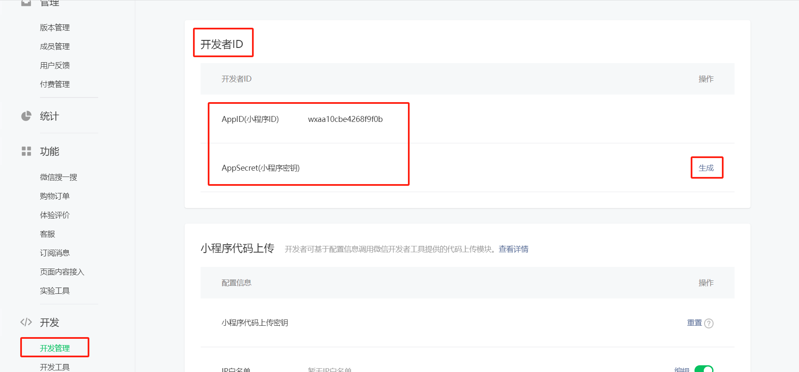

# 代驾：环境搭建

## 一、项目介绍

### 1、介绍

【**乐尚代驾**】代驾是一种新型的出行服务模式，主营业务：酒后*代驾*、商务代驾、长途代驾，其主要特点是通过线上平台为用户提供代驾服务，伴随中国家庭汽车保有量的飞速增长，互联网代驾行业驶进了快车道，当前项目就是以此为背景设计出来的。


### 2、核心技术

- **SpringBoot**：简化Spring应用的初始搭建以及开发过程
- **SpringCloud**：基于Spring Boot实现的云原生应用开发工具，SpringCloud使用的技术：（Spring Cloud Gateway、Spring Cloud Task和Spring Cloud Feign等）
- **SpringBoot+SpringCloudAlibaba(Nacos，Sentinel) + OpenFeign + Gateway**
- MyBatis-Plus：持久层框架，也依赖mybatis
- Redis：内存做缓存
- Redisson：基于redis的Java驻内存数据网格 - 框架；操作redis的框架
- MongoDB: 分布式文件存储的数据库
- RabbitMQ：消息中间件；大型分布式项目是标配；分布式事务最终一致性
- Seata：分布式事务
- Drools：规则引擎，计算预估费用、取消费用等等
- GEO：GPS分区定位计算
- ThreadPoolExecutor+CompletableFuture：异步编排，线程池来实现异步操作，提高效率
- XXL-JOB: 分布式定时任务调用中心
- Knife4J/YAPI：Api接口文档工具
- MinIO（私有化对象存储集群）：分布式文件存储 类似于OSS（公有）
- 微信支付：微信支付与微信分账
- MySQL：关系型数据库 {shardingSphere-jdbc 进行读写分离; 分库，分表}
- Lombok: 实体类的中get/set 生成的jar包
- Natapp：内网穿透
- Docker：容器化技术;  生产环境Redis（运维人员）；快速搭建环境Docker run
- Git：代码管理工具；Git使用，拉代码、提交、推送、合并、冲突解决

前端技术栈

- UniApp
- Vue3全家桶
- TypeScript
- GraceUI
- UniUI
- uniapp-axios-adapter


### 3、使用的云服务

因为我们开发的是打车类的微信小程序项目，因此要使用了大量的云服务（腾讯云或者其它云都可以）与微信小程序插件，列举如下：

| 序号 | 云服务名称             | 具体用途                                                 |
| :--- | :--------------------- | :------------------------------------------------------- |
| 1    | 对象存储服务（COS）    | 存储司机实名认证的身份证和驾驶证照片等隐私图片           |
| 2    | 人脸识别（AiFace）     | 每天司机接单前的身份核实，并且具备静态活体检测功能       |
| 3    | 人员库管理（face-lib） | 云端存储司机注册时候的人脸模型，用于身份比对使用         |
| 4    | 数据万象（ci）         | 用于监控大家录音文本内容，判断是否包含暴力和色情         |
| 5    | OCR证件识别            | 用于OCR识别和扫描身份证和驾驶证的信息                    |
| 6    | 微信同声传译插件       | 把文字合成语音，播报订单；把录音转换成文本，用于安全监控 |
| 7    | 路线规划插件           | 用于规划司机下班回家的线路，或者小程序订单显示的路线     |
| 8    | 地图选点插件           | 用于小程序上面地图选点操作                               |
| 9    | 腾讯位置服务           | 路线规划、定位导航、里程和时间预估                       |


### 4、技术架构图


### 5、业务流程图


### 5、项目模块

最终服务器端架构模块

daijia-parent：根目录，管理子模块：

​	common：公共类父模块

​		common-log：系统日志管理

​		common-util：核心工具类

​		rabbit-util：service模块工具类

​		service-util：service模块工具类

​		spring-security：spring-security业务模块

​	model：实体类模块

​	server-gateway：网关

​	service：service服务父模块

​		service-coupon：优惠券服务模块

​		service-customer：乘客服务模块

​		service-dispatch：调度服务模块

​		service-driver：司机服务模块

​		service-map：地图服务模块

​		service-mq：mq测试服务模块

​		service-order：订单服务模块

​		service-payment：支付服务模块

​		service-rules：规则服务模块

​		service-system：系统服务模块

​	service-client：远程调用服务父模块

​		service-coupon-client：优惠券服务远程接口

​		service-customer-client：客户服务远程接口

​		service-dispatch-client：调度服务远程接口

​		service-driver-client：司机服务远程接口

​		service-map-client：地图服务远程接口

​		service-order-client：订单服务远程接口

​		service-payment-client：支付服务远程接口

​		service-rules-client：规则服务远程接口

​		service-system-client：系统服务远程接口

​	web：前端系统父模块

​		web-customer：乘客端web系统

​		web-driver：司机端web系统

​		web-mgr：管理端web系统


## 二、开发环境准备

### 1、前端环境

#### 1.1、注册微信开发者账号

虽然开发微信小程序可以使用微信提供的测试号，但是测试号提供的功能极为有限，而且不能真机调试。因此说，首先我们必须要申请微信开发者账号，个人申请和使用微信开发者账号是免费的。如果你要开发的是商用小程序，那么就需要以企业身份申请微信开发者账号，而且还要缴纳认证费用。

用浏览器访问 [微信公众平台](https://mp.weixin.qq.com/)，然后点击页面右上角的`立即注册`链接。


帐户类型选择`小程序`，然后填写好注册信息，然后微信平台会给你发送一封电子邮件。你需要点击电子邮件中的激活小程序账号的链接，然后在跳转的页面中，个人详细信息，这样才算是把个人主体的微信小程序开发者账号给注册下来。


开发微信小程序必须要用到AppID和密钥，这两个东西可以在微信开发者平台上面获得。刚才大家已经成功注册了开发者账号，那么就处在登陆的状态，不用重新登录微信开发者平台。

在网页中找到`开发`栏目，然后选择`开发管理`选项卡，在面板中你就能看到自己的小程序对应的`AppID`和`密钥`了。如果是刚注册下来的账号，密钥还没有生成，你要手动点击页面上的按钮，生成密钥字符串。如果已经生成过密钥字符串，那么默认情况，页面会隐藏密钥字符串，你只能点击重置按钮，生成新的密钥字符串了。所以强烈建议大家，获取了密钥字符串之后，最好能用文件把密钥字符串保存下来。



本项目包含了获取微信手机号码、微信支付和分账等功能，个人开发者账号是不支持的，必须要使用企业身份的微信开发者账号。

#### 1.2、开通服务与插件

##### 1.2.1、开通地理位置

开发 -》开发管理 -》接口设置 -》地理位置：


##### 1.2.2、开通小程序插件

添加：腾讯位置服务地图选点与微信同声传译 插件

设置 ==> 第三方设置 ==-> 插件管理 ==-> 添加插件 ==> 搜索 “插件名称” ，如图：


没有搜索到，那么就到”微信服务市场“去找，搜索到以后添加到需要的小程序里面即可。

微信服务市场：https://fuwu.weixin.qq.com/search


此时就到[微信服务市场](https://fuwu.weixin.qq.com/search?tab=3&type=&serviceType=3&page=1&kw=微信同声传译)去搜，搜索到以后添加到需要的小程序里面

https://fuwu.weixin.qq.com/search?tab=3&type=&serviceType=3&page=1&kw=腾讯位置服务地图选点

https://fuwu.weixin.qq.com/search?tab=3&type=&serviceType=3&page=1&kw=微信同声传译


点击进入详情：


添加插件：


添加到你申请的小程序即可。

结果如下：


#### 1.3、安装Node.js

https://nodejs.org/en/download

UniApp是基于Vue.js环境开发的，前面项目已经安装过，可以忽略，本课程使用Node.js版本是v16.19.1


#### 1.4、微信开发者工具使用

本课程要运行代驾小程序，必然要用到微信开发者工具。因为移动端项目采用了UniApp架构，正常情况下是在HBuildeX上面开发小程序，编译后在微信开发者工具上运行调试，但是我们不用开发UniApp前端项目，程序已经开发好了，所以就可以不使用HBuildeX工具了。


##### 1.4.1、安装微信开发者工具

由于微信开发者工具不能同时运行两个微信小程序项目，因此我们要安装两个微信开发者工具，只要安装目录变更一下即可，如：微信web开发者工具1、微信web开发者工具2，如图：


##### 1.4.2、启动与登录

安装完成后，启动微信开发者工具，使用微信扫码登陆


登录后如图：


##### 1.4.3、配置

微信扫码登陆之后，点击微信开发工具右上角的“齿轮图标”，在弹出的设置面板中开启服务端口。


安全 -> 服务端口选中，服务端口是随机分配的。


##### 1.4.4、导入乘客端项目


选择导入

选择编译好的前端项目：mp-weixin-customer，使用第一步注册的微信公众号AppId


确定，“信任并运行”即可。


核对AppId是否正确，如果不对，可以修改；

说明：忽略“详情”下面的项目名称，公司有很多微信小程序项目挂在了改账号下开发，不受影响。


注：使用相同的方式，在“微信开发者工具2”，可导入司机端小程序项目。

#### 1.5、前端接口地址

前端微信小程序项目默认已编译好，不用修改配置。

乘客端默认base地址：http://localhost:8600/customer-api

司机端默认base地址：http://localhost:8600/driver-api


### 2、服务器端环境

#### 2.1、数据库表

从资料文件中获取，导入数据库

#### 2.2、项目环境搭建

##### 2.2.1、安装软件环境

参考“软件环境安装.md”，安装开发所需中间件；

##### 2.2.2、导入初始化项目

从资料中获取daijia-parent初始化项目，复制到工作目录，导入idea开发工具中即可；


##### 2.2.3、导入配置文件到Nacos

从资料中获取项目配置文件，压缩成DEFAULT_GROUP.zip，导入nacos服务器。


##### 2.3.4、启动调试项目

更改配置文件连接方式：Nacos、Mysql、Rabbitmq与Redis等的连接方式

启动项目，如果项目不报错，则初始化项目导入成功。


## 三、Mybatis-Plus入门

### 1、简介

官网：https://baomidou.com/

参考教程：[https://baomidou.com/pages/226c21/#初始化工程](https://baomidou.com/pages/226c21/#%E5%88%9D%E5%A7%8B%E5%8C%96%E5%B7%A5%E7%A8%8B)

[MyBatis-Plus](https://github.com/baomidou/mybatis-plus)（简称 MP）是一个 [MyBatis](http://www.mybatis.org/mybatis-3/) 的增强工具，在 MyBatis 的基础上只做增强不做改变，为简化开发、提高效率而生。

### 2、创建并初始化数据库

#### 2.1、创建数据库

`mybatis_plus`

#### 2.2、创建 `User` 表

其表结构如下：

| id   | name   | age  | email              |
| ---- | ------ | ---- | ------------------ |
| 1    | Jone   | 18   | test1@baomidou.com |
| 2    | Jack   | 20   | test2@baomidou.com |
| 3    | Tom    | 28   | test3@baomidou.com |
| 4    | Sandy  | 21   | test4@baomidou.com |
| 5    | Billie | 24   | test5@baomidou.com |

其对应的数据库 Schema 脚本如下：

```sql
DROP TABLE IF EXISTS user;

CREATE TABLE user
(
    id BIGINT(20) NOT NULL COMMENT '主键ID',
    name VARCHAR(30) NULL DEFAULT NULL COMMENT '姓名',
    age INT(11) NULL DEFAULT NULL COMMENT '年龄',
    email VARCHAR(50) NULL DEFAULT NULL COMMENT '邮箱',
    PRIMARY KEY (id)
);
```

其对应的数据库 Data 脚本如下：

```sql
DELETE FROM user;
INSERT INTO user (id, name, age, email) VALUES
(1, 'Jone', 18, 'test1@baomidou.com'),
(2, 'Jack', 20, 'test2@baomidou.com'),
(3, 'Tom', 28, 'test3@baomidou.com'),
(4, 'Sandy', 21, 'test4@baomidou.com'),
(5, 'Billie', 24, 'test5@baomidou.com');
```

### 3、创建项目

#### 3.1、创建maven项目

mybatis_plus_demo

GroupId：com.atguigu


#### 3.2、SpringBoot版本

```xml
<version>3.0.5</version>
```

#### 3.3、添加依赖

```xml
<parent>
    <groupId>org.springframework.boot</groupId>
    <artifactId>spring-boot-starter-parent</artifactId>
    <version>3.0.5</version>
    <relativePath/> <!-- lookup parent from repository -->
</parent>

<properties>
    <maven.compiler.source>17</maven.compiler.source>
    <maven.compiler.target>17</maven.compiler.target>
</properties>

<dependencies>
    <dependency>
        <groupId>org.springframework.boot</groupId>
        <artifactId>spring-boot-starter</artifactId>
    </dependency>

    <dependency>
        <groupId>org.springframework.boot</groupId>
        <artifactId>spring-boot-starter-test</artifactId>
        <scope>test</scope>
    </dependency>

    <!--mybatis-plus-->
    <dependency>
        <groupId>com.baomidou</groupId>
        <artifactId>mybatis-plus-boot-starter</artifactId>
        <version>3.5.3.1</version>
    </dependency>
    
    <!--mysql-->
    <dependency>
        <groupId>mysql</groupId>
        <artifactId>mysql-connector-java</artifactId>
        <version>8.0.30</version>
    </dependency>
    
    <!--lombok用来简化实体类-->
    <dependency>
        <groupId>org.projectlombok</groupId>
        <artifactId>lombok</artifactId>
    </dependency>
</dependencies>
```


#### 3.4、idea中安装lombok插件

**idea2022版本**


### 4、编写代码

#### 4.1、配置文件

 `application.properties` 配置文件

```properties
#mysql数据库连接
spring.datasource.driver-class-name=com.mysql.cj.jdbc.Driver
spring.datasource.url=jdbc:mysql://localhost:3306/mybatis_plus?serverTimezone=GMT%2B8&useSSL=false
spring.datasource.username=root
spring.datasource.password=123456
#mybatis日志
mybatis-plus.configuration.log-impl=org.apache.ibatis.logging.stdout.StdOutImpl
```


#### 4.2、实体类

```java
package com.atguigu.mp.entity;
@Data
public class User {
    private Long id;
    private String name;
    private Integer age;
    private String email;
}
```


#### 4.3、mapper

```java
package com.atguigu.mp.mapper;
@Mapper
public interface UserMapper extends BaseMapper<User> {
}
```


### 5、开始使用

添加测试类，进行功能测试：

```java
package com.atguigu.mp;

@SpringBootTest
public class CRUDTests {
    @Resource
    private UserMapper userMapper;

    @Test
    public void testSelectList() {
        List<User> userList = userMapper.selectList(null);
        userList.forEach(System.out::println);
    }
}
```

**通过以上几个简单的步骤，我们就实现了 User 表的 CRUD 功能，甚至连 XML 文件都不用编写！**

### 6、主键策略

```java
@Test
public void testInsert(){
    User user = new User();
    user.setName("jack");
    user.setAge(18);
    user.setEmail("123456332@qq.com");
    int result = userMapper.insert(user);
    System.out.println(result); //影响的行数
    System.out.println(user); //id自动回填
}
```


**注意：**数据库插入id值默认为：全局唯一id


#### 6.1、全局唯一ID（默认）

```java
@TableId(type = IdType.ASSIGN_ID)
```

雪花算法是由 Twitter 公布的分布式主键生成算法，它能够保证不同进程主键的不重复性，以及相同进程主键的有序性。

**实现原理**

在同一个进程中，它首先是通过时间位保证不重复，如果时间相同则是通过序列位保证。 同时由于时间位是单调递增的，且各个服务器如果大体做了时间同步，那么生成的主键在分布式环境可以认为是总体有序的，这就保证了对索引字段的插入的高效性。 例如 MySQL 的 Innodb 存储引擎的主键。

使用雪花算法生成的主键，二进制表示形式包含 4 部分，从高位到低位分表为：1bit 符号位、41bit 时间戳位、10bit 工作进程位以及 12bit 序列号位。

- 符号位（1bit）

预留的符号位，恒为零。

- 时间戳位（41bit）

41 位的时间戳可以容纳的毫秒数是 2 的 41 次幂，一年所使用的毫秒数是：`365 * 24 * 60 * 60 * 1000`。 通过计算可知：

```
Math.pow(2, 41) / (365 * 24 * 60 * 60 * 1000L);
```

结果约等于 69.73 年，相信能满足绝大部分系统的要求。

- 工作进程位（10bit）

该标志在 Java 进程内是唯一的，如果是分布式应用部署应保证每个工作进程的 id 是不同的。 该值默认为 0，可通过属性设置。可以支持 1024(2 的 10 次幂)个工作进程

- 序列号位（12bit）

该序列是用来在同一个毫秒内生成不同的 ID。如果在这个毫秒内生成的数量超过 4096 (2 的 12 次幂)，那么生成器会等待到下个毫秒继续生成。

雪花算法主键的详细结构见下图。


#### 6.2、自增策略

- 要想主键自增需要配置如下主键策略
- - 需要在创建数据表的时候设置主键自增
  - 实体字段中配置 @TableId(type = IdType.AUTO)

```java
@TableId(type = IdType.AUTO)
private Long id;
```

 

### 7、分页插件

MyBatis Plus自带分页插件，只要简单的配置即可实现分页功能

#### 7.1、配置分页插件

创建MybatisPlusConfig

```java
package com.atguigu.mp.config;


@Configuration
public class MybatisPlusConfig {
    /**
     * 分页插件
     */
    @Bean
    public MybatisPlusInterceptor optimisticLockerInnerInterceptor(){
        MybatisPlusInterceptor interceptor = new MybatisPlusInterceptor();
        //向Mybatis过滤器链中添加分页拦截器
        interceptor.addInnerInterceptor(new PaginationInnerInterceptor(DbType.MYSQL));
        return interceptor;
    }
}
```

 

#### 7.2、测试selectPage分页

```java
@Test
public void testSelectPage() {
    Page<User> page = new Page<>(1,5);
    userMapper.selectPage(page, null);
    page.getRecords().forEach(System.out::println);
    System.out.println(page.getCurrent());
    System.out.println(page.getPages());
    System.out.println(page.getSize());
    System.out.println(page.getTotal());
    System.out.println(page.hasNext());
    System.out.println(page.hasPrevious());
}

```

 

### 8、逻辑删除

- 物理删除：真实删除，将对应数据从数据库中删除，之后查询不到此条被删除数据
- 逻辑删除：假删除，将对应数据中代表是否被删除的字段状态修改为“`被删除状态`”，之后在数据库中仍旧能看到此条数据记录

#### 8.1、数据库中添加 deleted字段

```sql
ALTER TABLE `user` ADD COLUMN `deleted` BOOLEAN DEFAULT 0 COMMENT '逻辑删除字段';
```


#### 8.2、实体类添加deleted 字段

并加上 @TableLogic 注解

```java
@TableLogic
private Integer deleted;
//private Boolean deleted;
```


#### 8.3、application.properties 配置

此为默认值，如果你的默认值和mp默认的一样，则不需要该配置

```properties
#默认配置
mybatis-plus.global-config.db-config.logic-delete-value=1
mybatis-plus.global-config.db-config.logic-not-delete-value=0
```

如果使用了@TableLogic注解，则不需要该配置

```properties
mybatis-plus.global-config.db-config.logic-delete-field=deleted
```


#### 8.4、测试逻辑删除

- 测试后发现，数据并没有被删除，deleted字段的值由0变成了1
- 测试后分析打印的sql语句，是一条update

```java
/**
 * 测试 逻辑删除
 */
@Test
public void testLogicDelete() {
    int result = userMapper.deleteById(1L);
    System.out.println(result);
}
```


#### 8.5、测试逻辑删除后的查询

MyBatis Plus中查询操作也会自动添加逻辑删除字段的判断