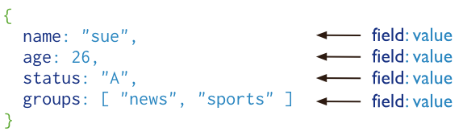
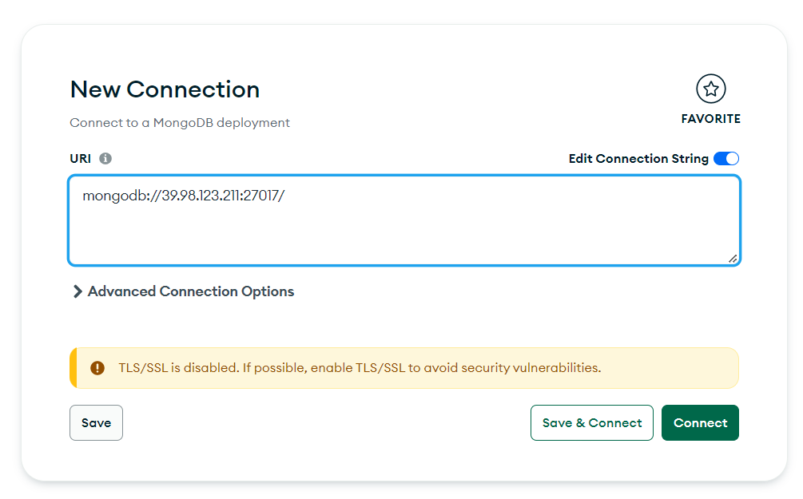
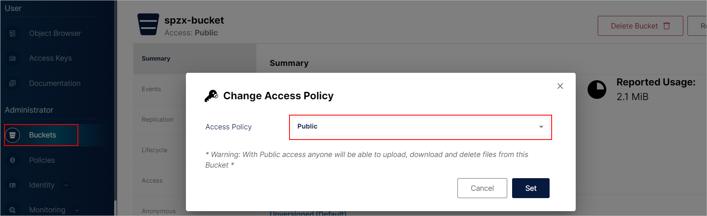
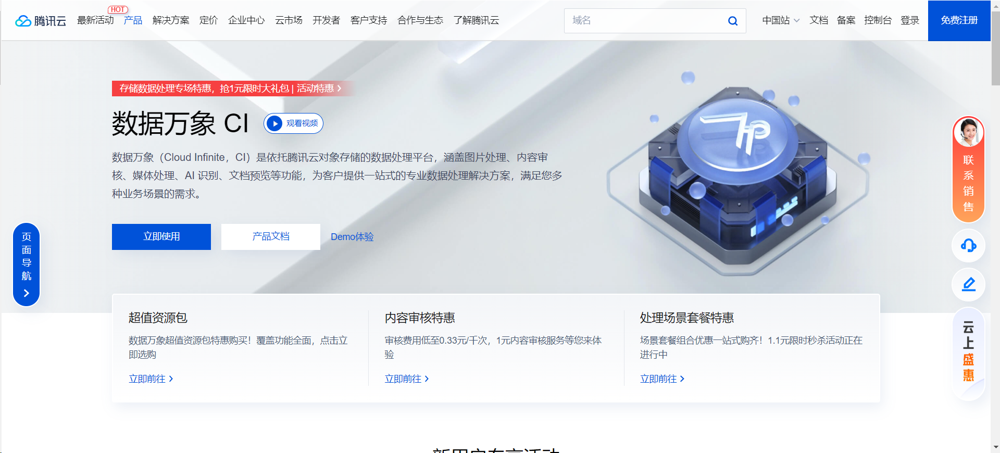
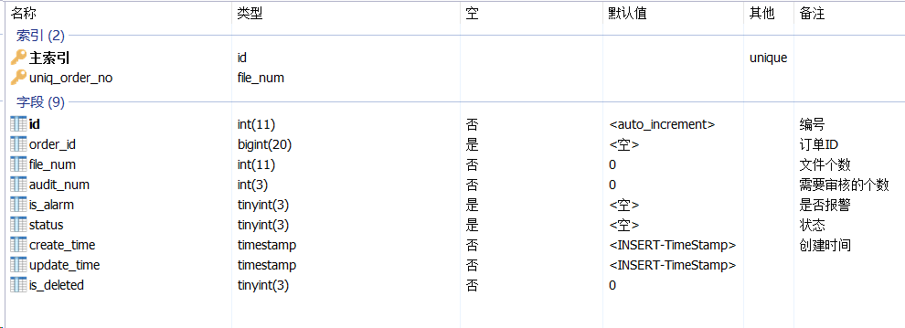

# 代驾：订单执行

## 一、MongoDB入门

### 1、MongoDB

#### 1.1、MongoDB 概念

##### 1.1.1、什么是MongoDB

MongoDB 是在2007年由DoubleClick公司的几位核心成员开发出的一款分布式文档数据库，由C++语言编写。

目的是为了解决数据大量增长的时候系统的可扩展性和敏捷性。MongoDB要比传统的关系型数据库简单很多。

在MongoDB中数据主要的组织结构就是`数据库、集合和文档`，文档存储在集合当中，集合存储在数据库中。

MongoDB中每一条数据记录就是一个文档，`数据结构由键值(key=>value)对组成`。

文档类似于 JSON 对象，它的数据结构被叫做`BSON`（Binary JSON）。




下表将帮助您更容易理解MongoDB中的一些概念：

| RDBMS  | MongoDB  |
| ------ | -------- |
| 数据库 | 数据库   |
| 表格   | 集合     |
| 行     | 文档     |
| 列     | 字段     |
| 表联合 | 嵌入文档 |
| 主键   | _id      |


##### 1.1.2、MongoDB适用场景

MongoDB不需要去明确指定一张表的具体结构，对字段的管理非常灵活，有很强的可扩展性。

支持高并发、高可用、高可扩展性，自带数据压缩功能，支持海量数据的高效存储和访问。

支持基本的CRUD、数据聚合、文本搜索和地理空间查询功能。


**适用场景：**

- 网站数据：Mongo非常适合实时的插入，更新与查询，并具备网站实时数据存储所需的复制及高度伸缩性。
- 高伸缩性的场景：Mongo非常适合由数十或数百台服务器组成的数据库。
- 大尺寸，低价值的数据：使用传统的关系型数据库存储一些数据时可能会比较昂贵，在此之前，很多时候程序员往往会选择传统的文件进行存储。
- 缓存：由于性能很高，Mongo也适合作为信息基础设施的缓存层。在系统重启之后，由Mongo搭建的持久化缓存层可以避免下层的数据源过载。

**例如：**

弹幕、直播间互动信息、朋友圈信息、物流场景等


**不适用场合：**

- 高度事务性系统：例如银行系统。传统的关系型数据库目前还是更适用于需要大量原子性复杂事务的应用程序。
- 传统的商业智能应用：针对特定问题的BI数据库会对产生高度优化的查询方式。对于此类应用，数据仓库可能是更合适的选择。


#### 1.2、安装和启动（docker方式）

##### 1.2.1、拉取镜像

```shell
docker pull mongo:7.0.0
```

##### 1.2.2、创建和启动容器

需要在宿主机建立文件夹

> rm -rf /opt/mongo
>
> mkdir -p /opt/mongo/data/db

```shell
docker run -d --restart=always -p 27017:27017 --name mongo -v /opt/mongo/data/db:/data/db mongo:7.0.0
```

##### 1.2.3、进入容器

```shell
docker exec -it mongo mongosh
```

##### 1.2.4、基本命令

```shell
show dbs
db.version() #当前db版本
db.getMongo() #查看当前db的链接机器地址
db.help() #帮助
quit() #退出命令行
```


#### 1.3、客户端远程远程连接

**资料：**`资料>mongodb客户端>mongodb-compass-1.39.3-win32-x64.exe`，安装

**客户端连接：**




#### 1.4、数据库操作

##### 1.4.1、创建数据库

如果数据库不存在，则创建数据库，否则切换到指定数据库。

```shell
use tingshu
```

##### 1.4.2、查看当前数据库

```
db.getName()
```

##### 1.4.3、显示当前数据库状态

```
db.stats()
```

##### 1.4.4、删除当前数据库

```
db.dropDatabase()
```


#### 1.5、集合操作

##### 1.5.1、创建集合

```shell
db.createCollection("User")
```

##### 1.5.2、删除集合

```shell
db.User.drop()
```


#### 1.6、文档操作

文档是一组键值(key-value)对。MongoDB 的文档不需要设置相同的字段，并且相同的字段不需要相同的数据类型，这与关系型数据库有很大的区别，也是 MongoDB 非常突出的特点。


**需要注意的是：**

1、MongoDB区分类型和大小写。

2、MongoDB的文档不能有重复的键。


##### 1.6.1、insert

向User集合插入一条记录。可以预先使用createCollection方法创建集合，也可以不创建集合，直接插入数据，那么集合会被自动创建

```shell
db.User.insert({name:'zhangsan',age:21,sex:true})
```

##### 1.6.2、query

查询当前User集合中所有的记录

```shell
db.User.find()
```

查询当前User集合中name是zhangsan的记录

```shell
db.User.find({name:"zhangsan"})
```

##### 1.6.3、update

只更新匹配到的第一条记录

```shell
db.User.update({age:20}, {$set:{name:100}}) 
```

更新匹配到的所有记录

```shell
db.User.update({age:21}, {$set:{age:99}}, {multi: true})
```

##### 1.6.4、remove

移除一个文档

```shell
db.User.remove(id)
```

移除所有文档

```shell
db.User.remove({}) 
```


**更多命令参考：**https://www.runoob.com/mongodb/mongodb-tutorial.html


### 2、SpringBoot集成MongoDB

spring-data-mongodb提供了`MongoTemplate`与`MongoRepository`两种方式访问mongodb，MongoRepository操作简单，MongoTemplate操作灵活，我们在项目中可以灵活使用这两种方式操作mongodb。

#### 2.1、集成spring-data-mongodb

##### 2.1.1、搭建项目

1、创建项目：mongo_demo

2、导入pom.xml：

```xml
<?xml version="1.0" encoding="UTF-8"?>
<project xmlns="http://maven.apache.org/POM/4.0.0" xmlns:xsi="http://www.w3.org/2001/XMLSchema-instance"
         xsi:schemaLocation="http://maven.apache.org/POM/4.0.0 https://maven.apache.org/xsd/maven-4.0.0.xsd">
    <modelVersion>4.0.0</modelVersion>
    <parent>
        <groupId>org.springframework.boot</groupId>
        <artifactId>spring-boot-starter-parent</artifactId>
        <version>3.0.5</version>
        <relativePath/> <!-- lookup parent from repository -->
    </parent>
    <groupId>com.atguigu</groupId>
    <artifactId>mongo_demo</artifactId>
    <version>0.0.1-SNAPSHOT</version>

    <properties>
        <java.version>17</java.version>
    </properties>
    <dependencies>
        <dependency>
            <groupId>org.springframework.boot</groupId>
            <artifactId>spring-boot-starter-web</artifactId>
        </dependency>

        <!--mongodb-->
        <dependency>
            <groupId>org.springframework.boot</groupId>
            <artifactId>spring-boot-starter-data-mongodb</artifactId>
        </dependency>
        
        <dependency>
            <groupId>org.projectlombok</groupId>
            <artifactId>lombok</artifactId>
        </dependency>

        <dependency>
            <groupId>org.springframework.boot</groupId>
            <artifactId>spring-boot-starter-test</artifactId>
            <scope>test</scope>
        </dependency>
    </dependencies>

    <build>
        <plugins>
            <plugin>
                <groupId>org.springframework.boot</groupId>
                <artifactId>spring-boot-maven-plugin</artifactId>
            </plugin>
        </plugins>
    </build>

</project>
```

3、添加配置文件

application.yml

```yaml
spring:
  data:
    mongodb:
      database: daijia
      host: 192.168.100.101
      port: 27017
```


##### 2.1.2、添加实体

```java
package com.atguigu.mongo_demo.model;

import lombok.Data;
import org.bson.types.ObjectId;
import org.springframework.data.annotation.Id;
import org.springframework.data.mongodb.core.mapping.Document;

import java.util.Date;

@Data
@Document("user") //指定mongodb中的集合名字
public class User {

    @Id
    private ObjectId id;
    private String name;
    private Integer age;
    private String email;
    private Date createDate;
}
```


#### 2.2、MongoRepository

##### 2.2.1、添加Repository类

```java
package com.atguigu.mongo_demo.repository;

import com.atguigu.mongo_demo.model.User;
import org.bson.types.ObjectId;
import org.springframework.data.mongodb.repository.MongoRepository;

public interface UserRepository extends MongoRepository<User, ObjectId> {


}
```

##### 2.2.2、创建测试类

test目录创建测试类：MongoRepositoryTest

```java
package com.atguigu.mongo_demo;

import com.atguigu.mongo_demo.model.User;
import com.atguigu.mongo_demo.repository.UserRepository;
import org.bson.types.ObjectId;
import org.junit.jupiter.api.Test;
import org.springframework.beans.factory.annotation.Autowired;
import org.springframework.boot.test.context.SpringBootTest;
import org.springframework.data.domain.Example;
import org.springframework.data.domain.Page;
import org.springframework.data.domain.PageRequest;
import org.springframework.data.domain.Sort;

import java.util.Date;
import java.util.List;
import java.util.Optional;

@SpringBootTest
public class MongoRepositoryTest {

    @Autowired
    private UserRepository userRepository;

    //插入
    @Test
    public void testCreateUser(){

        User user = new User();
        user.setName("小谷");
        user.setAge(19);
        user.setCreateDate(new Date());
        userRepository.save(user);
    }

    //查询所有
    @Test
    public void testFindAll(){
        List<User> userList = userRepository.findAll();
        System.out.println(userList);
    }

    //根据id查询
    @Test
    public void testFindById(){

        Optional<User> optional = userRepository.findById(
                new ObjectId("64eee9dff317c823c62b4faf")
        );
        boolean present = optional.isPresent();
        if(present){
            User user = optional.get();
            System.out.println(user);
        }
    }

    //条件查询
    @Test
    public void testFindAllExample(){

        User user = new User();
        user.setAge(19);
        Example<User> example = Example.of(user);
        List<User> userList = userRepository.findAll(example);
        System.out.println(userList);
    }

    //排序查询
    @Test
    public void testFindAllSort(){
        Sort sort = Sort.by(Sort.Direction.DESC, "age");
        List<User> userList = userRepository.findAll(sort);
        System.out.println(userList);
    }

    //分页查询
    @Test
    public void testFindAllPage(){

        PageRequest pageRequest = PageRequest.of(0, 10);
        Page<User> page = userRepository.findAll(pageRequest);
        int totalPages = page.getTotalPages();
        List<User> userList = page.getContent();
        System.out.println(userList);
        System.out.println(totalPages);
    }

    //更新
    @Test
    public void testUpdateUser(){

        //注意：先查询，再更新
        Optional<User> optional = userRepository.findById(
                new ObjectId("64eee9dff317c823c62b4faf")
        );
        if(optional.isPresent()){
            User user = optional.get();
            user.setAge(100);
            //user中包含id，就会执行更新
            userRepository.save(user);
            System.out.println(user);
        }
    }

    //删除
    @Test
    public void testDeleteUser(){
        userRepository.deleteById(
                new ObjectId("64eee9dff317c823c62b4faf")
        );
    }
}
```


#### 2.3、MongoTemplate

test目录创建测试类：MongoTemplateTest

```java
package com.atguigu.mongo_demo;

import com.atguigu.mongo_demo.model.User;
import com.mongodb.client.result.DeleteResult;
import com.mongodb.client.result.UpdateResult;
import org.junit.jupiter.api.Test;
import org.springframework.beans.factory.annotation.Autowired;
import org.springframework.boot.test.context.SpringBootTest;
import org.springframework.data.mongodb.core.MongoTemplate;
import org.springframework.data.mongodb.core.query.Criteria;
import org.springframework.data.mongodb.core.query.Query;
import org.springframework.data.mongodb.core.query.Update;

import java.util.List;
import java.util.regex.Pattern;

@SpringBootTest
public class MongoTemplateTest {

    @Autowired
    private MongoTemplate mongoTemplate;

    //添加
    @Test
    public void testCreateUser(){
        User user = new User();
        user.setAge(20);
        user.setName("test");
        user.setEmail("test@qq.com");
        mongoTemplate.insert(user);
        System.out.println(user);
    }

    //查询所有
    @Test
    public void testFindUser() {
        List<User> userList = mongoTemplate.findAll(User.class);
        System.out.println(userList);
    }

    //根据id查询
    @Test
    public void testFindUserById(){
        User user = mongoTemplate.findById("64eeeae31711344f35635788", User.class);
        System.out.println(user);
    }

    //删除
    @Test
    public void testRemove() {
        Criteria criteria = Criteria.where("_id").is("64eeeae31711344f35635788");
        Query query = new Query(criteria);
        DeleteResult result = mongoTemplate.remove(query, User.class);
        long count = result.getDeletedCount();
        System.out.println(count);
    }

    //条件查询 and
    @Test
    public void findUserList() {

        Criteria criteria = Criteria.where("name").is("test").and("age").is(20);
        Query query = new Query(criteria);

        List<User> userList = mongoTemplate.find(query, User.class);
        System.out.println(userList);
    }

    //分页查询
    @Test
    public void findUsersPage() {
        Query query = new Query();
        //先查询总记录数
        long count = mongoTemplate.count(query, User.class);
        System.out.println(count);
        //后查询分页列表
        List<User> userList = mongoTemplate.find(query.skip(0).limit(2), User.class);
        System.out.println(userList);
    }
    
    //修改
    @Test
    public void testUpdateUser() {
        Criteria criteria = Criteria.where("_id").is("64eeeae31711344f35635788");
        Query query = new Query(criteria);
        Update update = new Update();
        update.set("name", "zhangsan");
        update.set("age", 99);
        UpdateResult result = mongoTemplate.upsert(query, update, User.class);//改一条
        //UpdateResult result = mongoTemplate.updateMulti(query, update, User.class);//改多条
        long count = result.getModifiedCount();
        System.out.println(count);
    }
}
```


## 二、开始代驾

司机录入车辆信息后，就开始代驾了。开始代驾后，司机端与乘客端同样要进入司乘同显页面，司乘同显的起始点与终点就是代驾订单的起始点与终点，这里我们不需要提供额外的接口，直接使用“计算最佳驾驶线路”接口即可。

订单在在代驾过程中，我们需要保存驾驶途中的GPS定位，将来我们计算代驾真实里程的时候，就需要用到这些坐标点。那么这些定位点保存在MySQL中可以吗？当然不行，MySQL单表记录超过千万行就开始变慢了。那么保存再哪里呢？保存到MongoDB中。

订单在代驾的过程中，司机端小程序要实时采集录音，把录音和对话文本上传到后端系统，将录音监控保存到Minio，对话文本保存到MongoDB中

### 1、开始代驾

代驾开始，我们要更新订单状态及相关信息

#### 1.1、订单微服务接口

##### 1.1.1、OrderInfoController

```java
@Operation(summary = "开始代驾服务")
@PostMapping("/startDrive")
public Result<Boolean> startDrive(@RequestBody StartDriveForm startDriveForm) {
    return Result.ok(orderInfoService.startDrive(startDriveForm));
}
```

##### 1.1.2、OrderInfoService

```java
  Boolean startDrive(StartDriveForm startDriveForm);
```

##### 1.1.3、OrderInfoServiceImp

```java
@Transactional(rollbackFor = Exception.class)
@Override
public Boolean startDrive(StartDriveForm startDriveForm) {
    LambdaQueryWrapper<OrderInfo> queryWrapper = new LambdaQueryWrapper<>();
    queryWrapper.eq(OrderInfo::getId, startDriveForm.getOrderId());
    queryWrapper.eq(OrderInfo::getDriverId, startDriveForm.getDriverId());

    OrderInfo updateOrderInfo = new OrderInfo();
    updateOrderInfo.setStatus(OrderStatus.START_SERVICE.getStatus());
    updateOrderInfo.setStartServiceTime(new Date());
    //只能更新自己的订单
    int row = orderInfoMapper.update(updateOrderInfo, queryWrapper);
    if(row == 1) {
        //记录日志
        this.log(startDriveForm.getOrderId(), OrderStatus.START_SERVICE.getStatus());
    } else {
        throw new GuiguException(ResultCodeEnum.UPDATE_ERROR);
    }
    return true;
}
```

#### 1.2、Feign接口

##### 1.2.1、OrderInfoFeignClient

```java
/**
 * 开始代驾服务
 * @param startDriveForm
 * @return
 */
@PostMapping("/order/info/startDrive")
Result<Boolean> startDrive(@RequestBody StartDriveForm startDriveForm);
```

#### 1.3、司机端web接口

##### 1.3.1、OrderController

```java
@Operation(summary = "开始代驾服务")
@GuiguLogin
@PostMapping("/startDrive")
public Result<Boolean> startDrive(@RequestBody StartDriveForm startDriveForm) {
    Long driverId = AuthContextHolder.getUserId();
    startDriveForm.setDriverId(driverId);
    return Result.ok(orderService.startDrive(startDriveForm));
}
```

##### 1.3.2、OrderService

```java
Boolean startDrive(StartDriveForm startDriveForm);
```

##### 1.3.3、OrderServiceImpl

```java
@Override
public Boolean startDrive(StartDriveForm startDriveForm) {
   return orderInfoFeignClient.startDrive(startDriveForm).getData();
}
```


### 2、批量保存订单位置信息

司机开始代驾后，为了减少请求次数，司机端会实时收集变更的GPS定位信息，定时批量上传到后台服务器。

#### 2.1、地图微服务接口

##### 2.1.1、LocationController

```java
@Operation(summary = "开始代驾服务：保存代驾服务订单位置")
@PostMapping("/saveOrderServiceLocation")
public Result<Boolean> saveOrderServiceLocation(@RequestBody List<OrderServiceLocationForm> orderLocationServiceFormList) {
    return Result.ok(locationService.saveOrderServiceLocation(orderLocationServiceFormList));
}
```

##### 2.1.2、LocationService

```java
Boolean saveOrderServiceLocation(List<OrderServiceLocationForm> orderLocationServiceFormList);
```

##### 2.1.3、LocationServiceImp

```java
@Autowired
private OrderServiceLocationRepository orderServiceLocationRepository;

@Override
public Boolean saveOrderServiceLocation(List<OrderServiceLocationForm> orderLocationServiceFormList) {
    List<OrderServiceLocation> list = new ArrayList<>();
    orderLocationServiceFormList.forEach(item -> {
        OrderServiceLocation orderServiceLocation = new OrderServiceLocation();
        BeanUtils.copyProperties(item, orderServiceLocation);
        orderServiceLocation.setId(ObjectId.get().toString());
        orderServiceLocation.setCreateTime(new Date());
        list.add(orderServiceLocation);
    });
    orderServiceLocationRepository.saveAll(list);
    return true;
}
```

#### 2.2、Feign接口

##### 2.2.1、LocationFeignClient

```java
/**
     * 开始代驾服务：保存代驾服务订单位置
     * @param orderLocationServiceFormList
     * @return
     */
    @PostMapping("/map/location/saveOrderServiceLocation")
    Result<Boolean> saveOrderServiceLocation(@RequestBody List<OrderServiceLocationForm> orderLocationServiceFormList);
```

#### 2.3、司机端web接口

##### 2.3.1、LocationController

```java
@Operation(summary = "开始代驾服务：保存代驾服务订单位置")
@PostMapping("/saveOrderServiceLocation")
public Result<Boolean> saveOrderServiceLocation(@RequestBody List<OrderServiceLocationForm> orderLocationServiceFormList) {
    return Result.ok(locationService.saveOrderServiceLocation(orderLocationServiceFormList));
}
```

##### 2.3.2、LocationService

```java
Boolean saveOrderServiceLocation(List<OrderServiceLocationForm> orderLocationServiceFormList);
```

##### 2.3.3、LocationServiceImpl

```java
@Override
public Boolean saveOrderServiceLocation(List<OrderServiceLocationForm> orderLocationServiceFormList) {
    return locationFeignClient.saveOrderServiceLocation(orderLocationServiceFormList).getData();
}
```


### 3、获取订单服务最后一个位置信息

司机开始代驾后，乘客端要获取司机的动向，就必须定时获取上面更新的最后一个位置信息。

#### 3.1、地图微服务接口

##### 3.1.1、LocationController

```java
@Operation(summary = "代驾服务：获取订单服务最后一个位置信息")
@GetMapping("/getOrderServiceLastLocation/{orderId}")
public Result<OrderServiceLastLocationVo> getOrderServiceLastLocation(@PathVariable Long orderId) {
    return Result.ok(locationService.getOrderServiceLastLocation(orderId));
}
```

##### 3.1.2、LocationService

```java
OrderServiceLastLocationVo getOrderServiceLastLocation(Long orderId);
```

##### 3.1.3、LocationServiceImp

```java
@Autowired
private MongoTemplate mongoTemplate;

@Override
public OrderServiceLastLocationVo getOrderServiceLastLocation(Long orderId) {
    Query query = new Query();
    query.addCriteria(Criteria.where("orderId").is(orderId));
    query.with(Sort.by(Sort.Order.desc("createTime")));
    query.limit(1);
    OrderServiceLocation orderServiceLocation = mongoTemplate.findOne(query, OrderServiceLocation.class);

    //封装返回对象
    OrderServiceLastLocationVo orderServiceLastLocationVo = new OrderServiceLastLocationVo();
    BeanUtils.copyProperties(orderServiceLocation, orderServiceLastLocationVo);
    return orderServiceLastLocationVo;
}
```

#### 3.2、Feign接口

##### 3.2.1、LocationFeignClient

```java
/**
 * 代驾服务：获取订单服务最后一个位置信息
 * @param orderId
 * @return
 */
@GetMapping("/map/location/getOrderServiceLastLocation/{orderId}")
Result<OrderServiceLastLocationVo> getOrderServiceLastLocation(@PathVariable Long orderId);
```

#### 3.3、乘客端web接口

##### 3.3.1、OrderController

```java
@Operation(summary = "代驾服务：获取订单服务最后一个位置信息")
@GuiguLogin
@GetMapping("/getOrderServiceLastLocation/{orderId}")
public Result<OrderServiceLastLocationVo> getOrderServiceLastLocation(@PathVariable Long orderId) {
    return Result.ok(orderService.getOrderServiceLastLocation(orderId));
}
```

##### 3.3.2、OrderService

```java
OrderServiceLastLocationVo getOrderServiceLastLocation(Long orderId);
```

##### 3.3.3、OrderServiceImpl

```java
@Override
public OrderServiceLastLocationVo getOrderServiceLastLocation(Long orderId) {
    return locationFeignClient.getOrderServiceLastLocation(orderId).getData();
}
```


### 4、Minio上传接口

司机在代驾的过程中要上传录音文件信息，我们可以保存到Minio里面。毕竟我们是拿Minio充当私有云来使用的，当前我们来封装Minio的上传接口

#### 4.1、Minio入门

##### 4.1.1、Minio介绍

官网：https://www.minio.org.cn/

MinIO是一个开源的分布式对象存储服务器，支持S3协议并且可以在多节点上实现数据的高可用和容错。它采用Go语言开发，拥有轻量级、高性能、易部署等特点，并且可以自由选择底层存储介质。


MinIO的主要特点包括：

1、高性能：MinIO基于GO语言编写，具有高速、轻量级、高并发等性能特点，还支持多线程和缓存等机制进行优化，可以快速地处理大规模数据。

2、可扩展性：MinIO采用分布式存储模式，支持水平扩展，通过增加节点数量来扩展存储容量和性能，支持自动数据迁移和负载均衡。

3、安全性：MinIO提供了多种安全策略，如访问控制列表（ACL）、服务端加密（SSE）、传输层安全性（TLS）等，可以保障数据安全和隐私。

4、兼容性：MinIO兼容AWS S3 API，还支持其他云服务提供商的API，比如GCP、Azure等，可以通过简单的配置实现互操作性。

5、简单易用：MinIO的部署和管理非常简单，只需要运行一个二进制包即可启动服务，同时提供了Web界面和命令行工具等方便的管理工具。


**S3协议**是Amazon Web Services (AWS) 提供的对象存储服务（Simple Storage Service）的API协议。它是一种 RESTful风格的Web服务接口，使用HTTP/HTTPS协议进行通信，支持多种编程语言和操作系统，并实现了数据的可靠存储、高扩展性以及良好的可用性。

##### 4.1.2、Minio安装

官网地址：https://www.minio.org.cn/docs/cn/minio/container/index.html

具体命令：

```java
// 创建数据存储目录
mkdir -p ~/minio/data

// 创建minio
docker run \
   -p 9000:9000 \
   -p 9090:9090 \
   --name minio \
   -v ~/minio/data:/data \
   -e "MINIO_ROOT_USER=admin" \
   -e "MINIO_ROOT_PASSWORD=admin123456" \
   -d \
   quay.io/minio/minio server /data --console-address ":9090"
```

##### 4.1.3、Minio入门

本章节会给大家介绍一下如何通过Java客户端操作Minio，可以参考官网地址。

官网地址：https://min.io/docs/minio/linux/developers/java/minio-java.html

具体步骤：

1、加入如下依赖

已引入可忽略

```xml
<!-- web-driver模块中加入如下依赖 -->
<dependency>
    <groupId>io.minio</groupId>
    <artifactId>minio</artifactId>
    <version>8.5.2</version>
</dependency>
```

2、示例代码

```java
public class FileUploadTest {

    public static void main(String[] args) throws Exception {

        // 创建一个Minio的客户端对象
        MinioClient minioClient = MinioClient.builder()
                        .endpoint("http://192.168.136.142:9001")
                        .credentials("admin", "admin123456")
                        .build();

        boolean found = minioClient.bucketExists(BucketExistsArgs.builder().bucket("daijia").build());

        // 如果不存在，那么此时就创建一个新的桶
        if (!found) {
            minioClient.makeBucket(MakeBucketArgs.builder().bucket("daijia").build());
        } else {  // 如果存在打印信息
            System.out.println("Bucket 'daijia' already exists.");
        }

        FileInputStream fis = new FileInputStream("D://images//1.jpg") ;
        PutObjectArgs putObjectArgs = PutObjectArgs.builder()
                .bucket("spzx-bucket")
                .stream(fis, fis.available(), -1)
                .object("1.jpg")
                .build();
        minioClient.putObject(putObjectArgs) ;

        // 构建fileUrl
        String fileUrl = "http://192.168.136.142:9000/spzx-bucket/1.jpg" ;
        System.out.println(fileUrl);

    }

}
```

注意：设置minio的中该桶的访问权限为public，如下所示：



#### 4.2、司机端web接口

##### 4.2.1、common-account.yaml

添加配置文件

```yaml
minio:
  endpointUrl: http://192.168.136.142:9000
  accessKey: admin
  secreKey: admin123456
  bucketName: daijia
```

##### 4.2.2、MinioProperties

```java
package com.atguigu.daijia.driver.config;

import lombok.Data;
import org.springframework.boot.context.properties.ConfigurationProperties;
import org.springframework.context.annotation.Configuration;

@Configuration
@ConfigurationProperties(prefix="minio") //读取节点
@Data
public class MinioProperties {

    private String endpointUrl;
    private String accessKey;
    private String secreKey;
    private String bucketName;
}
```

##### 4.2.3、FileController

```java
@Autowired
private FileService fileService;

@Operation(summary = "Minio文件上传")
@PostMapping("upload")
public Result<String> upload(@RequestPart("file") MultipartFile file) {
    return Result.ok(fileService.upload(file));
}
```

##### 4.2.4、FileService

```java
String upload(MultipartFile file);
```

##### 4.2.5、FileServiceImpl

```java
@Autowired
private MinioProperties minioProperties;

@Override
public String upload(MultipartFile file) {
   try {
      // 创建一个Minio的客户端对象
      MinioClient minioClient = MinioClient.builder()
            .endpoint(minioProperties.getEndpointUrl())
            .credentials(minioProperties.getAccessKey(), minioProperties.getSecreKey())
            .build();

      // 判断桶是否存在
      boolean found = minioClient.bucketExists(BucketExistsArgs.builder().bucket(minioProperties.getBucketName()).build());
      if (!found) {       // 如果不存在，那么此时就创建一个新的桶
         minioClient.makeBucket(MakeBucketArgs.builder().bucket(minioProperties.getBucketName()).build());
      } else {  // 如果存在打印信息
         System.out.println("Bucket 'daijia' already exists.");
      }

      // 设置存储对象名称
      String extFileName = file.getOriginalFilename().substring(file.getOriginalFilename().lastIndexOf("."));
      String fileName = new SimpleDateFormat("yyyyMMdd")
            .format(new Date()) + "/" + UUID.randomUUID().toString().replace("-" , "") + "." + extFileName;

      PutObjectArgs putObjectArgs = PutObjectArgs.builder()
            .bucket(minioProperties.getBucketName())
            .stream(file.getInputStream(), file.getSize(), -1)
            .object(fileName)
            .build();
      minioClient.putObject(putObjectArgs) ;

      return minioProperties.getEndpointUrl() + "/" + minioProperties.getBucketName() + "/" + fileName ;

   } catch (Exception e) {
      throw new GuiguException(ResultCodeEnum.FILE_ERROR);
   }
}
```


### 5、保存订单监控记录数据

只要开始代驾，司机端小程序就要录制司乘对话，直到代驾结束，才停止录音。

司机端小程序怎么录音呢？同声传译插件可以实现录音，并且把录音中的语音部分转换成文本。这是前端小程序实现的功能，我们只做了解。

官方文档：https://mp.weixin.qq.com/wxopen/plugindevdoc?appid=wx069ba97219f66d99&token=61191740&lang=zh_CN

说明：注意controller接收参数的形式

#### 5.1、订单微服务接口

##### 5.1.1、OrderMonitorController

```java
@Autowired
private OrderMonitorService orderMonitorService;

@Operation(summary = "保存订单监控记录数据")
@PostMapping("/saveOrderMonitorRecord")
public Result<Boolean> saveMonitorRecord(@RequestBody OrderMonitorRecord orderMonitorRecord) {
    return Result.ok(orderMonitorService.saveOrderMonitorRecord(orderMonitorRecord));
}
```

##### 5.1.2、MonitorService

```java
Boolean saveOrderMonitorRecord(OrderMonitorRecord orderMonitorRecord);
```

##### 5.1.3、MonitorServiceImpl

```java
@Autowired
private OrderMonitorRecordRepository orderMonitorRecordRepository;

@Override
public Boolean saveOrderMonitorRecord(OrderMonitorRecord orderMonitorRecord) {
   orderMonitorRecordRepository.save(orderMonitorRecord);
   return true;
}
```

#### 5.2、Feign接口

##### 5.2.1、OrderMonitorFeignClient

```java
/**
 * 保存订单监控记录数据
 * @param orderMonitorRecord
 * @return
 */
@PostMapping("/order/monitor/saveOrderMonitorRecord")
Result<Boolean> saveMonitorRecord(@RequestBody OrderMonitorRecord orderMonitorRecord);
```

#### 5.3、订单微服务接口

##### 5.3.1、MonitorController

```java
@Autowired
private MonitorService monitorService;

@Operation(summary = "上传录音")
@PostMapping("/upload")
public Result<Boolean> upload(@RequestParam("file") MultipartFile file,
                       OrderMonitorForm orderMonitorForm) {
   
   return Result.ok(monitorService.upload(file, orderMonitorForm));
}
```

##### 5.3.2、MonitorService

```java
Boolean upload(MultipartFile file, OrderMonitorForm orderMonitorForm);
```

##### 5.3.3、MonitorServiceImpl

```java
@Autowired
private FileService fileService;

@Autowired
private OrderMonitorFeignClient orderMonitorFeignClient;

@Override
public Boolean upload(MultipartFile file, OrderMonitorForm orderMonitorForm) {
    //上传对话文件
    String url = fileService.upload(file);
    log.info("upload: {}", url);

    //保存订单监控记录数
    OrderMonitorRecord orderMonitorRecord = new OrderMonitorRecord();
    orderMonitorRecord.setOrderId(orderMonitorForm.getOrderId());
    orderMonitorRecord.setFileUrl(url);
    orderMonitorRecord.setContent(orderMonitorForm.getContent());
    orderMonitorFeignClient.saveMonitorRecord(orderMonitorRecord);
    return true;
}
```


### 6、开通数据万象服务CI

数据万象（Cloud Infinite，CI）是依托腾讯云对象存储的数据处理平台，涵盖图片处理、内容审核、媒体处理、AI 识别、文档预览等功能，为客户提供一站式的专业数据处理解决方案，满足您多种业务场景的需求。

我们项目中很多业务都可以使用腾讯云的数据万象服务，比如审核司机上传的身份证、驾驶证照片与手持证件照片等是否包含暴力色情的内容，还有审核代驾过程对话记录是否含有暴力色情等等。如果用人工审核，速度太慢，所以我们需要用数据万象的AI引擎来帮我们审核。

#### 6.1、开通数据万象服务

官网地址：https://cloud.tencent.com/product/ci

API文档地址：https://cloud.tencent.com/document/product/460/57227




#### 6.2、封装图片审核接口

接口文档地址：https://cloud.tencent.com/document/product/460/57227

我们只需要提供service接口，在对于的业务中调用该接口即可

##### 6.2.1、司机微服务接口

###### 6.2.1.1、CiService

```java
Boolean imageAuditing(String path);
```

###### 6.2.1.2、CiServiceImpl

```java
@Autowired
private TencentCloudProperties tencentCloudProperties;

private COSClient getPrivateCOSClient() {
    COSCredentials cred = new BasicCOSCredentials(tencentCloudProperties.getSecretId(), tencentCloudProperties.getSecretKey());
    ClientConfig clientConfig = new ClientConfig(new Region(tencentCloudProperties.getRegion()));
    clientConfig.setHttpProtocol(HttpProtocol.https);
    COSClient cosClient = new COSClient(cred, clientConfig);
    return cosClient;
}

@Override
public Boolean imageAuditing(String path) {
    COSClient cosClient = this.getPrivateCOSClient();

    //审核图片内容
    //1.创建任务请求对象
    ImageAuditingRequest request = new ImageAuditingRequest();
    //2.添加请求参数 参数详情请见 API 接口文档
    //2.1设置请求 bucket
    request.setBucketName(tencentCloudProperties.getBucketPrivate());
    //2.2设置审核策略 不传则为默认策略（预设）
    //request.setBizType("");
    //2.3设置 bucket 中的图片位置
    request.setObjectKey(path);
    //3.调用接口,获取任务响应对象
    ImageAuditingResponse response = cosClient.imageAuditing(request);
    cosClient.shutdown();
    //用于返回该审核场景的审核结果，返回值：0：正常。1：确认为当前场景的违规内容。2：疑似为当前场景的违规内容。
    if (!response.getPornInfo().getHitFlag().equals("0")
            || !response.getAdsInfo().getHitFlag().equals("0")
            || !response.getTerroristInfo().getHitFlag().equals("0")
            || !response.getPoliticsInfo().getHitFlag().equals("0")
    ) {
        return false;
    }
    return true;
}
```


#### 6.3、腾讯云COS图片审核

凡是上传到腾讯云COS私有桶的图片，我都需要审核一下。

修改司机微服务CosServiceImpl.upload方法

关键代码：

```java
//审核图片
Boolean isAuditing = ciService.imageAuditing(uploadPath);
if(!isAuditing) {
   //删除违规图片
   cosClient.deleteObject(tencentCloudProperties.getBucketPrivate(), uploadPath);
   throw new GuiguException(ResultCodeEnum.IMAGE_AUDITION_FAIL);
}
```

完整代码：

```java
@Autowired
private CiService ciService;

@SneakyThrows
@Override
public CosUploadVo upload(MultipartFile file, String path) {
    COSClient cosClient = this.getPrivateCOSClient();

    //元数据信息
    ObjectMetadata meta = new ObjectMetadata();
    meta.setContentLength(file.getSize());
    meta.setContentEncoding("UTF-8");
    meta.setContentType(file.getContentType());

    //向存储桶中保存文件
    String fileType = file.getOriginalFilename().substring(file.getOriginalFilename().lastIndexOf(".")); //文件后缀名
    String uploadPath = "/driver/" + path + "/" + UUID.randomUUID().toString().replaceAll("-", "") + fileType;
    PutObjectRequest putObjectRequest = new PutObjectRequest(tencentCloudProperties.getBucketPrivate(), uploadPath, file.getInputStream(), meta);
    putObjectRequest.setStorageClass(StorageClass.Standard);
    PutObjectResult putObjectResult = cosClient.putObject(putObjectRequest); //上传文件
    log.info(JSON.toJSONString(putObjectResult));
    cosClient.shutdown();

    //审核图片
    Boolean isAuditing = ciService.imageAuditing(uploadPath);
    if(!isAuditing) {
        //删除违规图片
        cosClient.deleteObject(tencentCloudProperties.getBucketPrivate(), uploadPath);
        throw new GuiguException(ResultCodeEnum.IMAGE_AUDITION_FAIL);
    }

    //封装返回对象
    CosUploadVo cosUploadVo = new CosUploadVo();
    cosUploadVo.setUrl(path);
    //图片临时访问url
    cosUploadVo.setShowUrl(this.getImageUrl(path));
    return cosUploadVo;
}
```


#### 6.4、封装文本审核接口

接口文档地址：https://cloud.tencent.com/document/product/460/61607

审核结果文档地址：https://cloud.tencent.com/document/product/460/56284

##### 6.4.1、司机微服务接口

###### 6.4.1.1、CiController

```java
@Autowired
private CiService ciService;

@Operation(summary = "文本审核")
@PostMapping("/textAuditing")
public Result<TextAuditingVo> textAuditing(@RequestBody String content) {
   return Result.ok(ciService.textAuditing(content));
}
```

###### 6.4.1.2、CiService

```java
TextAuditingVo textAuditing(String content);
```

###### 6.4.1.3、CiServiceImpl

```java
@Override
public TextAuditingVo textAuditing(String content) {
    if(!StringUtils.hasText(content)) {
        TextAuditingVo textAuditingVo = new TextAuditingVo();
        textAuditingVo.setResult("0");
        return textAuditingVo;
    }
    COSClient cosClient = this.getPrivateCOSClient();

    TextAuditingRequest request = new TextAuditingRequest();
    request.setBucketName(tencentCloudProperties.getBucketPrivate());

    //将图片转换为base64字符串
    byte[] encoder = org.apache.commons.codec.binary.Base64.encodeBase64(content.getBytes());
    String contentBase64 = new String(encoder);
    request.getInput().setContent(contentBase64);
    request.getConf().setDetectType("all");

    TextAuditingResponse response = cosClient.createAuditingTextJobs(request);
    AuditingJobsDetail detail = response.getJobsDetail();
    TextAuditingVo textAuditingVo = new TextAuditingVo();
    if ("Success".equals(detail.getState())) {
        //检测结果: 0（审核正常），1 （判定为违规敏感文件），2（疑似敏感，建议人工复核）。
        String result = detail.getResult();

        //违规关键词
        StringBuffer keywords = new StringBuffer();
        List<SectionInfo> sectionInfoList = detail.getSectionList();
        for (SectionInfo info : sectionInfoList) {
            String pornInfoKeyword = info.getPornInfo().getKeywords();
            String illegalInfoKeyword = info.getIllegalInfo().getKeywords();
            String abuseInfoKeyword = info.getAbuseInfo().getKeywords();
            if (pornInfoKeyword.length() > 0) {
                keywords.append(pornInfoKeyword).append(",");
            }
            if (illegalInfoKeyword.length() > 0) {
                keywords.append(illegalInfoKeyword).append(",");
            }
            if (abuseInfoKeyword.length() > 0) {
                keywords.append(abuseInfoKeyword).append(",");
            }
        }
        textAuditingVo.setResult(result);
        textAuditingVo.setKeywords(keywords.toString());
    }
    return textAuditingVo;
}
```

##### 6.4.2、Feign接口

###### 6.4.2.1、CiFeignClient

```java
/**
 * 文本审核
 * @param content
 * @return
 */
@PostMapping("/ci/textAuditing")
Result<TextAuditingVo> textAuditing(@RequestBody String content);
```


#### 6.5、更新订单监控记录

前面我们保存了司乘之间的对话文字内容，接下来我们要对文字内容加以审核，看看对话的内容是否包含色情或者暴力的成分，我们要对聊天内容做一个安全评级。如果用人工去监视司机和乘客之间的对话，那成本可太高了，而且也雇不起那么多人，所以我们要用AI去监控对话的内容。

上面我们封装了腾讯云数据万象文本审核接口，数据万象可以对用户上传的文本进行内容安全识别，能够做到识别准确率高、召回率高，多维度覆盖对内容识别的要求，并实时更新识别服务的识别标准和能力。

##### 6.5.1、MonitorServiceImpl

完整代码：

```java
@Autowired
private FileService fileService;

@Autowired
private OrderMonitorFeignClient orderMonitorFeignClient;

@Autowired
private CiFeignClient ciFeignClient;

@Override
public Boolean upload(MultipartFile file, OrderMonitorForm orderMonitorForm) {
    //上传对话文件
    String url = fileService.upload(file);
    log.info("upload: {}", url);

    //保存订单监控记录信息
    OrderMonitorRecord orderMonitorRecord = new OrderMonitorRecord();
    orderMonitorRecord.setOrderId(orderMonitorForm.getOrderId());
    orderMonitorRecord.setFileUrl(url);
    orderMonitorRecord.setContent(orderMonitorForm.getContent());
    //记录审核结果
    TextAuditingVo textAuditingVo = ciFeignClient.textAuditing(orderMonitorForm.getContent()).getData();
    orderMonitorRecord.setResult(textAuditingVo.getResult());
    orderMonitorRecord.setKeywords(textAuditingVo.getKeywords());
    orderMonitorFeignClient.saveMonitorRecord(orderMonitorRecord);
    return true;
}
```


### 7、订单监控统计

我们必须对司乘之间的对话内容做监控，保障乘客人身安全是我们首要的任务。腾讯的数据万象服务可以审核文本内容，咱们要把这个功能利用起来。我们调用腾讯万象的接口，审核司乘之间的对话内容，看看是否包含色情或者暴力的成分。审核的结果咱们要更新到order_monitor数据表中，每个订单一条记录。

order_monitor表：



#### 7.1、插入订单监控微服务接口

司机端小程序点击开始代驾，我们就可以初始化这条记录。下面我们保存订单接口、获取与修改实现了，后续要使用。

##### 7.1.1、OrderMonitorController

```java
@Operation(summary = "根据订单id获取订单监控信息")
@GetMapping("/getOrderMonitor/{orderId}")
public Result<OrderMonitor> getOrderMonitor(@PathVariable Long orderId) {
    return Result.ok(orderMonitorService.getOrderMonitor(orderId));
}

@Operation(summary = "更新订单监控信息")
@PostMapping("/updateOrderMonitor")
public Result<Boolean> updateOrderMonitor(@RequestBody OrderMonitor OrderMonitor) {
    return Result.ok(orderMonitorService.updateOrderMonitor(OrderMonitor));
}
```

##### 7.1.2、MonitorService

```java
Long saveOrderMonitor(OrderMonitor orderMonitor);

OrderMonitor getOrderMonitor(Long orderId);

Boolean updateOrderMonitor(OrderMonitor orderMonitor);
```

##### 7.1.3、MonitorServiceImpl

```java
@Autowired
private OrderMonitorMapper orderMonitorMapper;

@Override
public Long saveOrderMonitor(OrderMonitor orderMonitor) {
    orderMonitorMapper.insert(orderMonitor);
    return orderMonitor.getId();
}

@Override
public OrderMonitor getOrderMonitor(Long orderId) {
    return this.getOne(new LambdaQueryWrapper<OrderMonitor>().eq(OrderMonitor::getOrderId, orderId));
}

@Override
public Boolean updateOrderMonitor(OrderMonitor orderMonitor) {
    return this.updateById(orderMonitor);
}
```

#### 7.2、Feign接口

##### 7.2.1、OrderMonitorFeignClient

```java
/**
 * 根据订单id获取订单监控信息
 */
@GetMapping("/order/monitor/getOrderMonitor/{orderId}")
Result<OrderMonitor> getOrderMonitor(@PathVariable Long orderId);

/**
 * 更新订单监控信息
 * @param OrderMonitor
 * @return
 */
@PostMapping("/order/monitor/updateOrderMonitor")
Result<Boolean> updateOrderMonitor(@RequestBody OrderMonitor OrderMonitor);
```

#### 7.3、开始代驾初始化监控统计数据

监控数据在代驾开始才会产生，因此我们在代驾开始时，初始化监控统计数据。

##### 7.3.1、OrderInfoServiceImpl

订单微服务service方法

```java
@Autowired
private OrderMonitorService orderMonitorService;

@Transactional(rollbackFor = Exception.class)
@Override
public Boolean startDrive(StartDriveForm startDriveForm) {
   LambdaQueryWrapper<OrderInfo> queryWrapper = new LambdaQueryWrapper<>();
   queryWrapper.eq(OrderInfo::getId, startDriveForm.getOrderId());
   queryWrapper.eq(OrderInfo::getDriverId, startDriveForm.getDriverId());

   OrderInfo updateOrderInfo = new OrderInfo();
   updateOrderInfo.setStatus(OrderStatus.START_SERVICE.getStatus());
   updateOrderInfo.setStartServiceTime(new Date());
   //只能更新自己的订单
   int row = orderInfoMapper.update(updateOrderInfo, queryWrapper);
   if(row == 1) {
      //记录日志
      this.log(startDriveForm.getOrderId(), OrderStatus.START_SERVICE.getStatus());
   } else {
      throw new GuiguException(ResultCodeEnum.UPDATE_ERROR);
   }

   //初始化订单监控统计数据
   OrderMonitor orderMonitor = new OrderMonitor();
   orderMonitor.setOrderId(startDriveForm.getOrderId());
   orderMonitorService.saveOrderMonitor(orderMonitor);
   return true;
}
```

#### 7.3、更新订单监控记录接口

##### 7.3.1、MonitorServiceImpl

完整代码：

```java
@Autowired
private FileService fileService;

@Autowired
private OrderMonitorFeignClient orderMonitorFeignClient;

@Autowired
private CiFeignClient ciFeignClient;

@Override
public Boolean upload(MultipartFile file, OrderMonitorForm orderMonitorForm) {
    //上传对话文件
    String url = fileService.upload(file);
    log.info("upload: {}", url);

    //保存订单监控记录信息
    OrderMonitorRecord orderMonitorRecord = new OrderMonitorRecord();
    orderMonitorRecord.setOrderId(orderMonitorForm.getOrderId());
    orderMonitorRecord.setFileUrl(url);
    orderMonitorRecord.setContent(orderMonitorForm.getContent());
    //记录审核结果
    TextAuditingVo textAuditingVo = ciFeignClient.textAuditing(orderMonitorForm.getContent()).getData();
    orderMonitorRecord.setResult(textAuditingVo.getResult());
    orderMonitorRecord.setKeywords(textAuditingVo.getKeywords());
    orderMonitorFeignClient.saveMonitorRecord(orderMonitorRecord);

    //更新订单监控统计
    OrderMonitor orderMonitor = orderMonitorFeignClient.getOrderMonitor(orderMonitorForm.getOrderId()).getData();
    int fileNum = orderMonitor.getFileNum() + 1;
    orderMonitor.setFileNum(fileNum);
    //审核结果: 0（审核正常），1 （判定为违规敏感文件），2（疑似敏感，建议人工复核）。
    if("3".equals(orderMonitorRecord.getResult())) {
        int auditNum = orderMonitor.getAuditNum() + 1;
        orderMonitor.setAuditNum(auditNum);
    }
    orderMonitorFeignClient.updateOrderMonitor(orderMonitor);
    return true;
}
```


