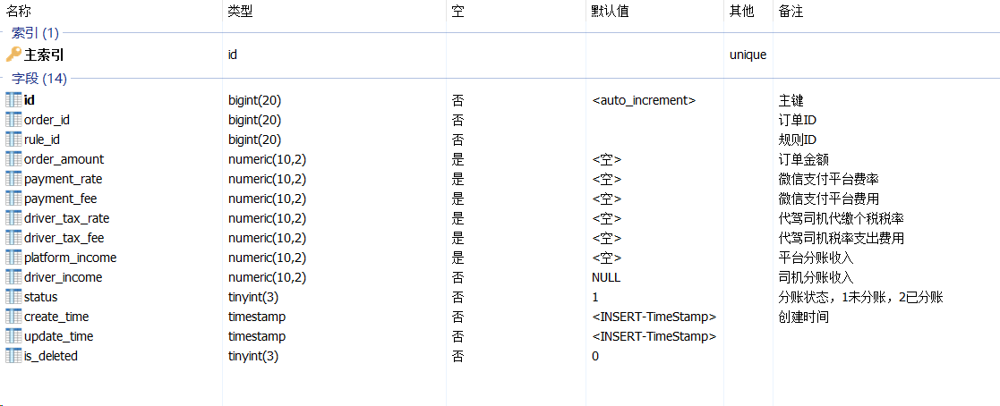

# 代驾：订单执行

## 一、结束代驾

司机到达代驾终点，就可以结束代驾了，结束代驾我们要输入其他费用（路桥费、停车费与其他费用）、计算订单实际里程、计算代驾实际费用、系统奖励、分账信息与生成账单。


### 1、计算订单实际里程

订单实际里程其实就是把MongoDB中该订单的GPS定位坐标都给取出来，以时间排序，连接成连线，这个线的距离就是时间里程。

#### 1.1、地图微服务接口

##### 1.1.1、LocationUtil

工具类可以添加到common-util模块

```java
package com.atguigu.daijia.common.util;

public class LocationUtil {

    // 地球赤道半径
    private static double EARTH_RADIUS = 6378.137;

    //等同——Math.toRadians()
    private static double rad(double d) {
        return d * Math.PI / 180.0;
    }

    /**
     * @描述 经纬度获取距离，单位为米
     * @参数 [lat1, lng1, lat2, lng2]
     * @返回值 double
     **/
    public static double getDistance(double lat1, double lng1, double lat2,
                                     double lng2) {
        double radLat1 = rad(lat1);
        double radLat2 = rad(lat2);
        double a = radLat1 - radLat2;
        double b = rad(lng1) - rad(lng2);
        double s = 2 * Math.asin(Math.sqrt(Math.pow(Math.sin(a / 2), 2)
                + Math.cos(radLat1) * Math.cos(radLat2)
                * Math.pow(Math.sin(b / 2), 2)));
        s = s * EARTH_RADIUS;
        s = Math.round(s * 10000d) / 10000d;
        s = s * 1000;
        return s;
    }

    public static void main(String[] args) {
        double distance = getDistance(30.57404, 104.073013,
                30.509376, 104.077001);
        System.out.println("距离" + distance + "米");
    }

}
```

##### 1.1.2、LocationController

```java
@Operation(summary = "代驾服务：计算订单实际里程")
@GetMapping("/calculateOrderRealDistance/{orderId}")
public Result<BigDecimal> calculateOrderRealDistance(@PathVariable Long orderId) {
   return Result.ok(locationService.calculateOrderRealDistance(orderId));
}
```

##### 1.1.3、LocationService

```java
BigDecimal calculateOrderRealDistance(Long orderId);
```

##### 1.1.4、LocationServiceImpl

```java
@Autowired
private OrderInfoFeignClient orderInfoFeignClient;

@Override
public BigDecimal calculateOrderRealDistance(Long orderId) {
    List<OrderServiceLocation> orderServiceLocationList = orderServiceLocationRepository.findByOrderIdOrderByCreateTimeAsc(orderId);
    double realDistance = 0;
    if(!CollectionUtils.isEmpty(orderServiceLocationList)) {
        for (int i = 0, size=orderServiceLocationList.size()-1; i < size; i++) {
            OrderServiceLocation location1 = orderServiceLocationList.get(i);
            OrderServiceLocation location2 = orderServiceLocationList.get(i+1);

            double distance = LocationUtil.getDistance(location1.getLatitude().doubleValue(), location1.getLongitude().doubleValue(), location2.getLatitude().doubleValue(), location2.getLongitude().doubleValue());
            realDistance += distance;
        }
    }
    //测试过程中，没有真正代驾，实际代驾GPS位置没有变化，模拟：实际代驾里程 = 预期里程 + 5
    if(realDistance == 0) {
        return orderInfoFeignClient.getOrderInfo(orderId).getData().getExpectDistance().add(new BigDecimal("5"));
    }
    return new BigDecimal(realDistance);
}
```

##### 1.1.5、OrderServiceLocationRepository

```java
List<OrderServiceLocation> findByOrderIdOrderByCreateTimeAsc(Long orderId);
```

#### 1.2、Feign接口

##### 1.2.1、LocationFeignClient

```java
/**
 * 代驾服务：计算订单实际里程
 * @param orderId
 * @return
 */
@GetMapping("/map/location/calculateOrderRealDistance/{orderId}")
Result<BigDecimal> calculateOrderRealDistance(@PathVariable Long orderId);
```


### 2、计算系统奖励

系统奖励规则：

```
系统奖励
    每天完成5单后 每单奖励2元
    每天完成10单后 每单奖励5元
    每天完成20单后 每单奖励10元
```

#### 2.1、规则微服务接口

##### 2.1.1、RewardRuleRequestForm

输入参数：

```java
package com.atguigu.daijia.model.form.rules;

@Data
public class RewardRuleRequestForm {

    @Schema(description = "订单个数")
    private Long orderNum;

}
```


##### 2.1.2、RewardRuleResponseVo

输出参数：

```java
package com.atguigu.daijia.model.vo.rules;

@Data
public class RewardRuleResponseVo {

    @Schema(description = "奖励规则ID")
    private Long rewardRuleId;

    @Schema(description = "奖励金额")
    private BigDecimal rewardAmount;

}
```


##### 2.1.3、规则文本

```java
//package对应的不一定是真正的目录，可以任意写com.abc，同一个包下的drl文件可以相互访问
package  com.atguigu.daijia

import com.atguigu.daijia.model.form.rules.RewardRuleRequest;
import java.math.BigDecimal;
import java.math.RoundingMode;

global com.atguigu.daijia.model.vo.rules.RewardRuleResponse rewardRuleResponse;

/**
系统奖励
    每天完成5单后 每单奖励2元
    每天完成10单后 每单奖励5元
    每天完成20单后 每单奖励10元
*/
rule "完成5单后 每单奖励2元"
    salience 10          //指定优先级，数值越大优先级越高，不指定的情况下由上到下执行
    no-loop true         //防止陷入死循环
    when
        /*规则条件，到工作内存中查找FeeRuleRequest对象
        里面出来的结果只能是ture或者false
        $rule是绑定变量名，可以任意命名，官方推荐$符号，定义了绑定变量名，可以在then部分操作fact对象*/
        $rule:RewardRuleRequest(orderNum >= 5 && orderNum < 10)
    then
        rewardRuleResponse.setRewardAmount(new BigDecimal("2.0"));
        System.out.println("完成10单后 奖励：" + rewardRuleResponse.getRewardAmount() + "元");
end
rule "完成10单后 每单奖励5元"
    salience 10          //指定优先级，数值越大优先级越高，不指定的情况下由上到下执行
    no-loop true         //防止陷入死循环
    when
        /*规则条件，到工作内存中查找FeeRuleRequest对象
        里面出来的结果只能是ture或者false
        $rule是绑定变量名，可以任意命名，官方推荐$符号，定义了绑定变量名，可以在then部分操作fact对象*/
        $rule:RewardRuleRequest(orderNum >= 10 && orderNum < 20)
    then
        rewardRuleResponse.setRewardAmount(new BigDecimal("5.0"));
        System.out.println("完成10单后 奖励：" + rewardRuleResponse.getRewardAmount() + "元");
end
rule "完成20单后 每单奖励10元"
    salience 10          //指定优先级，数值越大优先级越高，不指定的情况下由上到下执行
    no-loop true         //防止陷入死循环
    when
        /*规则条件，到工作内存中查找FeeRuleRequest对象
        里面出来的结果只能是ture或者false
        $rule是绑定变量名，可以任意命名，官方推荐$符号，定义了绑定变量名，可以在then部分操作fact对象*/
        $rule:RewardRuleRequest(orderNum >= 20)
    then
        rewardRuleResponse.setRewardAmount(new BigDecimal("10.0"));
        System.out.println("完成20单后 奖励：" + rewardRuleResponse.getRewardAmount() + "元");
end
```


##### 2.1.4、DroolsHelper

定义一个Drools帮助类，接收规则文件，返回KieSession即可

```java
public class DroolsHelper {
    
    private static final String RULES_CUSTOMER_RULES_DRL = "rules/FeeRule.drl";

    public static KieSession loadForRule(String drlStr) {
         KieServices kieServices = KieServices.Factory.get();
        
        KieFileSystem kieFileSystem = kieServices.newKieFileSystem();
    kieFileSystem.write(
        ResourceFactory.newClassPathResource(drlStr));
        
        KieBuilder kb = kieServices.newKieBuilder(kieFileSystem);
        kb.buildAll();

        KieModule kieModule = kb.getKieModule();
        KieContainer kieContainer = kieServices.newKieContainer(kieModule.getReleaseId());
        return kieContainer.newKieSession();
    }
}
```


##### 2.1.5、RewardRuleController

```java
@Autowired
private RewardRuleService rewardRuleService;

@Operation(summary = "计算订单奖励费用")
@PostMapping("/calculateOrderRewardFee")
public Result<RewardRuleResponseVo> calculateOrderRewardFee(@RequestBody RewardRuleRequestForm rewardRuleRequestForm) {
   return Result.ok(rewardRuleService.calculateOrderRewardFee(rewardRuleRequestForm));
}
```


##### 2.1.6、RewardRuleService

```java
RewardRuleResponseVo 
    calculateOrderRewardFee(RewardRuleRequestForm rewardRuleRequestForm);
```


##### 2.1.7、RewardRuleServiceImpl

```java
@Autowired
private RewardRuleMapper rewardRuleMapper;

@Override
public RewardRuleResponseVo calculateOrderRewardFee(RewardRuleRequestForm rewardRuleRequestForm) {
    //封装传入对象
    RewardRuleRequest rewardRuleRequest = new RewardRuleRequest();
    rewardRuleRequest.setOrderNum(rewardRuleRequestForm.getOrderNum());
    log.info("传入参数：{}", JSON.toJSONString(rewardRuleRequest));

    //获取最新订单费用规则
    RewardRule rewardRule = rewardRuleMapper.selectOne(new LambdaQueryWrapper<RewardRule>().orderByDesc(RewardRule::getId).last("limit 1"));
    KieSession kieSession = DroolsHelper.loadForRule(rewardRule.getRule());

    //封装返回对象
    RewardRuleResponse rewardRuleResponse = new RewardRuleResponse();
    kieSession.setGlobal("rewardRuleResponse", rewardRuleResponse);
    // 设置订单对象
    kieSession.insert(rewardRuleRequest);
    // 触发规则
    kieSession.fireAllRules();
    // 中止会话
    kieSession.dispose();
    log.info("计算结果：{}", JSON.toJSONString(rewardRuleResponse));

    //封装返回对象
    RewardRuleResponseVo rewardRuleResponseVo = new RewardRuleResponseVo();
    rewardRuleResponseVo.setRewardRuleId(rewardRule.getId());
    rewardRuleResponseVo.setRewardAmount(rewardRuleResponse.getRewardAmount());
    return rewardRuleResponseVo;
}
```


#### 2.2、Feign接口

##### 2.2.1、RewardRuleFeignClient

```java
/**
 * 计算订单奖励费用
 * @param rewardRuleRequestForm
 * @return
 */
@PostMapping("/rules/reward/calculateOrderRewardFee")
Result<RewardRuleResponseVo> calculateOrderRewardFee(@RequestBody RewardRuleRequestForm rewardRuleRequestForm);
```


### 3、根据时间段获取订单数

#### 3.1、订单微服务接口

##### 3.1.1、OrderInfoController

```java
@Operation(summary = "根据时间段获取订单数")
@GetMapping("/getOrderNumByTime/{startTime}/{endTime}")
public Result<Long> getOrderNumByTime(@PathVariable String startTime, @PathVariable String endTime) {
   return Result.ok(orderInfoService.getOrderNumByTime(startTime, endTime));
}
```

##### 3.1.2、OrderInfoService

```java
Long getOrderNumByTime(String startTime, String endTime);
```

##### 3.1.3、OrderInfoServiceImpl

```java
@Override
  public Long getOrderNumByTime(String startTime, String endTime) {
LambdaQueryWrapper<OrderInfo> queryWrapper = new LambdaQueryWrapper<>();
queryWrapper.ge(OrderInfo::getStartServiceTime, startTime);
queryWrapper.lt(OrderInfo::getStartServiceTime, endTime);
Long count = orderInfoMapper.selectCount(queryWrapper);
return count;
  }
```

#### 3.2、Feign接口

##### 3.2.1、OrderInfoFeignClient

```java
/**
 *  根据时间段获取订单数
 * @param startTime
 * @param endTime
 * @return
 */
@GetMapping("/order/info/getOrderNumByTime/{startTime}/{endTime}")
Result<Long> getOrderNumByTime(@PathVariable("startTime") String startTime, @PathVariable("endTime") String endTime);
```


### 4、计算分账信息

结束代驾，我们还要计算分账信息，将分账信息记录数据库表，用户支付后，实时分账。

分账表信息



分账规则：

```
支付微信平台费用
    平台费率：0.6%
   
订单金额小于等于100
    当天完成订单小于等于10单 平台抽成 20%
    当天完成订单大于10单 平台抽成 18%
    
订单金额大于100
    当天完成订单小于等于10单 平台抽成 18%
    当天完成订单大于10单 平台抽成 16%
```

#### 4.1、规则微服务接口

##### 4.1.1、RewardRuleRequestForm

输入参数：

```java
package com.atguigu.daijia.model.form.rules;

@Data
public class ProfitsharingRuleRequestForm {

    @Schema(description = "订单金额")
    private BigDecimal orderAmount;

    @Schema(description = "当天完成订单个数")
    private Long orderNum;
}
```

##### 4.1.2、RewardRuleResponseVo

输出参数：

```java
package com.atguigu.daijia.model.vo.rules;

@Data
public class ProfitsharingRuleResponseVo {

    @Schema(description = "分账规则ID")
    private Long profitsharingRuleId;

    @Schema(description = "订单金额")
    private BigDecimal orderAmount;

    @Schema(description = "微信支付平台费率")
    private BigDecimal paymentRate;

    @Schema(description = "微信支付平台费用")
    private BigDecimal paymentFee;

    @Schema(description = "代驾司机代缴个税税率")
    private BigDecimal driverTaxRate;

    @Schema(description = "代驾司机税率支出费用")
    private BigDecimal driverTaxFee;

    @Schema(description = "平台分账收入")
    private BigDecimal platformIncome;

    @Schema(description = "司机分账收入")
    private BigDecimal driverIncome;
}

```

##### 4.1.3、规则文本

放入reward_rule数据库表

```java
//package对应的不一定是真正的目录，可以任意写com.abc，同一个包下的drl文件可以相互访问
package  com.atguigu.daijia

import com.atguigu.daijia.model.form.rules.ProfitsharingRuleRequest;
import java.math.BigDecimal;
import java.math.RoundingMode;

global com.atguigu.daijia.model.vo.rules.ProfitsharingRuleResponse profitsharingRuleResponse;

/**
支付微信平台费用
    平台费率：0.6%
*/
rule "支付微信平台费用 平台费率：0.6%"
    salience 10          //指定优先级，数值越大优先级越高，不指定的情况下由上到下执行
    no-loop true         //防止陷入死循环
    when
        /*规则条件，到工作内存中查找FeeRuleRequest对象
        里面出来的结果只能是ture或者false
        $rule是绑定变量名，可以任意命名，官方推荐$符号，定义了绑定变量名，可以在then部分操作fact对象*/
        $rule:ProfitsharingRuleRequest()
    then
        profitsharingRuleResponse.setOrderAmount($rule.getOrderAmount());
        profitsharingRuleResponse.setPaymentRate(new BigDecimal("0.006"));
        BigDecimal paymentFee = profitsharingRuleResponse.getOrderAmount().multiply(profitsharingRuleResponse.getPaymentRate()).setScale(2, RoundingMode.HALF_UP);
        profitsharingRuleResponse.setPaymentFee(paymentFee);
        System.out.println("支付微信平台费用：" + profitsharingRuleResponse.getPaymentFee() + "元");
end

/**
订单金额小于等于100
    当天完成订单小于等于10单 平台抽成 20%
    当天完成订单大于10单 平台抽成 18%
*/
rule "订单金额小于等于100 当天完成订单小于等于10单"
    salience 10          //指定优先级，数值越大优先级越高，不指定的情况下由上到下执行
    no-loop true         //防止陷入死循环
    when
        /*规则条件，到工作内存中查找FeeRuleRequest对象
        里面出来的结果只能是ture或者false
        $rule是绑定变量名，可以任意命名，官方推荐$符号，定义了绑定变量名，可以在then部分操作fact对象*/
        $rule:ProfitsharingRuleRequest(orderAmount.doubleValue() <= 100.0 && orderNum <= 10)
    then
        BigDecimal totalAmount = profitsharingRuleResponse.getOrderAmount().subtract(profitsharingRuleResponse.getPaymentFee());
        BigDecimal platformIncome = totalAmount.multiply(new BigDecimal("0.2")).setScale(2, RoundingMode.HALF_UP);
        BigDecimal driverTotalIncome = totalAmount.subtract(platformIncome);
        //代驾司机个税，税率：10%
        BigDecimal driverTaxFee = driverTotalIncome.multiply(new BigDecimal("0.1")).setScale(2, RoundingMode.HALF_UP);
        BigDecimal driverIncome = driverTotalIncome.subtract(driverTaxFee);
        profitsharingRuleResponse.setPlatformIncome(platformIncome);
        profitsharingRuleResponse.setDriverIncome(driverIncome);
        profitsharingRuleResponse.setDriverTaxRate(new BigDecimal("0.1"));
        profitsharingRuleResponse.setDriverTaxFee(driverTaxFee);
        System.out.println("平台分账收入：" + platformIncome + "元" + "，司机分账收入：" + driverIncome + "元" + "，司机个税：" + driverTaxFee + "元");
end
rule "订单金额小于等于100 天完成订单大于10单"
    salience 10          //指定优先级，数值越大优先级越高，不指定的情况下由上到下执行
    no-loop true         //防止陷入死循环
    when
        /*规则条件，到工作内存中查找FeeRuleRequest对象
        里面出来的结果只能是ture或者false
        $rule是绑定变量名，可以任意命名，官方推荐$符号，定义了绑定变量名，可以在then部分操作fact对象*/
        $rule:ProfitsharingRuleRequest(orderAmount.doubleValue() <= 100.0 && orderNum > 10)
    then
        BigDecimal totalAmount = profitsharingRuleResponse.getOrderAmount().subtract(profitsharingRuleResponse.getPaymentFee());
        BigDecimal platformIncome = totalAmount.multiply(new BigDecimal("0.18")).setScale(2, RoundingMode.HALF_UP);
        BigDecimal driverTotalIncome = totalAmount.subtract(platformIncome);
        //代驾司机个税，税率：10%
        BigDecimal driverTaxFee = driverTotalIncome.multiply(new BigDecimal("0.1")).setScale(2, RoundingMode.HALF_UP);
        BigDecimal driverIncome = driverTotalIncome.subtract(driverTaxFee);
        profitsharingRuleResponse.setPlatformIncome(platformIncome);
        profitsharingRuleResponse.setDriverIncome(driverIncome);
        profitsharingRuleResponse.setDriverTaxRate(new BigDecimal("0.1"));
        profitsharingRuleResponse.setDriverTaxFee(driverTaxFee);
        System.out.println("平台分账收入：" + platformIncome + "元" + "，司机分账收入：" + driverIncome + "元" + "，司机个税：" + driverTaxFee + "元");
end

/**
订单金额大于100
    当天完成订单小于等于10单 平台抽成 18%
    当天完成订单大于10单 平台抽成 16%
*/
rule "订单金额大于100 当天完成订单小于等于10单"
    salience 10          //指定优先级，数值越大优先级越高，不指定的情况下由上到下执行
    no-loop true         //防止陷入死循环
    when
        /*规则条件，到工作内存中查找FeeRuleRequest对象
        里面出来的结果只能是ture或者false
        $rule是绑定变量名，可以任意命名，官方推荐$符号，定义了绑定变量名，可以在then部分操作fact对象*/
        $rule:ProfitsharingRuleRequest(orderAmount.doubleValue() > 100.0 && orderNum <= 10)
    then
        BigDecimal totalAmount = profitsharingRuleResponse.getOrderAmount().subtract(profitsharingRuleResponse.getPaymentFee());
        BigDecimal platformIncome = totalAmount.multiply(new BigDecimal("0.18")).setScale(2, RoundingMode.HALF_UP);
        BigDecimal driverTotalIncome = totalAmount.subtract(platformIncome);
        //代驾司机个税，税率：10%
        BigDecimal driverTaxFee = driverTotalIncome.multiply(new BigDecimal("0.1")).setScale(2, RoundingMode.HALF_UP);
        BigDecimal driverIncome = driverTotalIncome.subtract(driverTaxFee);
        profitsharingRuleResponse.setPlatformIncome(platformIncome);
        profitsharingRuleResponse.setDriverIncome(driverIncome);
        profitsharingRuleResponse.setDriverTaxRate(new BigDecimal("0.1"));
        profitsharingRuleResponse.setDriverTaxFee(driverTaxFee);
        System.out.println("平台分账收入：" + platformIncome + "元" + "，司机分账收入：" + driverIncome + "元" + "，司机个税：" + driverTaxFee + "元");
end
rule "订单金额大于100 天完成订单大于10单"
    salience 10          //指定优先级，数值越大优先级越高，不指定的情况下由上到下执行
    no-loop true         //防止陷入死循环
    when
        /*规则条件，到工作内存中查找FeeRuleRequest对象
        里面出来的结果只能是ture或者false
        $rule是绑定变量名，可以任意命名，官方推荐$符号，定义了绑定变量名，可以在then部分操作fact对象*/
        $rule:ProfitsharingRuleRequest(orderAmount.doubleValue() > 100.0 && orderNum > 10)
    then
        BigDecimal totalAmount = profitsharingRuleResponse.getOrderAmount().subtract(profitsharingRuleResponse.getPaymentFee());
        BigDecimal platformIncome = totalAmount.multiply(new BigDecimal("0.18")).setScale(2, RoundingMode.HALF_UP);
        BigDecimal driverTotalIncome = totalAmount.subtract(platformIncome);
        //代驾司机个税，税率：10%
        BigDecimal driverTaxFee = driverTotalIncome.multiply(new BigDecimal("0.1")).setScale(2, RoundingMode.HALF_UP);
        BigDecimal driverIncome = driverTotalIncome.subtract(driverTaxFee);
        profitsharingRuleResponse.setPlatformIncome(platformIncome);
        profitsharingRuleResponse.setDriverIncome(driverIncome);
        profitsharingRuleResponse.setDriverTaxRate(new BigDecimal("0.1"));
        profitsharingRuleResponse.setDriverTaxFee(driverTaxFee);
        System.out.println("平台分账收入：" + platformIncome + "元" + "，司机分账收入：" + driverIncome + "元" + "，司机个税：" + driverTaxFee + "元");
end
```

##### 4.1.4、ProfitsharingRuleController

```java
@Autowired
private ProfitsharingRuleService profitsharingRuleService;

@Operation(summary = "计算系统分账费用")
@PostMapping("/calculateOrderProfitsharingFee")
public Result<ProfitsharingRuleResponseVo> calculateOrderProfitsharingFee(@RequestBody ProfitsharingRuleRequestForm profitsharingRuleRequestForm) {
    return Result.ok(profitsharingRuleService.calculateOrderProfitsharingFee(profitsharingRuleRequestForm));
}
```

##### 4.1.5、ProfitsharingRuleService

```java
ProfitsharingRuleResponseVo calculateOrderProfitsharingFee(ProfitsharingRuleRequestForm profitsharingRuleRequestForm);
```

##### 4.1.6、ProfitsharingRuleServiceImpl

```java
@Autowired
private ProfitsharingRuleMapper rewardRuleMapper;

@Override
public ProfitsharingRuleResponseVo calculateOrderProfitsharingFee(ProfitsharingRuleRequestForm profitsharingRuleRequestForm) {
    //封装传入对象
    ProfitsharingRuleRequest profitsharingRuleRequest = new ProfitsharingRuleRequest();
    profitsharingRuleRequest.setOrderAmount(profitsharingRuleRequestForm.getOrderAmount());
    profitsharingRuleRequest.setOrderNum(profitsharingRuleRequestForm.getOrderNum());
    log.info("传入参数：{}", JSON.toJSONString(profitsharingRuleRequest));

    //获取最新订单费用规则
    ProfitsharingRule profitsharingRule = rewardRuleMapper.selectOne(new LambdaQueryWrapper<ProfitsharingRule>().orderByDesc(ProfitsharingRule::getId).last("limit 1"));
    KieSession kieSession = DroolsHelper.loadForRule(profitsharingRule.getRule());

    //封装返回对象
    ProfitsharingRuleResponse profitsharingRuleResponse = new ProfitsharingRuleResponse();
    kieSession.setGlobal("profitsharingRuleResponse", profitsharingRuleResponse);
    // 设置订单对象
    kieSession.insert(profitsharingRuleRequest);
    // 触发规则
    kieSession.fireAllRules();
    // 中止会话
    kieSession.dispose();
    log.info("计算结果：{}", JSON.toJSONString(profitsharingRuleResponse));

    //封装返回对象
    ProfitsharingRuleResponseVo profitsharingRuleResponseVo = new ProfitsharingRuleResponseVo();
    profitsharingRuleResponseVo.setProfitsharingRuleId(profitsharingRule.getId());
    BeanUtils.copyProperties(profitsharingRuleResponse, profitsharingRuleResponseVo);
    return profitsharingRuleResponseVo;
}
```

#### 4.2、Feign接口

##### 4.2.1、ProfitsharingRuleFeignClient

```java
/**
 * 计算订单分账数据
 * @param profitsharingRuleRequestForm
 * @return
 */
@PostMapping("/rules/profitsharing/calculateOrderProfitsharingFee")
Result<ProfitsharingRuleResponseVo> calculateOrderProfitsharingFee(@RequestBody ProfitsharingRuleRequestForm profitsharingRuleRequestForm);
```


### 5、结束代驾更新账单

#### 5.1、订单微服务接口

##### 5.1.1、OrderInfoController

```java
@Operation(summary = "结束代驾服务更新订单账单")
@PostMapping("/endDrive")
public Result<Boolean> endDrive(@RequestBody UpdateOrderBillForm updateOrderBillForm) {
   return Result.ok(orderInfoService.endDrive(updateOrderBillForm));
}
```

##### 5.1.2、OrderInfoService

```java
Boolean endDrive(UpdateOrderBillForm updateOrderBillForm);
```

##### 5.1.3、OrderInfoServiceImpl

```java
@Autowired
private OrderBillMapper orderBillMapper;

@Autowired
private OrderProfitsharingMapper orderProfitsharingMapper;

@Transactional(rollbackFor = Exception.class)
@Override
public Boolean endDrive(UpdateOrderBillForm updateOrderBillForm) {
   //更新订单信息
   LambdaQueryWrapper<OrderInfo> queryWrapper = new LambdaQueryWrapper<>();
   queryWrapper.eq(OrderInfo::getId, updateOrderBillForm.getOrderId());
   queryWrapper.eq(OrderInfo::getDriverId, updateOrderBillForm.getDriverId());
   //更新字段
   OrderInfo updateOrderInfo = new OrderInfo();
   updateOrderInfo.setStatus(OrderStatus.END_SERVICE.getStatus());
   updateOrderInfo.setRealAmount(updateOrderBillForm.getTotalAmount());
   updateOrderInfo.setFavourFee(updateOrderBillForm.getFavourFee());
   updateOrderInfo.setEndServiceTime(new Date());
   updateOrderInfo.setRealDistance(updateOrderBillForm.getRealDistance());
   //只能更新自己的订单
   int row = orderInfoMapper.update(updateOrderInfo, queryWrapper);
   if(row == 1) {
      //记录日志
      this.log(updateOrderBillForm.getOrderId(), OrderStatus.END_SERVICE.getStatus());

      //插入实际账单数据
      OrderBill orderBill = new OrderBill();
      BeanUtils.copyProperties(updateOrderBillForm, orderBill);
      orderBill.setOrderId(updateOrderBillForm.getOrderId());
      orderBill.setPayAmount(orderBill.getTotalAmount());
      orderBillMapper.insert(orderBill);

      //插入分账信息数据
      OrderProfitsharing orderProfitsharing = new OrderProfitsharing();
      BeanUtils.copyProperties(updateOrderBillForm, orderProfitsharing);
      orderProfitsharing.setOrderId(updateOrderBillForm.getOrderId());
      orderProfitsharing.setRuleId(updateOrderBillForm.getProfitsharingRuleId());
      orderProfitsharing.setStatus(1);
      orderProfitsharingMapper.insert(orderProfitsharing);
   } else {
      throw new GuiguException(ResultCodeEnum.UPDATE_ERROR);
   }
   return true;
}
```

#### 5.2、Feign接口

##### 5.2.1、OrderInfoFeignClient

```java
/**
 * 结束代驾服务更新订单账单
 * @param updateOrderBillForm
 * @return
 */
@PostMapping("/order/info/endDrive")
Result<Boolean> endDrive(@RequestBody UpdateOrderBillForm updateOrderBillForm);
```


### 6、结束代驾

#### 6.1、司机端web接口

##### 6.1.1、OrderController

```java
@Operation(summary = "结束代驾服务更新订单账单")
@GuiguLogin
@PostMapping("/endDrive")
public Result<Boolean> endDrive(@RequestBody OrderFeeForm orderFeeForm) {
   Long driverId = AuthContextHolder.getUserId();
   orderFeeForm.setDriverId(driverId);
   return Result.ok(orderService.endDrive(orderFeeForm));
}
```

##### 6.1.2、OrderService

```java
Boolean endDrive(OrderFeeForm orderFeeForm);
```

##### 6.1.3、OrderServiceImpl

```java
@Autowired
private LocationFeignClient locationFeignClient;

@Autowired
private FeeRuleFeignClient feeRuleFeignClient;

@Autowired
private RewardRuleFeignClient rewardRuleFeignClient;

@Autowired
private ProfitsharingRuleFeignClient profitsharingRuleFeignClient;

@Override
public Boolean endDrive(OrderFeeForm orderFeeForm) {
   //1.获取订单信息
   OrderInfo orderInfo = orderInfoFeignClient.getOrderInfo(orderFeeForm.getOrderId()).getData();
   if(orderInfo.getDriverId().longValue() != orderFeeForm.getDriverId().longValue()) {
      throw new GuiguException(ResultCodeEnum.ARGUMENT_VALID_ERROR);
   }

   //2.计算订单实际里程
   BigDecimal realDistance = locationFeignClient.calculateOrderRealDistance(orderFeeForm.getOrderId()).getData();
   log.info("结束代驾，订单实际里程：{}", realDistance);

   //3.计算代驾实际费用
   FeeRuleRequestForm feeRuleRequestForm = new FeeRuleRequestForm();
   feeRuleRequestForm.setDistance(realDistance);
   feeRuleRequestForm.setStartTime(orderInfo.getStartServiceTime());
   //等候时间
   Integer waitMinute = Math.abs((int) ((orderInfo.getArriveTime().getTime() - orderInfo.getAcceptTime().getTime()) / (1000 * 60)));
   feeRuleRequestForm.setWaitMinute(waitMinute);
   log.info("结束代驾，费用参数：{}", JSON.toJSONString(feeRuleRequestForm));
   FeeRuleResponseVo feeRuleResponseVo = feeRuleFeignClient.calculateOrderFee(feeRuleRequestForm).getData();
   log.info("费用明细：{}", JSON.toJSONString(feeRuleResponseVo));
   //订单总金额 需加上 路桥费、停车费、其他费用、乘客好处费
   BigDecimal totalAmount = feeRuleResponseVo.getTotalAmount().add(orderFeeForm.getTollFee()).add(orderFeeForm.getParkingFee()).add(orderFeeForm.getOtherFee()).add(orderInfo.getFavourFee());
   feeRuleResponseVo.setTotalAmount(totalAmount);

   //4.计算系统奖励
   //4.1.获取订单数
   String startTime = new DateTime(orderInfo.getStartServiceTime()).toString("yyyy-MM-dd") + " 00:00:00";
   String endTime = new DateTime(orderInfo.getStartServiceTime()).toString("yyyy-MM-dd") + " 24:00:00";
   Long orderNum = orderInfoFeignClient.getOrderNumByTime(startTime, endTime).getData();
   //4.2.封装参数
   RewardRuleRequestForm rewardRuleRequestForm = new RewardRuleRequestForm();
   rewardRuleRequestForm.setStartTime(orderInfo.getStartServiceTime());
   rewardRuleRequestForm.setOrderNum(orderNum);
   //4.3.执行
   RewardRuleResponseVo rewardRuleResponseVo = rewardRuleFeignClient.calculateOrderRewardFee(rewardRuleRequestForm).getData();
   log.info("结束代驾，系统奖励：{}", JSON.toJSONString(rewardRuleResponseVo));
   
   //5.计算分账信息
   ProfitsharingRuleRequestForm profitsharingRuleRequestForm = new ProfitsharingRuleRequestForm();
   profitsharingRuleRequestForm.setOrderAmount(feeRuleResponseVo.getTotalAmount());
   profitsharingRuleRequestForm.setOrderNum(orderNum);
   ProfitsharingRuleResponseVo profitsharingRuleResponseVo = profitsharingRuleFeignClient.calculateOrderProfitsharingFee(profitsharingRuleRequestForm).getData();
   log.info("结束代驾，分账信息：{}", JSON.toJSONString(profitsharingRuleResponseVo));
   
   //6.封装更新订单账单相关实体对象
   UpdateOrderBillForm updateOrderBillForm = new UpdateOrderBillForm();
   updateOrderBillForm.setOrderId(orderFeeForm.getOrderId());
   updateOrderBillForm.setDriverId(orderFeeForm.getDriverId());
   //路桥费、停车费、其他费用
   updateOrderBillForm.setTollFee(orderFeeForm.getTollFee());
   updateOrderBillForm.setParkingFee(orderFeeForm.getParkingFee());
   updateOrderBillForm.setOtherFee(orderFeeForm.getOtherFee());
   //乘客好处费
   updateOrderBillForm.setFavourFee(orderInfo.getFavourFee());

   //实际里程
   updateOrderBillForm.setRealDistance(realDistance);
   //订单奖励信息
   BeanUtils.copyProperties(rewardRuleResponseVo, updateOrderBillForm);
   //代驾费用信息
   BeanUtils.copyProperties(feeRuleResponseVo, updateOrderBillForm);

   //分账相关信息
   BeanUtils.copyProperties(profitsharingRuleResponseVo, updateOrderBillForm);
   updateOrderBillForm.setProfitsharingRuleId(profitsharingRuleResponseVo.getProfitsharingRuleId());
   log.info("结束代驾，更新账单信息：{}", JSON.toJSONString(updateOrderBillForm));

   //7.结束代驾更新账单
   orderInfoFeignClient.endDrive(updateOrderBillForm);
   return true;
}
```


### 7、智能判断司机刷单行为

判断司机刷单的办法也很简单，司机点击到达上车点按钮的时候，司机端小程序通过腾讯地图服务的API，计算当前定位到上车点的距离。如果超过1公里，那就不可以。司机必须距离上车点在1公里以内，点击到达上车点才有效。当司机想要结束代驾的时候，距离代驾终点必须在2公里以内才可以，否则就无法结束代驾。

只是上面的限制也是不够的，我们后面还可以加上预期的里程与实际的里程的一个距离差来进一步判断。

#### 7.1、OrderServiceImpl

司机端web接口，司机到达代驾起始地点加限制

```java
@Override
public Boolean driverArriveStartLocation(Long orderId, Long driverId) {
    //防止刷单，计算司机的经纬度与代驾的起始经纬度是否在1公里范围内
    OrderInfo orderInfo = orderInfoFeignClient.getOrderInfo(orderId).getData();
    OrderLocationVo orderLocationVo = locationFeignClient.getCacheOrderLocation(orderId).getData();
    //司机的位置与代驾起始点位置的距离
    double distance = LocationUtil.getDistance(orderInfo.getStartPointLatitude().doubleValue(), orderInfo.getStartPointLongitude().doubleValue(), orderLocationVo.getLatitude().doubleValue(), orderLocationVo.getLongitude().doubleValue());
    if(distance > SystemConstant.DRIVER_START_LOCATION_DISTION) {
        throw new GuiguException(ResultCodeEnum.DRIVER_START_LOCATION_DISTION_ERROR);
    }
    return orderInfoFeignClient.driverArriveStartLocation(orderId, driverId).getData();
}
```

#### 7.2、OrderServiceImpl

司机端web接口，结束代驾服务更新订单账单加限制

```java
@Override
public Boolean endDrive(OrderFeeForm orderFeeForm) {
   //1.获取订单信息
   OrderInfo orderInfo = orderInfoFeignClient.getOrderInfo(orderFeeForm.getOrderId()).getData();
   if(orderInfo.getDriverId().longValue() != orderFeeForm.getDriverId().longValue()) {
      throw new GuiguException(ResultCodeEnum.ARGUMENT_VALID_ERROR);
   }

   //2.防止刷单，计算司机的经纬度与代驾的终点经纬度是否在2公里范围内
   OrderServiceLastLocationVo orderServiceLastLocationVo = locationFeignClient.getOrderServiceLastLocation(orderFeeForm.getOrderId()).getData();
   //司机的位置与代驾终点位置的距离
   double distance = LocationUtil.getDistance(orderInfo.getEndPointLatitude().doubleValue(), orderInfo.getEndPointLongitude().doubleValue(), orderServiceLastLocationVo.getLatitude().doubleValue(), orderServiceLastLocationVo.getLongitude().doubleValue());
   if(distance > SystemConstant.DRIVER_START_LOCATION_DISTION) {
      throw new GuiguException(ResultCodeEnum.DRIVER_END_LOCATION_DISTION_ERROR);
   }

   //3.计算订单实际里程
   BigDecimal realDistance = locationFeignClient.calculateOrderRealDistance(orderFeeForm.getOrderId()).getData();
   log.info("结束代驾，订单实际里程：{}", realDistance);

   //4.计算代驾实际费用
   FeeRuleRequestForm feeRuleRequestForm = new FeeRuleRequestForm();
   feeRuleRequestForm.setDistance(realDistance);
   feeRuleRequestForm.setStartTime(orderInfo.getStartServiceTime());
   //等候时间
   Integer waitMinute = Math.abs((int) ((orderInfo.getArriveTime().getTime() - orderInfo.getAcceptTime().getTime()) / (1000 * 60)));
   feeRuleRequestForm.setWaitMinute(waitMinute);
   log.info("结束代驾，费用参数：{}", JSON.toJSONString(feeRuleRequestForm));
   FeeRuleResponseVo feeRuleResponseVo = feeRuleFeignClient.calculateOrderFee(feeRuleRequestForm).getData();
   log.info("费用明细：{}", JSON.toJSONString(feeRuleResponseVo));
   //订单总金额 需加上 路桥费、停车费、其他费用、乘客好处费
   BigDecimal totalAmount = feeRuleResponseVo.getTotalAmount().add(orderFeeForm.getTollFee()).add(orderFeeForm.getParkingFee()).add(orderFeeForm.getOtherFee()).add(orderInfo.getFavourFee());
   feeRuleResponseVo.setTotalAmount(totalAmount);

   //5.计算系统奖励
   //5.1.获取订单数
   String startTime = new DateTime(orderInfo.getStartServiceTime()).toString("yyyy-MM-dd") + " 00:00:00";
   String endTime = new DateTime(orderInfo.getStartServiceTime()).toString("yyyy-MM-dd") + " 24:00:00";
   Long orderNum = orderInfoFeignClient.getOrderNumByTime(startTime, endTime).getData();
   //5.2.封装参数
   RewardRuleRequestForm rewardRuleRequestForm = new RewardRuleRequestForm();
   rewardRuleRequestForm.setStartTime(orderInfo.getStartServiceTime());
   rewardRuleRequestForm.setOrderNum(orderNum);
   //5.3.执行
   RewardRuleResponseVo rewardRuleResponseVo = rewardRuleFeignClient.calculateOrderRewardFee(rewardRuleRequestForm).getData();
   log.info("结束代驾，系统奖励：{}", JSON.toJSONString(rewardRuleResponseVo));

   //6.计算分账信息
   ProfitsharingRuleRequestForm profitsharingRuleRequestForm = new ProfitsharingRuleRequestForm();
   profitsharingRuleRequestForm.setOrderAmount(feeRuleResponseVo.getTotalAmount());
   profitsharingRuleRequestForm.setOrderNum(orderNum);
   ProfitsharingRuleResponseVo profitsharingRuleResponseVo = profitsharingRuleFeignClient.calculateOrderProfitsharingFee(profitsharingRuleRequestForm).getData();
   log.info("结束代驾，分账信息：{}", JSON.toJSONString(profitsharingRuleResponseVo));

   //7.封装更新订单账单相关实体对象
   UpdateOrderBillForm updateOrderBillForm = new UpdateOrderBillForm();
   updateOrderBillForm.setOrderId(orderFeeForm.getOrderId());
   updateOrderBillForm.setDriverId(orderFeeForm.getDriverId());
   //路桥费、停车费、其他费用
   updateOrderBillForm.setTollFee(orderFeeForm.getTollFee());
   updateOrderBillForm.setParkingFee(orderFeeForm.getParkingFee());
   updateOrderBillForm.setOtherFee(orderFeeForm.getOtherFee());
   //乘客好处费
   updateOrderBillForm.setFavourFee(orderInfo.getFavourFee());

   //实际里程
   updateOrderBillForm.setRealDistance(realDistance);
   //订单奖励信息
   BeanUtils.copyProperties(rewardRuleResponseVo, updateOrderBillForm);
   //代驾费用信息
   BeanUtils.copyProperties(feeRuleResponseVo, updateOrderBillForm);

   //分账相关信息
   BeanUtils.copyProperties(profitsharingRuleResponseVo, updateOrderBillForm);
   updateOrderBillForm.setProfitsharingRuleId(profitsharingRuleResponseVo.getProfitsharingRuleId());
   log.info("结束代驾，更新账单信息：{}", JSON.toJSONString(updateOrderBillForm));

   //8.结束代驾更新账单
   orderInfoFeignClient.endDrive(updateOrderBillForm);
   return true;
}
```