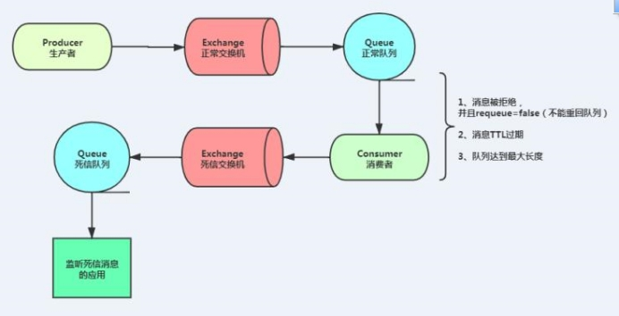

## 代驾：RabbitMQ

## 一、RabbitMQ

**学习目标：**

- 能够说出Rabbitmq应用场景
- 能够说出Rabbitmq消息不丢失解决方案
- 掌握Rabbitmq实现普通消息的收发
- 掌握Rabbitmq实现延迟消息
- 基于Rabbitmq消息队列实现商品数据同步
- 基于Rabbitmq消息队列实现订单延迟关闭


### 1、目前存在的问题

#### 订单服务取消订单问题

乘客下单后，如果15分账未支付，我们该如何取消订单

- 方案1：定时任务，定时扫描未支付订单，超过15分钟自动关闭

- 方案2：使用延迟队列关闭订单


### 2、消息队列解决什么问题

消息队列都解决了什么问题？

#### 2.1、异步

 


#### 2.2、解耦

​	

 

#### 2.3、并行

 

 

#### 2.4、排队 

 

### 3、消息队列工具 RabbitMQ

#### 3.1、常见MQ产品

- ActiveMQ：基于JMS（Java Message Service）协议，java语言，jdk

- RabbitMQ：基于AMQP协议，erlang语言开发，稳定性好

- RocketMQ：基于JMS，阿里巴巴产品，目前交由Apache基金会

- Kafka：分布式消息系统，高吞吐量


#### 3.2、RabbitMQ基础概念

 

 

Broker：简单来说就是消息队列服务器实体

Exchange：消息交换机，它指定消息按什么规则，路由到哪个队列

Queue：消息队列载体，每个消息都会被投入到一个或多个队列

Binding：绑定，它的作用就是把 exchange和 queue按照路由规则绑定起来

Routing Key：路由关键字， exchange根据这个关键字进行消息投递

vhost：虚拟主机，一个 broker里可以开设多个 vhost，用作不同用户的权限分离

producer：消息生产者，就是投递消息的程序

consumer：消息消费者，就是接受消息的程序

channel：消息通道，在客户端的每个连接里，可建立多个 channel，每个 channel代表一个会话任务

#### 3.3、安装RabbitMQ 

看电商软件环境安装.doc

访问IP地址：http://192.168.200.128:15672

- 用户名：admin

- 密码：admin

#### 3.4、五种消息模型

RabbitMQ提供了6种消息模型，但是第6种其实是RPC，并不是MQ，因此不予学习。那么也就剩下5种。

但是其实3、4、5这三种都属于订阅模型，只不过进行路由的方式不同。

 

- 基本消息模型：生产者–>队列–>消费者


- work消息模型：生产者–>队列–>多个消费者竞争消费


- 订阅模型-Fanout：广播模式，将消息交给所有绑定到交换机的队列，每个消费者都会收到同一条消息


- **订阅模型-Direct：定向，把消息交给符合指定 rotingKey 的队列**


- 订阅模型-Topic 主题模式：通配符，把消息交给符合routing pattern（路由模式） 的队列


我们项目使用的是第四种!

### 4、消息不丢失

消息的不丢失，在MQ角度考虑，一般有三种途径：

1. 生产者不丢数据

2. MQ服务器不丢数据
3. 消费者不丢数据

保证消息不丢失有两种实现方式：

- 开启事务模式

- 消息息确认模式（生产者，消费者）

说明：开启事务会大幅降低消息发送及接收效率，使用的相对较少，因此我们生产环境一般都采取消息确认模式，以下我们只是讲解消息确认模式

#### 4.1、消息确认

##### 4.1.1、消息持久化

如果希望RabbitMQ重启之后消息不丢失，那么需要对以下3种实体均配置持久化

**Exchange**

声明exchange时设置持久化（durable = true）并且不自动删除(autoDelete = false)

**Queue**

声明queue时设置持久化（durable = true）并且不自动删除(autoDelete = false)

**message**

xxxxxxxxxx @Overridepublic Boolean endDrive(OrderFeeForm orderFeeForm) {   //1.获取订单信息   OrderInfo orderInfo = orderInfoFeignClient.getOrderInfo(orderFeeForm.getOrderId()).getData();   if(orderInfo.getDriverId().longValue() != orderFeeForm.getDriverId().longValue()) {      throw new GuiguException(ResultCodeEnum.ARGUMENT_VALID_ERROR);   }​   //2.防止刷单，计算司机的经纬度与代驾的终点经纬度是否在2公里范围内   OrderServiceLastLocationVo orderServiceLastLocationVo = locationFeignClient.getOrderServiceLastLocation(orderFeeForm.getOrderId()).getData();   //司机的位置与代驾终点位置的距离   double distance = LocationUtil.getDistance(orderInfo.getEndPointLatitude().doubleValue(), orderInfo.getEndPointLongitude().doubleValue(), orderServiceLastLocationVo.getLatitude().doubleValue(), orderServiceLastLocationVo.getLongitude().doubleValue());   if(distance > SystemConstant.DRIVER_START_LOCATION_DISTION) {      throw new GuiguException(ResultCodeEnum.DRIVER_END_LOCATION_DISTION_ERROR);   }​   //3.计算订单实际里程   BigDecimal realDistance = locationFeignClient.calculateOrderRealDistance(orderFeeForm.getOrderId()).getData();   log.info("结束代驾，订单实际里程：{}", realDistance);​   //4.计算代驾实际费用   FeeRuleRequestForm feeRuleRequestForm = new FeeRuleRequestForm();   feeRuleRequestForm.setDistance(realDistance);   feeRuleRequestForm.setStartTime(orderInfo.getStartServiceTime());   //等候时间   Integer waitMinute = Math.abs((int) ((orderInfo.getArriveTime().getTime() - orderInfo.getAcceptTime().getTime()) / (1000 * 60)));   feeRuleRequestForm.setWaitMinute(waitMinute);   log.info("结束代驾，费用参数：{}", JSON.toJSONString(feeRuleRequestForm));   FeeRuleResponseVo feeRuleResponseVo = feeRuleFeignClient.calculateOrderFee(feeRuleRequestForm).getData();   log.info("费用明细：{}", JSON.toJSONString(feeRuleResponseVo));   //订单总金额 需加上 路桥费、停车费、其他费用、乘客好处费   BigDecimal totalAmount = feeRuleResponseVo.getTotalAmount().add(orderFeeForm.getTollFee()).add(orderFeeForm.getParkingFee()).add(orderFeeForm.getOtherFee()).add(orderInfo.getFavourFee());   feeRuleResponseVo.setTotalAmount(totalAmount);​   //5.计算系统奖励   //5.1.获取订单数   String startTime = new DateTime(orderInfo.getStartServiceTime()).toString("yyyy-MM-dd") + " 00:00:00";   String endTime = new DateTime(orderInfo.getStartServiceTime()).toString("yyyy-MM-dd") + " 24:00:00";   Long orderNum = orderInfoFeignClient.getOrderNumByTime(startTime, endTime).getData();   //5.2.封装参数   RewardRuleRequestForm rewardRuleRequestForm = new RewardRuleRequestForm();   rewardRuleRequestForm.setStartTime(orderInfo.getStartServiceTime());   rewardRuleRequestForm.setOrderNum(orderNum);   //5.3.执行   RewardRuleResponseVo rewardRuleResponseVo = rewardRuleFeignClient.calculateOrderRewardFee(rewardRuleRequestForm).getData();   log.info("结束代驾，系统奖励：{}", JSON.toJSONString(rewardRuleResponseVo));​   //6.计算分账信息   ProfitsharingRuleRequestForm profitsharingRuleRequestForm = new ProfitsharingRuleRequestForm();   profitsharingRuleRequestForm.setOrderAmount(feeRuleResponseVo.getTotalAmount());   profitsharingRuleRequestForm.setOrderNum(orderNum);   ProfitsharingRuleResponseVo profitsharingRuleResponseVo = profitsharingRuleFeignClient.calculateOrderProfitsharingFee(profitsharingRuleRequestForm).getData();   log.info("结束代驾，分账信息：{}", JSON.toJSONString(profitsharingRuleResponseVo));​   //7.封装更新订单账单相关实体对象   UpdateOrderBillForm updateOrderBillForm = new UpdateOrderBillForm();   updateOrderBillForm.setOrderId(orderFeeForm.getOrderId());   updateOrderBillForm.setDriverId(orderFeeForm.getDriverId());   //路桥费、停车费、其他费用   updateOrderBillForm.setTollFee(orderFeeForm.getTollFee());   updateOrderBillForm.setParkingFee(orderFeeForm.getParkingFee());   updateOrderBillForm.setOtherFee(orderFeeForm.getOtherFee());   //乘客好处费   updateOrderBillForm.setFavourFee(orderInfo.getFavourFee());​   //实际里程   updateOrderBillForm.setRealDistance(realDistance);   //订单奖励信息   BeanUtils.copyProperties(rewardRuleResponseVo, updateOrderBillForm);   //代驾费用信息   BeanUtils.copyProperties(feeRuleResponseVo, updateOrderBillForm);​   //分账相关信息   BeanUtils.copyProperties(profitsharingRuleResponseVo, updateOrderBillForm);   updateOrderBillForm.setProfitsharingRuleId(profitsharingRuleResponseVo.getProfitsharingRuleId());   log.info("结束代驾，更新账单信息：{}", JSON.toJSONString(updateOrderBillForm));​   //8.结束代驾更新账单   orderInfoFeignClient.endDrive(updateOrderBillForm);   return true;}java

##### 4.1.2、发送确认

有时，业务处理成功，消息也发了，但是我们并不知道消息是否成功到达了rabbitmq，如果由于网络等原因导致业务成功而消息发送失败，那么发送方将出现不一致的问题，此时可以使用rabbitmq的发送确认功能，即要求rabbitmq显式告知我们消息是否已成功发送。

 

##### 4.1.3、手动消费确认

有时，消息被正确投递到消费方，但是消费方处理失败，那么便会出现消费方的不一致问题。比如:订单已创建的消息发送到用户积分子系统中用于增加用户积分，但是积分消费方处理却都失败了，用户就会问：我购买了东西为什么积分并没有增加呢？

要解决这个问题，需要引入消费方确认，即只有消息被成功处理之后才告知rabbitmq以ack，否则告知rabbitmq以nack

 

### 5、搭建rabbit-util模块

由于消息队列是公共模块，我们把mq的相关代码（生产者）封装到该模块，其他service微服务模块都可能使用，因此我们把他封装到一个单独的模块，需要使用mq的模块直接引用该模块即可。

模块已搭建，依赖已添加，我们只需要封装关键部分即可。

#### 5.1、RabbitInitConfigApplicationListener

消息确认配置类

```java
package com.atguigu.daijia.common.config;

import lombok.extern.slf4j.Slf4j;
import org.springframework.amqp.rabbit.core.RabbitTemplate;
import org.springframework.beans.factory.annotation.Autowired;
import org.springframework.boot.context.event.ApplicationReadyEvent;
import org.springframework.context.ApplicationListener;
import org.springframework.stereotype.Component;

@Slf4j
@Component
public class RabbitInitConfigApplicationListener implements ApplicationListener<ApplicationReadyEvent> {

    @Autowired
    private RabbitTemplate rabbitTemplate;

    @Override
    public void onApplicationEvent(ApplicationReadyEvent event) {
        this.setupCallbacks();
    }

    private void setupCallbacks() {

        /**
         * 只确认消息是否正确到达 Exchange 中,成功与否都会回调
         *
         * @param correlation 相关数据  非消息本身业务数据
         * @param ack             应答结果
         * @param reason           如果发送消息到交换器失败，错误原因
         */
        this.rabbitTemplate.setConfirmCallback((correlation, ack, reason) -> {
            if (ack) {
                //消息到交换器成功
                log.info("消息发送到Exchange成功：{}", correlation);
            } else {
                //消息到交换器失败
                log.error("消息发送到Exchange失败：{}", reason);
            }
        });

        /**
         * 消息没有正确到达队列时触发回调，如果正确到达队列不执行
         */
        this.rabbitTemplate.setReturnsCallback(returned -> {
            log.error("Returned: " + returned.getMessage() + "\nreplyCode: " + returned.getReplyCode()
                    + "\nreplyText: " + returned.getReplyText() + "\nexchange/rk: "
                    + returned.getExchange() + "/" + returned.getRoutingKey());
        });
    }

}
```


#### 5.2、封装消息发送

```java
package com.atguigu.daijia.common.service;

@Service
public class RabbitService {

    @Autowired
    private RabbitTemplate rabbitTemplate;

    /**
     *  发送消息
     * @param exchange 交换机
     * @param routingKey 路由键
     * @param message 消息
     */
    public boolean sendMessage(String exchange, String routingKey, Object message) {
        rabbitTemplate.convertAndSend(exchange, routingKey, message);
        return true;
    }
}
```

 

#### 5.3、发送确认消息测试

##### 5.3.1、pom.xml

在``service-mq``引入`rabbit-util`模块依赖

```xml
<dependencies>
    <dependency>
        <groupId>com.atguigu.gmall</groupId>
        <artifactId>rabbit-util</artifactId>
        <version>1.0</version>
    </dependency>
</dependencies>
```

##### 5.3.2、添加配置

```yaml
rabbitmq:
  host: 139.198.163.91
  port: 5672
  username: guest
  password: guest
  publisher-confirm-type: CORRELATED
  publisher-returns: true
  listener:
    simple:
      cknowledge-mode: manual #默认情况下消息消费者是自动确认消息的，如果要手动确认消息则需要修改确认模式为manual
      prefetch: 1 # 消费者每次从队列获取的消息数量。此属性当不设置时为：轮询分发，设置为1为：公平分发
```

##### 5.3.3、MqController

消息发送端

```java
package com.atguigu.daijia.mq.controller;

import com.atguigu.daijia.common.result.Result;
import com.atguigu.daijia.common.service.RabbitService;
import org.springframework.beans.factory.annotation.Autowired;
import org.springframework.web.bind.annotation.GetMapping;
import org.springframework.web.bind.annotation.RequestMapping;
import org.springframework.web.bind.annotation.RestController;

@RestController
@RequestMapping("/mq")
public class MqController {


    @Autowired
    private RabbitService rabbitService;


    /**
     * 消息发送
     */
    //http://localhost:8282/mq/sendConfirm
    @GetMapping("sendConfirm")
    public Result sendConfirm() {
        rabbitService.sendMessage("exchange.confirm", "routing.confirm", "来人了，开始接客吧！");
        return Result.ok();
    }
}
```

##### 5.3.4、ConfirmReceiver

消息接收端

```java
package com.atguigu.daijia.order.receiver;


import com.rabbitmq.client.Channel;
import lombok.SneakyThrows;
import org.springframework.amqp.core.Message;
import org.springframework.amqp.rabbit.annotation.Exchange;
import org.springframework.amqp.rabbit.annotation.Queue;
import org.springframework.amqp.rabbit.annotation.QueueBinding;
import org.springframework.amqp.rabbit.annotation.RabbitListener;
import org.springframework.stereotype.Component;

@Component
public class ConfirmReceiver {

    @SneakyThrows
    @RabbitListener(bindings = @QueueBinding(
            value = @Queue(value = "queue.confirm"),
            exchange = @Exchange(value = "exchange.confirm"),
            key = "routing.confirm"))
    public void process(Message message, Channel channel) {
        System.out.println("RabbitListener:" + new String(message.getBody()));

        // false 确认一个消息，true 批量确认
        channel.basicAck(message.getMessageProperties().getDeliveryTag(), false);
    }
}
```

测试：http://localhost:8282/mq/sendConfirm

#### 5.4、消息发送失败，设置重发机制

实现思路：借助redis来实现重发机制

##### 5.4.1、GuiguCorrelationData

```java
package com.atguigu.daijia.common.entity;

import lombok.Data;
import org.springframework.amqp.rabbit.connection.CorrelationData;

@Data
public class GuiguCorrelationData extends CorrelationData {

    //消息体
    private Object message;
    //交换机
    private String exchange;
    //路由键
    private String routingKey;
    //重试次数
    private int retryCount = 0;
    //是否延迟消息
    private boolean isDelay = false;
    //延迟时长
    private int delayTime = 10;
}
```

##### 5.4.2、修改发送方法

```java
@Autowired
private RabbitTemplate rabbitTemplate;

@Autowired
private RedisTemplate redisTemplate;

/**
 *  发送消息
 * @param exchange 交换机
 * @param routingKey 路由键
 * @param message 消息
 */
public boolean sendMessage(String exchange, String routingKey, Object message) {
    //1.创建自定义相关消息对象-包含业务数据本身，交换器名称，路由键，队列类型，延迟时间,重试次数
    GuiguCorrelationData correlationData = new GuiguCorrelationData();
    String uuid = "mq:" + UUID.randomUUID().toString().replaceAll("-", "");
    correlationData.setId(uuid);
    correlationData.setMessage(message);
    correlationData.setExchange(exchange);
    correlationData.setRoutingKey(routingKey);
    //2.将相关消息封装到发送消息方法中

    rabbitTemplate.convertAndSend(exchange, routingKey, message, correlationData);

    //3.将相关消息存入Redis  Key：UUID  相关消息对象  10 分钟
    redisTemplate.opsForValue().set(uuid, JSON.toJSONString(correlationData), 10, TimeUnit.MINUTES);

    //log.info("生产者发送消息成功：{}，{}，{}", exchange, routingKey, message);
    return true;
}
```

##### 5.4.3、RabbitInitConfigApplicationListener

修改RabbitInitConfigApplicationListener配置类

```java
package com.atguigu.daijia.common.config;

import com.alibaba.fastjson.JSON;
import com.atguigu.daijia.common.entity.GuiguCorrelationData;
import lombok.extern.slf4j.Slf4j;
import org.springframework.amqp.rabbit.connection.CorrelationData;
import org.springframework.amqp.rabbit.core.RabbitTemplate;
import org.springframework.beans.factory.annotation.Autowired;
import org.springframework.boot.context.event.ApplicationReadyEvent;
import org.springframework.context.ApplicationListener;
import org.springframework.data.redis.core.RedisTemplate;
import org.springframework.stereotype.Component;

import java.util.concurrent.TimeUnit;


@Slf4j
@Component
public class RabbitInitConfigApplicationListener implements ApplicationListener<ApplicationReadyEvent> {

    @Autowired
    private RabbitTemplate rabbitTemplate;

    @Autowired
    private RedisTemplate redisTemplate;

    @Override
    public void onApplicationEvent(ApplicationReadyEvent event) {
        this.setupCallbacks();
    }

    private void setupCallbacks() {

        /**
         * 只确认消息是否正确到达 Exchange 中,成功与否都会回调
         *
         * @param correlation 相关数据  非消息本身业务数据
         * @param ack             应答结果
         * @param reason           如果发送消息到交换器失败，错误原因
         */
        this.rabbitTemplate.setConfirmCallback((correlationData, ack, reason) -> {
            if (ack) {
                //消息到交换器成功
                log.info("消息发送到Exchange成功：{}", correlationData);
            } else {
                //消息到交换器失败
                log.error("消息发送到Exchange失败：{}", reason);

                //执行消息重发
                this.retrySendMsg(correlationData);
            }
        });

        /**
         * 消息没有正确到达队列时触发回调，如果正确到达队列不执行
         */
        this.rabbitTemplate.setReturnsCallback(returned -> {
            log.error("Returned: " + returned.getMessage() + "\nreplyCode: " + returned.getReplyCode()
                    + "\nreplyText: " + returned.getReplyText() + "\nexchange/rk: "
                    + returned.getExchange() + "/" + returned.getRoutingKey());
        });
    }


    /**
     * 消息重新发送
     *
     * @param correlationData
     */
    private void retrySendMsg(CorrelationData correlationData) {
        //获取相关数据
        GuiguCorrelationData gmallCorrelationData = (GuiguCorrelationData) correlationData;

        //获取redis中存放重试次数
        //先重发，在写会到redis中次数
        int retryCount = gmallCorrelationData.getRetryCount();
        if (retryCount >= 3) {
            //超过最大重试次数
            log.error("生产者超过最大重试次数，将失败的消息存入数据库用人工处理；给管理员发送邮件；给管理员发送短信；");
            return;
        }
        //重发消息
        rabbitTemplate.convertAndSend(gmallCorrelationData.getExchange(), gmallCorrelationData.getRoutingKey(), gmallCorrelationData.getMessage(), gmallCorrelationData);
        //重发次数+1
        retryCount += 1;
        gmallCorrelationData.setRetryCount(retryCount);
        redisTemplate.opsForValue().set(gmallCorrelationData.getId(), JSON.toJSONString(gmallCorrelationData), 10, TimeUnit.MINUTES);
        log.info("进行消息重发！");
    }
}
```

测试： 修改路由键或交换机 -- 完美!

后续微信支付成功回调会使用消息确认机制。

 

### 6、延迟消息

延迟消息有两种实现方案：

1，基于死信队列

2，集成延迟插件

#### 6.1、基于死信实现延迟消息

使用RabbitMQ来实现延迟消息必须先了解RabbitMQ的两个概念：消息的TTL和死信Exchange，通过这两者的组合来实现延迟队列

 

##### 6.1.1、消息的TTL（Time To Live）

消息的TTL就是消息的存活时间。RabbitMQ可以对队列和消息分别设置TTL。对队列设置就是队列没有消费者连着的保留时间，也可以对每一个单独的消息做单独的设置。超过了这个时间，我们认为这个消息就死了，称之为死信。

如何设置TTL：

我们创建一个队列queue.temp，在Arguments 中添加x-message-ttl 为5000 （单位是毫秒），那所在压在这个队列的消息在5秒后会消失。

 

##### 6.1.2、死信交换机  Dead Letter Exchanges

一个消息在满足如下条件下，会进死信路由，记住这里是路由而不是队列，一个路由可以对应很多队列。

（1） 一个消息被Consumer拒收了，并且reject方法的参数里requeue是false。也就是说不会被再次放在队列里，被其他消费者使用。

（2）**上面的消息的TTL到了，消息过期了。**

（3）队列的长度限制满了。排在前面的消息会被丢弃或者扔到死信路由上。

Dead Letter Exchange其实就是一种普通的exchange，和创建其他exchange没有两样。只是在某一个设置Dead Letter Exchange的队列中有消息过期了，会自动触发消息的转发，发送到Dead Letter Exchange中去。

 

我们现在可以测试一下延迟队列。

（1）创建死信队列 

（2）创建交换机 

（3）建立交换器与队列之间的绑定 

（4）创建队列

##### 6.1.3、代码实现

###### 6.1.3.1、在service-mq中添加配置类

```java
package com.atguigu.daijia.mq.config;

import org.springframework.amqp.core.Binding;
import org.springframework.amqp.core.BindingBuilder;
import org.springframework.amqp.core.DirectExchange;
import org.springframework.amqp.core.Queue;
import org.springframework.context.annotation.Bean;
import org.springframework.context.annotation.Configuration;

import java.util.HashMap;

@Configuration
public class DeadLetterMqConfig {
    // 声明一些变量

    public static final String exchange_dead = "exchange.dead";
    public static final String routing_dead_1 = "routing.dead.1";
    public static final String routing_dead_2 = "routing.dead.2";
    public static final String queue_dead_1 = "queue.dead.1";
    public static final String queue_dead_2 = "queue.dead.2";

    // 定义交换机
    @Bean
    public DirectExchange exchange() {
        return new DirectExchange(exchange_dead, true, false, null);
    }

    @Bean
    public Queue queue1() {
        // 设置如果队列一 出现问题，则通过参数转到exchange_dead，routing_dead_2 上！
        HashMap<String, Object> map = new HashMap<>();
        // 参数绑定 此处的key 固定值，不能随意写
        map.put("x-dead-letter-exchange", exchange_dead);
        map.put("x-dead-letter-routing-key", routing_dead_2);
        // 设置延迟时间
        map.put("x-message-ttl", 10 * 1000);
        // 队列名称，是否持久化，是否独享、排外的【true:只可以在本次连接中访问】，是否自动删除，队列的其他属性参数
        return new Queue(queue_dead_1, true, false, false, map);
    }

    @Bean
    public Binding binding() {
        // 将队列一 通过routing_dead_1 key 绑定到exchange_dead 交换机上
        return BindingBuilder.bind(queue1()).to(exchange()).with(routing_dead_1);
    }

    // 这个队列二就是一个普通队列
    @Bean
    public Queue queue2() {
        return new Queue(queue_dead_2, true, false, false, null);
    }

    // 设置队列二的绑定规则
    @Bean
    public Binding binding2() {
        // 将队列二通过routing_dead_2 key 绑定到exchange_dead交换机上！
        return BindingBuilder.bind(queue2()).to(exchange()).with(routing_dead_2);
    }
}
```

##### 6.1.3.2、MqController

配置发送消息

```java
/**
 * 消息发送延迟消息：基于死信实现
 */
@GetMapping("/sendDeadLetterMsg")
public Result sendDeadLetterMsg() {
    rabbitService.sendMessage(DeadLetterMqConfig.exchange_dead, DeadLetterMqConfig.routing_dead_1, "我是延迟消息");
    log.info("基于死信发送延迟消息成功");
    return Result.ok();
}
```

 

###### 6.1.3.3、DeadLetterReceiver

消息接收方

```java
package com.atguigu.daijia.mq.receiver;

@Slf4j
@Component
public class DeadLetterReceiver {


    /**
     * 监听延迟消息
     * @param msg
     * @param message
     * @param channel
     */
    @RabbitListener(queues = {DeadLetterMqConfig.queue_dead_2})
    public void getDeadLetterMsg(String msg, Message message, Channel channel) {
        try {
            if (StringUtils.isNotBlank(msg)) {
                log.info("死信消费者：{}", msg);
            }
            channel.basicAck(message.getMessageProperties().getDeliveryTag(), false);
        } catch (IOException e) {
            e.printStackTrace();
            log.error("[xx服务]监听xxx业务异常：{}", e);
        }
    }
}
```

#### 6.2、基于延迟插件实现延迟消息

Rabbitmq实现了一个插件x-delay-message来实现延时队列

##### 6.2.1、插件安装

1. 首先我们将刚下载下来的rabbitmq_delayed_message_exchange-3.9.0.ez文件上传到RabbitMQ所在服务器，下载地址：https://www.rabbitmq.com/community-plugins.html

2. 切换到插件所在目录，执行命令，将刚插件拷贝到容器内plugins目录下

   ```dockerfile
   docker cp rabbitmq_delayed_message_exchange-3.9.0.ez gmalldocker_rabbitmq_1:/plugins
   ```

3. 执行 docker exec -it gmalldocker_rabbitmq_1 /bin/bash 命令进入到容器内部，并 cd plugins 进入plugins目录

4. 执行 ls -l|grep delay  命令查看插件是否copy成功

5. 在容器内plugins目录下，执行 rabbitmq-plugins enable rabbitmq_delayed_message_exchange  命令启用插件

6. exit命令退出RabbitMQ容器内部，然后执行 docker restart gmalldocker_rabbitmq_1 命令重启RabbitMQ容器

##### 6.2.2、代码实现

`service-mq`

###### 6.2.2.1、DelayedMqConfig

配置队列

```java
package com.atguigu.daijia.mq.config;

@Configuration
public class DelayedMqConfig {

    public static final String exchange_delay = "exchange.delay";
    public static final String routing_delay = "routing.delay";
    public static final String queue_delay_1 = "queue.delay.1";

    @Bean
    public Queue delayQeue1() {
        // 第一个参数是创建的queue的名字，第二个参数是是否支持持久化
        return new Queue(queue_delay_1, true);
    }

    @Bean
    public CustomExchange delayExchange() {
        Map<String, Object> args = new HashMap<String, Object>();
        args.put("x-delayed-type", "direct");
        return new CustomExchange(exchange_delay, "x-delayed-message", true, false, args);
    }

    @Bean
    public Binding delayBbinding1() {
        return BindingBuilder.bind(delayQeue1()).to(delayExchange()).with(routing_delay).noargs();
    }
}
```

###### 6.2.2.2、 MqController

MqController：发送消息

```java
@Autowired
private RabbitTemplate rabbitTemplate;

/**
 * 消息发送延迟消息：基于延迟插件使用,使用插件后交换机会暂存消息固交换器无法即时路由消息到队列
 */
//@GetMapping("/sendDelayMsg")
//public Result sendDelayMsg() {
//    rabbitTemplate.convertAndSend(DelayedMqConfig.exchange_delay,
//            DelayedMqConfig.routing_delay,
//            "基于延迟插件-我是延迟消息",
//            (message -> {
//                //设置消息ttl
//                message.getMessageProperties().setDelay(10000);
//                return message;
//            })
//    );
//    log.info("基于延迟插件-发送延迟消息成功");
//    return Result.ok();
//}


/**
 * 消息发送延迟消息：基于延迟插件使用
 */
@GetMapping("/sendDelayMsg")
public Result sendDelayMsg() {
    //调用工具方法发送延迟消息
    int delayTime = 10;
    rabbitService.sendDealyMessage(DelayedMqConfig.exchange_delay, DelayedMqConfig.routing_delay, "我是延迟消息", delayTime);
    log.info("基于延迟插件-发送延迟消息成功");
    return Result.ok();
}
```

###### 6.2.2.3、 RabbitService

 `rabbit-util`中`RabbitService`中封装发送延迟消息方法,队列确认方法中增加延迟队列判断

```java
/**
 * 发送延迟消息方法
 * @param exchange 交换机
 * @param routingKey 路由键
 * @param message 消息数据
 * @param delayTime 延迟时间，单位为：秒
 */
public boolean sendDealyMessage(String exchange, String routingKey, Object message, int delayTime) {
    //1.创建自定义相关消息对象-包含业务数据本身，交换器名称，路由键，队列类型，延迟时间,重试次数
    GuiguCorrelationData correlationData = new GuiguCorrelationData();
    String uuid = "mq:" + UUID.randomUUID().toString().replaceAll("-", "");
    correlationData.setId(uuid);
    correlationData.setMessage(message);
    correlationData.setExchange(exchange);
    correlationData.setRoutingKey(routingKey);
    correlationData.setDelay(true);
    correlationData.setDelayTime(delayTime);

    //2.将相关消息封装到发送消息方法中
    rabbitTemplate.convertAndSend(exchange, routingKey, message,message1 -> {
        message1.getMessageProperties().setDelay(delayTime*1000);
        return message1;
    }, correlationData);

    //3.将相关消息存入Redis  Key：UUID  相关消息对象  10 分钟
    redisTemplate.opsForValue().set(uuid, JSON.toJSONString(correlationData), 10, TimeUnit.MINUTES);
    return true;

}
```

###### 6.2.2.4、 RabbitInitConfigApplicationListener

`RabbitInitConfigApplicationListener`队列确认增加延迟消息判断

```java
package com.atguigu.daijia.common.config;


@Slf4j
@Component
public class RabbitInitConfigApplicationListener implements ApplicationListener<ApplicationReadyEvent> {

    @Autowired
    private RabbitTemplate rabbitTemplate;

    @Autowired
    private RedisTemplate redisTemplate;

    @Override
    public void onApplicationEvent(ApplicationReadyEvent event) {
        this.setupCallbacks();
    }

    private void setupCallbacks() {

        /**
         * 只确认消息是否正确到达 Exchange 中,成功与否都会回调
         *
         * @param correlation 相关数据  非消息本身业务数据
         * @param ack             应答结果
         * @param reason           如果发送消息到交换器失败，错误原因
         */
        this.rabbitTemplate.setConfirmCallback((correlationData, ack, reason) -> {
            if (ack) {
                //消息到交换器成功
                log.info("消息发送到Exchange成功：{}", correlationData);
            } else {
                //消息到交换器失败
                log.error("消息发送到Exchange失败：{}", reason);

                //执行消息重发
                this.retrySendMsg(correlationData);
            }
        });

        /**
         * 消息没有正确到达队列时触发回调，如果正确到达队列不执行
         */
        this.rabbitTemplate.setReturnsCallback(returned -> {
            log.error("Returned: " + returned.getMessage() + "\nreplyCode: " + returned.getReplyCode()
                    + "\nreplyText: " + returned.getReplyText() + "\nexchange/rk: "
                    + returned.getExchange() + "/" + returned.getRoutingKey());

            //当路由队列失败 也需要重发
            //1.构建相关数据对象
            String redisKey = returned.getMessage().getMessageProperties().getHeader("spring_returned_message_correlation");
            String correlationDataStr = (String) redisTemplate.opsForValue().get(redisKey);
            GuiguCorrelationData guiguCorrelationData = JSON.parseObject(correlationDataStr, GuiguCorrelationData.class);
            //todo 方式一:如果不考虑延迟消息重发 直接返回
            if(guiguCorrelationData.isDelay()){
                return;
            }
            //2.调用消息重发方法
            this.retrySendMsg(guiguCorrelationData);
        });
    }

    /**
     * 消息重新发送
     *
     * @param correlationData
     */
    private void retrySendMsg(CorrelationData correlationData) {
        //获取相关数据
        GuiguCorrelationData guiguCorrelationData = (GuiguCorrelationData) correlationData;

        //获取redis中存放重试次数
        //先重发，在写会到redis中次数
        int retryCount = guiguCorrelationData.getRetryCount();
        if (retryCount >= 3) {
            //超过最大重试次数
            log.error("生产者超过最大重试次数，将失败的消息存入数据库用人工处理；给管理员发送邮件；给管理员发送短信；");
            return;
        }
        //重发次数+1
        retryCount += 1;
        guiguCorrelationData.setRetryCount(retryCount);
        redisTemplate.opsForValue().set(guiguCorrelationData.getId(), JSON.toJSONString(guiguCorrelationData), 10, TimeUnit.MINUTES);
        log.info("进行消息重发！");
        //重发消息
        //todo 方式二：如果是延迟消息，依然需要设置消息延迟时间
        if (guiguCorrelationData.isDelay()) {
            //延迟消息
            rabbitTemplate.convertAndSend(guiguCorrelationData.getExchange(), guiguCorrelationData.getRoutingKey(), guiguCorrelationData.getMessage(), message -> {
                message.getMessageProperties().setDelay(guiguCorrelationData.getDelayTime() * 1000);
                return message;
            }, guiguCorrelationData);
        } else {
            //普通消息
            rabbitTemplate.convertAndSend(guiguCorrelationData.getExchange(), guiguCorrelationData.getRoutingKey(), guiguCorrelationData.getMessage(), guiguCorrelationData);
        }
    }
    
}
```

###### 6.2.2.5、DelayReceiver

接收消息,消费者端判断是否需要做幂等性处理

```java
package com.atguigu.daijia.mq.receiver;


@Slf4j
@Component
public class DelayReceiver {

    @Autowired
    private RedisTemplate redisTemplate;

    /**
     * 监听到延迟消息
     *
     * @param msg
     * @param message
     * @param channel
     */
    @RabbitListener(queues = DelayedMqConfig.queue_delay_1)
    public void getDelayMsg(String msg, Message message, Channel channel) {
        String key = "mq:" + msg;
        try {
            //如果业务保证幂等性，基于redis setnx保证
            Boolean flag = redisTemplate.opsForValue().setIfAbsent(key, "", 2, TimeUnit.SECONDS);
            if (!flag) {
                //说明该业务数据以及被执行
                channel.basicAck(message.getMessageProperties().getDeliveryTag(), false);
                return;
            }
            if (StringUtils.isNotBlank(msg)) {
                log.info("延迟插件监听消息：{}", msg);
            }
            channel.basicAck(message.getMessageProperties().getDeliveryTag(), false);
        } catch (IOException e) {
            e.printStackTrace();
            log.error("异常：{}", e);
            redisTemplate.delete(key);
        }
    }
}
```

消费结果会发送三次，也被消费三次！

如何保证消息幂等性？

1. 使用数据库方式

2. **使用redis setnx 命令解决（推荐）**

#### 6.3、基于延迟插件实现取消订单

service-order模块

##### 6.3.1、引入依赖

```xml
<!--rabbitmq工具模块-->
<dependency>
    <groupId>com.atguigu.gmall</groupId>
    <artifactId>rabbit-util</artifactId>
    <version>1.0</version>
</dependency>
```

##### 6.3.2、添加配置

```yaml
rabbitmq:
  host: 139.198.163.91
  port: 5672
  username: guest
  password: guest
  publisher-confirm-type: CORRELATED
  publisher-returns: true
  listener:
    simple:
      cknowledge-mode: manual #默认情况下消息消费者是自动确认消息的，如果要手动确认消息则需要修改确认模式为manual
      prefetch: 1 # 消费者每次从队列获取的消息数量。此属性当不设置时为：轮询分发，设置为1为：公平分发
```

#####  6.3.3、CanelOrderMqConfig

配置队列

```java
package com.atguigu.daijia.order.config;

import com.atguigu.daijia.common.constant.MqConst;
import org.springframework.amqp.core.Binding;
import org.springframework.amqp.core.BindingBuilder;
import org.springframework.amqp.core.CustomExchange;
import org.springframework.amqp.core.Queue;
import org.springframework.context.annotation.Bean;
import org.springframework.context.annotation.Configuration;

import java.util.HashMap;
import java.util.Map;

@Configuration
public class CanelOrderMqConfig {

    @Bean
    public Queue cancelQueue() {
        // 第一个参数是创建的queue的名字，第二个参数是是否支持持久化
        return new Queue(MqConst.QUEUE_CANCEL_ORDER, true);
    }

    @Bean
    public CustomExchange cancelExchange() {
        Map<String, Object> args = new HashMap<String, Object>();
        args.put("x-delayed-type", "direct");
        return new CustomExchange(MqConst.EXCHANGE_CANCEL_ORDER, "x-delayed-message", true, false, args);
    }

    @Bean
    public Binding bindingCancel() {
        return BindingBuilder.bind(cancelQueue()).to(cancelExchange()).with(MqConst.ROUTING_CANCEL_ORDER).noargs();
    }

}
```

 

##### 6.3.4、发送消息

创建订单时，发送延迟消息

修改保存订单方法

```java
@Autowired
private RabbitService rabbitService;

@Transactional(rollbackFor = {Exception.class})
@Override
public Long saveOrderInfo(OrderInfoForm orderInfoForm) {
   ...

   //发送延迟消息，取消订单
   rabbitService.sendDealyMessage(MqConst.EXCHANGE_CANCEL_ORDER, MqConst.ROUTING_CANCEL_ORDER, String.valueOf(orderInfo.getId()), SystemConstant.CANCEL_ORDER_DELAY_TIME);
   return orderInfo.getId();
}
```

##### 6.3.5、接收消息

```java
package com.atguigu.daijia.order.receiver;


import com.atguigu.daijia.common.constant.MqConst;
import com.atguigu.daijia.order.service.OrderInfoService;
import com.rabbitmq.client.Channel;
import lombok.extern.slf4j.Slf4j;
import org.springframework.amqp.core.Message;
import org.springframework.amqp.rabbit.annotation.Exchange;
import org.springframework.amqp.rabbit.annotation.Queue;
import org.springframework.amqp.rabbit.annotation.QueueBinding;
import org.springframework.amqp.rabbit.annotation.RabbitListener;
import org.springframework.beans.factory.annotation.Autowired;
import org.springframework.stereotype.Component;

import java.io.IOException;

@Slf4j
@Component
public class OrderReceiver {

    @Autowired
    private OrderInfoService orderInfoService;

    /**
     * 系统取消订单
     *
     * @param orderId
     * @throws IOException
     */
    @RabbitListener(queues = MqConst.QUEUE_CANCEL_ORDER)
    public void systemCancelOrder(String orderId, Message message, Channel channel) throws IOException {
        try {
            //1.处理业务
            if (orderId != null) {
                log.info("【订单微服务】关闭订单消息：{}", orderId);
                orderInfoService.systemCancelOrder(Long.parseLong(orderId));
            }
            //2.手动应答
            channel.basicAck(message.getMessageProperties().getDeliveryTag(), false);
        } catch (IOException e) {
            e.printStackTrace();
            log.error("【订单微服务】关闭订单业务异常：{}", e);
        }
    }

}
```

##### 5.3.6、OrderInfoService

```java
void systemCancelOrder(Long orderId);
```

##### 5.3.7、 OrderInfoServiceImpl

```java
@Transactional
@Override
public void systemCancelOrder(Long orderId) {
   Integer orderStatus = this.getOrderStatus(orderId);
   if(null != orderStatus && orderStatus.intValue() == OrderStatus.WAITING_ACCEPT.getStatus().intValue()) {
      //取消订单
      OrderInfo orderInfo = new OrderInfo();
      orderInfo.setId(orderId);
      orderInfo.setStatus(OrderStatus.CANCEL_ORDER.getStatus());
      int row = orderInfoMapper.updateById(orderInfo);
      if(row == 1) {
         //记录日志
         this.log(orderInfo.getId(), orderInfo.getStatus());

         //删除redis订单标识
         redisTemplate.delete(RedisConstant.ORDER_ACCEPT_MARK);
      } else {
         throw new GuiguException(ResultCodeEnum.UPDATE_ERROR);
      }
   }
}
```

1