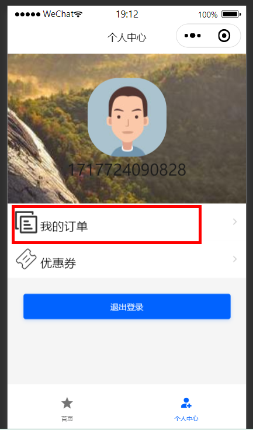

## 代驾：我的订单与异步编排

## 一、我的订单

乘客端与司机端都有我的订单，在执行中的订单，都会跳转到执行中的页面，代驾结束后，进入订单详情页。



### 1、乘客端我的订单

#### 1.1、订单微服务接口

##### 1.1.1、OrderInfoController

```java
@Operation(summary = "获取乘客订单分页列表")
@GetMapping("/findCustomerOrderPage/{customerId}/{page}/{limit}")
public Result<PageVo> findCustomerOrderPage(
    @Parameter(name = "customerId", description = "乘客id", required = true)
    @PathVariable Long customerId,

    @Parameter(name = "page", description = "当前页码", required = true)
    @PathVariable Long page,

    @Parameter(name = "limit", description = "每页记录数", required = true)
    @PathVariable Long limit) {
    Page<OrderInfo> pageParam = new Page<>(page, limit);
    PageVo pageVo = orderInfoService.findCustomerOrderPage(pageParam, customerId);
    pageVo.setPage(page);
    pageVo.setLimit(limit);
    return Result.ok(pageVo);
}
```

##### 1.1.2、OrderInfoService

```java
PageVo findCustomerOrderPage(Page<OrderInfo> pageParam, Long customerId);
```

##### 1.1.3、OrderInfoServiceImpl

```java
@Override
public PageVo findCustomerOrderPage(Page<OrderInfo> pageParam, Long customerId) {
    IPage<OrderListVo> pageInfo = orderInfoMapper.selectCustomerOrderPage(pageParam, customerId);
    return new PageVo(pageInfo.getRecords(), pageInfo.getPages(), pageInfo.getTotal());
}
```

##### 1.1.4、OrderInfoMapper

```java
IPage<OrderListVo> selectCustomerOrderPage(Page<OrderInfo> page, @Param("customerId") Long customerId);
```

##### 1.1.4、OrderInfoMapper.xml

```xml
<select id="selectCustomerOrderPage" resultType="com.atguigu.daijia.model.vo.order.OrderListVo">
    select
        info.id,
        info.order_no,
        info.start_location,
        info.end_location,
        if(info.status &lt; 7, info.expect_amount, bill.pay_amount) as amount,
        info.status,
        info.create_time
    from order_info info
     left join order_bill bill on bill.order_id = info.id
    where info.customer_id = #{customerId}
    and info.is_deleted = 0
    order by info.create_time desc
</select>
```

#### 1.2、Feign接口

##### 1.2.1、OrderInfoFeignClient

```java
/**
 * 获取乘客订单分页列表
 * @param customerId
 * @param page
 * @param limit
 * @return
 */
@GetMapping("/order/info/findCustomerOrderPage/{customerId}/{page}/{limit}")
Result<PageVo> findCustomerOrderPage(@PathVariable("customerId") Long customerId,
        @PathVariable("page") Long page,
        @PathVariable("limit") Long limit);
```

#### 1.3、乘客端web接口

##### 1.3.1、OrderController

```java
@Operation(summary = "获取乘客订单分页列表")
@GuiguLogin
@GetMapping("findCustomerOrderPage/{page}/{limit}")
public Result<PageVo> findCustomerOrderPage(
    @Parameter(name = "page", description = "当前页码", required = true)
    @PathVariable Long page,

    @Parameter(name = "limit", description = "每页记录数", required = true)
    @PathVariable Long limit) {
    Long customerId = AuthContextHolder.getUserId();
    PageVo pageVo = orderService.findCustomerOrderPage(customerId, page, limit);
    return Result.ok(pageVo);
}
```

##### 1.3.2、OrderService

```java
PageVo findCustomerOrderPage(Long customerId, Long page, Long limit);
```

##### 1.3.3、OrderServiceImpl

```java
@Override
public PageVo findCustomerOrderPage(Long customerId, Long page, Long limit) {
    return orderInfoFeignClient.findCustomerOrderPage(customerId, page, limit).getData();
}
```


### 2、司机端我的订单

#### 2.1、订单微服务接口

##### 2.1.1、OrderInfoController

```java
@Operation(summary = "获取司机订单分页列表")
@GetMapping("/findDriverOrderPage/{driverId}/{page}/{limit}")
public Result<PageVo> findDriverOrderPage(
    @Parameter(name = "driverId", description = "司机id", required = true)
    @PathVariable Long driverId,

    @Parameter(name = "page", description = "当前页码", required = true)
    @PathVariable Long page,

    @Parameter(name = "limit", description = "每页记录数", required = true)
    @PathVariable Long limit) {
    Page<OrderInfo> pageParam = new Page<>(page, limit);
    PageVo pageVo = orderInfoService.findDriverOrderPage(pageParam, driverId);
    pageVo.setPage(page);
    pageVo.setLimit(limit);
    return Result.ok(pageVo);
}
```

##### 2.1.2、OrderInfoService

```java
PageVo findDriverOrderPage(Page<OrderInfo> pageParam, Long driverId);
```

##### 2.1.3、OrderInfoServiceImpl

```java
@Override
public PageVo findDriverOrderPage(Page<OrderInfo> pageParam, Long driverId) {
    IPage<OrderListVo> pageInfo = orderInfoMapper.selectDriverOrderPage(pageParam, driverId);
    return new PageVo(pageInfo.getRecords(), pageInfo.getPages(), pageInfo.getTotal());
}
```

##### 2.1.4、OrderInfoMapper

```java
IPage<OrderListVo> selectDriverOrderPage(Page<OrderInfo> page, @Param("driverId") Long driverId);
```

##### 2.1.4、OrderInfoMapper.xml

```xml
<select id="selectDriverOrderPage" resultType="com.atguigu.daijia.model.vo.order.OrderListVo">
    select
        id,
        order_no,
        start_location,
        end_location,
        real_amount as pay_amount,
        if(status &lt; 7, expect_amount, real_amount) as amount,
        status,
        create_time
    from order_info
    where driver_id = #{driverId}
      and is_deleted = 0
    order by create_time desc
</select>
```

#### 2.2、Feign接口

##### 2.2.1、OrderInfoFeignClient

```java
/**
 * 获取司机订单分页列表
 * @param driverId
 * @param page
 * @param limit
 * @return
 */
@GetMapping("/order/info/findDriverOrderPage/{driverId}/{page}/{limit}")
Result<PageVo> findDriverOrderPage(@PathVariable("driverId") Long driverId,
        @PathVariable("page") Long page,
        @PathVariable("limit") Long limit);
```

#### 2.3、司机端web接口

##### 2.3.1、OrderController

```java
@Operation(summary = "获取司机订单分页列表")
@GuiguLogin
@GetMapping("findDriverOrderPage/{page}/{limit}")
public Result<PageVo> findDriverOrderPage(
    @Parameter(name = "page", description = "当前页码", required = true)
    @PathVariable Long page,

    @Parameter(name = "limit", description = "每页记录数", required = true)
    @PathVariable Long limit) {
    Long driverId = AuthContextHolder.getUserId();
    PageVo pageVo = orderService.findDriverOrderPage(driverId, page, limit);
    return Result.ok(pageVo);
}
```

##### 2.3.2、OrderService

```java
PageVo findDriverOrderPage(Long driverId, Long page, Long limit);
```

##### 2.3.3、OrderServiceImpl

```java
@Override
public PageVo findDriverOrderPage(Long driverId, Long page, Long limit) {
    return orderInfoFeignClient.findDriverOrderPage(driverId, page, limit).getData();
}
```


## 二、CompletableFuture异步编排

### 1、CompletableFuture异步编排

#### 1.1、CompletableFuture介绍

* 问题：司机结束代驾服务页面非常复杂，数据的获取都需要远程调用，必然需要花费更多的时间。

假如司机结束代驾服务的每个查询，需要如下标注的时间才能完成

1. 获取订单信息   1s
5. 计算防止刷单 0.5s
3. 计算订单实际里程 0.5s
4. 计算订单实际代驾费用 1s
7. ......

* 那么，司机需要4s后才能结束代驾服务。很显然是不能接受的。如果有多个线程同时完成这多步操作，也许只需要1.1s即可完成响应。

* 使用`CompletableFuture`可用于线程异步编排，使原本串行执行的代码，变为并行执行，提高代码执行速度。 

#### 1.2、CompletableFuture使用

说明：使用`CompletableFuture`异步编排大多方法都会有一个重载方法，会多出一个executor参数，用来传来自定义的线程池，如果不传就会使用默认的线程池。

##### 1.2.1、创建异步编排对象

```java
public static <U> CompletableFuture<U> supplyAsync(Supplier<U> supplier);
public static <U> CompletableFuture<U> supplyAsync(Supplier<U> supplier, Executor executor);

public static CompletableFuture<Void> runAsync(Runnable runnable);
public static CompletableFuture<Void> runAsync(Runnable runnable, Executor executor);
```


##### 1.2.2、线程串行方法

```java
// 使线程串行执行，无入参，无返回值
public CompletableFuture<Void> thenRun(Runnable action);
public CompletableFuture<Void> thenRunAsync(Runnable action);
public CompletableFuture<Void> thenRunAsync(Runnable action, Executor executor);

// 使线程串行执行，有入参，无返回值
public CompletableFuture<Void> thenAccept(Consumer<? super T> action);
public CompletableFuture<Void> thenAcceptAsync(Consumer<? super T> action);
public CompletableFuture<Void> thenAcceptAsync(Consumer<? super T> action, Executor executor);

// 使线程串行执行，有入参，有返回值
public <U> CompletableFuture<U> thenApply(Function<? super T,? extends U> fn);
public <U> CompletableFuture<U> thenApplyAsync(Function<? super T,? extends U> fn);
public <U> CompletableFuture<U> thenApplyAsync(Function<? super T,? extends U> fn, Executor executor);
```


##### 1.2.3、多任务组合

```java
public static CompletableFuture<Void> allOf(CompletableFuture<?>... cfs);
```


##### 1.2.4、代码示例

```java
package com.atguigu.daijia.driver;

import lombok.SneakyThrows;

import java.util.concurrent.*;

public class CompletableFutureTest5 {

    @SneakyThrows
    public static void main(String[] args) {
        //动态获取服务器核数
        int processors = Runtime.getRuntime().availableProcessors();
        ThreadPoolExecutor executor = new ThreadPoolExecutor(
                processors+1, // 核心线程个数 io:2n ,cpu: n+1  n:内核数据
                processors+1,
                0,
                TimeUnit.SECONDS,
                new ArrayBlockingQueue<>(10),
                Executors.defaultThreadFactory(),
                new ThreadPoolExecutor.AbortPolicy()
        );

        CompletableFuture<String> future01 = CompletableFuture.supplyAsync(() -> "任务1", executor);
        CompletableFuture<String> future02 = CompletableFuture.supplyAsync(() -> "任务2", executor);
        CompletableFuture<String> future03 = CompletableFuture.supplyAsync(() -> {
            try {
                Thread.sleep(3000);
            } catch (InterruptedException e) {
                e.printStackTrace();
            }
            return "任务3";
        }, executor);

        // 串联起若干个线程任务, 没有返回值
        CompletableFuture<Void> all = CompletableFuture.allOf(future01, future02, future03);
        // 等待所有线程执行完成
        // .join()和.get()都会阻塞并获取线程的执行情况
        // .join()会抛出未经检查的异常，不会强制开发者处理异常 .get()会抛出检查异常，需要开发者处理
        all.join();
        all.get();
    }
}   
```


### 2、结束代驾

#### 2.1、ThreadPoolConfig

全局自定义线程池配置

```java
package com.atguigu.daijia.driver.config;

import org.springframework.context.annotation.Bean;
import org.springframework.context.annotation.Configuration;

import java.util.concurrent.ArrayBlockingQueue;
import java.util.concurrent.Executors;
import java.util.concurrent.ThreadPoolExecutor;
import java.util.concurrent.TimeUnit;

/**
 * 全局自定义线程池配置
 */
@Configuration
public class ThreadPoolConfig {

    @Bean
    public ThreadPoolExecutor threadPoolExecutor(){
        //动态获取服务器核数
        int processors = Runtime.getRuntime().availableProcessors();
        ThreadPoolExecutor threadPoolExecutor = new ThreadPoolExecutor(
                processors+1, // 核心线程个数 io:2n ,cpu: n+1  n:内核数据
                processors+1,
                0,
                TimeUnit.SECONDS,
                new ArrayBlockingQueue<>(3),
                Executors.defaultThreadFactory(),
                new ThreadPoolExecutor.AbortPolicy()
        );
        //  返回线程池对象
        return threadPoolExecutor;
    }
}
```

#### 2.2、OrderServiceImpl

```java
@Autowired
private ThreadPoolExecutor threadPoolExecutor;

@SneakyThrows
@Override
public Boolean endDrive(OrderFeeForm orderFeeForm) {
   //1.获取订单信息
   CompletableFuture<OrderInfo> orderInfoCompletableFuture = CompletableFuture.supplyAsync(() -> {
      OrderInfo orderInfo = orderInfoFeignClient.getOrderInfo(orderFeeForm.getOrderId()).getData();
      return orderInfo;
   }, threadPoolExecutor);

   //2.防止刷单，计算司机的经纬度与代驾的终点经纬度是否在2公里范围内
   CompletableFuture<OrderServiceLastLocationVo> orderServiceLastLocationVoCompletableFuture = CompletableFuture.supplyAsync((() -> {
      OrderServiceLastLocationVo orderServiceLastLocationVo = locationFeignClient.getOrderServiceLastLocation(orderFeeForm.getOrderId()).getData();
      return orderServiceLastLocationVo;
   }), threadPoolExecutor);

   //合并
   CompletableFuture.allOf(orderInfoCompletableFuture,
         orderServiceLastLocationVoCompletableFuture
   ).join();

   //获取数据
   OrderInfo orderInfo = orderInfoCompletableFuture.get();
   //2.1.判断刷单
   OrderServiceLastLocationVo orderServiceLastLocationVo = orderServiceLastLocationVoCompletableFuture.get();
   //司机的位置与代驾终点位置的距离
   double distance = LocationUtil.getDistance(orderInfo.getEndPointLatitude().doubleValue(), orderInfo.getEndPointLongitude().doubleValue(), orderServiceLastLocationVo.getLatitude().doubleValue(), orderServiceLastLocationVo.getLongitude().doubleValue());
   if(distance > SystemConstant.DRIVER_START_LOCATION_DISTION) {
      throw new GuiguException(ResultCodeEnum.DRIVER_END_LOCATION_DISTION_ERROR);
   }

   //3.计算订单实际里程
   CompletableFuture<BigDecimal> realDistanceCompletableFuture = CompletableFuture.supplyAsync(() -> {
      BigDecimal realDistance = locationFeignClient.calculateOrderRealDistance(orderFeeForm.getOrderId()).getData();
      log.info("结束代驾，订单实际里程：{}", realDistance);
      return realDistance;
   }, threadPoolExecutor);


   //4.计算代驾实际费用
   CompletableFuture<FeeRuleResponseVo> feeRuleResponseVoCompletableFuture = realDistanceCompletableFuture.thenApplyAsync((realDistance)->{
      FeeRuleRequestForm feeRuleRequestForm = new FeeRuleRequestForm();
      feeRuleRequestForm.setDistance(realDistance);
      feeRuleRequestForm.setStartTime(orderInfo.getStartServiceTime());
      //等候时间
      Integer waitMinute = Math.abs((int) ((orderInfo.getArriveTime().getTime() - orderInfo.getAcceptTime().getTime()) / (1000 * 60)));
      feeRuleRequestForm.setWaitMinute(waitMinute);
      log.info("结束代驾，费用参数：{}", JSON.toJSONString(feeRuleRequestForm));
      FeeRuleResponseVo feeRuleResponseVo = feeRuleFeignClient.calculateOrderFee(feeRuleRequestForm).getData();
      log.info("费用明细：{}", JSON.toJSONString(feeRuleResponseVo));
      //订单总金额 需加上 路桥费、停车费、其他费用、乘客好处费
      BigDecimal totalAmount = feeRuleResponseVo.getTotalAmount().add(orderFeeForm.getTollFee()).add(orderFeeForm.getParkingFee()).add(orderFeeForm.getOtherFee()).add(orderInfo.getFavourFee());
      feeRuleResponseVo.setTotalAmount(totalAmount);
      return feeRuleResponseVo;
   });

   //5.计算系统奖励
   //5.1.获取订单数
   CompletableFuture<Long> orderNumCompletableFuture = CompletableFuture.supplyAsync(() -> {
      String startTime = new DateTime(orderInfo.getStartServiceTime()).toString("yyyy-MM-dd") + " 00:00:00";
      String endTime = new DateTime(orderInfo.getStartServiceTime()).toString("yyyy-MM-dd") + " 24:00:00";
      Long orderNum = orderInfoFeignClient.getOrderNumByTime(startTime, endTime).getData();
      return orderNum;
   }, threadPoolExecutor);
   //5.2.封装参数
   CompletableFuture<RewardRuleResponseVo> rewardRuleResponseVoCompletableFuture = orderNumCompletableFuture.thenApplyAsync((orderNum)->{
      RewardRuleRequestForm rewardRuleRequestForm = new RewardRuleRequestForm();
      rewardRuleRequestForm.setStartTime(orderInfo.getStartServiceTime());
      rewardRuleRequestForm.setOrderNum(orderNum);
      //5.3.执行
      RewardRuleResponseVo rewardRuleResponseVo = rewardRuleFeignClient.calculateOrderRewardFee(rewardRuleRequestForm).getData();
      log.info("结束代驾，系统奖励：{}", JSON.toJSONString(rewardRuleResponseVo));
      return rewardRuleResponseVo;
   });

   //6.计算分账信息
   CompletableFuture<ProfitsharingRuleResponseVo> profitsharingRuleResponseVoCompletableFuture = feeRuleResponseVoCompletableFuture.thenCombineAsync(orderNumCompletableFuture, (feeRuleResponseVo, orderNum)->{
      ProfitsharingRuleRequestForm profitsharingRuleRequestForm = new ProfitsharingRuleRequestForm();
      profitsharingRuleRequestForm.setOrderAmount(feeRuleResponseVo.getTotalAmount());
      profitsharingRuleRequestForm.setOrderNum(orderNum);
      ProfitsharingRuleResponseVo profitsharingRuleResponseVo = profitsharingRuleFeignClient.calculateOrderProfitsharingFee(profitsharingRuleRequestForm).getData();
      log.info("结束代驾，分账信息：{}", JSON.toJSONString(profitsharingRuleResponseVo));
      return profitsharingRuleResponseVo;
   });
   CompletableFuture.allOf(orderInfoCompletableFuture,
         realDistanceCompletableFuture,
         feeRuleResponseVoCompletableFuture,
         orderNumCompletableFuture,
         rewardRuleResponseVoCompletableFuture,
         profitsharingRuleResponseVoCompletableFuture
   ).join();

   //获取执行结果
   BigDecimal realDistance = realDistanceCompletableFuture.get();
   FeeRuleResponseVo feeRuleResponseVo = feeRuleResponseVoCompletableFuture.get();
   RewardRuleResponseVo rewardRuleResponseVo = rewardRuleResponseVoCompletableFuture.get();
   ProfitsharingRuleResponseVo profitsharingRuleResponseVo = profitsharingRuleResponseVoCompletableFuture.get();

   //7.封装更新订单账单相关实体对象
   UpdateOrderBillForm updateOrderBillForm = new UpdateOrderBillForm();
   updateOrderBillForm.setOrderId(orderFeeForm.getOrderId());
   updateOrderBillForm.setDriverId(orderFeeForm.getDriverId());
   //路桥费、停车费、其他费用
   updateOrderBillForm.setTollFee(orderFeeForm.getTollFee());
   updateOrderBillForm.setParkingFee(orderFeeForm.getParkingFee());
   updateOrderBillForm.setOtherFee(orderFeeForm.getOtherFee());
   //乘客好处费
   updateOrderBillForm.setFavourFee(orderInfo.getFavourFee());

   //实际里程
   updateOrderBillForm.setRealDistance(realDistance);
   //订单奖励信息
   BeanUtils.copyProperties(rewardRuleResponseVo, updateOrderBillForm);
   //代驾费用信息
   BeanUtils.copyProperties(feeRuleResponseVo, updateOrderBillForm);

   //分账相关信息
   BeanUtils.copyProperties(profitsharingRuleResponseVo, updateOrderBillForm);
   updateOrderBillForm.setProfitsharingRuleId(profitsharingRuleResponseVo.getProfitsharingRuleId());
   log.info("结束代驾，更新账单信息：{}", JSON.toJSONString(updateOrderBillForm));

   //8.结束代驾更新账单
   orderInfoFeignClient.endDrive(updateOrderBillForm);
   return true;
}
```

