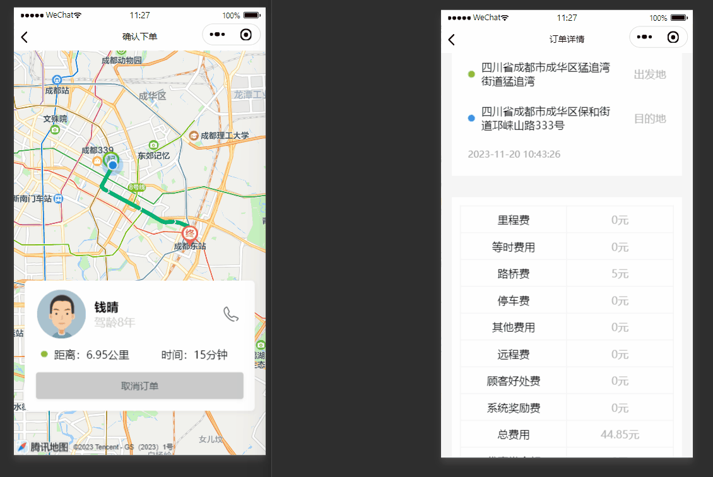
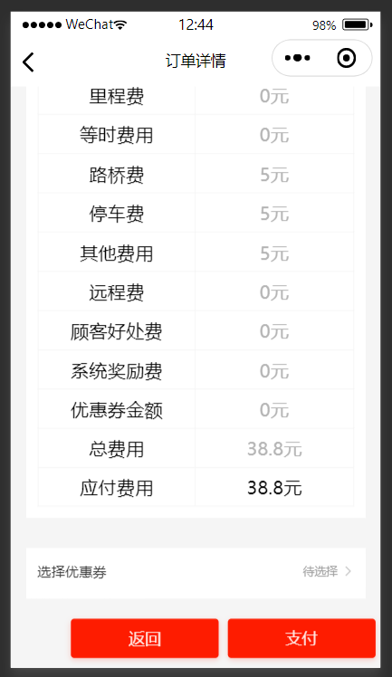
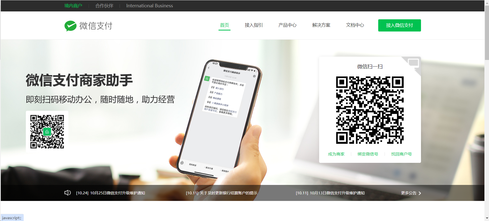
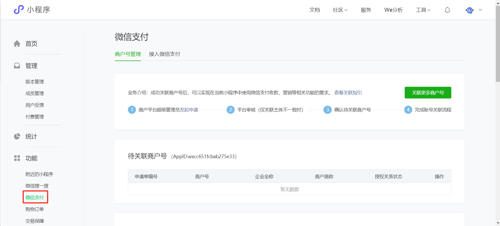
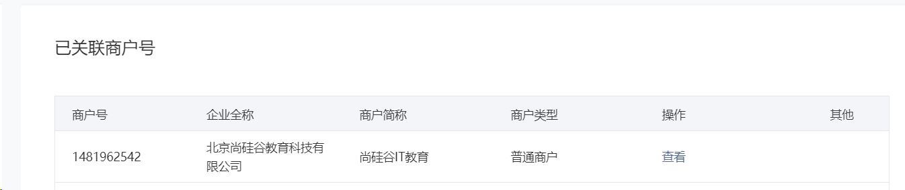
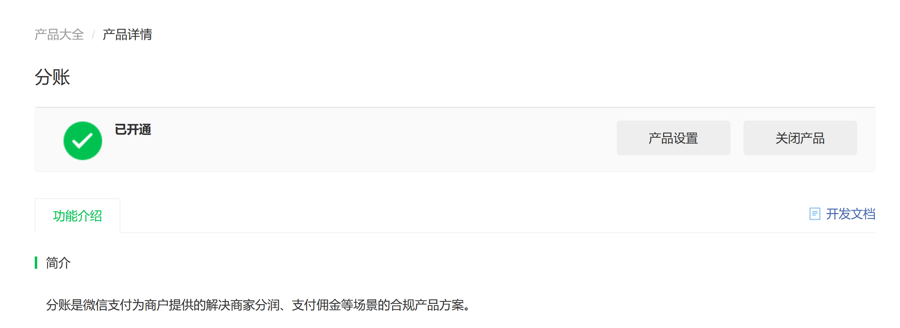
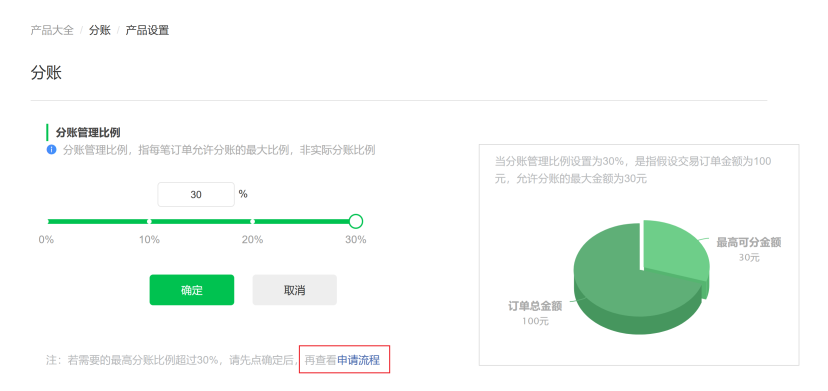
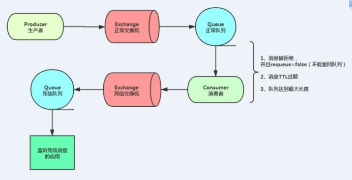

# 代驾：订单支付

## 一、账单信息

上一节中我们结束的代驾，更新了账单信息与分账信息，接下来司机端小程序会跳转到账单确认页，展示账单信息，然后发送账单给乘客端，乘客端拿到账单信息后进行支付账单。



### 1、获取账单信息

order_bill表记录的账单信息，我们直接获取即可

#### 1.1、订单微服务接口

##### 1.1.1、OrderInfoController

```java
@Operation(summary = "根据订单id获取实际账单信息")
@GetMapping("/getOrderBillInfo/{orderId}")
public Result<OrderBillVo> getOrderBillInfo(@PathVariable Long orderId) {
   return Result.ok(orderInfoService.getOrderBillInfo(orderId));
}
```

##### 1.1.2、OrderInfoService

```java
OrderBillVo getOrderBillInfo(Long orderId);
```

##### 1.1.3、OrderInfoServiceImpl

```java
@Override
public OrderBillVo getOrderBillInfo(Long orderId) {
   OrderBill orderBill = orderBillMapper.selectOne(new LambdaQueryWrapper<OrderBill>().eq(OrderBill::getOrderId, orderId));
   OrderBillVo orderBillVo = new OrderBillVo();
   BeanUtils.copyProperties(orderBill, orderBillVo);
   return orderBillVo;
}
```

#### 1.2、Feign接口

##### 1.2.1、OrderInfoFeignClient

```java
/**
 * 根据订单id获取实际账单信息
 * @param orderId
 * @return
 */
@GetMapping("/order/info/getOrderBillInfo/{orderId}")
Result<OrderBillVo> getOrderBillInfo(@PathVariable("orderId") Long orderId);
```


### 2、获取分账信息

order_profitsharing表记录的分账信息，我们直接获取即可

#### 2.1、订单微服务接口

##### 2.1.1、OrderInfoController

```java
@Operation(summary = "根据订单id获取实际分账信息")
@GetMapping("/getOrderProfitsharing/{orderId}")
public Result<OrderProfitsharingVo> getOrderProfitsharing(@PathVariable Long orderId) {
    return Result.ok(orderInfoService.getOrderProfitsharing(orderId));
}
```

##### 2.1.2、OrderInfoService

```java
OrderProfitsharingVo getOrderProfitsharing(Long orderId);
```

##### 2.1.3、OrderInfoServiceImpl

```java
@Override
public OrderProfitsharingVo getOrderProfitsharing(Long orderId) {
    OrderProfitsharing orderProfitsharing = orderProfitsharingMapper.selectOne(new LambdaQueryWrapper<OrderProfitsharing>().eq(OrderProfitsharing::getOrderId, orderId));
    OrderProfitsharingVo orderProfitsharingVo = new OrderProfitsharingVo();
    BeanUtils.copyProperties(orderProfitsharing, orderProfitsharingVo);
    return orderProfitsharingVo;
}
```

#### 2.2、Feign接口

##### 2.2.1、OrderInfoFeignClient

```java
/**
 * 根据订单id获取实际分账信息
 * @param orderId
 * @return
 */
@GetMapping("/order/info/getOrderProfitsharing/{orderId}")
Result<OrderProfitsharingVo> getOrderProfitsharing(@PathVariable("orderId") Long orderId);
```


### 3、司机端获取账单信息

司机端账单信息其实就是订单的明细，前面我们已经提供获取订单信息接口，这里我们直接完善即可

#### 3.1、司机端web接口

##### 3.1.1、OrderServiceImpl

```java
@Override
public OrderInfoVo getOrderInfo(Long orderId, Long driverId) {
   //订单信息
   OrderInfo orderInfo = orderInfoFeignClient.getOrderInfo(orderId).getData();
   if(orderInfo.getDriverId().longValue() != driverId.longValue()) {
      throw new GuiguException(ResultCodeEnum.ILLEGAL_REQUEST);
   }

   //账单信息
   OrderBillVo orderBillVo = null;
   //分账信息
   OrderProfitsharingVo orderProfitsharing = null;
   if (orderInfo.getStatus().intValue() >= OrderStatus.END_SERVICE.getStatus().intValue()) {
      orderBillVo = orderInfoFeignClient.getOrderBillInfo(orderId).getData();

      //获取分账信息
      orderProfitsharing = orderInfoFeignClient.getOrderProfitsharing(orderId).getData();
   }

   //封装订单信息
   OrderInfoVo orderInfoVo = new OrderInfoVo();
   orderInfoVo.setOrderId(orderId);
   BeanUtils.copyProperties(orderInfo, orderInfoVo);
   orderInfoVo.setOrderBillVo(orderBillVo);
   orderInfoVo.setOrderProfitsharingVo(orderProfitsharing);
   return orderInfoVo;
}
```


### 4、发送账单

司机端确认账单信息后，点击“发送账单”，乘客端才能切换到未支付账单页面，发送账单其实就是更新订单流程中的一个状态。

#### 4.1、订单微服务接口

##### 4.1.1、OrderInfoController

```java
@Operation(summary = "发送账单信息")
@GetMapping("/sendOrderBillInfo/{orderId}/{driverId}")
Result<Boolean> sendOrderBillInfo(@PathVariable Long orderId, @PathVariable Long driverId) {
    return Result.ok(orderInfoService.sendOrderBillInfo(orderId, driverId));
}
```

##### 4.1.2、OrderInfoService

```java
Boolean sendOrderBillInfo(Long orderId, Long driverId);
```

##### 4.1.3、OrderInfoServiceImpl

```java
@Transactional(rollbackFor = Exception.class)
@Override
public Boolean sendOrderBillInfo(Long orderId, Long driverId) {
    //更新订单信息
    LambdaQueryWrapper<OrderInfo> queryWrapper = new LambdaQueryWrapper<>();
    queryWrapper.eq(OrderInfo::getId, orderId);
    queryWrapper.eq(OrderInfo::getDriverId, driverId);
    //更新字段
    OrderInfo updateOrderInfo = new OrderInfo();
    updateOrderInfo.setStatus(OrderStatus.UNPAID.getStatus());
    //只能更新自己的订单
    int row = orderInfoMapper.update(updateOrderInfo, queryWrapper);
    if(row == 1) {
        //记录日志
        this.log(orderId, OrderStatus.UNPAID.getStatus());
    } else {
        throw new GuiguException(ResultCodeEnum.UPDATE_ERROR);
    }
    return true;
}
```

#### 4.2、Feign接口

##### 4.2.1、OrderInfoFeignClient

```java
/**
 * 司机发送账单信息
 * @param orderId
 * @param driverId
 * @return
 */
@GetMapping("/order/info/sendOrderBillInfo/{orderId}/{driverId}")
Result<Boolean> sendOrderBillInfo(@PathVariable("orderId") Long orderId, @PathVariable("driverId") Long driverId);
```

#### 4.3、司机端web接口

##### 4.3.1、OrderController

```java
@Operation(summary = "司机发送账单信息")
@GuiguLogin
@GetMapping("/sendOrderBillInfo/{orderId}")
public Result<Boolean> sendOrderBillInfo(@PathVariable Long orderId) {
    Long driverId = AuthContextHolder.getUserId();
    return Result.ok(orderService.sendOrderBillInfo(orderId, driverId));
}
```

##### 4.3.2、OrderService

```java
Boolean sendOrderBillInfo(Long orderId, Long driverId);
```

##### 4.3.3、OrderServiceImpl

```java
@Override
public Boolean sendOrderBillInfo(Long orderId, Long driverId) {
   return orderInfoFeignClient.sendOrderBillInfo(orderId, driverId).getData();
}
```


### 5、乘客端获取账单

账单信息其实就是订单的明细，前面我们已经提供获取订单信息接口，这里我们直接完善即可。

#### 5.1、乘客端web接口

##### 5.1.1、OrderServiceImpl

```java
@Override
public OrderInfoVo getOrderInfo(Long orderId, Long customerId) {
    //订单信息
    OrderInfo orderInfo = orderInfoFeignClient.getOrderInfo(orderId).getData();
    if (orderInfo.getCustomerId().longValue() != customerId.longValue()) {
        throw new GuiguException(ResultCodeEnum.ILLEGAL_REQUEST);
    }
    
     //获取司机信息
    DriverInfoVo driverInfoVo = null;
    if(null != orderInfo.getDriverId()) {
        driverInfoVo = driverInfoFeignClient.getDriverInfo(orderInfo.getDriverId()).getData();
    }

    //账单信息
    OrderBillVo orderBillVo = null;
    if (orderInfo.getStatus().intValue() >= OrderStatus.UNPAID.getStatus().intValue()) {
        orderBillVo = orderInfoFeignClient.getOrderBillInfo(orderId).getData();
    }

    //封装订单信息
    OrderInfoVo orderInfoVo = new OrderInfoVo();
    orderInfoVo.setOrderId(orderId);
    BeanUtils.copyProperties(orderInfo, orderInfoVo);
    orderInfoVo.setOrderBillVo(orderBillVo);
    return orderInfoVo;
}
```


## 二、微信支付



因为咱们要创建可以分账的微信支付账单，调用API的时候需要分别提供司机和乘客的OpenId，当前咱们把这两个数据给查询出来。

### 1、获取乘客OpenId

#### 1.1、乘客微服务接口

##### 1.1.1、CustomerInfoController

```java
@Operation(summary = "获取客户OpenId")
@GetMapping("/getCustomerOpenId/{customerId}")
public Result<String> getCustomerOpenId(@PathVariable Long customerId) {
   return Result.ok(customerInfoService.getCustomerOpenId(customerId));
}
```

##### 1.1.2、CustomerInfoService

```java
String getCustomerOpenId(Long customerId);
```

##### 1.1.3、CustomerInfoServiceImpl

```java
@Override
public String getCustomerOpenId(Long customerId) {
   CustomerInfo customerInfo = this.getOne(new LambdaQueryWrapper<CustomerInfo>().eq(CustomerInfo::getId, customerId).select(CustomerInfo::getWxOpenId));
   return customerInfo.getWxOpenId();
}
```

#### 1.2、Feign接口

##### 1.2.1、CustomerInfoFeignClient

```java
/**
 * 获取客户OpenId
 * @param customerId
 * @return
 */
@GetMapping("/customer/info/getCustomerOpenId/{customerId}")
Result<String> getCustomerOpenId(@PathVariable("customerId") Long customerId);
```


### 2、获取司机OpenId

#### 2.1、司机微服务接口

##### 2.1.1、DriverInfoController

```java
@Operation(summary = "获取司机OpenId")
@GetMapping("/getDriverOpenId/{driverId}")
public Result<String> getDriverOpenId(@PathVariable Long driverId) {
   return Result.ok(driverInfoService.getDriverOpenId(driverId));
}
```

##### 2.1.2、DriverInfoService

```java
String getDriverOpenId(Long driverId);
```

##### 2.1.3、DriverInfoServiceImpl

```java
@Override
public String getDriverOpenId(Long driverId) {
    DriverInfo driverInfo = this.getOne(new LambdaQueryWrapper<DriverInfo>().eq(DriverInfo::getId, driverId).select(DriverInfo::getWxOpenId));
    return driverInfo.getWxOpenId();
}
```

#### 2.2、Feign接口

##### 2.2.1、DriverInfoFeignClient

```
/**
 * 获取司机OpenId
 * @param driverId
 * @return
 */
@GetMapping("/driver/info/getDriverOpenId/{driverId}")
Result<String> getDriverOpenId(@PathVariable("driverId") Long driverId);
```


### 3、获取订单支付信息

#### 3.1、订单微服务接口

##### 3.1.1、OrderInfoController

```java
@Operation(summary = "获取订单支付信息")
@GetMapping("/getOrderPayVo/{orderNo}/{customerId}")
public Result<OrderPayVo> getOrderPayVo(@PathVariable String orderNo, @PathVariable Long customerId) {
   return Result.ok(orderInfoService.getOrderPayVo(orderNo, customerId));
}
```

##### 3.1.2、OrderInfoService

```java
OrderPayVo getOrderPayVo(String orderNo, Long customerId);
```

##### 3.1.3、OrderInfoServiceImpl

```java
@Override
public OrderPayVo getOrderPayVo(String orderNo, Long customerId) {
   OrderPayVo orderPayVo = orderInfoMapper.selectOrderPayVo(orderNo, customerId);
   if(null != orderPayVo) {
      String content = orderPayVo.getStartLocation() + " 到 " + orderPayVo.getEndLocation();
      orderPayVo.setContent(content);
   }
   return orderPayVo;
}
```

##### 3.1.4、OrderInfoMapper

```java
OrderPayVo selectOrderPayVo(@Param("orderNo")String orderNo, @Param("customerId")Long customerId);
```

##### 3.1.5、OrderInfoMapper.xml

```xml
<select id="selectOrderPayVo" resultType="com.atguigu.daijia.model.vo.order.OrderPayVo">
    select
        info.id as order_id,
        info.customer_id,
        info.driver_id,
        info.order_no,
        info.start_location,
        info.end_location,
        info.status,
        bill.pay_amount,
        bill.coupon_amount
    from order_info info
             inner join order_bill bill on bill.order_id = info.id
    where info.customer_id = #{customerId}
      and info.order_no = #{orderNo}
</select>
```

#### 3.2、Feign接口

##### 3.2.1、OrderInfoFeignClient

```java
/**
 * 获取订单支付信息
 * @param orderNo
 * @param customerId
 * @return
 */
@GetMapping("/order/info/getOrderPayVo/{orderNo}/{customerId}")
Result<OrderPayVo> getOrderPayVo(@PathVariable("orderNo") String orderNo, @PathVariable("customerId") Long customerId);
```


### 4、微信支付

#### 4.1、微信支付接口

##### 4.1.1、申请并绑定微信支付

微信支付商户平台：https://pay.weixin.qq.com/index.php/core/home/login

对于商家来说，想要开通微信支付，必须要去“微信支付商户平台”注册，然后把需要的资料提交上去，经过审核通过，你就开通了微信支付功能。

企业申请资料：

1、营业执照：彩色扫描件或数码照片

2、组织机构代码证：彩色扫描件或数码照片，若已三证合一，则无需提供

3、对公银行账户：包含开户行省市信息，开户账号

4、法人身份证：彩色扫描件或数码照片



如果想要在网站或者小程序上面使用微信支付，还要在微信公众平台上面关联你自己的微信商户账号。前提是你的微信开发者账号必须是企业身份，个人身份的开发者账号是无法调用微信支付API的。



已关联商户号



##### 4.1.2、支付密钥和数字证书

因为调用微信支付平台的API接口，必须要用到支付密钥和数字证书，这些参数在微信支付商户平台都可以获取。

说明：需要测试支付的人员必须加入微信开发者，才能调用微信支付，微信小程序的AppId必须与微信支付的AppId一致。

##### 4.1.3、微信支付接口

小程序前端官方文档：https://developers.weixin.qq.com/miniprogram/dev/api/payment/wx.requestPayment.html

服务器端官方文档：https://pay.weixin.qq.com/wiki/doc/apiv3/apis/chapter3_5_1.shtml

#### 4.2、支付微服务接口

##### 4.2.1、pom.xml

官方文档地址：https://github.com/wechatpay-apiv3/wechatpay-java

微信官方封装了微信支付的SDK，引入依赖直接使用，很是方便

```xml
<dependency>
    <groupId>com.github.wechatpay-apiv3</groupId>
    <artifactId>wechatpay-java</artifactId>
</dependency>
```

##### 4.2.2、common-account.yaml

apiclient_key.pem在资料文件夹中，路径改为可访问的正确路径。

异步回调地址必须外网能够访问，本地可以使用内网穿透。

```yaml
wx:
  v3pay:
    #小程序微信公众平台appId
    appid: wxcc651fcbab275e33
    #商户号
    merchantId: 1631833859
    #商户API私钥路径
    privateKeyPath: /root/daijia/apiclient_key.pem
    #商户证书序列号
    merchantSerialNumber: 4AE80B52EBEAB2B96F68E02510A42801E952E889
    #商户APIV3密钥
    apiV3key: 84dba6dd51cdaf779e55bcabae564b53
    #异步回调地址
    notifyUrl: http://139.198.127.41:8600/payment/wxPay/notify
```

##### 4.2.3、WxPayV3Config

```java
package com.atguigu.daijia.payment.config;

import com.wechat.pay.java.core.RSAAutoCertificateConfig;
import lombok.Data;
import org.springframework.boot.context.properties.ConfigurationProperties;
import org.springframework.context.annotation.Bean;
import org.springframework.context.annotation.Configuration;

@Configuration
@ConfigurationProperties(prefix="wx.v3pay") //读取节点
@Data
public class WxPayV3Properties {

    private String appid;
    /** 商户号 */
    public String merchantId;
    /** 商户API私钥路径 */
    public String privateKeyPath;
    /** 商户证书序列号 */
    public String merchantSerialNumber;
    /** 商户APIV3密钥 */
    public String apiV3key;
    /** 回调地址 */
    private String notifyUrl;

    @Bean
    public RSAAutoCertificateConfig getConfig(){
        return new RSAAutoCertificateConfig.Builder()
                        .merchantId(this.getMerchantId())
                        .privateKeyFromPath(this.getPrivateKeyPath())
                        .merchantSerialNumber(this.getMerchantSerialNumber())
                        .apiV3Key(this.getApiV3key())
                        .build();

    }
}
```

##### 4.2.4、WxPayController

```java
@Operation(summary = "创建微信支付")
@PostMapping("/createJsapi")
public Result<WxPrepayVo> createWxPayment(@RequestBody PaymentInfoForm paymentInfoForm) {
    return Result.ok(wxPayService.createWxPayment(paymentInfoForm));
}
```

##### 4.2.5、WxPayService

```java
WxPrepayVo createWxPayment(PaymentInfoForm paymentInfoForm);
```

##### 4.2.6、WxPayServiceImpl

```java
@Override
public WxPrepayVo createWxPayment(PaymentInfoForm paymentInfoForm) {
   try {
      PaymentInfo paymentInfo = paymentInfoMapper.selectOne(new LambdaQueryWrapper<PaymentInfo>().eq(PaymentInfo::getOrderNo, paymentInfoForm.getOrderNo()));
      if(null == paymentInfo) {
         paymentInfo = new PaymentInfo();
         BeanUtils.copyProperties(paymentInfoForm, paymentInfo);
         paymentInfo.setPaymentStatus(0);
         paymentInfoMapper.insert(paymentInfo);
      }

      // 构建service
      JsapiServiceExtension service = new JsapiServiceExtension.Builder().config(rsaAutoCertificateConfig).build();

      // request.setXxx(val)设置所需参数，具体参数可见Request定义
      PrepayRequest request = new PrepayRequest();
      Amount amount = new Amount();
      amount.setTotal(paymentInfoForm.getAmount().multiply(new BigDecimal(100)).intValue());
      request.setAmount(amount);
      request.setAppid(wxPayV3Properties.getAppid());
      request.setMchid(wxPayV3Properties.getMerchantId());
      //string[1,127]
      String description = paymentInfo.getContent();
      if(description.length() > 127) {
         description = description.substring(0, 127);
      }
      request.setDescription(paymentInfo.getContent());
      request.setNotifyUrl(wxPayV3Properties.getNotifyUrl());
      request.setOutTradeNo(paymentInfo.getOrderNo());

      //获取用户信息
      Payer payer = new Payer();
      payer.setOpenid(paymentInfoForm.getCustomerOpenId());
      request.setPayer(payer);
       
      //是否指定分账，不指定不能分账
      SettleInfo settleInfo = new SettleInfo();
      settleInfo.setProfitSharing(true);
      request.setSettleInfo(settleInfo);

      // 调用下单方法，得到应答
      // response包含了调起支付所需的所有参数，可直接用于前端调起支付
      PrepayWithRequestPaymentResponse response = service.prepayWithRequestPayment(request);
      log.info("微信支付下单返回参数：{}", JSON.toJSONString(response));

      WxPrepayVo wxPrepayVo = new WxPrepayVo();
      BeanUtils.copyProperties(response, wxPrepayVo);
      wxPrepayVo.setTimeStamp(response.getTimeStamp());
      return wxPrepayVo;
   } catch (Exception e) {
      e.printStackTrace();
      throw new GuiguException(ResultCodeEnum.WX_CREATE_ERROR);
   }
}
```

#### 4.3、Feign接口

##### 4.3.1、WxPayFeignClient

```java
/**
 * 创建微信支付
 * @param paymentInfoForm
 * @return
 */
@PostMapping("/payment/wxPay/createWxPayment")
Result<WxPrepayVo> createWxPayment(@RequestBody PaymentInfoForm paymentInfoForm);
```

#### 4.4、乘客端web接口

##### 4.4.1、OrderController

```java
@Operation(summary = "创建微信支付")
@GuiguLogin
@PostMapping("/createWxPayment")
public Result<WxPrepayVo> createWxPayment(@RequestBody CreateWxPaymentForm createWxPaymentForm) {
   Long customerId = AuthContextHolder.getUserId();
   createWxPaymentForm.setCustomerId(customerId);
   return Result.ok(orderService.createWxPayment(createWxPaymentForm));
}
```

##### 4.4.2、OrderService

```java
WxPrepayVo createWxPayment(CreateWxPaymentForm createWxPaymentForm);
```

##### 4.4.2、OrderServiceImpl

```java
@Autowired
private DriverInfoFeignClient driverInfoFeignClient;

@Autowired
private CustomerInfoFeignClient customerInfoFeignClient;

@Autowired
private WxPayFeignClient wxPayFeignClient;

@Override
public WxPrepayVo createWxPayment(CreateWxPaymentForm createWxPaymentForm) {
    //1.获取订单支付相关信息
    OrderPayVo orderPayVo = orderInfoFeignClient.getOrderPayVo(createWxPaymentForm.getOrderNo(), createWxPaymentForm.getCustomerId()).getData();
    //判断是否在未支付状态
    if (orderPayVo.getStatus().intValue() != OrderStatus.UNPAID.getStatus().intValue()) {
        throw new GuiguException(ResultCodeEnum.ILLEGAL_REQUEST);
    }

    //2.获取乘客微信openId
    String customerOpenId = customerInfoFeignClient.getCustomerOpenId(orderPayVo.getCustomerId()).getData();

    //3.获取司机微信openId
    String driverOpenId = driverInfoFeignClient.getDriverOpenId(orderPayVo.getDriverId()).getData();

    //4.封装微信下单对象，微信支付只关注以下订单属性
    PaymentInfoForm paymentInfoForm = new PaymentInfoForm();
    paymentInfoForm.setCustomerOpenId(customerOpenId);
    paymentInfoForm.setDriverOpenId(driverOpenId);
    paymentInfoForm.setOrderNo(orderPayVo.getOrderNo());
    paymentInfoForm.setAmount(orderPayVo.getPayAmount());
    paymentInfoForm.setContent(orderPayVo.getContent());
    paymentInfoForm.setPayWay(1);
    WxPrepayVo wxPrepayVo = wxPayFeignClient.createWxPayment(paymentInfoForm).getData();
    return wxPrepayVo;
}
```

#### 4.5、乘客端小程序唤起付款窗口

小程序前端官方文档：https://developers.weixin.qq.com/miniprogram/dev/api/payment/wx.requestPayment.html

乘客端小程序调用创建微信支付接口，然后调用`uni.requestPayment()`函数传入返回参数，小程序就能弹出付款窗口了。


### 5、支付结果通知

官方文档地址：https://pay.weixin.qq.com/wiki/doc/apiv3/apis/chapter3_5_5.shtml

支付成功，微信平台异步通知，我们处理完支付微服务业务逻辑后，快速返回，需要发送mq消息处理订单其他业务，因此我们要引入mq消息队列。

#### 5.1、支付微服务接口

##### 5.1.1、引入依赖

```xml
<dependency>
    <groupId>com.atguigu.daijia</groupId>
    <artifactId>rabbit-util</artifactId>
    <version>1.0</version>
</dependency>
```

##### 5.1.2、添加配置

```yaml
rabbitmq:
  host: 139.198.163.91
  port: 5672
  username: guest
  password: guest
  publisher-confirm-type: CORRELATED
  publisher-returns: true
  listener:
    simple:
      cknowledge-mode: manual #默认情况下消息消费者是自动确认消息的，如果要手动确认消息则需要修改确认模式为manual
      prefetch: 1 # 消费者每次从队列获取的消息数量。此属性当不设置时为：轮询分发，设置为1为：公平分发
```

##### 5.1.3、WxPayController

```java
@Operation(summary = "微信支付异步通知接口")
@PostMapping("/notify")
public Map<String,Object> notify(HttpServletRequest request) {
    try {
        wxPayService.wxnotify(request);

        //返回成功
        Map<String,Object> result = new HashMap<>();
        result.put("code", "SUCCESS");
        result.put("message", "成功");
        return result;
    } catch (Exception e) {
        e.printStackTrace();
    }

    //返回失败
    Map<String,Object> result = new HashMap<>();
    result.put("code", "FAIL");
    result.put("message", "失败");
    return result;
}
```

##### 5.1.4、WxPayService

```java
void wxnotify(HttpServletRequest request);
```

##### 5.1.5、WxPayServiceImpl

```java
@Autowired
private RabbitService rabbitService;

@Transactional
@Override
public void wxnotify(HttpServletRequest request) {
   //1.回调通知的验签与解密
   //从request头信息获取参数
   //HTTP 头 Wechatpay-Signature
   // HTTP 头 Wechatpay-Nonce
   //HTTP 头 Wechatpay-Timestamp
   //HTTP 头 Wechatpay-Serial
   //HTTP 头 Wechatpay-Signature-Type
   //HTTP 请求体 body。切记使用原始报文，不要用 JSON 对象序列化后的字符串，避免验签的 body 和原文不一致。
   String wechatPaySerial = request.getHeader("Wechatpay-Serial");
   String nonce = request.getHeader("Wechatpay-Nonce");
   String timestamp = request.getHeader("Wechatpay-Timestamp");
   String signature = request.getHeader("Wechatpay-Signature");
   String requestBody = RequestUtils.readData(request);
   log.info("wechatPaySerial：{}", wechatPaySerial);
   log.info("nonce：{}", nonce);
   log.info("timestamp：{}", timestamp);
   log.info("signature：{}", signature);
   log.info("requestBody：{}", requestBody);

   //2.构造 RequestParam
   RequestParam requestParam = new RequestParam.Builder()
         .serialNumber(wechatPaySerial)
         .nonce(nonce)
         .signature(signature)
         .timestamp(timestamp)
         .body(requestBody)
         .build();


   //3.初始化 NotificationParser
   NotificationParser parser = new NotificationParser(rsaAutoCertificateConfig);
   //4.以支付通知回调为例，验签、解密并转换成 Transaction
   Transaction transaction = parser.parse(requestParam, Transaction.class);
   log.info("成功解析：{}", JSON.toJSONString(transaction));
   if(null != transaction && transaction.getTradeState() == Transaction.TradeStateEnum.SUCCESS) {
      //5.处理支付业务
      this.handlePayment(transaction);
   }
}

public void handlePayment(Transaction transaction) {
   PaymentInfo paymentInfo = paymentInfoMapper.selectOne(new LambdaQueryWrapper<PaymentInfo>().eq(PaymentInfo::getOrderNo, transaction.getOutTradeNo()));
   if (paymentInfo.getPaymentStatus() == 1) {
      return;
   }

   //更新支付信息
   paymentInfo.setPaymentStatus(1);
   paymentInfo.setOrderNo(transaction.getOutTradeNo());
   paymentInfo.setTransactionId(transaction.getTransactionId());
   paymentInfo.setCallbackTime(new Date());
   paymentInfo.setCallbackContent(JSON.toJSONString(transaction));
   paymentInfoMapper.updateById(paymentInfo);
   // 表示交易成功！

   // 后续更新订单状态！ 使用消息队列！
   rabbitService.sendMessage(MqConst.EXCHANGE_ORDER, MqConst.ROUTING_PAY_SUCCESS, paymentInfo.getOrderNo());
}
```


### 6、支付查询

微信支付调用成功与失败 不能够完全依据前端 **success**，**fail** 回调函数来进行判断 , 判断是否支付成功，由后端进行判断。因此在发起支付后，乘客端小程序要轮询查询后端是否支付成功。

微信支付查询订单文档：https://pay.weixin.qq.com/wiki/doc/apiv3/apis/chapter3_5_2.shtml

#### 6.1、支付微服务接口

#### 6.1.1、WxPayController

```java
@Operation(summary = "支付状态查询")
@GetMapping("/queryPayStatus/{orderNo}")
public Result queryPayStatus(@PathVariable String orderNo) {
    return Result.ok(wxPayService.queryPayStatus(orderNo));
}
```

##### 6.1.2、WxPayService

```java
Boolean queryPayStatus(String orderNo);
```

##### 6.1.3、WxPayServiceImpl

```java
@Override
public Boolean queryPayStatus(String orderNo) {
   // 构建service
   JsapiServiceExtension service = new JsapiServiceExtension.Builder().config(rsaAutoCertificateConfig).build();

   QueryOrderByOutTradeNoRequest queryRequest = new QueryOrderByOutTradeNoRequest();
   queryRequest.setMchid(wxPayV3Properties.getMerchantId());
   queryRequest.setOutTradeNo(orderNo);

   try {
      Transaction transaction = service.queryOrderByOutTradeNo(queryRequest);
      log.info(JSON.toJSONString(transaction));
      if(null != transaction && transaction.getTradeState() == Transaction.TradeStateEnum.SUCCESS) {
         //更改订单状态
         this.handlePayment(transaction);
         return true;
      }
   } catch (ServiceException e) {
      // API返回失败, 例如ORDER_NOT_EXISTS
      System.out.printf("code=[%s], message=[%s]\n", e.getErrorCode(), e.getErrorMessage());
   }
   return false;
}
```

#### 6.2、Feign接口

##### 6.2.1、WxPayFeignClient

```java
/**
 * 支付状态查询
 * @param orderNo
 * @return
 */
@GetMapping("/payment/wxPay/queryPayStatus/{orderNo}")
Result<Boolean> queryPayStatus(@PathVariable("orderNo") String orderNo);
```

#### 6.3、乘客端web接口

##### 6.3.1、OrderController

```java
@Operation(summary = "支付状态查询")
@GuiguLogin
@GetMapping("/queryPayStatus/{orderNo}")
public Result<Boolean> queryPayStatus(@PathVariable String orderNo) {
   return Result.ok(orderService.queryPayStatus(orderNo));
}
```

##### 6.3.2、OrderService

```java
Boolean queryPayStatus(String orderNo);
```

##### 6.3.3、OrderServiceImpl

```java
@Override
public Boolean queryPayStatus(String orderNo) {
    return wxPayFeignClient.queryPayStatus(orderNo).getData();
}
```


## 三、支付成功业务处理

前面支付成功了，微信平台也回调了，只要我们支付记录表记录了支付信息与更改了支付状态，我们就让他快速返回，后面的业务我们通过mq来保证最终的一致。

后续还有哪些业务要处理呢？

1、更改订单状态

2、如果有系统奖励，需要将系统奖励打入司机个人账户

3、执行分账

这三个业务必须都一起执行成功，得保证事务的一致性，因此需要引入seata

### 1、支付成功更新订单状态

#### 1.1、订单微服务接口

##### 1.1.1、OrderInfoController

```java
@Operation(summary = "更改订单支付状态")
@GetMapping("/updateOrderPayStatus/{orderNo}")
public Result<Boolean> updateOrderPayStatus(@PathVariable String orderNo) {
   return Result.ok(orderInfoService.updateOrderPayStatus(orderNo));
}
```

##### 1.1.2、OrderInfoService

```java
Boolean updateOrderPayStatus(String orderNo);
```

##### 1.1.3、OrderInfoServiceImpl

```java
@Transactional(rollbackFor = Exception.class)
@Override
public Boolean updateOrderPayStatus(String orderNo) {
    //查询订单，判断订单状态，如果已更新支付状态，直接返回
    LambdaQueryWrapper<OrderInfo> queryWrapper = new LambdaQueryWrapper<>();
    queryWrapper.eq(OrderInfo::getOrderNo, orderNo);
    queryWrapper.select(OrderInfo::getId, OrderInfo::getDriverId, OrderInfo::getStatus);
    OrderInfo orderInfo = orderInfoMapper.selectOne(queryWrapper);
    if(null == orderInfo || orderInfo.getStatus().intValue() == OrderStatus.PAID.getStatus().intValue()) return true;

    //更新订单状态
    LambdaQueryWrapper<OrderInfo> updateQueryWrapper = new LambdaQueryWrapper<>();
    updateQueryWrapper.eq(OrderInfo::getOrderNo, orderNo);
    //更新字段
    OrderInfo updateOrderInfo = new OrderInfo();
    updateOrderInfo.setStatus(OrderStatus.PAID.getStatus());
    updateOrderInfo.setPayTime(new Date());
    int row = orderInfoMapper.update(updateOrderInfo, queryWrapper);
    if(row == 1) {
        //记录日志
        this.log(orderInfo.getId(), OrderStatus.PAID.getStatus());
    } else {
        log.error("订单支付回调更新订单状态失败，订单号为：" + orderNo);
        throw new GuiguException(ResultCodeEnum.UPDATE_ERROR);
    }
    return true;
}
```

#### 1.2、Feign接口

##### 1.2.1、OrderInfoFeignClient

```java
/**
 * 更改订单支付状态
 * @param orderNo
 * @return
 */
@GetMapping("/order/info//updateOrderPayStatus/{orderNo}")
Result<Boolean> updateOrderPayStatus(@PathVariable("orderNo") String orderNo);
```


### 2、获取订单系统奖励

#### 2.1、订单微服务接口

##### 2.1.1、OrderInfoController

```java
@Operation(summary = "获取订单的系统奖励")
@GetMapping("/getOrderRewardFee/{orderNo}")
public Result<OrderRewardVo> getOrderRewardFee(@PathVariable String orderNo) {
   return Result.ok(orderInfoService.getOrderRewardFee(orderNo));
}
```

##### 2.1.2、OrderInfoService

```java
OrderRewardVo getOrderRewardFee(String orderNo);
```

##### 2.1.3、OrderInfoServiceImpl

```java
@Override
public OrderRewardVo getOrderRewardFee(String orderNo) {
    //查询订单
    OrderInfo orderInfo = orderInfoMapper.selectOne(new LambdaQueryWrapper<OrderInfo>().eq(OrderInfo::getOrderNo, orderNo).select(OrderInfo::getId,OrderInfo::getDriverId));
    //账单
    OrderBill orderBill = orderBillMapper.selectOne(new LambdaQueryWrapper<OrderBill>().eq(OrderBill::getOrderId, orderInfo.getId()).select(OrderBill::getRewardFee));
    OrderRewardVo orderRewardVo = new OrderRewardVo();
    orderRewardVo.setOrderId(orderInfo.getId());
    orderRewardVo.setDriverId(orderInfo.getDriverId());
    orderRewardVo.setRewardFee(orderBill.getRewardFee());
    return orderRewardVo;
}
```

#### 2.2、Feign接口

##### 2.2.1、OrderInfoFeignClient

```java
/**
 * 获取订单的系统奖励
 * @param orderNo
 * @return
 */
@GetMapping("/order/info//getOrderRewardFee/{orderNo}")
Result<OrderRewardVo> getOrderRewardFee(@PathVariable("orderNo") String orderNo);
```


### 3、系统奖励打入司机账户

奖励只是添加到司机的个人账户，司机后续可提现或处理罚款

#### 3.1、司机微服务接口

##### 3.1.1、DriverAccountController

```java
@Autowired
private DriverAccountService driverAccountService;

@Operation(summary = "转账")
@PostMapping("/transfer")
public Result<Boolean> transfer(@RequestBody TransferForm transferForm) {
   return Result.ok(driverAccountService.transfer(transferForm));
}
```

##### 3.1.2、DriverAccountService

```
Boolean transfer(TransferForm transferForm);
```

##### 3.1.3、DriverAccountServiceImpl

```java
@Autowired
private DriverAccountMapper driverAccountMapper;

@Autowired
private DriverAccountDetailMapper driverAccountDetailMapper;

@Transactional(rollbackFor = Exception.class)
@Override
public Boolean transfer(TransferForm transferForm) {
   //去重
   long count = driverAccountDetailMapper.selectCount(new LambdaQueryWrapper<DriverAccountDetail>().eq(DriverAccountDetail::getTradeNo, transferForm.getTradeNo()));
   if(count > 0) return true;

   //添加账号金额
   driverAccountMapper.add(transferForm.getDriverId(), transferForm.getAmount());

   //添加账户明细
   DriverAccountDetail driverAccountDetail = new DriverAccountDetail();
   BeanUtils.copyProperties(transferForm, driverAccountDetail);
   driverAccountDetailMapper.insert(driverAccountDetail);
   return true;
}
```

##### 3.1.4、DriverAccountMapper

```java
Integer add(@Param("driverId") Long userId, @Param("amount") BigDecimal amount);
```

##### 3.1.5、DriverAccountMapper.xml

```xml
<update id="add">
   update driver_account
   set total_amount = total_amount + #{amount}, available_amount = available_amount + #{amount}, total_income_amount = total_income_amount + #{amount}
   where driver_id = #{driverId}
</update>
```

#### 3.2、Feign接口

##### 3.2.1、DriverAccountFeignClient

```java
/**
 * 转账
 * @param transferForm
 * @return
 */
@PostMapping("/driver/account/transfer")
Result<Boolean> transfer(@RequestBody TransferForm transferForm);
```


### 4、支付成功业务处理

#### 4.1、支付微服务接口

##### 4.1.1、PaymentReceiver

```java
package com.atguigu.daijia.payment.receiver;

@Slf4j
@Component
public class PaymentReceiver {

    @Autowired
    private WxPayService wxPayService;

    /**
     * 订单支付成功，处理支付回调
     *
     * @param orderNo
     * @throws IOException
     */
    @RabbitListener(bindings = @QueueBinding(
            value = @Queue(value = MqConst.QUEUE_PAY_SUCCESS, durable = "true"),
            exchange = @Exchange(value = MqConst.EXCHANGE_ORDER),
            key = {MqConst.ROUTING_PAY_SUCCESS}
    ))
    public void paySuccess(String orderNo, Message message, Channel channel) throws IOException {
        wxPayService.handleOrder(orderNo);
        channel.basicAck(message.getMessageProperties().getDeliveryTag(), false);
    }

}
```

##### 4.1.2、WxPayService

```java
void handleOrder(String orderNo);
```

##### 4.1.3、WxPayServiceImpl

```java
@GlobalTransactional
@Override
public void handleOrder(String orderNo) {
   //1.更改订单支付状态
   orderInfoFeignClient.updateOrderPayStatus(orderNo);

   //2.处理系统奖励，打入司机账户
   OrderRewardVo orderRewardVo = orderInfoFeignClient.getOrderRewardFee(orderNo).getData();
   if(null != orderRewardVo.getRewardFee() && orderRewardVo.getRewardFee().doubleValue() > 0) {
      TransferForm transferForm = new TransferForm();
      transferForm.setTradeNo(orderNo);
      transferForm.setTradeType(TradeType.REWARD.getType());
      transferForm.setContent(TradeType.REWARD.getContent());
      transferForm.setAmount(orderRewardVo.getRewardFee());
      transferForm.setDriverId(orderRewardVo.getDriverId());
      driverAccountFeignClient.transfer(transferForm);
   }

   //3.TODO分账
}
```


### 5、微信分账

#### 5.1、微信分账介绍

##### 5.1.1、 开通分账功能

在微信商户平台上面，在产品大全栏目中可以找到微信分账服务，开启这项服务即可。




##### 5.1.2、 关于分账比例

普通商户的分账比例默认上限是30%，也就是说商户自己留存70%，给员工或者其他人分账最高比例是30%，在普通业务中也还凑合，因为员工拿的提成很少有高于30%的。但是在代驾业务中，代驾司机的劳务费占了订单总额的大头，所以给司机30%的分账比例根本不够。

微信商户平台之所以给商户默认设置这么低的分账上限，主要是为了防止商户逃税或者洗钱。比如公司按照营业利润交税，但是公司老板想要少缴税，这需要通过某些手段减少企业盈利。于是把订单分账比例调高到99%，然后公司客户每笔货款都被分账到了老板指定的微信上面，揣到老板自己腰包里面，而公司的营业利润大幅降低，缴纳的税款也就变少了。微信平台为了避免有些公司通过分账来逃税，所以就给分账比例设置了30%的上线。不过也不是申请更高的分账比例，在设置分账比例上线的页面中，我们可以按照申请流程的指引，申请更高的分账比例。这就需要企业提交更多的证明材料，然后微信平台还要聘请专业的审计公司对审核的单位加以评估。即便你们公司申请下来高比例的分账，但是微信平台会把你们公司的分账记录和税务局的金税系统联网，随时监控你们公司是否伪造交易虚设分账，企图逃税。


申请高比例分账，走的流程非常复杂，而且还要接受税务局和微信支付系统的严格监督，所以我们就没必要申请高比例分账。大家要清楚这一点就可以了。


##### 5.1.3、 文档说明

微信分账官方文档：https://pay.weixin.qq.com/wiki/doc/api/allocation.php?chapter=26_1

微信分账官方接口文档：https://pay.weixin.qq.com/wiki/doc/apiv3/apis/chapter8_1_1.shtml

#### 5.2、封装分账消息接口

用户付款成功后，商户系统至少要2分钟之后才可以申请分账。很多同学第一次做分账，不知道这个细节，导致Web方法刚收到付款成功的通知消息，就立即发起分账，然后就收到订单暂时不可以分账的异常消息。既然我们要等待两分钟以上才可以申请分账，所以我们使用mq延迟消息执行分账。

##### 5.2.1、ProfitsharingMqConfig

配置MQ延迟队列

```java
package com.atguigu.daijia.payment.config;


@Configuration
public class ProfitsharingMqConfig {

    @Bean
    public Queue profitsharingQueue() {
        // 第一个参数是创建的queue的名字，第二个参数是是否支持持久化
        return new Queue(MqConst.QUEUE_PROFITSHARING, true);
    }

    @Bean
    public CustomExchange profitsharingExchange() {
        Map<String, Object> args = new HashMap<String, Object>();
        args.put("x-delayed-type", "direct");
        return new CustomExchange(MqConst.EXCHANGE_PROFITSHARING, "x-delayed-message", true, false, args);
    }

    @Bean
    public Binding bindingCancel() {
        return BindingBuilder.bind(profitsharingQueue()).to(profitsharingExchange()).with(MqConst.ROUTING_PROFITSHARING).noargs();
    }

}
```

##### 5.2.2、PaymentReceiver

添加消息监听

```java
@Autowired
private WxProfitsharingService wxProfitsharingService;

/**
 * 分账消息
 * @param param
 * @throws IOException
 */
@RabbitListener(queues = MqConst.QUEUE_PROFITSHARING)
public void profitsharingMessage(String param, Message message, Channel channel) throws IOException {
    try {
        ProfitsharingForm profitsharingForm = JSONObject.parseObject(param, ProfitsharingForm.class);
        log.info("分账：{}", param);
        wxProfitsharingService.profitsharing(profitsharingForm);
        channel.basicAck(message.getMessageProperties().getDeliveryTag(), false);
    } catch (Exception e) {
        log.info("分账调用失败：{}", e.getMessage());
        //任务执行失败，就退回队列继续执行，优化：设置退回次数，超过次数记录日志
        channel.basicNack(message.getMessageProperties().getDeliveryTag(), false, true);
    }
}
```

##### 5.2.3、WxProfitsharingService

```java
void profitsharing(ProfitsharingForm profitsharingForm);
```

##### 5.2.4、WxProfitsharingServiceImpl

步骤：

1、添加分账接收方：https://pay.weixin.qq.com/wiki/doc/apiv3/apis/chapter8_1_8.shtml

2、请求分账：https://pay.weixin.qq.com/wiki/doc/apiv3/apis/chapter8_1_1.shtml

注：订单必须是分账订单

```java
@Autowired
private PaymentInfoMapper paymentInfoMapper;

@Autowired
private ProfitsharingInfoMapper profitsharingInfoMapper;

@Autowired
private WxPayV3Properties wxPayV3Properties;

@Autowired
private RSAAutoCertificateConfig rsaAutoCertificateConfig;

@Autowired
private RabbitService rabbitService;


/**
 * https://pay.weixin.qq.com/wiki/doc/api/allocation.php?chapter=26_1
 * 支付文档入口：https://pay.weixin.qq.com/wiki/doc/apiv3/apis/chapter8_1_1.shtml
 *
 * 对接方式：https://github.com/wechatpay-apiv3/wechatpay-java
 * https://github.com/wechatpay-apiv3/wechatpay-java/blob/main/service/src/example/java/com/wechat/pay/java/service/profitsharing/ProfitsharingServiceExample.java
 *
 * @param profitsharingForm
 * @return
 */
@Override
public void profitsharing(ProfitsharingForm profitsharingForm) {
    //分账成功才记录分账消息，查询是否已经分账
    long count = profitsharingInfoMapper.selectCount(new LambdaQueryWrapper<ProfitsharingInfo>().eq(ProfitsharingInfo::getOrderNo, profitsharingForm.getOrderNo()));
    if(count > 0) return;

    //根据订单号获取微信支付信息
    PaymentInfo paymentInfo = paymentInfoMapper.selectOne(new LambdaQueryWrapper<PaymentInfo>().eq(PaymentInfo::getOrderNo, profitsharingForm.getOrderNo()));

    // 构建分账service
    ProfitsharingService service = new ProfitsharingService.Builder().config(rsaAutoCertificateConfig).build();

    //添加分账接收方
    //API地址：https://pay.weixin.qq.com/wiki/doc/apiv3/apis/chapter8_1_8.shtml
    //构建分账接收方参数
    AddReceiverRequest addReceiverRequest = new AddReceiverRequest();
    addReceiverRequest.setAppid(wxPayV3Properties.getAppid());
    addReceiverRequest.setType(ReceiverType.PERSONAL_OPENID);
    addReceiverRequest.setAccount(paymentInfo.getDriverOpenId());
    addReceiverRequest.setRelationType(ReceiverRelationType.PARTNER);
    AddReceiverResponse addReceiverResponse = service.addReceiver(addReceiverRequest);
    log.info("添加分账接收方：{}", JSON.toJSONString(addReceiverResponse));

    //构建分账参数
    CreateOrderRequest request = new CreateOrderRequest();
    request.setAppid(wxPayV3Properties.getAppid());
    request.setTransactionId(paymentInfo.getTransactionId());
    //商户分账单号
    String outOrderNo = profitsharingForm.getOrderNo() + "_" + new Random().nextInt(10);
    request.setOutOrderNo(outOrderNo);

    //分账接收方列表
    List<CreateOrderReceiver> receivers = new ArrayList<>();
    CreateOrderReceiver orderReceiver = new CreateOrderReceiver();
    orderReceiver.setType("PERSONAL_OPENID");
    orderReceiver.setAccount(paymentInfo.getDriverOpenId());
    //分账金额从元转换成分
    Long amount = profitsharingForm.getAmount().multiply(new BigDecimal("100")).longValue();
    orderReceiver.setAmount(amount);
    orderReceiver.setDescription("司机代驾分账");
    receivers.add(orderReceiver);
    //分账接收方列表

    request.setReceivers(receivers);
    request.setUnfreezeUnsplit(true);
    //执行分账，返回结果
    OrdersEntity ordersEntity = service.createOrder(request);
    //分账成功
    if(ordersEntity.getState().name().equals("FINISHED")) {
        ProfitsharingInfo profitsharingInfo = new ProfitsharingInfo();
        profitsharingInfo.setOrderNo(paymentInfo.getOrderNo());
        profitsharingInfo.setTransactionId(paymentInfo.getTransactionId());
        profitsharingInfo.setOutTradeNo(outOrderNo);
        profitsharingInfo.setAmount(profitsharingInfo.getAmount());
        profitsharingInfo.setState(ordersEntity.getState().name());
        profitsharingInfo.setResponeContent(JSON.toJSONString(ordersEntity));
        profitsharingInfoMapper.insert(profitsharingInfo);

        //分账成功，发送消息
        rabbitService.sendMessage(MqConst.EXCHANGE_ORDER, MqConst.ROUTING_PROFITSHARING_SUCCESS, paymentInfo.getOrderNo());
    } else if(ordersEntity.getState().name().equals("PROCESSING")) {
        //如果状态是分账中，等待2分钟再执行分账
        rabbitService.sendDealyMessage(MqConst.EXCHANGE_PROFITSHARING, MqConst.ROUTING_PROFITSHARING, JSON.toJSONString(profitsharingForm), SystemConstant.PROFITSHARING_DELAY_TIME);
    } else {
        log.error("执行分账失败");
        throw new GuiguException(ResultCodeEnum.PROFITSHARING_FAIL);
    }
}
```

#### 5.3、支付成功业务修改

##### 5.3.1、WxPayServiceImpl

前面我们未加分账逻辑，现在补充

```java
@GlobalTransactional
@Override
public void handleOrder(String orderNo) {
   //更改订单支付状态
   orderInfoFeignClient.updateOrderPayStatus(orderNo);

   //处理系统奖励，打入司机账户
   OrderRewardVo orderRewardVo = orderInfoFeignClient.getOrderRewardFee(orderNo).getData();
   if(null != orderRewardVo.getRewardFee() && orderRewardVo.getRewardFee().doubleValue() > 0) {
      TransferForm transferForm = new TransferForm();
      transferForm.setTradeNo(orderNo);
      transferForm.setTradeType(TradeType.REWARD.getType());
      transferForm.setContent(TradeType.REWARD.getContent());
      transferForm.setAmount(orderRewardVo.getRewardFee());
      transferForm.setDriverId(orderRewardVo.getDriverId());
      driverAccountFeignClient.transfer(transferForm);
   }

   //分账处理
   OrderProfitsharingVo orderProfitsharingVo = orderInfoFeignClient.getOrderProfitsharing(orderRewardVo.getOrderId()).getData();
   //封装分账参数对象
   ProfitsharingForm profitsharingForm = new ProfitsharingForm();
   profitsharingForm.setOrderNo(orderNo);
   profitsharingForm.setAmount(orderProfitsharingVo.getDriverIncome());
   profitsharingForm.setDriverId(orderRewardVo.getDriverId());
   //分账有延迟，支付成功后最少2分钟执行分账申请
   rabbitService.sendDelayMessage(MqConst.EXCHANGE_PROFITSHARING, MqConst.ROUTING_PROFITSHARING, JSON.toJSONString(profitsharingForm), SystemConstant.PROFITSHARING_DELAY_TIME);
}
```


### 6、更新订单分账状态

微信分账成功后，发送了消息，我们需要在订单微服务模块，监听消息，处理消息

#### 6.1、订单微服务接口

##### 6.1.1、OrderReceiver

```java
/**
 * 订单分账成功，更新分账状态
 *
 * @param orderNo
 * @throws IOException
 */
@RabbitListener(bindings = @QueueBinding(
        value = @Queue(value = MqConst.QUEUE_PROFITSHARING_SUCCESS, durable = "true"),
        exchange = @Exchange(value = MqConst.EXCHANGE_ORDER),
        key = {MqConst.ROUTING_PROFITSHARING_SUCCESS}
))
public void profitsharingSuccess(String orderNo, Message message, Channel channel) throws IOException {
    orderInfoService.updateProfitsharingStatus(orderNo);
    channel.basicAck(message.getMessageProperties().getDeliveryTag(), false);
}
```

##### 6.1.2、OrderInfoService

```java
void updateProfitsharingStatus(String orderNo);
```

##### 6.1.3、OrderInfoServiceImpl

```java
@Transactional(rollbackFor = Exception.class)
@Override
public void updateProfitsharingStatus(String orderNo) {
   //查询订单
   OrderInfo orderInfo = orderInfoMapper.selectOne(new LambdaQueryWrapper<OrderInfo>().eq(OrderInfo::getOrderNo, orderNo).select(OrderInfo::getId));

   //更新状态条件
   LambdaQueryWrapper<OrderProfitsharing> updateQueryWrapper = new LambdaQueryWrapper<>();
   updateQueryWrapper.eq(OrderProfitsharing::getOrderId, orderInfo.getId());
   //更新字段
   OrderProfitsharing updateOrderProfitsharing = new OrderProfitsharing();
   updateOrderProfitsharing.setStatus(2);
   orderProfitsharingMapper.update(updateOrderProfitsharing, updateQueryWrapper);
}
```


## 四、超时订单取消

* 需求：乘客下单后，如果15分钟没有司机接单，代驾订单会自动取消，需要使用延迟消息实现以上的功能

* **延迟消息**有多种实现方案：

1，基于死信队列

2，使用Redisson实现


### 1、基于死信队列实现

使用RabbitMQ来实现延迟消息必须先了解RabbitMQ的两个概念：消息的TTL和死信Exchange，通过这两者的组合来实现延迟队列

#### 1.1、消息的TTL（Time To Live）

消息的TTL就是消息的存活时间。RabbitMQ可以对队列和消息分别设置TTL。对队列设置就是队列没有消费者连着的保留时间，也可以对每一个单独的消息做单独的设置。超过了这个时间，我们认为这个消息就死了，称为死信。

 

#### 1.2、死信交换机  Dead Letter Exchanges

一个消息在满足如下条件下，会进死信路由，记住这里是路由而不是队列，一个路由可以对应很多队列。

（1） 一个消息被Consumer拒收了，并且reject方法的参数里requeue是false。也就是说不会被再次放在队列里，被其他消费者使用。

（2）**上面的消息的TTL到了，消息过期了。**

（3）队列的长度限制满了。排在前面的消息会被丢弃或者扔到死信路由上。

Dead Letter Exchange其实就是一种普通的exchange，和创建其他exchange没有两样。只是在某一个设置Dead Letter Exchange的队列中有消息过期了，会自动触发消息的转发，发送到Dead Letter Exchange中去。

 


### 2、使用Redisson实现

利用redissonClient 发送延迟消息。

redissonClient.getBlockingDeque(): 创建一个阻塞队列

redissonClient.getDelayedQueue(): 获取延迟队列

delayedQueue.offer(): 向队列中存储数据

blockingDeque.take(): 从队列中获取数据

#### 发送消息实现

```java
/**
 * 发送延迟消息
 */
private void sendDelayMessage(Long orderId) {
    try {
        //  创建一个队列
        RBlockingDeque<Object> blockingDeque = redissonClient
            .getBlockingDeque("queue_cancel");
        //  将队列放入延迟队列中
        RDelayedQueue<Object> delayedQueue = redissonClient
            .getDelayedQueue(blockingDeque);
        //  发送的内容
        delayedQueue.offer(orderId.toString(),
                           15, TimeUnit.SECONDS);
    } catch (Exception e) {
        e.printStackTrace();
    }
}
```

#### 监听消息

```java
@Slf4j
@Component
public class RedisDelayHandle {

    @Autowired
    private RedissonClient redissonClient;

    @Autowired
    private OrderInfoService orderInfoService;

    @PostConstruct
    public void listener() {
        new Thread(()->{
            while (true){
                // 获取到阻塞队列
                RBlockingDeque<String> blockingDeque = redissonClient
                        .getBlockingDeque("queue_cancel");
                try {
                    // 从阻塞队列中获取到订单Id
                    String orderId = blockingDeque.take();
                    // 订单Id 不为空的时候，调用取消订单方法
                    if(!StringUtils.isEmpty(orderId)) {
                        log.info("接收延时队列成功，订单id：{}", orderId);
                        orderInfoService.orderCancel(Long.parseLong(orderId));
                    }
                } catch (InterruptedException e) {
                    log.error("接收延时队列失败");
                    e.printStackTrace();
                }
            }
        }).start();
    }
}
```

#### 接口与实现类

```java
public interface OrderInfoService extends IService<OrderInfo> {    
	/**
     * 根据订单Id 取消订单
     * @param orderId
     */
    void orderCancel(long orderId);
}
```


```java
@Override
public void orderCancel(long orderId) {
    OrderInfo orderInfo = orderInfoMapper.selectById(orderId);
    if(orderInfo.getStatus() == OrderStatus.WAITING_ACCEPT.getStatus()) {
        // 设置更新数据
        OrderInfo orderInfoUpt = new OrderInfo();
        orderInfoUpt.setId(orderId);
        orderInfoUpt.setStatus(OrderStatus.CANCEL_ORDER.getStatus());
        // 执行更新方法
        int rows = orderInfoMapper.updateById(orderInfoUpt);

        if(rows == 1) {
            //删除redis订单标识
            redisTemplate.delete(RedisConstant.ORDER_ACCEPT_MARK);
        } 
    }
}
```


