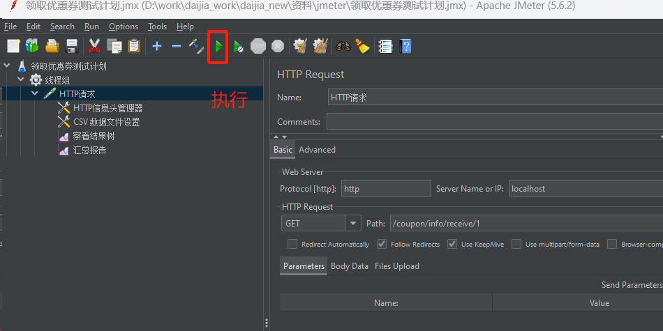

# 代驾：优惠券

## 一、优惠券领取

### 1、优惠券需求

#### 1.1、优惠券说明

优惠券是一种代驾服务的抵扣凭证，可用于打折或者现金优惠代驾服务的特色活动，可以让驾车人享受到更加方便快捷、经济实惠的代驾服务。

优惠券的难点在于如何设计优惠券规则，及并发超售问题，现在我们就着手开发这部分功能。

乘客端有优惠券频道，未使用、未领取及已使用三个菜单，在结束代驾服务后，乘客支付时可以选择一张满足条件的优惠券进行抵扣支付。


#### 1.2、优惠券数据库表

**优惠券表：**

优惠券规则设计表


关键字段说明：

​	1、优惠券类型，两种，现金卷与折扣券；现金卷对应金额为：amount字段，折扣卷对应折扣为：discount字段；

​	2、使用门槛，针对现金卷与折扣卷，0：无门槛； 大于0：如果5，即：订单金额大于5元才可以使用；

​	3、发行数量，最多领取的优惠券张数，如果是0，则无限制；

​	4、每人限领张数，即每个人最多领取多少张，不能超领，必须严格控制（并发超卖控制）；

​	5、领取数量，如果发行100，那么最多只能领取100张，必须严格控制（并发超卖控制）

表数据说明：

​	优惠券表已初始化一部分数据，大家也可以根据实际情况配置更多的数据。


**优惠券领取记录表：**

乘客领取后的记录信息关联表


### 2、未领取优惠券

平台发布了优惠券，乘客还未领取完的优惠券，这里需要注意一点，每人限领张数，有的优惠券只能领取1张，但是有的优惠券可以领取多张，这是该功能点的一个细节，也是考验sql的一个难道，需要大家注意。

#### 2.1、优惠券微服务接口

##### 2.1.1、CouponInfoController

```java
@Operation(summary = "查询未领取优惠券分页列表")
@GetMapping("findNoReceivePage/{customerId}/{page}/{limit}")
public Result<PageVo<NoReceiveCouponVo>> findNoReceivePage(
      @Parameter(name = "customerId", description = "乘客id", required = true)
      @PathVariable Long customerId,

      @Parameter(name = "page", description = "当前页码", required = true)
      @PathVariable Long page,

      @Parameter(name = "limit", description = "每页记录数", required = true)
      @PathVariable Long limit) {
   Page<CouponInfo> pageParam = new Page<>(page, limit);
   PageVo<NoReceiveCouponVo> pageVo = couponInfoService.findNoReceivePage(pageParam, customerId);
   pageVo.setPage(page);
   pageVo.setLimit(limit);
   return Result.ok(pageVo);
}
```

##### 2.1.2、CouponInfoService

```java
PageVo<NoReceiveCouponVo> findNoReceivePage(Page<CouponInfo> pageParam, Long customerId);
```

##### 2.1.3、CouponInfoServiceImpl

```java
@Override
public PageVo<NoReceiveCouponVo> findNoReceivePage(Page<CouponInfo> pageParam, Long customerId) {
    IPage<NoReceiveCouponVo> pageInfo = couponInfoMapper.findNoReceivePage(pageParam, customerId);
    return new PageVo(pageInfo.getRecords(), pageInfo.getPages(), pageInfo.getTotal());
}
```

##### 2.1.4、CouponInfoMapper

```java
IPage<NoReceiveCouponVo> findNoReceivePage(Page<CouponInfo> pageParam, @Param("customerId") Long customerId);
```

##### 2.1.5、CouponInfoMapper.xml

```xml
<select id="findNoReceivePage" resultType="com.atguigu.daijia.model.vo.coupon.NoReceiveCouponVo">
   select
      info.id,
      info.coupon_type,
      info.name,
      info.amount,
      info.discount,
      info.condition_amount,
      info.publish_count,
      info.per_limit,
      info.expire_time,
      info.description
   from coupon_info info
          left join (
      select coupon_id, customer_id, count(customer_id) cnt  from customer_coupon where customer_id = #{customerId}  group by coupon_id, customer_id
   ) cus_coup on cus_coup.coupon_id = info.id
   where
      info.status = 1
     and info.receive_count &lt; info.publish_count
     and (
            info.per_limit =0 or info.per_limit > cus_coup.cnt or cus_coup.cnt is null
      )
   order by info.id desc
</select>
```

#### 2.2、Feign接口

##### 2.2.1、CouponInfoFeignClient

```java
/**
 * 查询未领取优惠券分页列表
 * @param customerId
 * @param page
 * @param limit
 * @return
 */
@GetMapping("/coupon/info/findNoReceivePage/{customerId}/{page}/{limit}")
Result<PageVo<NoReceiveCouponVo>> findNoReceivePage(
        @PathVariable("customerId") Long customerId,
        @PathVariable("page") Long page,
        @PathVariable("limit") Long limit);
```

#### 2.3、乘客端web接口

##### 2.3.1、CouponController

```java
@Autowired
private CouponService couponService;

@Operation(summary = "查询未领取优惠券分页列表")
@GuiguLogin
@GetMapping("findNoReceivePage/{page}/{limit}")
public Result<PageVo<NoReceiveCouponVo>> findNoReceivePage(
      @Parameter(name = "page", description = "当前页码", required = true)
      @PathVariable Long page,

      @Parameter(name = "limit", description = "每页记录数", required = true)
      @PathVariable Long limit) {
   Long customerId = AuthContextHolder.getUserId();
   PageVo<NoReceiveCouponVo> pageVo = couponService.findNoReceivePage(customerId, page, limit);
   return Result.ok(pageVo);
}
```

##### 2.3.2、CouponService

```java
PageVo<NoReceiveCouponVo> findNoReceivePage(Long customerId, Long page, Long limit);
```

##### 2.3.3、CouponServiceImpl

```java
@Override
public PageVo<NoReceiveCouponVo> findNoReceivePage(Long customerId, Long page, Long limit) {
    return couponFeignClient.findNoReceivePage(customerId, page, limit).getData();
}
```


### 3、未使用优惠券

已经领取了，但是还没有使用的优惠券列表。

#### 3.1、优惠券微服务接口

##### 3.1.1、CouponInfoController

```java
@Operation(summary = "查询未使用优惠券分页列表")
@GetMapping("findNoUsePage/{customerId}/{page}/{limit}")
public Result<PageVo<NoUseCouponVo>> findNoUsePage(
      @Parameter(name = "customerId", description = "乘客id", required = true)
      @PathVariable Long customerId,

      @Parameter(name = "page", description = "当前页码", required = true)
      @PathVariable Long page,

      @Parameter(name = "limit", description = "每页记录数", required = true)
      @PathVariable Long limit) {
   Page<CouponInfo> pageParam = new Page<>(page, limit);
   PageVo<NoUseCouponVo> pageVo = couponInfoService.findNoUsePage(pageParam, customerId);
   pageVo.setPage(page);
   pageVo.setLimit(limit);
   return Result.ok(pageVo);
}
```

##### 3.1.2、CouponInfoService

```java
PageVo<NoUseCouponVo> findNoUsePage(Page<CouponInfo> pageParam, Long customerId);
```

##### 3.1.3、CouponInfoServiceImpl

```java
@Override
public PageVo<NoUseCouponVo> findNoUsePage(Page<CouponInfo> pageParam, Long customerId) {
    IPage<NoUseCouponVo> pageInfo = couponInfoMapper.findNoUsePage(pageParam, customerId);
    return new PageVo(pageInfo.getRecords(), pageInfo.getPages(), pageInfo.getTotal());
}
```

##### 3.1.4、CouponInfoMapper

```java
IPage<NoUseCouponVo> findNoUsePage(Page<CouponInfo> pageParam, @Param("customerId") Long customerId);
```

##### 3.1.5、CouponInfoMapper.xml

```xml
<select id="findNoUsePage" resultType="com.atguigu.daijia.model.vo.coupon.NoUseCouponVo">
   select
      info.id,
      info.coupon_type,
      info.name,
      info.amount,
      info.discount,
      info.condition_amount,
      info.publish_count,
      info.per_limit,
      info.expire_time,
      info.description,

      cstr.receive_time
   from coupon_info info
          inner join customer_coupon cstr on cstr.coupon_id = info.id
   where
      cstr.customer_id = #{customerId}
     and cstr.status = 1
     and cstr.expire_time > now()
   order by cstr.id desc
</select>
```

#### 3.2、Feign接口

##### 3.2.1、CouponInfoFeignClient

```java
/**
 * 查询未使用优惠券分页列表
 * @param customerId
 * @param page
 * @param limit
 * @return
 */
@GetMapping("/coupon/info/findNoUsePage/{customerId}/{page}/{limit}")
Result<PageVo<NoUseCouponVo>> findNoUsePage(
        @PathVariable("customerId") Long customerId,
        @PathVariable("page") Long page,
        @PathVariable("limit") Long limit);
```

#### 3.3、乘客端web接口

##### 3.3.1、CouponController

```java
@Operation(summary = "查询未使用优惠券分页列表")
@GuiguLogin
@GetMapping("findNoUsePage/{page}/{limit}")
public Result<PageVo<NoUseCouponVo>> findNoUsePage(
      @Parameter(name = "page", description = "当前页码", required = true)
      @PathVariable Long page,

      @Parameter(name = "limit", description = "每页记录数", required = true)
      @PathVariable Long limit) {
   Long customerId = AuthContextHolder.getUserId();
   PageVo<NoUseCouponVo> pageVo = couponService.findNoUsePage(customerId, page, limit);
   return Result.ok(pageVo);
}
```

##### 3.3.2、CouponService

```java
PageVo<NoUseCouponVo> findNoUsePage(Long customerId, Long page, Long limit);
```

##### 3.3.3、CouponServiceImpl

```java
@Override
public PageVo<NoUseCouponVo> findNoUsePage(Long customerId, Long page, Long limit) {
    return couponFeignClient.findNoUsePage(customerId, page, limit).getData();
}
```


### 4、已使用优惠券

已经领取了，但是也使用了的优惠券，这个也很好理解。

#### 4.1、优惠券微服务接口

##### 4.1.1、CouponInfoController

```java
@Operation(summary = "查询已使用优惠券分页列表")
@GetMapping("findUsedPage/{customerId}/{page}/{limit}")
public Result<PageVo<UsedCouponVo>> findUsedPage(
      @Parameter(name = "customerId", description = "乘客id", required = true)
      @PathVariable Long customerId,

      @Parameter(name = "page", description = "当前页码", required = true)
      @PathVariable Long page,

      @Parameter(name = "limit", description = "每页记录数", required = true)
      @PathVariable Long limit) {
   Page<CouponInfo> pageParam = new Page<>(page, limit);
   PageVo<UsedCouponVo> pageVo = couponInfoService.findUsedPage(pageParam, customerId);
   pageVo.setPage(page);
   pageVo.setLimit(limit);
   return Result.ok(pageVo);
}
```

##### 4.1.2、CouponInfoService

```java
PageVo<UsedCouponVo> findUsedPage(Page<CouponInfo> pageParam, Long customerId);
```

##### 4.1.3、CouponInfoServiceImpl

```java
@Override
public PageVo<UsedCouponVo> findUsedPage(Page<CouponInfo> pageParam, Long customerId) {
    IPage<UsedCouponVo> pageInfo = couponInfoMapper.findUsedPage(pageParam, customerId);
    return new PageVo(pageInfo.getRecords(), pageInfo.getPages(), pageInfo.getTotal());
}
```

##### 4.1.4、CouponInfoMapper

```java
IPage<UsedCouponVo> findUsedPage(Page<CouponInfo> pageParam, @Param("customerId") Long customerId);
```

##### 4.1.5、CouponInfoMapper.xml

```xml
<select id="findUsedPage" resultType="com.atguigu.daijia.model.vo.coupon.UsedCouponVo">
   select
      info.id,
      info.coupon_type,
      info.name,
      info.amount,
      info.discount,
      info.condition_amount,
      info.publish_count,
      info.per_limit,
      info.expire_time,
      info.description,

      cstr.id as customerCouponId,
      cstr.used_time
   from coupon_info info
          inner join customer_coupon cstr on cstr.coupon_id = info.id
   where
      cstr.customer_id = #{customerId}
     and cstr.status = 2
   order by cstr.id desc
</select>
```

#### 4.2、Feign接口

##### 4.2.1、CouponInfoFeignClient

```java
/**
 * 查询已使用优惠券分页列表
 * @param customerId
 * @param page
 * @param limit
 * @return
 */
@GetMapping("/coupon/info/findUsedPage/{customerId}/{page}/{limit}")
Result<PageVo<UsedCouponVo>> findUsedPage(
        @PathVariable("customerId") Long customerId,
        @PathVariable("page") Long page,
        @PathVariable("limit") Long limit);
```

#### 4.3、乘客端web接口

##### 4.3.1、CouponController

```java
@Operation(summary = "查询已使用优惠券分页列表")
@GuiguLogin
@GetMapping("findUsedPage/{page}/{limit}")
public Result<PageVo<UsedCouponVo>> findUsedPage(
      @Parameter(name = "page", description = "当前页码", required = true)
      @PathVariable Long page,

      @Parameter(name = "limit", description = "每页记录数", required = true)
      @PathVariable Long limit) {
   Long customerId = AuthContextHolder.getUserId();
   PageVo<UsedCouponVo> pageVo = couponService.findUsedPage(customerId, page, limit);
   return Result.ok(pageVo);
}
```

##### 4.3.2、CouponService

```java
PageVo<UsedCouponVo> findUsedPage(Long customerId, Long page, Long limit);
```

##### 4.3.3、CouponServiceImpl

```java
@Override
public PageVo<UsedCouponVo> findUsedPage(Long customerId, Long page, Long limit) {
    return couponFeignClient.findUsedPage(customerId, page, limit).getData();
}
```


### 5、领取优惠券

领取优惠券涉及并发超卖问题，如果定时推出一个优惠粒度大的优惠券，一旦优惠券推出后，可能吸引很多用户同时领取该优惠券，这样就会出现并发控制问题，下面我们逐步实现这部分功能。

#### 5.1、优惠券微服务接口

##### 5.1.1、CouponInfoController

```java
@Operation(summary = "领取优惠券")
@GetMapping("/receive/{customerId}/{couponId}")
public Result<Boolean> receive(@PathVariable Long customerId, @PathVariable Long couponId) {
   return Result.ok(couponInfoService.receive(customerId, couponId));
}
```

##### 5.1.2、CouponInfoService

```java
Boolean receive(Long customerId, Long couponId);
```

##### 5.1.3、CouponInfoServiceImpl

```java
 @Autowired
 private CustomerCouponMapper customerCouponMapper;

@Transactional(rollbackFor = Exception.class)
@Override
public Boolean receive(Long customerId, Long couponId) {
    //1、查询优惠券
    CouponInfo couponInfo = this.getById(couponId);
    if(null == couponInfo) {
        throw new GuiguException(ResultCodeEnum.DATA_ERROR);
    }

    //2、优惠券过期日期判断
    if (couponInfo.getExpireTime().before(new Date())) {
        throw new GuiguException(ResultCodeEnum.COUPON_EXPIRE);
    }

    //3、校验库存，优惠券领取数量判断
    if (couponInfo.getPublishCount() !=0 && couponInfo.getReceiveCount() >= couponInfo.getPublishCount()) {
        throw new GuiguException(ResultCodeEnum.COUPON_LESS);
    }

    //4、校验每人限领数量
    if (couponInfo.getPerLimit() > 0) {
        //4.1、统计当前用户对当前优惠券的已经领取的数量
        long count = customerCouponMapper.selectCount(new LambdaQueryWrapper<CustomerCoupon>().eq(CustomerCoupon::getCouponId, couponId).eq(CustomerCoupon::getCustomerId, customerId));
        //4.2、校验限领数量
        if (count >= couponInfo.getPerLimit()) {
            throw new GuiguException(ResultCodeEnum.COUPON_USER_LIMIT);
        }
    }

    //5、更新优惠券领取数量
    int row = couponInfoMapper.updateReceiveCount(couponId);
    if (row == 1) {
        //6、保存领取记录
        this.saveCustomerCoupon(customerId, couponId, couponInfo.getExpireTime());
        return true;
    }
    throw new GuiguException(ResultCodeEnum.COUPON_LESS);
}

private void saveCustomerCoupon(Long customerId, Long couponId, Date expireTime) {
    CustomerCoupon customerCoupon = new CustomerCoupon();
    customerCoupon.setCustomerId(customerId);
    customerCoupon.setCouponId(couponId);
    customerCoupon.setStatus(1);
    customerCoupon.setReceiveTime(new Date());
    customerCoupon.setExpireTime(expireTime);
    customerCouponMapper.insert(customerCoupon);
}
```

##### 5.1.4、CouponInfoMapper

```java
int updateReceiveCount(@Param("id") Long id);
```

##### 5.1.5、CouponInfoMapper.xml

```xml
<update id="updateReceiveCount">
   update coupon_info set receive_count = receive_count + 1 where id = #{id}
</update>
```

#### 5.2、Feign接口

##### 5.2.1、CouponInfoFeignClient

```java
/**
 * 领取优惠券
 * @param customerId
 * @param couponId
 * @return
 */
@GetMapping("/coupon/info/receive/{customerId}/{couponId}")
Result<Boolean> receive(@PathVariable("customerId") Long customerId, @PathVariable("couponId") Long couponId);
```

#### 5.3、乘客端web接口

##### 5.3.1、CouponController

```java
@Operation(summary = "领取优惠券")
@GuiguLogin
@GetMapping("/receive/{couponId}")
public Result<Boolean> receive(@PathVariable Long couponId) {
   Long customerId = AuthContextHolder.getUserId();
   return Result.ok(couponService.receive(customerId, couponId));
}
```

##### 5.3.2、CouponService

```java
Boolean receive(Long customerId, Long couponId);
```

##### 5.3.3、CouponServiceImpl

```java
@Override
public Boolean receive(Long customerId, Long couponId) {
    return couponFeignClient.receive(customerId, couponId).getData();
}
```


### 6、并发问题解决

#### 6.1、并发测试

通过乘客端小程序领取，我们没有发现什么问题。

要知道领券的过程中有大量的校验，这些校验逻辑在高并发的场景下很容易出现问题。因此，我们必须对领券功能做并发测试，看看是否会出现并发安全问题。

并发测试，比较常见的一种工具就是 Jemeter 了，我们在资料中以提供，直接使用：


同时，我们也提供了一个《领取优惠券测试计划.jmx》文件，里面配置了一份测试脚本，将其导入 Jemeter 中，直接使用即可。


为了模拟并发领取，需要指定 多个乘客用户，我们把乘客用户id放到了《customerId.txt》文件中，模拟测试。


Jemeter 模拟乘客用户id，是通过http的header头传递到服务器端的，因此，我们需要调整一下controller接口，只用于测试使用。


**CouponInfoController**

```java
@Operation(summary = "领取优惠券")
@GetMapping("/receive/{couponId}")
public Result<Boolean> receive1(@RequestHeader("customerId") Long customerId, @PathVariable Long couponId) {

   return Result.ok(couponInfoService.receive(customerId, couponId));
}
```

启动service-coupon微服务

执行Jemeter ：



查看数据表数据：


领取数量：108，超领了！！！

#### 6.2、分析原因

并发问题出现的点：

​	第一：每人限领数量，同一张优惠券每人限领的数量不能超

​	第二：发现数量，总的领取的数量不能大于发行数量

下面我们就来分析一下

##### 6.2.1、限领数量没限制、发行数量没限制

无并发问题


##### 6.2.2、限领数量没限制、发行数量有限制

存在并发问题

**问题分析：**


多线程并行运行，上面的判断与更新领取数据不具有原子性，因此会超领。

**解决方案：**

针对并发安全问题，最广为人知的解决方案就是**加锁**。不过，加锁的方式多种多样，大家熟悉的 Synchronized、ReentrantLock 只是其中最基础的锁。

今天先不讨论具体的锁的实现方式，而是讲讲加锁的思想。从实现思想上来说，锁可以分为两大类：

- 悲观锁
- 乐观锁

何为悲观锁？

> 悲观锁是一种独占和排他的锁机制，保守地认为数据会被其他事务修改，所以在整个数据处理过程中将数据处于锁定状态。

何为乐观锁？

> 乐观锁是一种较为乐观的并发控制方法，假设多用户并发的不会产生安全问题，因此无需独占和锁定资源。但在更新数据前，会先检查是否有其他线程修改了该数据，如果有，则认为可能有风险，会放弃修改操作

可见，悲观锁、乐观锁是对并发安全问题的处理态度不同：

- 悲观锁认为安全问题一定会发生，所以直接独占资源。结果就是多个线程会串行执行被保护的代码。
  - 优点：安全性非常高
  - 缺点：性能较差
- 乐观锁则认为安全问题不一定发生，所以不独占资源。结果就是允许多线程并行执行。但如果真的发生并发修改怎么办？乐观锁采用 CAS（Compare And Set）思想，在更新数据前先判断数据与我之前查询到的是否一致，不一致则证明有其它线程也在更新。为了避免出现安全问题，放弃本次更新或者重新尝试一次。
  - 优点：性能好、安全性也好
  - 缺点：并发较高时，可能出现更新成功率较低的问题（并行的 N 个线程只会有 1 个成功）

针对上面的介绍，我们发现当前这种场景使用**乐观锁**即可解决问题。

更新领取数量，原sql：

```sql
update coupon_info set receive_count = receive_count + 1 where id = #{id}
```

修改后的sql：

```sql
update coupon_info set receive_count = receive_count + 1 where id = #{id} and receive_count < publish_count
```

如果更新失败了，返回row=0，则说明优惠券领取完了

恢复数据库数据，再次执行Jemeter ，结果领取数据为100，未超领。


##### 6.2.3、限领数量有限制、发行数量没限制

存在并发问题

**问题分析：**


还是一样的问题，先统计判断，再插入，不具有原子性，这个问题怎么解决？

**解决方案：**

是不是跟上一个场景一样，使用乐观锁解决？

显然不行，因为乐观锁常用在更新上面，因此新增时无法基于乐观锁做判断。

所以，这里只能采用悲观锁方案，也就是大家熟悉的 Synchronized 或者 Lock，但是 Synchronized 或者 Lock它们是本地锁，我们是微服务项目，因此要使用分布式锁。我们直接使用Redisson加锁。

**锁的粒度呢？当然是粒度越小并发越大，因此我们只需要针对乘客id加锁即可。**


##### 6.2.4、限领数量有限制、发行数量有限制

存在并发问题

上面已经分析过了

**解决方案：**

乐观锁 + 分布式锁（悲观锁）


#### 6.3、代码优化

##### 6.3.1、CouponInfoMapper

```java
int updateReceiveCountByLimit(@Param("id") Long id);
```

##### 6.3.2、CouponInfoMapper.xml

```xml
<update id="updateReceiveCountByLimit">
   update coupon_info set receive_count = receive_count + 1 where id = #{id} and receive_count &lt; publish_count
</update>
```

##### 6.3.3、CouponInfoServiceImpl

```java
@Transactional(rollbackFor = Exception.class)
@Override
public Boolean receive(Long customerId, Long couponId) {
    //1、查询优惠券
    CouponInfo couponInfo = this.getById(couponId);
    if(null == couponInfo) {
        throw new GuiguException(ResultCodeEnum.DATA_ERROR);
    }

    //2、优惠券过期日期判断
    if (couponInfo.getExpireTime().before(new Date())) {
        throw new GuiguException(ResultCodeEnum.COUPON_EXPIRE);
    }

    //3、校验库存，优惠券领取数量判断
    if (couponInfo.getPublishCount() !=0 && couponInfo.getReceiveCount() >= couponInfo.getPublishCount()) {
        throw new GuiguException(ResultCodeEnum.COUPON_LESS);
    }

    RLock lock = null;
    try {
        // 初始化分布式锁
        //每人领取限制  与 优惠券发行总数 必须保证原子性，使用customerId减少锁的粒度，增加并发能力
        lock = redissonClient.getLock(RedisConstant.COUPON_LOCK + customerId);
        boolean flag = lock.tryLock(RedisConstant.COUPON_LOCK_WAIT_TIME, RedisConstant.COUPON_LOCK_LEASE_TIME, TimeUnit.SECONDS);
        if (flag) {
            //4、校验每人限领数量
            if (couponInfo.getPerLimit() > 0) {
                //4.1、统计当前用户对当前优惠券的已经领取的数量
                long count = customerCouponMapper.selectCount(new LambdaQueryWrapper<CustomerCoupon>().eq(CustomerCoupon::getCouponId, couponId).eq(CustomerCoupon::getCustomerId, customerId));
                //4.2、校验限领数量
                if (count >= couponInfo.getPerLimit()) {
                    throw new GuiguException(ResultCodeEnum.COUPON_USER_LIMIT);
                }
            }

            //5、更新优惠券领取数量
            int row = 0;
            if (couponInfo.getPublishCount() == 0) {//没有限制
                row = couponInfoMapper.updateReceiveCount(couponId);
            } else {
                row = couponInfoMapper.updateReceiveCountByLimit(couponId);
            }
            if (row == 1) {
                //6、保存领取记录
                this.saveCustomerCoupon(customerId, couponId, couponInfo.getExpireTime());
                return true;
            }
        }
    } catch (Exception e) {
        e.printStackTrace();
    } finally {
        if (null != lock) {
            lock.unlock();
        }
    }
    throw new GuiguException(ResultCodeEnum.COUPON_LESS);
}
```


## 二、优惠券使用

优惠券使用如图：


### 1、获取未使用的最佳优惠券信息

乘客支付时，可根据订单金额，搜索满足条件的已领取未使用的优惠券列表，默认选中优惠最大金额优惠券，作为支付时抵扣的金额，只能选择一张，用户也可切换其他优惠券（不做限制）

说明：一个订单未支付前只能选择一次，第一次选中后放弃支付，下一次支付默认使用第一次选中的优惠券。

#### 1.1、优惠券微服务接口

##### 1.1.1、CouponInfoController

```java
@Operation(summary = "获取未使用的最佳优惠券信息")
@GetMapping("/findAvailableCoupon/{customerId}/{orderAmount}")
public Result<List<AvailableCouponVo>> findAvailableCoupon(@PathVariable Long customerId, @PathVariable BigDecimal orderAmount) {
   return Result.ok(couponInfoService.findAvailableCoupon(customerId, orderAmount));
}
```

##### 1.1.2、CouponInfoService

```java
List<AvailableCouponVo> findAvailableCoupon(Long customerId, BigDecimal orderAmount);
```

##### 1.1.3、CouponInfoServiceImpl

```java
@Override
public List<AvailableCouponVo> findAvailableCoupon(Long customerId, BigDecimal orderAmount) {
    //1.定义符合条件的优惠券信息容器
    List<AvailableCouponVo> availableCouponVoList = new ArrayList<>();

    //2.获取未使用的优惠券列表
    List<NoUseCouponVo> list = couponInfoMapper.findNoUseList(customerId);
    //2.1.现金券
    List<NoUseCouponVo> type1List = list.stream().filter(item -> item.getCouponType().intValue() == 1).collect(Collectors.toList());
    for (NoUseCouponVo noUseCouponVo : type1List) {
        //使用门槛判断
        //2.1.1.没门槛，订单金额必须大于优惠券减免金额
        //减免金额
        BigDecimal reduceAmount = noUseCouponVo.getAmount();
        if (noUseCouponVo.getConditionAmount().doubleValue() == 0 && orderAmount.subtract(reduceAmount).doubleValue() > 0) {
            availableCouponVoList.add(this.buildBestNoUseCouponVo(noUseCouponVo, reduceAmount));
        }
        //2.1.2.有门槛，订单金额大于优惠券门槛金额
        if (noUseCouponVo.getConditionAmount().doubleValue() > 0 && orderAmount.subtract(noUseCouponVo.getConditionAmount()).doubleValue() > 0) {
            availableCouponVoList.add(this.buildBestNoUseCouponVo(noUseCouponVo, reduceAmount));
        }
    }

    //2.2.折扣券
    List<NoUseCouponVo> type2List = list.stream().filter(item -> item.getCouponType().intValue() == 2).collect(Collectors.toList());
    for (NoUseCouponVo noUseCouponVo : type2List) {
        //使用门槛判断
        //订单折扣后金额
        BigDecimal discountOrderAmount = orderAmount.multiply(noUseCouponVo.getDiscount()).divide(new BigDecimal("10")).setScale(2, RoundingMode.HALF_UP);
        //减免金额
        BigDecimal reduceAmount = orderAmount.subtract(discountOrderAmount);
        //订单优惠金额
        //2.2.1.没门槛
        if (noUseCouponVo.getConditionAmount().doubleValue() == 0) {
            availableCouponVoList.add(this.buildBestNoUseCouponVo(noUseCouponVo, reduceAmount));
        }
        //2.2.2.有门槛，订单折扣后金额大于优惠券门槛金额
        if (noUseCouponVo.getConditionAmount().doubleValue() > 0 && discountOrderAmount.subtract(noUseCouponVo.getConditionAmount()).doubleValue() > 0) {
            availableCouponVoList.add(this.buildBestNoUseCouponVo(noUseCouponVo, reduceAmount));
        }
    }

    //排序
    if (!CollectionUtils.isEmpty(availableCouponVoList)) {
        Collections.sort(availableCouponVoList, new Comparator<AvailableCouponVo>() {
            @Override
            public int compare(AvailableCouponVo o1, AvailableCouponVo o2) {
                return o1.getReduceAmount().compareTo(o2.getReduceAmount());
            }
        });
    }
    return availableCouponVoList;
}

private AvailableCouponVo buildBestNoUseCouponVo(NoUseCouponVo noUseCouponVo, BigDecimal reduceAmount) {
    AvailableCouponVo bestNoUseCouponVo = new AvailableCouponVo();
    BeanUtils.copyProperties(noUseCouponVo, bestNoUseCouponVo);
    bestNoUseCouponVo.setCouponId(noUseCouponVo.getId());
    bestNoUseCouponVo.setReduceAmount(reduceAmount);
    return bestNoUseCouponVo;
}
```

##### 1.1.4、CouponInfoMapper

```java
List<NoUseCouponVo> findNoUseList(@Param("customerId") Long customerId);
```

##### 1.1.5、CouponInfoMapper.xml

```xml
<select id="findNoUseList" resultType="com.atguigu.daijia.model.vo.coupon.NoUseCouponVo">
   select
      info.id,
      info.coupon_type,
      info.name,
      info.amount,
      info.discount,
      info.condition_amount,
      info.publish_count,
      info.per_limit,
      info.expire_time,
      info.description,

      cstr.id as customerCouponId,
      cstr.receive_time
   from coupon_info info
          inner join customer_coupon cstr on cstr.coupon_id = info.id
   where
      cstr.customer_id = #{customerId}
     and cstr.status = 1
     and cstr.expire_time > now()
   order by cstr.id desc
</select>
```

#### 1.2、Feign接口

##### 1.2.1、CouponInfoFeignClient

```java
/**
 * 获取未使用的最佳优惠券信息
 * @param customerId
 * @param orderAmount
 * @return
 */
@GetMapping("/coupon/info/findAvailableCoupon/{customerId}/{orderAmount}")
Result<List<AvailableCouponVo>> findAvailableCoupon(@PathVariable("customerId") Long customerId, @PathVariable("orderAmount") BigDecimal orderAmount);
```

#### 1.3、乘客端web接口

##### 1.3.1、CouponController

```java
@Operation(summary = "获取未使用的最佳优惠券信息")
@GuiguLogin
@GetMapping("/findAvailableCoupon/{orderId}")
public Result<List<AvailableCouponVo>> findAvailableCoupon(@PathVariable Long orderId) {
   Long customerId = AuthContextHolder.getUserId();
   return Result.ok(couponService.findAvailableCoupon(customerId, orderId));
}
```

##### 1.3.2、CouponService

```java
List<AvailableCouponVo> findAvailableCoupon(Long customerId, Long orderId);
```

##### 1.3.3、CouponServiceImpl

```java
@Autowired
private OrderInfoFeignClient orderInfoFeignClient;

@Override
public List<AvailableCouponVo> findAvailableCoupon(Long customerId, Long orderId) {
   OrderBillVo orderBillVo = orderInfoFeignClient.getOrderBillInfo(orderId).getData();
   return couponFeignClient.findAvailableCoupon(customerId, orderBillVo.getPayAmount()).getData();
}
```


### 2、使用优惠券

在支付使用优惠券前，我们先要完成2个接口，一个使用优惠券接口，一个更新订单优惠券金额接口

#### 2.1、优惠券微服务接口

##### 2.1.1、CouponInfoController

```java
@Operation(summary = "使用优惠券")
@PostMapping("/useCoupon")
public Result<BigDecimal> useCoupon(@RequestBody UseCouponForm useCouponForm) {
   return Result.ok(couponInfoService.useCoupon(useCouponForm));
}
```

##### 2.1.2、CouponInfoService

```java
BigDecimal useCoupon(UseCouponForm useCouponForm);
```

##### 2.1.3、CouponInfoServiceImpl

使用优惠券，同样要判断优惠券使用规则。

```java
@Transactional(noRollbackFor = Exception.class)
@Override
public BigDecimal useCoupon(UseCouponForm useCouponForm) {
    //获取乘客优惠券
    CustomerCoupon customerCoupon = customerCouponMapper.selectById(useCouponForm.getCustomerCouponId());
    if(null == customerCoupon) {
        throw new GuiguException(ResultCodeEnum.ARGUMENT_VALID_ERROR);
    }
    //获取优惠券信息
    CouponInfo couponInfo = couponInfoMapper.selectById(customerCoupon.getCouponId());
    if(null == couponInfo) {
        throw new GuiguException(ResultCodeEnum.ARGUMENT_VALID_ERROR);
    }
    //判断该优惠券是否为乘客所有
    if(customerCoupon.getCustomerId().longValue() != useCouponForm.getCustomerId().longValue()) {
        throw new GuiguException(ResultCodeEnum.ILLEGAL_REQUEST);
    }
    //获取优惠券减免金额
    BigDecimal reduceAmount = null;
    if(couponInfo.getCouponType().intValue() == 1) {
        //使用门槛判断
        //2.1.1.没门槛，订单金额必须大于优惠券减免金额
        if (couponInfo.getConditionAmount().doubleValue() == 0 && useCouponForm.getOrderAmount().subtract(couponInfo.getAmount()).doubleValue() > 0) {
            //减免金额
            reduceAmount = couponInfo.getAmount();
        }
        //2.1.2.有门槛，订单金额大于优惠券门槛金额
        if (couponInfo.getConditionAmount().doubleValue() > 0 && useCouponForm.getOrderAmount().subtract(couponInfo.getConditionAmount()).doubleValue() > 0) {
            //减免金额
            reduceAmount = couponInfo.getAmount();
        }
    } else {
        //使用门槛判断
        //订单折扣后金额
        BigDecimal discountOrderAmount = useCouponForm.getOrderAmount().multiply(couponInfo.getDiscount()).divide(new BigDecimal("10")).setScale(2, RoundingMode.HALF_UP);
        //订单优惠金额
        //2.2.1.没门槛
        if (couponInfo.getConditionAmount().doubleValue() == 0) {
            //减免金额
            reduceAmount = useCouponForm.getOrderAmount().subtract(discountOrderAmount);
        }
        //2.2.2.有门槛，订单折扣后金额大于优惠券门槛金额
        if (couponInfo.getConditionAmount().doubleValue() > 0 && discountOrderAmount.subtract(couponInfo.getConditionAmount()).doubleValue() > 0) {
            //减免金额
            reduceAmount = useCouponForm.getOrderAmount().subtract(discountOrderAmount);
        }
    }
    if(reduceAmount.doubleValue() > 0) {
        int row = couponInfoMapper.updateUseCount(couponInfo.getId());
        if(row == 1) {
            CustomerCoupon updateCustomerCoupon = new CustomerCoupon();
            updateCustomerCoupon.setId(customerCoupon.getId());
            updateCustomerCoupon.setUsedTime(new Date());
            updateCustomerCoupon.setOrderId(useCouponForm.getOrderId());
            customerCouponMapper.updateById(updateCustomerCoupon);
            return reduceAmount;
        }
    }
    throw new GuiguException(ResultCodeEnum.DATA_ERROR);
}
```

##### 2.1.4、CouponInfoMapper

```java
int updateUseCount(@Param("id") Long id);
```

##### 2.1.5、CouponInfoMapper.xml

```xml
<update id="updateUseCount">
   update coupon_info set use_count = use_count + 1 where id = #{id}
</update>
```

#### 2.2、Feign接口

##### 2.2.1、CouponInfoFeignClient

```java
/**
 * 使用优惠券
 * @param useCouponForm
 * @return
 */
@PostMapping("/coupon/info/useCoupon")
Result<BigDecimal> useCoupon(@RequestBody UseCouponForm useCouponForm);
```


### 3、更新订单优惠券金额

#### 3.1、订单微服务接口

##### 3.1.1、OrderInfoController

```java
@Operation(summary = "更新订单优惠券金额")
@GetMapping("/updateCouponAmount/{orderId}/{couponAmount}")
public Result<Boolean> updateCouponAmount(@PathVariable Long orderId, @PathVariable BigDecimal couponAmount) {
   return Result.ok(orderInfoService.updateCouponAmount(orderId, couponAmount));
}
```

##### 3.1.2、OrderInfoService

```java
Boolean updateCouponAmount(Long orderId, BigDecimal couponAmount);
```

##### 3.1.3、OrderInfoServiceImpl

```java
@Transactional(rollbackFor = Exception.class)
@Override
public Boolean updateCouponAmount(Long orderId, BigDecimal couponAmount) {
   int row = orderBillMapper.updateCouponAmount(orderId, couponAmount);
    if(row != 1) {
      throw new GuiguException(ResultCodeEnum.UPDATE_ERROR);
   }
   return true;
}
```

##### 3.1.4、OrderBillMapper

```java
int updateCouponAmount(@Param("orderId") Long orderId, @Param("couponAmount") BigDecimal couponAmount);
```

##### 3.1.5、OrderBillMapper.xml

```xml
<update id="updateCouponAmount">
    update order_bill set coupon_amount = #{couponAmount}, pay_amount = pay_amount - #{couponAmount} where order_id = #{orderId}
</update>
```

#### 3.2、Feign接口

##### 3.2.1、OrderInfoFeignClient

```java
/**
 * 更新优惠券金额
 * @param orderId
 * @param couponAmount
 * @return
 */
@GetMapping("/order/info/updateCouponAmount/{orderId}/{couponAmount}")
Result<Boolean> updateCouponAmount(@PathVariable Long orderId, @PathVariable BigDecimal couponAmount);
```

### 4、乘客端支付改造

改造乘客端web接口：“创建微信支付”接口

#### 4.1、OrderServiceImpl

关键代码：


完整代码：

```java
@Override
public WxPrepayVo createWxPayment(CreateWxPaymentForm createWxPaymentForm) {
    //1.获取订单支付相关信息
    OrderPayVo orderPayVo = orderInfoFeignClient.getOrderPayVo(createWxPaymentForm.getOrderNo(), createWxPaymentForm.getCustomerId()).getData();
    //判断是否在未支付状态
    if (orderPayVo.getStatus().intValue() != OrderStatus.UNPAID.getStatus().intValue()) {
        throw new GuiguException(ResultCodeEnum.ILLEGAL_REQUEST);
    }

    //2.获取乘客微信openId
    String customerOpenId = customerInfoFeignClient.getCustomerOpenId(orderPayVo.getCustomerId()).getData();

    //3.获取司机微信openId
    String driverOpenId = driverInfoFeignClient.getDriverOpenId(orderPayVo.getDriverId()).getData();

    //4.处理优惠券
    BigDecimal couponAmount = null;
    //支付时选择过一次优惠券，如果支付失败或未支付，下次支付时不能再次选择，只能使用第一次选中的优惠券（前端已控制，后端再次校验）
    if (null == orderPayVo.getCouponAmount() && null != createWxPaymentForm.getCustomerCouponId() && createWxPaymentForm.getCustomerCouponId() != 0) {
        UseCouponForm useCouponForm = new UseCouponForm();
        useCouponForm.setOrderId(orderPayVo.getOrderId());
        useCouponForm.setCustomerCouponId(createWxPaymentForm.getCustomerCouponId());
        useCouponForm.setOrderAmount(orderPayVo.getPayAmount());
        useCouponForm.setCustomerId(createWxPaymentForm.getCustomerId());
        couponAmount = couponFeignClient.useCoupon(useCouponForm).getData();
    }

    //5.更新账单优惠券金额
    //支付金额
    BigDecimal payAmount = orderPayVo.getPayAmount();
    if (null != couponAmount) {
        Boolean isUpdate = orderInfoFeignClient.updateCouponAmount(orderPayVo.getOrderId(), couponAmount).getData();
        if (!isUpdate) {
            throw new GuiguException(ResultCodeEnum.DATA_ERROR);
        }
        //当前支付金额 = 支付金额 - 优惠券金额
        payAmount = payAmount.subtract(couponAmount);
    }

    //6.封装微信下单对象，微信支付只关注以下订单属性
    PaymentInfoForm paymentInfoForm = new PaymentInfoForm();
    paymentInfoForm.setCustomerOpenId(customerOpenId);
    paymentInfoForm.setDriverOpenId(driverOpenId);
    paymentInfoForm.setOrderNo(orderPayVo.getOrderNo());
    paymentInfoForm.setAmount(payAmount);
    paymentInfoForm.setContent(orderPayVo.getContent());
    paymentInfoForm.setPayWay(1);
    WxPrepayVo wxPrepayVo = wxPayFeignClient.createWxPayment(paymentInfoForm).getData();
    return wxPrepayVo;
}
```

#### 4.2、添加分布式事务

如果乘客选择了优惠券抵扣，那么涉及订单微服务、优惠券微服务与支付微服务，都设计更新操作，因此我们要加Seata控制。

实现过程和之前订单支付后处理类似，自行完成即可！