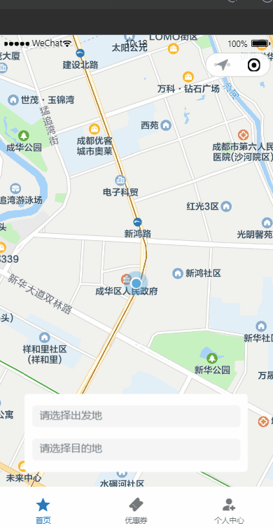
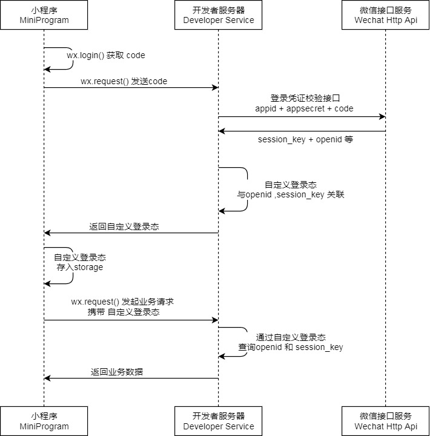
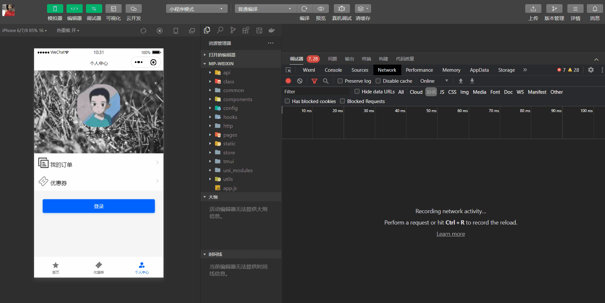
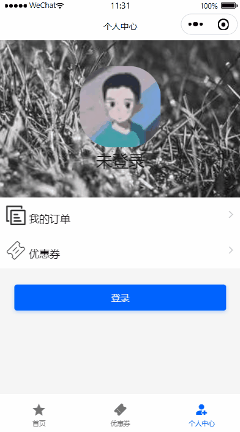

# 代驾：乘客端登录

## 一、乘客端

**学习目标：**

- 完成乘客端微信授权登录
- 掌握登录校验AOP拦截，处理当前用户信息
- 完成获取当前用户登录信息
- 完成获取微信手机号码

### 1、乘客登录

#### 1.1、需求说明

乘客端只要登录，没有注册，登录方式为微信小程序登录，乘客登录我们根据微信接口拿到微信OpenId（全局唯一），到客户表（客户即乘客）查询OpenId是否存在，如果不存在即为注册，添加一天乘客记录；存在则根据用户信息生成token返回。



#### 1.2、微信授权登录

官方文档：https://developers.weixin.qq.com/miniprogram/dev/framework/open-ability/login.html

小程序可以通过微信官方提供的登录能力方便地获取微信提供的用户身份标识，快速建立小程序内的用户体系。

##### 1.2.1、登录流程时序



说明：

1. 调用 [wx.login()](https://developers.weixin.qq.com/miniprogram/dev/api/open-api/login/wx.login.html) 获取 **临时登录凭证code** ，并回传到开发者服务器。
2. 调用 [auth.code2Session](https://developers.weixin.qq.com/miniprogram/dev/OpenApiDoc/user-login/code2Session.html) 接口，换取 **用户唯一标识 OpenID** 、 用户在微信开放平台账号下的**唯一标识UnionID**（若当前小程序已绑定到微信开放平台账号） 和 **会话密钥 session_key**。

之后开发者服务器可以根据用户标识来生成自定义登录态，用于后续业务逻辑中前后端交互时识别用户身份。

##### 1.2.2、小程序端

官方文档：https://developers.weixin.qq.com/miniprogram/dev/api/open-api/login/wx.login.html

wx.login(Object object)调用接口获取登录凭证（code）。通过凭证进而换取用户登录态信息，包括用户在当前小程序的唯一标识（openid）

详情见官方文档

##### 1.2.3、服务器端

官方文档：https://developers.weixin.qq.com/miniprogram/dev/OpenApiDoc/user-login/code2Session.html

登录凭证校验。通过 wx.login 接口获得临时登录凭证 code 后传到开发者服务器调用此接口完成登录流程。

详情见官方文档

##### 1.2.4、微信Java开发工具包

文档：https://gitee.com/binary/weixin-java-tools

微信`Java`开发工具包，支持包括微信支付、开放平台、公众号、企业微信/企业号、小程序等微信功能模块的后端开发。

微信小程序：`weixin-java-miniapp`

```xml
<dependency>
    <groupId>com.github.binarywang</groupId>
    <artifactId>weixin-java-miniapp</artifactId>
    <version>4.5.5.B</version>
</dependency>
```


#### 1.3、乘客登录微服务接口

操作模块：service-customer

##### 1.3.1、pom.xml

引入依赖

```xml
<dependency>
    <groupId>com.github.binarywang</groupId>
    <artifactId>weixin-java-miniapp</artifactId>
</dependency>
```

说明：在父工程已经对改依赖进行了版本管理，这里直接引入即可

##### 1.3.2、common-account.yaml

第三方账号加到公共账号配置文件里面

```yaml
wx:
  miniapp:
    #小程序授权登录
    appId: wxcc651fcbab275e33  # 小程序微信公众平台appId
    secret: 5f353399a2eae7ff6ceda383e924c5f6  # 小程序微信公众平台api秘钥
```

##### 1.3.3、WxMaProperties

```java
package com.atguigu.daijia.customer.config;

import lombok.Data;
import org.springframework.boot.context.properties.ConfigurationProperties;
import org.springframework.stereotype.Component;

@Data
@Component
@ConfigurationProperties(prefix = "wx.miniapp")
public class WxMaProperties {

    private String appId;
    private String secret;
}
```

##### 1.3.4、WxMaConfig

配置WxMaService，通过WxMaService可以快速获取微信OpenId

```java
package com.atguigu.daijia.customer.config;

import cn.binarywang.wx.miniapp.api.WxMaService;
import cn.binarywang.wx.miniapp.api.impl.WxMaServiceImpl;
import cn.binarywang.wx.miniapp.config.impl.WxMaDefaultConfigImpl;
import org.springframework.beans.factory.annotation.Autowired;
import org.springframework.context.annotation.Bean;
import org.springframework.stereotype.Component;

@Component
public class WxMaConfig {

    @Autowired
    private WxMaProperties wxMaProperties;

    @Bean
    public WxMaService wxMaService() {
        WxMaDefaultConfigImpl config = new WxMaDefaultConfigImpl();
        config.setAppid(wxMaProperties.getAppId());
        config.setSecret(wxMaProperties.getSecret());

        WxMaService service = new WxMaServiceImpl();
        service.setWxMaConfig(config);
        return service;
    }
}
```

##### 1.3.5、CustomerInfoController

```java
@Operation(summary = "小程序授权登录")
@GetMapping("/login/{code}")
public Result<Long> login(@PathVariable String code) {
   return Result.ok(customerInfoService.login(code));
}
```

##### 1.3.6、CustomerInfoService

```java
Long login(String code);
```

##### 1.3.7、CustomerInfoServiceImpl

```java
@Autowired
private WxMaService wxMaService;

@Autowired
private CustomerLoginLogMapper customerLoginLogMapper;

/**
 * 条件：
 *      1、前端开发者appid与服务器端appid一致
 *      2、前端开发者必须加入开发者
 * @param code
 * @return
 */
@Transactional(rollbackFor = {Exception.class})
@Override
public Long login(String code) {
   String openId = null;
   try {
      //获取openId
      WxMaJscode2SessionResult sessionInfo = wxMaService.getUserService().getSessionInfo(code);
      openId = sessionInfo.getOpenid();
      log.info("【小程序授权】openId={}", openId);
   } catch (Exception e) {
       e.printStackTrace();
      throw new GuiguException(ResultCodeEnum.WX_CODE_ERROR);
   }

   CustomerInfo customerInfo = this.getOne(new LambdaQueryWrapper<CustomerInfo>().eq(CustomerInfo::getWxOpenId, openId));
   if(null == customerInfo) {
      customerInfo = new CustomerInfo();
      customerInfo.setNickname(String.valueOf(System.currentTimeMillis()));
      customerInfo.setAvatarUrl("https://oss.aliyuncs.com/aliyun_id_photo_bucket/default_handsome.jpg");
      customerInfo.setWxOpenId(openId);
      this.save(customerInfo);
   }
    
   //登录日志
   CustomerLoginLog customerLoginLog = new CustomerLoginLog();
   customerLoginLog.setCustomerId(customerInfo.getId());
   customerLoginLog.setMsg("小程序登录");
   customerLoginLogMapper.insert(customerLoginLog);
   return customerInfo.getId();
}
```

#### 1.4、Feign接口

##### 1.4.1、CustomerInfoFeignClient

```java
/**
 * 小程序授权登录
 * @param code
 * @return
 */
@GetMapping("/customer/info/login/{code}")
Result<Long> login(@PathVariable String code);
```

#### 1.5、乘客端Web接口

##### 1.5.1、CustomerController

```java
@Autowired
private CustomerService customerInfoService;

@Operation(summary = "小程序授权登录")
@GetMapping("/login/{code}")
public Result<String> wxLogin(@PathVariable String code) {
   return Result.ok(customerInfoService.login(code));
}
```

##### 1.5.2、CustomerService

```java
String login(String code);
```

##### 1.5.3、CustomerServiceImpl

```java
@Autowired
private CustomerInfoFeignClient customerInfoFeignClient;

@Autowired
private RedisTemplate redisTemplate;

@Override
public String login(String code) {
   //获取openId
   Result<Long> result = customerInfoFeignClient.login(code);
   if(result.getCode().intValue() != 200) {
      throw new GuiguException(result.getCode(), result.getMessage());
   }
   Long customerId = result.getData();
   if(null == customerId) {
      throw new GuiguException(ResultCodeEnum.DATA_ERROR);
   }

   String token = UUID.randomUUID().toString().replaceAll("-", "");
   redisTemplate.opsForValue().set(RedisConstant.USER_LOGIN_KEY_PREFIX+token, customerId.toString(), RedisConstant.USER_LOGIN_KEY_TIMEOUT, TimeUnit.SECONDS);
   return token;
}
```

#### 1.6、小程序测试

启动：server-gateway、web-customer、service-customer

测试效果：



测试结果：微信授权登录接口已经能够正常返回登录toekn，但是页面没有调整，是这样的，登录成功后，小程序又请求了一个获取当前登录用户信息接口，只要这个接口请求成功了它才会跳转页面。


### 2、获取客户登录信息

乘客登录成功，小程序会回调“获取客户登录信息”接口，获取当前乘客基本信息

#### 2.1、微服务接口

##### 2.1.1、CustomerInfoController

```java
@Operation(summary = "获取客户登录信息")
@GetMapping("/getCustomerLoginInfo/{customerId}")
public Result<CustomerLoginVo> getCustomerLoginInfo(@PathVariable Long customerId) {
    return Result.ok(customerInfoService.getCustomerLoginInfo(customerId));
}
```

##### 2.1.2、CustomerInfoService

```java
CustomerLoginVo getCustomerLoginInfo(Long customerId);
```

##### 2.1.3、CustomerInfoServiceImpl

```java
@Override
public CustomerLoginVo getCustomerLoginInfo(Long customerId) {
   CustomerInfo customerInfo = this.getById(customerId);
   CustomerLoginVo customerInfoVo = new CustomerLoginVo();
   BeanUtils.copyProperties(customerInfo, customerInfoVo);
   //判断是否绑定手机号码，如果未绑定，小程序端发起绑定事件
   Boolean isBindPhone = StringUtils.hasText(customerInfo.getPhone());
   customerInfoVo.setIsBindPhone(isBindPhone);
   return customerInfoVo;
}
```

#### 2.2、Feign接口

##### 2.2.1、CustomerInfoFeignClient

```java
/**
 * 获取客户登录信息
 * @param customerId
 * @return
 */
@GetMapping("/customer/info/getCustomerLoginInfo/{customerId}")
Result<CustomerLoginVo> getCustomerLoginInfo(@PathVariable("customerId") Long customerId);
```

#### 2.3、乘客端Web接口

##### 2.3.1、CustomerController

```java
@Autowired
private RedisTemplate redisTemplate;

@Operation(summary = "获取客户登录信息")
@GetMapping("/getCustomerLoginInfo")
public Result<CustomerLoginVo> getCustomerLoginInfo(@RequestHeader(value="token") String token) {
    String customerId = (String)redisTemplate.opsForValue().get(RedisConstant.USER_LOGIN_KEY_PREFIX+token);
    return Result.ok(customerInfoService.getCustomerLoginInfo(Long.parseLong(customerId)));
}
```

##### 2.3.2、CustomerService

```java
CustomerLoginVo getCustomerLoginInfo(Long customerId);
```

##### 2.3.3、CustomerServiceImpl

```java
@Override
public CustomerLoginVo getCustomerLoginInfo(Long customerId) {
   Result<CustomerLoginVo> result = customerInfoFeignClient.getCustomerLoginInfo(customerId);
   if(result.getCode().intValue() != 200) {
      throw new GuiguException(result.getCode(), result.getMessage());
   }
   CustomerLoginVo customerLoginVo = result.getData();
   if(null == customerLoginVo) {
      throw new GuiguException(ResultCodeEnum.DATA_ERROR);
   }
   return customerLoginVo;
}
```


### 3、登录处理

用户登录成功，后续小程序的接口都会带上token，要想获取登录用户的信息，都得在controller方法里面解析，很是繁琐，有没有更好的解决方案呢？

当然是有的，我们可以自定义一个登录标签，需要登录的controller方法加上自定义标签，写一个全局AOP拦截器处理登录业务即可，下面来看怎么实现吧。

#### 3.1、拦截用户token处理

##### 3.1.1、GuiguLogin

在service-util定义登录自定义标签

```java
package com.atguigu.daijia.common.login;

@Documented
@Retention(RetentionPolicy.RUNTIME)
@Target(ElementType.METHOD)
public @interface GuiguLogin {

}
```

##### 3.1.2、GuiguLoginAspect

自定义AOP切面类，拦截被@GuiguLogin标识的controller方法

```java
package com.atguigu.daijia.common.login;

@Slf4j
@Component
@Aspect
@Order(100)
public class GuiguLoginAspect {

    @Autowired
    private RedisTemplate redisTemplate;

    /**
     *
     * @param joinPoint
     * @param guiguLogin
     * @return
     * @throws Throwable
     */
    @Around("execution(* com.atguigu.daijia.*.controller.*.*(..)) && @annotation(guiguLogin)")
    public Object process(ProceedingJoinPoint joinPoint, GuiguLogin guiguLogin) throws Throwable {
        RequestAttributes ra = RequestContextHolder.getRequestAttributes();
        ServletRequestAttributes sra = (ServletRequestAttributes) ra;
        HttpServletRequest request = sra.getRequest();
        String token = request.getHeader("token");

        if(!StringUtils.hasText(token)) {
            throw new GuiguException(ResultCodeEnum.LOGIN_AUTH);
        }
        String userId = (String)redisTemplate.opsForValue().get(RedisConstant.USER_LOGIN_KEY_PREFIX+token);
        if(StringUtils.hasText(userId)) {
            AuthContextHolder.setUserId(Long.parseLong(userId));
        }
        return joinPoint.proceed();
    }

}
```

AuthContextHolder封装了ThreadLocal，用于保存当前线程的用户id，这样后面controller方法就能够获取当前用户id了。

#### 3.2、改造获取客户登录信息

##### 3.2.1、CustomerController

乘客端web接口改造

```java
@Operation(summary = "获取客户登录信息")
@GuiguLogin
@GetMapping("/getCustomerLoginInfo")
public Result<CustomerLoginVo> getCustomerLoginInfo() {
   Long customerId = AuthContextHolder.getUserId();
   return Result.ok(customerInfoService.getCustomerLoginInfo(customerId));
}
```

简洁、清晰、明了


### 4、获取乘客手机号码

乘客下单代驾，司机会电话联系乘客，因此乘客必须绑定手机号码，微信小程序可以申请获取用户微信平台手机号码。

**说明：获取手机号必须是企业级微信公众号，个人版获取不到。**

只要没有绑定手机号码，小程序登录后就会弹出提示，如果下图



#### 4.1、获取微信手机号码

##### 4.1.1、小程序端

官方文档：https://developers.weixin.qq.com/miniprogram/dev/framework/open-ability/getPhoneNumber.html

该能力旨在帮助开发者向用户发起手机号申请，并且**必须经过用户同意后**，开发者才可获得由平台验证后的手机号，进而为用户提供相应服务。

**收费说明**

自2023年8月28日起，手机号快速验证组件将需要付费使用。标准单价为：每次组件调用成功，收费0.03元

体验额度：每个小程序账号将有1000次体验额度，用于开发、调试和体验。

详情参考官方文档

##### 4.1.2、服务器端

官方文档：https://developers.weixin.qq.com/miniprogram/dev/OpenApiDoc/user-info/phone-number/getPhoneNumber.html

该接口需配合[手机号快速验证](https://developers.weixin.qq.com/miniprogram/dev/framework/open-ability/getPhoneNumber.html)或[手机号实时验证](https://developers.weixin.qq.com/miniprogram/dev/framework/open-ability/getRealtimePhoneNumber.html)能力一起使用，当用户同意后，可以通过 `bindgetphonenumber` 或 `bindrealtimegetphonenumber` 事件回调获取到动态令牌`code`，再调用该接口将`code`换取用户手机号。

**注意：每个code只能使用一次，code的有效期为5min。**

详情参考官方文档

**该接口同样使用：微信Java开发工具包**

#### 4.2、更新乘客手机号码微服务接口

##### 4.2.1、CustomerInfoController

```java
@Operation(summary = "更新客户微信手机号码")
@PostMapping("/updateWxPhoneNumber")
public Result<Boolean> updateWxPhoneNumber(@RequestBody UpdateWxPhoneForm updateWxPhoneForm) {
   return Result.ok(customerInfoService.updateWxPhoneNumber(updateWxPhoneForm));
}
```

##### 4.2.2、CustomerInfoService

```java
Boolean updateWxPhoneNumber(UpdateWxPhoneForm updateWxPhoneForm);
```

##### 4.2.3、CustomerInfoServiceImpl

```java
@SneakyThrows
@Transactional(rollbackFor = {Exception.class})
@Override
public Boolean updateWxPhoneNumber(UpdateWxPhoneForm updateWxPhoneForm) {
   // 调用微信 API 获取用户的手机号
   WxMaPhoneNumberInfo phoneInfo = wxMaService.getUserService().getPhoneNoInfo(updateWxPhoneForm.getCode());
   String phoneNumber = phoneInfo.getPhoneNumber();
   log.info("phoneInfo:{}", JSON.toJSONString(phoneInfo));

   CustomerInfo customerInfo = new CustomerInfo();
   customerInfo.setId(updateWxPhoneForm.getCustomerId());
   customerInfo.setPhone(phoneNumber);
   return this.updateById(customerInfo);

}
```

#### 4.3、Feign接口

##### 4.3.1、CustomerInfoFeignClient

```java
/**
 * 更新客户微信手机号码
 * @param updateWxPhoneForm
 * @return
 */
@PostMapping("/customer/info/updateWxPhoneNumber")
Result<Boolean> updateWxPhoneNumber(@RequestBody UpdateWxPhoneForm updateWxPhoneForm);
```

#### 4.4、乘客端Web接口

##### 4.4.1、CustomerController

```java
@Operation(summary = "更新用户微信手机号")
@GuiguLogin
@PostMapping("/updateWxPhone")
public Result updateWxPhone(@RequestBody UpdateWxPhoneForm updateWxPhoneForm) {
   updateWxPhoneForm.setCustomerId(AuthContextHolder.getUserId());
   return Result.ok(customerInfoService.updateWxPhoneNumber(updateWxPhoneForm));
}
```

微信公众号为个人版的需调整为如下：

```java
@Operation(summary = "更新用户微信手机号")
@GuiguLogin
@PostMapping("/updateWxPhone")
public Result updateWxPhone(@RequestBody UpdateWxPhoneForm updateWxPhoneForm) {
   updateWxPhoneForm.setCustomerId(AuthContextHolder.getUserId());
   //customerInfoService.updateWxPhoneNumber(updateWxPhoneForm);
   return Result.ok(true);
}
```

说明：个人版的获取不到手机号，直接跳过

##### 4.4.2、CustomerService

```java
Boolean updateWxPhoneNumber(@RequestBody UpdateWxPhoneForm updateWxPhoneForm);
```

##### 4.4.3、CustomerServiceImpl

```java
@Override
public Boolean updateWxPhoneNumber(UpdateWxPhoneForm updateWxPhoneForm) {
    customerInfoFeignClient.updateWxPhoneNumber(updateWxPhoneForm);
    return true;
}
```


### 5、自定义Feign结果解析

在Feign调用的过程中，由于全局异常的处理，所有的Feign调用都会返回Result<T>对象，我们还必须判断它的code是否等于200，如果不等于200，那么说明调用结果抛出异常了，我们必须返回异常信息提示给接口，如果返回code等于200，我们又必须判断data是否等于null，处理方式都一致，处理起来很繁琐，有没有好的统一处理方式呢？

答案是肯定的，我们可以通过全局自定义Feign结果解析来处理就可以了。

说明：任何Feign调用Result<T>对象的data我们都必须默认给一个返回值，否则任务数据异常。

#### 5.1、FeignCustomDataDecoder

OpenFeign 自定义结果解码器

```java
package com.atguigu.daijia.common.feign;


import com.atguigu.daijia.common.result.Result;
import com.atguigu.daijia.common.result.ResultCodeEnum;
import feign.Response;
import feign.codec.DecodeException;
import feign.codec.Decoder;
import org.springframework.cloud.openfeign.support.SpringDecoder;

import java.io.IOException;
import java.lang.reflect.Type;


/**
 * OpenFeign 自定义结果解码器
 */
public class FeignCustomDataDecoder implements Decoder {
    private final SpringDecoder decoder;

    public FeignCustomDataDecoder(SpringDecoder decoder) {
        this.decoder = decoder;
    }

    @Override
    public Object decode(Response response, Type type) throws IOException {
        Object object = this.decoder.decode(response, type);
        if (null == object) {
            throw new DecodeException(ResultCodeEnum.FEIGN_FAIL.getCode(), ResultCodeEnum.FEIGN_FAIL.getMessage(), response.request());//"数据解析失败"
        }
        if(object instanceof Result<?>) {
            Result<?> result = ( Result<?>)object;
            //返回状态!=200，直接抛出异常，全局异常捕获异常，接口提示
            if (result.getCode().intValue() != ResultCodeEnum.SUCCESS.getCode().intValue()) {
                throw new DecodeException(result.getCode(), result.getMessage(), response.request());//"数据解析失败"
            }
            //远程调用必须有返回值，具体调用中不用判断result.getData() == null，这里统一处理
            if (null == result.getData()) {
                throw new DecodeException(ResultCodeEnum.FEIGN_FAIL.getCode(), ResultCodeEnum.FEIGN_FAIL.getMessage(), response.request());//"数据解析失败"
            }
            return result;
        }
        return object;
    }
}
```

#### 5.2、FeignConfig

 Feign配置类

```java
package com.atguigu.daijia.common.feign;

import feign.codec.Decoder;
import feign.optionals.OptionalDecoder;
import org.springframework.beans.factory.ObjectFactory;
import org.springframework.beans.factory.ObjectProvider;
import org.springframework.boot.autoconfigure.http.HttpMessageConverters;
import org.springframework.cloud.openfeign.support.HttpMessageConverterCustomizer;
import org.springframework.cloud.openfeign.support.ResponseEntityDecoder;
import org.springframework.cloud.openfeign.support.SpringDecoder;
import org.springframework.context.annotation.Bean;
import org.springframework.context.annotation.Configuration;

/**
 * Feign配置类
 *
 */
@Configuration
public class FeignConfig {

    /**
     * 自定义解析器
     *
     * @param msgConverters 信息转换
     * @param customizers   自定义参数
     * @return 解析器
     */
    @Bean
    public Decoder decoder(ObjectFactory<HttpMessageConverters> msgConverters, ObjectProvider<HttpMessageConverterCustomizer> customizers) {
        return new OptionalDecoder((new ResponseEntityDecoder(new FeignCustomDataDecoder(new SpringDecoder(msgConverters, customizers)))));
    }

}
```

#### 5.3、CustomerServiceImpl

改造乘客端web接口方法

```java
@Override
public String login(String code) {
   Long customerId = customerInfoFeignClient.login(code).getData();

   String token = UUID.randomUUID().toString().replaceAll("-", "");
   redisTemplate.opsForValue().set(RedisConstant.USER_LOGIN_KEY_PREFIX+token, customerId.toString(), RedisConstant.USER_LOGIN_KEY_TIMEOUT, TimeUnit.SECONDS);
   return token;
}

@Override
public CustomerLoginVo getCustomerLoginInfo(Long customerId) {
   return customerInfoFeignClient.getCustomerLoginInfo(customerId).getData();
}
```

#### 5.4、测试

swg测试小程序登录接口（code随便输入，让他报错），在FeignCustomDataDecoder类设置断点，查看是否正确解析，改造前与改造后返回结果是否一致；如果一致说明全局统一处理成功。