# 代驾：司机端登录与认证

## 一、司机端

**学习目标：**

- 完成司机端微信授权登录与获取司机登录信息
- 掌握腾讯云对象存储COS
- 掌握腾讯云OCR，识别身份证与驾驶证
- 完成司机认证功能
- 掌握司机腾讯云人脸识别技术

### 1、司机登录

司机端登录跟乘客端登录一致，都是微信授权登录，司机第一次登录需要初始化司机设置消息、司机账户信息等。

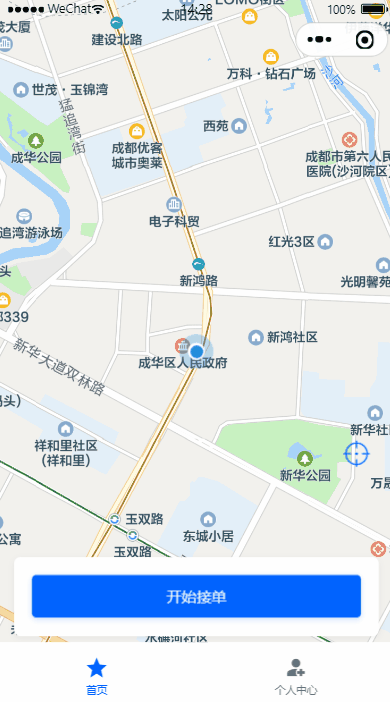

#### 1.1、司机微服务接口

操作模块：service-driver

##### 1.1.1、pom.xml

引入依赖

```xml
<dependency>
    <groupId>com.github.binarywang</groupId>
    <artifactId>weixin-java-miniapp</artifactId>
</dependency>
```

说明：在父工程已经对改依赖进行了版本管理，这里直接引入即可

##### 1.1.2、common-account.yaml

添加配置（已加就忽略）

```ymal
wx:
  miniapp:
    #小程序授权登录
    appId: wxcc651fcbab275e33  # 小程序微信公众平台appId
    secret: 5f353399a2eae7ff6ceda383e924c5f6  # 小程序微信公众平台api秘钥
```

##### 1.1.3、WxMaProperties

```java
package com.atguigu.daijia.driver.config;

import lombok.Data;
import org.springframework.boot.context.properties.ConfigurationProperties;
import org.springframework.stereotype.Component;

@Data
@Component
@ConfigurationProperties(prefix = "wx.miniapp")
public class WxMaProperties {

    private String appId;
    private String secret;
}
```

1.3.4、WxMaConfig

```java
package com.atguigu.daijia.driver.config;

import cn.binarywang.wx.miniapp.api.WxMaService;
import cn.binarywang.wx.miniapp.api.impl.WxMaServiceImpl;
import cn.binarywang.wx.miniapp.config.impl.WxMaDefaultConfigImpl;
import org.springframework.beans.factory.annotation.Autowired;
import org.springframework.context.annotation.Bean;
import org.springframework.stereotype.Component;

@Component
public class WxMaConfig {

    @Autowired
    private WxMaProperties wxMaProperties;

    @Bean
    public WxMaService wxMaService() {
        WxMaDefaultConfigImpl config = new WxMaDefaultConfigImpl();
        config.setAppid(wxMaProperties.getAppId());
        config.setSecret(wxMaProperties.getSecret());

        WxMaService service = new WxMaServiceImpl();
        service.setWxMaConfig(config);
        return service;
    }
}
```

##### 1.3.4、DriverInfoController

```java
@Autowired
private DriverInfoService driverInfoService;

@Operation(summary = "小程序授权登录")
@GetMapping("/login/{code}")
public Result<Long> login(@PathVariable String code) {
   return Result.ok(driverInfoService.login(code));
}
```

##### 1.3.5、DriverInfoService

```java
Long login(String code);
```

##### 1.3.6、DriverInfoServiceImpl

```java
@Autowired
private DriverInfoMapper driverInfoMapper;

@Autowired
private DriverAccountMapper driverAccountMapper;

@Autowired
private WxMaService wxMaService;

@Autowired
private DriverSetMapper driverSetMapper;

@Autowired
private DriverLoginLogMapper driverLoginLogMapper;

@Transactional(rollbackFor = Exception.class)
@Override
public Long login(String code) {

    String openId = null;
    try {
        //获取openId
        WxMaJscode2SessionResult sessionInfo = wxMaService.getUserService().getSessionInfo(code);
        openId = sessionInfo.getOpenid();
        log.info("【小程序授权】openId={}", openId);
    } catch (Exception e) {
        e.printStackTrace();
        throw new GuiguException(ResultCodeEnum.WX_CODE_ERROR);
    }

    DriverInfo driverInfo = this.getOne(new LambdaQueryWrapper<DriverInfo>().eq(DriverInfo::getWxOpenId, openId));
    if (null == driverInfo) {
        driverInfo = new DriverInfo();
        driverInfo.setNickname(String.valueOf(System.currentTimeMillis()));
        driverInfo.setAvatarUrl("https://oss.aliyuncs.com/aliyun_id_photo_bucket/default_handsome.jpg");
        driverInfo.setWxOpenId(openId);
        this.save(driverInfo);

        //初始化默认设置
        DriverSet driverSet = new DriverSet();
        driverSet.setDriverId(driverInfo.getId());
        driverSet.setOrderDistance(new BigDecimal(0));//0：无限制
        driverSet.setAcceptDistance(new BigDecimal(SystemConstant.ACCEPT_DISTANCE));//默认接单范围：5公里
        driverSet.setIsAutoAccept(0);//0：否 1：是
        driverSetMapper.insert(driverSet);

        //初始化司机账户
        DriverAccount driverAccount = new DriverAccount();
        driverAccount.setDriverId(driverInfo.getId());
        driverAccountMapper.insert(driverAccount);
    }
    
    //登录日志
    DriverLoginLog driverLoginLog = new DriverLoginLog();
    driverLoginLog.setDriverId(driverInfo.getId());
    driverLoginLog.setMsg("小程序登录");
    driverLoginLogMapper.insert(driverLoginLog);
    return driverInfo.getId();
}
```

#### 1.2、Feign接口

##### 1.2.1、DriverInfoFeignClient

```java
/**
 * 小程序授权登录
 * @param code
 * @return
 */
@GetMapping("/driver/info/login/{code}")
Result<Long> login(@PathVariable("code") String code);
```

#### 1.3、司机端web接口

##### 1.3.1、DriverController

```java
@Autowired
private DriverService driverService;

@Operation(summary = "小程序授权登录")
@GetMapping("/login/{code}")
public Result<String> login(@PathVariable String code) {
   return Result.ok(driverService.login(code));
}
```

##### 1.3.2、DriverService

```java
String login(String code);
```

##### 1.3.3、DriverServiceImpl

```java
@Autowired
private DriverInfoFeignClient driverInfoFeignClient;

@Autowired
private RedisTemplate redisTemplate;

@SneakyThrows
@Override
public String login(String code) {
    //获取openId
    Long driverId = driverInfoFeignClient.login(code).getData();

    String token = UUID.randomUUID().toString().replaceAll("-", "");
    redisTemplate.opsForValue().set(RedisConstant.USER_LOGIN_KEY_PREFIX + token, driverId.toString(), RedisConstant.USER_LOGIN_KEY_TIMEOUT, TimeUnit.SECONDS);
    return token;
}
```

说明：司机端登录后，也需要获取司机登录信息，页面才会跳转，同乘客端一致。


### 2、获取司机登录信息

司机端每天接单都要进行人脸识别，所以司机登录后都需要判断一下司机到底有没有录入人脸到人脸库

#### 2.1、司机登录信息微服务接口

##### 2.1.1、DriverInfoController

```java
@Operation(summary = "获取司机登录信息")
@GetMapping("/getDriverLoginInfo/{driverId}")
public Result<DriverLoginVo> getDriverLoginInfo(@PathVariable Long driverId) {
   return Result.ok(driverInfoService.getDriverLoginInfo(driverId));
}
```

##### 2.1.2、DriverInfoService

```java
DriverLoginVo getDriverLoginInfo(Long driverId);
```

##### 2.1.3、DriverInfoServiceImpl

```java
@Override
public DriverLoginVo getDriverLoginInfo(Long driverId) {
    DriverInfo driverInfo = this.getById(driverId);
    DriverLoginVo driverLoginVo = new DriverLoginVo();
    BeanUtils.copyProperties(driverInfo, driverLoginVo);
    //是否创建人脸库人员，接单时做人脸识别判断
    Boolean isArchiveFace = StringUtils.hasText(driverInfo.getFaceModelId());
    driverLoginVo.setIsArchiveFace(isArchiveFace);
    return driverLoginVo;
}
```

#### 2.2、Feign接口

##### 2.2.1、DriverInfoFeignClient

```java
/**
 * 获取司机登录信息
 * @param driverId
 * @return
 */
@GetMapping("/driver/info/getDriverLoginInfo/{driverId}")
Result<DriverLoginVo> getDriverLoginInfo(@PathVariable("driverId") Long driverId);
```

#### 2.3、司机端web接口

##### 2.3.1、DriverController

```java
@Operation(summary = "获取司机登录信息")
@GuiguLogin
@GetMapping("/getDriverLoginInfo")
public Result<DriverLoginVo> getDriverLoginInfo() {
   Long driverId = AuthContextHolder.getUserId();
   return Result.ok(driverService.getDriverLoginInfo(driverId));
}
```

##### 2.3.2、DriverService

```java
DriverLoginVo getDriverLoginInfo(Long driverId);
```

##### 2.3.3、DriverServiceImpl

```java
@Override
public DriverLoginVo getDriverLoginInfo(Long driverId) {
    return driverInfoFeignClient.getDriverLoginInfo(driverId).getData();
}
```


### 3、开通腾讯云对象存储COS

接下来我们要实现司机认证模块，司机认证模块需要集成腾讯云对象存储COS、腾讯云OCR证件识别及腾讯云人脸模型库创建，先学习完这些前置接口，再编写认证提交接口，如图：


#### 3.1、开通腾讯云对象存储COS

首先注册与登录等腾讯云，官网地址：https://cloud.tencent.com/

开通腾讯云对象存储COS：官网地址：https://cloud.tencent.com/product/cos

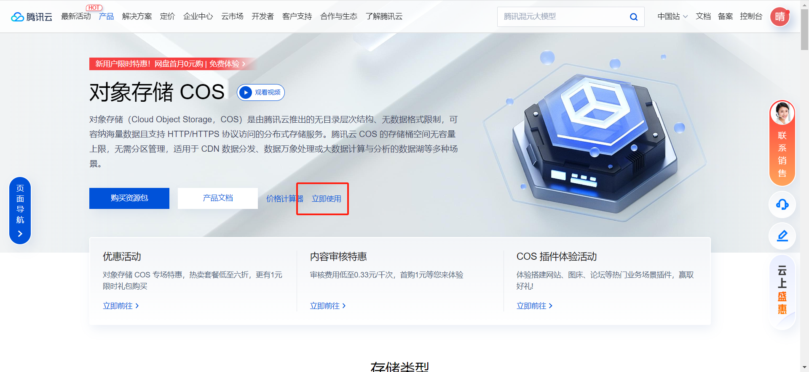

进入控制台：

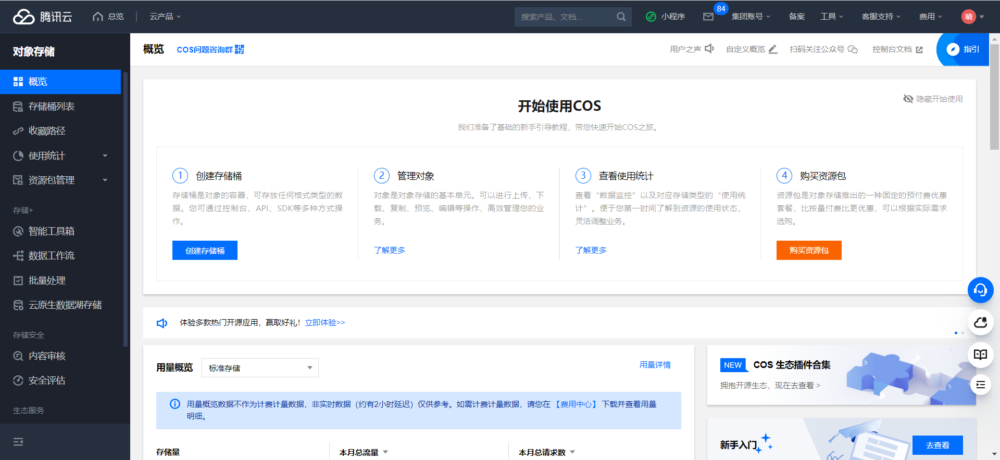

#### 3.2、获得腾讯云访问密钥

调用腾讯云各种服务是需要用到密钥的，例如数据万象、对象存储等等。

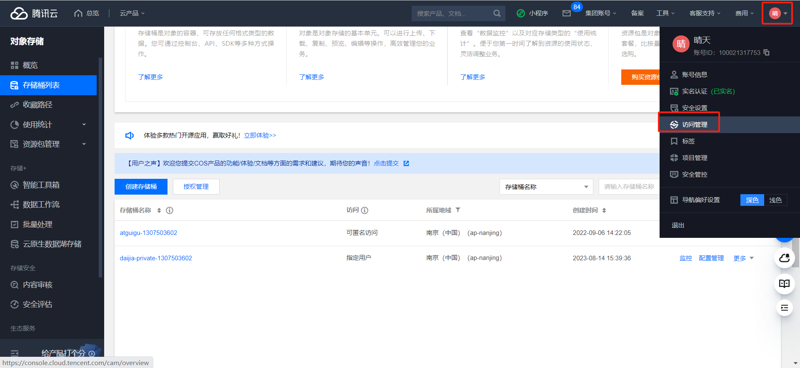

在访问管理页面中新建密钥，然后你把腾讯云的`APPID`、`SecretId`和`SecretKey`都记下来，一会儿我们写程序要用到。

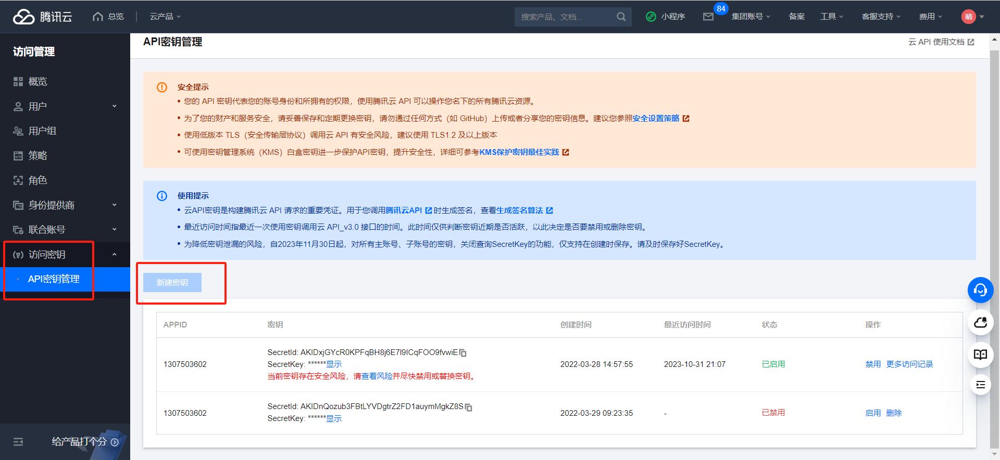

#### 3.3、创建存储桶

我们在对象存储中创建一个私有存储桶，用来存放身份证和驾驶证这些保密度较高的图片。

创建私有存储桶：

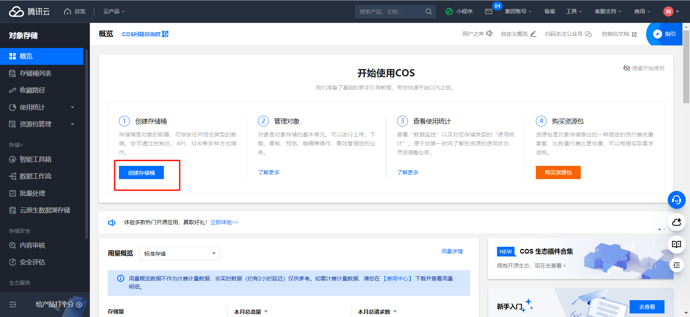

创建存储桶：

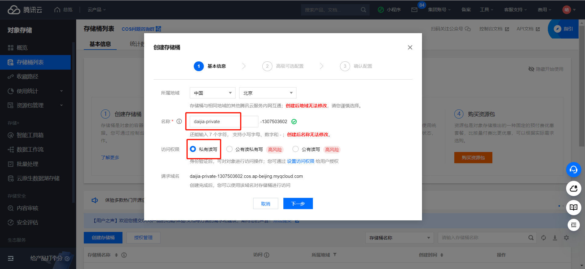

下一步：

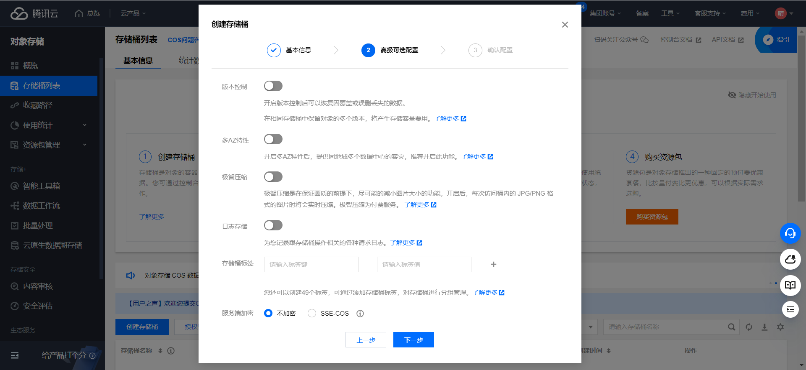

下一步：

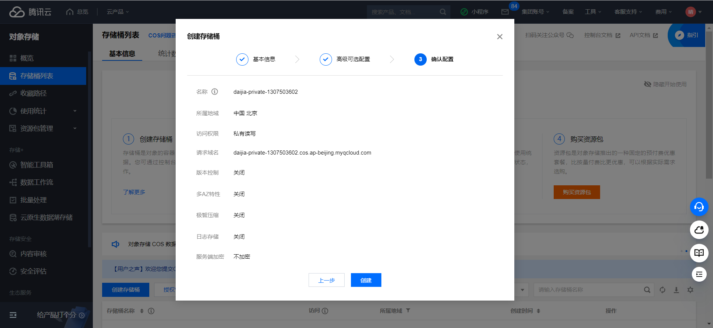

创建

#### 3.4、API文档

文档地址：https://cloud.tencent.com/document/product/436/10199

初始化客户端

```java
// 1 初始化用户身份信息（secretId, secretKey）。
// SECRETID和SECRETKEY请登录访问管理控制台 https://console.cloud.tencent.com/cam/capi 进行查看和管理
String secretId = "SECRETID";
String secretKey = "SECRETKEY";
COSCredentials cred = new BasicCOSCredentials(secretId, secretKey);
// 2 设置 bucket 的地域, COS 地域的简称请参照 https://cloud.tencent.com/document/product/436/6224
// clientConfig 中包含了设置 region, https(默认 http), 超时, 代理等 set 方法, 使用可参见源码或者常见问题 Java SDK 部分。
Region region = new Region("COS_REGION");
ClientConfig clientConfig = new ClientConfig(region);
// 这里建议设置使用 https 协议
// 从 5.6.54 版本开始，默认使用了 https
clientConfig.setHttpProtocol(HttpProtocol.https);
// 3 生成 cos 客户端。
COSClient cosClient = new COSClient(cred, clientConfig);
```

**上传对象**

```java
// 指定要上传的文件
File localFile = new File(localFilePath);
// 指定文件将要存放的存储桶
String bucketName = "examplebucket-1250000000"; //存储桶名字-编号
// 指定文件上传到 COS 上的路径，即对象键。例如对象键为folder/picture.jpg，则表示将文件 picture.jpg 上传到 folder 路径下
String key = "exampleobject"; 
PutObjectRequest putObjectRequest = new PutObjectRequest(bucketName, key, localFile);
PutObjectResult putObjectResult = cosClient.putObject(putObjectRequest);
```

**删除对象**：删除 COS 上指定路径的对象，代码如下：

```java
// Bucket的命名格式为 BucketName-APPID ，此处填写的存储桶名称必须为此格式
String bucketName = "examplebucket-1250000000";
// 指定被删除的文件在 COS 上的路径，即对象键。例如对象键为folder/picture.jpg，则表示删除位于 folder 路径下的文件 picture.jpg
String key = "exampleobject";
cosClient.deleteObject(bucketName, key);
```


### 4、对象云存储COS上传接口

上传证件照到腾讯云私有存储桶，证件信息属于隐私信息，不能随便访问，得有对应的权限才能申请临时访问url。我们先编写上传接口。

#### 4.1、司机微服务接口

##### 4.1.1、添加依赖

```xml
<dependency>
   <groupId>com.qcloud</groupId>
   <artifactId>cos_api</artifactId>
</dependency>
```

##### 4.1.2、common-account.yaml

```yaml
tencent:
  cloud:
    secretId: AKIDxjGYcR0KPFqBH8j6E7l9ICq****
    secretKey: KPFsGPJyNWQ5WheNq55qMcdOuABw****
    region: ap-nanjing
    bucketPrivate: daijia-private-1307503602
```

##### 4.1.3、TencentCloudProperties

```java
package com.atguigu.daijia.driver.config;

import lombok.Data;
import org.springframework.boot.context.properties.ConfigurationProperties;
import org.springframework.stereotype.Component;

@Data
@Component
@ConfigurationProperties(prefix = "tencent.cloud")
public class TencentCloudProperties {

    private String secretId;
    private String secretKey;
    private String region;
    private String bucketPrivate;
}
```

##### 4.1.4、CosController

```java
@Autowired
private CosService cosService;

@Operation(summary = "上传")
@PostMapping("/upload")
public Result<CosUploadVo> upload(@RequestPart("file") MultipartFile file, @RequestParam("path") String path) {
    return Result.ok(cosService.upload(file, path));
}
```

##### 4.1.5、CosService

```java
CosUploadVo upload(MultipartFile file, String module);
```

##### 4.1.6、CosServiceImpl

```java
 @Autowired
private TencentCloudProperties tencentCloudProperties;

private COSClient getPrivateCOSClient() {
    COSCredentials cred = new BasicCOSCredentials(tencentCloudProperties.getSecretId(), tencentCloudProperties.getSecretKey());
    ClientConfig clientConfig = new ClientConfig(new Region(tencentCloudProperties.getRegion()));
    clientConfig.setHttpProtocol(HttpProtocol.https);
    COSClient cosClient = new COSClient(cred, clientConfig);
    return cosClient;
}

/**
     * https://console.cloud.tencent.com/cos
     * https://cloud.tencent.com/document/product/436/10199
     * @param file
     * @param module
     * @return
     */
@SneakyThrows
@Override
public CosUploadVo upload(MultipartFile file, String path) {
    COSClient cosClient = this.getPrivateCOSClient();

    //元数据信息
    ObjectMetadata meta = new ObjectMetadata();
    meta.setContentLength(file.getSize());
    meta.setContentEncoding("UTF-8");
    meta.setContentType(file.getContentType());

    //向存储桶中保存文件
    String fileType = file.getOriginalFilename().substring(file.getOriginalFilename().lastIndexOf(".")); //文件后缀名
    String uploadPath = "/driver/" + path + "/" + UUID.randomUUID().toString().replaceAll("-", "") + fileType;
    PutObjectRequest putObjectRequest = new PutObjectRequest(tencentCloudProperties.getBucketPrivate(), uploadPath, file.getInputStream(), meta);
    putObjectRequest.setStorageClass(StorageClass.Standard);
    PutObjectResult putObjectResult = cosClient.putObject(putObjectRequest); //上传文件
    log.info(JSON.toJSONString(putObjectResult));
    cosClient.shutdown();

    //封装返回对象
    CosUploadVo cosUploadVo = new CosUploadVo();
    cosUploadVo.setUrl(uploadPath);
    //图片临时访问url，回显使用
    cosUploadVo.setShowUrl("");
    return cosUploadVo;
}
```

#### 4.2、Feign接口

##### 4.2.1、CosFeignClient

```java
/**
 * 上传
 * @param file
 * @param path
 * @return
 */
@PostMapping(value = "/cos/upload", consumes = MediaType.MULTIPART_FORM_DATA_VALUE)
Result<CosUploadVo> upload(@RequestPart("file") MultipartFile file, @RequestParam("path") String path);
```

**注：consumes = MediaType.MULTIPART_FORM_DATA_VALUE**

#### 4.3、司机端web接口

##### 4.3.1、CosController

```java
@Autowired
private CosService cosService;

@Operation(summary = "上传")
@GuiguLogin
@PostMapping("/upload")
public Result<CosUploadVo> upload(@RequestPart("file") MultipartFile file, @RequestParam(name = "path", defaultValue = "auth") String path) {
   return Result.ok(cosService.upload(file, path));
}
```

##### 4.3.2、CosService

```java
CosUploadVo upload(MultipartFile file, String path);
```

##### 4.3.3、CosServiceImpl

```java
@Override
public CosUploadVo upload(MultipartFile file, String path) {
    return cosFeignClient.upload(file, path).getData();
}
```

### 5、获取临时签名URL

上面我们实现了上传，但是页面回显还不能显示，当前我们来实现获取临时签名url接口，当前接口不需要对外服务，所以只是编写一个service方法即可。

官方文档地址：https://cloud.tencent.com/document/product/436/35217

#### 5.1、司机微服务接口

##### 5.1.1、CosService

```java
String getImageUrl(String path);
```

##### 5.1.2、CosServiceImpl

```java
@Override
public String getImageUrl(String path) {
    if(!StringUtils.hasText(path)) return "";

    COSClient cosClient = getPrivateCOSClient();
    GeneratePresignedUrlRequest request =
            new GeneratePresignedUrlRequest(tencentCloudProperties.getBucketPrivate(), path, HttpMethodName.GET);
    //设置临时URL有效期为15分钟
    Date expiration = new DateTime().plusMinutes(15).toDate();
    request.setExpiration(expiration);
    URL url = cosClient.generatePresignedUrl(request);
    cosClient.shutdown();
    return url.toString();
}
```

#### 5.2、完善上传接口

##### 5.2.1、CosServiceImpl

关键代码：

```java
//图片临时访问url，回显使用
cosUploadVo.setShowUrl(this.getImageUrl(path));
```

完整代码：

```java
@SneakyThrows
@Override
public CosUploadVo upload(MultipartFile file, String path) {
    COSClient cosClient = this.getPrivateCOSClient();

    //元数据信息
    ObjectMetadata meta = new ObjectMetadata();
    meta.setContentLength(file.getSize());
    meta.setContentEncoding("UTF-8");
    meta.setContentType(file.getContentType());

    //向存储桶中保存文件
    String fileType = file.getOriginalFilename().substring(file.getOriginalFilename().lastIndexOf(".")); //文件后缀名
    String uploadPath = "/driver/" + path + "/" + UUID.randomUUID().toString().replaceAll("-", "") + fileType;
    PutObjectRequest putObjectRequest = new PutObjectRequest(tencentCloudProperties.getBucketPrivate(), uploadPath, file.getInputStream(), meta);
    putObjectRequest.setStorageClass(StorageClass.Standard);
    PutObjectResult putObjectResult = cosClient.putObject(putObjectRequest); //上传文件
    log.info(JSON.toJSONString(putObjectResult));
    cosClient.shutdown();

    //封装返回对象
    CosUploadVo cosUploadVo = new CosUploadVo();
    cosUploadVo.setUrl(uploadPath);
    //图片临时访问url，回显使用
    cosUploadVo.setShowUrl(this.getImageUrl(uploadPath));
    return cosUploadVo;
}
```


### 6、腾讯云身份证识别接口

司机注册成功之后，应该引导他去做实名认证，这就需要用到腾讯云身份证识别和云存储功能了

身份证识别API地址：https://cloud.tencent.com/document/product/866/33524

#### 6.1、司机端微服务接口

##### 6.1.1、OcrController

```java
@Autowired
private OcrService ocrService;

@Operation(summary = "身份证识别")
@PostMapping("/idCardOcr")
public Result<IdCardOcrVo> idCardOcr(@RequestPart("file") MultipartFile file) {
    return Result.ok(ocrService.idCardOcr(file));
}
```

##### 6.1.2、OcrService

```java
IdCardOcrVo idCardOcr(MultipartFile file);
```

##### 6.1.3、OcrServiceImpl

```java
@Autowired
private CosService cosService;

@Autowired
private TencentCloudProperties tencentCloudProperties;

/**
 * 文档地址:
 * https://cloud.tencent.com/document/product/866/33524
 * https://console.cloud.tencent.com/api/explorer?Product=ocr&Version=2018-11-19&Action=IDCardOCR
 *
 * @param file
 * @return
 */
@SneakyThrows
@Override
public IdCardOcrVo idCardOcr(MultipartFile file) {
    //将图片转换为base64字符串
    byte[] encoder = Base64.encodeBase64(file.getBytes());
    String idCardBase64 = new String(encoder);

    // 实例化一个认证对象，入参需要传入腾讯云账户 SecretId 和 SecretKey，此处还需注意密钥对的保密
    // 代码泄露可能会导致 SecretId 和 SecretKey 泄露，并威胁账号下所有资源的安全性。以下代码示例仅供参考，建议采用更安全的方式来使用密钥，请参见：https://cloud.tencent.com/document/product/1278/85305
    // 密钥可前往官网控制台 https://console.cloud.tencent.com/cam/capi 进行获取
    Credential cred = new Credential(tencentCloudProperties.getSecretId(), tencentCloudProperties.getSecretKey());
    // 实例化一个http选项，可选的，没有特殊需求可以跳过
    HttpProfile httpProfile = new HttpProfile();
    httpProfile.setEndpoint("ocr.tencentcloudapi.com");
    // 实例化一个client选项，可选的，没有特殊需求可以跳过
    ClientProfile clientProfile = new ClientProfile();
    clientProfile.setHttpProfile(httpProfile);
    // 实例化要请求产品的client对象,clientProfile是可选的
    OcrClient client = new OcrClient(cred, tencentCloudProperties.getRegion(), clientProfile);
    // 实例化一个请求对象,每个接口都会对应一个request对象
    IDCardOCRRequest req = new IDCardOCRRequest();
    req.setImageBase64(idCardBase64);

    // 返回的resp是一个IDCardOCRResponse的实例，与请求对象对应
    IDCardOCRResponse resp = client.IDCardOCR(req);
    // 输出json格式的字符串回包
    log.info(IDCardOCRResponse.toJsonString(resp));

    //转换为IdCardOcrVo对象
    IdCardOcrVo idCardOcrVo = new IdCardOcrVo();
    if (StringUtils.hasText(resp.getName())) {
        //身份证正面
        idCardOcrVo.setName(resp.getName());
        idCardOcrVo.setGender("男".equals(resp.getSex()) ? "1" : "2");
        idCardOcrVo.setBirthday(DateTimeFormat.forPattern("yyyy/MM/dd").parseDateTime(resp.getBirth()).toDate());
        idCardOcrVo.setIdcardNo(resp.getIdNum());
        idCardOcrVo.setIdcardAddress(resp.getAddress());

        //上传身份证正面图片到腾讯云cos
        CosUploadVo cosUploadVo = cosService.upload(file, "idCard");
        idCardOcrVo.setIdcardFrontUrl(cosUploadVo.getUrl());
        idCardOcrVo.setIdcardFrontShowUrl(cosUploadVo.getShowUrl());
    } else {
        //身份证反面
        //证件有效期："2010.07.21-2020.07.21"
        String idcardExpireString = resp.getValidDate().split("-")[1];
        idCardOcrVo.setIdcardExpire(DateTimeFormat.forPattern("yyyy.MM.dd").parseDateTime(idcardExpireString).toDate());
        //上传身份证反面图片到腾讯云cos
        CosUploadVo cosUploadVo = cosService.upload(file, "idCard");
        idCardOcrVo.setIdcardBackUrl(cosUploadVo.getUrl());
        idCardOcrVo.setIdcardBackShowUrl(cosUploadVo.getShowUrl());
    }
    return idCardOcrVo;
}
```

#### 6.2、Feign接口

##### 6.2.1、CosFeignClient

```java
/**
 * 身份证识别
 * @param file
 * @return
 */
@PostMapping(value = "/ocr/idCardOcr", consumes = MediaType.MULTIPART_FORM_DATA_VALUE)
Result<IdCardOcrVo> idCardOcr(@RequestPart("file") MultipartFile file);
```

**注：consumes = MediaType.MULTIPART_FORM_DATA_VALUE**

#### 6.3、司机端web接口

##### 6.3.1、OcrController

```java
@Operation(summary = "身份证识别")
@GuiguLogin
@PostMapping("/idCardOcr")
public Result<IdCardOcrVo> uploadDriverLicenseOcr(@RequestPart("file") MultipartFile file) {
   return Result.ok(ocrService.idCardOcr(file));
}
```

##### 6.3.2、OcrService

```java
IdCardOcrVo idCardOcr(MultipartFile file);
```

##### 6.3.3、OcrServiceImpl

```java
@Autowired
private OcrFeignClient ocrFeignClient;

@Override
public IdCardOcrVo idCardOcr(MultipartFile file) {
    return ocrFeignClient.idCardOcr(file).getData();
}
```


### 7、腾讯云驾驶证识别接口

驾驶证识别API地址：https://cloud.tencent.com/document/product/866/36213

#### 7.1、司机端微服务接口

##### 7.1.1、OcrController

```java
@Operation(summary = "驾驶证识别")
@PostMapping("/driverLicenseOcr")
public Result<DriverLicenseOcrVo> driverLicenseOcr(@RequestPart("file") MultipartFile file) {
    return Result.ok(ocrService.driverLicenseOcr(file));
}
```

##### 7.1.2、OcrService

```java
DriverLicenseOcrVo driverLicenseOcr(MultipartFile file);
```

##### 7.1.3、OcrServiceImpl

```java
/**
 * 文档地址：
 * https://cloud.tencent.com/document/product/866/36213
 * https://console.cloud.tencent.com/api/explorer?Product=ocr&Version=2018-11-19&Action=DriverLicenseOCR
 *
 * @param file
 * @return
 */
@SneakyThrows
@Override
public DriverLicenseOcrVo driverLicenseOcr(MultipartFile file) {
    //将图片转换为base64字符串
    byte[] encoder = Base64.encodeBase64(file.getBytes());
    String driverLicenseBase64 = new String(encoder);

    // 实例化一个认证对象，入参需要传入腾讯云账户 SecretId 和 SecretKey，此处还需注意密钥对的保密
    // 代码泄露可能会导致 SecretId 和 SecretKey 泄露，并威胁账号下所有资源的安全性。以下代码示例仅供参考，建议采用更安全的方式来使用密钥，请参见：https://cloud.tencent.com/document/product/1278/85305
    // 密钥可前往官网控制台 https://console.cloud.tencent.com/cam/capi 进行获取
    Credential cred = new Credential(tencentCloudProperties.getSecretId(), tencentCloudProperties.getSecretKey());
    // 实例化一个http选项，可选的，没有特殊需求可以跳过
    HttpProfile httpProfile = new HttpProfile();
    httpProfile.setEndpoint("ocr.tencentcloudapi.com");
    // 实例化一个client选项，可选的，没有特殊需求可以跳过
    ClientProfile clientProfile = new ClientProfile();
    clientProfile.setHttpProfile(httpProfile);
    // 实例化要请求产品的client对象,clientProfile是可选的
    OcrClient client = new OcrClient(cred, tencentCloudProperties.getRegion(), clientProfile);
    // 实例化一个请求对象,每个接口都会对应一个request对象
    DriverLicenseOCRRequest req = new DriverLicenseOCRRequest();
    req.setImageBase64(driverLicenseBase64);
    // 返回的resp是一个VehicleLicenseOCRResponse的实例，与请求对象对应
    DriverLicenseOCRResponse resp = client.DriverLicenseOCR(req);
    // 输出json格式的字符串回包
    log.info(VehicleLicenseOCRResponse.toJsonString(resp));

    DriverLicenseOcrVo driverLicenseOcrVo = new DriverLicenseOcrVo();
    if (StringUtils.hasText(resp.getName())) {
        //驾驶证正面
        //驾驶证名称要与身份证名称一致
        driverLicenseOcrVo.setName(resp.getName());
        driverLicenseOcrVo.setDriverLicenseClazz(resp.getClass_());
        driverLicenseOcrVo.setDriverLicenseNo(resp.getCardCode());
        driverLicenseOcrVo.setDriverLicenseIssueDate(DateTimeFormat.forPattern("yyyy-MM-dd").parseDateTime(resp.getDateOfFirstIssue()).toDate());
        driverLicenseOcrVo.setDriverLicenseExpire(DateTimeFormat.forPattern("yyyy-MM-dd").parseDateTime(resp.getEndDate()).toDate());

        //上传驾驶证反面图片到腾讯云cos
        CosUploadVo cosUploadVo = cosService.upload(file, "driverLicense");
        driverLicenseOcrVo.setDriverLicenseFrontUrl(cosUploadVo.getUrl());
        driverLicenseOcrVo.setDriverLicenseFrontShowUrl(cosUploadVo.getShowUrl());
    } else {
        //驾驶证反面
        //上传驾驶证反面图片到腾讯云cos
        CosUploadVo cosUploadVo =  cosService.upload(file, "driverLicense");
        driverLicenseOcrVo.setDriverLicenseBackUrl(cosUploadVo.getUrl());
        driverLicenseOcrVo.setDriverLicenseBackShowUrl(cosUploadVo.getShowUrl());
    }

    return driverLicenseOcrVo;
}
```

#### 7.2、Feign接口

##### 7.2.1、OcrFeignClient

```java
/**
 * 驾驶证识别
 * @param file
 * @return
 */
@PostMapping(value = "/ocr/driverLicenseOcr", consumes = MediaType.MULTIPART_FORM_DATA_VALUE)
Result<DriverLicenseOcrVo> driverLicenseOcr(@RequestPart("file") MultipartFile file);
```

**注：consumes = MediaType.MULTIPART_FORM_DATA_VALUE**

#### 7.3、司机端web接口

##### 7.3.1、OcrController

```java
@Operation(summary = "驾驶证识别")
@GuiguLogin
@PostMapping("/driverLicenseOcr")
public Result<DriverLicenseOcrVo> driverLicenseOcr(@RequestPart("file") MultipartFile file) {
   return Result.ok(ocrService.driverLicenseOcr(file));
}
```

##### 7.3.2、OcrService

```java
DriverLicenseOcrVo driverLicenseOcr(MultipartFile file);
```

##### 7.3.3、OcrServiceImpl

```java
@Override
public DriverLicenseOcrVo driverLicenseOcr(MultipartFile file) {
    return ocrFeignClient.driverLicenseOcr(file).getData();
}
```


### 8、获取司机认证信息

司机登录成功后，会判断司机是否认证，如果未认证调到认证页面，认证页面为修改与查看页面，未认证通过可反复提交认证，因此我们要先查看认证信息。

进入认证页面我们要回显证件信息，因此要申请临时访问路径。

#### 8.1、获取司机认证信息微服务接口

##### 8.1.1、DriverInfoController

```java
@Operation(summary = "获取司机认证信息")
@GetMapping("/getDriverAuthInfo/{driverId}")
Result<DriverAuthInfoVo> getDriverAuthInfo(@PathVariable("driverId") Long driverId) {
   return Result.ok(driverInfoService.getDriverAuthInfo(driverId));
}
```

##### 8.1.2、DriverInfoService

```java
DriverAuthInfoVo getDriverAuthInfo(Long driverId);
```

##### 8.1.3、DriverInfoServiceImpl

```java
@Autowired
private CosService cosService;

@Override
public DriverAuthInfoVo getDriverAuthInfo(Long driverId) {
    DriverInfo driverInfo = this.getById(driverId);
    DriverAuthInfoVo driverAuthInfoVo = new DriverAuthInfoVo();
    BeanUtils.copyProperties(driverInfo, driverAuthInfoVo);
    driverAuthInfoVo.setIdcardBackShowUrl(cosService.getImageUrl(driverAuthInfoVo.getIdcardBackUrl()));
    driverAuthInfoVo.setIdcardFrontShowUrl(cosService.getImageUrl(driverAuthInfoVo.getIdcardFrontUrl()));
    driverAuthInfoVo.setIdcardHandShowUrl(cosService.getImageUrl(driverAuthInfoVo.getIdcardHandUrl()));
    driverAuthInfoVo.setDriverLicenseFrontShowUrl(cosService.getImageUrl(driverAuthInfoVo.getDriverLicenseFrontUrl()));
    driverAuthInfoVo.setDriverLicenseBackShowUrl(cosService.getImageUrl(driverAuthInfoVo.getDriverLicenseBackUrl()));
    driverAuthInfoVo.setDriverLicenseHandShowUrl(cosService.getImageUrl(driverAuthInfoVo.getDriverLicenseHandUrl()));
    return driverAuthInfoVo;
}
```

#### 8.2、Feign接口

##### 8.2.1、DriverInfoFeignClient

```java
/**
 * 获取司机认证信息
 * @param driverId
 * @return
 */
@GetMapping("/driver/info/getDriverAuthInfo/{driverId}")
Result<DriverAuthInfoVo> getDriverAuthInfo(@PathVariable("driverId") Long driverId);
```

#### 8.3、司机端web接口

##### 8.3.1、DriverController

```java
@Operation(summary = "获取司机认证信息")
@GuiguLogin
@GetMapping("/getDriverAuthInfo")
public Result<DriverAuthInfoVo> getDriverAuthInfo() {
   Long driverId = AuthContextHolder.getUserId();
   return Result.ok(driverService.getDriverAuthInfo(driverId));
}
```

##### 8.3.2、DriverService

```java
DriverAuthInfoVo getDriverAuthInfo(Long driverId);
```

##### 8.3.3、DriverServiceImpl

```java
@Override
public DriverAuthInfoVo getDriverAuthInfo(Long driverId) {
    return driverInfoFeignClient.getDriverAuthInfo(driverId).getData();
}
```


### 9、修改司机认证信息

**认证状态：**

​	 0:未认证 【刚注册完为未认证状态】

​	1：审核中 【提交了认证信息后变为审核中】

​	2：认证通过 【后台审核通过】

​	-1：认证未通过【后台审核不通过】

**司机开启接单的条件：**

​	1、认证通过

​	2、建立了腾讯云人员库人员

​	3、当日验证了人脸识别

#### 9.1、修改司机认证信息微服务接口

##### 9.1.1、DriverInfoController

```java
@Operation(summary = "更新司机认证信息")
@PostMapping("/updateDriverAuthInfo")
public Result<Boolean> UpdateDriverAuthInfo(@RequestBody UpdateDriverAuthInfoForm updateDriverAuthInfoForm) {
    return Result.ok(driverInfoService.updateDriverAuthInfo(updateDriverAuthInfoForm));
}
```

##### 9.1.2、DriverInfoService

```java
Boolean updateDriverAuthInfo(UpdateDriverAuthInfoForm updateDriverAuthInfoForm);
```

##### 9.1.3、DriverInfoServiceImpl

```java
@Transactional(rollbackFor = Exception.class)
@Override
public Boolean updateDriverAuthInfo(UpdateDriverAuthInfoForm updateDriverAuthInfoForm) {
    DriverInfo driverInfo = new DriverInfo();
    driverInfo.setId(updateDriverAuthInfoForm.getDriverId());
    BeanUtils.copyProperties(updateDriverAuthInfoForm, driverInfo);
    return this.updateById(driverInfo);
}
```

#### 9.2、Feign接口

##### 9.2.1、DriverInfoFeignClient

```java
 /**
     * 更新司机认证信息
     * @param updateDriverAuthInfoForm
     * @return
     */
@PostMapping("/driver/info/updateDriverAuthInfo")
Result<Boolean> UpdateDriverAuthInfo(@RequestBody UpdateDriverAuthInfoForm updateDriverAuthInfoForm);
```

#### 9.3、司机端web接口

##### 9.3.1、DriverController

```java
@Operation(summary = "更新司机认证信息")
@GuiguLogin
@PostMapping("/updateDriverAuthInfo")
public Result<Boolean> updateDriverAuthInfo(@RequestBody UpdateDriverAuthInfoForm updateDriverAuthInfoForm) {
    updateDriverAuthInfoForm.setDriverId(AuthContextHolder.getUserId());
    return Result.ok(driverService.updateDriverAuthInfo(updateDriverAuthInfoForm));
}
```

##### 9.3.2、DriverService

```java
Boolean updateDriverAuthInfo(UpdateDriverAuthInfoForm updateDriverAuthInfoForm);
```

##### 9.3.3、DriverServiceImpl

```java
@Override
public Boolean updateDriverAuthInfo(UpdateDriverAuthInfoForm updateDriverAuthInfoForm) {
    return driverInfoFeignClient.UpdateDriverAuthInfo(updateDriverAuthInfoForm).getData();
}
```


### 10、开通人脸识别

新注册的司机都要采集面部信息，以便司机每天第一次接单的时候做身份核验。类似公司人脸打卡，先录入人脸，后续打卡在验证人脸

#### 10.1、开通人脸识别

官网地址：https://cloud.tencent.com/product/facerecognition

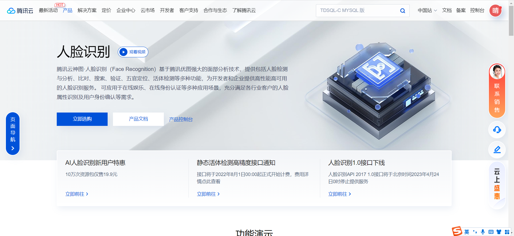

#### 10.2、创建人员库

为了存放移动端提交的司机面部照片，我们需要先创建人员库，名字是“代驾”，人员库的ID是“daijia-driver”。

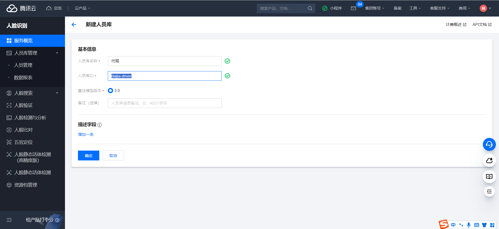

确定

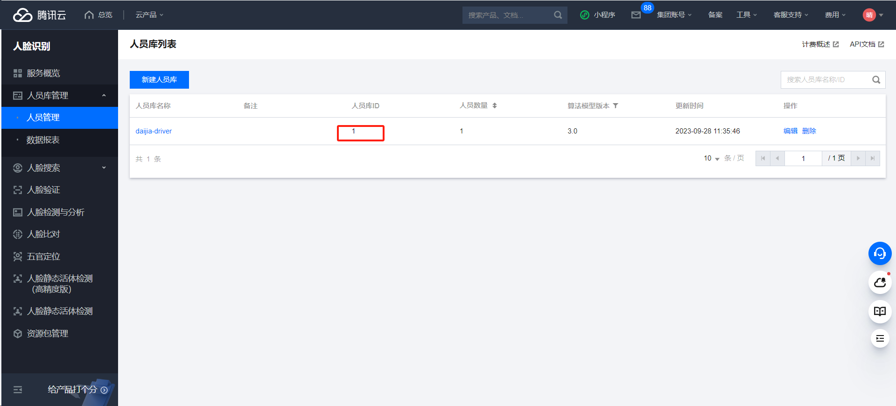

**说明：人员库ID 项目里面要使用，需要配置**

#### 10.3、创建人员库人员API

文档地址：https://cloud.tencent.com/document/api/867/45014

### 11、创建司机人脸模型

#### 11.1、司机微服务接口

##### 11.1.1、common-account.yaml

将persionGroupId加入配置文件

```yaml
tencent:
  cloud:
    secretId: AKIDxjGYcR0KPFqBH8j6E7l9ICqFOO9f****
    ***: ***
    persionGroupId: 1
```

说明：persionGroupId为上面创建的人员库id

##### 11.1.2、TencentCloudProperties

添加配置persionGroupId属性

```java
package com.atguigu.daijia.driver.config;

import lombok.Data;
import org.springframework.boot.context.properties.ConfigurationProperties;
import org.springframework.stereotype.Component;

@Data
@Component
@ConfigurationProperties(prefix = "tencent.cloud")
public class TencentCloudProperties {

    private String secretId;
    ***
    private String persionGroupId;
}
```

##### 11.1.3、DriverInfoController

```java
@Operation(summary = "创建司机人脸模型")
@PostMapping("/creatDriverFaceModel")
public Result<Boolean> creatDriverFaceModel(@RequestBody DriverFaceModelForm driverFaceModelForm) {
    return Result.ok(driverInfoService.creatDriverFaceModel(driverFaceModelForm));
}
```

##### 11.1.4、DriverInfoService

```java
Boolean creatDriverFaceModel(DriverFaceModelForm driverFaceModelForm);
```

##### 11.1.5、DriverInfoServiceImpl

```java
@Autowired
private TencentCloudProperties tencentCloudProperties;

/**
 * 文档地址
 * https://cloud.tencent.com/document/api/867/45014
 * https://console.cloud.tencent.com/api/explorer?Product=iai&Version=2020-03-03&Action=CreatePerson
 *
 * @param driverFaceModelForm
 * @return
 */
@Override
public Boolean creatDriverFaceModel(DriverFaceModelForm driverFaceModelForm) {
    DriverInfo driverInfo = this.getById(driverFaceModelForm.getDriverId());
    try {
        // 实例化一个认证对象，入参需要传入腾讯云账户 SecretId 和 SecretKey，此处还需注意密钥对的保密
        // 代码泄露可能会导致 SecretId 和 SecretKey 泄露，并威胁账号下所有资源的安全性。以下代码示例仅供参考，建议采用更安全的方式来使用密钥，请参见：https://cloud.tencent.com/document/product/1278/85305
        // 密钥可前往官网控制台 https://console.cloud.tencent.com/cam/capi 进行获取
        Credential cred = new Credential(tencentCloudProperties.getSecretId(), tencentCloudProperties.getSecretKey());
        // 实例化一个http选项，可选的，没有特殊需求可以跳过
        HttpProfile httpProfile = new HttpProfile();
        httpProfile.setEndpoint("iai.tencentcloudapi.com");
        // 实例化一个client选项，可选的，没有特殊需求可以跳过
        ClientProfile clientProfile = new ClientProfile();
        clientProfile.setHttpProfile(httpProfile);
        // 实例化要请求产品的client对象,clientProfile是可选的
        IaiClient client = new IaiClient(cred, tencentCloudProperties.getRegion(), clientProfile);
        // 实例化一个请求对象,每个接口都会对应一个request对象
        CreatePersonRequest req = new CreatePersonRequest();
        req.setGroupId(tencentCloudProperties.getPersionGroupId());
        //基本信息
        req.setPersonId(String.valueOf(driverInfo.getId()));
        req.setGender(Long.parseLong(driverInfo.getGender()));
        req.setQualityControl(4L);
        req.setUniquePersonControl(4L);
        req.setPersonName(driverInfo.getName());
        req.setImage(driverFaceModelForm.getImageBase64());

        // 返回的resp是一个CreatePersonResponse的实例，与请求对象对应
        CreatePersonResponse resp = client.CreatePerson(req);
        // 输出json格式的字符串回包
        System.out.println(CreatePersonResponse.toJsonString(resp));
        if (StringUtils.hasText(resp.getFaceId())) {
            //人脸校验必要参数，保存到数据库表
            driverInfo.setFaceModelId(resp.getFaceId());
            this.updateById(driverInfo);
        }
    } catch (TencentCloudSDKException e) {
        System.out.println(e.toString());
        return false;
    }
    return true;
}
```

#### 11.2、Feign接口

##### 11.2.1、DriverInfoFeignClient

```java
/**
 * 创建司机人脸模型
 * @param driverFaceModelForm
 * @return
 */
@PostMapping("/driver/info/creatDriverFaceModel")
Result<Boolean> creatDriverFaceModel(@RequestBody DriverFaceModelForm driverFaceModelForm);
```

#### 11.3、司机端web接口

##### 11.3.1、DriverController

```java
@Operation(summary = "创建司机人脸模型")
@GuiguLogin
@PostMapping("/creatDriverFaceModel")
public Result<Boolean> creatDriverFaceModel(@RequestBody DriverFaceModelForm driverFaceModelForm) {
   driverFaceModelForm.setDriverId(AuthContextHolder.getUserId());
   return Result.ok(driverService.creatDriverFaceModel(driverFaceModelForm));
}
```

##### 11.3.2、DriverService

```java
Boolean creatDriverFaceModel(DriverFaceModelForm driverFaceModelForm);
```

##### 11.3.3、DriverServiceImpl

```java
@Override
public Boolean creatDriverFaceModel(DriverFaceModelForm driverFaceModelForm) {
    return driverInfoFeignClient.creatDriverFaceModel(driverFaceModelForm).getData();
}
```


