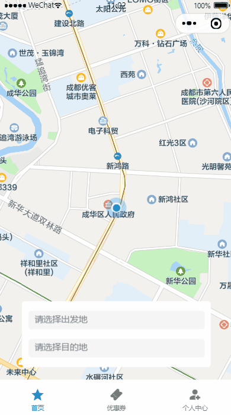
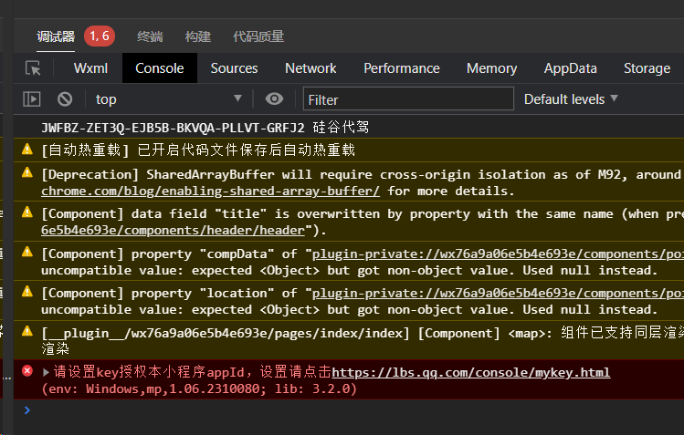
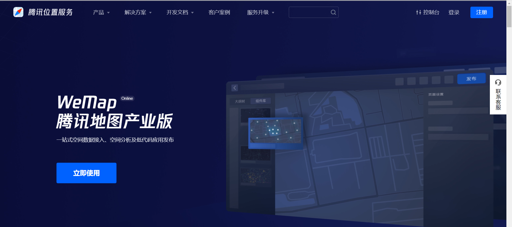
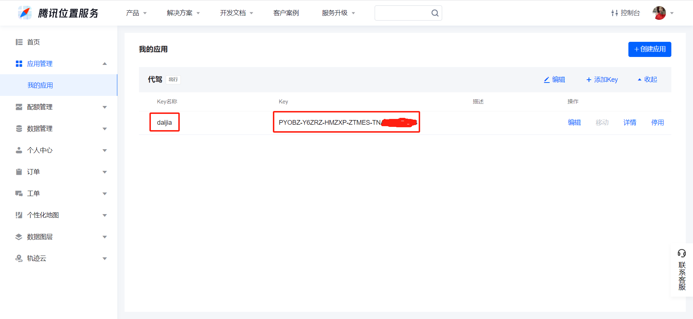
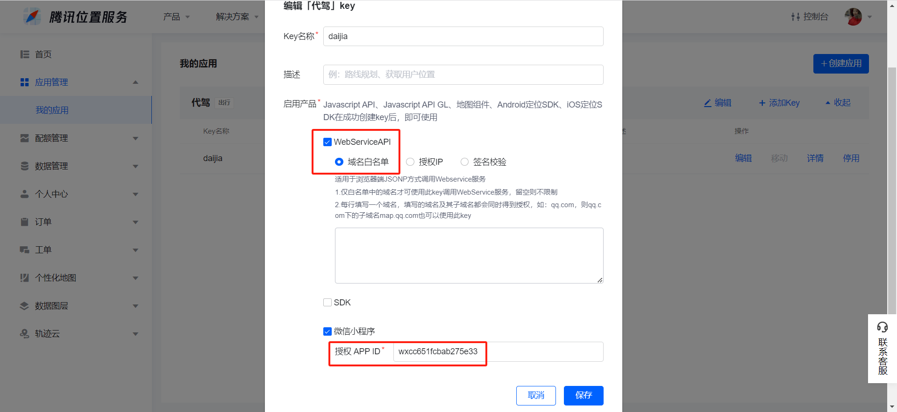
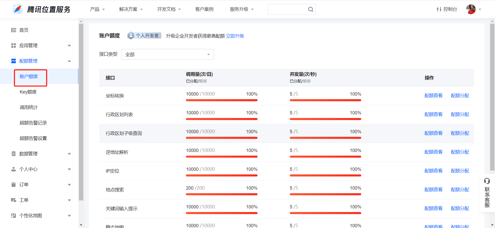
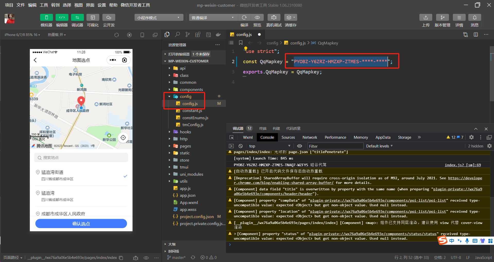

# 代驾：预估订单数据

## 一、预估订单数据

**学习目标：**

- 掌握腾讯位置服务API接口，封装最优路线规划
- 学习规则引擎 Drools入门
- 理解代驾费用规则，封装代驾费用接口
- 完成预估订单数据接口

乘客选择代驾起始点与终点，乘客下单前，先做代驾订单数据的预估，预估代驾里程、代驾时间、代驾金额及代驾的最佳驾驶线路，如图：




预估订单数据，根据乘客选择的代驾起始点与终点，服务端端需计算最佳驾驶线路与代驾预估金额。

最佳驾驶线路包含：腾讯地图线路数据、距离及时间

代驾预估金额：根据预估里程和代驾时间，结合费用规则，计算代驾金额，代驾金额的计算比较复杂，涉及规则引擎，后续讲到

接下来我们就来处理这部分接口

### 1、查找乘客端当前订单

乘客如果已经下过单了，而且这个订单在执行中，没有结束，那么乘客是不可以再下单的，页面会弹出层，进入执行中的订单。
当前我们必须把这个接口绕过去，不然我们不能进行下单，因此我们模拟一下这个接口，告诉它没有执行中的订单，后续在订单流程中我们完善这个业务。

#### 1.1、乘客端web模拟接口

##### 1.1.1、OrderController

```java
@Operation(summary = "查找乘客端当前订单")
@GuiguLogin
@GetMapping("/searchCustomerCurrentOrder")
public Result<CurrentOrderInfoVo> searchCustomerCurrentOrder() {
   CurrentOrderInfoVo currentOrderInfoVo = new CurrentOrderInfoVo();
   currentOrderInfoVo.setIsHasCurrentOrder(false);
   return Result.ok(currentOrderInfoVo);
}
```


### 2、预估驾驶线路

#### 2.1、前端问题

前端乘客选点时，跳入选点页面，页面空白，报如下错误

使用“腾讯位置服务地图选点”插件时，我们要开通“腾讯位置服务”，并且设置授权APP ID，这样才能使用正确使用选点服务。



#### 2.2、开通腾讯位置服务

腾讯位置服务服务器端API文档：https://lbs.qq.com/service/webService/webServiceGuide/webServiceOverview

代驾订单的时候，后端Java项目要预估里程和时间、计算代驾线路，需要调用腾讯位置服务来实现。

##### 2.2.1、开通地图服务

开通地图服务，首先你要访问腾讯位置服务的官网（https://lbs.qq.com/），然后注册新用户并且登陆。



##### 2.2.2、创建应用

控制台 =》 应用管理 =》 我的应用 =》 创建应用

名字可以随便定义，类型选择“出行”，然后就能拿到地图应用的密钥了。这个密钥你保存好，后面我们要用到。



##### 2.2.3、配置应用

创建好应用之后，编辑应用，在弹窗中，把WebService设置成“域名白名单”，然后在弹窗底部还要填写你自己的小程序APPID才行。



##### 2.2.4、账号额度

腾讯位置服务给开发者提供了免费的调用额度，只要你每天调用位置服务各种API次数不超过限额，那么就是免费的，对于开发者来说是足够用了。如果我们的项目上线了，这点配额肯定不够用，那就需要出钱购买了。



##### 2.2.5、前端更改配置

修改配置：config/config.js 替换为上面申请的key




#### 2.3、封装地图微服务接口

API文档：https://lbs.qq.com/service/webService/webServiceGuide/webServiceRoute

该接口包含：代驾线路规划、预估里程与时间

##### 2.3.1、common-account.yaml

```yaml
tencent:
  map:
    key: PYOBZ-Y6ZRZ-HMZXP-ZTMES-****-****
```

##### 2.3.2、MapController

```java
@Autowired
private MapService mapService;

@Operation(summary = "计算驾驶线路")
@PostMapping("/calculateDrivingLine")
public Result<DrivingLineVo> calculateDrivingLine(@RequestBody CalculateDrivingLineForm calculateDrivingLineForm) {
    return Result.ok(mapService.calculateDrivingLine(calculateDrivingLineForm));
}
```

##### 2.3.3、MapService

```java
DrivingLineVo calculateDrivingLine(CalculateDrivingLineForm calculateDrivingLineForm);
```

##### 2.3.4、MapServiceImpl

```java
@Autowired
private RestTemplate restTemplate;

@Value("${tencent.map.key}")
private String key;    // 腾讯地图服务

@Override
public DrivingLineVo calculateDrivingLine(CalculateDrivingLineForm calculateDrivingLineForm) {
    String url = "https://apis.map.qq.com/ws/direction/v1/driving/?from={from}&to={to}&key={key}";

    Map<String, String> map = new HashMap<>();
    map.put("from", calculateDrivingLineForm.getStartPointLatitude() + "," + calculateDrivingLineForm.getStartPointLongitude());
    map.put("to", calculateDrivingLineForm.getEndPointLatitude() + "," + calculateDrivingLineForm.getEndPointLongitude());
    map.put("key", key);

    JSONObject result = restTemplate.getForObject(url, JSONObject.class, map);
    if(result.getIntValue("status") != 0) {
        throw new GuiguException(ResultCodeEnum.MAP_FAIL);
    }

    //返回第一条最佳线路
    JSONObject route = result.getJSONObject("result").getJSONArray("routes").getJSONObject(0);
    DrivingLineVo drivingLineVo = new DrivingLineVo();
    //单位：千米
    drivingLineVo.setDistance(route.getBigDecimal("distance").divide(new BigDecimal(1000)).setScale(2, RoundingMode.HALF_UP));
    drivingLineVo.setDuration(route.getBigDecimal("duration"));
    drivingLineVo.setPolyline(route.getJSONArray("polyline"));
    return drivingLineVo;
}
```

##### 2.3.5、ServiceMapApplication

启动类配置RestTemplate

```java
@Bean
public RestTemplate restTemplate() {
    return new RestTemplate();
}
```

#### 2.4、Feign接口

##### 2.4.1、MapFeignClient

```java
/**
 * 计算驾驶线路
 * @param calculateDrivingLineForm
 * @return
 */
@PostMapping("/map/calculateDrivingLine")
Result<DrivingLineVo> calculateDrivingLine(@RequestBody CalculateDrivingLineForm calculateDrivingLineForm);
```


### 3、预估订单金额

乘客在选完代驾起始点后，页面显示预估的订单金额，我们需要根据代驾的费用计算规则，计算代驾费用。

#### 3.1、费用规则

**代驾费用 = 里程费 + 等候费 + 远途费**， 等候费当前为0，后续根据时间情况获取

说明：费用规则可能根据实际业务情况，随时会更新调整

##### 3.1.1、里程费

里程费 = 基础里程费 + 超出起步里程费

| 时间段        | 基础里程 | 收费 | 超出起步里程费 |
| :------------ | :------- | :--- | -------------- |
| 00:00 - 06:00 | 3公里    | 19元 | 4元/1公里      |
| 06:00 - 22:00 | 5公里    | 19元 | 3元/1公里      |

##### 3.1.2、等候费

司机达代驾起始点后，可免费等候10分钟，超出后每1分钟收取1

| 规则         | 收费      |
| ------------ | --------- |
| 等候10分钟后 | 1元/1分钟 |

##### 3.1.3、远途费

订单行程超出12公里后每公里1元收取远途费

| 规则                 | 收费      |
| -------------------- | --------- |
| 订单行程超出12公里后 | 1元/1公里 |

#### 3.2、规则引擎

对于不经常变化的业务，我们通常是硬编码到程序中。但是经常变化的业务，我们就得把业务流程从代码中剥离出来，我们怎么从程序中剥离出去？这里就需要用到规则引擎了。

规则引擎可以做到把算法剥离出程序，你可以保存到TXT文件或者数据库表里面，用的时候再加载回程序。虽然加载回来的算法是字符串，但是规则引擎有办法运行这些字符串。例如遇到雨雪天气，代驾费用就得上调一些。如果是业务淡季，代驾费用可以下调一点。既然代驾费的算法经常要变动，我们肯定不能把算法写死到程序里面。我们要把算法从程序中抽离，保存到MySQL里面。将来我们要改动计费算法，直接添加一个新纪录就行了，原有记录不需要删改，程序默认使用最新的计费方式。

##### 3.2.1、规则引擎入门

参考：《4.预估订单数据之规则引擎》


#### 3.3、集成Drools

操作模块：service-rules

##### 3.3.1、pom.xml

引入依赖，版本：8.41.0.Final，父级模块已加入版本管理

```xml
<dependency>
    <groupId>org.drools</groupId>
    <artifactId>drools-core</artifactId>
</dependency>
<dependency>
    <groupId>org.drools</groupId>
    <artifactId>drools-compiler</artifactId>
</dependency>
<dependency>
    <groupId>org.drools</groupId>
    <artifactId>drools-decisiontables</artifactId>
</dependency>
<dependency>
    <groupId>org.drools</groupId>
    <artifactId>drools-mvel</artifactId>
</dependency>
```

##### 3.3.2、DroolsConfig

Drools配置类

```java
@Slf4j
@Configuration
public class DroolsConfig {
    // 制定规则文件的路径
    private static final String RULES_CUSTOMER_RULES_DRL = "rules/FeeRule.drl";

    @Bean
    public KieContainer kieContainer() {
        KieServices kieServices = KieServices.Factory.get();
        
        KieFileSystem kieFileSystem = kieServices.newKieFileSystem();
        kieFileSystem.write(ResourceFactory.newClassPathResource(RULES_CUSTOMER_RULES_DRL));
        KieBuilder kb = kieServices.newKieBuilder(kieFileSystem);
        kb.buildAll();
        
        KieModule kieModule = kb.getKieModule();
        KieContainer kieContainer = kieServices.newKieContainer(kieModule.getReleaseId());
        return kieContainer;
    }
}
```

##### 3.3.3、测试Drools环境

测试Drools环境，看看是否能够正常输出，如果正常输出，则Drools环境集成成功

###### 3.3.3.1、FeeRule.drl

创建规则文件resources/rules/FeeRule.drl

```java
package  com.atguigu.daijia

rule "rule_1"
    when
       eval(true)        
    then
        System.out.println("打印成功");
end
```

###### 3.3.3.2、编写测试类

```java
@SpringBootTest
class ServiceRulesApplicationTest {

    @Autowired
    private KieContainer kieContainer;

    @Test
    void test1() {
        // 开启会话
        KieSession kieSession = kieContainer.newKieSession();

        // 触发规则
        kieSession.fireAllRules();
        // 中止会话
        kieSession.dispose();
    }
}
```

执行测试，如果打印：“打印成功”，则测试成功


#### 3.4、代驾费用规则接口

##### 3.4.1、封装费用规则接口

###### 3.4.1.1、封装输入对象

```java
@Data
public class FeeRuleRequest {

    @Schema(description = "代驾里程")
    private BigDecimal distance;

    @Schema(description = "代驾时间")
    private String startTime;

    @Schema(description = "等候分钟")
    private Integer waitMinute;

}
```

###### 3.4.1.2、封装输出对象

```java
@Data
public class FeeRuleResponse {


    @Schema(description = "总金额")
    private BigDecimal totalAmount;

    @Schema(description = "里程费")
    private BigDecimal distanceFee;

    @Schema(description = "等时费用")
    private BigDecimal waitFee;

    @Schema(description = "远程费")
    private BigDecimal longDistanceFee;

    @Schema(description = "基础里程（公里）")
    private BigDecimal baseDistance;

    @Schema(description = "基础里程费（元）")
    private BigDecimal baseDistanceFee;

    @Schema(description = "超出基础里程的里程（公里）")
    private BigDecimal exceedDistance;

    @Schema(description = "超出基础里程的价格（元/公里）")
    private BigDecimal exceedDistancePrice;

    @Schema(description = "基础等时分钟（分钟）")
    private Integer baseWaitMinute;

    @Schema(description = "超出基础等时的分钟（分钟）")
    private Integer exceedWaitMinute;

    @Schema(description = "超出基础分钟的价格（元/分钟）")
    private BigDecimal exceedWaitMinutePrice;

    @Schema(description = "基础远途里程（公里）")
    private BigDecimal baseLongDistance;

    @Schema(description = "超出基础远程里程的里程（公里）")
    private BigDecimal exceedLongDistance;

    @Schema(description = "超出基础远程里程的价格（元/公里）")
    private BigDecimal exceedLongDistancePrice;
}
```

这些属性都是规则引擎需要输出的属性

###### 3.4.1.3、费用规则文件

创建规则文件resources/rules/FeeRule.drl

```java
//package对应的不一定是真正的目录，可以任意写com.abc，同一个包下的drl文件可以相互访问
package  com.atguigu.daijia

import com.atguigu.daijia.model.form.rules.FeeRuleRequest;
import java.math.BigDecimal;
import java.math.RoundingMode;

global com.atguigu.daijia.model.vo.rules.FeeRuleResponse feeRuleResponse;

/**
1.起步价
    00:00:00-07:00:00  19元(含3公里)
    07:00:00-24:00:00  19元(含5公里)
*/
rule "起步价 00:00:00-07:00:00  19元(含3公里)"
    salience 10          //指定优先级，数值越大优先级越高，不指定的情况下由上到下执行
    no-loop true         //防止陷入死循环
    when
        /*规则条件，到工作内存中查找FeeRuleRequest对象
        里面出来的结果只能是ture或者false
        $rule是绑定变量名，可以任意命名，官方推荐$符号，定义了绑定变量名，可以在then部分操作fact对象*/
        $rule:FeeRuleRequest(startTime >= "00:00:00" && startTime < "07:00:00")
    then
        feeRuleResponse.setBaseDistance(new BigDecimal("3.0"));
        feeRuleResponse.setBaseDistanceFee(new BigDecimal("19.0"));
        //3公里内里程费为0
        feeRuleResponse.setExceedDistance(new BigDecimal("0.0"));
        feeRuleResponse.setExceedDistancePrice(new BigDecimal("4.0"));
        System.out.println("00:00:00-07:00:00 " + feeRuleResponse.getBaseDistance() + "公里，起步价:" + feeRuleResponse.getBaseDistanceFee() + "元");
end
rule "起步价 07:00:00-24:00:00  19元(含5公里)"
    salience 10          //指定优先级，数值越大优先级越高，不指定的情况下由上到下执行
    no-loop true         //防止陷入死循环
    when
        /*规则条件，到工作内存中查找FeeRuleRequest对象
        里面出来的结果只能是ture或者false
        $rule是绑定变量名，可以任意命名，官方推荐$符号，定义了绑定变量名，可以在then部分操作fact对象*/
        $rule:FeeRuleRequest(startTime >= "07:00:00" && startTime < "24:00:00")
    then
        feeRuleResponse.setBaseDistance(new BigDecimal("5.0"));
        feeRuleResponse.setBaseDistanceFee(new BigDecimal("19.0"));

        //5公里内里程费为0
        feeRuleResponse.setExceedDistance(new BigDecimal("0.0"));
        feeRuleResponse.setExceedDistancePrice(new BigDecimal("3.0"));
        System.out.println("07:00:00-24:00:00 " + feeRuleResponse.getBaseDistance() + "公里，起步价:" + feeRuleResponse.getBaseDistanceFee() + "元");
end

/**
2.里程费
    超出起步里程后开始计算
    00:00:00-07:00:00   4元/1公里
    07:00:00-24:00:00   3元/1公里
*/
rule "里程费 00:00:00-07:00:00 4元/1公里"
    salience 10          //指定优先级，数值越大优先级越高，不指定的情况下由上到下执行
    no-loop true         //防止陷入死循环
    when
        /*规则条件，到工作内存中查找FeeRuleRequest对象
        里面出来的结果只能是ture或者false
        $rule是绑定变量名，可以任意命名，官方推荐$符号，定义了绑定变量名，可以在then部分操作fact对象*/
        $rule:FeeRuleRequest(startTime >= "00:00:00"
            && startTime < "07:00:00"
            && distance.doubleValue() > 3.0)
    then
        BigDecimal exceedDistance = $rule.getDistance().subtract(new BigDecimal("3.0"));
        feeRuleResponse.setExceedDistance(exceedDistance);
        feeRuleResponse.setExceedDistancePrice(new BigDecimal("4.0"));
        System.out.println("里程费，超出里程:" + feeRuleResponse.getExceedDistance() + "公里，单价：" + feeRuleResponse.getExceedDistancePrice());
end
rule "里程费 07:00:00-24:00:00 3元/1公里"
    salience 10          //指定优先级，数值越大优先级越高，不指定的情况下由上到下执行
    no-loop true         //防止陷入死循环
    when
        /*规则条件，到工作内存中查找FeeRuleRequest对象
        里面出来的结果只能是ture或者false
        $rule是绑定变量名，可以任意命名，官方推荐$符号，定义了绑定变量名，可以在then部分操作fact对象*/
        $rule:FeeRuleRequest(startTime >= "07:00:00"
            && startTime < "24:00:00"
            && distance.doubleValue() > 5.0)
    then
        BigDecimal exceedDistance = $rule.getDistance().subtract(new BigDecimal("5.0"));
        feeRuleResponse.setExceedDistance(exceedDistance);
        feeRuleResponse.setExceedDistancePrice(new BigDecimal("3.0"));
        System.out.println("里程费，超出里程:" + feeRuleResponse.getExceedDistance() + "公里，单价：" + feeRuleResponse.getExceedDistancePrice());
end

/**
3.等候费
    等候10分钟后  1元/1分钟
*/
rule "等候费 等候10分钟后 1元/1分钟"
    salience 10          //指定优先级，数值越大优先级越高，不指定的情况下由上到下执行
    no-loop true         //防止陷入死循环
    when
        /*规则条件，到工作内存中查找FeeRuleRequest对象
        里面出来的结果只能是ture或者false
        $rule是绑定变量名，可以任意命名，官方推荐$符号，定义了绑定变量名，可以在then部分操作fact对象*/
        $rule:FeeRuleRequest(waitMinute > 10)
    then
        Integer exceedWaitMinute = $rule.getWaitMinute() - 10;
        feeRuleResponse.setBaseWaitMinute(10);
        feeRuleResponse.setExceedWaitMinute(exceedWaitMinute);
        feeRuleResponse.setExceedWaitMinutePrice(new BigDecimal("1.0"));
        System.out.println("等候费，超出分钟:" + feeRuleResponse.getExceedWaitMinute() + "分钟，单价：" + feeRuleResponse.getExceedWaitMinutePrice());
end
rule "无等候费"
    salience 10          //指定优先级，数值越大优先级越高，不指定的情况下由上到下执行
    no-loop true         //防止陷入死循环
    when
        /*规则条件，到工作内存中查找FeeRuleRequest对象
        里面出来的结果只能是ture或者false
        $rule是绑定变量名，可以任意命名，官方推荐$符号，定义了绑定变量名，可以在then部分操作fact对象*/
        $rule:FeeRuleRequest(waitMinute <= 10)
    then
        feeRuleResponse.setBaseWaitMinute(10);
        feeRuleResponse.setExceedWaitMinute(0);
        feeRuleResponse.setExceedWaitMinutePrice(new BigDecimal("1.0"));
        System.out.println("等候费：无");
end

/**
4.远途费
    订单行程超出12公里后每公里1元
*/
rule "远途费 订单行程超出12公里后每公里1元"
    salience 10          //指定优先级，数值越大优先级越高，不指定的情况下由上到下执行
    no-loop true         //防止陷入死循环
    when
        /*规则条件，到工作内存中查找FeeRuleRequest对象
        里面出来的结果只能是ture或者false
        $rule是绑定变量名，可以任意命名，官方推荐$符号，定义了绑定变量名，可以在then部分操作fact对象*/
        $rule:FeeRuleRequest(distance.doubleValue() > 12.0)
    then
        BigDecimal exceedLongDistance = $rule.getDistance().subtract(new BigDecimal("12.0"));
        feeRuleResponse.setBaseLongDistance(new BigDecimal("12.0"));
        feeRuleResponse.setExceedLongDistance(exceedLongDistance);
        feeRuleResponse.setExceedLongDistancePrice(new BigDecimal("1.0"));
        System.out.println("远途费，超出公里:" + feeRuleResponse.getExceedLongDistance() + "公里，单价：" + feeRuleResponse.getExceedLongDistancePrice());
end
rule "无远途费"
    salience 10          //指定优先级，数值越大优先级越高，不指定的情况下由上到下执行
    no-loop true         //防止陷入死循环
    when
        /*规则条件，到工作内存中查找FeeRuleRequest对象
        里面出来的结果只能是ture或者false
        $rule是绑定变量名，可以任意命名，官方推荐$符号，定义了绑定变量名，可以在then部分操作fact对象*/
        $rule:FeeRuleRequest(distance.doubleValue() <= 12.0)
    then
        feeRuleResponse.setBaseLongDistance(new BigDecimal("12.0"));
        feeRuleResponse.setExceedLongDistance(new BigDecimal("0"));
        feeRuleResponse.setExceedLongDistancePrice(new BigDecimal("0"));
        System.out.println("远途费：无");
end

/**
5.计算总金额
    订单总金额 = 基础里程费 + 超出基础里程的费 + 等候费 + 远程费
*/
rule "计算总金额"
    salience 10          //指定优先级，数值越大优先级越高，不指定的情况下由上到下执行
    no-loop true         //防止陷入死循环
    when
        /*规则条件，到工作内存中查找FeeRuleRequest对象
        里面出来的结果只能是ture或者false
        $rule是绑定变量名，可以任意命名，官方推荐$符号，定义了绑定变量名，可以在then部分操作fact对象*/
        $rule:FeeRuleRequest(distance.doubleValue() > 0.0)
    then
        //订单总金额 = 基础里程费 + 超出基础里程的费 + 等候费 + 远程费
        BigDecimal distanceFee = feeRuleResponse.getBaseDistanceFee().add(feeRuleResponse.getExceedDistance().multiply(feeRuleResponse.getExceedDistancePrice()));
        BigDecimal waitFee = new BigDecimal(feeRuleResponse.getExceedWaitMinute()).multiply(feeRuleResponse.getExceedWaitMinutePrice());
        BigDecimal longDistanceFee = feeRuleResponse.getExceedLongDistance().multiply(feeRuleResponse.getExceedLongDistancePrice());
        BigDecimal totalAmount = distanceFee.add(waitFee).add(longDistanceFee);
        feeRuleResponse.setDistanceFee(distanceFee);
        feeRuleResponse.setWaitFee(waitFee);
        feeRuleResponse.setLongDistanceFee(longDistanceFee);
        feeRuleResponse.setTotalAmount(totalAmount);
        System.out.println("计算总金额:" + feeRuleResponse.getTotalAmount() + "元");
end
```

###### 3.4.1.4、测试规则

修改test1测试类

```java
@Test
void test1() {
    FeeRuleRequest feeRuleRequest = new FeeRuleRequest();
    feeRuleRequest.setDistance(new BigDecimal(15.0));
    feeRuleRequest.setStartTime("01:59:59");
    feeRuleRequest.setWaitMinute(20);

    // 开启会话
    KieSession kieSession = kieContainer.newKieSession();

    FeeRuleResponse feeRuleResponse = new FeeRuleResponse();
    kieSession.setGlobal("feeRuleResponse", feeRuleResponse);
    // 设置订单对象
    kieSession.insert(feeRuleRequest);
    // 触发规则
    kieSession.fireAllRules();
    // 中止会话
    kieSession.dispose();
    System.out.println("后："+JSON.toJSONString(feeRuleResponse));
}
```

规则打印：

00:00:00-07:00:00 3.0公里，起步价:19.0元
里程费，超出里程:12.0公里，单价：4.0
等候费，超出分钟:10分钟，单价：1.0
远途费，超出公里:3.0公里，单价：1.0
计算总金额：80.00元


##### 3.4.2、封装微服务接口

###### 3.4.2.1、FeeRuleController

```java
@Autowired
private FeeRuleService feeRuleService;

@Operation(summary = "计算订单费用")
@PostMapping("/calculateOrderFee")
public Result<FeeRuleResponseVo> calculateOrderFee(@RequestBody FeeRuleRequestForm calculateOrderFeeForm) {
   return Result.ok(feeRuleService.calculateOrderFee(calculateOrderFeeForm));
}
```

###### 3.4.2.2、FeeRuleService

```java
FeeRuleResponseVo calculateOrderFee(FeeRuleRequestForm calculateOrderFeeForm);
```

###### 3.4.2.3、FeeRuleServiceImpl

```java
@Autowired
private KieContainer kieContainer;

@Override
public FeeRuleResponseVo calculateOrderFee(FeeRuleRequestForm feeRuleRequestForm) {
    //封装传入对象
    FeeRuleRequest feeRuleRequest = new FeeRuleRequest();
    feeRuleRequest.setDistance(feeRuleRequestForm.getDistance());
    feeRuleRequest.setStartTime(new DateTime(feeRuleRequestForm.getStartTime()).toString("HH:mm:ss"));
    feeRuleRequest.setWaitMinute(feeRuleRequestForm.getWaitMinute());
    log.info("传入参数：{}", JSON.toJSONString(feeRuleRequest));

    // 开启会话
    KieSession kieSession = kieContainer.newKieSession();

    //封装返回对象
    FeeRuleResponse feeRuleResponse = new FeeRuleResponse();
    kieSession.setGlobal("feeRuleResponse", feeRuleResponse);
    // 设置订单对象
    kieSession.insert(feeRuleRequest);
    // 触发规则
    kieSession.fireAllRules();
    // 中止会话
    kieSession.dispose();
    log.info("计算结果：{}", JSON.toJSONString(feeRuleResponse));

    //封装返回对象
    FeeRuleResponseVo feeRuleResponseVo = new FeeRuleResponseVo();
    BeanUtils.copyProperties(feeRuleResponse, feeRuleResponseVo);
    return feeRuleResponseVo;
}
```

##### 3.4.3、封装Feign接口

###### 3.4.3.1、FeeRuleFeignClient

```java
/**
 * 计算订单费用
 * @param calculateOrderFeeForm
 * @return
 */
@PostMapping("/rules/fee/calculateOrderFee")
Result<FeeRuleResponseVo> calculateOrderFee(@RequestBody FeeRuleRequestForm calculateOrderFeeForm);
```

#### 3.5、规则接口改造

我们把规则文件写到了项目resources目录下面，显然不利于运营人员调整规则，那么怎么办呢？我们可以把规则保存到数据库表中，需要调整规则时在后台页面更改了即可，同时让他随时生效。只要输入与输出参数不变，怎么调整都没有问题。

##### 3.5.1、DroolsHelper

定义一个Drools帮助类，接收规则字符串（规则文件的文本内容），返回KieSession即可

```java
public class DroolsHelper {

    public static KieSession loadForRule(String drlStr) {
        KieServices kieServices = KieServices.Factory.get();

        KieFileSystem kieFileSystem = kieServices.newKieFileSystem();
        kieFileSystem.write("src/main/resources/rules/" + drlStr.hashCode() + ".drl", drlStr);

        // 将KieFileSystem加入到KieBuilder
        KieBuilder kieBuilder = kieServices.newKieBuilder(kieFileSystem);
        // 编译此时的builder中所有的规则
        kieBuilder.buildAll();
        if (kieBuilder.getResults().hasMessages(Message.Level.ERROR)) {
            throw new RuntimeException("Build Errors:\n" + kieBuilder.getResults().toString());
        }

        KieContainer kieContainer = kieServices.newKieContainer(kieServices.getRepository().getDefaultReleaseId());
        return kieContainer.newKieSession();
    }
}
```

##### 3.5.2、规则文件放入数据库表

将规则文件内容访问fee_rule表rule字段

##### 3.5.3、改造FeeRuleServiceImpl方法

```java
@Autowired
private FeeRuleMapper feeRuleMapper;

@Override
public FeeRuleResponseVo calculateOrderFee(FeeRuleRequestForm feeRuleRequestForm) {
    //封装传入对象
    FeeRuleRequest feeRuleRequest = new FeeRuleRequest();
    feeRuleRequest.setDistance(feeRuleRequestForm.getDistance());
    feeRuleRequest.setStartTime(new DateTime(feeRuleRequestForm.getStartTime()).toString("HH:mm:ss"));
    feeRuleRequest.setWaitMinute(feeRuleRequestForm.getWaitMinute());
    log.info("传入参数：{}", JSON.toJSONString(feeRuleRequest));

    //获取最新订单费用规则
    FeeRule feeRule = feeRuleMapper.selectOne(new LambdaQueryWrapper<FeeRule>().orderByDesc(FeeRule::getId).last("limit 1"));
    KieSession kieSession = DroolsHelper.loadForRule(feeRule.getRule());

    //封装返回对象
    FeeRuleResponse feeRuleResponse = new FeeRuleResponse();
    kieSession.setGlobal("feeRuleResponse", feeRuleResponse);
    // 设置订单对象
    kieSession.insert(feeRuleRequest);
    // 触发规则
    kieSession.fireAllRules();
    // 中止会话
    kieSession.dispose();
    log.info("计算结果：{}", JSON.toJSONString(feeRuleResponse));

    //封装返回对象
    FeeRuleResponseVo feeRuleResponseVo = new FeeRuleResponseVo();
    feeRuleResponseVo.setFeeRuleId(feeRule.getId());
    BeanUtils.copyProperties(feeRuleResponse, feeRuleResponseVo);
    return feeRuleResponseVo;
}
```

说明：规则调整可以产生一条新记录，每次去最新的一条作为当前费用规则

### 4、预估订单数据接口

前面计算了预估驾驶线路与预估订单金额，当前就可以编写web端乘客端预估订单数据接口了。

操作模块：web-customer

#### 4.1、乘客端web接口

##### 4.1.1、OrderController

```java
@Autowired
private OrderService orderService;

@Operation(summary = "预估订单数据")
@GuiguLogin
@PostMapping("/expectOrder")
public Result<ExpectOrderVo> expectOrder(@RequestBody ExpectOrderForm expectOrderForm) {
   return Result.ok(orderService.expectOrder(expectOrderForm));
}
```

##### 4.1.2、OrderService

```
ExpectOrderVo expectOrder(ExpectOrderForm expectOrderForm);
```

##### 4.1.3、OrderServiceImpl

```java
@Autowired
private MapFeignClient mapFeignClient;

@Autowired
private FeeRuleFeignClient feeRuleFeignClient;

@Override
public ExpectOrderVo expectOrder(ExpectOrderForm expectOrderForm) {
    //计算驾驶线路
    CalculateDrivingLineForm calculateDrivingLineForm = new CalculateDrivingLineForm();
    BeanUtils.copyProperties(expectOrderForm, calculateDrivingLineForm);
    DrivingLineVo drivingLineVo = mapFeignClient.calculateDrivingLine(calculateDrivingLineForm).getData();

    //计算订单费用
    FeeRuleRequestForm calculateOrderFeeForm = new FeeRuleRequestForm();
    calculateOrderFeeForm.setDistance(drivingLineVo.getDistance());
    calculateOrderFeeForm.setStartTime(new Date());
    calculateOrderFeeForm.setWaitMinute(0);
    FeeRuleResponseVo feeRuleResponseVo = feeRuleFeignClient.calculateOrderFee(calculateOrderFeeForm).getData();

    //预估订单实体
    ExpectOrderVo expectOrderVo = new ExpectOrderVo();
    expectOrderVo.setDrivingLineVo(drivingLineVo);
    expectOrderVo.setFeeRuleResponseVo(feeRuleResponseVo);
    return expectOrderVo;
}
```


