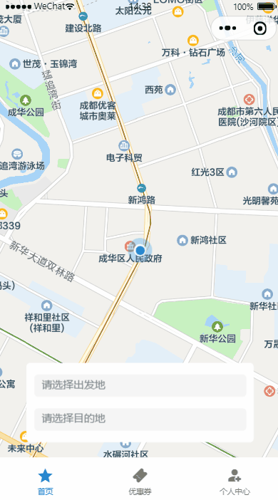
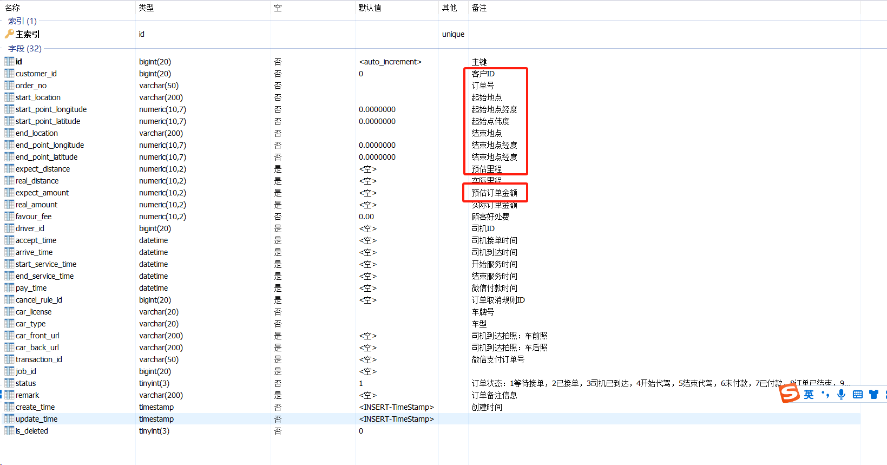

## 乘客下单（一）

### 1、需求说明

乘客下单如图：



经过前面的选点、预估订单数据，接下来就就是呼叫代驾了（即：下单），下单参数：

```java
@Schema(description = "乘客id")
private Long customerId;

@Schema(description = "起始地点")
private String startLocation;

@Schema(description = "起始地点经度")
private BigDecimal startPointLongitude;

@Schema(description = "起始点伟度")
private BigDecimal startPointLatitude;

@Schema(description = "结束地点")
private String endLocation;

@Schema(description = "结束地点经度")
private BigDecimal endPointLongitude;

@Schema(description = "结束地点经度")
private BigDecimal endPointLatitude;

@Schema(description = "顾客好处费")
private BigDecimal favourFee = new BigDecimal(0);
```

这些参数，都是从前端页面获取的，顾客好处费为预留属性，有些时候代驾费用太低，司机没兴趣接单，那么乘客可以加价找代驾的情况使用。

然后我们再计算预估里程与预估价格，把这些属性都保存到订单表即可。

订单表：



圈着的为下单必须填充的表字段。

保存完订单数据就完事了吗？肯定不是的，因为还要启动任务调度，搜索附近可接单的代驾司机，这一过程相对复杂与繁琐，后续会逐渐完善，先完成一个简单的下单过程。


### 2、乘客下单

乘客下单时，我们拿到的订单费用都是预估费用，不是实际费用，因此下单时我们不插入账单信息，实际的账单信息是在代驾结束后产生的，实际的代驾里程会根据代驾过程中实时上传的金纬度计算获取，代驾过程中可能还要产生一些未知的费用，如：等时费、停车费、路桥费等。

#### 2.1、订单微服务接口

##### 2.1.1、OrderInfoForm

```java
@Data
@Schema(description = "订单实体")
public class OrderInfoForm {

    @Schema(description = "客户ID")
   private Long customerId;

    @Schema(description = "订单号")
   private String orderNo;

    @Schema(description = "起始地点")
   private String startLocation;

    @Schema(description = "起始地点经度")
   private BigDecimal startPointLongitude;

    @Schema(description = "起始点伟度")
   private BigDecimal startPointLatitude;

    @Schema(description = "结束地点")
   private String endLocation;

    @Schema(description = "结束地点经度")
   private BigDecimal endPointLongitude;

    @Schema(description = "结束地点经度")
   private BigDecimal endPointLatitude;

    @Schema(description = "顾客好处费")
    private BigDecimal favourFee;

    @Schema(description = "订单备注信息")
    private String remark;


    //预期费用信息
    @Schema(description = "预估订单费用")
    private BigDecimal expectAmount;

    @Schema(description = "预估里程")
    private BigDecimal expectDistance;

}
```

##### 2.1.2、OrderInfoController

```java
@Autowired
private OrderInfoService orderInfoService;

@Operation(summary = "保存订单信息")
@PostMapping("/saveOrderInfo")
public Result<Long> saveOrderInfo(@RequestBody OrderInfoForm orderInfoForm) {
   return Result.ok(orderInfoService.saveOrderInfo(orderInfoForm));
}
```

##### 2.1.3、OrderInfoService

```
Long saveOrderInfo(OrderInfoForm orderInfoForm);
```

##### 2.1.4、OrderInfoServiceImpl

```java
@Autowired
private OrderInfoMapper orderInfoMapper;

@Autowired
private OrderStatusLogMapper orderStatusLogMapper;

@Autowired
private RedisTemplate redisTemplate;

@Transactional(rollbackFor = {Exception.class})
@Override
public Long saveOrderInfo(OrderInfoForm orderInfoForm) {
   OrderInfo orderInfo = new OrderInfo();
   BeanUtils.copyProperties(orderInfoForm, orderInfo);
   String orderNo = UUID.randomUUID().toString().replaceAll("-","");
   orderInfo.setStatus(OrderStatus.WAITING_ACCEPT.getStatus());
   orderInfo.setOrderNo(orderNo);
   orderInfoMapper.insert(orderInfo);

   //记录日志
   this.log(orderInfo.getId(), orderInfo.getStatus());

   //接单标识，标识不存在了说明不在等待接单状态了
   redisTemplate.opsForValue().set(RedisConstant.ORDER_ACCEPT_MARK, "0", RedisConstant.ORDER_ACCEPT_MARK_EXPIRES_TIME, TimeUnit.MINUTES);
   return orderInfo.getId();
}

public void log(Long orderId, Integer status) {
   OrderStatusLog orderStatusLog = new OrderStatusLog();
   orderStatusLog.setOrderId(orderId);
   orderStatusLog.setOrderStatus(status);
   orderStatusLog.setOperateTime(new Date());
   orderStatusLogMapper.insert(orderStatusLog);
}
```


#### 2.2、Feign接口

##### 2.2.1、OrderInfoFeignClient

```java
/**
 * 保存订单信息
 * @param orderInfoForm
 * @return
 */
@PostMapping("/order/info/saveOrderInfo")
Result<Long> saveOrderInfo(@RequestBody OrderInfoForm orderInfoForm);
```


#### 2.3、乘客端web接口

##### 2.3.1、SubmitOrderForm

乘客下单的参数

```java
@Data
public class SubmitOrderForm {

    @Schema(description = "乘客id")
    private Long customerId;

    @Schema(description = "起始地点")
    private String startLocation;

    @Schema(description = "起始地点经度")
    private BigDecimal startPointLongitude;

    @Schema(description = "起始点伟度")
    private BigDecimal startPointLatitude;

    @Schema(description = "结束地点")
    private String endLocation;

    @Schema(description = "结束地点经度")
    private BigDecimal endPointLongitude;

    @Schema(description = "结束地点经度")
    private BigDecimal endPointLatitude;

    @Schema(description = "顾客好处费")
    private BigDecimal favourFee = new BigDecimal(0);
    
}
```

说明：支持乘客添加好处费，这样能快速激励司机接单

##### 2.3.2、OrderController

```java
@Operation(summary = "乘客下单")
@GuiguLogin
@PostMapping("/submitOrder")
public Result<Long> submitOrder(@RequestBody SubmitOrderForm submitOrderForm) {
   submitOrderForm.setCustomerId(AuthContextHolder.getUserId());
   return Result.ok(orderService.submitOrder(submitOrderForm));
}
```

##### 2.3.3、OrderService

```java
Long submitOrder(SubmitOrderForm submitOrderForm);
```

##### 2.3.4、OrderServiceImpl

```java
@Autowired
private OrderInfoFeignClient orderInfoFeignClient;

@Override
public Long submitOrder(SubmitOrderForm submitOrderForm) {
    //1.重新计算驾驶线路
    CalculateDrivingLineForm calculateDrivingLineForm = new CalculateDrivingLineForm();
    BeanUtils.copyProperties(submitOrderForm, calculateDrivingLineForm);
    DrivingLineVo drivingLineVo = mapFeignClient.calculateDrivingLine(calculateDrivingLineForm).getData();

    //2.重新计算订单费用
    FeeRuleRequestForm calculateOrderFeeForm = new FeeRuleRequestForm();
    calculateOrderFeeForm.setDistance(drivingLineVo.getDistance());
    calculateOrderFeeForm.setStartTime(new Date());
    calculateOrderFeeForm.setWaitMinute(0);
    FeeRuleResponseVo feeRuleResponseVo = feeRuleFeignClient.calculateOrderFee(calculateOrderFeeForm).getData();

    //3.封装订单信息对象
    OrderInfoForm orderInfoForm = new OrderInfoForm();
    //订单位置信息
    BeanUtils.copyProperties(submitOrderForm, orderInfoForm);
    //预估里程
    orderInfoForm.setExpectDistance(drivingLineVo.getDistance());
    orderInfoForm.setExpectAmount(feeRuleResponseVo.getTotalAmount());

    //4.保存订单信息
    Long orderId = orderInfoFeignClient.saveOrderInfo(orderInfoForm).getData();
    
    //TODO启动任务调度
    
    return orderId;
}
```


### 3、乘客端查询订单状态

乘客下完单后，订单状态为1，乘客端小程序会轮询订单状态，当订单状态为2时，说明已经有司机接单了，那么页面进行跳转，进行下一步操作

#### 3.1、订单微服务接口

##### 3.1.1、OrderInfoController

```java
@Operation(summary = "根据订单id获取订单状态")
@GetMapping("/getOrderStatus/{orderId}")
public Result<Integer> getOrderStatus(@PathVariable Long orderId) {
   return Result.ok(orderInfoService.getOrderStatus(orderId));
}
```

##### 3.1.2、OrderInfoService

```java
Integer getOrderStatus(Long orderId);
```

##### 3.1.2、OrderInfoServiceImpl

```java
@Override
public Integer getOrderStatus(Long orderId) {
   LambdaQueryWrapper<OrderInfo> queryWrapper = new LambdaQueryWrapper<>();
   queryWrapper.eq(OrderInfo::getId, orderId);
   queryWrapper.select(OrderInfo::getStatus);
   OrderInfo orderInfo = orderInfoMapper.selectOne(queryWrapper);
   if(null == orderInfo) {
      //返回null，feign解析会抛出异常，给默认值，后续会用
      return OrderStatus.NULL_ORDER.getStatus();
   }
   return orderInfo.getStatus();
}
```


#### 3.2、 Feign接口

##### 3.2.1、OrderInfoFeignClient

```java
/**
 * 根据订单id获取订单状态
 * @param orderId
 * @return
 */
@GetMapping("/order/info/getOrderStatus/{orderId}")
Result<Integer> getOrderStatus(@PathVariable("orderId") Long orderId);
```


#### 3.3、 乘客端web接口

##### 3.3.1、OrderController

```java
@Operation(summary = "查询订单状态")
@GuiguLogin
@GetMapping("/getOrderStatus/{orderId}")
public Result<Integer> getOrderStatus(@PathVariable Long orderId) {
   return Result.ok(orderService.getOrderStatus(orderId));
}
```

##### 3.3.2、OrderService

```java
Integer getOrderStatus(Long orderId);
```

##### 3.3.3、OrderServiceImpl

```java
@Override
public Integer getOrderStatus(Long orderId) {
    return orderInfoFeignClient.getOrderStatus(orderId).getData();
}
```


### 4、司机端查询订单状态

司机端也是一样的，司机端也会轮询订单状态，根据订单状态进行页面跳转，我们先把这个接口给提供了。

#### 4.1、 司机端web接口

##### 4.1.1、OrderController

```java
@Operation(summary = "查询订单状态")
@GuiguLogin
@GetMapping("/getOrderStatus/{orderId}")
public Result<Integer> getOrderStatus(@PathVariable Long orderId) {
   return Result.ok(orderService.getOrderStatus(orderId));
}
```

##### 4.1.2、OrderService

```java
Integer getOrderStatus(Long orderId);
```

##### 4.1.3、OrderServiceImpl

```java
@Override
public Integer getOrderStatus(Long orderId) {
    return orderInfoFeignClient.getOrderStatus(orderId).getData();
}
```

