# 乘客下单（二）

## 一、搜索附近司机

### 1、Redis的Geo功能

前面我们创建了订单，但是略过了寻找附近适合接单的司机。接下来完善这部分功能，那就先来看看怎么查询附近的司机吧。假设司机端的小程序实时把自己的GPS定位上传，然后定位信息缓存到Redis里面。咱们怎么能利用Redis计算出，上车点方圆几公里的司机都有谁呢？这就需要使用Redis的Geo功能。

https://redis.io/docs/latest/develop/data-types/

Redis的Geo主要用于存储地理位置信息，并对存储的信息进行操作，该功能在 Redis 3.2 版本新增。 下面我们用`GEOADD`命令向Redis里面添加几个景点的定位。

```bash
GEOADD gugong 116.403963 39.915119 tiananmen 116.417876 39.915411 wangfujing 116.404354 39.904748 qianmen
```

然后我们`GEORADIUS`命令查询距离某个定位点1公里范围以内的景点有哪些。

```bash
GEORADIUS gugong 116.4000 39.9000 1 km WITHDIST
```

既然Redis的GEO命令可以帮我们提取出某个坐标点指定距离以内的景点，如果Redis里面缓存的是司机的定位信息，那么我们用代驾单的起点坐标来查询附近几公里以内的司机，是不是也可以？而且Redis的Geo计算是在内存中完成的，比MySQL的Geo计算快了上千倍。


### 2、实时更新司机位置信息

前面我们弄明白了Redis的GEO技术。咱们想要让Redis计算代驾起点周围几公里以内的司机，首先我们要把司机的定位信息缓存到GEO里面。

司机开启接单服务后，司机端小程序就会实时上传经纬度信息到redis的GEO，关闭接单服务我们就要清空GEO数据，当前就一并把更新与删除司机位置信息给写了，删除不需要提供web接口，其他service服务方法调用。

#### 2.1、封装地图微服务接口

##### 2.1.1、LocationController

```java
@Autowired
private LocationService locationService;

@Operation(summary = "开启接单服务：更新司机经纬度位置")
@PostMapping("/updateDriverLocation")
public Result<Boolean> updateDriverLocation(@RequestBody UpdateDriverLocationForm updateDriverLocationForm) {
   return Result.ok(locationService.updateDriverLocation(updateDriverLocationForm));
}

@Operation(summary = "关闭接单服务：删除司机经纬度位置")
@DeleteMapping("/removeDriverLocation/{driverId}")
public Result<Boolean> removeDriverLocation(@PathVariable Long driverId) {
    return Result.ok(locationService.removeDriverLocation(driverId));
}
```

##### 2.1.2、LocationService

```java
Boolean updateDriverLocation(UpdateDriverLocationForm updateDriverLocationForm);

Boolean removeDriverLocation(Long driverId);
```

##### 2.1.3、LocationServiceImpl

```java
@Autowired
private RedisTemplate redisTemplate;

@Override
public Boolean updateDriverLocation(UpdateDriverLocationForm updateDriverLocationForm) {
    /**
     *  Redis GEO 主要用于存储地理位置信息，并对存储的信息进行相关操作，该功能在 Redis 3.2 版本新增。
     *  后续用在，乘客下单后寻找5公里范围内开启接单服务的司机，通过Redis GEO进行计算
     */
    Point point = new Point(updateDriverLocationForm.getLongitude().doubleValue(), updateDriverLocationForm.getLatitude().doubleValue());
    redisTemplate.opsForGeo().add(RedisConstant.DRIVER_GEO_LOCATION, point, updateDriverLocationForm.getDriverId().toString());
    return true;
}

 @Override
public Boolean removeDriverLocation(Long driverId) {
    redisTemplate.opsForGeo().remove(RedisConstant.DRIVER_GEO_LOCATION, driverId.toString());
    return true;
}
```


#### 2.2、Feign接口

##### 2.2.1、LocationFeignClient

```java
/**
 * 开启接单服务：更新司机经纬度位置
 * @param updateDriverLocationForm
 * @return
 */
@PostMapping("/map/location/updateDriverLocation")
Result<Boolean> updateDriverLocation(@RequestBody UpdateDriverLocationForm updateDriverLocationForm);

/**
 * 关闭接单服务：删除司机经纬度位置
 * @param driverId
 * @return
 */
@DeleteMapping("/map/location/removeDriverLocation/{driverId}")
Result<Boolean> removeDriverLocation(@PathVariable("driverId") Long driverId);
```


#### 2.3、司机端web接口

##### 2.3.1、LocationController

```java
@Autowired
private LocationService locationService;

@Operation(summary = "开启接单服务：更新司机经纬度位置")
@GuiguLogin
@PostMapping("/updateDriverLocation")
public Result<Boolean> updateDriverLocation(@RequestBody UpdateDriverLocationForm updateDriverLocationForm) {
   Long driverId = AuthContextHolder.getUserId();
   updateDriverLocationForm.setDriverId(driverId);
   return Result.ok(locationService.updateDriverLocation(updateDriverLocationForm));
}
```

##### 2.3.1、LocationService

```java
Boolean updateDriverLocation(UpdateDriverLocationForm updateDriverLocationForm);
```

##### 2.3.1、LocationServiceImpl

```java
@Override
public Boolean updateDriverLocation(UpdateDriverLocationForm updateDriverLocationForm) {
    return locationFeignClient.updateDriverLocation(updateDriverLocationForm).getData();
}
```


### 3、获取司机个性化设置消息

司机针对接单，有一些个性化设置，只有满足了这些条件，才可以接单，如：“实时更新司机位置信息”，只有开启了接单服务，接口才可以更新数据

#### 3.1、设置表

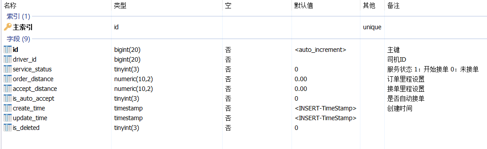

**说明：**

service_status：服务状态，司机开启了接单，才能进行接单后的一些列操作；

order_distance：订单里程设置，如：order_distance=0（不限制）；order_distance=50（只接代驾里程在50公里范围内的订单）；

accept_distance：接单里程设置，司机起始点距离司机的位置，如：accept_distance=3（只接收3公里范围内的订单）；

is_auto_accept：是否自动接单，开启后，系统自动抢单，不需要手动点接单按钮；


#### 3.2、司机微服务接口

##### 3.2.1、DriverInfoController

```java
@Operation(summary = "获取司机设置信息")
@GetMapping("/getDriverSet/{driverId}")
public Result<DriverSet> getDriverSet(@PathVariable Long driverId) {
   return Result.ok(driverInfoService.getDriverSet(driverId));
}
```

##### 3.2.2、DriverInfoService

```java
DriverSet getDriverSet(Long driverId);
```

##### 3.2.2、DriverInfoServiceImpl

```java
@Autowired
private DriverSetMapper driverSetMapper;

@Override
public DriverSet getDriverSet(Long driverId) {
    LambdaQueryWrapper<DriverSet> queryWrapper = new LambdaQueryWrapper<>();
    queryWrapper.eq(DriverSet::getDriverId, driverId);
    return driverSetMapper.selectOne(queryWrapper);
}
```


#### 3.3、Feign接口

##### 3.3.1、DriverInfoFeignClient

```java
/**
 * 获取司机设置信息
 * @param driverId
 * @return
 */
@GetMapping("/driver/info/getDriverSet/{driverId}")
Result<DriverSet> getDriverSet(@PathVariable("driverId") Long driverId);
```


#### 3.4、更新“实时更新司机位置信息”web接口

##### 3.4.1、LocationServiceImpl

```java
@Autowired
private DriverInfoFeignClient driverInfoFeignClient;

@Override
public Boolean updateDriverLocation(UpdateDriverLocationForm updateDriverLocationForm) {
    //开启接单了才能更新司机接单位置
    DriverSet driverSet = driverInfoFeignClient.getDriverSet(updateDriverLocationForm.getDriverId()).getData();
    if(driverSet.getServiceStatus().intValue() == 1) {
        return locationFeignClient.updateDriverLocation(updateDriverLocationForm).getData();
    } else {
        throw new GuiguException(ResultCodeEnum.NO_START_SERVICE);
    }
}
```


### 4、搜索附近适合接单的司机

司机端的小程序开启接单服务后，开始实时上传司机的定位信息到redis的GEO缓存，前面乘客已经下单，现在我们就要查找附近适合接单的司机，如果有对应的司机，那就给司机发送新订单消息。

#### 4.1、地图微服务接口

##### 4.1.1、LocationController

```java
@Operation(summary = "搜索附近满足条件的司机")
@PostMapping("/searchNearByDriver")
public Result<List<NearByDriverVo>> searchNearByDriver(@RequestBody SearchNearByDriverForm searchNearByDriverForm) {
   return Result.ok(locationService.searchNearByDriver(searchNearByDriverForm));
}
```

##### 4.1.2、LocationService

```java
List<NearByDriverVo> searchNearByDriver(SearchNearByDriverForm searchNearByDriverForm);
```

##### 4.1.3、LocationServiceImpl

```java
@Autowired
private DriverInfoFeignClient driverInfoFeignClient;

@Override
public List<NearByDriverVo> searchNearByDriver(SearchNearByDriverForm searchNearByDriverForm) {
    // 搜索经纬度位置5公里以内的司机
    //定义经纬度点
    Point point = new Point(searchNearByDriverForm.getLongitude().doubleValue(), searchNearByDriverForm.getLatitude().doubleValue());
    //定义距离：5公里(系统配置)
    Distance distance = new Distance(SystemConstant.NEARBY_DRIVER_RADIUS, RedisGeoCommands.DistanceUnit.KILOMETERS);
    //定义以point点为中心，distance为距离这么一个范围
    Circle circle = new Circle(point, distance);

    //定义GEO参数
    RedisGeoCommands.GeoRadiusCommandArgs args = RedisGeoCommands.GeoRadiusCommandArgs.newGeoRadiusArgs()
            .includeDistance() //包含距离
            .includeCoordinates() //包含坐标
            .sortAscending(); //排序：升序

    // 1.GEORADIUS获取附近范围内的信息
    GeoResults<RedisGeoCommands.GeoLocation<String>> result = this.redisTemplate.opsForGeo().radius(RedisConstant.DRIVER_GEO_LOCATION, circle, args);

    //2.收集信息，存入list
    List<GeoResult<RedisGeoCommands.GeoLocation<String>>> content = result.getContent();

    //3.返回计算后的信息
    List<NearByDriverVo> list = new ArrayList();
    if(!CollectionUtils.isEmpty(content)) {
        Iterator<GeoResult<RedisGeoCommands.GeoLocation<String>>> iterator = content.iterator();
        while (iterator.hasNext()) {
            GeoResult<RedisGeoCommands.GeoLocation<String>> item = iterator.next();

            //司机id
            Long driverId = Long.parseLong(item.getContent().getName());
            //当前距离
            BigDecimal currentDistance = new BigDecimal(item.getDistance().getValue()).setScale(2, RoundingMode.HALF_UP);
            log.info("司机：{}，距离：{}",driverId, item.getDistance().getValue());

            //获取司机接单设置参数
            DriverSet driverSet = driverInfoFeignClient.getDriverSet(driverId).getData();
            //接单里程判断，acceptDistance==0：不限制，
            if(driverSet.getAcceptDistance().doubleValue() != 0 && driverSet.getAcceptDistance().subtract(currentDistance).doubleValue() < 0) {
                continue;
            }
            //订单里程判断，orderDistance==0：不限制
            if(driverSet.getOrderDistance().doubleValue() != 0 && driverSet.getOrderDistance().subtract(searchNearByDriverForm.getMileageDistance()).doubleValue() < 0) {
                continue;
            }

            //满足条件的附近司机信息
            NearByDriverVo nearByDriverVo = new NearByDriverVo();
            nearByDriverVo.setDriverId(driverId);
            nearByDriverVo.setDistance(currentDistance);
            list.add(nearByDriverVo);
        }
    }
    return list;
}
```


#### 4.2、Feign接口

##### 4.2.1、LocationFeignClient

```java
/**
 * 搜索附近满足条件的司机
 * @param searchNearByDriverForm
 * @return
 */
@PostMapping("/map/location/searchNearByDriver")
Result<List<NearByDriverVo>> searchNearByDriver(@RequestBody SearchNearByDriverForm searchNearByDriverForm);
```


#### 4.3、接口测试

1、swagger调用“实时更新司机位置信息”接口，更新司机位置信息

2、swagger调用“搜索附近适合接单的司机”接口，接口经纬度在5公里范围内


## 二、任务调度

前面乘客端已经下单了，附近的司机我们也能搜索了，接下来我们就要看怎么把这两件事给关联上？

乘客下单，搜索附近的司机，但是可能当时附近有司机，也有可能当时附近没有司机，乘客下单的一个等待时间为15分钟（15分钟后系统自动取消订单），那么下单与搜索司机怎么关联上呢？答案肯定是任务调度。

乘客下单了，然后启动一个任务调度，每隔1分钟执行一次搜索附近司机的任务调度，只要在15分钟内没有司机接单，那么就必须一直查找附近适合的司机，直到15分钟内有司机接单为止。任务调度搜索到满足条件的司机后，会在服务器端给司机建立一个临时队列（1分钟过期），把新订单数据放入队列，司机小程序端开启接单服务后，每隔几秒轮询获取临时队列里面的新订单数据，在小程序前端进行语音播报，司机即可进行抢单操作。

### 1、定时任务调度框架

#### 1.1、单机

- Timer：这是 java 自带的 java.util.Timer 类，这个类允许你调度一个 java.util.TimerTask 任务。使用这种方式可以让你的程序按照某一个频度执行，但不能在指定时间运行。一般用的较少。
- ScheduledExecutorService：也 jdk 自带的一个类；是基于线程池设计的定时任务类，每个调度任务都会分配到线程池中的一个线程去执行，也就是说，任务是并发执行，互不影响。
- Spring Task：Spring3.0 以后自带的 task，配置简单功能较多，如果系统使用单机的话可以优先考虑spring定时器。

#### 1.2、分布式

- Quartz：Java事实上的定时任务标准。但Quartz关注点在于定时任务而非数据，并无一套根据数据处理而定制化的流程。虽然Quartz可以基于数据库实现作业的高可用，但缺少分布式并行调度的功能。
- TBSchedule：阿里早期开源的分布式任务调度系统。代码略陈旧，使用timer而非线程池执行任务调度。众所周知，timer在处理异常状况时是有缺陷的。而且TBSchedule作业类型较为单一，只能是获取/处理数据一种模式。还有就是文档缺失比较严重。
- elastic-job：当当开发的弹性分布式任务调度系统，功能丰富强大，采用zookeeper实现分布式协调，实现任务高可用以及分片，并且可以支持云开发。
- Saturn：是唯品会自主研发的分布式的定时任务的调度平台，基于当当的elastic-job 版本1开发，并且可以很好的部署到docker容器上。
- xxl-job: 是大众点评员工徐雪里于2015年发布的分布式任务调度平台，是一个轻量级分布式任务调度框架，其核心设计目标是开发迅速、学习简单、轻量级、易扩展，其在唯品会内部已经发部署350+个节点，每天任务调度4000多万次。同时，管理和统计也是它的亮点。使用案例 大众点评、易信(IM)、京东(电商系统)、360金融(金融系统)、易企秀、随行付(支付系统)、优信二手车。

我们项目选择：XXL-JOB


### 2、分布式任务调度平台XXL-JOB

官方文档：https://www.xuxueli.com/xxl-job/

#### 2.1、概述

XXL-JOB是一个分布式任务调度平台，其核心设计目标是开发迅速、学习简单、轻量级、易扩展。现已开放源代码并接入多家公司线上产品线，开箱即用。


#### 2.2、特性（仅了解）

- 1、简单：支持通过Web页面对任务进行CRUD操作，操作简单，一分钟上手；
- 2、动态：支持动态修改任务状态、启动/停止任务，以及终止运行中任务，即时生效；
- 3、调度中心HA（中心式）：调度采用中心式设计，“调度中心”自研调度组件并支持集群部署，可保证调度中心HA；
- 4、执行器HA（分布式）：任务分布式执行，任务”执行器”支持集群部署，可保证任务执行HA；
- 5、注册中心: 执行器会周期性自动注册任务, 调度中心将会自动发现注册的任务并触发执行。同时，也支持手动录入执行器地址；
- 6、弹性扩容缩容：一旦有新执行器机器上线或者下线，下次调度时将会重新分配任务；
- 7、触发策略：提供丰富的任务触发策略，包括：Cron触发、固定间隔触发、固定延时触发、API（事件）触发、人工触发、父子任务触发；
- 8、调度过期策略：调度中心错过调度时间的补偿处理策略，包括：忽略、立即补偿触发一次等；
- 9、阻塞处理策略：调度过于密集执行器来不及处理时的处理策略，策略包括：单机串行（默认）、丢弃后续调度、覆盖之前调度；
- 10、任务超时控制：支持自定义任务超时时间，任务运行超时将会主动中断任务；
- 11、任务失败重试：支持自定义任务失败重试次数，当任务失败时将会按照预设的失败重试次数主动进行重试；其中分片任务支持分片粒度的失败重试；
- 12、任务失败告警；默认提供邮件方式失败告警，同时预留扩展接口，可方便的扩展短信、钉钉等告警方式；
- 13、路由策略：执行器集群部署时提供丰富的路由策略，包括：第一个、最后一个、轮询、随机、一致性HASH、最不经常使用、最近最久未使用、故障转移、忙碌转移等；
- 14、分片广播任务：执行器集群部署时，任务路由策略选择”分片广播”情况下，一次任务调度将会广播触发集群中所有执行器执行一次任务，可根据分片参数开发分片任务；
- 15、动态分片：分片广播任务以执行器为维度进行分片，支持动态扩容执行器集群从而动态增加分片数量，协同进行业务处理；在进行大数据量业务操作时可显著提升任务处理能力和速度。
- 16、故障转移：任务路由策略选择”故障转移”情况下，如果执行器集群中某一台机器故障，将会自动Failover切换到一台正常的执行器发送调度请求。
- 17、任务进度监控：支持实时监控任务进度；
- 18、Rolling实时日志：支持在线查看调度结果，并且支持以Rolling方式实时查看执行器输出的完整的执行日志；
- 19、GLUE：提供Web IDE，支持在线开发任务逻辑代码，动态发布，实时编译生效，省略部署上线的过程。支持30个版本的历史版本回溯。
- 20、脚本任务：支持以GLUE模式开发和运行脚本任务，包括Shell、Python、NodeJS、PHP、PowerShell等类型脚本;
- 21、命令行任务：原生提供通用命令行任务Handler（Bean任务，”CommandJobHandler”）；业务方只需要提供命令行即可；
- 22、任务依赖：支持配置子任务依赖，当父任务执行结束且执行成功后将会主动触发一次子任务的执行, 多个子任务用逗号分隔；
- 23、一致性：“调度中心”通过DB锁保证集群分布式调度的一致性, 一次任务调度只会触发一次执行；
- 24、自定义任务参数：支持在线配置调度任务入参，即时生效；
- 25、调度线程池：调度系统多线程触发调度运行，确保调度精确执行，不被堵塞；
- 26、数据加密：调度中心和执行器之间的通讯进行数据加密，提升调度信息安全性；
- 27、邮件报警：任务失败时支持邮件报警，支持配置多邮件地址群发报警邮件；
- 28、推送maven中央仓库: 将会把最新稳定版推送到maven中央仓库, 方便用户接入和使用;
- 29、运行报表：支持实时查看运行数据，如任务数量、调度次数、执行器数量等；以及调度报表，如调度日期分布图，调度成功分布图等；
- 30、全异步：任务调度流程全异步化设计实现，如异步调度、异步运行、异步回调等，有效对密集调度进行流量削峰，理论上支持任意时长任务的运行；
- 31、跨语言：调度中心与执行器提供语言无关的 RESTful API 服务，第三方任意语言可据此对接调度中心或者实现执行器。除此之外，还提供了 “多任务模式”和“httpJobHandler”等其他跨语言方案；
- 32、国际化：调度中心支持国际化设置，提供中文、英文两种可选语言，默认为中文；
- 33、容器化：提供官方docker镜像，并实时更新推送dockerhub，进一步实现产品开箱即用；
- 34、线程池隔离：调度线程池进行隔离拆分，慢任务自动降级进入”Slow”线程池，避免耗尽调度线程，提高系统稳定性；
- 35、用户管理：支持在线管理系统用户，存在管理员、普通用户两种角色；
- 36、权限控制：执行器维度进行权限控制，管理员拥有全量权限，普通用户需要分配执行器权限后才允许相关操作；


#### 2.3、下载

**文档地址**

- [中文文档](https://www.xuxueli.com/xxl-job/)
- [English Documentation](https://www.xuxueli.com/xxl-job/en/)

**源码仓库地址**

| 源码仓库地址                           | Release Download                                          |
| -------------------------------------- | --------------------------------------------------------- |
| <https://github.com/xuxueli/xxl-job>   | [Download](https://github.com/xuxueli/xxl-job/releases)   |
| <http://gitee.com/xuxueli0323/xxl-job> | [Download](http://gitee.com/xuxueli0323/xxl-job/releases) |

**中央仓库地址**

当前项目使用版本：2.4.1-SNAPSHOT

注：为了统一版本，已统一下载，在资料中获取：xxl-job-master.zip

```xml
<dependency>
    <groupId>com.xuxueli</groupId>
    <artifactId>xxl-job-core</artifactId>
    <version>${最新稳定版本}</version>
</dependency>
```


#### 2.4、快速入门

##### 2.4.1、导入项目到idea

解压：xxl-job-master.zip，导入idea，如图：

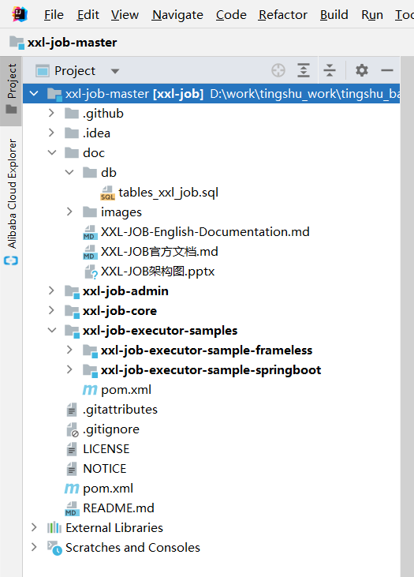

项目结构说明：

```yaml
xxl-job-master：
    xxl-job-admin：调度中心
    xxl-job-core：公共依赖
    xxl-job-executor-samples：执行器Sample示例（选择合适的版本执行器，可直接使用，也可以参考其并将现有项目改造成执行器）
        xxl-job-executor-sample-springboot：Springboot版本，通过Springboot管理执行器，推荐这种方式；
        xxl-job-executor-sample-frameless：无框架版本；
```

##### 2.4.2、初始化“调度数据库”

获取 “调度数据库初始化SQL脚本” 并执行即可。

调度数据库初始化SQL脚本” 位置为：

```
/xxl-job-master/doc/db/tables_xxl_job.sql
```

##### 2.4.3、部署”调度中心“

```
调度中心项目：xxl-job-admin
作用：统一管理任务调度平台上调度任务，负责触发调度执行，并且提供任务管理平台。     
```

###### 步骤一：修改数据库连接

```properties
### xxl-job, datasource
spring.datasource.url=jdbc:mysql://localhost:3306/xxl_job?useUnicode=true&characterEncoding=UTF-8&autoReconnect=true&serverTimezone=Asia/Shanghai
spring.datasource.username=root
spring.datasource.password=root
spring.datasource.driver-class-name=com.mysql.cj.jdbc.Driver
```

###### 步骤二：启动项目

调度中心访问地址：<http://localhost:8080/xxl-job-admin> 

默认登录账号 “admin/123456”, 登录后运行界面如下图所示：

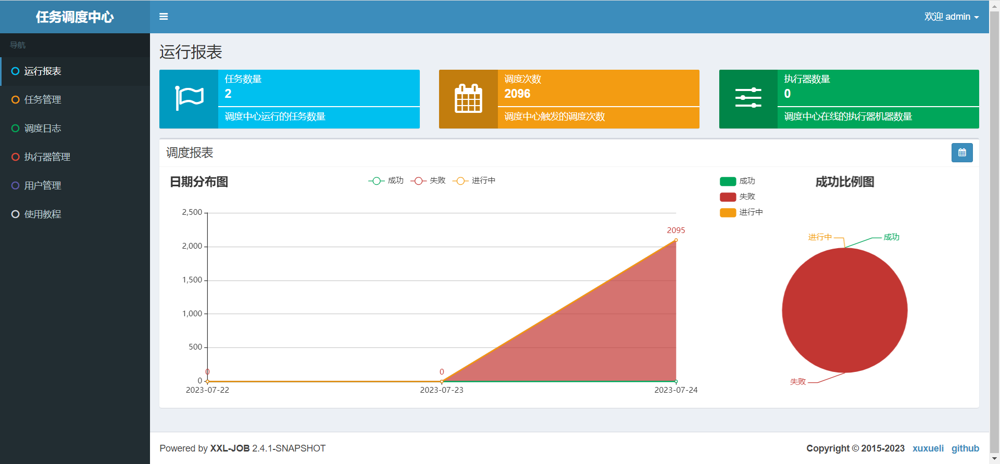

###### 步骤三：调度中心集群部署（可选）

调度中心支持集群部署，提升调度系统容灾和可用性。

调度中心集群部署时，几点要求和建议：

- DB配置保持一致；
- 集群机器时钟保持一致（单机集群忽视）；
- 建议：推荐通过nginx为调度中心集群做负载均衡，分配域名。调度中心访问、执行器回调配置、调用API服务等操作均通过该域名进行。

##### 2.4.4、配置部署“执行器项目”

```
“执行器”项目：xxl-job-executor-sample-springboot (提供多种版本执行器供选择，现以 springboot 版本为例，可直接使用，也可以参考其并将现有项目改造成执行器)
作用：负责接收“调度中心”的调度并执行；可直接部署执行器，也可以将执行器集成到现有业务项目中。
```

###### 步骤一：maven依赖

确认pom文件中引入了 “xxl-job-core” 的maven依赖；

```xml
<!-- xxl-job-core -->
<dependency>
    <groupId>com.xuxueli</groupId>
    <artifactId>xxl-job-core</artifactId>
    <version>2.4.1-SNAPSHOT</version>
</dependency>
```

###### 步骤二：执行器配置

执行器配置，配置内容说明：

```properties
### 调度中心部署根地址 [选填]：如调度中心集群部署存在多个地址则用逗号分隔。执行器将会使用该地址进行"执行器心跳注册"和"任务结果回调"；为空则关闭自动注册；
xxl.job.admin.addresses=http://127.0.0.1:8080/xxl-job-admin
### 执行器通讯TOKEN [选填]：非空时启用；
xxl.job.accessToken=
### 执行器AppName [选填]：执行器心跳注册分组依据；为空则关闭自动注册
xxl.job.executor.appname=xxl-job-executor-sample
### 执行器注册 [选填]：优先使用该配置作为注册地址，为空时使用内嵌服务 ”IP:PORT“ 作为注册地址。从而更灵活的支持容器类型执行器动态IP和动态映射端口问题。
xxl.job.executor.address=
### 执行器IP [选填]：默认为空表示自动获取IP，多网卡时可手动设置指定IP，该IP不会绑定Host仅作为通讯实用；地址信息用于 "执行器注册" 和 "调度中心请求并触发任务"；
xxl.job.executor.ip=
### 执行器端口号 [选填]：小于等于0则自动获取；默认端口为9999，单机部署多个执行器时，注意要配置不同执行器端口；
xxl.job.executor.port=9999
### 执行器运行日志文件存储磁盘路径 [选填] ：需要对该路径拥有读写权限；为空则使用默认路径；
xxl.job.executor.logpath=/data/applogs/xxl-job/jobhandler
### 执行器日志文件保存天数 [选填] ： 过期日志自动清理, 限制值大于等于3时生效; 否则, 如-1, 关闭自动清理功能；
xxl.job.executor.logretentiondays=30
```

###### 步骤三：执行器组件配置

执行器组件，配置内容说明：

```java
package com.xxl.job.executor.core.config;

import com.xxl.job.core.executor.impl.XxlJobSpringExecutor;
import org.slf4j.Logger;
import org.slf4j.LoggerFactory;
import org.springframework.beans.factory.annotation.Value;
import org.springframework.context.annotation.Bean;
import org.springframework.context.annotation.Configuration;

/**
 * xxl-job config
 *
 * @author xuxueli 2017-04-28
 */
@Configuration
public class XxlJobConfig {
    private Logger logger = LoggerFactory.getLogger(XxlJobConfig.class);

    @Value("${xxl.job.admin.addresses}")
    private String adminAddresses;

    @Value("${xxl.job.accessToken}")
    private String accessToken;

    @Value("${xxl.job.executor.appname}")
    private String appname;

    @Value("${xxl.job.executor.address}")
    private String address;

    @Value("${xxl.job.executor.ip}")
    private String ip;

    @Value("${xxl.job.executor.port}")
    private int port;

    @Value("${xxl.job.executor.logpath}")
    private String logPath;

    @Value("${xxl.job.executor.logretentiondays}")
    private int logRetentionDays;


    @Bean
    public XxlJobSpringExecutor xxlJobExecutor() {
        logger.info(">>>>>>>>>>> xxl-job config init.");
        XxlJobSpringExecutor xxlJobSpringExecutor = new XxlJobSpringExecutor();
        xxlJobSpringExecutor.setAdminAddresses(adminAddresses);
        xxlJobSpringExecutor.setAppname(appname);
        xxlJobSpringExecutor.setAddress(address);
        xxlJobSpringExecutor.setIp(ip);
        xxlJobSpringExecutor.setPort(port);
        xxlJobSpringExecutor.setAccessToken(accessToken);
        xxlJobSpringExecutor.setLogPath(logPath);
        xxlJobSpringExecutor.setLogRetentionDays(logRetentionDays);

        return xxlJobSpringExecutor;
    }

    /**
     * 针对多网卡、容器内部署等情况，可借助 "spring-cloud-commons" 提供的 "InetUtils" 组件灵活定制注册IP；
     *
     *      1、引入依赖：
     *          <dependency>
     *             <groupId>org.springframework.cloud</groupId>
     *             <artifactId>spring-cloud-commons</artifactId>
     *             <version>${version}</version>
     *         </dependency>
     *
     *      2、配置文件，或者容器启动变量
     *          spring.cloud.inetutils.preferred-networks: 'xxx.xxx.xxx.'
     *
     *      3、获取IP
     *          String ip_ = inetUtils.findFirstNonLoopbackHostInfo().getIpAddress();
     */


}
```

###### 步骤四：启动执行器项目：

启动：xxl-job-executor-sample-springboot

###### 步骤五：执行器集群（可选）：

执行器支持集群部署，提升调度系统可用性，同时提升任务处理能力。

执行器集群部署时，几点要求和建议：

- 执行器回调地址（xxl.job.admin.addresses）需要保持一致；执行器根据该配置进行执行器自动注册等操作。
- 同一个执行器集群内AppName（xxl.job.executor.appname）需要保持一致；调度中心根据该配置动态发现不同集群的在线执行器列表。

##### 2.4.5、第一个任务调度

###### 步骤一：配置执行器

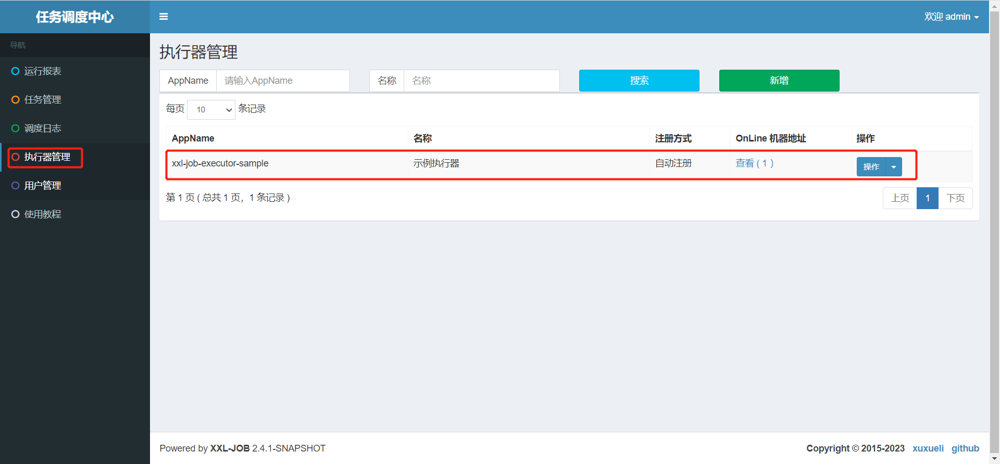

上面我们启动了xxl-job-executor-sample-springboot 执行器项目，当前已注册上来，我们执行使用改执行器。

执行器属性说明：

```
AppName: 是每个执行器集群的唯一标示AppName, 执行器会周期性以AppName为对象进行自动注册。可通过该配置自动发现注册成功的执行器, 供任务调度时使用;
名称: 执行器的名称, 因为AppName限制字母数字等组成,可读性不强, 名称为了提高执行器的可读性;排序: 执行器的排序, 系统中需要执行器的地方,如任务新增, 将会按照该排序读取可用的执行器列表;
注册方式：调度中心获取执行器地址的方式；    
	自动注册：执行器自动进行执行器注册，调度中心通过底层注册表可以动态发现执行器机器地址；    
	手动录入：人工手动录入执行器的地址信息，多地址逗号分隔，供调度中心使用；
机器地址："注册方式"为"手动录入"时有效，支持人工维护执行器的地址信息；
```

###### 步骤二：新建任务：

登录调度中心：<http://localhost:8080/xxl-job-admin> 

默认登录账号 “admin/123456”

任务管理 ==》 新增

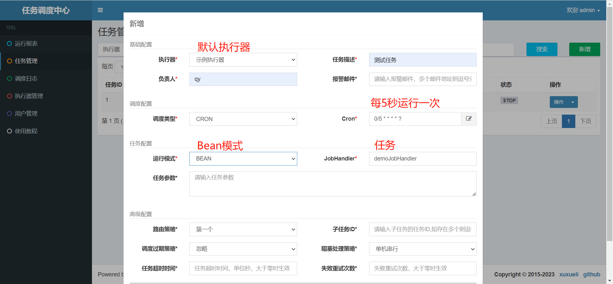

添加成功，如图：

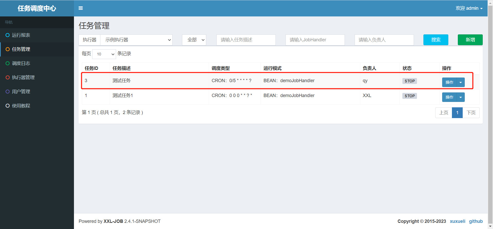

###### 步骤三：执行器项目开发job方法

使用xxl-job-executor-sample-springboot项目job实例，与步骤二的JobHandler配置一致

```java
/**
 * 1、简单任务示例（Bean模式）
 */
@XxlJob("demoJobHandler")
public void demoJobHandler() throws Exception {
    XxlJobHelper.log("XXL-JOB, Hello World.");

    for (int i = 0; i < 5; i++) {
        XxlJobHelper.log("beat at:" + i);
        TimeUnit.SECONDS.sleep(2);
    }
    // default success
}
```

###### 步骤四：启动任务

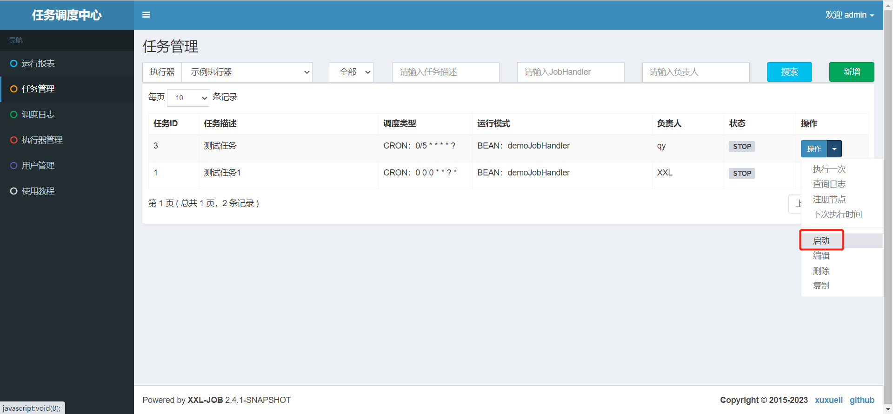

任务列表状态改变，如图：

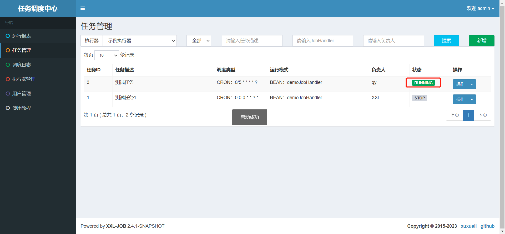

设置断点，执行结果：

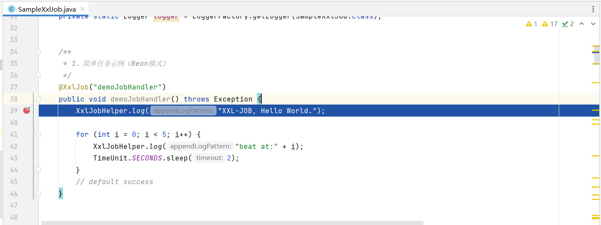

查看调度日志：

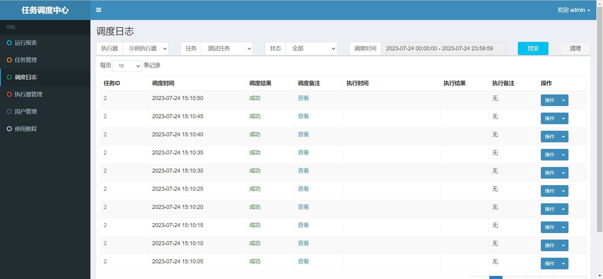


### 3、集成XXL-JOB

我们使用单独的一个微服务模块service-dispatch集成XXL-JOB执行器

#### 3.1、maven依赖

已引入，就忽略

```xml
<!-- xxl-job-core -->
<dependency>
    <groupId>com.xuxueli</groupId>
    <artifactId>xxl-job-core</artifactId>
</dependency>
```

注：当前远程maven仓库只更新到2.4.0，也可以把上面项目包安装到本地仓库，对于当前项目使用这两个版本无差异


#### 3.2、执行器配置

```yaml
xxl:
  job:
    admin:
      # 调度中心部署跟地址 [选填]：如调度中心集群部署存在多个地址则用逗号分隔。执行器将会使用该地址进行"执行器心跳注册"和"任务结果回调"；为空则关闭自动注册
      addresses: http://localhost:8080/xxl-job-admin
      # 执行器通讯TOKEN [选填]：非空时启用
    accessToken: 

    executor:
      # 执行器AppName [选填]：执行器心跳注册分组依据；为空则关闭自动注册
      appname: xxl-job-executor-sample
      # 执行器注册 [选填]：优先使用该配置作为注册地址，为空时使用内嵌服务 ”IP:PORT“ 作为注册地址。从而更灵活的支持容器类型执行器动态IP和动态映射端口问题。
      address:
      # 执行器IP [选填]：默认为空表示自动获取IP，多网卡时可手动设置指定IP，该IP不会绑定Host仅作为通讯实用；地址信息用于 "执行器注册" 和 "调度中心请求并触发任务"；
      ip:
      # 执行器端口号 [选填]：小于等于0则自动获取；默认端口为9999，单机部署多个执行器时，注意要配置不同执行器端口；
      port: 9999
      # 执行器运行日志文件存储磁盘路径 [选填] ：需要对该路径拥有读写权限；为空则使用默认路径；
      logpath: /data/applogs/xxl-job/jobhandler
      # 执行器日志文件保存天数 [选填] ： 过期日志自动清理, 限制值大于等于3时生效; 否则, 如-1, 关闭自动清理功能；
      logretentiondays: 30
```

注：如果已配置，忽略


#### 3.3、执行器组件配置

将xxl-job-executor-sample-springboot 执行器项目的XxlJobConfig类复制过来

```java
package com.atguigu.daijia.dispatch.xxl.config;

import com.xxl.job.core.executor.impl.XxlJobSpringExecutor;
import org.slf4j.Logger;
import org.slf4j.LoggerFactory;
import org.springframework.beans.factory.annotation.Value;
import org.springframework.context.annotation.Bean;
import org.springframework.context.annotation.Configuration;

@Configuration
public class XxlJobConfig {
    private Logger logger = LoggerFactory.getLogger(XxlJobConfig.class);

    @Value("${xxl.job.admin.addresses}")
    private String adminAddresses;

    @Value("${xxl.job.accessToken}")
    private String accessToken;

    @Value("${xxl.job.executor.appname}")
    private String appname;

    @Value("${xxl.job.executor.address}")
    private String address;

    @Value("${xxl.job.executor.ip}")
    private String ip;

    @Value("${xxl.job.executor.port}")
    private int port;

    @Value("${xxl.job.executor.logpath}")
    private String logPath;

    @Value("${xxl.job.executor.logretentiondays}")
    private int logRetentionDays;


    @Bean
    public XxlJobSpringExecutor xxlJobExecutor() {
        logger.info(">>>>>>>>>>> xxl-job config init.");
        XxlJobSpringExecutor xxlJobSpringExecutor = new XxlJobSpringExecutor();
        xxlJobSpringExecutor.setAdminAddresses(adminAddresses);
        xxlJobSpringExecutor.setAppname(appname);
        xxlJobSpringExecutor.setAddress(address);
        xxlJobSpringExecutor.setIp(ip);
        xxlJobSpringExecutor.setPort(port);
        xxlJobSpringExecutor.setAccessToken(accessToken);
        xxlJobSpringExecutor.setLogPath(logPath);
        xxlJobSpringExecutor.setLogRetentionDays(logRetentionDays);

        return xxlJobSpringExecutor;
    }

    /**
     * 针对多网卡、容器内部署等情况，可借助 "spring-cloud-commons" 提供的 "InetUtils" 组件灵活定制注册IP；
     *
     *      1、引入依赖：
     *          <dependency>
     *             <groupId>org.springframework.cloud</groupId>
     *             <artifactId>spring-cloud-commons</artifactId>
     *             <version>${version}</version>
     *         </dependency>
     *
     *      2、配置文件，或者容器启动变量
     *          spring.cloud.inetutils.preferred-networks: 'xxx.xxx.xxx.'
     *
     *      3、获取IP
     *          String ip_ = inetUtils.findFirstNonLoopbackHostInfo().getIpAddress();
     */


}
```

到处，我们已经将XXL-JOB集成到项目中了


#### 3.4、测试任务

编写测试任务job方法

```java
package com.atguigu.daijia.dispatch.xxl.job;

import com.xxl.job.core.handler.annotation.XxlJob;
import lombok.extern.slf4j.Slf4j;
import org.springframework.stereotype.Component;


@Slf4j
@Component
public class DispatchJobHandler {

    @XxlJob("firstJobHandler")
    public void firstJobHandler() {
        log.info("xxl-job项目集成测试");
    }
}
```

在调度中心配置任务

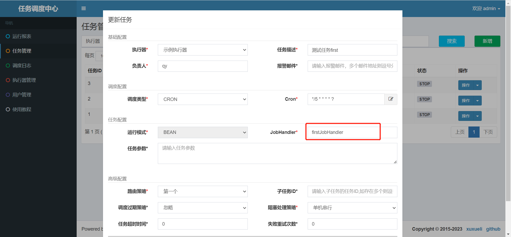

启动任务，测试


### 4、封装XXL-JOB客户端

乘客下单就要开启任务调度，指定只能动态创建XXL-JOB任务，因此我们要封装XXL-JOB客户端，通过接口的形式添加并启动任务。

#### 4.1、改造XXL-JOB服务器端接口

在xxl-job-admin模块，添加改造后的api接口

在JobInfoController类末尾添加方法，如下：

```java
/*------------------自定义方法----------------------  */
@RequestMapping("/addJob")
@ResponseBody
@PermissionLimit(limit = false)
public ReturnT<String> addJobInfo(@RequestBody XxlJobInfo jobInfo) {
   return xxlJobService.add(jobInfo);
}

@RequestMapping("/updateJob")
@ResponseBody
@PermissionLimit(limit = false)
public ReturnT<String> updateJob(@RequestBody XxlJobInfo jobInfo) {
   return xxlJobService.update(jobInfo);
}

@RequestMapping("/removeJob")
@ResponseBody
@PermissionLimit(limit = false)
public ReturnT<String> removeJob(@RequestBody XxlJobInfo jobInfo) {
   return xxlJobService.remove(jobInfo.getId());
}

@RequestMapping("/stopJob")
@ResponseBody
@PermissionLimit(limit = false)
public ReturnT<String> pauseJob(@RequestBody XxlJobInfo jobInfo) {
   return xxlJobService.stop(jobInfo.getId());
}

@RequestMapping("/startJob")
@ResponseBody
@PermissionLimit(limit = false)
public ReturnT<String> startJob(@RequestBody XxlJobInfo jobInfo) {
   return xxlJobService.start(jobInfo.getId());
}

@RequestMapping("/addAndStartJob")
@ResponseBody
@PermissionLimit(limit = false)
public ReturnT<String> addAndStartJob(@RequestBody XxlJobInfo jobInfo) {
   ReturnT<String> result = xxlJobService.add(jobInfo);
   int id = Integer.valueOf(result.getContent());
   xxlJobService.start(id);
   //立即执行一次
   JobTriggerPoolHelper.trigger(id, TriggerTypeEnum.MANUAL, -1, null, jobInfo.getExecutorParam(), "");
   return result;
}
/*------------------自定义方法----------------------  */
```

说明：排除登录校验（@PermissionLimit(limit = false)）


#### 4.2、配置接口地址

xxl完整配置，多加了client的配置

```yaml
xxl:
  job:
    admin:
      # 调度中心部署跟地址 [选填]：如调度中心集群部署存在多个地址则用逗号分隔。执行器将会使用该地址进行"执行器心跳注册"和"任务结果回调"；为空则关闭自动注册
      addresses: http://139.198.30.131:8080/xxl-job-admin
      # addresses: http://localhost:8080/xxl-job-admin
      # 执行器通讯TOKEN [选填]：非空时启用
    accessToken: 

    executor:
      # 执行器AppName [选填]：执行器心跳注册分组依据；为空则关闭自动注册
      appname: xxl-job-executor-sample
      # 执行器注册 [选填]：优先使用该配置作为注册地址，为空时使用内嵌服务 ”IP:PORT“ 作为注册地址。从而更灵活的支持容器类型执行器动态IP和动态映射端口问题。
      address:
      # 执行器IP [选填]：默认为空表示自动获取IP，多网卡时可手动设置指定IP，该IP不会绑定Host仅作为通讯实用；地址信息用于 "执行器注册" 和 "调度中心请求并触发任务"；
      ip:
      # 执行器端口号 [选填]：小于等于0则自动获取；默认端口为9999，单机部署多个执行器时，注意要配置不同执行器端口；
      port: 9999
      # 执行器运行日志文件存储磁盘路径 [选填] ：需要对该路径拥有读写权限；为空则使用默认路径；
      logpath: /data/applogs/xxl-job/jobhandler
      # 执行器日志文件保存天数 [选填] ： 过期日志自动清理, 限制值大于等于3时生效; 否则, 如-1, 关闭自动清理功能；
      logretentiondays: 30
    client:
      jobGroupId: 1
      addUrl: ${xxl.job.admin.addresses}/jobinfo/addJob
      removeUrl: ${xxl.job.admin.addresses}/jobinfo/removeJob
      startJobUrl: ${xxl.job.admin.addresses}/jobinfo/startJob
      stopJobUrl: ${xxl.job.admin.addresses}/jobinfo/stopJob
      addAndStartUrl: ${xxl.job.admin.addresses}/jobinfo/addAndStartJob
```


#### 4.3、XxlJobClientConfig

```java
package com.atguigu.daijia.dispatch.xxl.config;

import lombok.Data;
import org.springframework.boot.context.properties.ConfigurationProperties;
import org.springframework.stereotype.Component;

@Data
@Component
@ConfigurationProperties(prefix = "xxl.job.client")
public class XxlJobClientConfig {

    private Integer jobGroupId;
    private String addUrl;
    private String removeUrl;
    private String startJobUrl;
    private String stopJobUrl;
    private String addAndStartUrl;
}
```


#### 4.4、XxlJobClient

```java
package com.atguigu.daijia.dispatch.xxl.client;

import com.alibaba.fastjson.JSONObject;
import com.atguigu.daijia.common.execption.GuiguException;
import com.atguigu.daijia.common.result.ResultCodeEnum;
import com.atguigu.daijia.dispatch.xxl.config.XxlJobClientConfig;
import com.atguigu.daijia.model.entity.dispatch.XxlJobInfo;
import lombok.SneakyThrows;
import lombok.extern.slf4j.Slf4j;
import org.springframework.beans.factory.annotation.Autowired;
import org.springframework.http.HttpEntity;
import org.springframework.http.HttpHeaders;
import org.springframework.http.MediaType;
import org.springframework.http.ResponseEntity;
import org.springframework.stereotype.Component;
import org.springframework.web.client.RestTemplate;

/**
 * https://dandelioncloud.cn/article/details/1598865461087518722
 */
@Slf4j
@Component
public class XxlJobClient {

    @Autowired
    private XxlJobClientConfig xxlJobClientConfig;

    @Autowired
    private RestTemplate restTemplate;

    @SneakyThrows
    public Long addJob(String executorHandler, String param, String corn, String desc){
        XxlJobInfo xxlJobInfo = new XxlJobInfo();
        xxlJobInfo.setJobGroup(xxlJobClientConfig.getJobGroupId());
        xxlJobInfo.setJobDesc(desc);
        xxlJobInfo.setAuthor("qy");
        xxlJobInfo.setScheduleType("CRON");
        xxlJobInfo.setScheduleConf(corn);
        xxlJobInfo.setGlueType("BEAN");
        xxlJobInfo.setExecutorHandler(executorHandler);
        xxlJobInfo.setExecutorParam(param);
        xxlJobInfo.setExecutorRouteStrategy("FIRST");
        xxlJobInfo.setExecutorBlockStrategy("SERIAL_EXECUTION");
        xxlJobInfo.setMisfireStrategy("FIRE_ONCE_NOW");
        xxlJobInfo.setExecutorTimeout(0);
        xxlJobInfo.setExecutorFailRetryCount(0);

        HttpHeaders headers = new HttpHeaders();
        headers.setContentType(MediaType.APPLICATION_JSON);
        HttpEntity<XxlJobInfo> request = new HttpEntity<>(xxlJobInfo, headers);

        String url = xxlJobClientConfig.getAddUrl();
        ResponseEntity<JSONObject> response = restTemplate.postForEntity(url, request, JSONObject.class);
        if(response.getStatusCode().value() == 200 && response.getBody().getIntValue("code") == 200) {
            log.info("增加xxl执行任务成功,返回信息:{}", response.getBody().toJSONString());
            //content为任务id
            return response.getBody().getLong("content");
        }
        log.info("调用xxl增加执行任务失败:{}", response.getBody().toJSONString());
        throw new GuiguException(ResultCodeEnum.XXL_JOB_ERROR);
    }

    public Boolean startJob(Long jobId) {
        XxlJobInfo xxlJobInfo = new XxlJobInfo();
        xxlJobInfo.setId(jobId.intValue());

        HttpHeaders headers = new HttpHeaders();
        headers.setContentType(MediaType.APPLICATION_JSON);
        HttpEntity<XxlJobInfo> request = new HttpEntity<>(xxlJobInfo, headers);

        String url = xxlJobClientConfig.getStartJobUrl();
        ResponseEntity<JSONObject> response = restTemplate.postForEntity(url, request, JSONObject.class);
        if(response.getStatusCode().value() == 200 && response.getBody().getIntValue("code") == 200) {
            log.info("启动xxl执行任务成功:{},返回信息:{}", jobId, response.getBody().toJSONString());
            return true;
        }
        log.info("启动xxl执行任务失败:{},返回信息:{}", jobId, response.getBody().toJSONString());
        throw new GuiguException(ResultCodeEnum.XXL_JOB_ERROR);
    }

    public Boolean stopJob(Long jobId) {
        XxlJobInfo xxlJobInfo = new XxlJobInfo();
        xxlJobInfo.setId(jobId.intValue());

        HttpHeaders headers = new HttpHeaders();
        headers.setContentType(MediaType.APPLICATION_JSON);
        HttpEntity<XxlJobInfo> request = new HttpEntity<>(xxlJobInfo, headers);

        String url = xxlJobClientConfig.getStopJobUrl();
        ResponseEntity<JSONObject> response = restTemplate.postForEntity(url, request, JSONObject.class);
        if(response.getStatusCode().value() == 200 && response.getBody().getIntValue("code") == 200) {
            log.info("停止xxl执行任务成功:{},返回信息:{}", jobId, response.getBody().toJSONString());
            return true;
        }
        log.info("停止xxl执行任务失败:{},返回信息:{}", jobId, response.getBody().toJSONString());
        throw new GuiguException(ResultCodeEnum.XXL_JOB_ERROR);
    }

    public Boolean removeJob(Long jobId) {
        XxlJobInfo xxlJobInfo = new XxlJobInfo();
        xxlJobInfo.setId(jobId.intValue());

        HttpHeaders headers = new HttpHeaders();
        headers.setContentType(MediaType.APPLICATION_JSON);
        HttpEntity<XxlJobInfo> request = new HttpEntity<>(xxlJobInfo, headers);

        String url = xxlJobClientConfig.getRemoveUrl();
        ResponseEntity<JSONObject> response = restTemplate.postForEntity(url, request, JSONObject.class);
        if(response.getStatusCode().value() == 200 && response.getBody().getIntValue("code") == 200) {
            log.info("删除xxl执行任务成功:{},返回信息:{}", jobId, response.getBody().toJSONString());
            return true;
        }
        log.info("删除xxl执行任务失败:{},返回信息:{}", jobId, response.getBody().toJSONString());
        throw new GuiguException(ResultCodeEnum.XXL_JOB_ERROR);
    }

    public Long addAndStart(String executorHandler, String param, String corn, String desc) {
        XxlJobInfo xxlJobInfo = new XxlJobInfo();
        xxlJobInfo.setJobGroup(xxlJobClientConfig.getJobGroupId());
        xxlJobInfo.setJobDesc(desc);
        xxlJobInfo.setAuthor("qy");
        xxlJobInfo.setScheduleType("CRON");
        xxlJobInfo.setScheduleConf(corn);
        xxlJobInfo.setGlueType("BEAN");
        xxlJobInfo.setExecutorHandler(executorHandler);
        xxlJobInfo.setExecutorParam(param);
        xxlJobInfo.setExecutorRouteStrategy("FIRST");
        xxlJobInfo.setExecutorBlockStrategy("SERIAL_EXECUTION");
        xxlJobInfo.setMisfireStrategy("FIRE_ONCE_NOW");
        xxlJobInfo.setExecutorTimeout(0);
        xxlJobInfo.setExecutorFailRetryCount(0);

        HttpHeaders headers = new HttpHeaders();
        headers.setContentType(MediaType.APPLICATION_JSON);
        HttpEntity<XxlJobInfo> request = new HttpEntity<>(xxlJobInfo, headers);

        String url = xxlJobClientConfig.getAddAndStartUrl();
        ResponseEntity<JSONObject> response = restTemplate.postForEntity(url, request, JSONObject.class);
        if(response.getStatusCode().value() == 200 && response.getBody().getIntValue("code") == 200) {
            log.info("增加并开始执行xxl任务成功,返回信息:{}", response.getBody().toJSONString());
            //content为任务id
            return response.getBody().getLong("content");
        }
        log.info("增加并开始执行xxl任务失败:{}", response.getBody().toJSONString());
        throw new GuiguException(ResultCodeEnum.XXL_JOB_ERROR);
    }

}
```


#### 4.5、启动类配置RestTemplate

```java
@Bean
public RestTemplate restTemplate() {
    return new RestTemplate();
}
```


### 5、添加并启动任务接口

乘客下单，调用该接口，那么任务调度就启动了

#### 5.1、微服务接口

##### 5.1.1、NewOrderController

```java
@Autowired
private NewOrderService newOrderService;

@Operation(summary = "添加并开始新订单任务调度")
@PostMapping("/addAndStartTask")
public Result<Long> addAndStartTask(@RequestBody NewOrderTaskVo newOrderTaskVo) {
   return Result.ok(newOrderService.addAndStartTask(newOrderTaskVo));
}
```

##### 5.1.2、NewOrderService

```
Long addAndStartTask(NewOrderTaskVo newOrderTaskVo);
```

##### 5.1.2、NewOrderServiceImpl

```java
@Autowired
private XxlJobClient xxlJobClient;

@Autowired
private OrderJobMapper orderJobMapper;

@Transactional(rollbackFor = Exception.class)
@Override
public Long addAndStartTask(NewOrderTaskVo newOrderTaskVo) {
    OrderJob orderJob = orderJobMapper.selectOne(new LambdaQueryWrapper<OrderJob>().eq(OrderJob::getOrderId, newOrderTaskVo.getOrderId()));
    if(null == orderJob) {
        Long jobId = xxlJobClient.addAndStart("newOrderTaskHandler", "", "0 0/1 * * * ?", "新订单任务,订单id："+newOrderTaskVo.getOrderId());

        //记录订单与任务的关联信息
        orderJob = new OrderJob();
        orderJob.setOrderId(newOrderTaskVo.getOrderId());
        orderJob.setJobId(jobId);
        orderJob.setParameter(JSONObject.toJSONString(newOrderTaskVo));
        orderJobMapper.insert(orderJob);
    }
    return orderJob.getJobId();
}
```

说明：每1分钟执行一次，处理任务的bean为：newOrderTaskHandler


#### 5.2、Feign接口

##### 5.2.1、NewOrderFeignClient

```java
/**
 * 添加新订单任务
 * @param newOrderDispatchVo
 * @return
 */
@PostMapping("/dispatch/newOrder/addAndStartTask")
Result<Long> addAndStartTask(@RequestBody NewOrderTaskVo newOrderDispatchVo);
```


### 6、开发任务Job方法

#### 6.1、JobHandler

```java
package com.atguigu.daijia.dispatch.xxl.job;

import com.alibaba.fastjson.JSONObject;
import com.alibaba.nacos.common.utils.ExceptionUtil;
import com.atguigu.daijia.dispatch.mapper.XxlJobLogMapper;
import com.atguigu.daijia.dispatch.service.NewOrderService;
import com.atguigu.daijia.model.entity.dispatch.XxlJobLog;
import com.atguigu.daijia.model.vo.dispatch.NewOrderTaskVo;
import com.xxl.job.core.context.XxlJobHelper;
import com.xxl.job.core.handler.annotation.XxlJob;
import lombok.extern.slf4j.Slf4j;
import org.springframework.beans.factory.annotation.Autowired;
import org.springframework.stereotype.Component;

@Slf4j
@Component
public class JobHandler {

    @Autowired
    private XxlJobLogMapper xxlJobLogMapper;

    @Autowired
    private NewOrderService newOrderService;

    @XxlJob("newOrderTaskHandler")
    public void newOrderTaskHandler() {
        log.info("新订单调度任务：{}", XxlJobHelper.getJobId());

        //记录定时任务相关的日志信息
        //封装日志对象
        XxlJobLog xxlJobLog = new XxlJobLog();
        xxlJobLog.setJobId(XxlJobHelper.getJobId());
        long startTime = System.currentTimeMillis();
        try {
            //执行任务
            newOrderService.executeTask(XxlJobHelper.getJobId());

            xxlJobLog.setStatus(1);//成功
        } catch (Exception e) {
            xxlJobLog.setStatus(0);//失败
            xxlJobLog.setError(ExceptionUtil.getAllExceptionMsg(e));
            log.error("定时任务执行失败，任务id为：{}", XxlJobHelper.getJobId());
            e.printStackTrace();
        } finally {
            //耗时
            int times = (int) (System.currentTimeMillis() - startTime);
            xxlJobLog.setTimes(times);
            xxlJobLogMapper.insert(xxlJobLog);
        }
    }
}
```


#### 6.2、NewOrderService

```java
Boolean executeTask(Long jobId);
```


#### 6.3、NewOrderServiceImpl

```java
@Autowired
private LocationFeignClient locationFeignClient;

@Autowired
private OrderInfoFeignClient orderInfoFeignClient;

@Autowired
private RedisTemplate redisTemplate;

@Override
public Boolean executeTask(Long jobId) {
    //获取任务参数
    OrderJob orderJob = orderJobMapper.selectOne(new LambdaQueryWrapper<OrderJob>().eq(OrderJob::getJobId, jobId));
    if(null == orderJob) {
        return true;
    }
    NewOrderTaskVo newOrderTaskVo = JSONObject.parseObject(orderJob.getParameter(), NewOrderTaskVo.class);

    //查询订单状态，如果该订单还在接单状态，继续执行；如果不在接单状态，则停止定时调度
    Integer orderStatus = orderInfoFeignClient.getOrderStatus(newOrderTaskVo.getOrderId()).getData();
    if(orderStatus.intValue() != OrderStatus.WAITING_ACCEPT.getStatus().intValue()) {
        xxlJobClient.stopJob(jobId);
        log.info("停止任务调度: {}", JSON.toJSONString(newOrderTaskVo));
        return true;
    }

    //搜索附近满足条件的司机
    SearchNearByDriverForm searchNearByDriverForm = new SearchNearByDriverForm();
    searchNearByDriverForm.setLongitude(newOrderTaskVo.getStartPointLongitude());
    searchNearByDriverForm.setLatitude(newOrderTaskVo.getStartPointLatitude());
    searchNearByDriverForm.setMileageDistance(newOrderTaskVo.getExpectDistance());
    List<NearByDriverVo> nearByDriverVoList = locationFeignClient.searchNearByDriver(searchNearByDriverForm).getData();
    //给司机派发订单信息
    nearByDriverVoList.forEach(driver -> {
        //记录司机id，防止重复推送订单信息
        String repeatKey = RedisConstant.DRIVER_ORDER_REPEAT_LIST+newOrderTaskVo.getOrderId();
        boolean isMember = redisTemplate.opsForSet().isMember(repeatKey, driver.getDriverId());
        if(!isMember) {
            //记录该订单已放入司机临时容器
            redisTemplate.opsForSet().add(repeatKey, driver.getDriverId());
            //过期时间：15分钟，新订单15分钟没人接单自动取消
            redisTemplate.expire(repeatKey, RedisConstant.DRIVER_ORDER_REPEAT_LIST_EXPIRES_TIME, TimeUnit.MINUTES);

            NewOrderDataVo newOrderDataVo = new NewOrderDataVo();
            newOrderDataVo.setOrderId(newOrderTaskVo.getOrderId());
            newOrderDataVo.setStartLocation(newOrderTaskVo.getStartLocation());
            newOrderDataVo.setEndLocation(newOrderTaskVo.getEndLocation());
            newOrderDataVo.setExpectAmount(newOrderTaskVo.getExpectAmount());
            newOrderDataVo.setExpectDistance(newOrderTaskVo.getExpectDistance());
            newOrderDataVo.setExpectTime(newOrderTaskVo.getExpectTime());
            newOrderDataVo.setFavourFee(newOrderTaskVo.getFavourFee());
            newOrderDataVo.setDistance(driver.getDistance());
            newOrderDataVo.setCreateTime(newOrderTaskVo.getCreateTime());

            //将消息保存到司机的临时队列里面，司机接单了会定时轮询到他的临时队列获取订单消息
            String key = RedisConstant.DRIVER_ORDER_TEMP_LIST+driver.getDriverId();
            redisTemplate.opsForList().leftPush(key, JSONObject.toJSONString(newOrderDataVo));
            //过期时间：1分钟，1分钟未消费，自动过期
            //注：司机端开启接单，前端每5秒（远小于1分钟）拉取1次“司机临时队列”里面的新订单消息
            redisTemplate.expire(key, RedisConstant.DRIVER_ORDER_TEMP_LIST_EXPIRES_TIME, TimeUnit.MINUTES);
            log.info("该新订单信息已放入司机临时队列: {}", JSON.toJSONString(newOrderDataVo));
        }
    });
    return true;
}
```


### 7、下单方法添加任务调度

#### 7.1、OrderServiceImpl

代码片段：

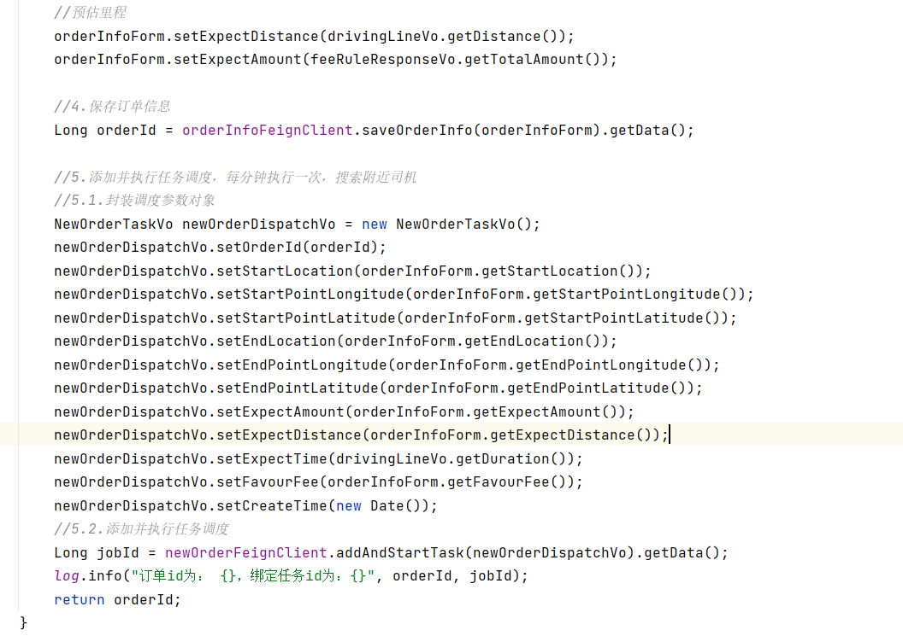

完整代码：

```java
@Autowired
private NewOrderFeignClient newOrderFeignClient;

@Override
public Long submitOrder(SubmitOrderForm submitOrderForm) {
    //1.重新计算驾驶线路
    CalculateDrivingLineForm calculateDrivingLineForm = new CalculateDrivingLineForm();
    BeanUtils.copyProperties(submitOrderForm, calculateDrivingLineForm);
    DrivingLineVo drivingLineVo = mapFeignClient.calculateDrivingLine(calculateDrivingLineForm).getData();

    //2.重新计算订单费用
    FeeRuleRequestForm calculateOrderFeeForm = new FeeRuleRequestForm();
    calculateOrderFeeForm.setDistance(drivingLineVo.getDistance());
    calculateOrderFeeForm.setStartTime(new Date());
    calculateOrderFeeForm.setWaitMinute(0);
    FeeRuleResponseVo feeRuleResponseVo = feeRuleFeignClient.calculateOrderFee(calculateOrderFeeForm).getData();

    //3.封装订单信息对象
    OrderInfoForm orderInfoForm = new OrderInfoForm();
    //订单位置信息
    BeanUtils.copyProperties(submitOrderForm, orderInfoForm);
    //预估里程
    orderInfoForm.setExpectDistance(drivingLineVo.getDistance());
    orderInfoForm.setExpectAmount(feeRuleResponseVo.getTotalAmount());

    //4.保存订单信息
    Long orderId = orderInfoFeignClient.saveOrderInfo(orderInfoForm).getData();

    //5.添加并执行任务调度，每分钟执行一次，搜索附近司机
    //5.1.封装调度参数对象
    NewOrderTaskVo newOrderDispatchVo = new NewOrderTaskVo();
    newOrderDispatchVo.setOrderId(orderId);
    newOrderDispatchVo.setStartLocation(orderInfoForm.getStartLocation());
    newOrderDispatchVo.setStartPointLongitude(orderInfoForm.getStartPointLongitude());
    newOrderDispatchVo.setStartPointLatitude(orderInfoForm.getStartPointLatitude());
    newOrderDispatchVo.setEndLocation(orderInfoForm.getEndLocation());
    newOrderDispatchVo.setEndPointLongitude(orderInfoForm.getEndPointLongitude());
    newOrderDispatchVo.setEndPointLatitude(orderInfoForm.getEndPointLatitude());
    newOrderDispatchVo.setExpectAmount(orderInfoForm.getExpectAmount());
    newOrderDispatchVo.setExpectDistance(orderInfoForm.getExpectDistance());
    newOrderDispatchVo.setExpectTime(drivingLineVo.getDuration());
    newOrderDispatchVo.setFavourFee(orderInfoForm.getFavourFee());
    newOrderDispatchVo.setCreateTime(new Date());
    //5.2.添加并执行任务调度
    Long jobId = newOrderFeignClient.addAndStartTask(newOrderDispatchVo).getData();
    log.info("订单id为： {}，绑定任务id为：{}", orderId, jobId);
    return orderId;
}
```

这样一个完整的乘客下单到任务调用搜索合适司机就这么串连上了。


### 8、司机获取新订单数据列表

司机开启接单服务后，司机端小程序就会实时轮询新订单数据，如果临时队列有数据，就拉取数据进行实时语音播报。但是当司机接单成功后，就需要清空临时队列，释放系统空间，因此这两接口都提供了吧，清除不需要web接口。

#### 8.1、调度微服务接口

##### 8.1.1、NewOrderController

```java
@Operation(summary = "查询司机新订单数据")
@GetMapping("/findNewOrderQueueData/{driverId}")
public Result<List<NewOrderDataVo>> findNewOrderQueueData(@PathVariable Long driverId) {
   return Result.ok(newOrderService.findNewOrderQueueData(driverId));
}

@Operation(summary = "清空新订单队列数据")
@GetMapping("/clearNewOrderQueueData/{driverId}")
public Result<Boolean> clearNewOrderQueueData(@PathVariable Long driverId) {
   return Result.ok(newOrderService.clearNewOrderQueueData(driverId));
}
```

##### 8.1.2、NewOrderService

```java
List<NewOrderDataVo> findNewOrderQueueData(Long driverId);

Boolean clearNewOrderQueueData(Long driverId);
```

##### 8.1.2、NewOrderServiceImpl

```java
@Override
public List<NewOrderDataVo> findNewOrderQueueData(Long driverId) {
   List<NewOrderDataVo> list = new ArrayList<>();
   String key = RedisConstant.DRIVER_ORDER_TEMP_LIST + driverId;
   long size = redisTemplate.opsForList().size(key);
   if(size > 0) {
      for(int i=0; i<size; i++) {
         String content = (String)redisTemplate.opsForList().leftPop(key);
         NewOrderDataVo newOrderDataVo = JSONObject.parseObject(content, NewOrderDataVo.class);
         list.add(newOrderDataVo);
      }
   }
   return list;
}

@Override
public Boolean clearNewOrderQueueData(Long driverId) {
   String key = RedisConstant.DRIVER_ORDER_TEMP_LIST + driverId;
   //直接删除，司机开启服务后，有新订单会自动创建容器
   redisTemplate.delete(key);
   return true;
}
```


#### 8.2、 Feign接口

##### 8.2.1、NewOrderFeignClient

```java
/**
 * 查询司机新订单数据
 *
 * @param driverId
 * @return
 */
@GetMapping("/dispatch/newOrder/findNewOrderQueueData/{driverId}")
Result<List<NewOrderDataVo>> findNewOrderQueueData(@PathVariable("driverId") Long driverId);

/**
 * 清空新订单队列数据
 * @param driverId
 * @return
 */
@GetMapping("/dispatch/newOrder/clearNewOrderQueueData/{driverId}")
Result<Boolean> clearNewOrderQueueData(@PathVariable("driverId") Long driverId);
```


#### 8.3、 司机端web接口

##### 8.3.1、OrderController

```java
@Operation(summary = "查询司机新订单数据")
@GuiguLogin
@GetMapping("/findNewOrderQueueData")
public Result<List<NewOrderDataVo>> findNewOrderQueueData() {
   Long driverId = AuthContextHolder.getUserId();
   return Result.ok(orderService.findNewOrderQueueData(driverId));
}
```

##### 8.3.2、OrderService

```java
List<NewOrderDataVo> findNewOrderQueueData(Long driverId);
```

##### 8.3.3、OrderServiceImpl

```java
@Autowired
private NewOrderFeignClient newOrderFeignClient;

@Override
public List<NewOrderDataVo> findNewOrderQueueData(Long driverId) {
   return newOrderFeignClient.findNewOrderQueueData(driverId).getData();
}
```

