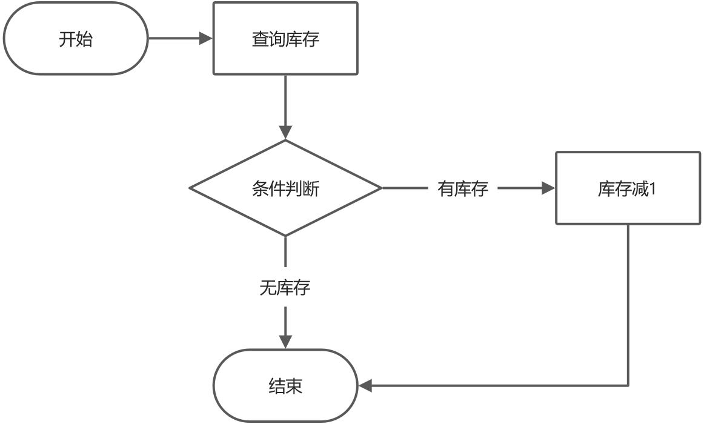
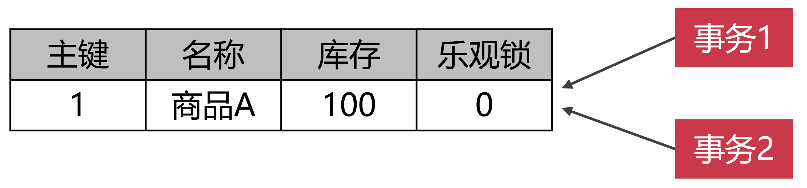
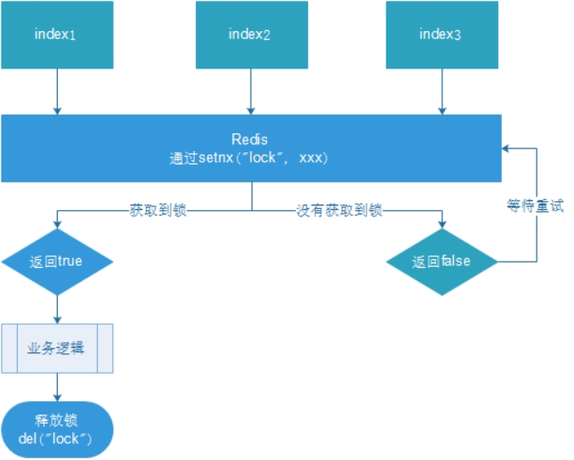
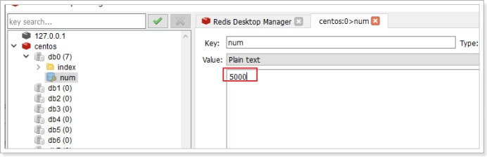
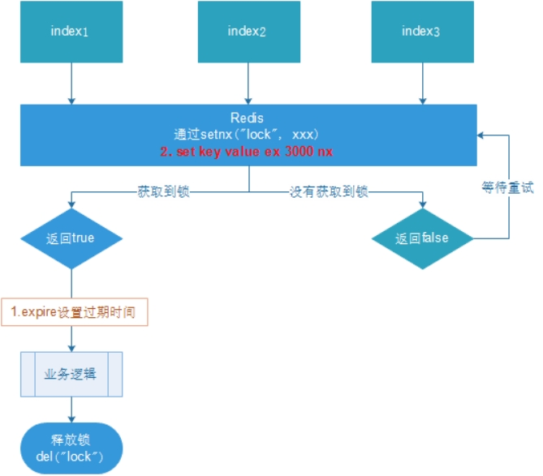
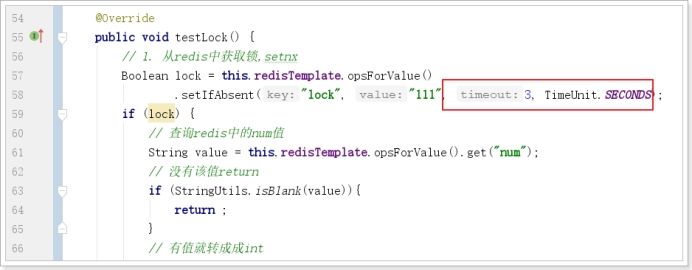
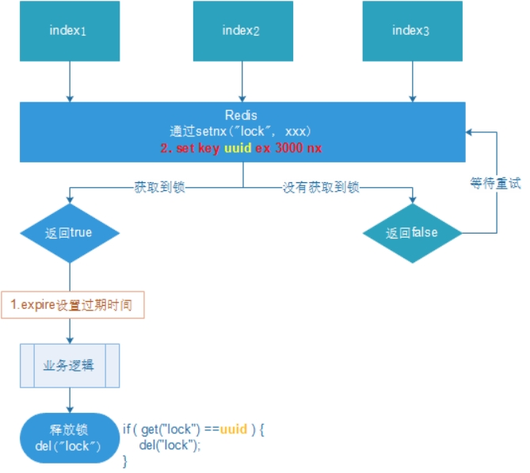
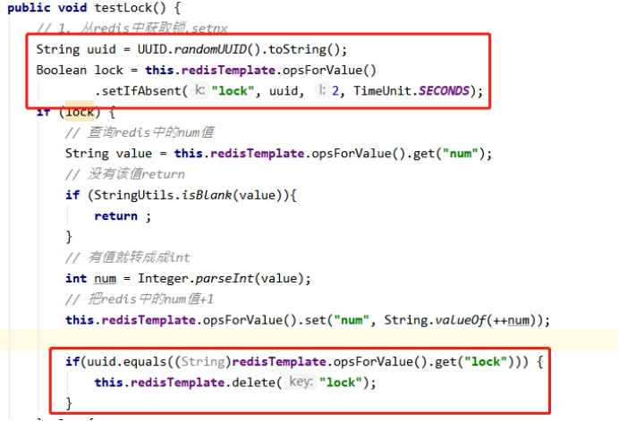
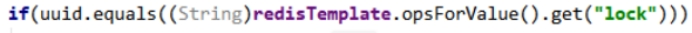

# 代驾：司机抢单

## 一、开启接单服务

前面乘客已经下单，新订单消息已经加入司机临时队列，接下来我们把司机端的开启接单到抢单的流程写一下。

开启接单我们要做哪些操作呢？

1、判断司机认证状态，只要认证通过了的司机才能接单，司机登录信息包含司机认证状态（已开发）

2、判断司机当日是否已做人脸识别，司机每天必须做一次人脸识别，如果未做，跳转到人脸识别页面

3、更新司机全局接单状态

4、删除司机之前的geo数据（重新做初始化，防止数据影响）

5、清空司机新订单临时队列（重新做初始化，防止数据影响）

### 1、查找司机端当前订单

司机端接单也一样，只要有执行中的订单，没有结束，那么司机是不可以接单的，页面会弹出层，进入执行中的订单。
当前我们必须把这个接口绕过去，不然我们不能接单，因此我们模拟一下这个接口，告诉它没有执行中的订单，后续在订单流程中我们完善这个业务。

#### 1.1、司机端web模拟接口

##### 1.1.1、OrderController

```java
@Operation(summary = "查找司机端当前订单")
@GuiguLogin
@GetMapping("/searchDriverCurrentOrder")
public Result<CurrentOrderInfoVo> searchDriverCurrentOrder() {
       CurrentOrderInfoVo currentOrderInfoVo = new CurrentOrderInfoVo();
       currentOrderInfoVo.setIsHasCurrentOrder(false);
       return Result.ok(currentOrderInfoVo);
}
```


### 2、判断司机当日是否已做人脸识别

#### 2.1、司机端微服务接口

##### 2.1.1、DriverInfoController

```java
@Operation(summary = "判断司机当日是否进行过人脸识别")
@GetMapping("/isFaceRecognition/{driverId}")
Result<Boolean> isFaceRecognition(@PathVariable("driverId") Long driverId) {
   return Result.ok(driverInfoService.isFaceRecognition(driverId));
}
```

##### 2.1.2、DriverInfoService

```java
Boolean isFaceRecognition(Long driverId);
```

##### 2.1.3、DriverInfoServiceImpl

```java
@Autowired
private DriverFaceRecognitionMapper driverFaceRecognitionMapper;

@Override
public Boolean isFaceRecognition(Long driverId) {
    LambdaQueryWrapper<DriverFaceRecognition> queryWrapper = new LambdaQueryWrapper();
    queryWrapper.eq(DriverFaceRecognition::getDriverId, driverId);
    queryWrapper.eq(DriverFaceRecognition::getFaceDate, new DateTime().toString("yyyy-MM-dd"));
    long count = driverFaceRecognitionMapper.selectCount(queryWrapper);
    return count != 0;
}
```

#### 2.2、Feign接口

##### 2.2.1、DriverInfoFeignClient

```java
/**
 * 判断司机当日是否进行过人脸识别
 * @param driverId
 * @return
 */
@GetMapping("/driver/info/isFaceRecognition/{driverId}")
Result<Boolean> isFaceRecognition(@PathVariable("driverId") Long driverId);
```

#### 2.3、司机端web接口

##### 2.3.1、DriverController

```java
@Operation(summary = "判断司机当日是否进行过人脸识别")
@GuiguLogin
@GetMapping("/isFaceRecognition")
Result<Boolean> isFaceRecognition() {
   Long driverId = AuthContextHolder.getUserId();
   return Result.ok(driverService.isFaceRecognition(driverId));
}
```

##### 2.3.2、DriverService

```java
Boolean isFaceRecognition(Long driverId);
```

##### 2.3.2、DriverServiceImpl

```java
@Override
public Boolean isFaceRecognition(Long driverId) {
    return driverInfoFeignClient.isFaceRecognition(driverId).getData();
}
```


### 3、人脸验证

前面我们已经做了人员库人员信息录入，现在我们要做人脸验证，为了防止司机作弊，我们还要对司机上传的人脸信息做人脸静态活体检测。

人脸静态活体检测可用于对用户上传的静态图片进行防翻拍活体检测，以判断是否是翻拍图片。

#### 3.1、司机端微服务接口

##### 3.1.1、DriverInfoController

```java
@Operation(summary = "验证司机人脸")
@PostMapping("/verifyDriverFace")
public Result<Boolean> verifyDriverFace(@RequestBody DriverFaceModelForm driverFaceModelForm) {
    return Result.ok(driverInfoService.verifyDriverFace(driverFaceModelForm));
}
```

##### 3.1.2、DriverInfoService

```java
Boolean verifyDriverFace(DriverFaceModelForm driverFaceModelForm);
```

##### 3.1.3、DriverInfoServiceImpl

```java
/**
 * 人脸验证
 * 文档地址：
 * https://cloud.tencent.com/document/api/867/44983
 * https://console.cloud.tencent.com/api/explorer?Product=iai&Version=2020-03-03&Action=VerifyFace
 *
 * @param driverFaceModelForm
 * @return
 */
@Override
public Boolean verifyDriverFace(DriverFaceModelForm driverFaceModelForm) {
    try {
        // 实例化一个认证对象，入参需要传入腾讯云账户 SecretId 和 SecretKey，此处还需注意密钥对的保密
        // 代码泄露可能会导致 SecretId 和 SecretKey 泄露，并威胁账号下所有资源的安全性。以下代码示例仅供参考，建议采用更安全的方式来使用密钥，请参见：https://cloud.tencent.com/document/product/1278/85305
        // 密钥可前往官网控制台 https://console.cloud.tencent.com/cam/capi 进行获取
        Credential cred = new Credential(tencentCloudProperties.getSecretId(), tencentCloudProperties.getSecretKey());
        // 实例化一个http选项，可选的，没有特殊需求可以跳过
        HttpProfile httpProfile = new HttpProfile();
        httpProfile.setEndpoint("iai.tencentcloudapi.com");
        // 实例化一个client选项，可选的，没有特殊需求可以跳过
        ClientProfile clientProfile = new ClientProfile();
        clientProfile.setHttpProfile(httpProfile);
        // 实例化要请求产品的client对象,clientProfile是可选的
        IaiClient client = new IaiClient(cred, tencentCloudProperties.getRegion(), clientProfile);
        // 实例化一个请求对象,每个接口都会对应一个request对象
        VerifyFaceRequest req = new VerifyFaceRequest();
        req.setImage(driverFaceModelForm.getImageBase64());
        req.setPersonId(String.valueOf(driverFaceModelForm.getDriverId()));
        // 返回的resp是一个VerifyFaceResponse的实例，与请求对象对应
        VerifyFaceResponse resp = client.VerifyFace(req);
        // 输出json格式的字符串回包
        System.out.println(VerifyFaceResponse.toJsonString(resp));
        if (resp.getIsMatch()) {
            //活体检查
            if(this.detectLiveFace(driverFaceModelForm.getImageBase64())) {
                DriverFaceRecognition driverFaceRecognition = new DriverFaceRecognition();
                driverFaceRecognition.setDriverId(driverFaceModelForm.getDriverId());
                driverFaceRecognition.setFaceDate(new Date());
                driverFaceRecognitionMapper.insert(driverFaceRecognition);
                return true;
            };
        }
    } catch (TencentCloudSDKException e) {
        System.out.println(e.toString());
    }
    throw new GuiguException(ResultCodeEnum.FACE_FAIL);
}

/**
 * 人脸静态活体检测
 * 文档地址：
 * https://cloud.tencent.com/document/api/867/48501
 * https://console.cloud.tencent.com/api/explorer?Product=iai&Version=2020-03-03&Action=DetectLiveFace
 * @param imageBase64
 * @return
 */
private Boolean detectLiveFace(String imageBase64) {
    try{
        // 实例化一个认证对象，入参需要传入腾讯云账户 SecretId 和 SecretKey，此处还需注意密钥对的保密
        // 代码泄露可能会导致 SecretId 和 SecretKey 泄露，并威胁账号下所有资源的安全性。以下代码示例仅供参考，建议采用更安全的方式来使用密钥，请参见：https://cloud.tencent.com/document/product/1278/85305
        // 密钥可前往官网控制台 https://console.cloud.tencent.com/cam/capi 进行获取
        Credential cred = new Credential(tencentCloudProperties.getSecretId(), tencentCloudProperties.getSecretKey());
        // 实例化一个http选项，可选的，没有特殊需求可以跳过
        HttpProfile httpProfile = new HttpProfile();
        httpProfile.setEndpoint("iai.tencentcloudapi.com");
        // 实例化一个client选项，可选的，没有特殊需求可以跳过
        ClientProfile clientProfile = new ClientProfile();
        clientProfile.setHttpProfile(httpProfile);
        // 实例化要请求产品的client对象,clientProfile是可选的
        IaiClient client = new IaiClient(cred, tencentCloudProperties.getRegion(), clientProfile);
        // 实例化一个请求对象,每个接口都会对应一个request对象
        DetectLiveFaceRequest req = new DetectLiveFaceRequest();
        req.setImage(imageBase64);
        // 返回的resp是一个DetectLiveFaceResponse的实例，与请求对象对应
        DetectLiveFaceResponse resp = client.DetectLiveFace(req);
        // 输出json格式的字符串回包
        System.out.println(DetectLiveFaceResponse.toJsonString(resp));
        if(resp.getIsLiveness()) {
            return true;
        }
    } catch (TencentCloudSDKException e) {
        System.out.println(e.toString());
    }
    return false;
}
```

#### 3.2、Feign接口

##### 3.2.1、DriverInfoFeignClient

```java
/**
 * 验证司机人脸
 * @param driverFaceModelForm
 * @return
 */
@PostMapping("/driver/info/verifyDriverFace")
Result<Boolean> verifyDriverFace(@RequestBody DriverFaceModelForm driverFaceModelForm);
```

#### 3.3、司机端web接口

##### 3.3.1、DriverController

```java
@Operation(summary = "验证司机人脸")
@GuiguLogin
@PostMapping("/verifyDriverFace")
public Result<Boolean> verifyDriverFace(@RequestBody DriverFaceModelForm driverFaceModelForm) {
    driverFaceModelForm.setDriverId(AuthContextHolder.getUserId());
    return Result.ok(driverService.verifyDriverFace(driverFaceModelForm));
}
```

##### 3.1.2、DriverService

```java
Boolean verifyDriverFace(DriverFaceModelForm driverFaceModelForm);
```

##### 3.1.3、DriverServiceImpl

```java
@Override
public Boolean verifyDriverFace(DriverFaceModelForm driverFaceModelForm) {
    return driverInfoFeignClient.verifyDriverFace(driverFaceModelForm).getData();
}
```


### 4、更新司机接单状态

#### 4.1、司机微服务接口

##### 4.1.1、DriverInfoController

```java
@Operation(summary = "更新接单状态")
@GetMapping("/updateServiceStatus/{driverId}/{status}")
public Result<Boolean> updateServiceStatus(@PathVariable Long driverId, @PathVariable Integer status) {
   return Result.ok(driverInfoService.updateServiceStatus(driverId, status));
}
```

##### 4.1.2、DriverInfoService

```java
Boolean updateServiceStatus(Long driverId, Integer status);
```

##### 4.1.3、DriverInfoServiceImpl

```java
@Transactional
@Override
public Boolean updateServiceStatus(Long driverId, Integer status) {
    LambdaQueryWrapper<DriverSet> queryWrapper = new LambdaQueryWrapper<>();
    queryWrapper.eq(DriverSet::getDriverId, driverId);
    DriverSet driverSet = new DriverSet();
    driverSet.setServiceStatus(status);
    driverSetMapper.update(driverSet, queryWrapper);
    return true;
}
```

#### 4.2、Feign接口

##### 4.2.1、DriverInfoFeignClient

```java
/**
 * 更新接单状态
 * @param driverId
 * @param status
 * @return
 */
@GetMapping("/driver/info/updateServiceStatus/{driverId}/{status}")
Result<Boolean> updateServiceStatus(@PathVariable("driverId") Long driverId, @PathVariable("status") Integer status);
```


### 5、开启接单服务web接口

司机要开启接单后，上传位置信息到redis的geo，这样才能被任务调度搜索到司机信息，才能抢单。

#### 5.1、DriverController

```java
@Operation(summary = "开始接单服务")
@GuiguLogin
@GetMapping("/startService")
public Result<Boolean> startService() {
   Long driverId = AuthContextHolder.getUserId();
   return Result.ok(driverService.startService(driverId));
}
```

#### 5.2、DriverService

```java
Boolean startService(Long driverId);
```

#### 5.3、DriverServiceImpl

```java
@Autowired
private LocationFeignClient locationFeignClient;

@Autowired
private NewOrderFeignClient newOrderDispatchFeignClient;

@Override
public Boolean startService(Long driverId) {
    //判断认证状态
    DriverLoginVo driverLoginVo = driverInfoFeignClient.getDriverLoginInfo(driverId).getData();
    if(driverLoginVo.getAuthStatus().intValue() != 2) {
        throw new GuiguException(ResultCodeEnum.AUTH_ERROR);
    }

    //判断当日是否人脸识别
    Boolean isFaceRecognition = driverInfoFeignClient.isFaceRecognition(driverId).getData();
    if(!isFaceRecognition) {
        throw new GuiguException(ResultCodeEnum.FACE_ERROR);
    }

    //更新司机接单状态
    driverInfoFeignClient.updateServiceStatus(driverId, 1);

    //删除司机位置信息
    locationFeignClient.removeDriverLocation(driverId);

    //清空司机新订单队列
    newOrderDispatchFeignClient.clearNewOrderQueueData(driverId);
    return true;
}
```


### 6、停止接单服务web接口

司机抢成功单，就要关闭接单服务。

#### 6.1、DriverController

```java
@Operation(summary = "停止接单服务")
@GuiguLogin
@GetMapping("/stopService")
public Result<Boolean> stopService() {
    Long driverId = AuthContextHolder.getUserId();
    return Result.ok(driverService.stopService(driverId));
}
```

#### 6.2、DriverService

```java
 Boolean stopService(Long driverId);
```

#### 6.3、DriverServiceImpl

```java
@Override
public Boolean stopService(Long driverId) {
    //更新司机接单状态
    driverInfoFeignClient.updateServiceStatus(driverId, 0);

    //删除司机位置信息
    locationFeignClient.removeDriverLocation(driverId);

    //清空司机新订单队列
    newOrderDispatchFeignClient.clearNewOrderQueueData(driverId);
    return true;
}
```


## 二、司机抢单

当前司机已经开启接单服务了，实时轮流司机服务器端临时队列，只要有合适的新订单产生，那么就会轮回获取新订单数据，进行语音播放，如果司机对这个订单感兴趣就可以抢单，大家注意，同一个新订单会放入满足条件的所有司机的临时队列，谁先抢到就是谁的。

### 1、司机抢单

#### 1.1、订单微服务接口

##### 1.1.1、OrderInfoController

```java
@Operation(summary = "司机抢单")
@GetMapping("/robNewOrder/{driverId}/{orderId}")
public Result<Boolean> robNewOrder(@PathVariable Long driverId, @PathVariable Long orderId) {
   return Result.ok(orderInfoService.robNewOrder(driverId, orderId));
}
```

##### 1.1.2、OrderInfoService

```java
Boolean robNewOrder(Long driverId, Long orderId);
```

##### 1.1.3、OrderInfoServiceImpl

```java
@Transactional(rollbackFor = Exception.class)
@Override
public Boolean robNewOrder(Long driverId, Long orderId) {
    //抢单成功或取消订单，都会删除该key，redis判断，减少数据库压力
    if(!redisTemplate.hasKey(RedisConstant.ORDER_ACCEPT_MARK)) {
        //抢单失败
        throw new GuiguException(ResultCodeEnum.COB_NEW_ORDER_FAIL);
    }

    //修改订单状态及司机id
    //update order_info set status = 2, driver_id = #{driverId}, accept_time = now() where id = #{id}
    //修改字段
    OrderInfo orderInfo = new OrderInfo();
    orderInfo.setId(orderId);
    orderInfo.setStatus(OrderStatus.ACCEPTED.getStatus());
    orderInfo.setAcceptTime(new Date());
    orderInfo.setDriverId(driverId);
    int rows = orderInfoMapper.updateById(orderInfo);
    if(rows != 1) {
        //抢单失败
        throw new GuiguException(ResultCodeEnum.COB_NEW_ORDER_FAIL);
    }

    //记录日志
    this.log(orderId, orderInfo.getStatus());

    //删除redis订单标识
    redisTemplate.delete(RedisConstant.ORDER_ACCEPT_MARK);
    return true;
}
```

#### 1.2、Feign接口

##### 1.2.1、OrderInfoFeignClient

```java
/**
 * 司机抢单
 * @param driverId
 * @param orderId
 * @return
 */
@GetMapping("/order/info/robNewOrder/{driverId}/{orderId}")
Result<Boolean> robNewOrder(@PathVariable("driverId") Long driverId, @PathVariable("orderId") Long orderId);
```

#### 1.3、司机端web接口

##### 1.3.1、OrderController

```java
@Operation(summary = "司机抢单")
@GuiguLogin
@GetMapping("/robNewOrder/{orderId}")
public Result<Boolean> robNewOrder(@PathVariable Long orderId) {
   Long driverId = AuthContextHolder.getUserId();
   return Result.ok(orderService.robNewOrder(driverId, orderId));
}
```

##### 1.3.2、OrderService

```
Boolean robNewOrder(Long driverId, Long orderId);
```

##### 1.3.3、OrderServiceImpl

```java
@Autowired
private OrderInfoFeignClient orderInfoFeignClient;

@Override
public Boolean robNewOrder(Long driverId, Long orderId) {
   return orderInfoFeignClient.robNewOrder(driverId, orderId).getData();
}
```


### 2、司机抢单优化

司机端小程序成功显示了新订单，但是司机想要抢单，最终只能有一个司机抢到，而且必须是最先抢到的那个司机接单，这里就涉及到了一个类似电商库存超售的问题。我们以电商为例，讲述一下这个问题。

#### 2.1、超售现象的产生原因

商品秒杀过程中经常会出现超售的现象，超售就是卖出了超过预期数量的商品。比如说A商品库存是100个，但是秒杀的过程中，一共卖出去500个A商品。对于卖家来说，这就是超售。


商品超售的后果是非常严重的，比如说，某个店铺在电商平台上搞活动，拿出20部苹果手机半价销售。相当于买到的人，省下了四、五千块钱，抢购手机的人肯定趋之若鹜。于是几万人，甚至几十万人去抢购商品。这下可好，原本商家拿出20部手机搞促销，但是出现了超售现象，实际有两千人用半价抢到了手机。这下子，商家可亏大发了。商家仔细一下，不对啊，我在电商平台的后台设置了，秒杀商品的库存是20，结果卖出去2000部半价手机。电商平台有不可推卸的责任，这是电商系统的程序问题，于是商家提出向电商平台索赔。像是淘宝这一样的B2B电商平台，里面的商家几百万。要是双十一促销活动，都出现了超售现象，淘宝得赔多少钱啊？所以超售这个问题必须解决，一定要解决。



上面的这个流程代表，A顾客抢购商品，电商系统先去判断，商品有没有库存，假设现在某个商品库存为1，是可以抢购的，于是电商程序，开启事物，生成UPDATE语句，但是也许是线程被挂起的原因，或者网络延迟的原因，反正就是没有把UPDATE交给数据库执行。

这时候B顾客来抢购商品，电商系统也是先去判断有没有库存，因为A顾客抢购商品的SQL语句并没有执行，但是B顾客抢购商品执行的很顺利，电商系统开启了事务，然后生成库存减1的UPDATE语句，并且提交给数据库运行，事务提交之后，商品库存变成0。这时候A顾客的抢购商品的UPDATE语句，传递给数据库执行，于是数据库对库存又减1，这就形成了超售现象。原本库存只有1件商品，却卖出去两份订单，你说这个商品发货给谁呢？

#### 2.2、怎么预防数据库超售？

**第一种**办法技术上最稳妥，但是业务上不可行。那就是设置事物的隔离级别为Serializable。这个事物隔离级别非常严格，因为多个事物并发执行，对同一条记录修改，就会出现超售现象。所以干脆，咱们就禁止事物的并发执行吧。Serializable就是让数据库，串行执行事物，一个事物执行完，才能执行下一个事物，这种办法确实解决了超售的问题。但是同学们，SQL语句对数据的修改，最终都是要反应到磁盘上的。磁盘的IO速度你也是知道的，比内存和CPU慢多了。所以说，串行化执行事物，一个事物执行的时间就不短，你让后面的排队的事物等到什么时候？因此说，串行化执行事物的办法是不可行的。你要是这么搞，电商系统几千万人一起买东西的时候，几千万个事物串行执行，最后的事物，真得是要等到猴年马月了，所以绝对不能这么搞。


**第二种**办法是给数据表设置乐观锁。我们在数据表上面添加一个乐观锁字段，数据类型是整数的，用来记录数据更新的版本号，这个跟SVN机制很像。乐观锁是一种逻辑锁，他是通过版本号来判定有没有更新冲突出现。比如说，现在A商品的乐观锁版本号是0，现在有事务1来抢购商品了。事务1记录下版本号是0，等到执行修改库存的时候，就把乐观锁的版本号设置成1。但是事务1在执行的过程中，还没来得及执行UPDATE语句修改库存。这个时候事务2进来了，他执行的很快，直接把库存修改成99，然后把版本号变成了1。这时候，事务1开始执行UPDATE语句，但是发现乐观锁的版本号变成了1，这说明，肯定有人抢在事务1之前，更改了库存，所以事务1就不能更新，否则就会出现超售现象。



**第三种**办法就是加锁，我们学习过synchronized 及lock锁，但是在微服务环境中就不可以使用了，那么怎么办呢？我可以使用分布式锁，分布式的实现方式多种多样，常见的分布式说可以基于以下集中方式实现：

**1、基于 Redis 做分布式锁**

基于 REDIS 的 SETNX()、EXPIRE() 方法做分布式锁

（1）、setnx(lockkey, 1) 如果返回 0，则说明占位失败；如果返回 1，则说明占位成功

（2）、expire() 命令对 lockkey 设置超时时间，为的是避免死锁问题。

（3）、执行完[业务代码](https://www.zhihu.com/search?q=%E4%B8%9A%E5%8A%A1%E4%BB%A3%E7%A0%81&search_source=Entity&hybrid_search_source=Entity&hybrid_search_extra=%7B%22sourceType%22%3A%22answer%22%2C%22sourceId%22%3A2958112837%7D)后，可以通过 delete 命令删除 key

**2、基于 REDISSON 做分布式锁**

redisson 是 redis 官方的分布式锁组件。

**3、基于 ZooKeeper 做分布式锁**

基于临时顺序节点实现

每一种分布式锁解决方案都有各自的优缺点


### 3、基于乐观锁解决司机抢单

#### 3.1、思路

前面司机抢单时的sql语句为：

```sql
update order_info set status = 2, driver_id = #{driverId}, accept_time = now() where id = #{id}
```

只要接单标识还没删除，无数个线程都可以执行上面的更新sql，这样就不是先抢先得了，后抢的会覆盖前面的操作。

更改抢单sql：

```sql
update order_info set status = 2, driver_id = #{driverId}, accept_time = now() where id = #{id} and status = 1
```

或者

```sql
update order_info set status = 2, driver_id = #{driverId}, accept_time = now() where id = #{id} and driver_id is null
```

where语句后面相当于加了一个乐观锁，后面的线程执行时更新记录为0，那么我就可以返回抢单失败

#### 3.2、OrderInfoServiceImpl

代码优化

```java
@Transactional(rollbackFor = Exception.class)
@Override
public Boolean robNewOrder(Long driverId, Long orderId) {
   //抢单成功或取消订单，都会删除该key，redis判断，减少数据库压力
   if(!redisTemplate.hasKey(RedisConstant.ORDER_ACCEPT_MARK)) {
      //抢单失败
      throw new GuiguException(ResultCodeEnum.COB_NEW_ORDER_FAIL);
   }

   //修改订单状态及司机id
   //update order_info set status = 2, driver_id = #{driverId}, accept_time = now() where id = #{id} and status =1
   //条件
   LambdaQueryWrapper<OrderInfo> queryWrapper = new LambdaQueryWrapper<>();
   queryWrapper.eq(OrderInfo::getId, orderId);
   queryWrapper.eq(OrderInfo::getStatus, OrderStatus.WAITING_ACCEPT.getStatus());
   
   //修改字段
   OrderInfo orderInfo = new OrderInfo();
   orderInfo.setStatus(OrderStatus.ACCEPTED.getStatus());
   orderInfo.setAcceptTime(new Date());
   orderInfo.setDriverId(driverId);
   int rows = orderInfoMapper.update(orderInfo, queryWrapper);
   if(rows != 1) {
      //抢单失败
      throw new GuiguException(ResultCodeEnum.COB_NEW_ORDER_FAIL);
   }

   //记录日志
   this.log(orderId, orderInfo.getStatus());

   //删除redis订单标识
   redisTemplate.delete(RedisConstant.ORDER_ACCEPT_MARK);
   return true;
}
```


### 4、分布式锁入门

#### 4.1、本地锁的局限性

之前，我们学习过synchronized 及lock锁，这些锁都是本地锁。接下来写一个案例，演示本地锁的问题

##### 4.1.1、编写测试代码

在``service-order``中新建TestController中添加测试方法

```java
package com.atguigu.daijia.order.controller;

import com.atguigu.daijia.common.result.Result;
import com.atguigu.daijia.order.service.TestService;
import io.swagger.v3.oas.annotations.tags.Tag;
import org.springframework.beans.factory.annotation.Autowired;
import org.springframework.web.bind.annotation.GetMapping;
import org.springframework.web.bind.annotation.RequestMapping;
import org.springframework.web.bind.annotation.RestController;

@Tag(name = "测试接口")
@RestController
@RequestMapping("/order/test")
public class TestController {

    @Autowired
    private TestService testService;

    @GetMapping("testLock")
    public Result testLock() {
        testService.testLock();
        return Result.ok();
    }
}
```

 业务接口

```java
package com.atguigu.daijia.order.service;

public interface TestService {

    void testLock();
}
```

业务实现类

```java
package com.atguigu.daijia.order.service.impl;

import com.atguigu.daijia.order.service.TestService;
import org.apache.commons.lang3.StringUtils;
import org.springframework.beans.factory.annotation.Autowired;
import org.springframework.data.redis.core.StringRedisTemplate;
import org.springframework.stereotype.Service;

@Service
public class TestServiceImpl implements TestService {

    @Autowired
    private StringRedisTemplate redisTemplate;

    @Override
    public void testLock() {
        // 查询Redis中的num值
        String value = (String)this.redisTemplate.opsForValue().get("num");
        // 没有该值return
        if (StringUtils.isBlank(value)){
            return ;
        }
        // 有值就转成成int
        int num = Integer.parseInt(value);
        // 把Redis中的num值+1
        this.redisTemplate.opsForValue().set("num", String.valueOf(++num));
    }
}
```

**说明**：通过reids客户端设置num=0

 

##### 4.1.3. 使用本地锁

```java
@Override
public synchronized void testLock() {
   // 查询Redis中的num值
   String value = (String)this.redisTemplate.opsForValue().get("num");
   // 没有该值return
   if (StringUtils.isBlank(value)){
      return ;
   }
   // 有值就转成成int
   int num = Integer.parseInt(value);
   // 把Redis中的num值+1
   this.redisTemplate.opsForValue().set("num", String.valueOf(++num));
}
```

 

##### 4.1.4、本地锁问题演示锁

接下来启动8205 8215 8225 三个运行实例，运行多个`service-order`实例：

server.port=8215

server.port=8225 

注意：bootstrap.properties 添加一个server.port = 8205; 将nacos的配置注释掉！

以上测试，可以发现：

本地锁只能锁住同一工程内的资源，在分布式系统里面都存在局限性。

此时需要分布式锁。。

 

#### 4.2 分布式锁实现的解决方案

分布式锁主流的实现方案：

1. 基于数据库实现分布式锁
2. 基于缓存（ Redis等）
3. 基于Zookeeper

每一种分布式锁解决方案都有各自的优缺点：

1. 性能：Redis最高 
2. 可靠性：zookeeper最高

因为Redis具备高性能、高可用、高并发的特性，这里，我们就基于Redis实现分布式锁。

 分布式锁的关键是**多进程共享的内存标记(锁)**，因此只要我们在Redis中放置一个这样的标记(数据)就可以了。不过在实现过程中，不要忘了我们需要实现下列目标：

- **多进程可见**：多进程可见，否则就无法实现分布式效果

- **避免死锁**：死锁的情况有很多，我们要思考各种异常导致死锁的情况，保证锁可以被释放

  尝试获取锁

   成功：执行业务代码    执行业务  try（）{业务代码-宕机} catch() finally{ 释放锁}

   失败：等待；失效；下次

- **排它**：同一时刻，只能有一个进程获得锁

- **高可用**：避免锁服务宕机或处理好宕机的补救措施(redis集群架构：1.主从复制 2.哨兵 3.cluster集群)

#### 4.3 使用Redis实现分布式锁

 

1. 多个客户端同时获取锁（setnx）
2. 获取成功，执行业务逻辑{从db获取数据，放入缓存，执行完成释放锁（del）
3. 其他客户端等待重试

##### 4.3.1. 编写代码

```java
/**
 * 采用SpringDataRedis实现分布式锁
 * 原理：执行业务方法前先尝试获取锁（setnx存入key val），如果获取锁成功再执行业务代码，业务执行完毕后将锁释放(del key)
 */
@Override
public void testLock() {

    //0.先尝试获取锁 setnx key val
    Boolean flag = stringRedisTemplate.opsForValue().setIfAbsent("lock", "lock");
    if(flag){
        //获取锁成功，执行业务代码
        //1.先从redis中通过key num获取值  key提前手动设置 num 初始值：0
        String value = stringRedisTemplate.opsForValue().get("num");
        //2.如果值为空则非法直接返回即可
        if (StringUtils.isBlank(value)) {
            return;
        }
        //3.对num值进行自增加一
        int num = Integer.parseInt(value);
        stringRedisTemplate.opsForValue().set("num", String.valueOf(++num));

        //4.将锁释放
        stringRedisTemplate.delete("lock");

    }else{
        try {
            Thread.sleep(100);
            this.testLock();
        } catch (InterruptedException e) {
            e.printStackTrace();
        }
    }
}
```

 

重启，服务集群，通过网关压力测试：

```http
ab -n 5000 -c 100 http://192.168.200.1/order/test/testLock  
```

查看Redis中num的值：

 

基本实现。

问题：setnx刚好获取到锁，业务逻辑出现异常，导致锁无法释放

解决：设置过期时间，自动释放锁。

##### 4.3.2. 优化之设置锁的过期时间

设置过期时间有两种方式：

 

1. 首先想到通过expire设置过期时间（缺乏原子性：如果在setnx和expire之间出现异常，锁也无法释放）
2. 在set时指定过期时间（推荐）

 

设置过期时间：

 

压力测试肯定也没有问题。自行测试

问题：可能会释放其他服务器的锁。

 

场景：如果业务逻辑的执行时间是7s。执行流程如下

1. index1业务逻辑没执行完，3秒后锁被自动释放。

2. index2获取到锁，执行业务逻辑，3秒后锁被自动释放。

3. index3获取到锁，执行业务逻辑

   . index1业务逻辑执行完成，开始调用del释放锁，这时释放的是index3的锁，	导致index3的业务只执行1s就被别人释放。

最终等于没锁的情况。

 

解决：setnx获取锁时，设置一个指定的唯一值（例如：uuid）；释放前获取这个值，判断是否自己的锁

##### 4.3.3. 优化之UUID防误删

 

 

 

问题：删除操作缺乏原子性。

 

场景：

1. index1执行删除时，查询到的lock值确实和uuid相等

 

1. index1执行删除前，lock刚好过期时间已到，被Redis自动释放

在Redis中没有了锁。

 

1. index2获取了lock,index2线程获取到了cpu的资源，开始执行方法
2. index1执行删除，此时会把index2的lock删除

index1 因为已经在方法中了，所以不需要重新上锁。index1有执行的权限。index1已经比较完成了，这个时候，开始执行

 

删除的index2的锁！

 

##### 4.3.4. 优化之LUA脚本保证删除的原子性

```java
/**
 * 采用SpringDataRedis实现分布式锁
 * 原理：执行业务方法前先尝试获取锁（setnx存入key val），如果获取锁成功再执行业务代码，业务执行完毕后将锁释放(del key)
 */
@Override
public void testLock() {

    //0.先尝试获取锁 setnx key val
    //问题：锁可能存在线程间相互释放
    //Boolean flag = stringRedisTemplate.opsForValue().setIfAbsent("lock", "lock", 10, TimeUnit.SECONDS);
    //解决：锁值设置为uuid
    String uuid = UUID.randomUUID().toString();
    Boolean flag = stringRedisTemplate.opsForValue().setIfAbsent("lock", uuid, 10, TimeUnit.SECONDS);

    if(flag){
        //获取锁成功，执行业务代码
        //1.先从redis中通过key num获取值  key提前手动设置 num 初始值：0
        String value = stringRedisTemplate.opsForValue().get("num");
        //2.如果值为空则非法直接返回即可
        if (StringUtils.isBlank(value)) {
            return;
        }
        //3.对num值进行自增加一
        int num = Integer.parseInt(value);
        stringRedisTemplate.opsForValue().set("num", String.valueOf(++num));

        //4.将锁释放 判断uuid
        //问题：删除操作缺乏原子性。
        //if(uuid.equals(stringRedisTemplate.opsForValue().get("lock"))){ //线程一：判断是满足是当前线程锁的值
        //    //条件满足，此时锁正好到期，redis锁自动释放了线程2获取锁成功，线程1将线程2的锁删除
        //    stringRedisTemplate.delete("lock");
        //}
        //解决：redis执行lua脚本保证原子，lua脚本执行会作为一个整体执行

        //执行脚本参数 参数1：脚本对象封装lua脚本，参数二：lua脚本中需要key参数（KEYS[i]）  参数三：lua脚本中需要参数值 ARGV[i]
        //4.1 先创建脚本对象 DefaultRedisScript泛型脚本语言返回值类型 Long 0：失败 1：成功
        DefaultRedisScript<Long> redisScript = new DefaultRedisScript<>();
        //4.2设置脚本文本
        String script = "if redis.call(\"get\",KEYS[1]) == ARGV[1]\n" +
                "then\n" +
                "    return redis.call(\"del\",KEYS[1])\n" +
                "else\n" +
                "    return 0\n" +
                "end";
        redisScript.setScriptText(script);
        //4.3 设置响应类型
        redisScript.setResultType(Long.class);
        stringRedisTemplate.execute(redisScript, Arrays.asList("lock"), uuid);
    }else{
        try {
            //睡眠
            Thread.sleep(100);
            //自旋重试
            this.testLock();
        } catch (InterruptedException e) {
            e.printStackTrace();
        }
    }
}
```

  

##### 4.3.5. 总结

1、加锁

```java
// 1. 从Redis中获取锁,set k1 v1 px 20000 nx
String uuid = UUID.randomUUID().toString();
Boolean lock = this.redisTemplate.opsForValue()
      .setIfAbsent("lock", uuid, 2, TimeUnit.SECONDS);
```

 

2、使用lua释放锁

```java
// 2. 释放锁 del
String script = "if redis.call('get', KEYS[1]) == ARGV[1] then return redis.call('del', KEYS[1]) else return 0 end";
// 设置lua脚本返回的数据类型
DefaultRedisScript<Long> redisScript = new DefaultRedisScript<>();
// 设置lua脚本返回类型为Long
redisScript.setResultType(Long.class);
redisScript.setScriptText(script);
redisTemplate.execute(redisScript, Arrays.asList("lock"),uuid);
```

 

3、重试

```java
Thread.sleep(500); 
testLock();
```

 

为了确保分布式锁可用，我们至少要确保锁的实现同时满足以下四个条件：

- 互斥性。在任意时刻，只有一个客户端能持有锁。
- 不会发生死锁。即使有一个客户端在持有锁的期间崩溃而没有主动解锁，也能保证后续其他客户端能加锁。
- 解铃还须系铃人。加锁和解锁必须是同一个客户端，客户端自己不能把别人加的锁给解了。
- 加锁和解锁必须具有原子性


#### 4.4 使用Redisson 解决分布式锁

​	Redisson是一个在Redis的基础上实现的Java驻内存数据网格（In-Memory Data Grid）。它不仅提供了一系列的分布式的Java常用对象，还提供了许多分布式服务。其中包括(BitSet, Set, Multimap, SortedSet, Map, List, Queue, BlockingQueue, Deque, BlockingDeque, Semaphore, Lock, AtomicLong, CountDownLatch, Publish / Subscribe, Bloom filter, Remote service, Spring cache, Executor service, Live Object service, Scheduler service) Redisson提供了使用Redis的最简单和最便捷的方法。Redisson的宗旨是促进使用者对Redis的关注分离（Separation of Concern），从而让使用者能够将精力更集中地放在处理业务逻辑上。

 

官方文档地址：https://github.com/Redisson/Redisson/wiki

Github 地址：https://github.com/Redisson/Redisson

##### 4.4.1 实现代码

###### 4.4.1.1、引入依赖

父模块已经做了版本管理，直接引用

```xml
<dependency>
    <groupId>org.redisson</groupId>
    <artifactId>redisson</artifactId>
</dependency>
```

###### 4.4.1.2、配置RedissonClient

```java
package com.atguigu.daijia.common.config.redssion;

import lombok.Data;
import org.redisson.Redisson;
import org.redisson.api.RedissonClient;
import org.redisson.config.Config;
import org.redisson.config.SingleServerConfig;
import org.springframework.boot.context.properties.ConfigurationProperties;
import org.springframework.context.annotation.Bean;
import org.springframework.context.annotation.Configuration;
import org.springframework.util.StringUtils;

/**
 * redisson配置信息
 */
@Data
@Configuration
@ConfigurationProperties("spring.data.redis")
public class RedissonConfig {

    private String host;

    private String password;

    private String port;

    private int timeout = 3000;
    private static String ADDRESS_PREFIX = "redis://";

    /**
     * 自动装配
     *
     */
    @Bean
    RedissonClient redissonSingle() {
        Config config = new Config();

        if(!StringUtils.hasText(host)){
            throw new RuntimeException("host is  empty");
        }
        SingleServerConfig serverConfig = config.useSingleServer()
                .setAddress(ADDRESS_PREFIX + this.host + ":" + port)
                .setTimeout(this.timeout);
        if(StringUtils.hasText(this.password)) {
            serverConfig.setPassword(this.password);
        }
        return Redisson.create(config);
    }
}
```

**注意**：这里读取了一个名为RedisProperties的属性，因为我们引入了SpringDataRedis，Spring已经自动加载了RedisProperties，并且读取了配置文件中的Redis信息。

###### 4.4.1.3、修改实现类

```java
@Autowired
private RedissonClient redissonClient;

/**
 * 使用Redison实现分布式锁
 * 开发步骤：
 * 1.使用RedissonClient客户端对象 创建锁对象
 * 2.调用获取锁方法
 * 3.执行业务逻辑
 * 4.将锁释放
 *
 */
public void testLock() {

    //0.创建锁对象
    RLock lock = redissonClient.getLock("lock1");

    //0.1 尝试加锁
    //0.1.1 lock() 阻塞等待一直到获取锁,默认锁有效期30s
    lock.lock();

    //1.先从redis中通过key num获取值  key提前手动设置 num 初始值：0
    String value = stringRedisTemplate.opsForValue().get("num");
    //2.如果值为空则非法直接返回即可
    if (StringUtils.isBlank(value)) {
        return;
 }
    //3.对num值进行自增加一
    int num = Integer.parseInt(value);
    stringRedisTemplate.opsForValue().set("num", String.valueOf(++num));

    //4.将锁释放
    lock.unlock();

}
```


基于Redis的Redisson分布式可重入锁RLock Java对象实现了java.util.concurrent.locks.Lock接口。

大家都知道，如果负责储存这个分布式锁的Redisson节点宕机以后，而且这个锁正好处于锁住的状态时，这个锁会出现锁死的状态。为了避免这种情况的发生，Redisson内部提供了一个监控锁的看门狗，它的作用是在Redisson实例被关闭前，不断的延长锁的有效期。默认情况下，看门狗的检查锁的超时时间是30秒钟，也可以通过修改Config.lockWatchdogTimeout来另行指定。

另外Redisson还通过加锁的方法提供了leaseTime的参数来指定加锁的时间。超过这个时间后锁便自动解开了。

 看门狗原理:

只要线程一加锁成功，就会启动一个`watch dog`看门狗，它是一个后台线程，会每隔`10`秒检查一下，如果线程一还持有锁，那么就会不断的延长锁`key`的生存时间。因此，`Redisson`就是使用`Redisson`解决了锁过期释放，业务没执行完问题。

> 1、如果我们指定了锁的超时时间，就发送给Redis执行脚本，进行占锁，默认超时就是我们制定的时间，不会自动续期；
> 2、如果我们未指定锁的超时时间，就使用 `lockWatchdogTimeout = 30 * 1000` 【看门狗默认时间】 


### 5、基于Redisson分布式解决司机抢单

操作模块：service-util，我们把redisson配置在这里，后续其他微服务模块可以直接使用

#### 5.1、OrderInfoServiceImpl

```java
@Autowired
private RedissonClient redissonClient;

@Transactional(rollbackFor = Exception.class)
@Override
public Boolean robNewOrder(Long driverId, Long orderId) {
   //抢单成功或取消订单，都会删除该key，redis判断，减少数据库压力
   if(!redisTemplate.hasKey(RedisConstant.ORDER_ACCEPT_MARK)) {
      //抢单失败
      throw new GuiguException(ResultCodeEnum.COB_NEW_ORDER_FAIL);
   }
   
   // 初始化分布式锁，创建一个RLock实例
   RLock lock = redissonClient.getLock(RedisConstant.ROB_NEW_ORDER_LOCK + orderId);
   try {
      /**
       * TryLock是一种非阻塞式的分布式锁，实现原理：Redis的SETNX命令
       * 参数：
       *     waitTime：等待获取锁的时间
       *     leaseTime：加锁的时间
       */
      boolean flag = lock.tryLock(RedisConstant.ROB_NEW_ORDER_LOCK_WAIT_TIME,RedisConstant.ROB_NEW_ORDER_LOCK_LEASE_TIME, TimeUnit.SECONDS);
      //获取到锁
      if (flag){
         //二次判断，防止重复抢单
         if(!redisTemplate.hasKey(RedisConstant.ORDER_ACCEPT_MARK)) {
            //抢单失败
            throw new GuiguException(ResultCodeEnum.COB_NEW_ORDER_FAIL);
         }

         //修改订单状态
         //update order_info set status = 2, driver_id = #{driverId} where id = #{id}
         //修改字段
         OrderInfo orderInfo = new OrderInfo();
         orderInfo.setId(orderId);
         orderInfo.setStatus(OrderStatus.ACCEPTED.getStatus());
         orderInfo.setAcceptTime(new Date());
         orderInfo.setDriverId(driverId);
         int rows = orderInfoMapper.updateById(orderInfo);
         if(rows != 1) {
            //抢单失败
            throw new GuiguException(ResultCodeEnum.COB_NEW_ORDER_FAIL);
         }

         //记录日志
         this.log(orderId, orderInfo.getStatus());

         //删除redis订单标识
         redisTemplate.delete(RedisConstant.ORDER_ACCEPT_MARK);
      }
   } catch (InterruptedException e) {
      //抢单失败
      throw new GuiguException(ResultCodeEnum.COB_NEW_ORDER_FAIL);
   } finally {
      if(lock.isLocked()) {
         lock.unlock();
      }
   }
   return true;
}
```

