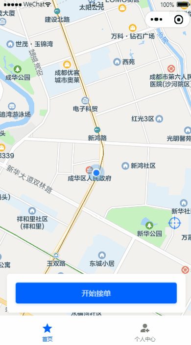
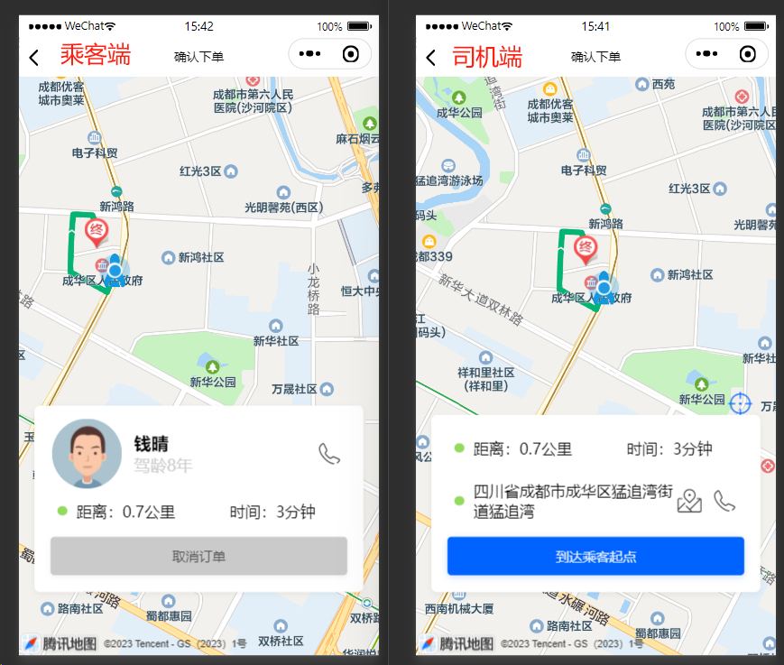
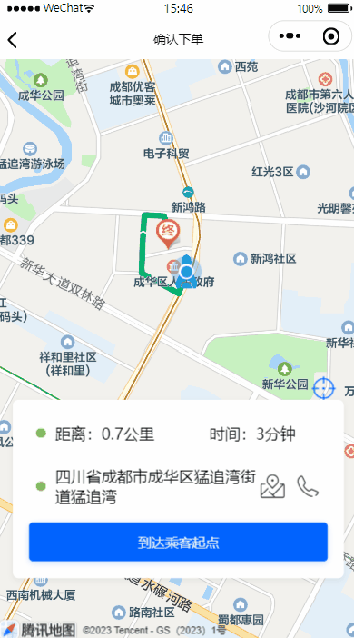
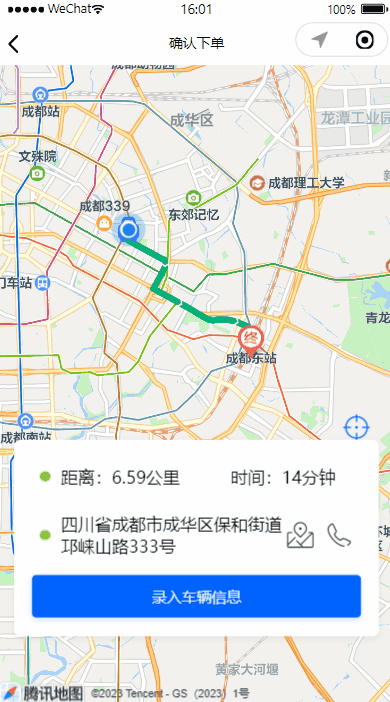

# 代驾：订单执行

## 一、加载当前订单

无论司机端还是乘客端的小程序，如果遇到微信闪退、页面切换、重新登录小程序之后，只要页面回到首页，都必须加载当前的订单，然后跳转到当前订单的执行状态页面。

前面我们写了模拟接口，当前我们来把这部分接口实现了。

司机端效果如图（乘客端类似）：




### 1、乘客端查找当前订单

#### 1.1、订单微服务接口

##### 1.1.1、OrderInfoController

```java
@Operation(summary = "乘客端查找当前订单")
@GetMapping("/searchCustomerCurrentOrder/{customerId}")
public Result<CurrentOrderInfoVo> searchCustomerCurrentOrder(@PathVariable Long customerId) {
   return Result.ok(orderInfoService.searchCustomerCurrentOrder(customerId));
}
```

##### 1.1.2、OrderInfoService

```java
CurrentOrderInfoVo searchCustomerCurrentOrder(Long customerId);
```

##### 1.1.3、OrderInfoServiceImp

```java
@Override
public CurrentOrderInfoVo searchCustomerCurrentOrder(Long customerId) {
    LambdaQueryWrapper<OrderInfo> queryWrapper = new LambdaQueryWrapper<>();
    queryWrapper.eq(OrderInfo::getCustomerId, customerId);
    //乘客端支付完订单，乘客端主要流程就走完（当前这些节点，乘客端会调整到相应的页面处理逻辑）
    Integer[] statusArray = {
        OrderStatus.ACCEPTED.getStatus(),
        OrderStatus.DRIVER_ARRIVED.getStatus(),
        OrderStatus.UPDATE_CART_INFO.getStatus(),
        OrderStatus.START_SERVICE.getStatus(),
        OrderStatus.END_SERVICE.getStatus(),
        OrderStatus.UNPAID.getStatus()
    };
    queryWrapper.in(OrderInfo::getStatus, statusArray);
    queryWrapper.orderByDesc(OrderInfo::getId);
    queryWrapper.last("limit 1");
    OrderInfo orderInfo = orderInfoMapper.selectOne(queryWrapper);
    CurrentOrderInfoVo currentOrderInfoVo = new CurrentOrderInfoVo();
    if(null != orderInfo) {
        currentOrderInfoVo.setStatus(orderInfo.getStatus());
        currentOrderInfoVo.setOrderId(orderInfo.getId());
        currentOrderInfoVo.setIsHasCurrentOrder(true);
    } else {
        currentOrderInfoVo.setIsHasCurrentOrder(false);
    }
    return currentOrderInfoVo;
}
```

#### 1.2、Feign接口

##### 1.2.1、OrderInfoFeignClient

```java
/**
 * 乘客端查找当前订单
 * @param customerId
 * @return
 */
@GetMapping("/order/info/searchCustomerCurrentOrder/{customerId}")
Result<CurrentOrderInfoVo> searchCustomerCurrentOrder(@PathVariable("customerId") Long customerId);
```

#### 1.3、司机端web接口

##### 1.3.1、OrderController

```java
@Operation(summary = "乘客端查找当前订单")
@GuiguLogin
@GetMapping("/searchCustomerCurrentOrder")
public Result<CurrentOrderInfoVo> searchCustomerCurrentOrder() {
    Long customerId = AuthContextHolder.getUserId();
    return Result.ok(orderService.searchCustomerCurrentOrder(customerId));
}
```

##### 1.3.2、OrderService

```java
CurrentOrderInfoVo searchCustomerCurrentOrder(Long customerId);
```

##### 1.3.3、OrderServiceImpl

```java
@Override
public CurrentOrderInfoVo searchCustomerCurrentOrder(Long customerId) {
    return orderInfoFeignClient.searchCustomerCurrentOrder(customerId).getData();
}
```


### 2、司机端查找当前订单

#### 2.1、订单微服务接口

##### 2.1.1、OrderInfoController

```java
@Operation(summary = "司机端查找当前订单")
@GetMapping("/searchDriverCurrentOrder/{driverId}")
public Result<CurrentOrderInfoVo> searchDriverCurrentOrder(@PathVariable Long driverId) {
    return Result.ok(orderInfoService.searchDriverCurrentOrder(driverId));
}
```

##### 2.1.2、OrderInfoService

```java
CurrentOrderInfoVo searchDriverCurrentOrder(Long driverId);
```

##### 2.1.3、OrderInfoServiceImp

```java
@Override
public CurrentOrderInfoVo searchDriverCurrentOrder(Long driverId) {
    LambdaQueryWrapper<OrderInfo> queryWrapper = new LambdaQueryWrapper<>();
    queryWrapper.eq(OrderInfo::getDriverId, driverId);
    //司机发送完账单，司机端主要流程就走完（当前这些节点，司机端会调整到相应的页面处理逻辑）
    Integer[] statusArray = {
        OrderStatus.ACCEPTED.getStatus(),
        OrderStatus.DRIVER_ARRIVED.getStatus(),
        OrderStatus.UPDATE_CART_INFO.getStatus(),
        OrderStatus.START_SERVICE.getStatus(),
        OrderStatus.END_SERVICE.getStatus()
    };
    queryWrapper.in(OrderInfo::getStatus, statusArray);
    queryWrapper.orderByDesc(OrderInfo::getId);
    queryWrapper.last("limit 1");
    OrderInfo orderInfo = orderInfoMapper.selectOne(queryWrapper);
    CurrentOrderInfoVo currentOrderInfoVo = new CurrentOrderInfoVo();
    if(null != orderInfo) {
        currentOrderInfoVo.setStatus(orderInfo.getStatus());
        currentOrderInfoVo.setOrderId(orderInfo.getId());
        currentOrderInfoVo.setIsHasCurrentOrder(true);
    } else {
        currentOrderInfoVo.setIsHasCurrentOrder(false);
    }
    return currentOrderInfoVo;
}
```

#### 2.2、Feign接口

##### 2.2.1、OrderInfoFeignClient

```java
/**
 * 司机端查找当前订单
 * @param driverId
 * @return
 */
@GetMapping("/order/info/searchDriverCurrentOrder/{driverId}")
Result<CurrentOrderInfoVo> searchDriverCurrentOrder(@PathVariable("driverId") Long driverId);
```

#### 2.3、司机端web接口

##### 2.3.1、OrderController

```java
@Operation(summary = "司机端查找当前订单")
@GuiguLogin
@GetMapping("/searchDriverCurrentOrder")
public Result<CurrentOrderInfoVo> searchDriverCurrentOrder() {
    Long driverId = AuthContextHolder.getUserId();
    return Result.ok(orderService.searchDriverCurrentOrder(driverId));
}
```

##### 2.3.2、OrderService

```java
CurrentOrderInfoVo searchDriverCurrentOrder(Long driverId);
```

##### 2.3.3、OrderServiceImpl

```java
@Override
public CurrentOrderInfoVo searchDriverCurrentOrder(Long driverId) {
   return orderInfoFeignClient.searchDriverCurrentOrder(driverId).getData();
}
```


### 3、获取订单信息

进入首页，在有执行中订单的情况下，我们需要获取订单信息，才能知道页面跳转到那里去，因此现在把这个接口给实现了。

#### 3.1、订单微服务接口

##### 3.1.1、OrderInfoController

```java
@Operation(summary = "根据订单id获取订单信息")
@GetMapping("/getOrderInfo/{orderId}")
public Result<OrderInfo> getOrderInfo(@PathVariable Long orderId) {
   return Result.ok(orderInfoService.getById(orderId));
}
```

#### 3.2、Feign接口

##### 3.2.1、OrderInfoFeignClient

```
/**
 * 根据订单id获取订单信息
 * @param orderId
 * @return
 */
@GetMapping("/order/info/getOrderInfo/{orderId}")
Result<OrderInfo> getOrderInfo(@PathVariable("orderId") Long orderId);
```

#### 3.3、乘客端web接口

##### 3.3.1、OrderController

```java
@Operation(summary = "获取订单信息")
@GuiguLogin
@GetMapping("/getOrderInfo/{orderId}")
public Result<OrderInfoVo> getOrderInfo(@PathVariable Long orderId) {
    Long customerId = AuthContextHolder.getUserId();
    return Result.ok(orderService.getOrderInfo(orderId, customerId));
}
```

##### 3.3.2、OrderService

```java
 OrderInfoVo getOrderInfo(Long orderId, Long customerId);
```

##### 3.3.3、OrderServiceImpl

订单的各个状态，获取的订单信息不一样，当前我们只是获取订单基本信息，后续完善

```java
@Override
public OrderInfoVo getOrderInfo(Long orderId, Long customerId) {
    //订单信息
    OrderInfo orderInfo = orderInfoFeignClient.getOrderInfo(orderId).getData();
    if (orderInfo.getCustomerId().longValue() != customerId.longValue()) {
        throw new GuiguException(ResultCodeEnum.ILLEGAL_REQUEST);
    }

    //封装订单信息
    OrderInfoVo orderInfoVo = new OrderInfoVo();
    orderInfoVo.setOrderId(orderId);
    BeanUtils.copyProperties(orderInfo, orderInfoVo);
    return orderInfoVo;
}
```

#### 3.4、司机web接口

##### 3.4.1、OrderController

```java
@Operation(summary = "获取订单账单详细信息")
@GuiguLogin
@GetMapping("/getOrderInfo/{orderId}")
public Result<OrderInfoVo> getOrderInfo(@PathVariable Long orderId) {
    Long driverId = AuthContextHolder.getUserId();
    return Result.ok(orderService.getOrderInfo(orderId, driverId));
}
```

##### 3.4.2、OrderService

```java
 OrderInfoVo getOrderInfo(Long orderId, Long customerId);
```

##### 3.4.3、OrderServiceImpl

订单的各个状态，获取的订单信息不一样，当前我们只是获取订单基本信息，后续完善

```java
@Override
public OrderInfoVo getOrderInfo(Long orderId, Long driverId) {
   //订单信息
   OrderInfo orderInfo = orderInfoFeignClient.getOrderInfo(orderId).getData();
   if(orderInfo.getDriverId().longValue() != driverId.longValue()) {
      throw new GuiguException(ResultCodeEnum.ILLEGAL_REQUEST);
   }

   //封装订单信息
   OrderInfoVo orderInfoVo = new OrderInfoVo();
   orderInfoVo.setOrderId(orderId);
   BeanUtils.copyProperties(orderInfo, orderInfoVo);
   return orderInfoVo;
}
```


## 二、司乘同显

司机抢单成功后要赶往上车点，我们要计算司机赶往上车点的最佳线路，司机端与乘客端都要显示司机乘同显，这样乘客就能实时看见司机的动向。



### 1、司机端司乘同显

司机端司乘同显要简单一些，司机的地点就是司乘同显的起始点，代驾起点就是司乘同显的终点，知道起点与终点，我们就可以计算出最佳线路，根据最佳线路在小程序地图组件上一渲染就可以了

#### 1.1、司机端web接口

前面我们在地图微服务已经实现过了“计算最佳驾驶线路”接口，这里只需要在提供司机端web接口即可

##### 1.1.1、OrderController

```java
@Operation(summary = "计算最佳驾驶线路")
@GuiguLogin
@PostMapping("/calculateDrivingLine")
public Result<DrivingLineVo> calculateDrivingLine(@RequestBody CalculateDrivingLineForm calculateDrivingLineForm) {
   return Result.ok(orderService.calculateDrivingLine(calculateDrivingLineForm));
}
```

##### 1.1.2、OrderService

```java
DrivingLineVo calculateDrivingLine(CalculateDrivingLineForm calculateDrivingLineForm);
```

##### 1.1.3、OrderServiceImpl

```java
@Autowired
private MapFeignClient mapFeignClient;

@Override
public DrivingLineVo calculateDrivingLine(CalculateDrivingLineForm calculateDrivingLineForm) {
   return mapFeignClient.calculateDrivingLine(calculateDrivingLineForm).getData();
}
```


### 2、更新订单位置到Redis缓存

司机赶往代驾点，会实时更新司机的经纬度位置到Redis缓存，这样乘客端才能看见司机的动向，司机端更新，乘客端获取。

#### 2.1、地图微服务接口

##### 2.1.1、LocationController

```java
@Operation(summary = "司机赶往代驾起始点：更新订单地址到缓存")
@PostMapping("/updateOrderLocationToCache")
public Result<Boolean> updateOrderLocationToCache(@RequestBody UpdateOrderLocationForm updateOrderLocationForm) {
   return Result.ok(locationService.updateOrderLocationToCache(updateOrderLocationForm));
}
```

##### 2.1.2、LocationService

```java
Boolean updateOrderLocationToCache(UpdateOrderLocationForm updateOrderLocationForm);
```

##### 2.1.3、LocationServiceImpl

```java
@Override
public Boolean updateOrderLocationToCache(UpdateOrderLocationForm updateOrderLocationForm) {
    OrderLocationVo orderLocationVo = new OrderLocationVo();
    orderLocationVo.setLongitude(updateOrderLocationForm.getLongitude());
    orderLocationVo.setLatitude(updateOrderLocationForm.getLatitude());
    redisTemplate.opsForValue().set(RedisConstant.UPDATE_ORDER_LOCATION + updateOrderLocationForm.getOrderId(), orderLocationVo);
    return true;
}
```

#### 2.2、Feign接口

##### 2.2.1、LocationFeignClient

```java
/**
 * 司机赶往代驾起始点：更新订单地址到缓存
 * @param updateOrderLocationForm
 * @return
 */
@PostMapping("/map/location/updateOrderLocationToCache")
Result<Boolean> updateOrderLocationToCache(@RequestBody UpdateOrderLocationForm updateOrderLocationForm);
```

#### 2.3、司机端web接口

##### 2.3.1、LocationController

```java
@Operation(summary = "司机赶往代驾起始点：更新订单位置到Redis缓存")
@GuiguLogin
@PostMapping("/updateOrderLocationToCache")
public Result updateOrderLocationToCache(@RequestBody UpdateOrderLocationForm updateOrderLocationForm) {
   return Result.ok(locationService.updateOrderLocationToCache(updateOrderLocationForm));
}
```

##### 2.3.2、LocationService

```java
Boolean updateOrderLocationToCache(UpdateOrderLocationForm updateOrderLocationForm);
```

##### 2.3.3、LocationServiceImpl

```java
@Override
public Boolean updateOrderLocationToCache(UpdateOrderLocationForm updateOrderLocationForm) {
    return locationFeignClient.updateOrderLocationToCache(updateOrderLocationForm).getData();
}
```


### 3、获取司机基本信息

乘客端进入司乘同显页面，需要加载司机的基本信息，显示司机的姓名、头像及驾龄等信息

#### 3.1、司机微服务接口

##### 3.1.1、DriverInfoController

```java
@Operation(summary = "获取司机基本信息")
@GetMapping("/getDriverInfo/{driverId}")
public Result<DriverInfoVo> getDriverInfo(@PathVariable Long driverId) {
   return Result.ok(driverInfoService.getDriverInfo(driverId));
}
```

##### 3.1.2、DriverInfoService

```java
DriverInfoVo getDriverInfo(Long driverId);
```

##### 3.1.3、DriverInfoServiceImpl

```java
@Override
public DriverInfoVo getDriverInfo(Long driverId) {
    DriverInfo driverInfo = this.getById(driverId);
    DriverInfoVo driverInfoVo = new DriverInfoVo();
    BeanUtils.copyProperties(driverInfo, driverInfoVo);
    //驾龄
    Integer driverLicenseAge = new DateTime().getYear() - new DateTime(driverInfo.getDriverLicenseIssueDate()).getYear() + 1;
    driverInfoVo.setDriverLicenseAge(driverLicenseAge);
    return driverInfoVo;
}
```

#### 3.2、Feign接口

##### 3.2.1、DriverInfoFeignClient

```java
/**
 * 获取司机基本信息
 * @param driverId
 * @return
 */
@GetMapping("/driver/info/getDriverInfo/{driverId}")
Result<DriverInfoVo> getDriverInfo(@PathVariable("driverId") Long driverId);
```

#### 3.3、乘客端web接口

##### 3.3.1、OrderController

```java
@Operation(summary = "根据订单id获取司机基本信息")
@GuiguLogin
@GetMapping("/getDriverInfo/{orderId}")
public Result<DriverInfoVo> getDriverInfo(@PathVariable Long orderId) {
    Long customerId = AuthContextHolder.getUserId();
    return Result.ok(orderService.getDriverInfo(orderId, customerId));
}
```

##### 3.3.2、OrderService

```java
DriverInfoVo getDriverInfo(Long orderId, Long customerId);
```

##### 3.3.2、OrderServiceImpl

```java
@Override
public DriverInfoVo getDriverInfo(Long orderId, Long customerId) {
    OrderInfo orderInfo = orderInfoFeignClient.getOrderInfo(orderId).getData();
    if (orderInfo.getCustomerId().longValue() != customerId.longValue()) {
        throw new GuiguException(ResultCodeEnum.ILLEGAL_REQUEST);
    }
    return driverInfoFeignClient.getDriverInfo(orderInfo.getDriverId()).getData();
}
```


### 4、乘客端获取订单经纬度位置

#### 4.1、地图微服务接口

##### 4.1.1、LocationController

```java
@Operation(summary = "司机赶往代驾起始点：获取订单经纬度位置")
@GetMapping("/getCacheOrderLocation/{orderId}")
public Result<OrderLocationVo> getCacheOrderLocation(@PathVariable Long orderId) {
   return Result.ok(locationService.getCacheOrderLocation(orderId));
}
```

##### 4.1.2、LocationService

```java
OrderLocationVo getCacheOrderLocation(Long orderId);
```

##### 4.1.3、LocationServiceImpl

```java
@Override
public OrderLocationVo getCacheOrderLocation(Long orderId) {
    OrderLocationVo orderLocationVo = (OrderLocationVo)redisTemplate.opsForValue().get(RedisConstant.UPDATE_ORDER_LOCATION + orderId);
    return orderLocationVo;
}
```

#### 4.2、Feign接口

##### 4.2.1、LocationFeignClient

```java
/**
 * 司机赶往代驾起始点：获取订单经纬度位置
 * @param orderId
 * @return
 */
@GetMapping("/map/location/getCacheOrderLocation/{orderId}")
Result<OrderLocationVo> getCacheOrderLocation(@PathVariable("orderId") Long orderId);
```

#### 4.3、乘客端web接口

##### 4.3.1、OrderController

```java
@Operation(summary = "司机赶往代驾起始点：获取订单经纬度位置")
@GuiguLogin
@GetMapping("/getCacheOrderLocation/{orderId}")
public Result<OrderLocationVo> getOrderLocation(@PathVariable Long orderId) {
   return Result.ok(orderService.getCacheOrderLocation(orderId));
}
```

##### 4.3.3、OrderService

```java
OrderLocationVo getCacheOrderLocation(Long orderId);
```

##### 4.3.3、OrderServiceImpl

```java
@Override
public OrderLocationVo getCacheOrderLocation(Long orderId) {
    return locationFeignClient.getCacheOrderLocation(orderId).getData();
}
```


### 5、乘客端司乘同显

#### 5.1、乘客端web接口

##### 5.1.1、OrderController

```java
@Operation(summary = "计算最佳驾驶线路")
@GuiguLogin
@PostMapping("/calculateDrivingLine")
public Result<DrivingLineVo> calculateDrivingLine(@RequestBody CalculateDrivingLineForm calculateDrivingLineForm) {
    return Result.ok(orderService.calculateDrivingLine(calculateDrivingLineForm));
}
```

##### 5.1.2、OrderService

```java
DrivingLineVo calculateDrivingLine(CalculateDrivingLineForm calculateDrivingLineForm);
```

##### 5.1.3、OrderServiceImpl

```java
@Override
public DrivingLineVo calculateDrivingLine(CalculateDrivingLineForm calculateDrivingLineForm) {
    return mapFeignClient.calculateDrivingLine(calculateDrivingLineForm).getData();
}
```


## 三、司机到达起始点

司机到达代驾起始点，司机手动触发“到达乘客起点”按钮，更新订单状态



### 1、司机到达代驾起始点

#### 1.1、订单微服务接口

##### 1.1.1、OrderInfoController

```java
@Operation(summary = "司机到达起始点")
@GetMapping("/driverArriveStartLocation/{orderId}/{driverId}")
public Result<Boolean> driverArriveStartLocation(@PathVariable Long orderId, @PathVariable Long driverId) {
   return Result.ok(orderInfoService.driverArriveStartLocation(orderId, driverId));
}
```

##### 1.1.2、OrderInfoService

```java
Boolean driverArriveStartLocation(Long orderId, Long driverId);
```

##### 1.1.3、OrderInfoServiceImp

```java
@Transactional(rollbackFor = Exception.class)
@Override
public Boolean driverArriveStartLocation(Long orderId, Long driverId) {
   LambdaQueryWrapper<OrderInfo> queryWrapper = new LambdaQueryWrapper<>();
   queryWrapper.eq(OrderInfo::getId, orderId);
   queryWrapper.eq(OrderInfo::getDriverId, driverId);

   OrderInfo updateOrderInfo = new OrderInfo();
   updateOrderInfo.setStatus(OrderStatus.DRIVER_ARRIVED.getStatus());
   updateOrderInfo.setArriveTime(new Date());
   //只能更新自己的订单
   int row = orderInfoMapper.update(updateOrderInfo, queryWrapper);
   if(row == 1) {
      //记录日志
      this.log(orderId, OrderStatus.DRIVER_ARRIVED.getStatus());
   } else {
      throw new GuiguException(ResultCodeEnum.UPDATE_ERROR);
   }
   return true;
}
```

#### 1.2、Feign接口

##### 1.2.1、OrderInfoFeignClient

```java
/**
 * 司机到达起始点
 * @param orderId
 * @param driverId
 * @return
 */
@GetMapping("/order/info/driverArriveStartLocation/{orderId}/{driverId}")
Result<Boolean> driverArriveStartLocation(@PathVariable("orderId") Long orderId, @PathVariable("driverId") Long driverId);
```

#### 1.3、司机端web接口

##### 1.3.1、OrderController

```java
@Operation(summary = "司机到达代驾起始地点")
@GuiguLogin
@GetMapping("/driverArriveStartLocation/{orderId}")
public Result<Boolean> driverArriveStartLocation(@PathVariable Long orderId) {
    Long driverId = AuthContextHolder.getUserId();
    return Result.ok(orderService.driverArriveStartLocation(orderId, driverId));
}
```

##### 1.3.2、OrderService

```java
 Boolean driverArriveStartLocation(Long orderId, Long driverId);
```

##### 1.3.3、OrderServiceImpl

```java
@Override
public Boolean driverArriveStartLocation(Long orderId, Long driverId) {
   return orderInfoFeignClient.driverArriveStartLocation(orderId, driverId).getData();
}
```


## 四、司机更新代驾车辆信息

司机到达代驾起始点，联系了乘客，见到了代驾车辆，要拍照与录入车辆信息



### 1、司机更新代驾车辆信息

#### 1.1、订单微服务接口

##### 1.1.1、OrderInfoController

```java
@Operation(summary = "更新代驾车辆信息")
@PostMapping("/updateOrderCart")
public Result<Boolean> updateOrderCart(@RequestBody UpdateOrderCartForm updateOrderCartForm) {
    return Result.ok(orderInfoService.updateOrderCart(updateOrderCartForm));
}
```

##### 1.1.2、OrderInfoService

```java
Boolean updateOrderCart(UpdateOrderCartForm updateOrderCartForm);
```

##### 1.1.3、OrderInfoServiceImp

```java
@Transactional(rollbackFor = Exception.class)
@Override
public Boolean updateOrderCart(UpdateOrderCartForm updateOrderCartForm) {
    LambdaQueryWrapper<OrderInfo> queryWrapper = new LambdaQueryWrapper<>();
    queryWrapper.eq(OrderInfo::getId, updateOrderCartForm.getOrderId());
    queryWrapper.eq(OrderInfo::getDriverId, updateOrderCartForm.getDriverId());

    OrderInfo updateOrderInfo = new OrderInfo();
    BeanUtils.copyProperties(updateOrderCartForm, updateOrderInfo);
    updateOrderInfo.setStatus(OrderStatus.UPDATE_CART_INFO.getStatus());
    //只能更新自己的订单
    int row = orderInfoMapper.update(updateOrderInfo, queryWrapper);
    if(row == 1) {
        //记录日志
        this.log(updateOrderCartForm.getOrderId(), OrderStatus.UPDATE_CART_INFO.getStatus());
    } else {
        throw new GuiguException(ResultCodeEnum.UPDATE_ERROR);
    }
    return true;
}
```

#### 1.2、Feign接口

##### 1.2.1、OrderInfoFeignClient

```java
/**
 * 更新代驾车辆信息
 * @param updateOrderCartForm
 * @return
 */
@PostMapping("/order/info//updateOrderCart")
Result<Boolean> updateOrderCart(@RequestBody UpdateOrderCartForm updateOrderCartForm);
```

#### 1.3、司机端web接口

##### 1.3.1、OrderController

```java
@Operation(summary = "更新代驾车辆信息")
@GuiguLogin
@PostMapping("/updateOrderCart")
public Result<Boolean> updateOrderCart(@RequestBody UpdateOrderCartForm updateOrderCartForm) {
    Long driverId = AuthContextHolder.getUserId();
    updateOrderCartForm.setDriverId(driverId);
    return Result.ok(orderService.updateOrderCart(updateOrderCartForm));
}
```

##### 1.3.2、OrderService

```java
Boolean updateOrderCart(UpdateOrderCartForm updateOrderCartForm);
```

##### 1.3.3、OrderServiceImpl

```java
@Override
public Boolean updateOrderCart(UpdateOrderCartForm updateOrderCartForm) {
   return orderInfoFeignClient.updateOrderCart(updateOrderCartForm).getData();
}
```

